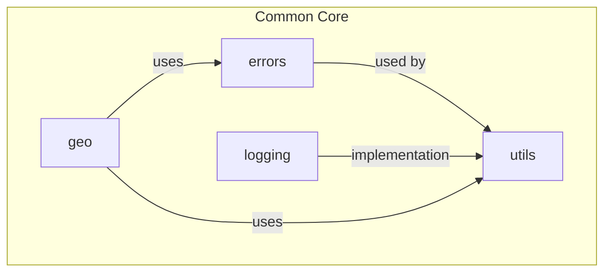
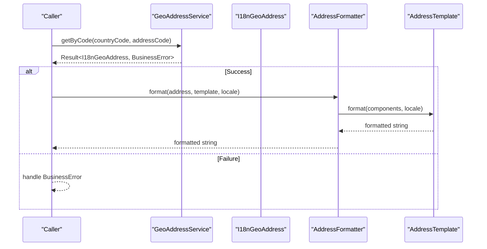
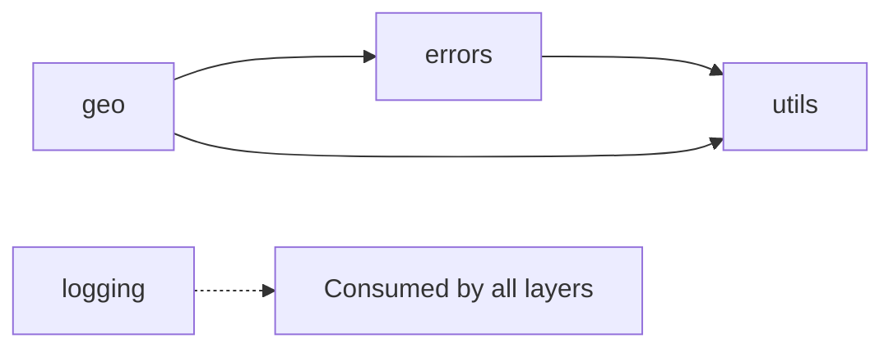

# Shared Utilities & Common Functions

<cite>
**Referenced Files in This Document**
- [BusinessError.kt](file://j-store-common-core/src/main/kotlin/com/jstore/common/errors/BusinessError.kt)
- [Errors.kt](file://j-store-common-core/src/main/kotlin/com/jstore/common/errors/Errors.kt)
- [Logger.kt](file://j-store-common-core/src/main/kotlin/com/jstore/common/logging/Logger.kt)
- [LoggerFactory.kt](file://j-store-common-core/src/main/kotlin/com/jstore/common/logging/LoggerFactory.kt)
- [Slf4jImpl.kt](file://j-store-common-core/src/main/kotlin/com/jstore/common/logging/slf4j/Slf4jImpl.kt)
- [LogException.kt](file://j-store-common-core/src/main/kotlin/com/jstore/common/logging/LogException.kt)
- [Result.kt](file://j-store-common-core/src/main/kotlin/com/jstore/common/utils/Result.kt)
- [ListenableFuture.kt](file://j-store-common-core/src/main/kotlin/com/jstore/common/utils/concurrent/ListenableFuture.kt)
- [SettableListenableFuture.kt](file://j-store-common-core/src/main/kotlin/com/jstore/common/utils/concurrent/SettableListenableFuture.kt)
- [GeoAddressService.kt](file://j-store-common-core/src/main/kotlin/com/jstore/common/geo/GeoAddressService.kt)
- [CountryCode.kt](file://j-store-common-core/src/main/kotlin/com/jstore/common/geo/CountryCode.kt)
- [I18nGeoAddress.kt](file://j-store-common-core/src/main/kotlin/com/jstore/common/geo/I18nGeoAddress.kt)
- [AddressComponent.kt](file://j-store-common-core/src/main/kotlin/com/jstore/common/geo/AddressComponent.kt)
- [AddressTemplate.kt](file://j-store-common-core/src/main/kotlin/com/jstore/common/geo/AddressTemplate.kt)
- [AddressFormatter.kt](file://j-store-common-core/src/main/kotlin/com/jstore/common/geo/AddressFormatter.kt)
</cite>

## Update Summary
**Changes Made**
- Enhanced Result type architecture with improved error handling patterns
- Added custom exception mapper functions for getOrThrow() method
- Implemented cause chaining support for ResultUnwrapException
- Enhanced CancellationException/InterruptedException handling in resultOf() and runResultOf() functions
- Updated practical examples to demonstrate new error handling capabilities

## Table of Contents
1. [Introduction](#introduction)
2. [Project Structure](#project-structure)
3. [Core Components](#core-components)
4. [Architecture Overview](#architecture-overview)
5. [Detailed Component Analysis](#detailed-component-analysis)
6. [Dependency Analysis](#dependency-analysis)
7. [Performance Considerations](#performance-considerations)
8. [Troubleshooting Guide](#troubleshooting-guide)
9. [Conclusion](#conclusion)
10. [Appendices](#appendices)

## Introduction
This document explains the shared utilities and common functions used across the application, focusing on:
- Error handling framework with BusinessError and Errors classes
- Logging abstractions via Logger interface and its SLF4J implementation
- Utility functions for result handling (Result types) and concurrent programming (ListenableFuture)
- Geographic address processing capabilities including country codes, address formatting, and internationalization support
It also provides practical examples and best practices for error propagation, logging conventions, and utility usage.

## Project Structure
The shared utilities are implemented in the j-store-common-core module under com.jstore.common:
- errors: BusinessError and Errors definitions
- logging: Logger interface, LoggerFactory, and SLF4J implementations
- utils: Result type and concurrency primitives
- geo: Country code validation, i18n address model, templates, and formatter



[No sources needed since this diagram shows conceptual structure]

## Core Components
- Error models:
  - BusinessError: a lightweight, serializable error descriptor with message, errorCode, and httpCode; includes a fluent msg() helper to override messages while preserving code and HTTP status.
  - Errors: a RuntimeException-based error carrying message, errorCode, httpCode, and optional cause; supports chaining with msg(), msgAndCause(), and cause().
- Logging:
  - Logger: an abstraction over logging frameworks with debug/info/warn/error methods and isDebugEnabled().
  - LoggerFactory: runtime selection of logger implementation; defaults to SLF4J adapter; throws LogException if initialization fails.
  - Slf4jSimpleImpl and Slf4jLoggerImpl: bridge to org.slf4j.Logger with location-aware optimization when available.
- Result types:
  - Result<T,E> sealed with Success and Failure; comprehensive combinators (map, flatMap, orElse, andThen-style and/or), safe unwrapping, and exception wrapping helpers.
  - Enhanced getOrThrow() with custom exception mapper functions for flexible error conversion.
  - Improved ResultUnwrapException with cause chaining support for better error context preservation.
  - Enhanced resultOf() and runResultOf() functions with proper CancellationException/InterruptedException handling.
- Concurrency:
  - ListenableFuture<T> extends Future<T> with callback registration.
  - SettableListenableFuture<T> provides a mutable future with setResult/setException and callback dispatch.
- Geo address:
  - CountryCode: immutable ISO 3166-1 alpha-2 value object with Jackson serialization and validation.
  - I18nGeoAddress: list of AddressComponent with convenience accessors.
  - AddressComponent: code, level, localized names map, default locale, and name lookup fallback.
  - AddressTemplate: per-country template for ordering and separators.
  - AddressFormatter: formats an I18nGeoAddress using a template and locale.
  - GeoAddressService: service interface returning Result<I18nGeoAddress, BusinessError>.

**Section sources**
- [BusinessError.kt:1-22](file://j-store-common-core/src/main/kotlin/com/jstore/common/errors/BusinessError.kt#L1-L22)
- [Errors.kt:1-44](file://j-store-common-core/src/main/kotlin/com/jstore/common/errors/Errors.kt#L1-L44)
- [Logger.kt:1-38](file://j-store-common-core/src/main/kotlin/com/jstore/common/logging/Logger.kt#L1-L38)
- [LoggerFactory.kt:1-65](file://j-store-common-core/src/main/kotlin/com/jstore/common/logging/LoggerFactory.kt#L1-L65)
- [Slf4jImpl.kt:1-191](file://j-store-common-core/src/main/kotlin/com/jstore/common/logging/slf4j/Slf4jImpl.kt#L1-L191)
- [LogException.kt:1-18](file://j-store-common-core/src/main/kotlin/com/jstore/common/logging/LogException.kt#L1-L18)
- [Result.kt:1-274](file://j-store-common-core/src/main/kotlin/com/jstore/common/utils/Result.kt#L1-L274)
- [ListenableFuture.kt:1-20](file://j-store-common-core/src/main/kotlin/com/jstore/common/utils/concurrent/ListenableFuture.kt#L1-L20)
- [SettableListenableFuture.kt:1-93](file://j-store-common-core/src/main/kotlin/com/jstore/common/utils/concurrent/SettableListenableFuture.kt#L1-L93)
- [GeoAddressService.kt:1-9](file://j-store-common-core/src/main/kotlin/com/jstore/common/geo/GeoAddressService.kt#L1-L9)
- [CountryCode.kt:1-27](file://j-store-common-core/src/main/kotlin/com/jstore/common/geo/CountryCode.kt#L1-L27)
- [I18nGeoAddress.kt:1-22](file://j-store-common-core/src/main/kotlin/com/jstore/common/geo/I18nGeoAddress.kt#L1-L22)
- [AddressComponent.kt:1-41](file://j-store-common-core/src/main/kotlin/com/jstore/common/geo/AddressComponent.kt#L1-L41)
- [AddressTemplate.kt:1-9](file://j-store-common-core/src/main/kotlin/com/jstore/common/geo/AddressTemplate.kt#L1-L9)
- [AddressFormatter.kt:1-12](file://j-store-common-core/src/main/kotlin/com/jstore/common/geo/AddressFormatter.kt#L1-L12)

## Architecture Overview
The utilities form a cohesive foundation layer:
- All business logic can return Result<T,BusinessError> to propagate errors without exceptions.
- Exceptions are modeled via Errors for cases where throwing is appropriate; they carry structured metadata (code, httpCode).
- Logging is decoupled through Logger and LoggerFactory, defaulting to SLF4J.
- Geographic data uses strongly-typed CountryCode and I18nGeoAddress with templates for localization.

```mermaid
classDiagram
class BusinessError {
+message : String
+errorCode : String
+httpCode : Int
+msg(message) : BusinessError
}
class Errors {
+msg(msg) : Errors
+msgAndCause(msg, cause) : Errors
+cause(cause) : Errors
}
class Logger {
+isDebugEnabled() : Boolean
+debug(...)
+info(...)
+warn(...)
+error(...)
}
class LoggerFactory {
+getLogger(name) : Logger
}
class Slf4jSimpleImpl {
}
class Slf4jLoggerImpl {
}
class Result~T,E~ {
+isSuccess : Boolean
+isFailure : Boolean
+getOrThrow(exceptionMapper) : T
+expect(message) : T
}
class Success~T~ {
+value : T
}
class Failure~E~ {
+error : E
}
class ResultUnwrapException {
+message : String
+cause : Throwable?
}
class ListenableFuture~T~ {
+addCallback(callback)
+addCallback(success,failure)
}
class SettableListenableFuture~T~ {
+set(value)
+setException(ex)
}
class GeoAddressService {
+getByCode(countryCode,addressCode) : Result~I18nGeoAddress,BusinessError~
}
class CountryCode {
+value : String
}
class I18nGeoAddress {
+countryCode : CountryCode
+components : AddressComponent[]
+getComponentAtLevel(depth) : AddressComponent?
+getLeafCode() : String
}
class AddressComponent {
+code : String
+level : DivisionLevel
+names : Map~Locale,String~
+defaultLocale : Locale
+getName(locale) : String
+getDefaultName() : String
}
class AddressTemplate {
+format(components,locale) : String
}
class AddressFormatter {
+format(address,template,locale) : String
}
Slf4jSimpleImpl ..|> Logger
Slf4jLoggerImpl ..|> Logger
LoggerFactory --> Logger : "creates"
Result <|-- Success
Result <|-- Failure
SettableListenableFuture ..|> ListenableFuture
GeoAddressService --> Result : "returns"
I18nGeoAddress --> AddressComponent : "contains"
AddressFormatter --> AddressTemplate : "uses"
```



**Diagram sources**
- [BusinessError.kt:1-22](file://j-store-common-core/src/main/kotlin/com/jstore/common/errors/BusinessError.kt#L1-L22)
- [Errors.kt:1-44](file://j-store-common-core/src/main/kotlin/com/jstore/common/errors/Errors.kt#L1-L44)
- [Logger.kt:1-38](file://j-store-common-core/src/main/kotlin/com/jstore/common/logging/Logger.kt#L1-L38)
- [LoggerFactory.kt:1-65](file://j-store-common-core/src/main/kotlin/com/jstore/common/logging/LoggerFactory.kt#L1-L65)
- [Slf4jImpl.kt:1-191](file://j-store-common-core/src/main/kotlin/com/jstore/common/logging/slf4j/Slf4jImpl.kt#L1-L191)
- [Result.kt:1-274](file://j-store-common-core/src/main/kotlin/com/jstore/common/utils/Result.kt#L1-L274)
- [ListenableFuture.kt:1-20](file://j-store-common-core/src/main/kotlin/com/jstore/common/utils/concurrent/ListenableFuture.kt#L1-L20)
- [SettableListenableFuture.kt:1-93](file://j-store-common-core/src/main/kotlin/com/jstore/common/utils/concurrent/SettableListenableFuture.kt#L1-L93)
- [GeoAddressService.kt:1-9](file://j-store-common-core/src/main/kotlin/com/jstore/common/geo/GeoAddressService.kt#L1-L9)
- [CountryCode.kt:1-27](file://j-store-common-core/src/main/kotlin/com/jstore/common/geo/CountryCode.kt#L1-L27)
- [I18nGeoAddress.kt:1-22](file://j-store-common-core/src/main/kotlin/com/jstore/common/geo/I18nGeoAddress.kt#L1-L22)
- [AddressComponent.kt:1-41](file://j-store-common-core/src/main/kotlin/com/jstore/common/geo/AddressComponent.kt#L1-L41)
- [AddressTemplate.kt:1-9](file://j-store-common-core/src/main/kotlin/com/jstore/common/geo/AddressTemplate.kt#L1-L9)
- [AddressFormatter.kt:1-12](file://j-store-common-core/src/main/kotlin/com/jstore/common/geo/AddressFormatter.kt#L1-L12)

## Detailed Component Analysis

### Error Handling Framework
- BusinessError:
  - Purpose: represent non-exceptional failures with structured metadata (message, errorCode, httpCode).
  - Usage: define domain-specific error constants and use msg() to customize messages while keeping code/httpCode stable.
- Errors:
  - Purpose: exception-based error path with rich metadata and cause chaining.
  - Usage: throw when exceptional conditions occur; catch and translate to user-facing responses using errorCode and httpCode.

Best practices:
- Prefer Result<T,BusinessError> for expected failures (validation, not-found, conflict).
- Use Errors only for unexpected or unrecoverable conditions that must abort the current operation.
- Always include a stable errorCode for metrics/alerting and a meaningful httpCode for API layers.

Practical example paths:
- Define a domain error constant and override message: [BusinessError.kt:1-22](file://j-store-common-core/src/main/kotlin/com/jstore/common/errors/BusinessError.kt#L1-L22)
- Throw and chain causes: [Errors.kt:1-44](file://j-store-common-core/src/main/kotlin/com/jstore/common/errors/Errors.kt#L1-L44)

**Section sources**
- [BusinessError.kt:1-22](file://j-store-common-core/src/main/kotlin/com/jstore/common/errors/BusinessError.kt#L1-L22)
- [Errors.kt:1-44](file://j-store-common-core/src/main/kotlin/com/jstore/common/errors/Errors.kt#L1-L44)

### Logging Abstractions
- Logger interface defines uniform logging APIs across levels and parameterizations.
- LoggerFactory selects an implementation at startup; defaults to SLF4J adapter.
- Slf4jSimpleImpl adapts to org.slf4j.Logger and optimizes for LocationAwareLogger when available.
- LogException signals configuration or initialization issues.

Implementation pattern:
- Obtain a logger via LoggerFactory.getLogger(clazz or name).
- Guard expensive log construction with isDebugEnabled() when necessary.

Custom logger:
- Implement Logger with a constructor taking a String name.
- Register your implementation by configuring LoggerFactory.setImplementation(...) equivalent or providing a factory hook as defined in the module.

Practical example paths:
- Interface definition: [Logger.kt:1-38](file://j-store-common-core/src/main/kotlin/com/jstore/common/logging/Logger.kt#L1-L38)
- Factory and initialization: [LoggerFactory.kt:1-65](file://j-store-common-core/src/main/kotlin/com/jstore/common/logging/LoggerFactory.kt#L1-L65)
- SLF4J adapter: [Slf4jImpl.kt:1-191](file://j-store-common-core/src/main/kotlin/com/jstore/common/logging/slf4j/Slf4jImpl.kt#L1-L191)
- Initialization exception: [LogException.kt:1-18](file://j-store-common-core/src/main/kotlin/com/jstore/common/logging/LogException.kt#L1-L18)

**Section sources**
- [Logger.kt:1-38](file://j-store-common-core/src/main/kotlin/com/jstore/common/logging/Logger.kt#L1-L38)
- [LoggerFactory.kt:1-65](file://j-store-common-core/src/main/kotlin/com/jstore/common/logging/LoggerFactory.kt#L1-L65)
- [Slf4jImpl.kt:1-191](file://j-store-common-core/src/main/kotlin/com/jstore/common/logging/slf4j/Slf4jImpl.kt#L1-L191)
- [LogException.kt:1-18](file://j-store-common-core/src/main/kotlin/com/jstore/common/logging/LogException.kt#L1-L18)

### Enhanced Result Types for Error Handling
- Result<T,E> with Success and Failure provides a functional alternative to exceptions.
- Key combinators:
  - map/mapError: transform success/error values.
  - flatMap: chain fallible operations.
  - orElse: recovery strategies based on error.
  - and/or: short-circuit composition.
  - getOrThrow/getErrorOrThrow/expect: assertive accessors for tests or boundaries.
  - resultOf/runResultOf: wrap blocks into Result with enhanced exception handling.
  - fold: explicit branching for success/failure.

**Updated** Enhanced error handling capabilities with custom exception mappers and improved exception management:

- **Custom Exception Mapper for getOrThrow()**: The getOrThrow() method now accepts a custom exception mapper function `(E) -> Throwable`, allowing developers to convert any error type into their preferred exception type with full control over the exception creation process.

- **Cause Chaining Support**: ResultUnwrapException now supports cause chaining through a `cause: Throwable? = null` parameter, enabling better error context preservation and debugging capabilities.

- **Enhanced Exception Handling**: Both resultOf() and runResultOf() functions now properly handle CancellationException and InterruptedException by rethrowing them without wrapping, ensuring proper cancellation semantics and thread interruption behavior.

Usage patterns:
- Return Result from services/repos to avoid exceptions in happy paths.
- Compose multiple steps with flatMap to keep control flow linear.
- Convert to Errors or BusinessError at boundary layers for response mapping.
- Use custom exception mappers in getOrThrow() for domain-specific exception types.

Practical example paths:
- Result API surface with enhanced features: [Result.kt:1-274](file://j-store-common-core/src/main/kotlin/com/jstore/common/utils/Result.kt#L1-L274)

**Section sources**
- [Result.kt:1-274](file://j-store-common-core/src/main/kotlin/com/jstore/common/utils/Result.kt#L1-L274)

### Concurrent Programming Utilities
- ListenableFuture<T>: Future with addCallback for success/failure handlers.
- SettableListenableFuture<T>: mutable future to set results or exceptions and dispatch callbacks.

Typical workflow:
- Create SettableListenableFuture, run work asynchronously, then set result or exception.
- Register callbacks to handle outcomes without blocking threads.

Practical example paths:
- Interfaces: [ListenableFuture.kt:1-20](file://j-store-common-core/src/main/kotlin/com/jstore/common/utils/concurrent/ListenableFuture.kt#L1-L20)
- Implementation: [SettableListenableFuture.kt:1-93](file://j-store-common-core/src/main/kotlin/com/jstore/common/utils/concurrent/SettableListenableFuture.kt#L1-L93)

**Section sources**
- [ListenableFuture.kt:1-20](file://j-store-common-core/src/main/kotlin/com/jstore/common/utils/concurrent/ListenableFuture.kt#L1-L20)
- [SettableListenableFuture.kt:1-93](file://j-store-common-core/src/main/kotlin/com/jstore/common/utils/concurrent/SettableListenableFuture.kt#L1-L93)

### Geographic Address Processing
- CountryCode: validates ISO 3166-1 alpha-2 format; Jackson-friendly serialization.
- I18nGeoAddress: ordered components representing administrative divisions; leaf code accessor.
- AddressComponent: code, level, localized names, default locale; getName(locale) with fallback.
- AddressTemplate: per-country formatting rules (order, separators).
- AddressFormatter: applies template to produce human-readable strings.
- GeoAddressService: returns Result<I18nGeoAddress, BusinessError> for lookups by country code and address code.

Data flow:


**Diagram sources**
- [GeoAddressService.kt:1-9](file://j-store-common-core/src/main/kotlin/com/jstore/common/geo/GeoAddressService.kt#L1-L9)
- [I18nGeoAddress.kt:1-22](file://j-store-common-core/src/main/kotlin/com/jstore/common/geo/I18nGeoAddress.kt#L1-L22)
- [AddressFormatter.kt:1-12](file://j-store-common-core/src/main/kotlin/com/jstore/common/geo/AddressFormatter.kt#L1-L12)
- [AddressTemplate.kt:1-9](file://j-store-common-core/src/main/kotlin/com/jstore/common/geo/AddressTemplate.kt#L1-L9)

Practical example paths:
- Country code validation: [CountryCode.kt:1-27](file://j-store-common-core/src/main/kotlin/com/jstore/common/geo/CountryCode.kt#L1-L27)
- Address model and helpers: [I18nGeoAddress.kt:1-22](file://j-store-common-core/src/main/kotlin/com/jstore/common/geo/I18nGeoAddress.kt#L1-L22), [AddressComponent.kt:1-41](file://j-store-common-core/src/main/kotlin/com/jstore/common/geo/AddressComponent.kt#L1-L41)
- Formatting: [AddressFormatter.kt:1-12](file://j-store-common-core/src/main/kotlin/com/jstore/common/geo/AddressFormatter.kt#L1-L12), [AddressTemplate.kt:1-9](file://j-store-common-core/src/main/kotlin/com/jstore/common/geo/AddressTemplate.kt#L1-L9)
- Service contract: [GeoAddressService.kt:1-9](file://j-store-common-core/src/main/kotlin/com/jstore/common/geo/GeoAddressService.kt#L1-L9)

**Section sources**
- [CountryCode.kt:1-27](file://j-store-common-core/src/main/kotlin/com/jstore/common/geo/CountryCode.kt#L1-L27)
- [I18nGeoAddress.kt:1-22](file://j-store-common-core/src/main/kotlin/com/jstore/common/geo/I18nGeoAddress.kt#L1-L22)
- [AddressComponent.kt:1-41](file://j-store-common-core/src/main/kotlin/com/jstore/common/geo/AddressComponent.kt#L1-L41)
- [AddressTemplate.kt:1-9](file://j-store-common-core/src/main/kotlin/com/jstore/common/geo/AddressTemplate.kt#L1-L9)
- [AddressFormatter.kt:1-12](file://j-store-common-core/src/main/kotlin/com/jstore/common/geo/AddressFormatter.kt#L1-L12)
- [GeoAddressService.kt:1-9](file://j-store-common-core/src/main/kotlin/com/jstore/common/geo/GeoAddressService.kt#L1-L9)

## Dependency Analysis
Key dependencies between modules:
- Geo package depends on errors (BusinessError) and utils (Result).
- Logging package is independent but consumed everywhere.
- Result types are widely used across services and utilities.



**Diagram sources**
- [BusinessError.kt:1-22](file://j-store-common-core/src/main/kotlin/com/jstore/common/errors/BusinessError.kt#L1-L22)
- [Errors.kt:1-44](file://j-store-common-core/src/main/kotlin/com/jstore/common/errors/Errors.kt#L1-L44)
- [Result.kt:1-274](file://j-store-common-core/src/main/kotlin/com/jstore/common/utils/Result.kt#L1-L274)
- [GeoAddressService.kt:1-9](file://j-store-common-core/src/main/kotlin/com/jstore/common/geo/GeoAddressService.kt#L1-L9)

**Section sources**
- [BusinessError.kt:1-22](file://j-store-common-core/src/main/kotlin/com/jstore/common/errors/BusinessError.kt#L1-L22)
- [Errors.kt:1-44](file://j-store-common-core/src/main/kotlin/com/jstore/common/errors/Errors.kt#L1-L44)
- [Result.kt:1-274](file://j-store-common-core/src/main/kotlin/com/jstore/common/utils/Result.kt#L1-L274)
- [GeoAddressService.kt:1-9](file://j-store-common-core/src/main/kotlin/com/jstore/common/geo/GeoAddressService.kt#L1-L9)

## Performance Considerations
- Logging:
  - Use isDebugEnabled() before constructing heavy log messages.
  - Prefer structured fields over string concatenation where supported by the underlying logger.
- Result:
  - Avoid unnecessary allocations by reusing combinators; prefer flatMap chains over nested calls.
  - Use getOrDefault or mapOrElse to compute defaults efficiently.
  - Custom exception mappers in getOrThrow() should be lightweight to avoid performance overhead.
- Concurrency:
  - Reuse SettableListenableFuture instances cautiously; ensure callbacks do not block long-running tasks.
  - Keep callback handlers small and asynchronous to prevent thread pool saturation.
- Geo formatting:
  - Cache AddressTemplate instances per country to avoid repeated instantiation.
  - Precompute frequently used locales to minimize Locale resolution overhead.

[No sources needed since this section provides general guidance]

## Troubleshooting Guide
- Logger initialization failure:
  - Symptom: LogException thrown when obtaining a logger.
  - Cause: No Logger implementation found or constructor mismatch.
  - Fix: Ensure a Logger implementation exists and has a constructor accepting a String name; verify LoggerFactory initialization path.
- Result unwrap exceptions:
  - Symptom: ResultUnwrapException when calling getOrThrow/getErrorOrThrow/expect on wrong branch.
  - Cause: Misuse of assertion helpers on incorrect Result state.
  - Fix: Validate isSuccess/isFailure before asserting; use mapOrElse or fold for safe handling.
  - Enhanced: Check cause chain in ResultUnwrapException for better debugging information.
- Custom exception mapper issues:
  - Symptom: Unexpected exception types from getOrThrow().
  - Cause: Incorrect exception mapper implementation.
  - Fix: Ensure mapper function returns appropriate exception type and handles all error cases.
- Cancellation and interruption handling:
  - Symptom: CancellationException or InterruptedException not properly propagated.
  - Cause: Using older versions of resultOf()/runResultOf().
  - Fix: Use updated versions that properly handle these exceptions without wrapping.
- Geo address validation:
  - Symptom: Validation errors for CountryCode or AddressComponent.
  - Cause: Invalid ISO code format or missing default locale in names map.
  - Fix: Ensure two-letter uppercase ISO code and provide at least one name entry including the default locale.

**Section sources**
- [LoggerFactory.kt:1-65](file://j-store-common-core/src/main/kotlin/com/jstore/common/logging/LoggerFactory.kt#L1-L65)
- [LogException.kt:1-18](file://j-store-common-core/src/main/kotlin/com/jstore/common/logging/LogException.kt#L1-L18)
- [Result.kt:1-274](file://j-store-common-core/src/main/kotlin/com/jstore/common/utils/Result.kt#L1-L274)
- [CountryCode.kt:1-27](file://j-store-common-core/src/main/kotlin/com/jstore/common/geo/CountryCode.kt#L1-L27)
- [AddressComponent.kt:1-41](file://j-store-common-core/src/main/kotlin/com/jstore/common/geo/AddressComponent.kt#L1-L41)

## Conclusion
The shared utilities provide a robust foundation for consistent error handling, logging, functional result management, and internationalized geographic data processing. By adopting Result-based flows, structured Errors, and a pluggable logging abstraction, teams can write predictable, testable, and maintainable code. The geo address toolkit enables precise, locale-aware formatting across countries while enforcing strong invariants.

**Updated** The enhanced Result type architecture with custom exception mappers, cause chaining support, and improved exception handling provides even more flexibility and reliability for error management throughout the application.

[No sources needed since this section summarizes without analyzing specific files]

## Appendices

### Best Practices Summary
- Error propagation:
  - Use Result<T,BusinessError> for expected failures; convert to Errors only at boundaries where exceptions are required.
  - Keep errorCode stable and descriptive; align httpCode with HTTP semantics.
  - Use custom exception mappers in getOrThrow() for domain-specific exception types.
- Logging conventions:
  - Centralize logger acquisition via LoggerFactory.getLogger(...).
  - Log contextual information consistently; avoid sensitive data.
- Utility usage:
  - Prefer functional combinators (map, flatMap, orElse) over imperative conditionals.
  - For concurrency, encapsulate async work behind ListenableFuture and handle both success and failure paths explicitly.
  - Leverage enhanced exception handling in resultOf()/runResultOf() for proper cancellation and interruption semantics.
- Geographic data:
  - Validate inputs early (CountryCode, AddressComponent).
  - Use templates per country to manage order and separators; cache templates for performance.
- Exception handling:
  - Utilize cause chaining in ResultUnwrapException for better debugging and error context preservation.
  - Handle CancellationException and InterruptedException appropriately in asynchronous operations.

[No sources needed since this section provides general guidance]

### Practical Examples for Enhanced Features

#### Custom Exception Mapper Usage
```kotlin
// Example of using custom exception mapper with getOrThrow()
val result: Result<User, BusinessError> = findUser(userId)

// Map BusinessError to domain-specific exception
val user = result.getOrThrow { error ->
    UserNotFoundException("User ${error.message} not found", error)
}
```

#### Cause Chaining with ResultUnwrapException
```kotlin
// Example of cause chaining for better debugging
val result: Result<Data, String> = loadData()

try {
    val data = result.expect("Failed to load critical data")
} catch (e: ResultUnwrapException) {
    // e.cause contains the original error for debugging
    logger.error("Data loading failed", e)
    logger.debug("Original error: ${e.cause?.message}")
}
```

#### Enhanced Exception Handling in resultOf()
```kotlin
// Proper handling of cancellation and interruption
val result = resultOf {
    performLongRunningOperation()
}

// CancellationException and InterruptedException are rethrown, not wrapped
// This preserves proper cancellation semantics
```

**Section sources**
- [Result.kt:43-53](file://j-store-common-core/src/main/kotlin/com/jstore/common/utils/Result.kt#L43-L53)
- [Result.kt:40-41](file://j-store-common-core/src/main/kotlin/com/jstore/common/utils/Result.kt#L40-L41)
- [Result.kt:233-258](file://j-store-common-core/src/main/kotlin/com/jstore/common/utils/Result.kt#L233-L258)