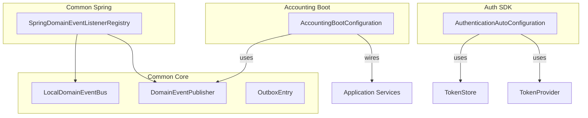
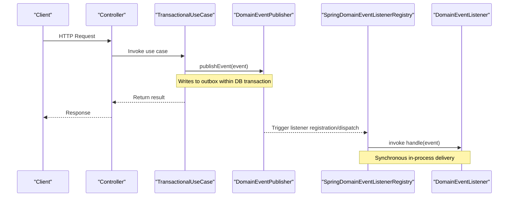
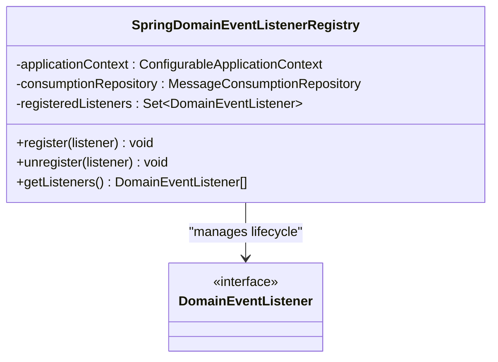
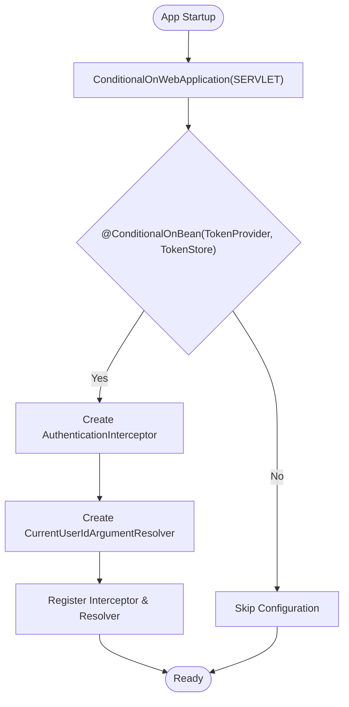
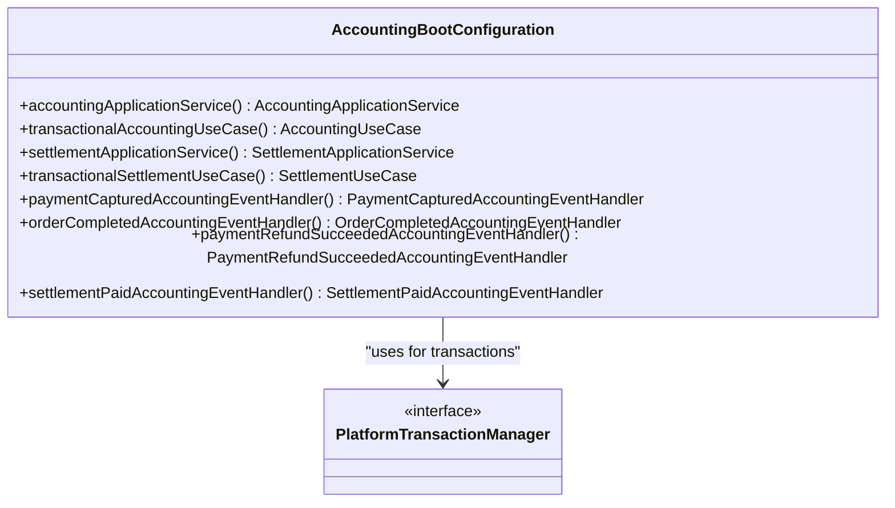
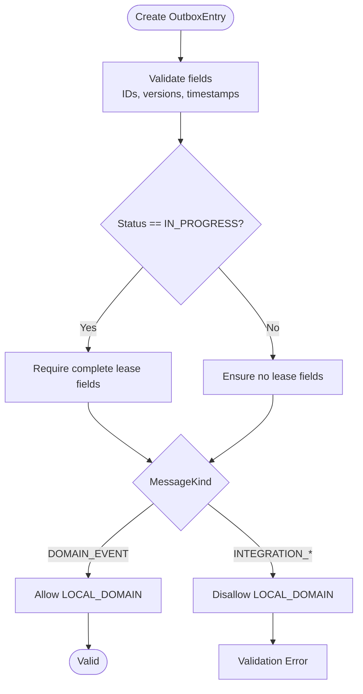
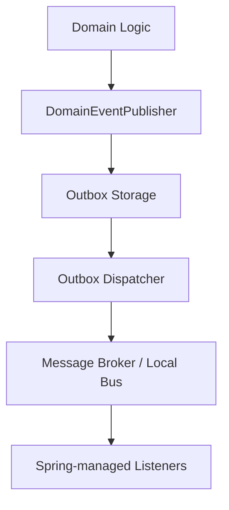
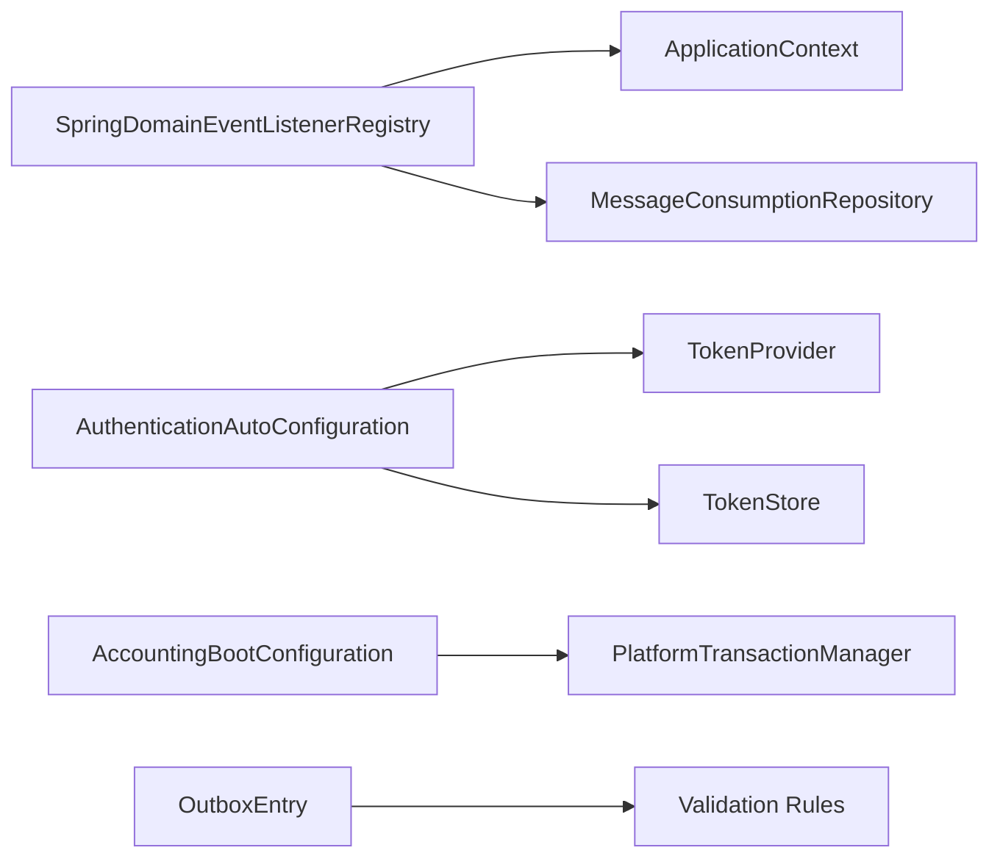

# Spring Framework Integrations

<cite>
**Referenced Files in This Document**
- [SpringDomainEventListenerRegistry.kt](file://j-store-common-spring/src/main/kotlin/com/jstore/common/framework/event/SpringDomainEventListenerRegistry.kt)
- [AuthenticationAutoConfiguration.kt](file://j-store-authentication-spring-sdk/src/main/kotlin/com/jstore/authentication/spring/AuthenticationAutoConfiguration.kt)
- [AccountingBootConfiguration.kt](file://j-store-accounting-boot/src/main/kotlin/com/jstore/accounting/config/AccountingBootConfiguration.kt)
- [DomainEventPublisher.kt](file://j-store-common-core/src/main/kotlin/com/jstore/common/framework/event/DomainEventPublisher.kt)
- [LocalDomainEventBus.kt](file://j-store-common-core/src/main/kotlin/com/jstore/common/framework/event/LocalDomainEventBus.kt)
- [OutboxEntry.kt](file://j-store-common-core/src/main/kotlin/com/jstore/common/framework/event/outbox/OutboxEntry.kt)
</cite>

## Table of Contents
1. Introduction
2. Project Structure
3. Core Components
4. Architecture Overview
5. Detailed Component Analysis
6. Dependency Analysis
7. Performance Considerations
8. Troubleshooting Guide
9. Conclusion

## Introduction
This document explains how the project integrates with Spring Framework for dependency injection, auto-configuration, and lifecycle management. It focuses on:
- Spring-based domain event listener registration and dispatch
- Transactional outbox integration for reliable event publishing
- Spring Boot auto-configuration for authentication features
- Wiring of application services and use cases via @Configuration beans
- Patterns for transaction management and testing utilities
- Common integration patterns, performance tuning, and debugging guidance

The goal is to provide both a conceptual overview and concrete code-level references so that readers can understand and extend the Spring integrations effectively.

## Project Structure
The Spring-related integration spans several modules:
- j-store-common-core: Defines core abstractions for events, local bus, and outbox data model
- j-store-common-spring: Provides Spring-specific implementations (e.g., listener registry)
- j-store-authentication-spring-sdk: Spring Boot auto-configuration for authentication
- j-store-accounting-boot: Spring configuration wiring accounting services and event handlers

**Diagram sources**
- [SpringDomainEventListenerRegistry.kt](file://j-store-common-spring/src/main/kotlin/com/jstore/common/framework/event/SpringDomainEventListenerRegistry.kt)
- [DomainEventPublisher.kt](file://j-store-common-core/src/main/kotlin/com/jstore/common/framework/event/DomainEventPublisher.kt)
- [LocalDomainEventBus.kt](file://j-store-common-core/src/main/kotlin/com/jstore/common/framework/event/LocalDomainEventBus.kt)
- [OutboxEntry.kt](file://j-store-common-core/src/main/kotlin/com/jstore/common/framework/event/outbox/OutboxEntry.kt)
- [AuthenticationAutoConfiguration.kt](file://j-store-authentication-spring-sdk/src/main/kotlin/com/jstore/authentication/spring/AuthenticationAutoConfiguration.kt)
- [AccountingBootConfiguration.kt](file://j-store-accounting-boot/src/main/kotlin/com/jstore/accounting/config/AccountingBootConfiguration.kt)

**Section sources**
- [SpringDomainEventListenerRegistry.kt](file://j-store-common-spring/src/main/kotlin/com/jstore/common/framework/event/SpringDomainEventListenerRegistry.kt)
- [AuthenticationAutoConfiguration.kt](file://j-store-authentication-spring-sdk/src/main/kotlin/com/jstore/authentication/spring/AuthenticationAutoConfiguration.kt)
- [AccountingBootConfiguration.kt](file://j-store-accounting-boot/src/main/kotlin/com/jstore/accounting/config/AccountingBootConfiguration.kt)
- [DomainEventPublisher.kt](file://j-store-common-core/src/main/kotlin/com/jstore/common/framework/event/DomainEventPublisher.kt)
- [LocalDomainEventBus.kt](file://j-store-common-core/src/main/kotlin/com/jstore/common/framework/event/LocalDomainEventBus.kt)
- [OutboxEntry.kt](file://j-store-common-core/src/main/kotlin/com/jstore/common/framework/event/outbox/OutboxEntry.kt)

## Core Components
- DomainEventPublisher: Abstraction for transactional event publishing; typically writes to an outbox within the same DB transaction as business data.
- LocalDomainEventBus: In-process event bus for synchronous delivery to listeners within the same JVM.
- OutboxEntry: Data model representing a pending outbound message or domain event, including metadata for delivery, locking, retries, and correlation.
- SpringDomainEventListenerRegistry: Registers/unregisters domain event listeners into the Spring ApplicationContext, enabling Spring-managed lifecycle and DI.
- AuthenticationAutoConfiguration: Spring Boot auto-configuration for authentication interceptors and argument resolvers when required beans are present.
- AccountingBootConfiguration: Wires application services, use cases, and event handlers as Spring beans, integrating with PlatformTransactionManager for transactions.

These components collectively enable:
- Reliable event publishing via outbox
- Synchronous in-process event handling via Spring listeners
- Auto-configured security features
- Declarative transaction boundaries around use cases

**Section sources**
- [DomainEventPublisher.kt](file://j-store-common-core/src/main/kotlin/com/jstore/common/framework/event/DomainEventPublisher.kt)
- [LocalDomainEventBus.kt](file://j-store-common-core/src/main/kotlin/com/jstore/common/framework/event/LocalDomainEventBus.kt)
- [OutboxEntry.kt](file://j-store-common-core/src/main/kotlin/com/jstore/common/framework/event/outbox/OutboxEntry.kt)
- [SpringDomainEventListenerRegistry.kt](file://j-store-common-spring/src/main/kotlin/com/jstore/common/framework/event/SpringDomainEventListenerRegistry.kt)
- [AuthenticationAutoConfiguration.kt](file://j-store-authentication-spring-sdk/src/main/kotlin/com/jstore/authentication/spring/AuthenticationAutoConfiguration.kt)
- [AccountingBootConfiguration.kt](file://j-store-accounting-boot/src/main/kotlin/com/jstore/accounting/config/AccountingBootConfiguration.kt)

## Architecture Overview
The Spring integration architecture combines:
- Application services and use cases wired by Spring @Configuration
- Event publishing through DomainEventPublisher (outbox-backed)
- Listener registration via Spring’s ApplicationContext
- Security auto-configuration for web requests

**Diagram sources**
- [AccountingBootConfiguration.kt](file://j-store-accounting-boot/src/main/kotlin/com/jstore/accounting/config/AccountingBootConfiguration.kt)
- [DomainEventPublisher.kt](file://j-store-common-core/src/main/kotlin/com/jstore/common/framework/event/DomainEventPublisher.kt)
- [SpringDomainEventListenerRegistry.kt](file://j-store-common-spring/src/main/kotlin/com/jstore/common/framework/event/SpringDomainEventListenerRegistry.kt)
- [LocalDomainEventBus.kt](file://j-store-common-core/src/main/kotlin/com/jstore/common/framework/event/LocalDomainEventBus.kt)

## Detailed Component Analysis

### Spring Domain Event Listener Registration
SpringDomainEventListenerRegistry bridges the framework’s event system with Spring’s ApplicationContext:
- register(listener): Wraps the listener and adds it as an application listener; tracks registered listeners
- unregister(listener): Removes the wrapped listener from the context
- getListeners(): Returns current list of registered listeners

This enables Spring-managed lifecycle for listeners and leverages DI for dependencies.

**Diagram sources**
- [SpringDomainEventListenerRegistry.kt](file://j-store-common-spring/src/main/kotlin/com/jstore/common/framework/event/SpringDomainEventListenerRegistry.kt)

**Section sources**
- [SpringDomainEventListenerRegistry.kt](file://j-store-common-spring/src/main/kotlin/com/jstore/common/framework/event/SpringDomainEventListenerRegistry.kt)

### Authentication Auto-Configuration
AuthenticationAutoConfiguration provides Spring Boot auto-configuration for web security:
- Conditional on servlet web application and presence of TokenProvider and TokenStore
- Creates AuthenticationInterceptor and CurrentUserIdArgumentResolver beans
- Registers interceptor across all paths and adds argument resolver for controllers

**Diagram sources**
- [AuthenticationAutoConfiguration.kt](file://j-store-authentication-spring-sdk/src/main/kotlin/com/jstore/authentication/spring/AuthenticationAutoConfiguration.kt)

**Section sources**
- [AuthenticationAutoConfiguration.kt](file://j-store-authentication-spring-sdk/src/main/kotlin/com/jstore/authentication/spring/AuthenticationAutoConfiguration.kt)

### Accounting Boot Configuration and Transactions
AccountingBootConfiguration wires application services and use cases:
- Exposes AccountingApplicationService and SettlementApplicationService beans
- Wraps use cases with TransactionalAccountingUseCase and TransactionalSettlementUseCase using PlatformTransactionManager
- Registers event handlers for payment and settlement events

**Diagram sources**
- [AccountingBootConfiguration.kt](file://j-store-accounting-boot/src/main/kotlin/com/jstore/accounting/config/AccountingBootConfiguration.kt)

**Section sources**
- [AccountingBootConfiguration.kt](file://j-store-accounting-boot/src/main/kotlin/com/jstore/accounting/config/AccountingBootConfiguration.kt)

### Outbox Model and Delivery Semantics
OutboxEntry defines the schema and constraints for outbound messages/events:
- Includes identifiers, payload, aggregate info, status, timestamps, retry metadata, and lock fields
- Enforces consistency rules for lease state and delivery targets based on message kind
- Supports different delivery targets: LOCAL_DOMAIN, LOCAL_INTEGRATION, BROKER

**Diagram sources**
- [OutboxEntry.kt](file://j-store-common-core/src/main/kotlin/com/jstore/common/framework/event/outbox/OutboxEntry.kt)

**Section sources**
- [OutboxEntry.kt](file://j-store-common-core/src/main/kotlin/com/jstore/common/framework/event/outbox/OutboxEntry.kt)

### Conceptual Overview
Conceptually, the integration pattern separates concerns:
- Domain logic publishes events via DomainEventPublisher (outbox-backed)
- Spring manages listener lifecycle and DI
- Auto-configuration reduces boilerplate for common features like authentication
- Transactional use cases ensure atomicity with database operations

[No sources needed since this diagram shows conceptual workflow, not actual code structure]

## Dependency Analysis
Key dependencies and relationships:
- SpringDomainEventListenerRegistry depends on Spring ApplicationContext and consumption repository
- AuthenticationAutoConfiguration depends on TokenProvider and TokenStore beans
- AccountingBootConfiguration depends on repositories and PlatformTransactionManager
- OutboxEntry enforces internal consistency for delivery semantics

**Diagram sources**
- [SpringDomainEventListenerRegistry.kt](file://j-store-common-spring/src/main/kotlin/com/jstore/common/framework/event/SpringDomainEventListenerRegistry.kt)
- [AuthenticationAutoConfiguration.kt](file://j-store-authentication-spring-sdk/src/main/kotlin/com/jstore/authentication/spring/AuthenticationAutoConfiguration.kt)
- [AccountingBootConfiguration.kt](file://j-store-accounting-boot/src/main/kotlin/com/jstore/accounting/config/AccountingBootConfiguration.kt)
- [OutboxEntry.kt](file://j-store-common-core/src/main/kotlin/com/jstore/common/framework/event/outbox/OutboxEntry.kt)

**Section sources**
- [SpringDomainEventListenerRegistry.kt](file://j-store-common-spring/src/main/kotlin/com/jstore/common/framework/event/SpringDomainEventListenerRegistry.kt)
- [AuthenticationAutoConfiguration.kt](file://j-store-authentication-spring-sdk/src/main/kotlin/com/jstore/authentication/spring/AuthenticationAutoConfiguration.kt)
- [AccountingBootConfiguration.kt](file://j-store-accounting-boot/src/main/kotlin/com/jstore/accounting/config/AccountingBootConfiguration.kt)
- [OutboxEntry.kt](file://j-store-common-core/src/main/kotlin/com/jstore/common/framework/event/outbox/OutboxEntry.kt)

## Performance Considerations
- Prefer asynchronous processing for heavy listeners to avoid blocking request threads
- Tune outbox dispatcher batch sizes and polling intervals to balance latency and throughput
- Use connection pooling and appropriate transaction isolation levels for outbox operations
- Avoid excessive logging in hot paths; use structured logging with sampling where appropriate
- Monitor listener execution times and backpressure mechanisms

[No sources needed since this section provides general guidance]

## Troubleshooting Guide
Common issues and resolutions:
- Missing beans for auto-configuration: Ensure TokenProvider and TokenStore are present for AuthenticationAutoConfiguration
- Listener not invoked: Verify registration via SpringDomainEventListenerRegistry and check ApplicationContext listener list
- Outbox entries stuck: Inspect lock fields and retry counts; validate lease expiry and worker fencing
- Transaction rollback: Confirm that exceptions propagate correctly to trigger rollback and prevent partial outbox writes

**Section sources**
- [AuthenticationAutoConfiguration.kt](file://j-store-authentication-spring-sdk/src/main/kotlin/com/jstore/authentication/spring/AuthenticationAutoConfiguration.kt)
- [SpringDomainEventListenerRegistry.kt](file://j-store-common-spring/src/main/kotlin/com/jstore/common/framework/event/SpringDomainEventListenerRegistry.kt)
- [OutboxEntry.kt](file://j-store-common-core/src/main/kotlin/com/jstore/common/framework/event/outbox/OutboxEntry.kt)

## Conclusion
The Spring integration in this project leverages:
- Dependency injection for service wiring and lifecycle management
- Auto-configuration for reducing boilerplate in security and infrastructure
- Transactional outbox for reliable event publishing
- Spring’s ApplicationContext for listener registration and dispatch

By following the patterns outlined here, teams can extend the framework with new services, listeners, and integrations while maintaining reliability and performance.

[No sources needed since this section summarizes without analyzing specific files]