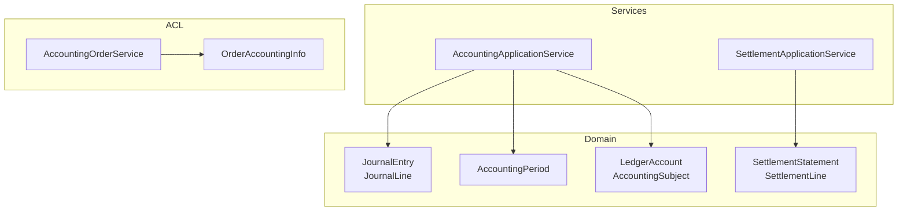
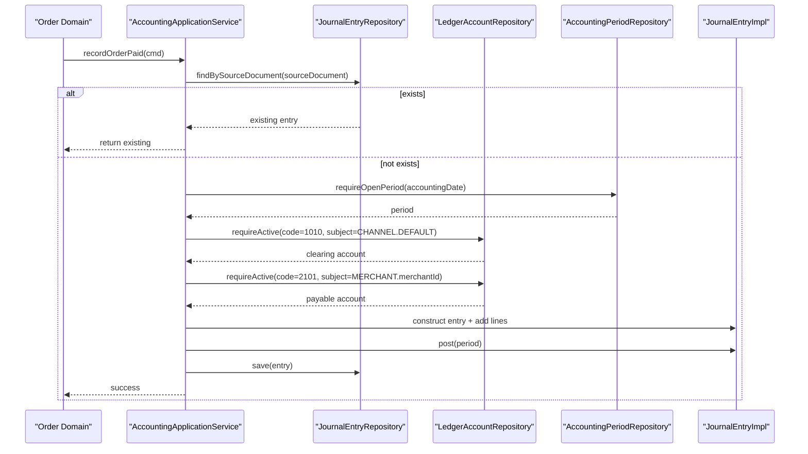
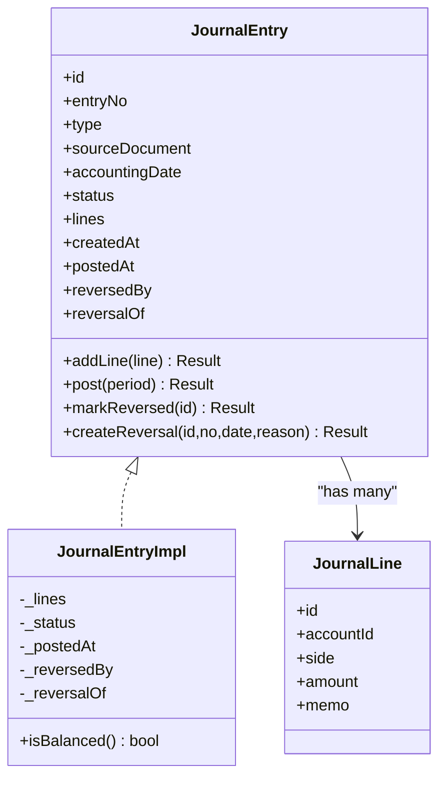
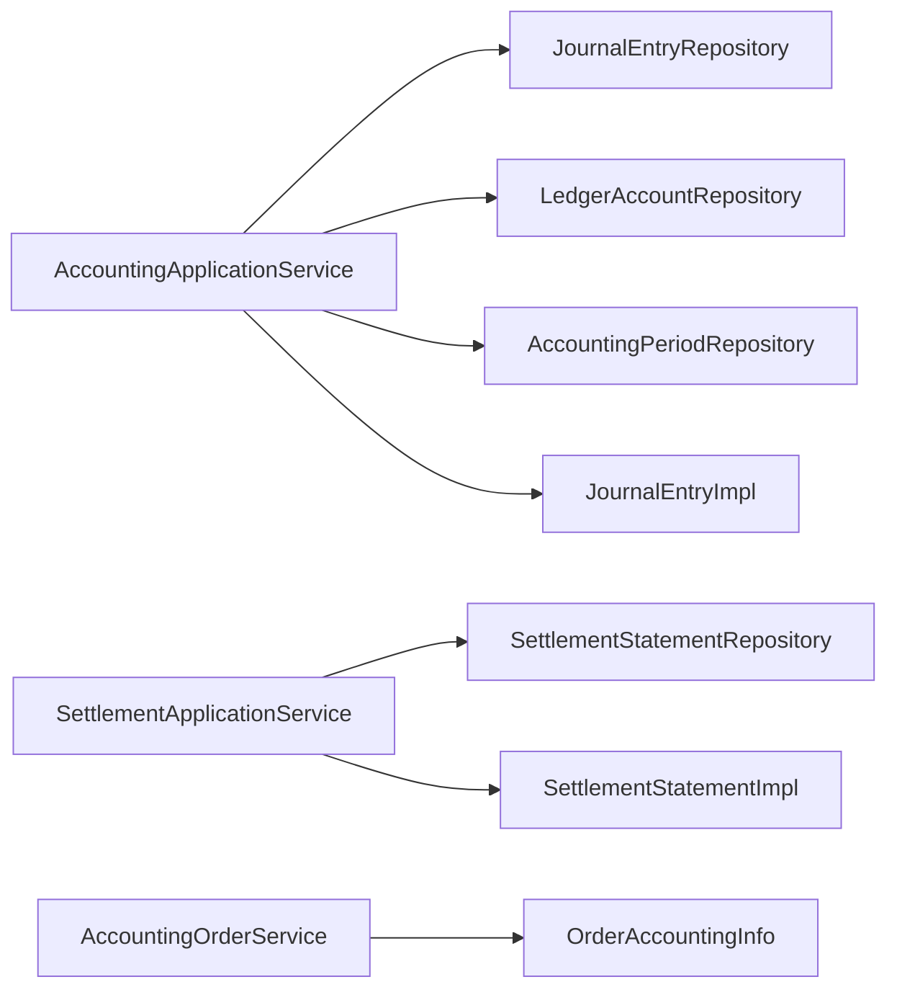

# Accounting Module

<cite>
**Referenced Files in This Document**
- [JournalEntry.kt](file://j-store-accounting/src/main/kotlin/com/jstore/accounting/domain/journal/JournalEntry.kt)
- [JournalEntryImpl.kt](file://j-store-accounting/src/main/kotlin/com/jstore/accounting/domain/journal/JournalEntryImpl.kt)
- [AccountingPeriod.kt](file://j-store-accounting/src/main/kotlin/com/jstore/accounting/domain/journal/AccountingPeriod.kt)
- [AccountingErrors.kt](file://j-store-accounting/src/main/kotlin/com/jstore/accounting/domain/journal/AccountingErrors.kt)
- [LedgerAccount.kt](file://j-store-accounting/src/main/kotlin/com/jstore/accounting/domain/account/LedgerAccount.kt)
- [SettlementStatement.kt](file://j-store-accounting/src/main/kotlin/com/jstore/accounting/domain/settlement/SettlementStatement.kt)
- [SettlementStatementImpl.kt](file://j-store-accounting/src/main/kotlin/com/jstore/accounting/domain/settlement/SettlementStatementImpl.kt)
- [SettlementErrors.kt](file://j-store-accounting/src/main/kotlin/com/jstore/accounting/domain/settlement/SettlementErrors.kt)
- [AccountingApplicationService.kt](file://j-store-accounting/src/main/kotlin/com/jstore/accounting/service/AccountingApplicationService.kt)
- [SettlementApplicationService.kt](file://j-store-accounting/src/main/kotlin/com/jstore/accounting/service/SettlementApplicationService.kt)
- [AccountingOrderService.kt](file://j-store-accounting/src/main/kotlin/com/jstore/accounting/Acl/AccountingOrderService.kt)
- [OrderAccountingInfo.kt](file://j-store-accounting/src/main/kotlin/com/jstore/accounting/Acl/OrderAccountingInfo.kt)
</cite>

## Table of Contents
1. [Introduction](#introduction)
2. [Project Structure](#project-structure)
3. [Core Components](#core-components)
4. [Architecture Overview](#architecture-overview)
5. [Detailed Component Analysis](#detailed-component-analysis)
6. [Dependency Analysis](#dependency-analysis)
7. [Performance Considerations](#performance-considerations)
8. [Troubleshooting Guide](#troubleshooting-guide)
9. [Conclusion](#conclusion)
10. [Appendices](#appendices)

## Introduction
This document explains the Accounting module that implements double-entry bookkeeping for financial transactions. It covers:
- JournalEntry aggregate with debit/credit line items and balance validation
- LedgerAccount system for chart of accounts and subject scoping
- SettlementStatement for merchant settlements and commission calculations
- Application services that generate journal entries from business events
- Integration points with order and payment domains via ACLs
- Accounting principles, audit trails, and period controls

The module enforces strict accounting rules: every entry must be balanced (debits equal credits), posted only within an open accounting period, and reversible through a reversal entry. Settlement statements track gross amounts, refunds, commissions, and net payable amounts per merchant.

## Project Structure
The Accounting module is organized by domain capabilities:
- Domain layer: aggregates and value objects for journals, accounts, periods, and settlements
- Service layer: application services orchestrating commands and repositories
- ACL layer: interfaces to integrate with Order and other domains

[No sources needed since this diagram shows conceptual structure]

## Core Components
- JournalEntry: Represents a double-entry transaction with lines (debit/credit), status transitions (DRAFT → POSTED → REVERSED), and reversal support. Balancing is enforced at post time.
- JournalLine: Each line references a LedgerAccount, side (DEBIT/CREDIT), amount, and memo. Amounts must be positive; memos are required.
- AccountingPeriod: Controls posting windows. Entries can only be posted when the period is OPEN and contains the accounting date.
- LedgerAccount: Chart of accounts with type (ASSET/LIABILITY/EQUITY/REVENUE/EXPENSE), balance direction (DEBIT/CREDIT), and AccountingSubject (PLATFORM/MERCHANT/USER/CHANNEL).
- SettlementStatement: Aggregates settlement lines per merchant and period, computes payable amount, and supports CONFIRMED → PAID lifecycle with event publication.

Key behaviors:
- Double-entry balancing: sum(debits) == sum(credits) before posting
- Period gating: require open period containing the accounting date
- Reversal: create a mirrored entry with swapped sides and reason
- Settlement totals: payableAmount = sum(netAmount) across lines

**Section sources**
- [JournalEntry.kt:31-53](file://j-store-accounting/src/main/kotlin/com/jstore/accounting/domain/journal/JournalEntry.kt#L31-L53)
- [JournalEntry.kt:55-66](file://j-store-accounting/src/main/kotlin/com/jstore/accounting/domain/journal/JournalEntry.kt#L55-L66)
- [AccountingPeriod.kt:14-26](file://j-store-accounting/src/main/kotlin/com/jstore/accounting/domain/journal/AccountingPeriod.kt#L14-L26)
- [LedgerAccount.kt:30-41](file://j-store-accounting/src/main/kotlin/com/jstore/accounting/domain/account/LedgerAccount.kt#L30-L41)
- [SettlementStatement.kt:38-52](file://j-store-accounting/src/main/kotlin/com/jstore/accounting/domain/settlement/SettlementStatement.kt#L38-L52)

## Architecture Overview
The Accounting module exposes application services that consume commands from upstream domains (orders, payments, settlements). Repositories abstract persistence for journals, accounts, periods, and statements. The ACL layer provides read-only views for other domains to query accounting context.

**Diagram sources**
- [AccountingApplicationService.kt:33-65](file://j-store-accounting/src/main/kotlin/com/jstore/accounting/service/AccountingApplicationService.kt#L33-L65)
- [JournalEntryImpl.kt:47-63](file://j-store-accounting/src/main/kotlin/com/jstore/accounting/domain/journal/JournalEntryImpl.kt#L47-L63)

**Section sources**
- [AccountingApplicationService.kt:33-65](file://j-store-accounting/src/main/kotlin/com/jstore/accounting/service/AccountingApplicationService.kt#L33-L65)
- [AccountingApplicationService.kt:67-100](file://j-store-accounting/src/main/kotlin/com/jstore/accounting/service/AccountingApplicationService.kt#L67-L100)
- [AccountingApplicationService.kt:102-141](file://j-store-accounting/src/main/kotlin/com/jstore/accounting/service/AccountingApplicationService.kt#L102-L141)
- [AccountingApplicationService.kt:143-176](file://j-store-accounting/src/main/kotlin/com/jstore/accounting/service/AccountingApplicationService.kt#L143-L176)

## Detailed Component Analysis

### JournalEntry Aggregate
Responsibilities:
- Maintain DRAFT/POSTED/REVERSED state
- Enforce minimum two lines and balanced debits/credits
- Support creation of reversal entries with swapped sides
- Record timestamps and linkage to original/reversal entries

Balance calculation:
- Debit total equals credit total at post time
- Lines cannot be added after posting

Reversal flow:
- Create a new entry of type MANUAL_ADJUSTMENT
- Mirror each line’s side and attach reason
- Link reversalOf to original entry id

**Diagram sources**
- [JournalEntry.kt:31-53](file://j-store-accounting/src/main/kotlin/com/jstore/accounting/domain/journal/JournalEntry.kt#L31-L53)
- [JournalEntry.kt:55-66](file://j-store-accounting/src/main/kotlin/com/jstore/accounting/domain/journal/JournalEntry.kt#L55-L66)
- [JournalEntryImpl.kt:14-37](file://j-store-accounting/src/main/kotlin/com/jstore/accounting/domain/journal/JournalEntryImpl.kt#L14-L37)

**Section sources**
- [JournalEntryImpl.kt:39-63](file://j-store-accounting/src/main/kotlin/com/jstore/accounting/domain/journal/JournalEntryImpl.kt#L39-L63)
- [JournalEntryImpl.kt:74-110](file://j-store-accounting/src/main/kotlin/com/jstore/accounting/domain/journal/JournalEntryImpl.kt#L74-L110)
- [JournalEntryImpl.kt:112-115](file://j-store-accounting/src/main/kotlin/com/jstore/accounting/domain/journal/JournalEntryImpl.kt#L112-L115)

### AccountingPeriod Control
Purpose:
- Ensure postings occur only during open periods
- Validate that accounting date falls within the period range

Behavior:
- Contains(date) checks membership
- close(closedBy) transitions to CLOSED
- reopen(reason) transitions back to OPEN

**Section sources**
- [AccountingPeriod.kt:14-26](file://j-store-accounting/src/main/kotlin/com/jstore/accounting/domain/journal/AccountingPeriod.kt#L14-L26)

### LedgerAccount System (Chart of Accounts)
Purpose:
- Define accounts with code, name, type, balance direction, and AccountingSubject
- Enforce active/inactive status

Subjects:
- PLATFORM, MERCHANT, USER, CHANNEL

Usage in services:
- Clearing account: code 1010, subject CHANNEL.DEFAULT
- Merchant payable: code 2101, subject MERCHANT.{merchantId} or fallback DEFAULT
- Platform revenue: code 3001, subject PLATFORM.PLATFORM
- Bank account: code 1002, subject PLATFORM.PLATFORM

**Section sources**
- [LedgerAccount.kt:30-41](file://j-store-accounting/src/main/kotlin/com/jstore/accounting/domain/account/LedgerAccount.kt#L30-L41)
- [AccountingApplicationService.kt:178-192](file://j-store-accounting/src/main/kotlin/com/jstore/accounting/service/AccountingApplicationService.kt#L178-L192)

### SettlementStatement
Purpose:
- Aggregate settlement lines per merchant and period
- Compute payableAmount as sum of netAmount
- Transition DRAFT → CONFIRMED → PAID
- Publish SettlementPaidEvent on markPaid

Validation:
- Confirm requires payableAmount matches sum of lines
- State transitions guarded by current status

**Section sources**
- [SettlementStatement.kt:38-52](file://j-store-accounting/src/main/kotlin/com/jstore/accounting/domain/settlement/SettlementStatement.kt#L38-L52)
- [SettlementStatementImpl.kt:38-58](file://j-store-accounting/src/main/kotlin/com/jstore/accounting/domain/settlement/SettlementStatementImpl.kt#L38-L58)
- [SettlementStatementImpl.kt:60-76](file://j-store-accounting/src/main/kotlin/com/jstore/accounting/domain/settlement/SettlementStatementImpl.kt#L60-L76)

### Application Services
AccountingApplicationService:
- recordOrderPaid: creates ORDER_PAYMENT entry (clearing debit, merchant payable credit)
- recordOrderCompleted: creates ORDER_COMPLETION_COMMISSION entry (payable debit, platform revenue credit)
- recordOrderRefundApproved: creates ORDER_REFUND_REVERSAL entry (payable debit, clearing credit)
- recordSettlementPaid: creates SETTLEMENT_PAYMENT entry (payable debit, bank credit)

SettlementApplicationService:
- confirmStatement: validates and confirms statement
- markPaid: marks paid and publishes domain events

**Section sources**
- [AccountingApplicationService.kt:33-65](file://j-store-accounting/src/main/kotlin/com/jstore/accounting/service/AccountingApplicationService.kt#L33-L65)
- [AccountingApplicationService.kt:67-100](file://j-store-accounting/src/main/kotlin/com/jstore/accounting/service/AccountingApplicationService.kt#L67-L100)
- [AccountingApplicationService.kt:102-141](file://j-store-accounting/src/main/kotlin/com/jstore/accounting/service/AccountingApplicationService.kt#L102-L141)
- [AccountingApplicationService.kt:143-176](file://j-store-accounting/src/main/kotlin/com/jstore/accounting/service/AccountingApplicationService.kt#L143-L176)
- [SettlementApplicationService.kt:19-33](file://j-store-accounting/src/main/kotlin/com/jstore/accounting/service/SettlementApplicationService.kt#L19-L33)

### ACL Integration
AccountingOrderService:
- getOrderAccountingInfo(orderId): returns paid/commission details for order
- getRefundableOriginalSource(orderId): returns source document of original payment entry

OrderAccountingInfo:
- Carries orderId, merchantId, paidAmount, commissionAmount, completedAt

**Section sources**
- [AccountingOrderService.kt:7-10](file://j-store-accounting/src/main/kotlin/com/jstore/accounting/Acl/AccountingOrderService.kt#L7-L10)
- [OrderAccountingInfo.kt:6-12](file://j-store-accounting/src/main/kotlin/com/jstore/accounting/Acl/OrderAccountingInfo.kt#L6-L12)

## Dependency Analysis

**Diagram sources**
- [AccountingApplicationService.kt:25-29](file://j-store-accounting/src/main/kotlin/com/jstore/accounting/service/AccountingApplicationService.kt#L25-L29)
- [SettlementApplicationService.kt:15-18](file://j-store-accounting/src/main/kotlin/com/jstore/accounting/service/SettlementApplicationService.kt#L15-L18)

**Section sources**
- [AccountingApplicationService.kt:25-29](file://j-store-accounting/src/main/kotlin/com/jstore/accounting/service/AccountingApplicationService.kt#L25-L29)
- [SettlementApplicationService.kt:15-18](file://j-store-accounting/src/main/kotlin/com/jstore/accounting/service/SettlementApplicationService.kt#L15-L18)

## Performance Considerations
- Idempotency: Services check for existing entries by sourceDocument to avoid duplicates
- Minimal repository calls: Only fetch required accounts and periods per command
- In-memory aggregation: Settlement payableAmount computed from lines without extra queries
- Event publishing deferred until final state change (e.g., markPaid)

[No sources needed since this section provides general guidance]

## Troubleshooting Guide
Common errors and causes:
- JOURNAL_ENTRY_UNBALANCED: Debits do not equal credits; verify all lines
- ACCOUNTING_PERIOD_CLOSED: Posting attempted outside open period; ensure period contains accounting date
- JOURNAL_ENTRY_LINES_INSUFFICIENT: Fewer than two lines; add corresponding debit/credit
- JOURNAL_ENTRY_ALREADY_POSTED: Attempted modification after posting; create reversal instead
- SOURCE_DOCUMENT_ALREADY_POSTED: Duplicate source document; reuse existing entry
- SETTLEMENT_STATEMENT_INVALID_STATE: Invalid transition; check current status
- SETTLEMENT_AMOUNT_MISMATCH: PayableAmount does not match sum of lines; recalculate totals
- ACCOUNT_NOT_FOUND: Required ledger account missing or inactive; configure active account for subject

**Section sources**
- [AccountingErrors.kt:5-15](file://j-store-accounting/src/main/kotlin/com/jstore/accounting/domain/journal/AccountingErrors.kt#L5-L15)
- [SettlementErrors.kt:5-10](file://j-store-accounting/src/main/kotlin/com/jstore/accounting/domain/settlement/SettlementErrors.kt#L5-L10)

## Conclusion
The Accounting module enforces robust double-entry bookkeeping with clear aggregates, strict validations, and controlled lifecycle transitions. It integrates seamlessly with order and settlement processes, providing reliable audit trails and accurate merchant settlements. By leveraging accounting periods, subject-scoped accounts, and reversal mechanisms, it ensures compliance with core accounting principles while remaining extensible for future scenarios.

[No sources needed since this section summarizes without analyzing specific files]

## Appendices

### Examples of Recording Transactions
- Record order payment: call recordOrderPaid with sourceDocument, accountingDate, merchantId, paidAmount
- Record order completion commission: call recordOrderCompleted with commissionAmount
- Record refund reversal: call recordOrderRefundApproved with original sourceDocument and refundAmount
- Record settlement payment: call recordSettlementPaid with paidAmount and merchantId

**Section sources**
- [AccountingApplicationService.kt:33-65](file://j-store-accounting/src/main/kotlin/com/jstore/accounting/service/AccountingApplicationService.kt#L33-L65)
- [AccountingApplicationService.kt:67-100](file://j-store-accounting/src/main/kotlin/com/jstore/accounting/service/AccountingApplicationService.kt#L67-L100)
- [AccountingApplicationService.kt:102-141](file://j-store-accounting/src/main/kotlin/com/jstore/accounting/service/AccountingApplicationService.kt#L102-L141)
- [AccountingApplicationService.kt:143-176](file://j-store-accounting/src/main/kotlin/com/jstore/accounting/service/AccountingApplicationService.kt#L143-L176)

### Calculating Account Balances
- Balance per account derived from summing debits and credits across posted JournalLines
- Direction depends on LedgerAccountType and BalanceDirection
- Real-time balances can be projected by aggregating posted entries

[No sources needed since this section provides general guidance]

### Generating Journal Entries from Business Events
- Use AccountingApplicationService methods to translate business events into journal entries
- Ensure idempotency by checking existing entries by sourceDocument
- Validate accounting period and accounts before posting

**Section sources**
- [AccountingApplicationService.kt:33-65](file://j-store-accounting/src/main/kotlin/com/jstore/accounting/service/AccountingApplicationService.kt#L33-L65)

### Producing Settlement Reports
- Build SettlementStatement with lines including grossAmount, refundAmount, commissionAmount, netAmount
- Confirm statement to lock totals; mark paid to finalize and publish events
- Query via SettlementStatementRepository for reporting

**Section sources**
- [SettlementStatement.kt:38-52](file://j-store-accounting/src/main/kotlin/com/jstore/accounting/domain/settlement/SettlementStatement.kt#L38-L52)
- [SettlementStatementImpl.kt:38-58](file://j-store-accounting/src/main/kotlin/com/jstore/accounting/domain/settlement/SettlementStatementImpl.kt#L38-L58)
- [SettlementApplicationService.kt:19-33](file://j-store-accounting/src/main/kotlin/com/jstore/accounting/service/SettlementApplicationService.kt#L19-L33)

### Audit Trail and Principles
- Every posted entry has createdAt, postedAt, and optional reversalOf/reversedBy
- SourceDocument links entries to originating business documents
- Period control ensures temporal integrity
- Reversals maintain full traceability with reasons

**Section sources**
- [JournalEntry.kt:31-53](file://j-store-accounting/src/main/kotlin/com/jstore/accounting/domain/journal/JournalEntry.kt#L31-L53)
- [JournalEntryImpl.kt:74-110](file://j-store-accounting/src/main/kotlin/com/jstore/accounting/domain/journal/JournalEntryImpl.kt#L74-L110)
- [AccountingPeriod.kt:14-26](file://j-store-accounting/src/main/kotlin/com/jstore/accounting/domain/journal/AccountingPeriod.kt#L14-L26)

### Integration with Order and Goods Domains
- ACL AccountingOrderService provides order accounting info and original source documents
- Upstream domains trigger accounting flows via commands handled by AccountingApplicationService
- Settlement flows depend on order completion and refund approvals

**Section sources**
- [AccountingOrderService.kt:7-10](file://j-store-accounting/src/main/kotlin/com/jstore/accounting/Acl/AccountingOrderService.kt#L7-L10)
- [OrderAccountingInfo.kt:6-12](file://j-store-accounting/src/main/kotlin/com/jstore/accounting/Acl/OrderAccountingInfo.kt#L6-L12)
- [AccountingApplicationService.kt:67-100](file://j-store-accounting/src/main/kotlin/com/jstore/accounting/service/AccountingApplicationService.kt#L67-L100)
- [AccountingApplicationService.kt:102-141](file://j-store-accounting/src/main/kotlin/com/jstore/accounting/service/AccountingApplicationService.kt#L102-L141)