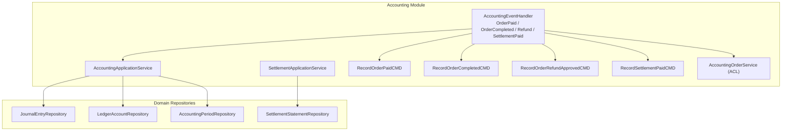
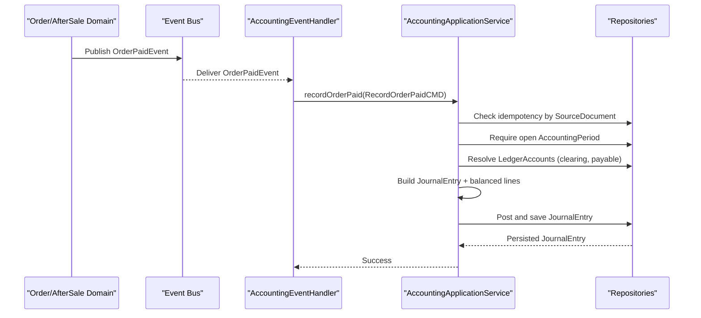
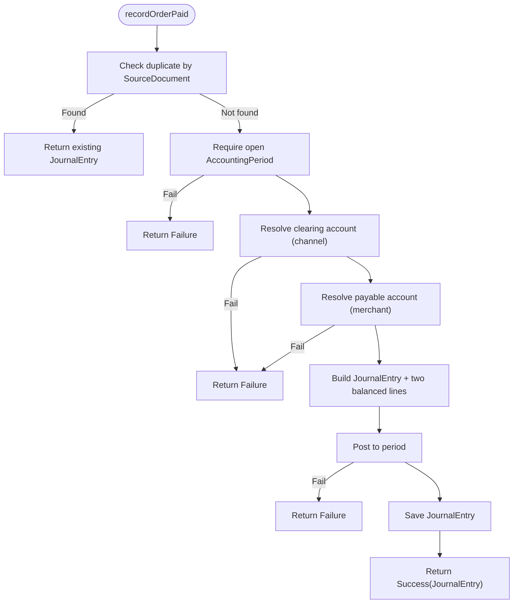
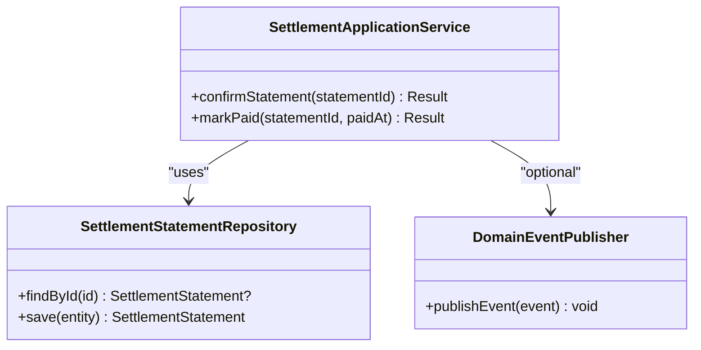
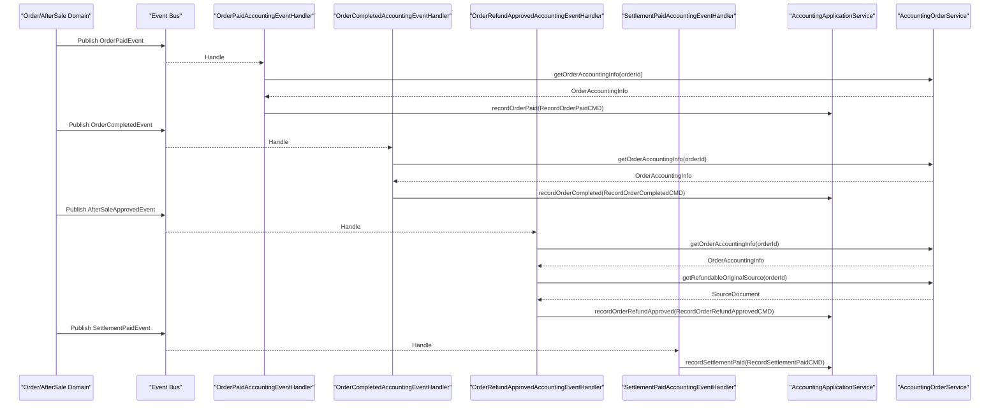
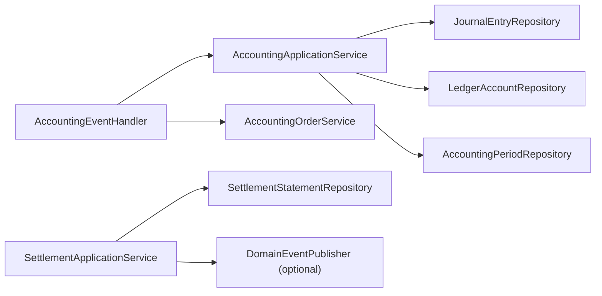

# Accounting Services

<cite>
**Referenced Files in This Document**
- [AccountingApplicationService.kt](file://j-store-accounting/src/main/kotlin/com/jstore/accounting/service/AccountingApplicationService.kt)
- [SettlementApplicationService.kt](file://j-store-accounting/src/main/kotlin/com/jstore/accounting/service/SettlementApplicationService.kt)
- [AccountingEventHandler.kt](file://j-store-accounting/src/main/kotlin/com/jstore/accounting/service/AccountingEventHandler.kt)
- [RecordOrderPaidCMD.kt](file://j-store-accounting/src/main/kotlin/com/jstore/accounting/service/command/RecordOrderPaidCMD.kt)
- [RecordOrderCompletedCMD.kt](file://j-store-accounting/src/main/kotlin/com/jstore/accounting/service/command/RecordOrderCompletedCMD.kt)
- [RecordOrderRefundApprovedCMD.kt](file://j-store-accounting/src/main/kotlin/com/jstore/accounting/service/command/RecordOrderRefundApprovedCMD.kt)
- [RecordSettlementPaidCMD.kt](file://j-store-accounting/src/main/kotlin/com/jstore/accounting/service/command/RecordSettlementPaidCMD.kt)
- [AccountingOrderService.kt](file://j-store-accounting/src/main/kotlin/com/jstore/accounting/acl/AccountingOrderService.kt)
- [AccountingApplicationServiceTest.kt](file://j-store-accounting/src/test/kotlin/com/jstore/accounting/service/AccountingApplicationServiceTest.kt)
- [AccountingEventHandlerTest.kt](file://j-store-accounting/src/test/kotlin/com/jstore/accounting/service/AccountingEventHandlerTest.kt)
</cite>

## Table of Contents
1. Introduction
2. Project Structure
3. Core Components
4. Architecture Overview
5. Detailed Component Analysis
6. Dependency Analysis
7. Performance Considerations
8. Troubleshooting Guide
9. Conclusion

## Introduction
This document explains the Accounting application services that orchestrate business workflows and domain interactions for recording financial transactions, managing settlement statements, and reacting to domain events from Order and AfterSale domains. It focuses on:
- AccountingApplicationService for creating journal entries for order payments, completions (commission), refunds, and settlement payments
- SettlementApplicationService for confirming and marking settlement statements as paid
- Event handlers that translate domain events into accounting commands
- Integration with Order and Goods domains via ACL interfaces
- Asynchronous event processing patterns and transaction consistency guarantees

## Project Structure
The Accounting module is organized around a service layer (application services), event-driven integration points (event handlers), and command objects that encapsulate inputs for each accounting workflow. The test suite demonstrates idempotency, error handling, and correct debit/credit posting behavior.

**Diagram sources**
- [AccountingApplicationService.kt](file://j-store-accounting/src/main/kotlin/com/jstore/accounting/service/AccountingApplicationService.kt)
- [SettlementApplicationService.kt](file://j-store-accounting/src/main/kotlin/com/jstore/accounting/service/SettlementApplicationService.kt)
- [AccountingEventHandler.kt](file://j-store-accounting/src/main/kotlin/com/jstore/accounting/service/AccountingEventHandler.kt)
- [RecordOrderPaidCMD.kt](file://j-store-accounting/src/main/kotlin/com/jstore/accounting/service/command/RecordOrderPaidCMD.kt)
- [RecordOrderCompletedCMD.kt](file://j-store-accounting/src/main/kotlin/com/jstore/accounting/service/command/RecordOrderCompletedCMD.kt)
- [RecordOrderRefundApprovedCMD.kt](file://j-store-accounting/src/main/kotlin/com/jstore/accounting/service/command/RecordOrderRefundApprovedCMD.kt)
- [RecordSettlementPaidCMD.kt](file://j-store-accounting/src/main/kotlin/com/jstore/accounting/service/command/RecordSettlementPaidCMD.kt)
- [AccountingOrderService.kt](file://j-store-accounting/src/main/kotlin/com/jstore/accounting/acl/AccountingOrderService.kt)

**Section sources**
- [AccountingApplicationService.kt](file://j-store-accounting/src/main/kotlin/com/jstore/accounting/service/AccountingApplicationService.kt)
- [SettlementApplicationService.kt](file://j-store-accounting/src/main/kotlin/com/jstore/accounting/service/SettlementApplicationService.kt)
- [AccountingEventHandler.kt](file://j-store-accounting/src/main/kotlin/com/jstore/accounting/service/AccountingEventHandler.kt)

## Core Components
- AccountingApplicationService: Orchestrates journal entry creation for order payment, commission recognition, refund reversal, and settlement payment. Enforces idempotency by source document, validates open accounting periods, resolves ledger accounts, posts balanced journal lines, and persists entries.
- SettlementApplicationService: Confirms settlement statements and marks them as paid; publishes domain events when marked paid.
- AccountingEventHandler: Translates domain events (OrderPaid, OrderCompleted, AfterSaleApproved, SettlementPaid) into accounting commands and invokes the application services.
- Command Objects: RecordOrderPaidCMD, RecordOrderCompletedCMD, RecordOrderRefundApprovedCMD, RecordSettlementPaidCMD define structured inputs for each workflow.
- AccountingOrderService (ACL): Provides order accounting information and original source documents needed for refund reversals.

**Section sources**
- [AccountingApplicationService.kt](file://j-store-accounting/src/main/kotlin/com/jstore/accounting/service/AccountingApplicationService.kt)
- [SettlementApplicationService.kt](file://j-store-accounting/src/main/kotlin/com/jstore/accounting/service/SettlementApplicationService.kt)
- [AccountingEventHandler.kt](file://j-store-accounting/src/main/kotlin/com/jstore/accounting/service/AccountingEventHandler.kt)
- [RecordOrderPaidCMD.kt](file://j-store-accounting/src/main/kotlin/com/jstore/accounting/service/command/RecordOrderPaidCMD.kt)
- [RecordOrderCompletedCMD.kt](file://j-store-accounting/src/main/kotlin/com/jstore/accounting/service/command/RecordOrderCompletedCMD.kt)
- [RecordOrderRefundApprovedCMD.kt](file://j-store-accounting/src/main/kotlin/com/jstore/accounting/service/command/RecordOrderRefundApprovedCMD.kt)
- [RecordSettlementPaidCMD.kt](file://j-store-accounting/src/main/kotlin/com/jstore/accounting/service/command/RecordSettlementPaidCMD.kt)
- [AccountingOrderService.kt](file://j-store-accounting/src/main/kotlin/com/jstore/accounting/acl/AccountingOrderService.kt)

## Architecture Overview
The system follows an event-driven architecture where domain events trigger accounting actions through dedicated handlers. Application services enforce double-entry bookkeeping rules, period constraints, and idempotent persistence. Settlement flows are managed separately and can publish downstream events.

**Diagram sources**
- [AccountingEventHandler.kt](file://j-store-accounting/src/main/kotlin/com/jstore/accounting/service/AccountingEventHandler.kt)
- [AccountingApplicationService.kt](file://j-store-accounting/src/main/kotlin/com/jstore/accounting/service/AccountingApplicationService.kt)

## Detailed Component Analysis

### AccountingApplicationService
Responsibilities:
- Idempotent recording of journal entries keyed by SourceDocument
- Open accounting period validation
- Ledger account resolution with fallback to DEFAULT subject for merchant accounts
- Creation of balanced double-entry journal lines
- Posting within the correct accounting period
- Persistence of journal entries

Key workflows:
- Order Payment: Debit clearing channel account, credit merchant payable
- Order Completion (Commission): Debit merchant payable, credit platform commission revenue
- Refund Reversal: Reverse original payment using reversal link; validate original entry state
- Settlement Payment: Debit merchant payable, credit platform bank account

Idempotency and consistency:
- Duplicate source documents return existing entries without side effects
- Period closure prevents posting outside open windows
- Balanced lines enforced at entity level before saving

Error handling:
- Returns typed failures for missing accounts, invalid states, or closed periods
- Uses Result types to propagate errors consistently

**Diagram sources**
- [AccountingApplicationService.kt](file://j-store-accounting/src/main/kotlin/com/jstore/accounting/service/AccountingApplicationService.kt)

**Section sources**
- [AccountingApplicationService.kt](file://j-store-accounting/src/main/kotlin/com/jstore/accounting/service/AccountingApplicationService.kt)

### SettlementApplicationService
Responsibilities:
- Confirm settlement statements
- Mark statements as paid and persist changes
- Publish domain events generated by statement state transitions

Behavior:
- confirmStatement loads statement, applies confirmation logic, saves
- markPaid applies payment timestamp, saves, then publishes any domain events produced by the statement

**Diagram sources**
- [SettlementApplicationService.kt](file://j-store-accounting/src/main/kotlin/com/jstore/accounting/service/SettlementApplicationService.kt)

**Section sources**
- [SettlementApplicationService.kt](file://j-store-accounting/src/main/kotlin/com/jstore/accounting/service/SettlementApplicationService.kt)

### AccountingEventHandler
Responsibilities:
- Translate domain events into accounting commands
- Fetch required accounting context via AccountingOrderService (ACL)
- Invoke appropriate AccountingApplicationService methods

Event mappings:
- OrderPaidEvent -> RecordOrderPaidCMD -> recordOrderPaid
- OrderCompletedEvent -> RecordOrderCompletedCMD -> recordOrderCompleted
- AfterSaleApprovedEvent -> RecordOrderRefundApprovedCMD -> recordOrderRefundApproved
- SettlementPaidEvent -> RecordSettlementPaidCMD -> recordSettlementPaid

**Diagram sources**
- [AccountingEventHandler.kt](file://j-store-accounting/src/main/kotlin/com/jstore/accounting/service/AccountingEventHandler.kt)
- [AccountingOrderService.kt](file://j-store-accounting/src/main/kotlin/com/jstore/accounting/acl/AccountingOrderService.kt)
- [AccountingApplicationService.kt](file://j-store-accounting/src/main/kotlin/com/jstore/accounting/service/AccountingApplicationService.kt)

**Section sources**
- [AccountingEventHandler.kt](file://j-store-accounting/src/main/kotlin/com/jstore/accounting/service/AccountingEventHandler.kt)
- [AccountingOrderService.kt](file://j-store-accounting/src/main/kotlin/com/jstore/accounting/acl/AccountingOrderService.kt)

### Command Objects
Each command encapsulates the minimal data required for its workflow:
- RecordOrderPaidCMD: orderId, merchantId, paidAmount, accountingDate, sourceDocument
- RecordOrderCompletedCMD: orderId, merchantId, commissionAmount, accountingDate, sourceDocument
- RecordOrderRefundApprovedCMD: orderId, merchantId, refundAmount, accountingDate, sourceDocument, originalSourceDocument
- RecordSettlementPaidCMD: settlementId, merchantId, paidAmount, accountingDate, sourceDocument

These immutable structures ensure clear contracts between event handlers and application services.

**Section sources**
- [RecordOrderPaidCMD.kt](file://j-store-accounting/src/main/kotlin/com/jstore/accounting/service/command/RecordOrderPaidCMD.kt)
- [RecordOrderCompletedCMD.kt](file://j-store-accounting/src/main/kotlin/com/jstore/accounting/service/command/RecordOrderCompletedCMD.kt)
- [RecordOrderRefundApprovedCMD.kt](file://j-store-accounting/src/main/kotlin/com/jstore/accounting/service/command/RecordOrderRefundApprovedCMD.kt)
- [RecordSettlementPaidCMD.kt](file://j-store-accounting/src/main/kotlin/com/jstore/accounting/service/command/RecordSettlementPaidCMD.kt)

## Dependency Analysis
- AccountingApplicationService depends on:
  - JournalEntryRepository for persistence and idempotency checks
  - LedgerAccountRepository for resolving accounts by code and subject
  - AccountingPeriodRepository for validating open periods
- SettlementApplicationService depends on:
  - SettlementStatementRepository for loading/saving statements
  - Optional DomainEventPublisher for publishing events after state changes
- AccountingEventHandler depends on:
  - AccountingOrderService (ACL) to fetch order accounting info and original source documents
  - AccountingApplicationService to execute accounting operations

**Diagram sources**
- [AccountingApplicationService.kt](file://j-store-accounting/src/main/kotlin/com/jstore/accounting/service/AccountingApplicationService.kt)
- [SettlementApplicationService.kt](file://j-store-accounting/src/main/kotlin/com/jstore/accounting/service/SettlementApplicationService.kt)
- [AccountingEventHandler.kt](file://j-store-accounting/src/main/kotlin/com/jstore/accounting/service/AccountingEventHandler.kt)
- [AccountingOrderService.kt](file://j-store-accounting/src/main/kotlin/com/jstore/accounting/acl/AccountingOrderService.kt)

**Section sources**
- [AccountingApplicationService.kt](file://j-store-accounting/src/main/kotlin/com/jstore/accounting/service/AccountingApplicationService.kt)
- [SettlementApplicationService.kt](file://j-store-accounting/src/main/kotlin/com/jstore/accounting/service/SettlementApplicationService.kt)
- [AccountingEventHandler.kt](file://j-store-accounting/src/main/kotlin/com/jstore/accounting/service/AccountingEventHandler.kt)
- [AccountingOrderService.kt](file://j-store-accounting/src/main/kotlin/com/jstore/accounting/acl/AccountingOrderService.kt)

## Performance Considerations
- Idempotency checks prevent redundant writes and reduce contention on repositories
- Early returns on failures minimize unnecessary repository calls
- Double-entry balancing is enforced at the entity level to avoid costly rollbacks
- Event handlers should be processed asynchronously to decouple domain events from accounting operations

[No sources needed since this section provides general guidance]

## Troubleshooting Guide
Common issues and strategies:
- Missing accounting period: Ensure the accounting date falls within an open period; tests demonstrate failure paths when periods are closed
- Account not found: Verify ledger accounts exist for the given code and subject; merchant accounts may fall back to DEFAULT subject
- Original journal entry not found for refunds: Ensure the original payment entry exists and is posted before attempting refund reversal
- Duplicate source documents: Idempotency ensures repeated processing returns the same entry without side effects

Validation references:
- Tests assert idempotency, correct debit/credit accounts, and failure conditions for closed periods and missing originals

**Section sources**
- [AccountingApplicationServiceTest.kt](file://j-store-accounting/src/test/kotlin/com/jstore/accounting/service/AccountingApplicationServiceTest.kt)
- [AccountingEventHandlerTest.kt](file://j-store-accounting/src/test/kotlin/com/jstore/accounting/service/AccountingEventHandlerTest.kt)

## Conclusion
The Accounting services implement robust, idempotent, and auditable financial workflows driven by domain events. They enforce double-entry bookkeeping rules, respect accounting periods, and integrate cleanly with Order and AfterSale domains through well-defined ACLs. Settlement workflows are handled independently and can emit downstream events. The design supports asynchronous processing and consistent error handling, making it suitable for high-throughput e-commerce environments.

[No sources needed since this section summarizes without analyzing specific files]