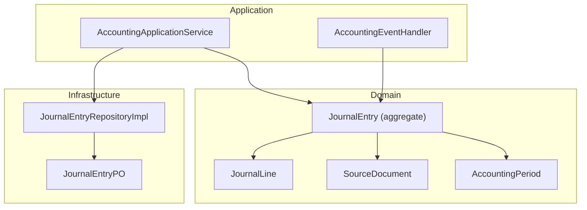
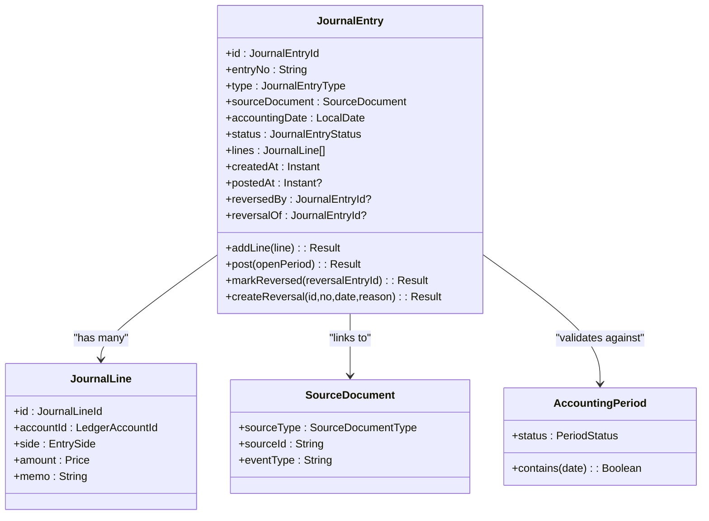
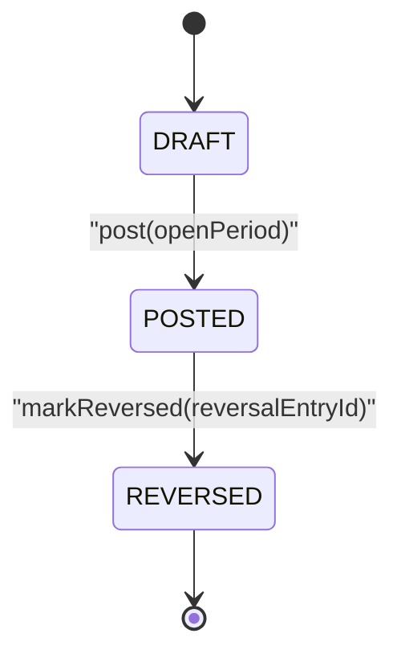
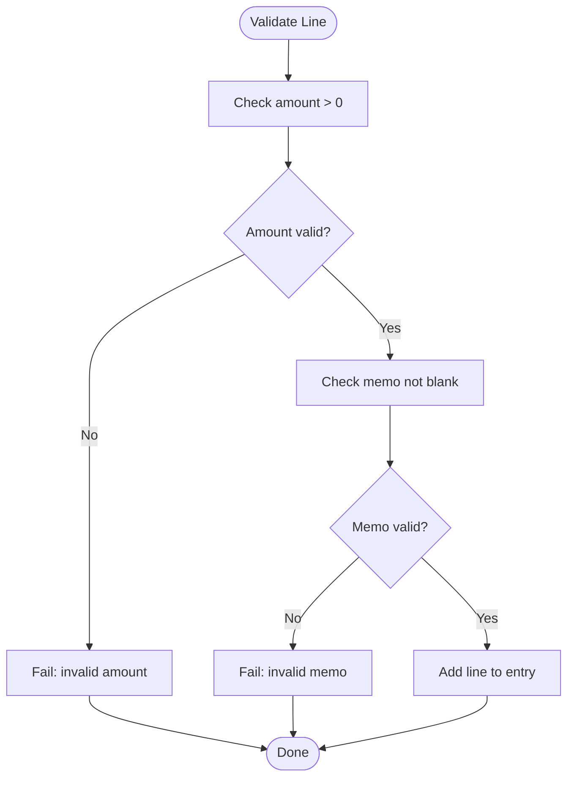
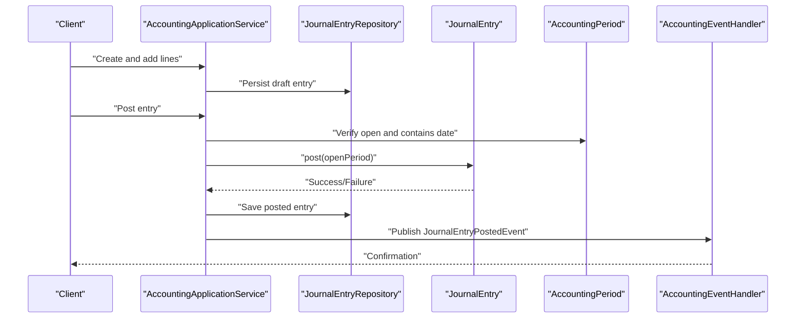
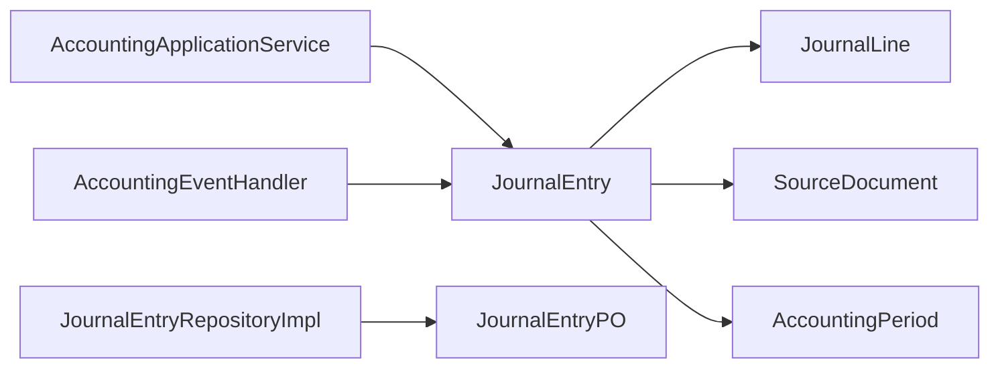

# Journal Entries

<cite>
**Referenced Files in This Document**
- [JournalEntry.kt](file://j-store-accounting/src/main/kotlin/com/jstore/accounting/domain/journal/JournalEntry.kt)
- [JournalEntryImpl.kt](file://j-store-accounting/src/main/kotlin/com/jstore/accounting/domain/journal/JournalEntryImpl.kt)
- [AccountingPeriod.kt](file://j-store-accounting/src/main/kotlin/com/jstore/accounting/domain/journal/AccountingPeriod.kt)
- [AccountingPeriodImpl.kt](file://j-store-accounting/src/main/kotlin/com/jstore/accounting/domain/journal/AccountingPeriodImpl.kt)
- [JournalEntryRepository.kt](file://j-store-accounting/src/main/kotlin/com/jstore/accounting/domain/journal/JournalEntryRepository.kt)
- [JournalEntryPostedEvent.kt](file://j-store-accounting/src/main/kotlin/com/jstore/accounting/domain/journal/event/JournalEntryPostedEvent.kt)
- [JournalEntryReversedEvent.kt](file://j-store-accounting/src/main/kotlin/com/jstore/accounting/domain/journal/event/JournalEntryReversedEvent.kt)
- [AccountingApplicationService.kt](file://j-store-accounting/src/main/kotlin/com/jstore/accounting/service/AccountingApplicationService.kt)
- [AccountingEventHandler.kt](file://j-store-accounting/src/main/kotlin/com/jstore/accounting/service/AccountingEventHandler.kt)
- [JournalEntryPO.kt](file://j-store-accounting-infrastructure/src/main/kotlin/com/jstore/accounting/domain/journal/persistence/JournalEntryPO.kt)
- [JournalEntryRepositoryImpl.kt](file://j-store-accounting-infrastructure/src/main/kotlin/com/jstore/accounting/domain/journal/JournalEntryRepositoryImpl.kt)
</cite>

## Table of Contents
1. [Introduction](#introduction)
2. [Project Structure](#project-structure)
3. [Core Components](#core-components)
4. [Architecture Overview](#architecture-overview)
5. [Detailed Component Analysis](#detailed-component-analysis)
6. [Dependency Analysis](#dependency-analysis)
7. [Performance Considerations](#performance-considerations)
8. [Troubleshooting Guide](#troubleshooting-guide)
9. [Conclusion](#conclusion)
10. [Appendices](#appendices)

## Introduction
This document explains the Journal Entry system that implements double-entry bookkeeping principles within the accounting module. It covers the JournalEntry aggregate lifecycle (DRAFT → POSTED → REVERSED), the JournalLine structure with debit/credit sides and validation, and the SourceDocument concept linking entries to business events such as orders, refunds, and settlements. It also documents accounting period validation, posting rules, reversal mechanisms, audit trail requirements, and balance validation ensuring debits equal credits. Practical examples illustrate creating journal entries for order payments, commission calculations, and refund reversals.

## Project Structure
The Journal Entry domain resides under the accounting module’s domain layer, with infrastructure implementations providing persistence and repository adapters. Key elements include:
- Domain models and aggregates: JournalEntry, JournalLine, SourceDocument, AccountingPeriod
- Repository interfaces and implementations
- Application services and event handlers orchestrating workflows
- Persistence objects for JPA storage

**Diagram sources**
- [JournalEntry.kt](file://j-store-accounting/src/main/kotlin/com/jstore/accounting/domain/journal/JournalEntry.kt)
- [JournalEntryImpl.kt](file://j-store-accounting/src/main/kotlin/com/jstore/accounting/domain/journal/JournalEntryImpl.kt)
- [AccountingPeriod.kt](file://j-store-accounting/src/main/kotlin/com/jstore/accounting/domain/journal/AccountingPeriod.kt)
- [AccountingApplicationService.kt](file://j-store-accounting/src/main/kotlin/com/jstore/accounting/service/AccountingApplicationService.kt)
- [AccountingEventHandler.kt](file://j-store-accounting/src/main/kotlin/com/jstore/accounting/service/AccountingEventHandler.kt)
- [JournalEntryRepositoryImpl.kt](file://j-store-accounting-infrastructure/src/main/kotlin/com/jstore/accounting/domain/journal/JournalEntryRepositoryImpl.kt)
- [JournalEntryPO.kt](file://j-store-accounting-infrastructure/src/main/kotlin/com/jstore/accounting/domain/journal/persistence/JournalEntryPO.kt)

**Section sources**
- [JournalEntry.kt](file://j-store-accounting/src/main/kotlin/com/jstore/accounting/domain/journal/JournalEntry.kt)
- [JournalEntryImpl.kt](file://j-store-accounting/src/main/kotlin/com/jstore/accounting/domain/journal/JournalEntryImpl.kt)
- [AccountingPeriod.kt](file://j-store-accounting/src/main/kotlin/com/jstore/accounting/domain/journal/AccountingPeriod.kt)
- [AccountingApplicationService.kt](file://j-store-accounting/src/main/kotlin/com/jstore/accounting/service/AccountingApplicationService.kt)
- [AccountingEventHandler.kt](file://j-store-accounting/src/main/kotlin/com/jstore/accounting/service/AccountingEventHandler.kt)
- [JournalEntryRepositoryImpl.kt](file://j-store-accounting-infrastructure/src/main/kotlin/com/jstore/accounting/domain/journal/JournalEntryRepositoryImpl.kt)
- [JournalEntryPO.kt](file://j-store-accounting-infrastructure/src/main/kotlin/com/jstore/accounting/domain/journal/persistence/JournalEntryPO.kt)

## Core Components
- JournalEntry aggregate: Represents a complete accounting entry with lines, status, timestamps, and relationships to source documents and reversals.
- JournalLine: A single debit or credit line with an account, side, amount, and memo.
- SourceDocument: Links a journal entry to a business event (order, refund, settlement, adjustment).
- AccountingPeriod: Validates whether an accounting date is open for posting.
- Repositories and Events: Provide persistence and publish domain events upon state transitions.

Key responsibilities:
- Enforce double-entry balance (sum of debits equals sum of credits).
- Validate amounts and memos on lines.
- Control lifecycle transitions (DRAFT → POSTED → REVERSED).
- Ensure postings occur only in open periods.
- Generate reversals by flipping sides and preserving audit context.

**Section sources**
- [JournalEntry.kt](file://j-store-accounting/src/main/kotlin/com/jstore/accounting/domain/journal/JournalEntry.kt)
- [JournalEntryImpl.kt](file://j-store-accounting/src/main/kotlin/com/jstore/accounting/domain/journal/JournalEntryImpl.kt)
- [AccountingPeriod.kt](file://j-store-accounting/src/main/kotlin/com/jstore/accounting/domain/journal/AccountingPeriod.kt)
- [AccountingPeriodImpl.kt](file://j-store-accounting/src/main/kotlin/com/jstore/accounting/domain/journal/AccountingPeriodImpl.kt)
- [JournalEntryRepository.kt](file://j-store-accounting/src/main/kotlin/com/jstore/accounting/domain/journal/JournalEntryRepository.kt)

## Architecture Overview
The Journal Entry system follows DDD patterns:
- Domain layer defines aggregates, value objects, and repositories.
- Application layer orchestrates use cases via services and event handlers.
- Infrastructure layer provides persistence through JPA entities and repository implementations.

**Diagram sources**
- [JournalEntry.kt](file://j-store-accounting/src/main/kotlin/com/jstore/accounting/domain/journal/JournalEntry.kt)
- [JournalEntryImpl.kt](file://j-store-accounting/src/main/kotlin/com/jstore/accounting/domain/journal/JournalEntryImpl.kt)
- [AccountingPeriod.kt](file://j-store-accounting/src/main/kotlin/com/jstore/accounting/domain/journal/AccountingPeriod.kt)

## Detailed Component Analysis

### JournalEntry Aggregate Lifecycle
Lifecycle states:
- DRAFT: Initial state; lines can be added freely.
- POSTED: Validated and posted; no further modifications allowed except reversal.
- REVERSED: Original entry marked as reversed by another entry.

Posting rules:
- Must have at least two lines.
- Must be balanced (debits equal credits).
- Accounting period must be open and contain the accounting date.

Reversal mechanism:
- Create a new entry of type MANUAL_ADJUSTMENT referencing the original.
- Flip each line’s side (debit ↔ credit).
- Set reversal metadata and reason.

**Diagram sources**
- [JournalEntryImpl.kt](file://j-store-accounting/src/main/kotlin/com/jstore/accounting/domain/journal/JournalEntryImpl.kt)

**Section sources**
- [JournalEntry.kt](file://j-store-accounting/src/main/kotlin/com/jstore/accounting/domain/journal/JournalEntry.kt)
- [JournalEntryImpl.kt](file://j-store-accounting/src/main/kotlin/com/jstore/accounting/domain/journal/JournalEntryImpl.kt)

### JournalLine Validation and Balance
Validation:
- Amount must be greater than zero.
- Memo must be non-blank.

Balance check:
- Sum of DEBIT amounts must equal sum of CREDIT amounts.
- Posting fails if unbalanced.

**Diagram sources**
- [JournalEntry.kt](file://j-store-accounting/src/main/kotlin/com/jstore/accounting/domain/journal/JournalEntry.kt)

**Section sources**
- [JournalEntry.kt](file://j-store-accounting/src/main/kotlin/com/jstore/accounting/domain/journal/JournalEntry.kt)
- [JournalEntryImpl.kt](file://j-store-accounting/src/main/kotlin/com/jstore/accounting/domain/journal/JournalEntryImpl.kt)

### SourceDocument Concept
Purpose:
- Link journal entries to business events like orders, refunds, settlements, or adjustments.
- Capture source type, identifier, and event type for traceability.

Usage:
- ORDER_PAYMENT: Payment related to an order.
- ORDER_COMPLETION_COMMISSION: Commission calculation upon order completion.
- ORDER_REFUND_REVERSAL: Reversal of a refund.
- SETTLEMENT_PAYMENT: Settlement-related payment.
- MANUAL_ADJUSTMENT: Manual adjustments including reversals.

**Section sources**
- [JournalEntry.kt](file://j-store-accounting/src/main/kotlin/com/jstore/accounting/domain/journal/JournalEntry.kt)

### Accounting Period Validation
Rules:
- Only entries with accounting dates within an OPEN period can be posted.
- The period must explicitly contain the accounting date.

Implications:
- Prevents backdating into closed periods.
- Ensures compliance with accounting period controls.

**Section sources**
- [JournalEntryImpl.kt](file://j-store-accounting/src/main/kotlin/com/jstore/accounting/domain/journal/JournalEntryImpl.kt)
- [AccountingPeriod.kt](file://j-store-accounting/src/main/kotlin/com/jstore/accounting/domain/journal/AccountingPeriod.kt)

### Posting Workflow Sequence
Sequence of operations when posting a journal entry:
1. Application service retrieves or constructs the JournalEntry.
2. Adds required JournalLine items.
3. Validates accounting period.
4. Calls post() which enforces minimum lines, balance, and period validity.
5. On success, publishes domain events (e.g., JournalEntryPostedEvent).
6. Persists via repository implementation.

**Diagram sources**
- [AccountingApplicationService.kt](file://j-store-accounting/src/main/kotlin/com/jstore/accounting/service/AccountingApplicationService.kt)
- [AccountingEventHandler.kt](file://j-store-accounting/src/main/kotlin/com/jstore/accounting/service/AccountingEventHandler.kt)
- [JournalEntryImpl.kt](file://j-store-accounting/src/main/kotlin/com/jstore/accounting/domain/journal/JournalEntryImpl.kt)
- [JournalEntryRepository.kt](file://j-store-accounting/src/main/kotlin/com/jstore/accounting/domain/journal/JournalEntryRepository.kt)

**Section sources**
- [AccountingApplicationService.kt](file://j-store-accounting/src/main/kotlin/com/jstore/accounting/service/AccountingApplicationService.kt)
- [AccountingEventHandler.kt](file://j-store-accounting/src/main/kotlin/com/jstore/accounting/service/AccountingEventHandler.kt)
- [JournalEntryImpl.kt](file://j-store-accounting/src/main/kotlin/com/jstore/accounting/domain/journal/JournalEntryImpl.kt)
- [JournalEntryRepository.kt](file://j-store-accounting/src/main/kotlin/com/jstore/accounting/domain/journal/JournalEntryRepository.kt)

### Reversal Mechanism
Steps:
- Original entry must be in POSTED state.
- Create a new entry of type MANUAL_ADJUSTMENT referencing the original.
- Flip each line’s side and set reversal reason.
- Mark original entry as REVERSED with reversal entry ID.

Audit trail:
- reversalOf links reversal to original.
- reversedBy records the reversing entry.
- eventType captures “JournalEntryReversed” in SourceDocument.

**Section sources**
- [JournalEntryImpl.kt](file://j-store-accounting/src/main/kotlin/com/jstore/accounting/domain/journal/JournalEntryImpl.kt)
- [JournalEntryReversedEvent.kt](file://j-store-accounting/src/main/kotlin/com/jstore/accounting/domain/journal/event/JournalEntryReversedEvent.kt)

### Examples of Creating Journal Entries

- Order Payment:
  - Type: ORDER_PAYMENT
  - Lines: Debit cash/bank account, Credit revenue or receivable account
  - SourceDocument: sourceType=ORDER, sourceId=orderId, eventType="OrderPaid"

- Commission Calculation:
  - Type: ORDER_COMPLETION_COMMISSION
  - Lines: Debit commission expense, Credit payable or shop account
  - SourceDocument: sourceType=ORDER, sourceId=orderId, eventType="OrderCompleted"

- Refund Reversal:
  - Type: ORDER_REFUND_REVERSAL
  - Lines: Reverse original refund lines (flip sides)
  - SourceDocument: sourceType=REFUND, sourceId=refundId, eventType="RefundReversed"

These examples ensure debits equal credits and memos are descriptive.

[No sources needed since this section provides conceptual examples based on documented types and structures]

## Dependency Analysis
Dependencies between components:
- JournalEntry depends on JournalLine, SourceDocument, and AccountingPeriod.
- Application services orchestrate JournalEntry and AccountingPeriod interactions.
- Repository interface abstracts persistence; implementation maps to JPA entity.

**Diagram sources**
- [JournalEntry.kt](file://j-store-accounting/src/main/kotlin/com/jstore/accounting/domain/journal/JournalEntry.kt)
- [JournalEntryImpl.kt](file://j-store-accounting/src/main/kotlin/com/jstore/accounting/domain/journal/JournalEntryImpl.kt)
- [AccountingPeriod.kt](file://j-store-accounting/src/main/kotlin/com/jstore/accounting/domain/journal/AccountingPeriod.kt)
- [AccountingApplicationService.kt](file://j-store-accounting/src/main/kotlin/com/jstore/accounting/service/AccountingApplicationService.kt)
- [AccountingEventHandler.kt](file://j-store-accounting/src/main/kotlin/com/jstore/accounting/service/AccountingEventHandler.kt)
- [JournalEntryRepositoryImpl.kt](file://j-store-accounting-infrastructure/src/main/kotlin/com/jstore/accounting/domain/journal/JournalEntryRepositoryImpl.kt)
- [JournalEntryPO.kt](file://j-store-accounting-infrastructure/src/main/kotlin/com/jstore/accounting/domain/journal/persistence/JournalEntryPO.kt)

**Section sources**
- [JournalEntry.kt](file://j-store-accounting/src/main/kotlin/com/jstore/accounting/domain/journal/JournalEntry.kt)
- [JournalEntryImpl.kt](file://j-store-accounting/src/main/kotlin/com/jstore/accounting/domain/journal/JournalEntryImpl.kt)
- [AccountingPeriod.kt](file://j-store-accounting/src/main/kotlin/com/jstore/accounting/domain/journal/AccountingPeriod.kt)
- [AccountingApplicationService.kt](file://j-store-accounting/src/main/kotlin/com/jstore/accounting/service/AccountingApplicationService.kt)
- [AccountingEventHandler.kt](file://j-store-accounting/src/main/kotlin/com/jstore/accounting/service/AccountingEventHandler.kt)
- [JournalEntryRepositoryImpl.kt](file://j-store-accounting-infrastructure/src/main/kotlin/com/jstore/accounting/domain/journal/JournalEntryRepositoryImpl.kt)
- [JournalEntryPO.kt](file://j-store-accounting-infrastructure/src/main/kotlin/com/jstore/accounting/domain/journal/persistence/JournalEntryPO.kt)

## Performance Considerations
- Minimize line additions after posting to avoid re-validation overhead.
- Use efficient balance checks; current approach sums filtered lists per side.
- Batch persist operations where possible to reduce I/O.
- Avoid unnecessary object creation in hot paths (e.g., reuse price instances if applicable).

[No sources needed since this section provides general guidance]

## Troubleshooting Guide
Common issues and resolutions:
- Invalid state transitions:
  - Attempting to add lines to a posted entry results in failure.
  - Reversal requires the original entry to be in POSTED state.
- Accounting period errors:
  - Posting fails if the period is closed or does not contain the accounting date.
- Balance validation failures:
  - Ensure total debits equal total credits before posting.
- Missing or invalid line data:
  - Amount must be positive; memo must be non-blank.

Operational checks:
- Verify SourceDocument fields are populated.
- Confirm next entry numbers and IDs are generated correctly.
- Inspect domain events published for audit trails.

**Section sources**
- [JournalEntryImpl.kt](file://j-store-accounting/src/main/kotlin/com/jstore/accounting/domain/journal/JournalEntryImpl.kt)
- [JournalEntryRepository.kt](file://j-store-accounting/src/main/kotlin/com/jstore/accounting/domain/journal/JournalEntryRepository.kt)

## Conclusion
The Journal Entry system enforces robust double-entry bookkeeping with clear lifecycle management, strict validation, and comprehensive audit trails. By leveraging SourceDocument linkage, AccountingPeriod validation, and reversal mechanisms, it ensures accurate financial recording and compliance. Application services and event handlers provide extensibility for integrating with broader business processes.

[No sources needed since this section summarizes without analyzing specific files]

## Appendices

### Audit Trail Requirements
- Maintain createdAt, postedAt timestamps.
- Record reversalOf and reversedBy for traceability.
- Publish domain events upon posting and reversal.
- Store SourceDocument details for cross-referencing business events.

**Section sources**
- [JournalEntry.kt](file://j-store-accounting/src/main/kotlin/com/jstore/accounting/domain/journal/JournalEntry.kt)
- [JournalEntryPostedEvent.kt](file://j-store-accounting/src/main/kotlin/com/jstore/accounting/domain/journal/event/JournalEntryPostedEvent.kt)
- [JournalEntryReversedEvent.kt](file://j-store-accounting/src/main/kotlin/com/jstore/accounting/domain/journal/event/JournalEntryReversedEvent.kt)