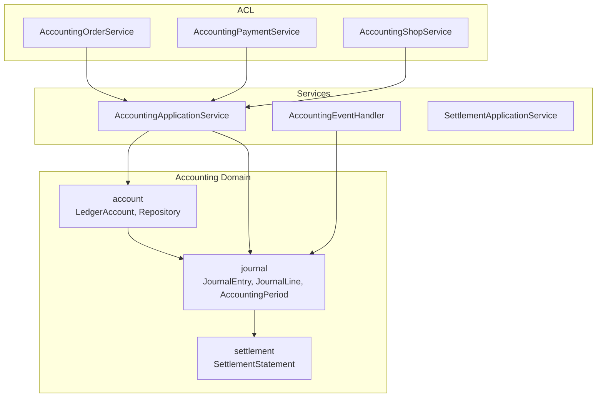
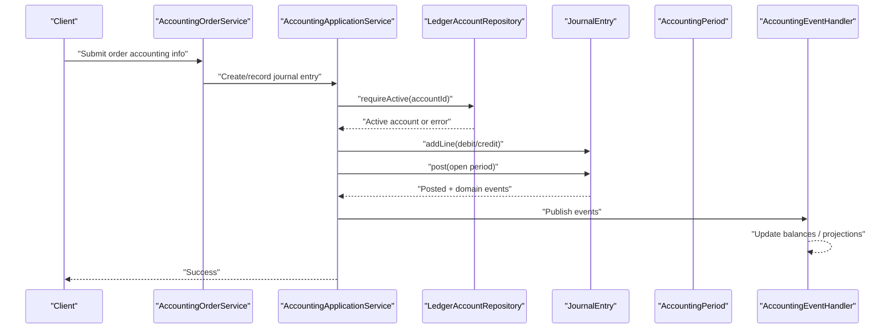
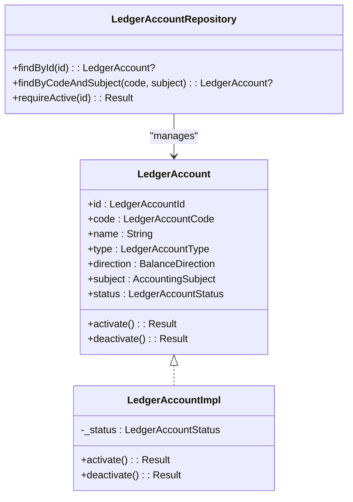
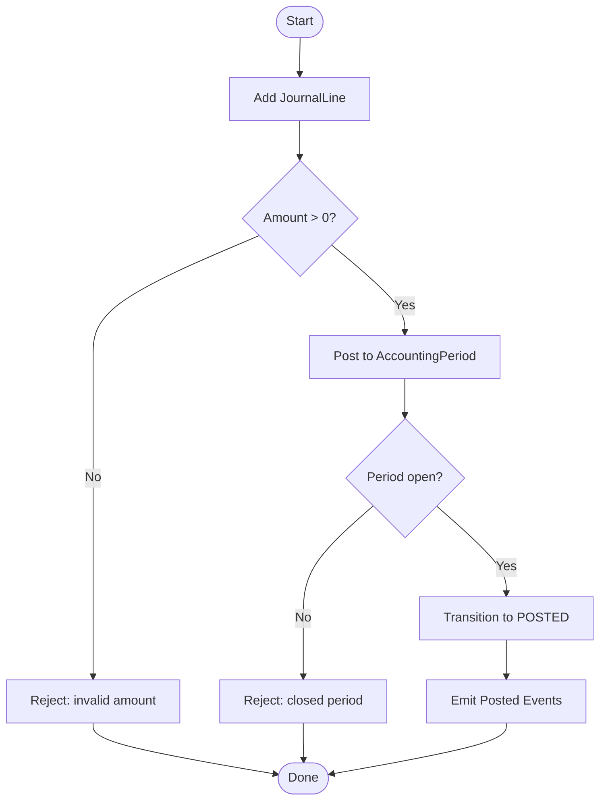
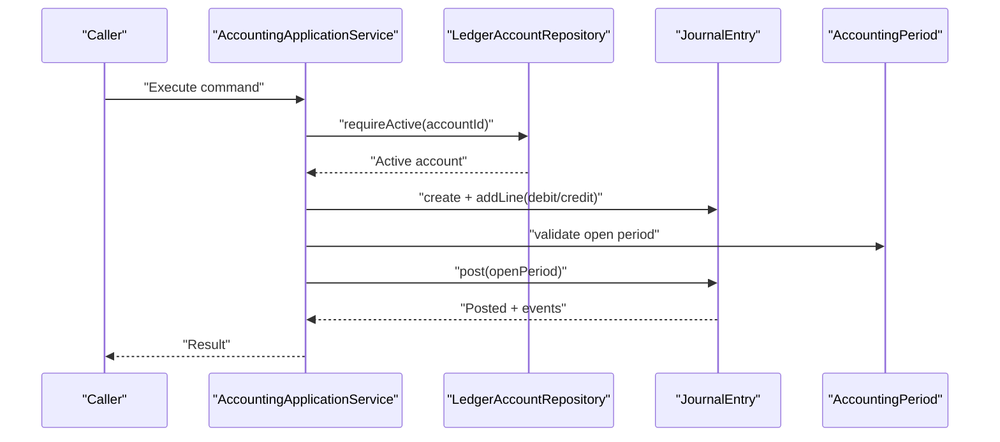
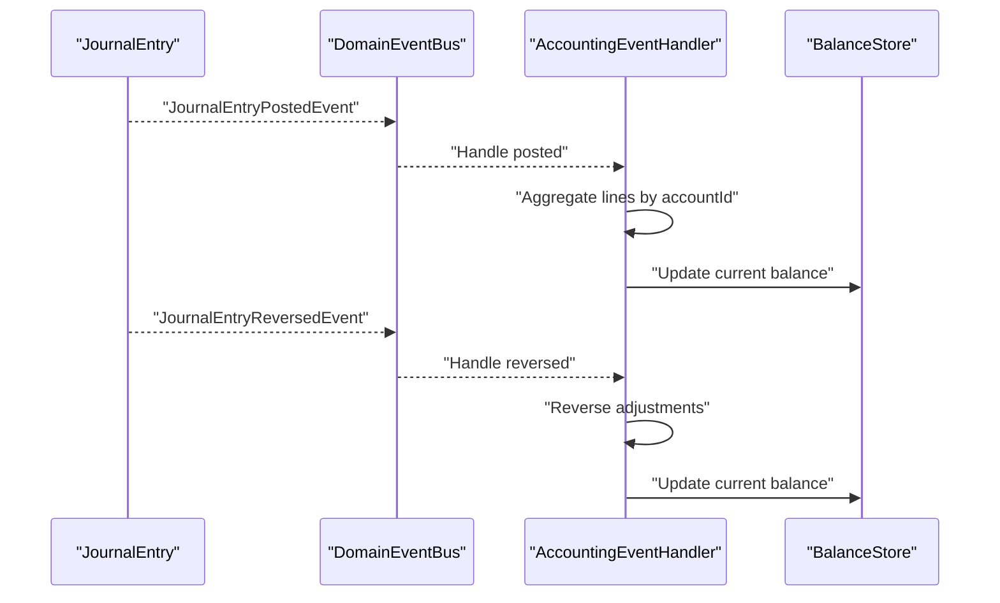
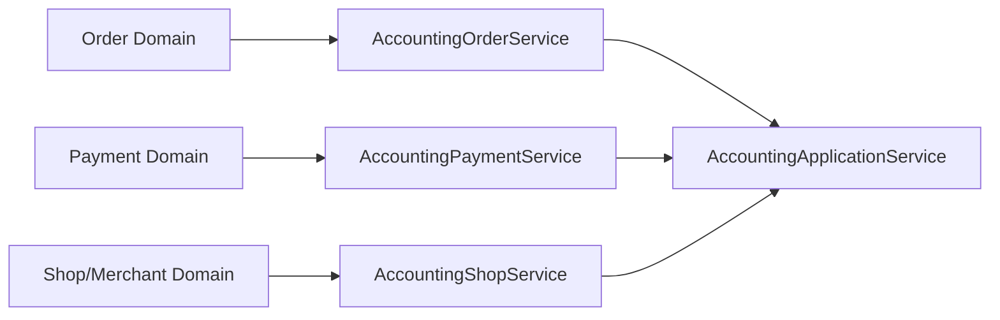
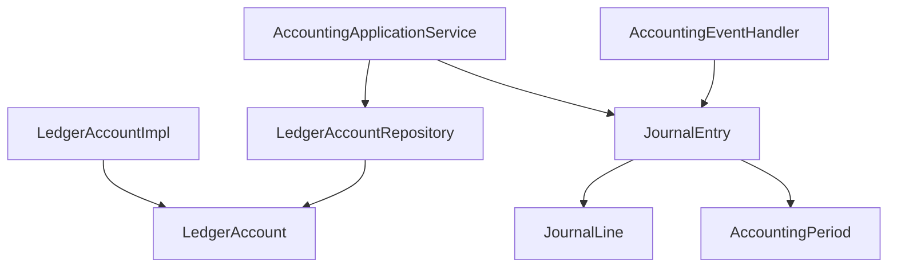

# Ledger Accounts

<cite>
**Referenced Files in This Document**
- [LedgerAccount.kt](file://j-store-accounting/src/main/kotlin/com/jstore/accounting/domain/account/LedgerAccount.kt)
- [LedgerAccountImpl.kt](file://j-store-accounting/src/main/kotlin/com/jstore/accounting/domain/account/LedgerAccountImpl.kt)
- [LedgerAccountRepository.kt](file://j-store-accounting/src/main/kotlin/com/jstore/accounting/domain/account/LedgerAccountRepository.kt)
- [JournalEntry.kt](file://j-store-accounting/src/main/kotlin/com/jstore/accounting/domain/journal/JournalEntry.kt)
- [AccountingPeriod.kt](file://j-store-accounting/src/main/kotlin/com/jstore/accounting/domain/journal/AccountingPeriod.kt)
- [AccountingPeriodImpl.kt](file://j-store-accounting/src/main/kotlin/com/jstore/accounting/domain/journal/AccountingPeriodImpl.kt)
- [AccountingApplicationService.kt](file://j-store-accounting/src/main/kotlin/com/jstore/accounting/service/AccountingApplicationService.kt)
- [AccountingEventHandler.kt](file://j-store-accounting/src/main/kotlin/com/jstore/accounting/service/AccountingEventHandler.kt)
- [RecordOrderCompletedCMD.kt](file://j-store-accounting/src/main/kotlin/com/jstore/accounting/service/command/RecordOrderCompletedCMD.kt)
- [RecordOrderPaidCMD.kt](file://j-store-accounting/src/main/kotlin/com/jstore/accounting/service/command/RecordOrderPaidCMD.kt)
- [RecordOrderRefundApprovedCMD.kt](file://j-store-accounting/src/main/kotlin/com/jstore/accounting/service/command/RecordOrderRefundApprovedCMD.kt)
- [RecordSettlementPaidCMD.kt](file://j-store-accounting/src/main/kotlin/com/jstore/accounting/service/command/RecordSettlementPaidCMD.kt)
- [AccountingOrderService.kt](file://j-store-accounting/src/main/kotlin/com/jstore/accounting/acl/AccountingOrderService.kt)
- [AccountingPaymentService.kt](file://j-store-accounting/src/main/kotlin/com/jstore/accounting/acl/AccountingPaymentService.kt)
- [AccountingShopService.kt](file://j-store-accounting/src/main/kotlin/com/jstore/accounting/acl/AccountingShopService.kt)
- [OrderAccountingInfo.kt](file://j-store-accounting/src/main/kotlin/com/jstore/accounting/acl/OrderAccountingInfo.kt)
- [PaymentAccountingInfo.kt](file://j-store-accounting/src/main/kotlin/com/jstore/accounting/acl/PaymentAccountingInfo.kt)
- [ShopAccountingInfo.kt](file://j-store-accounting/src/main/kotlin/com/jstore/accounting/acl/ShopAccountingInfo.kt)
- [LedgerAccountUnitTest.kt](file://j-store-accounting/src/test/kotlin/com/jstore/accounting/domain/account/LedgerAccountUnitTest.kt)
- [JournalEntryUnitTest.kt](file://j-store-accounting/src/test/kotlin/com/jstore/accounting/domain/journal/JournalEntryUnitTest.kt)
</cite>

## Table of Contents
1. [Introduction](#introduction)
2. [Project Structure](#project-structure)
3. [Core Components](#core-components)
4. [Architecture Overview](#architecture-overview)
5. [Detailed Component Analysis](#detailed-component-analysis)
6. [Dependency Analysis](#dependency-analysis)
7. [Performance Considerations](#performance-considerations)
8. [Troubleshooting Guide](#troubleshooting-guide)
9. [Conclusion](#conclusion)
10. [Appendices](#appendices)

## Introduction
This document explains the Ledger Account system that manages the chart of accounts and real-time balance tracking within the accounting domain. It covers account types, debit/credit mechanics, hierarchy via subjects, and the integration between ledger accounts and journal entries for automatic balance updates. It also documents the LedgerAccount interface and implementation, transaction recording flows, validation rules, concurrent access considerations, and examples for setting up accounts and generating reports.

## Project Structure
The accounting module is organized by domain boundaries:
- Domain layer:
  - account: LedgerAccount, types, status, subject, repository
  - journal: JournalEntry, JournalLine, AccountingPeriod, repositories
  - settlement: SettlementStatement (not covered in detail here)
- Service layer:
  - Application services coordinating commands and events
  - Event handlers reacting to domain events
- ACL layer:
  - Cross-boundary adapters for order, payment, and shop domains

**Diagram sources**
- [LedgerAccount.kt](file://j-store-accounting/src/main/kotlin/com/jstore/accounting/domain/account/LedgerAccount.kt)
- [JournalEntry.kt](file://j-store-accounting/src/main/kotlin/com/jstore/accounting/domain/journal/JournalEntry.kt)
- [AccountingApplicationService.kt](file://j-store-accounting/src/main/kotlin/com/jstore/accounting/service/AccountingApplicationService.kt)
- [AccountingEventHandler.kt](file://j-store-accounting/src/main/kotlin/com/jstore/accounting/service/AccountingEventHandler.kt)
- [AccountingOrderService.kt](file://j-store-accounting/src/main/kotlin/com/jstore/accounting/acl/AccountingOrderService.kt)
- [AccountingPaymentService.kt](file://j-store-accounting/src/main/kotlin/com/jstore/accounting/acl/AccountingPaymentService.kt)
- [AccountingShopService.kt](file://j-store-accounting/src/main/kotlin/com/jstore/accounting/acl/AccountingShopService.kt)

**Section sources**
- [LedgerAccount.kt](file://j-store-accounting/src/main/kotlin/com/jstore/accounting/domain/account/LedgerAccount.kt)
- [JournalEntry.kt](file://j-store-accounting/src/main/kotlin/com/jstore/accounting/domain/journal/JournalEntry.kt)
- [AccountingApplicationService.kt](file://j-store-accounting/src/main/kotlin/com/jstore/accounting/service/AccountingApplicationService.kt)
- [AccountingEventHandler.kt](file://j-store-accounting/src/main/kotlin/com/jstore/accounting/service/AccountingEventHandler.kt)

## Core Components
- LedgerAccount and LedgerAccountImpl define the account entity with identity, code, name, type, direction, subject, and lifecycle state.
- LedgerAccountRepository provides lookup and an active-state guard.
- JournalEntry and JournalLine model double-entry transactions with debits and credits against accounts.
- AccountingPeriod defines open/closed periods used when posting entries.
- Application services orchestrate commands and event-driven updates.

Key responsibilities:
- Account management: creation, activation/deactivation, identification by code and subject.
- Journal entry lifecycle: draft, post, reverse; line addition and validation.
- Balance calculation: derived from posted lines per account using debit/credit semantics.

**Section sources**
- [LedgerAccount.kt](file://j-store-accounting/src/main/kotlin/com/jstore/accounting/domain/account/LedgerAccount.kt)
- [LedgerAccountImpl.kt](file://j-store-accounting/src/main/kotlin/com/jstore/accounting/domain/account/LedgerAccountImpl.kt)
- [LedgerAccountRepository.kt](file://j-store-accounting/src/main/kotlin/com/jstore/accounting/domain/account/LedgerAccountRepository.kt)
- [JournalEntry.kt](file://j-store-accounting/src/main/kotlin/com/jstore/accounting/domain/journal/JournalEntry.kt)
- [AccountingPeriod.kt](file://j-store-accounting/src/main/kotlin/com/jstore/accounting/domain/journal/AccountingPeriod.kt)
- [AccountingPeriodImpl.kt](file://j-store-accounting/src/main/kotlin/com/jstore/accounting/domain/journal/AccountingPeriodImpl.kt)

## Architecture Overview
The system follows DDD with clear separation:
- Domain aggregates encapsulate business rules for accounts and journal entries.
- Application services coordinate use cases and publish domain events.
- Event handlers update balances and projections based on posted or reversed entries.
- ACL adapters translate external domain actions into accounting operations.

**Diagram sources**
- [AccountingOrderService.kt](file://j-store-accounting/src/main/kotlin/com/jstore/accounting/acl/AccountingOrderService.kt)
- [AccountingApplicationService.kt](file://j-store-accounting/src/main/kotlin/com/jstore/accounting/service/AccountingApplicationService.kt)
- [LedgerAccountRepository.kt](file://j-store-accounting/src/main/kotlin/com/jstore/accounting/domain/account/LedgerAccountRepository.kt)
- [JournalEntry.kt](file://j-store-accounting/src/main/kotlin/com/jstore/accounting/domain/journal/JournalEntry.kt)
- [AccountingPeriod.kt](file://j-store-accounting/src/main/kotlin/com/jstore/accounting/domain/journal/AccountingPeriod.kt)
- [AccountingEventHandler.kt](file://j-store-accounting/src/main/kotlin/com/jstore/accounting/service/AccountingEventHandler.kt)

## Detailed Component Analysis

### LedgerAccount Interface and Implementation
- Identity and classification:
  - LedgerAccountId, LedgerAccountCode, AccountingSubject (subjectType + subjectId), LedgerAccountType, BalanceDirection, LedgerAccountStatus.
- Lifecycle:
  - activate(), deactivate() toggle status; repository enforces ACTIVE requirement for operations.
- Validation:
  - Non-empty name and code enforced at construction.

**Diagram sources**
- [LedgerAccount.kt](file://j-store-accounting/src/main/kotlin/com/jstore/accounting/domain/account/LedgerAccount.kt)
- [LedgerAccountImpl.kt](file://j-store-accounting/src/main/kotlin/com/jstore/accounting/domain/account/LedgerAccountImpl.kt)
- [LedgerAccountRepository.kt](file://j-store-accounting/src/main/kotlin/com/jstore/accounting/domain/account/LedgerAccountRepository.kt)

**Section sources**
- [LedgerAccount.kt](file://j-store-accounting/src/main/kotlin/com/jstore/accounting/domain/account/LedgerAccount.kt)
- [LedgerAccountImpl.kt](file://j-store-accounting/src/main/kotlin/com/jstore/accounting/domain/account/LedgerAccountImpl.kt)
- [LedgerAccountRepository.kt](file://j-store-accounting/src/main/kotlin/com/jstore/accounting/domain/account/LedgerAccountRepository.kt)

### Journal Entry and Lines
- JournalEntry models a set of JournalLine records with sides DEBIT/CREDIT and amounts.
- Lifecycle:
  - addLine(line) validates amount and memo.
  - post(openPeriod) transitions to POSTED and emits domain events.
  - markReversed(reversalEntryId) marks reversal.
  - createReversal(...) creates a reversing entry.
- AccountingPeriod ensures postings occur in open periods.

**Diagram sources**
- [JournalEntry.kt](file://j-store-accounting/src/main/kotlin/com/jstore/accounting/domain/journal/JournalEntry.kt)
- [AccountingPeriod.kt](file://j-store-accounting/src/main/kotlin/com/jstore/accounting/domain/journal/AccountingPeriod.kt)
- [AccountingPeriodImpl.kt](file://j-store-accounting/src/main/kotlin/com/jstore/accounting/domain/journal/AccountingPeriodImpl.kt)

**Section sources**
- [JournalEntry.kt](file://j-store-accounting/src/main/kotlin/com/jstore/accounting/domain/journal/JournalEntry.kt)
- [AccountingPeriod.kt](file://j-store-accounting/src/main/kotlin/com/jstore/accounting/domain/journal/AccountingPeriod.kt)
- [AccountingPeriodImpl.kt](file://j-store-accounting/src/main/kotlin/com/jstore/accounting/domain/journal/AccountingPeriodImpl.kt)

### Commands and Application Services
Commands encapsulate intent:
- RecordOrderPaidCMD, RecordOrderCompletedCMD, RecordOrderRefundApprovedCMD, RecordSettlementPaidCMD.
AccountingApplicationService coordinates:
- Resolving accounts via repository.
- Building journal entries and lines.
- Posting and publishing events.

**Diagram sources**
- [RecordOrderPaidCMD.kt](file://j-store-accounting/src/main/kotlin/com/jstore/accounting/service/command/RecordOrderPaidCMD.kt)
- [RecordOrderCompletedCMD.kt](file://j-store-accounting/src/main/kotlin/com/jstore/accounting/service/command/RecordOrderCompletedCMD.kt)
- [RecordOrderRefundApprovedCMD.kt](file://j-store-accounting/src/main/kotlin/com/jstore/accounting/service/command/RecordOrderRefundApprovedCMD.kt)
- [RecordSettlementPaidCMD.kt](file://j-store-accounting/src/main/kotlin/com/jstore/accounting/service/command/RecordSettlementPaidCMD.kt)
- [AccountingApplicationService.kt](file://j-store-accounting/src/main/kotlin/com/jstore/accounting/service/AccountingApplicationService.kt)
- [LedgerAccountRepository.kt](file://j-store-accounting/src/main/kotlin/com/jstore/accounting/domain/account/LedgerAccountRepository.kt)
- [JournalEntry.kt](file://j-store-accounting/src/main/kotlin/com/jstore/accounting/domain/journal/JournalEntry.kt)
- [AccountingPeriod.kt](file://j-store-accounting/src/main/kotlin/com/jstore/accounting/domain/journal/AccountingPeriod.kt)

**Section sources**
- [AccountingApplicationService.kt](file://j-store-accounting/src/main/kotlin/com/jstore/accounting/service/AccountingApplicationService.kt)
- [RecordOrderPaidCMD.kt](file://j-store-accounting/src/main/kotlin/com/jstore/accounting/service/command/RecordOrderPaidCMD.kt)
- [RecordOrderCompletedCMD.kt](file://j-store-accounting/src/main/kotlin/com/jstore/accounting/service/command/RecordOrderCompletedCMD.kt)
- [RecordOrderRefundApprovedCMD.kt](file://j-store-accounting/src/main/kotlin/com/jstore/accounting/service/command/RecordOrderRefundApprovedCMD.kt)
- [RecordSettlementPaidCMD.kt](file://j-store-accounting/src/main/kotlin/com/jstore/accounting/service/command/RecordSettlementPaidCMD.kt)

### Event Handlers and Automatic Balance Updates
AccountingEventHandler reacts to journal events:
- On JournalEntryPostedEvent: compute net debits/credits per account and update balances.
- On JournalEntryReversedEvent: adjust balances accordingly.

**Diagram sources**
- [AccountingEventHandler.kt](file://j-store-accounting/src/main/kotlin/com/jstore/accounting/service/AccountingEventHandler.kt)
- [JournalEntry.kt](file://j-store-accounting/src/main/kotlin/com/jstore/accounting/domain/journal/JournalEntry.kt)

**Section sources**
- [AccountingEventHandler.kt](file://j-store-accounting/src/main/kotlin/com/jstore/accounting/service/AccountingEventHandler.kt)

### ACL Integration for Business Entities
ACL services translate external domain actions into accounting operations:
- AccountingOrderService: maps order lifecycle events to journal entries.
- AccountingPaymentService: maps payments/refunds.
- AccountingShopService: maps merchant/shop settlements.

**Diagram sources**
- [AccountingOrderService.kt](file://j-store-accounting/src/main/kotlin/com/jstore/accounting/acl/AccountingOrderService.kt)
- [AccountingPaymentService.kt](file://j-store-accounting/src/main/kotlin/com/jstore/accounting/acl/AccountingPaymentService.kt)
- [AccountingShopService.kt](file://j-store-accounting/src/main/kotlin/com/jstore/accounting/acl/AccountingShopService.kt)
- [OrderAccountingInfo.kt](file://j-store-accounting/src/main/kotlin/com/jstore/accounting/acl/OrderAccountingInfo.kt)
- [PaymentAccountingInfo.kt](file://j-store-accounting/src/main/kotlin/com/jstore/accounting/acl/PaymentAccountingInfo.kt)
- [ShopAccountingInfo.kt](file://j-store-accounting/src/main/kotlin/com/jstore/accounting/acl/ShopAccountingInfo.kt)

**Section sources**
- [AccountingOrderService.kt](file://j-store-accounting/src/main/kotlin/com/jstore/accounting/acl/AccountingOrderService.kt)
- [AccountingPaymentService.kt](file://j-store-accounting/src/main/kotlin/com/jstore/accounting/acl/AccountingPaymentService.kt)
- [AccountingShopService.kt](file://j-store-accounting/src/main/kotlin/com/jstore/accounting/acl/AccountingShopService.kt)
- [OrderAccountingInfo.kt](file://j-store-accounting/src/main/kotlin/com/jstore/accounting/acl/OrderAccountingInfo.kt)
- [PaymentAccountingInfo.kt](file://j-store-accounting/src/main/kotlin/com/jstore/accounting/acl/PaymentAccountingInfo.kt)
- [ShopAccountingInfo.kt](file://j-store-accounting/src/main/kotlin/com/jstore/accounting/acl/ShopAccountingInfo.kt)

## Dependency Analysis
- LedgerAccount depends on common framework interfaces (AgreeGate, Id).
- JournalEntry depends on Price and Date types and references LedgerAccountId.
- Application services depend on repositories and period validation.
- Event handlers depend on domain events emitted by JournalEntry.

**Diagram sources**
- [LedgerAccountImpl.kt](file://j-store-accounting/src/main/kotlin/com/jstore/accounting/domain/account/LedgerAccountImpl.kt)
- [LedgerAccount.kt](file://j-store-accounting/src/main/kotlin/com/jstore/accounting/domain/account/LedgerAccount.kt)
- [LedgerAccountRepository.kt](file://j-store-accounting/src/main/kotlin/com/jstore/accounting/domain/account/LedgerAccountRepository.kt)
- [JournalEntry.kt](file://j-store-accounting/src/main/kotlin/com/jstore/accounting/domain/journal/JournalEntry.kt)
- [AccountingPeriod.kt](file://j-store-accounting/src/main/kotlin/com/jstore/accounting/domain/journal/AccountingPeriod.kt)
- [AccountingApplicationService.kt](file://j-store-accounting/src/main/kotlin/com/jstore/accounting/service/AccountingApplicationService.kt)
- [AccountingEventHandler.kt](file://j-store-accounting/src/main/kotlin/com/jstore/accounting/service/AccountingEventHandler.kt)

**Section sources**
- [LedgerAccount.kt](file://j-store-accounting/src/main/kotlin/com/jstore/accounting/domain/account/LedgerAccount.kt)
- [JournalEntry.kt](file://j-store-accounting/src/main/kotlin/com/jstore/accounting/domain/journal/JournalEntry.kt)
- [AccountingApplicationService.kt](file://j-store-accounting/src/main/kotlin/com/jstore/accounting/service/AccountingApplicationService.kt)
- [AccountingEventHandler.kt](file://j-store-accounting/src/main/kotlin/com/jstore/accounting/service/AccountingEventHandler.kt)

## Performance Considerations
- Batch journal lines: group multiple lines per entry to reduce overhead.
- Read-optimized balance views: maintain a read model updated by events for fast reporting.
- Avoid repeated lookups: cache active account resolution within a transaction boundary where safe.
- Use immutable value objects for amounts to prevent accidental mutation and enable safe caching.

[No sources needed since this section provides general guidance]

## Troubleshooting Guide
Common issues and resolutions:
- Inactive account errors: ensure account status is ACTIVE before posting; use requireActive().
- Closed period posting: verify AccountingPeriod is open for the accounting date.
- Invalid journal lines: amount must be greater than zero; memo must be non-blank.
- Reversals: create a reversal entry referencing the original entry ID; ensure reversal logic mirrors original lines with opposite sides.

Validation and tests:
- LedgerAccount unit tests cover activation/deactivation and basic invariants.
- JournalEntry unit tests validate line addition, posting, and reversal behavior.

**Section sources**
- [LedgerAccountRepository.kt](file://j-store-accounting/src/main/kotlin/com/jstore/accounting/domain/account/LedgerAccountRepository.kt)
- [JournalEntry.kt](file://j-store-accounting/src/main/kotlin/com/jstore/accounting/domain/journal/JournalEntry.kt)
- [LedgerAccountUnitTest.kt](file://j-store-accounting/src/test/kotlin/com/jstore/accounting/domain/account/LedgerAccountUnitTest.kt)
- [JournalEntryUnitTest.kt](file://j-store-accounting/src/test/kotlin/com/jstore/accounting/domain/journal/JournalEntryUnitTest.kt)

## Conclusion
The Ledger Account system provides a robust foundation for double-entry accounting with clear domain boundaries, strong validation, and event-driven balance updates. By modeling accounts with types and subjects, enforcing debit/credit mechanics through journal entries, and leveraging application services and event handlers, the system supports accurate, auditable financial tracking across merchants, customers, fees, and other entities.

[No sources needed since this section summarizes without analyzing specific files]

## Appendices

### Account Types and Hierarchy
- Types: ASSET, LIABILITY, EQUITY, REVENUE, EXPENSE.
- Direction: DEBIT or CREDIT determines how increases are recorded.
- Subject: PLATFORM, MERCHANT, USER, CHANNEL enables hierarchical grouping and reporting.

**Section sources**
- [LedgerAccount.kt](file://j-store-accounting/src/main/kotlin/com/jstore/accounting/domain/account/LedgerAccount.kt)

### Setting Up Accounts for Business Entities
- Create accounts per subject (e.g., MERCHANT, USER) with appropriate types and directions.
- Activate accounts before use; repository will reject inactive accounts during posting.

**Section sources**
- [LedgerAccountRepository.kt](file://j-store-accounting/src/main/kotlin/com/jstore/accounting/domain/account/LedgerAccountRepository.kt)

### Recording Journal Entries Against Accounts
- Build a JournalEntry with one or more JournalLine items specifying accountId, side (DEBIT/CREDIT), and amount.
- Post the entry within an open AccountingPeriod; events trigger balance updates.

**Section sources**
- [JournalEntry.kt](file://j-store-accounting/src/main/kotlin/com/jstore/accounting/domain/journal/JournalEntry.kt)
- [AccountingPeriod.kt](file://j-store-accounting/src/main/kotlin/com/jstore/accounting/domain/journal/AccountingPeriod.kt)

### Generating Balance Reports
- Query posted JournalLines grouped by accountId to compute net debits and credits.
- Apply BalanceDirection and LedgerAccountType to interpret positive/negative balances correctly.
- Maintain a read model updated by AccountingEventHandler for efficient queries.

**Section sources**
- [JournalEntry.kt](file://j-store-accounting/src/main/kotlin/com/jstore/accounting/domain/journal/JournalEntry.kt)
- [AccountingEventHandler.kt](file://j-store-accounting/src/main/kotlin/com/jstore/accounting/service/AccountingEventHandler.kt)

### Concurrent Access Handling
- Ensure idempotent posting: deduplicate events and handle retries safely.
- Use optimistic concurrency on aggregates if persisted; otherwise rely on event ordering guarantees.
- Protect account activation/deactivation with atomic state transitions.

[No sources needed since this section provides general guidance]