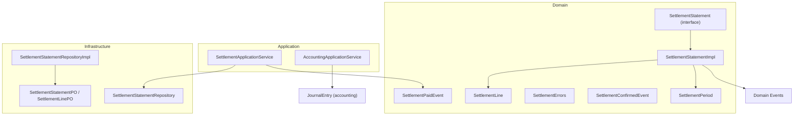
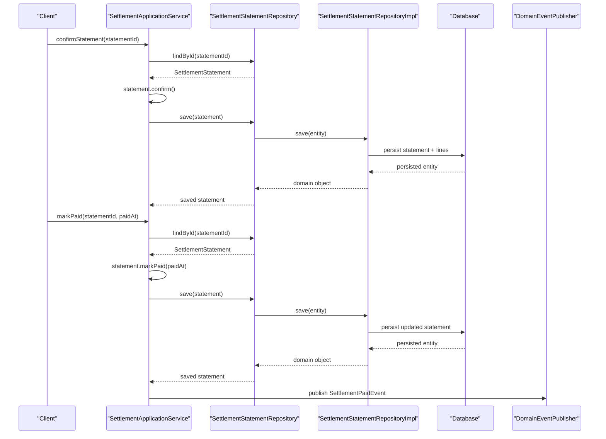
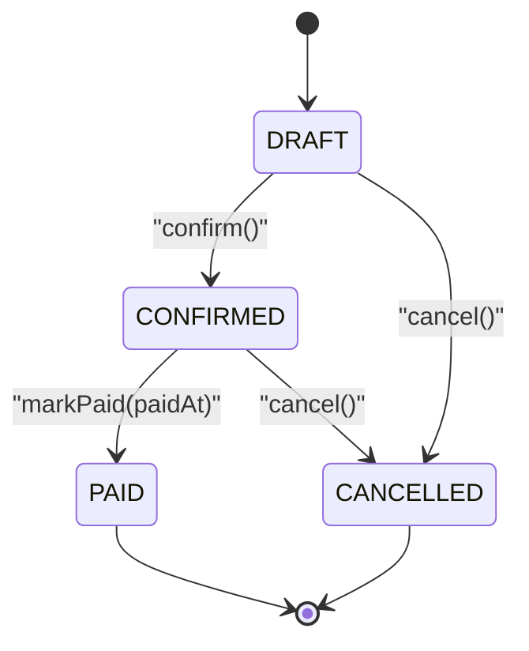
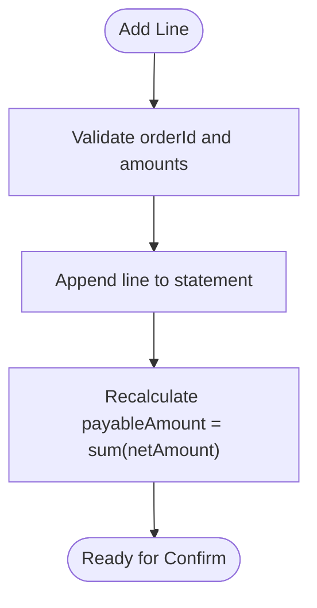
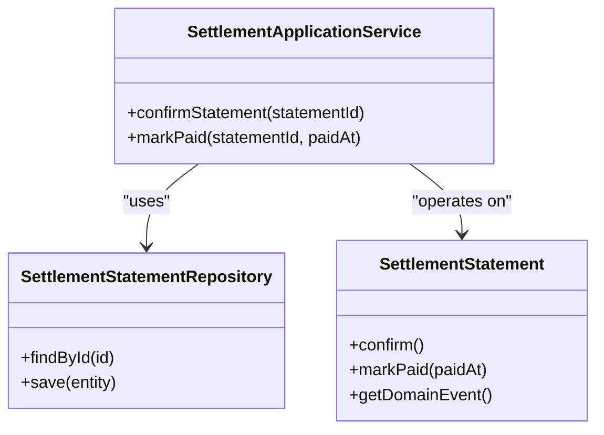
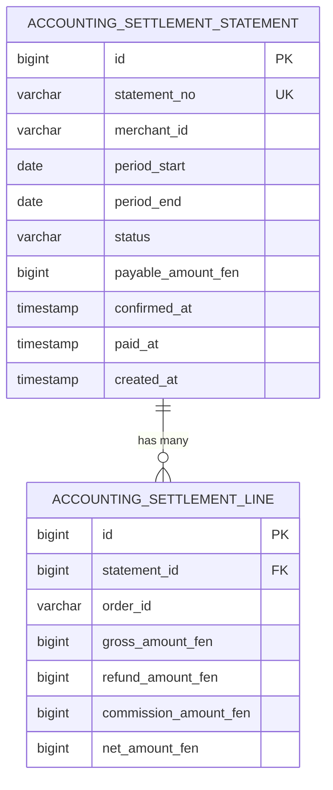
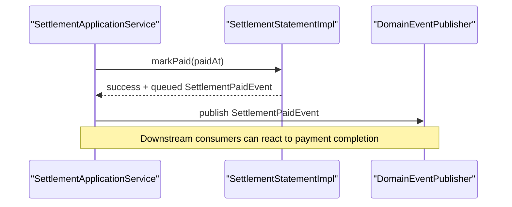
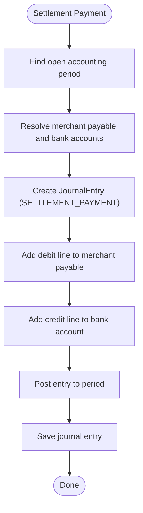
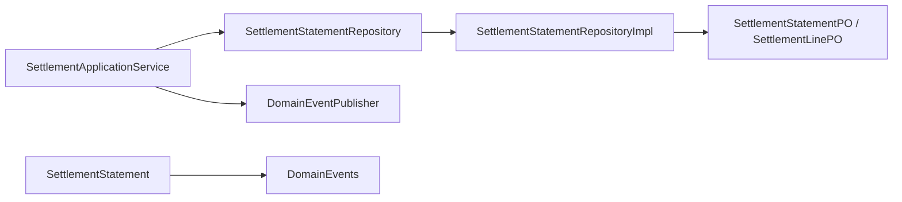

# Settlement Statements

<cite>
**Referenced Files in This Document**
- [SettlementStatement.kt](file://j-store-accounting/src/main/kotlin/com/jstore/accounting/domain/settlement/SettlementStatement.kt)
- [SettlementStatementImpl.kt](file://j-store-accounting/src/main/kotlin/com/jstore/accounting/domain/settlement/SettlementStatementImpl.kt)
- [SettlementErrors.kt](file://j-store-accounting/src/main/kotlin/com/jstore/accounting/domain/settlement/SettlementErrors.kt)
- [SettlementApplicationService.kt](file://j-store-accounting/src/main/kotlin/com/jstore/accounting/service/SettlementApplicationService.kt)
- [AccountingApplicationService.kt](file://j-store-accounting/src/main/kotlin/com/jstore/accounting/service/AccountingApplicationService.kt)
- [SettlementConfirmedEvent.kt](file://j-store-accounting/src/main/kotlin/com/jstore/accounting/domain/settlement/event/SettlementConfirmedEvent.kt)
- [SettlementPaidEvent.kt](file://j-store-accounting/src/main/kotlin/com/jstore/accounting/domain/settlement/event/SettlementPaidEvent.kt)
- [SettlementStatementRepository.kt](file://j-store-accounting/src/main/kotlin/com/jstore/accounting/domain/settlement/SettlementStatementRepository.kt)
- [SettlementStatementRepositoryImpl.kt](file://j-store-accounting-infrastructure/src/main/kotlin/com/jstore/accounting/domain/settlement/SettlementStatementRepositoryImpl.kt)
- [SettlementStatementPO.kt](file://j-store-accounting-infrastructure/src/main/kotlin/com/jstore/accounting/domain/settlement/persistence/SettlementStatementPO.kt)
- [init_j_store_boot_schema.sql](file://j-store-boot/src/main/resources/db/init/init_j_store_boot_schema.sql)
- [SettlementStatementUnitTest.kt](file://j-store-accounting/src/test/kotlin/com/jstore/accounting/domain/settlement/SettlementStatementUnitTest.kt)
</cite>

## Table of Contents
1. Introduction
2. Project Structure
3. Core Components
4. Architecture Overview
5. Detailed Component Analysis
6. Dependency Analysis
7. Performance Considerations
8. Troubleshooting Guide
9. Conclusion

## Introduction
This document explains the Settlement Statement system that handles merchant settlement calculations and payment processing. It covers how statements are generated from completed orders, how commissions and fees are calculated per line, how net settlement amounts are derived, and the full lifecycle from creation through confirmation to payment completion. It also includes examples for processing settlements, calculating platform commissions, handling partial payments, generating reports, managing settlement periods, reconciliation processes, and integration with accounting entries for automatic financial recording. Error handling for settlement failures and manual adjustment capabilities are addressed.

## Project Structure
The settlement functionality is implemented within the accounting module and its infrastructure layer:
- Domain model defines the statement aggregate, lines, period, status, and events.
- Application service orchestrates confirm and mark paid operations and publishes domain events.
- Infrastructure provides persistence via JPA entities and repository implementation.
- Database schema defines tables for statements and lines with constraints.

**Diagram sources**
- [SettlementStatement.kt](file://j-store-accounting/src/main/kotlin/com/jstore/accounting/domain/settlement/SettlementStatement.kt)
- [SettlementStatementImpl.kt](file://j-store-accounting/src/main/kotlin/com/jstore/accounting/domain/settlement/SettlementStatementImpl.kt)
- [SettlementErrors.kt](file://j-store-accounting/src/main/kotlin/com/jstore/accounting/domain/settlement/SettlementErrors.kt)
- [SettlementApplicationService.kt](file://j-store-accounting/src/main/kotlin/com/jstore/accounting/service/SettlementApplicationService.kt)
- [AccountingApplicationService.kt](file://j-store-accounting/src/main/kotlin/com/jstore/accounting/service/AccountingApplicationService.kt)
- [SettlementConfirmedEvent.kt](file://j-store-accounting/src/main/kotlin/com/jstore/accounting/domain/settlement/event/SettlementConfirmedEvent.kt)
- [SettlementPaidEvent.kt](file://j-store-accounting/src/main/kotlin/com/jstore/accounting/domain/settlement/event/SettlementPaidEvent.kt)
- [SettlementStatementRepository.kt](file://j-store-accounting/src/main/kotlin/com/jstore/accounting/domain/settlement/SettlementStatementRepository.kt)
- [SettlementStatementRepositoryImpl.kt](file://j-store-accounting-infrastructure/src/main/kotlin/com/jstore/accounting/domain/settlement/SettlementStatementRepositoryImpl.kt)
- [SettlementStatementPO.kt](file://j-store-accounting-infrastructure/src/main/kotlin/com/jstore/accounting/domain/settlement/persistence/SettlementStatementPO.kt)

**Section sources**
- [SettlementStatement.kt](file://j-store-accounting/src/main/kotlin/com/jstore/accounting/domain/settlement/SettlementStatement.kt)
- [SettlementStatementImpl.kt](file://j-store-accounting/src/main/kotlin/com/jstore/accounting/domain/settlement/SettlementStatementImpl.kt)
- [SettlementStatementRepository.kt](file://j-store-accounting/src/main/kotlin/com/jstore/accounting/domain/settlement/SettlementStatementRepository.kt)
- [SettlementStatementRepositoryImpl.kt](file://j-store-accounting-infrastructure/src/main/kotlin/com/jstore/accounting/domain/settlement/SettlementStatementRepositoryImpl.kt)
- [SettlementStatementPO.kt](file://j-store-accounting-infrastructure/src/main/kotlin/com/jstore/accounting/domain/settlement/persistence/SettlementStatementPO.kt)
- [init_j_store_boot_schema.sql](file://j-store-boot/src/main/resources/db/init/init_j_store_boot_schema.sql)

## Core Components
- SettlementStatement interface defines the aggregate contract: identifier, statement number, merchant ID, period, status, lines, payable amount, timestamps, and state transitions (add line, confirm, mark paid).
- SettlementStatementImpl implements business rules:
  - Only DRAFT allows adding lines.
  - Payable amount equals sum of line net amounts; confirmation validates consistency.
  - Mark paid requires CONFIRMED state and publishes a paid event.
- SettlementLine captures per-order gross amount, refund amount, commission amount, and net amount.
- SettlementPeriod enforces valid date ranges.
- SettlementErrors centralizes error codes for invalid state, amount mismatch, duplicates, and not found.
- SettlementApplicationService coordinates repository interactions and event publishing for confirm and mark paid.
- AccountingApplicationService integrates settlement-related accounting entries for commission recognition and settlement payment posting.

**Section sources**
- [SettlementStatement.kt](file://j-store-accounting/src/main/kotlin/com/jstore/accounting/domain/settlement/SettlementStatement.kt)
- [SettlementStatementImpl.kt](file://j-store-accounting/src/main/kotlin/com/jstore/accounting/domain/settlement/SettlementStatementImpl.kt)
- [SettlementErrors.kt](file://j-store-accounting/src/main/kotlin/com/jstore/accounting/domain/settlement/SettlementErrors.kt)
- [SettlementApplicationService.kt](file://j-store-accounting/src/main/kotlin/com/jstore/accounting/service/SettlementApplicationService.kt)
- [AccountingApplicationService.kt](file://j-store-accounting/src/main/kotlin/com/jstore/accounting/service/AccountingApplicationService.kt)

## Architecture Overview
The settlement system follows a layered architecture with clear separation between domain, application, and infrastructure layers. The domain aggregate encapsulates settlement logic and emits domain events upon state changes. The application service orchestrates use cases and persists aggregates. The infrastructure layer maps domain objects to persistent entities and exposes repository methods.

**Diagram sources**
- [SettlementApplicationService.kt](file://j-store-accounting/src/main/kotlin/com/jstore/accounting/service/SettlementApplicationService.kt)
- [SettlementStatementRepository.kt](file://j-store-accounting/src/main/kotlin/com/jstore/accounting/domain/settlement/SettlementStatementRepository.kt)
- [SettlementStatementRepositoryImpl.kt](file://j-store-accounting-infrastructure/src/main/kotlin/com/jstore/accounting/domain/settlement/SettlementStatementRepositoryImpl.kt)
- [SettlementStatementPO.kt](file://j-store-accounting-infrastructure/src/main/kotlin/com/jstore/accounting/domain/settlement/persistence/SettlementStatementPO.kt)
- [SettlementPaidEvent.kt](file://j-store-accounting/src/main/kotlin/com/jstore/accounting/domain/settlement/event/SettlementPaidEvent.kt)

## Detailed Component Analysis

### Settlement Aggregate and Lifecycle
The SettlementStatement aggregate manages the lifecycle states: DRAFT → CONFIRMED → PAID (or CANCELLED). Each state transition enforces business rules and updates timestamps accordingly. Lines are added only in DRAFT, and payable amount is computed as the sum of line net amounts. Confirmation validates internal consistency and sets the confirmed timestamp. Marking paid transitions to PAID and publishes a paid event.

**Diagram sources**
- [SettlementStatement.kt](file://j-store-accounting/src/main/kotlin/com/jstore/accounting/domain/settlement/SettlementStatement.kt)
- [SettlementStatementImpl.kt](file://j-store-accounting/src/main/kotlin/com/jstore/accounting/domain/settlement/SettlementStatementImpl.kt)

**Section sources**
- [SettlementStatement.kt](file://j-store-accounting/src/main/kotlin/com/jstore/accounting/domain/settlement/SettlementStatement.kt)
- [SettlementStatementImpl.kt](file://j-store-accounting/src/main/kotlin/com/jstore/accounting/domain/settlement/SettlementStatementImpl.kt)

### Settlement Line Model and Calculations
Each SettlementLine represents one order’s contribution to the settlement:
- Gross amount: total order value before deductions.
- Refund amount: refunds or chargebacks applied to the order.
- Commission amount: platform fee or commission deducted.
- Net amount: final payable to the merchant for this line.

Payable amount for the statement is the sum of all line net amounts. This ensures accurate settlement totals and supports reconciliation.

**Diagram sources**
- [SettlementStatement.kt](file://j-store-accounting/src/main/kotlin/com/jstore/accounting/domain/settlement/SettlementStatement.kt)
- [SettlementStatementImpl.kt](file://j-store-accounting/src/main/kotlin/com/jstore/accounting/domain/settlement/SettlementStatementImpl.kt)

**Section sources**
- [SettlementStatement.kt](file://j-store-accounting/src/main/kotlin/com/jstore/accounting/domain/settlement/SettlementStatement.kt)
- [SettlementStatementImpl.kt](file://j-store-accounting/src/main/kotlin/com/jstore/accounting/domain/settlement/SettlementStatementImpl.kt)

### Application Service Orchestration
The SettlementApplicationService provides two primary operations:
- Confirm statement: loads by ID, calls confirm(), saves, returns the updated statement.
- Mark paid: loads by ID, calls markPaid(paidAt), saves, publishes domain events from the aggregate, returns the updated statement.

Error handling uses Result types and centralized error definitions.

**Diagram sources**
- [SettlementApplicationService.kt](file://j-store-accounting/src/main/kotlin/com/jstore/accounting/service/SettlementApplicationService.kt)
- [SettlementStatementRepository.kt](file://j-store-accounting/src/main/kotlin/com/jstore/accounting/domain/settlement/SettlementStatementRepository.kt)
- [SettlementStatement.kt](file://j-store-accounting/src/main/kotlin/com/jstore/accounting/domain/settlement/SettlementStatement.kt)

**Section sources**
- [SettlementApplicationService.kt](file://j-store-accounting/src/main/kotlin/com/jstore/accounting/service/SettlementApplicationService.kt)
- [SettlementErrors.kt](file://j-store-accounting/src/main/kotlin/com/jstore/accounting/domain/settlement/SettlementErrors.kt)

### Persistence and Data Model
Persistence is handled by JPA entities and a repository implementation:
- SettlementStatementPO stores statement-level fields including period, status, payable amount, and timestamps.
- SettlementLinePO stores per-order details.
- RepositoryImpl converts between domain objects and persistent objects, generates IDs and statement numbers, and queries by merchant and period.

**Diagram sources**
- [SettlementStatementPO.kt](file://j-store-accounting-infrastructure/src/main/kotlin/com/jstore/accounting/domain/settlement/persistence/SettlementStatementPO.kt)
- [init_j_store_boot_schema.sql](file://j-store-boot/src/main/resources/db/init/init_j_store_boot_schema.sql)

**Section sources**
- [SettlementStatementRepositoryImpl.kt](file://j-store-accounting-infrastructure/src/main/kotlin/com/jstore/accounting/domain/settlement/SettlementStatementRepositoryImpl.kt)
- [SettlementStatementPO.kt](file://j-store-accounting-infrastructure/src/main/kotlin/com/jstore/accounting/domain/settlement/persistence/SettlementStatementPO.kt)
- [init_j_store_boot_schema.sql](file://j-store-boot/src/main/resources/db/init/init_j_store_boot_schema.sql)

### Event Emission and Integration Points
- SettlementConfirmedEvent: emitted when a statement is confirmed, carrying settlement metadata and period.
- SettlementPaidEvent: emitted when a statement is marked paid, carrying payable amount and paid timestamp.
- These events can be consumed by downstream systems for reporting, notifications, or further accounting actions.

**Diagram sources**
- [SettlementApplicationService.kt](file://j-store-accounting/src/main/kotlin/com/jstore/accounting/service/SettlementApplicationService.kt)
- [SettlementPaidEvent.kt](file://j-store-accounting/src/main/kotlin/com/jstore/accounting/domain/settlement/event/SettlementPaidEvent.kt)
- [SettlementConfirmedEvent.kt](file://j-store-accounting/src/main/kotlin/com/jstore/accounting/domain/settlement/event/SettlementConfirmedEvent.kt)

**Section sources**
- [SettlementPaidEvent.kt](file://j-store-accounting/src/main/kotlin/com/jstore/accounting/domain/settlement/event/SettlementPaidEvent.kt)
- [SettlementConfirmedEvent.kt](file://j-store-accounting/src/main/kotlin/com/jstore/accounting/domain/settlement/event/SettlementConfirmedEvent.kt)
- [SettlementApplicationService.kt](file://j-store-accounting/src/main/kotlin/com/jstore/accounting/service/SettlementApplicationService.kt)

### Accounting Integration for Commissions and Payments
AccountingApplicationService creates journal entries for:
- Order completion commission: debits merchant payable account and credits platform commission revenue account.
- Settlement payment: debits merchant payable account and credits bank account for the paid amount.

These entries ensure automatic financial recording aligned with settlement activities.

**Diagram sources**
- [AccountingApplicationService.kt](file://j-store-accounting/src/main/kotlin/com/jstore/accounting/service/AccountingApplicationService.kt)

**Section sources**
- [AccountingApplicationService.kt](file://j-store-accounting/src/main/kotlin/com/jstore/accounting/service/AccountingApplicationService.kt)

### Examples and Use Cases
- Processing merchant settlements:
  - Build a statement for a merchant and period, add lines for each completed order with gross, refund, commission, and net amounts.
  - Confirm the statement to lock totals and timestamps.
  - Mark paid to finalize and emit events.
- Calculating platform commissions:
  - Per-line commissionAmount reflects platform fees; payableAmount sums net amounts across lines.
- Handling partial payments:
  - If only part of payableAmount is paid, record partial journal entries and keep statement in CONFIRMED until fully paid; alternatively, create multiple settlement statements per payment batch.
- Generating settlement reports:
  - Query statements by merchant and period; aggregate lines to produce summaries of gross, refunds, commissions, and net payables.
- Reconciliation processes:
  - Compare statement payableAmount against actual payments recorded in accounting entries; investigate discrepancies using line-level details.
- Manual adjustments:
  - Adjustments can be modeled by adding correction lines or creating reversal entries in accounting; ensure auditability by preserving original lines and noting adjustment reasons.

[No sources needed since this section provides general guidance based on analyzed components]

## Dependency Analysis
The settlement subsystem has clear dependencies:
- SettlementApplicationService depends on SettlementStatementRepository and optionally DomainEventPublisher.
- SettlementStatementRepositoryImpl depends on JPA repositories and converters.
- Domain events are published via DomainEventPublisher after state transitions.

**Diagram sources**
- [SettlementApplicationService.kt](file://j-store-accounting/src/main/kotlin/com/jstore/accounting/service/SettlementApplicationService.kt)
- [SettlementStatementRepository.kt](file://j-store-accounting/src/main/kotlin/com/jstore/accounting/domain/settlement/SettlementStatementRepository.kt)
- [SettlementStatementRepositoryImpl.kt](file://j-store-accounting-infrastructure/src/main/kotlin/com/jstore/accounting/domain/settlement/SettlementStatementRepositoryImpl.kt)
- [SettlementStatementPO.kt](file://j-store-accounting-infrastructure/src/main/kotlin/com/jstore/accounting/domain/settlement/persistence/SettlementStatementPO.kt)
- [SettlementPaidEvent.kt](file://j-store-accounting/src/main/kotlin/com/jstore/accounting/domain/settlement/event/SettlementPaidEvent.kt)

**Section sources**
- [SettlementApplicationService.kt](file://j-store-accounting/src/main/kotlin/com/jstore/accounting/service/SettlementApplicationService.kt)
- [SettlementStatementRepository.kt](file://j-store-accounting/src/main/kotlin/com/jstore/accounting/domain/settlement/SettlementStatementRepository.kt)
- [SettlementStatementRepositoryImpl.kt](file://j-store-accounting-infrastructure/src/main/kotlin/com/jstore/accounting/domain/settlement/SettlementStatementRepositoryImpl.kt)

## Performance Considerations
- Batch line additions: accumulate lines during DRAFT phase to minimize recalculations; recalculate payableAmount incrementally as shown in the implementation.
- Efficient queries: findByMerchantAndPeriod leverages unique constraints to quickly locate statements for reconciliation and reporting.
- Event publishing: defer publishing until after save to avoid inconsistent state if persistence fails.
- Id generation: use atomic sequences for IDs and statement numbers to reduce contention.

[No sources needed since this section provides general guidance]

## Troubleshooting Guide
Common errors and resolutions:
- Invalid state transitions:
  - Attempting to add lines or mark paid outside allowed states results in SETTLEMENT_STATEMENT_INVALID_STATE. Ensure correct sequence: add lines in DRAFT, confirm to CONFIRMED, then mark paid.
- Amount mismatch:
  - Confirmation fails if payableAmount does not equal sum of line net amounts. Verify line calculations and ensure no stale state.
- Not found:
  - Operations on non-existent statements return SETTLEMENT_STATEMENT_NOT_FOUND. Validate IDs and persistence.
- Duplicated statements:
  - Unique constraint on merchant_id and period prevents duplicate statements; handle conflicts by reusing existing statements or adjusting periods.

Recovery steps:
- Inspect statement status and timestamps.
- Review line-level details for gross, refund, commission, and net amounts.
- Check accounting entries for corresponding journal postings.
- Use unit tests as reference for expected behaviors.

**Section sources**
- [SettlementErrors.kt](file://j-store-accounting/src/main/kotlin/com/jstore/accounting/domain/settlement/SettlementErrors.kt)
- [SettlementStatementUnitTest.kt](file://j-store-accounting/src/test/kotlin/com/jstore/accounting/domain/settlement/SettlementStatementUnitTest.kt)

## Conclusion
The Settlement Statement system provides a robust, event-driven approach to merchant settlement calculations and payment processing. It enforces strict state transitions, accurate financial calculations, and seamless integration with accounting entries. By leveraging clear domain modeling, application orchestration, and persistent storage with strong constraints, it supports reliable settlement lifecycles, reconciliation, and reporting. Proper error handling and event emission enable resilient operations and extensibility for future enhancements such as advanced reporting, multi-currency support, and automated reconciliation workflows.