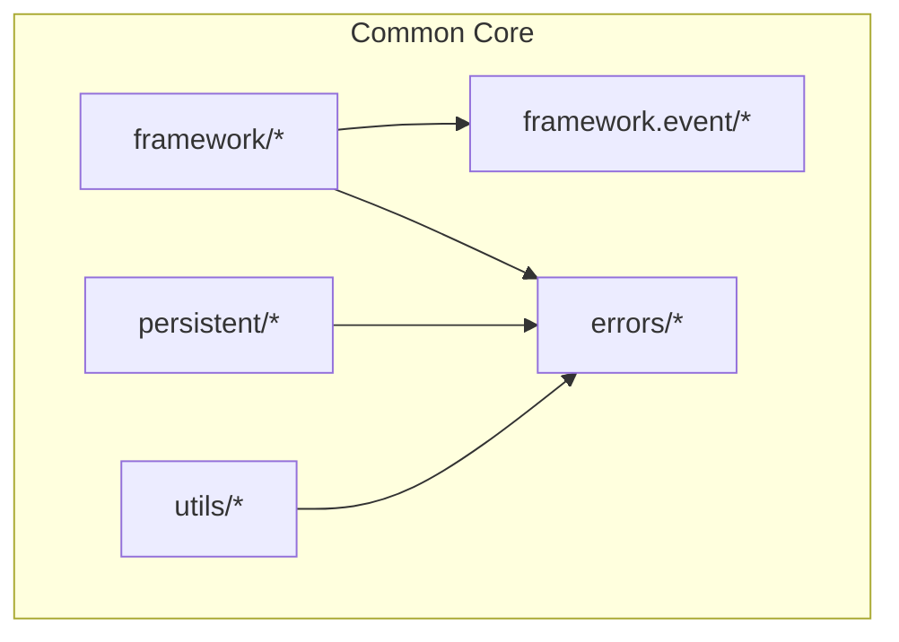
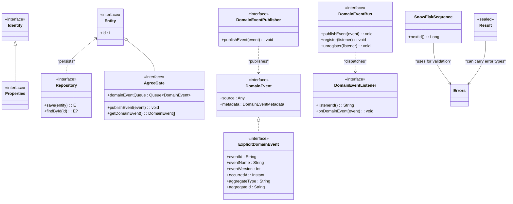
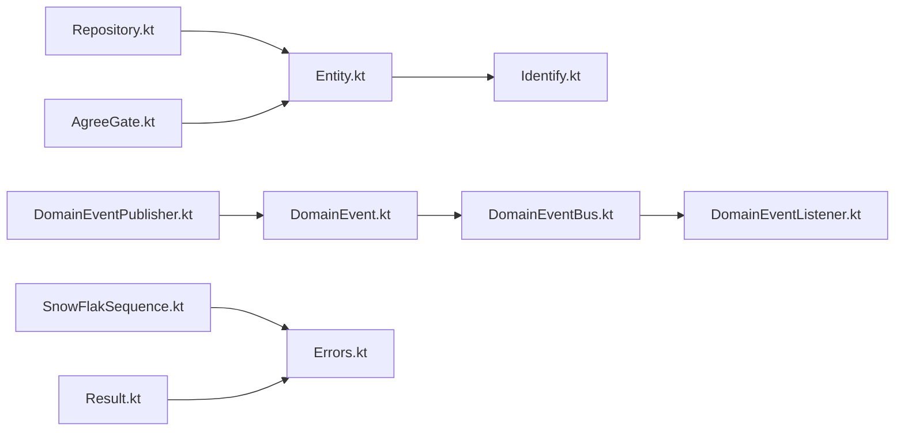
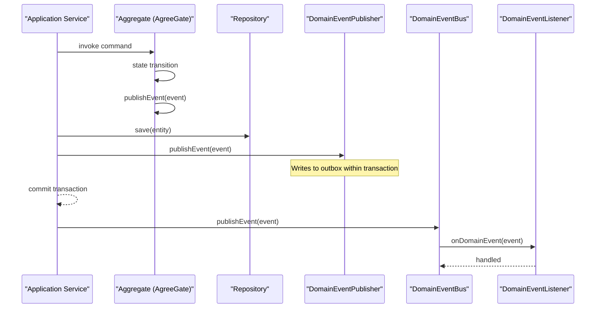
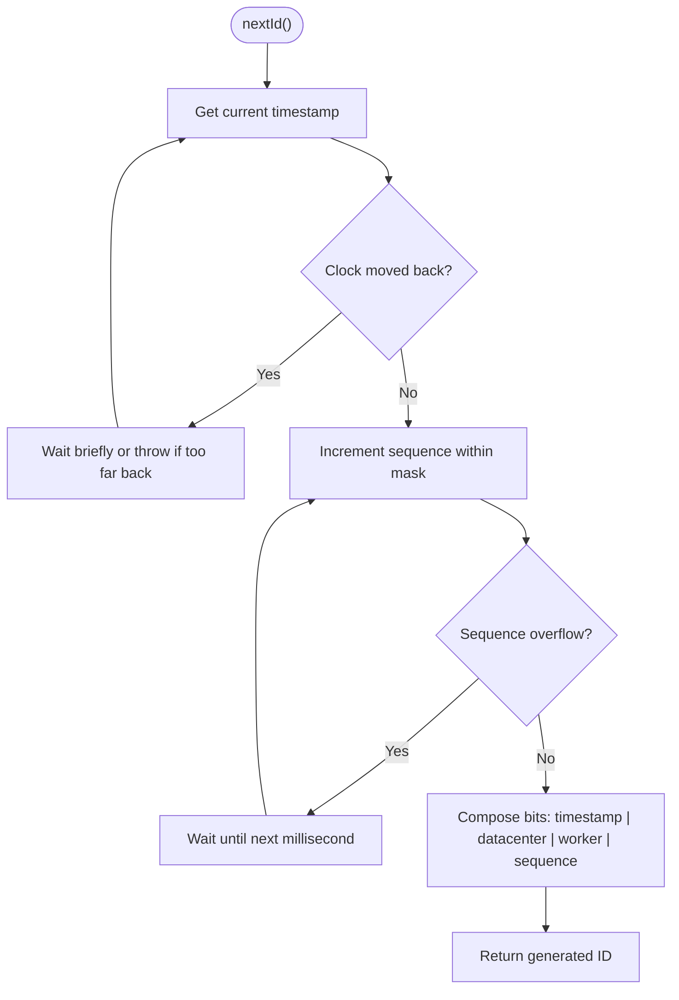

# Common Core Module

<cite>
**Referenced Files in This Document**
- [Entity.kt](file://j-store-common-core/src/main/kotlin/com/jstore/common/framework/Entity.kt)
- [Repository.kt](file://j-store-common-core/src/main/kotlin/com/jstore/common/framework/Repository.kt)
- [Identify.kt](file://j-store-common-core/src/main/kotlin/com/jstore/common/framework/Identify.kt)
- [Properties.kt](file://j-store-common-core/src/main/kotlin/com/jstore/common/framework/Properties.kt)
- [Page.kt](file://j-store-common-core/src/main/kotlin/com/jstore/common/framework/Page.kt)
- [AgreeGate.kt](file://j-store-common-core/src/main/kotlin/com/jstore/common/framework/AgreeGate.kt)
- [DomainEvent.kt](file://j-store-common-core/src/main/kotlin/com/jstore/common/framework/event/DomainEvent.kt)
- [DomainEventBus.kt](file://j-store-common-core/src/main/kotlin/com/jstore/common/framework/event/DomainEventBus.kt)
- [DomainEventListener.kt](file://j-store-common-core/src/main/kotlin/com/jstore/common/framework/event/DomainEventListener.kt)
- [DomainEventPublisher.kt](file://j-store-common-core/src/main/kotlin/com/jstore/common/framework/event/DomainEventPublisher.kt)
- [BusinessError.kt](file://j-store-common-core/src/main/kotlin/com/jstore/common/errors/BusinessError.kt)
- [Errors.kt](file://j-store-common-core/src/main/kotlin/com/jstore/common/errors/Errors.kt)
- [SnowFlakeId.kt](file://j-store-common-core/src/main/kotlin/com/jstore/common/persistent/SnowFlakeId.kt)
- [SnowFlakSequence.kt](file://j-store-common-core/src/main/kotlin/com/jstore/common/persistent/SnowFlakSequence.kt)
- [Result.kt](file://j-store-common-core/src/main/kotlin/com/jstore/common/utils/Result.kt)
</cite>

## Table of Contents
1. [Introduction](#introduction)
2. [Project Structure](#project-structure)
3. [Core Components](#core-components)
4. [Architecture Overview](#architecture-overview)
5. [Detailed Component Analysis](#detailed-component-analysis)
6. [Dependency Analysis](#dependency-analysis)
7. [Performance Considerations](#performance-considerations)
8. [Troubleshooting Guide](#troubleshooting-guide)
9. [Conclusion](#conclusion)
10. [Appendices](#appendices)

## Introduction
The Common Core module provides the foundational types and utilities that underpin all J-Store modules. It defines the base Entity abstraction, Repository interface, error handling framework, domain event abstractions, and utility classes such as the SnowFlake ID generator and Result type. These components establish consistent architectural patterns across bounded contexts: Domain-Driven Design (DDD), repository pattern for persistence abstraction, and event-driven communication with transactional outbox support.

## Project Structure
The Common Core module is organized into focused packages:
- framework: core DDD primitives (Entity, Identify, Properties, Page, AgreeGate) and Repository interface
- framework.event: domain event abstractions and bus/publisher interfaces
- errors: business error model and exception hierarchy
- persistent: SnowFlake ID annotation and sequence generator
- utils: shared utilities including Result monad

[No sources needed since this diagram shows conceptual structure]

## Core Components
This section summarizes the foundational building blocks used throughout J-Store.

- Entity and Identify: Base abstractions to model domain entities with stable identity.
- Repository: Generic persistence interface to abstract data access.
- Domain events: Interfaces for emitting and handling domain facts with metadata and idempotency support.
- Error handling: Consistent error model and exceptions with HTTP codes and error codes.
- SnowFlake ID: Distributed ID generation with clock skew handling.
- Result: A functional result type to handle success/failure without exceptions where appropriate.

**Section sources**
- [Entity.kt:1-5](file://j-store-common-core/src/main/kotlin/com/jstore/common/framework/Entity.kt#L1-L5)
- [Repository.kt:1-7](file://j-store-common-core/src/main/kotlin/com/jstore/common/framework/Repository.kt#L1-L7)
- [DomainEvent.kt:1-74](file://j-store-common-core/src/main/kotlin/com/jstore/common/framework/event/DomainEvent.kt#L1-L74)
- [Errors.kt:1-45](file://j-store-common-core/src/main/kotlin/com/jstore/common/errors/Errors.kt#L1-L45)
- [SnowFlakSequence.kt:1-191](file://j-store-common-core/src/main/kotlin/com/jstore/common/persistent/SnowFlakSequence.kt#L1-L191)
- [Result.kt:1-278](file://j-store-common-core/src/main/kotlin/com/jstore/common/utils/Result.kt#L1-L278)

## Architecture Overview
The Common Core establishes a clear separation between domain logic, persistence, and cross-cutting concerns:
- Entities implement Identify and are persisted via Repository implementations.
- Aggregates use AgreeGate to collect domain events during a unit of work.
- Events are published through DomainEventPublisher (transactional outbox) and dispatched within-process via DomainEventBus.
- Errors are modeled consistently using Errors and BusinessError.
- IDs are generated by SnowFlakSequence; annotations mark fields expecting SnowFlake IDs.
- Utilities like Result provide safe composition of fallible operations.

**Diagram sources**
- [Entity.kt:1-5](file://j-store-common-core/src/main/kotlin/com/jstore/common/framework/Entity.kt#L1-L5)
- [Repository.kt:1-7](file://j-store-common-core/src/main/kotlin/com/jstore/common/framework/Repository.kt#L1-L7)
- [AgreeGate.kt:1-22](file://j-store-common-core/src/main/kotlin/com/jstore/common/framework/AgreeGate.kt#L1-L22)
- [DomainEvent.kt:1-74](file://j-store-common-core/src/main/kotlin/com/jstore/common/framework/event/DomainEvent.kt#L1-L74)
- [DomainEventBus.kt:1-14](file://j-store-common-core/src/main/kotlin/com/jstore/common/framework/event/DomainEventBus.kt#L1-L14)
- [DomainEventListener.kt:1-25](file://j-store-common-core/src/main/kotlin/com/jstore/common/framework/event/DomainEventListener.kt#L1-L25)
- [DomainEventPublisher.kt:1-12](file://j-store-common-core/src/main/kotlin/com/jstore/common/framework/event/DomainEventPublisher.kt#L1-L12)
- [SnowFlakSequence.kt:1-191](file://j-store-common-core/src/main/kotlin/com/jstore/common/persistent/SnowFlakSequence.kt#L1-L191)
- [Result.kt:1-278](file://j-store-common-core/src/main/kotlin/com/jstore/common/utils/Result.kt#L1-L278)

## Detailed Component Analysis

### Base Entity and Identity
- Entity<I> requires a stable identity I extending Identify.
- Identify extends Properties to allow typed identifiers.
- Use these interfaces to ensure every aggregate/entity has a unique, immutable identifier.

Practical extension example:
- Define an identifier type implementing Identify.
- Implement Entity with that identifier type as the id property.

**Section sources**
- [Entity.kt:1-5](file://j-store-common-core/src/main/kotlin/com/jstore/common/framework/Entity.kt#L1-L5)
- [Identify.kt:1-3](file://j-store-common-core/src/main/kotlin/com/jstore/common/framework/Identify.kt#L1-L3)
- [Properties.kt:1-3](file://j-store-common-core/src/main/kotlin/com/jstore/common/framework/Properties.kt#L1-L3)

### Repository Interface
- Repository<I, E> defines save and findById for generic entity persistence.
- Encapsulates storage details from domain logic, enabling test doubles and multiple backends.

Implementation guidance:
- Provide one implementation per aggregate or entity type.
- Map between domain entities and persistence models in infrastructure layers.

**Section sources**
- [Repository.kt:1-7](file://j-store-common-core/src/main/kotlin/com/jstore/common/framework/Repository.kt#L1-L7)

### Domain Event Abstractions
- DomainEvent carries source and metadata for diagnostics and idempotent consumption.
- ExplicitDomainEvent standardizes eventId, eventName, version, timestamp, and aggregate identity.
- DomainEventBus handles in-process publishing and listener registration/unregistration.
- DomainEventListener declares a stable listenerId for idempotent processing and onDomainEvent handler.
- DomainEventPublisher is for transactional outbox-based reliable delivery.

Design decisions:
- Metadata enables deduplication and tracing across services.
- Separation of in-process bus and transactional publisher clarifies responsibilities.

Practical usage:
- Emit events inside aggregates via AgreeGate.
- Publish via DomainEventPublisher within a transaction boundary.
- Handle events with DomainEventListener implementations.

**Section sources**
- [DomainEvent.kt:1-74](file://j-store-common-core/src/main/kotlin/com/jstore/common/framework/event/DomainEvent.kt#L1-L74)
- [DomainEventBus.kt:1-14](file://j-store-common-core/src/main/kotlin/com/jstore/common/framework/event/DomainEventBus.kt#L1-L14)
- [DomainEventListener.kt:1-25](file://j-store-common-core/src/main/kotlin/com/jstore/common/framework/event/DomainEventListener.kt#L1-L25)
- [DomainEventPublisher.kt:1-12](file://j-store-common-core/src/main/kotlin/com/jstore/common/framework/event/DomainEventPublisher.kt#L1-L12)

### Aggregate Event Collection (AgreeGate)
- AgreeGate<I> extends Entity and maintains a queue of DomainEvent instances.
- publishEvent enqueues events; getDomainEvent drains them for later dispatching.

Usage pattern:
- Aggregates implement AgreeGate to collect events during state transitions.
- Application services retrieve and publish events after persisting changes.

**Section sources**
- [AgreeGate.kt:1-22](file://j-store-common-core/src/main/kotlin/com/jstore/common/framework/AgreeGate.kt#L1-L22)

### Error Handling Framework
- Errors is a RuntimeException subclass carrying errorCode and httpCode, with fluent helpers.
- BusinessError is a non-exceptional error model for structured error responses.
- CommonErrors provides predefined error constants for consistency.

Consistency guidelines:
- Throw Errors for exceptional conditions.
- Return BusinessError or Result for expected failures.
- Centralize error code naming and HTTP mappings.

**Section sources**
- [Errors.kt:1-45](file://j-store-common-core/src/main/kotlin/com/jstore/common/errors/Errors.kt#L1-L45)
- [BusinessError.kt:1-20](file://j-store-common-core/src/main/kotlin/com/jstore/common/errors/BusinessError.kt#L1-L20)

### SnowFlake ID Generator
- SnowFlakSequence generates distributed, time-ordered IDs with worker and datacenter IDs.
- Includes clock skew detection and recovery strategies.
- SnowFlakeId annotation marks fields expecting SnowFlake-generated values.

Operational notes:
- Ensure unique workerId/datacenterId per process/node.
- Monitor clock synchronization issues.

**Section sources**
- [SnowFlakeId.kt:1-11](file://j-store-common-core/src/main/kotlin/com/jstore/common/persistent/SnowFlakeId.kt#L1-L11)
- [SnowFlakSequence.kt:1-191](file://j-store-common-core/src/main/kotlin/com/jstore/common/persistent/SnowFlakSequence.kt#L1-L191)

### Result Utility
- Result<T, E> models success/failure without exceptions, with rich combinators.
- Useful for composing fallible operations and avoiding exception-heavy flows.

Best practices:
- Prefer Result for expected failures in application services.
- Use map/flatMap/orElse to build robust pipelines.

**Section sources**
- [Result.kt:1-278](file://j-store-common-core/src/main/kotlin/com/jstore/common/utils/Result.kt#L1-L278)

## Dependency Analysis
The following diagram highlights key dependencies among core components:

**Diagram sources**
- [Entity.kt:1-5](file://j-store-common-core/src/main/kotlin/com/jstore/common/framework/Entity.kt#L1-L5)
- [Repository.kt:1-7](file://j-store-common-core/src/main/kotlin/com/jstore/common/framework/Repository.kt#L1-L7)
- [AgreeGate.kt:1-22](file://j-store-common-core/src/main/kotlin/com/jstore/common/framework/AgreeGate.kt#L1-L22)
- [DomainEvent.kt:1-74](file://j-store-common-core/src/main/kotlin/com/jstore/common/framework/event/DomainEvent.kt#L1-L74)
- [DomainEventBus.kt:1-14](file://j-store-common-core/src/main/kotlin/com/jstore/common/framework/event/DomainEventBus.kt#L1-L14)
- [DomainEventListener.kt:1-25](file://j-store-common-core/src/main/kotlin/com/jstore/common/framework/event/DomainEventListener.kt#L1-L25)
- [DomainEventPublisher.kt:1-12](file://j-store-common-core/src/main/kotlin/com/jstore/common/framework/event/DomainEventPublisher.kt#L1-L12)
- [SnowFlakSequence.kt:1-191](file://j-store-common-core/src/main/kotlin/com/jstore/common/persistent/SnowFlakSequence.kt#L1-L191)
- [Errors.kt:1-45](file://j-store-common-core/src/main/kotlin/com/jstore/common/errors/Errors.kt#L1-L45)
- [Result.kt:1-278](file://j-store-common-core/src/main/kotlin/com/jstore/common/utils/Result.kt#L1-L278)

**Section sources**
- [Entity.kt:1-5](file://j-store-common-core/src/main/kotlin/com/jstore/common/framework/Entity.kt#L1-L5)
- [Repository.kt:1-7](file://j-store-common-core/src/main/kotlin/com/jstore/common/framework/Repository.kt#L1-L7)
- [DomainEvent.kt:1-74](file://j-store-common-core/src/main/kotlin/com/jstore/common/framework/event/DomainEvent.kt#L1-L74)
- [Errors.kt:1-45](file://j-store-common-core/src/main/kotlin/com/jstore/common/errors/Errors.kt#L1-L45)
- [SnowFlakSequence.kt:1-191](file://j-store-common-core/src/main/kotlin/com/jstore/common/persistent/SnowFlakSequence.kt#L1-L191)
- [Result.kt:1-278](file://j-store-common-core/src/main/kotlin/com/jstore/common/utils/Result.kt#L1-L278)

## Performance Considerations
- SnowFlakSequence uses synchronized nextId with minimal locking and a monotonic clock wrapper to reduce contention and handle clock drift safely.
- DomainEventBus is designed for in-process dispatch; avoid heavy synchronous handlers to prevent blocking.
- Result-based flows reduce exception overhead for expected failures.
- Paging via Page<T> supports efficient retrieval patterns.

[No sources needed since this section provides general guidance]

## Troubleshooting Guide
Common issues and resolutions:
- Clock moved backwards: SnowFlakSequence throws when system time goes backward beyond tolerance. Ensure NTP synchronization and monitor warnings.
- Invalid parameters for SnowFlakSequence: Validate workerId and datacenterId ranges before instantiation.
- Missing explicit metadata for events: Ensure events implement ExplicitDomainEvent to provide stable metadata for idempotency.
- Listener idempotency: Provide stable listenerId to avoid duplicate processing.
- Error mapping: Use CommonErrors constants and consistent errorCode/httpCode for uniform API responses.

**Section sources**
- [SnowFlakSequence.kt:100-152](file://j-store-common-core/src/main/kotlin/com/jstore/common/persistent/SnowFlakSequence.kt#L100-L152)
- [DomainEvent.kt:51-69](file://j-store-common-core/src/main/kotlin/com/jstore/common/framework/event/DomainEvent.kt#L51-L69)
- [Errors.kt:34-39](file://j-store-common-core/src/main/kotlin/com/jstore/common/errors/Errors.kt#L34-L39)

## Conclusion
The Common Core module defines the essential abstractions and utilities that enable consistent DDD modeling, repository-based persistence, and event-driven architecture across J-Store modules. By standardizing identities, repositories, events, errors, IDs, and result handling, it ensures coherence, testability, and scalability across bounded contexts.

[No sources needed since this section summarizes without analyzing specific files]

## Appendices

### Practical Examples

#### Extending the Base Entity
- Create an identifier type implementing Identify.
- Implement Entity with that identifier as the id property.
- Optionally implement AgreeGate to collect domain events during state changes.

**Section sources**
- [Entity.kt:1-5](file://j-store-common-core/src/main/kotlin/com/jstore/common/framework/Entity.kt#L1-L5)
- [Identify.kt:1-3](file://j-store-common-core/src/main/kotlin/com/jstore/common/framework/Identify.kt#L1-L3)
- [AgreeGate.kt:1-22](file://j-store-common-core/src/main/kotlin/com/jstore/common/framework/AgreeGate.kt#L1-L22)

#### Implementing a Custom Repository
- Implement Repository<I, E> for your entity type.
- Provide save and findById methods, mapping to your persistence technology.
- Keep domain logic free of persistence details.

**Section sources**
- [Repository.kt:1-7](file://j-store-common-core/src/main/kotlin/com/jstore/common/framework/Repository.kt#L1-L7)

#### Handling Business Errors Consistently
- Use Errors for exceptional cases with errorCode and httpCode.
- Use BusinessError for structured error payloads in APIs.
- Leverage CommonErrors constants for common scenarios.

**Section sources**
- [Errors.kt:1-45](file://j-store-common-core/src/main/kotlin/com/jstore/common/errors/Errors.kt#L1-L45)
- [BusinessError.kt:1-20](file://j-store-common-core/src/main/kotlin/com/jstore/common/errors/BusinessError.kt#L1-L20)

#### Creating Domain Events
- Define events implementing ExplicitDomainEvent with stable metadata.
- Emit events via AgreeGate.publishEvent within aggregates.
- Publish reliably using DomainEventPublisher in a transactional context.
- Handle events with DomainEventListener implementations using stable listenerId.

**Section sources**
- [DomainEvent.kt:1-74](file://j-store-common-core/src/main/kotlin/com/jstore/common/framework/event/DomainEvent.kt#L1-L74)
- [DomainEventPublisher.kt:1-12](file://j-store-common-core/src/main/kotlin/com/jstore/common/framework/event/DomainEventPublisher.kt#L1-L12)
- [DomainEventListener.kt:1-25](file://j-store-common-core/src/main/kotlin/com/jstore/common/framework/event/DomainEventListener.kt#L1-L25)

### Sequence Diagram: Transactional Outbox Publishing Flow

**Diagram sources**
- [AgreeGate.kt:1-22](file://j-store-common-core/src/main/kotlin/com/jstore/common/framework/AgreeGate.kt#L1-L22)
- [Repository.kt:1-7](file://j-store-common-core/src/main/kotlin/com/jstore/common/framework/Repository.kt#L1-L7)
- [DomainEventPublisher.kt:1-12](file://j-store-common-core/src/main/kotlin/com/jstore/common/framework/event/DomainEventPublisher.kt#L1-L12)
- [DomainEventBus.kt:1-14](file://j-store-common-core/src/main/kotlin/com/jstore/common/framework/event/DomainEventBus.kt#L1-L14)
- [DomainEventListener.kt:1-25](file://j-store-common-core/src/main/kotlin/com/jstore/common/framework/event/DomainEventListener.kt#L1-L25)

### Flowchart: SnowFlake ID Generation Logic

**Diagram sources**
- [SnowFlakSequence.kt:100-152](file://j-store-common-core/src/main/kotlin/com/jstore/common/persistent/SnowFlakSequence.kt#L100-L152)