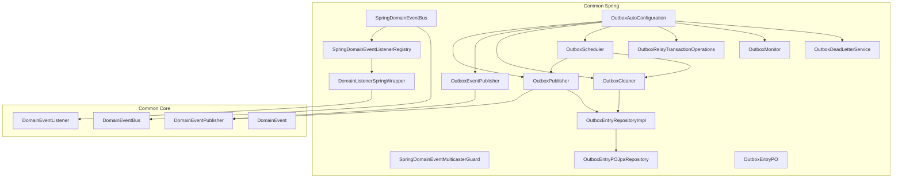
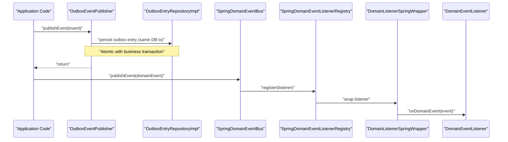
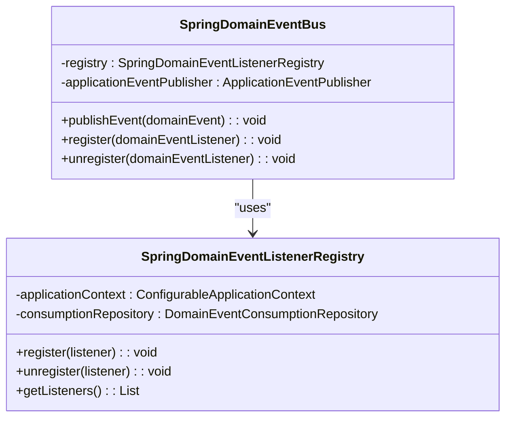
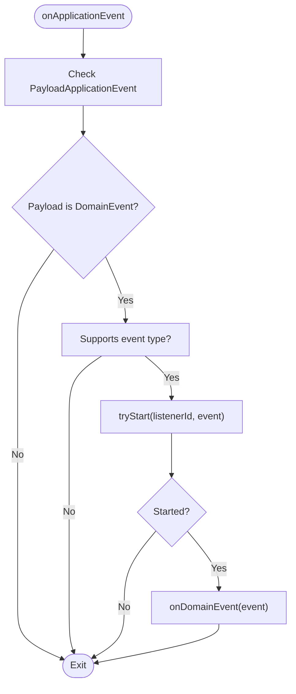
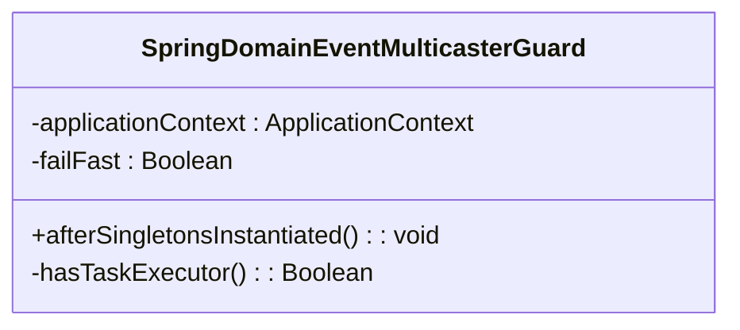
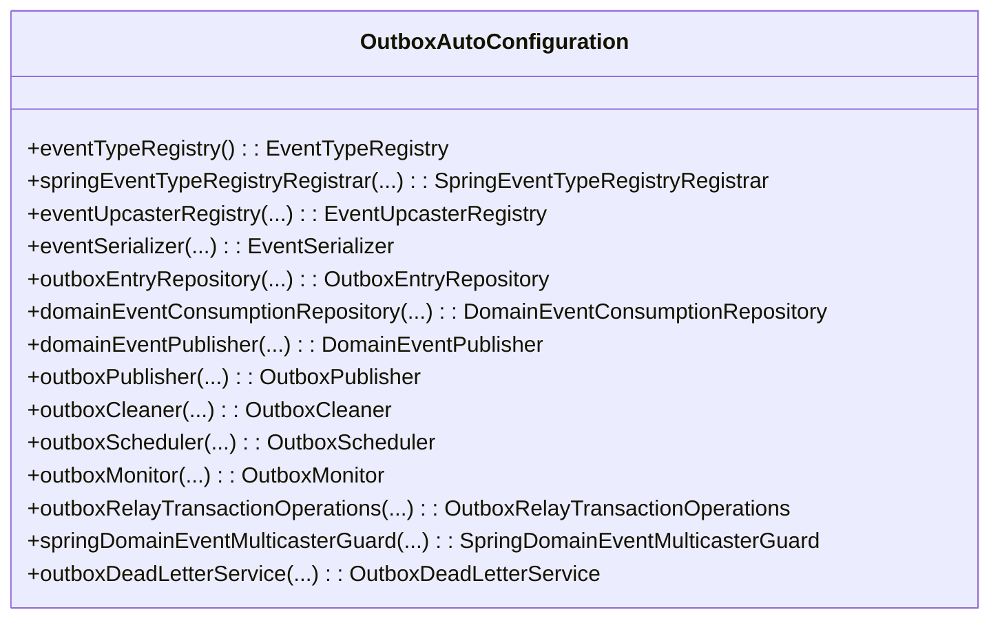
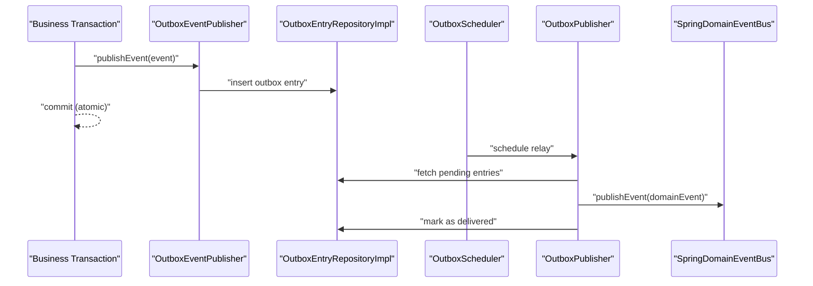
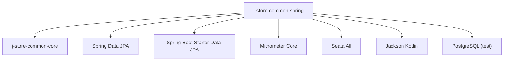

# Common Spring Module

<cite>
**Referenced Files in This Document**
- [SpringDomainEventBus.kt](file://j-store-common-spring/src/main/kotlin/com/jstore/common/framework/event/SpringDomainEventBus.kt)
- [SpringDomainEventListenerRegistry.kt](file://j-store-common-spring/src/main/kotlin/com/jstore/common/framework/event/SpringDomainEventListenerRegistry.kt)
- [DomainListenerSpringWrapper.kt](file://j-store-common-spring/src/main/kotlin/com/jstore/common/framework/event/DomainListenerSpringWrapper.kt)
- [SpringDomainEventMulticasterGuard.kt](file://j-store-common-spring/src/main/kotlin/com/jstore/common/framework/event/SpringDomainEventMulticasterGuard.kt)
- [OutboxAutoConfiguration.kt](file://j-store-common-spring/src/main/kotlin/com/jstore/common/framework/event/outbox/OutboxAutoConfiguration.kt)
- [OutboxProperties.kt](file://j-store-common-spring/src/main/kotlin/com/jstore/common/framework/event/outbox/OutboxProperties.kt)
- [OutboxPublisher.kt](file://j-store-common-spring/src/main/kotlin/com/jstore/common/framework/event/outbox/OutboxPublisher.kt)
- [OutboxEventPublisher.kt](file://j-store-common-spring/src/main/kotlin/com/jstore/common/framework/event/outbox/OutboxEventPublisher.kt)
- [OutboxCleaner.kt](file://j-store-common-spring/src/main/kotlin/com/jstore/common/framework/event/outbox/OutboxCleaner.kt)
- [OutboxScheduler.kt](file://j-store-common-spring/src/main/kotlin/com/jstore/common/framework/event/outbox/OutboxScheduler.kt)
- [OutboxRelayTransactionOperations.kt](file://j-store-common-spring/src/main/kotlin/com/jstore/common/framework/event/outbox/OutboxRelayTransactionOperations.kt)
- [OutboxMonitor.kt](file://j-store-common-spring/src/main/kotlin/com/jstore/common/framework/event/outbox/OutboxMonitor.kt)
- [OutboxDeadLetterService.kt](file://j-store-common-spring/src/main/kotlin/com/jstore/common/framework/event/outbox/OutboxDeadLetterService.kt)
- [OutboxEntryPO.kt](file://j-store-common-spring/src/main/kotlin/com/jstore/common/framework/event/outbox/persistence/OutboxEntryPO.kt)
- [OutboxEntryRepositoryImpl.kt](file://j-store-common-spring/src/main/kotlin/com/jstore/common/framework/event/outbox/persistence/OutboxEntryRepositoryImpl.kt)
- [DomainEvent.kt](file://j-store-common-core/src/main/kotlin/com/jstore/common/framework/event/DomainEvent.kt)
- [DomainEventBus.kt](file://j-store-common-core/src/main/kotlin/com/jstore/common/framework/event/DomainEventBus.kt)
- [DomainEventPublisher.kt](file://j-store-common-core/src/main/kotlin/com/jstore/common/framework/event/DomainEventPublisher.kt)
- [DomainEventListener.kt](file://j-store-common-core/src/main/kotlin/com/jstore/common/framework/event/DomainEventListener.kt)
- [build.gradle.kts](file://j-store-common-spring/build.gradle.kts)
</cite>

## Table of Contents
1. [Introduction](#introduction)
2. [Project Structure](#project-structure)
3. [Core Components](#core-components)
4. [Architecture Overview](#architecture-overview)
5. [Detailed Component Analysis](#detailed-component-analysis)
6. [Dependency Analysis](#dependency-analysis)
7. [Performance Considerations](#performance-considerations)
8. [Troubleshooting Guide](#troubleshooting-guide)
9. [Conclusion](#conclusion)
10. [Appendices](#appendices)

## Introduction
The Common Spring module provides Spring-specific implementations and integrations for the core eventing framework. It bridges the domain layer with Spring infrastructure by:
- Implementing a Spring-backed DomainEventBus that delegates to Spring’s ApplicationEventPublisher
- Registering domain event listeners via Spring’s application context
- Providing an Outbox pattern implementation with transactional guarantees, ensuring events are persisted atomically with business data and later relayed reliably
- Offering auto-configuration for outbox components, scheduling, monitoring, and dead-letter handling
- Exposing Spring-aware utilities such as listener wrappers and multicaster guards to preserve transaction boundaries and reliability

This module is designed for applications using Spring Boot and JPA, leveraging Spring’s dependency injection, transaction management, and scheduling capabilities while keeping domain code free from framework dependencies.

## Project Structure
The module organizes functionality around two main areas:
- Event bus and listener integration with Spring
- Outbox pattern implementation with persistence and scheduled relay

**Diagram sources**
- [SpringDomainEventBus.kt](file://j-store-common-spring/src/main/kotlin/com/jstore/common/framework/event/SpringDomainEventBus.kt)
- [SpringDomainEventListenerRegistry.kt](file://j-store-common-spring/src/main/kotlin/com/jstore/common/framework/event/SpringDomainEventListenerRegistry.kt)
- [DomainListenerSpringWrapper.kt](file://j-store-common-spring/src/main/kotlin/com/jstore/common/framework/event/DomainListenerSpringWrapper.kt)
- [SpringDomainEventMulticasterGuard.kt](file://j-store-common-spring/src/main/kotlin/com/jstore/common/framework/event/SpringDomainEventMulticasterGuard.kt)
- [OutboxAutoConfiguration.kt](file://j-store-common-spring/src/main/kotlin/com/jstore/common/framework/event/outbox/OutboxAutoConfiguration.kt)
- [OutboxPublisher.kt](file://j-store-common-spring/src/main/kotlin/com/jstore/common/framework/event/outbox/OutboxPublisher.kt)
- [OutboxEventPublisher.kt](file://j-store-common-spring/src/main/kotlin/com/jstore/common/framework/event/outbox/OutboxEventPublisher.kt)
- [OutboxCleaner.kt](file://j-store-common-spring/src/main/kotlin/com/jstore/common/framework/event/outbox/OutboxCleaner.kt)
- [OutboxScheduler.kt](file://j-store-common-spring/src/main/kotlin/com/jstore/common/framework/event/outbox/OutboxScheduler.kt)
- [OutboxRelayTransactionOperations.kt](file://j-store-common-spring/src/main/kotlin/com/jstore/common/framework/event/outbox/OutboxRelayTransactionOperations.kt)
- [OutboxMonitor.kt](file://j-store-common-spring/src/main/kotlin/com/jstore/common/framework/event/outbox/OutboxMonitor.kt)
- [OutboxDeadLetterService.kt](file://j-store-common-spring/src/main/kotlin/com/jstore/common/framework/event/outbox/OutboxDeadLetterService.kt)
- [OutboxEntryRepositoryImpl.kt](file://j-store-common-spring/src/main/kotlin/com/jstore/common/framework/event/outbox/persistence/OutboxEntryRepositoryImpl.kt)
- [OutboxEntryPO.kt](file://j-store-common-spring/src/main/kotlin/com/jstore/common/framework/event/outbox/persistence/OutboxEntryPO.kt)
- [DomainEventBus.kt](file://j-store-common-core/src/main/kotlin/com/jstore/common/framework/event/DomainEventBus.kt)
- [DomainEventPublisher.kt](file://j-store-common-core/src/main/kotlin/com/jstore/common/framework/event/DomainEventPublisher.kt)
- [DomainEventListener.kt](file://j-store-common-core/src/main/kotlin/com/jstore/common/framework/event/DomainEventListener.kt)
- [DomainEvent.kt](file://j-store-common-core/src/main/kotlin/com/jstore/common/framework/event/DomainEvent.kt)

**Section sources**
- [build.gradle.kts](file://j-store-common-spring/build.gradle.kts)

## Core Components
- SpringDomainEventBus: Implements DomainEventBus by delegating publishEvent to Spring’s ApplicationEventPublisher and registering/unregistering listeners through SpringDomainEventListenerRegistry.
- SpringDomainEventListenerRegistry: Wraps domain listeners into Spring’s GenericApplicationListener (DomainListenerSpringWrapper), enabling type-safe delivery and consumption tracking.
- DomainListenerSpringWrapper: Adapts DomainEventListener to Spring’s event system, filtering supported event types and invoking onDomainEvent within idempotent consumption semantics.
- SpringDomainEventMulticasterGuard: Ensures reliable outbox relay by warning or failing fast if the application event multicaster is configured asynchronously.
- OutboxAutoConfiguration: Auto-configures all outbox-related beans including serializers, repositories, publisher, cleaner, scheduler, monitor, and dead-letter service.
- OutboxPublisher and OutboxEventPublisher: Provide transactional outbox publishing; OutboxPublisher relays persisted entries to the domain event bus, while OutboxEventPublisher persists events atomically with business transactions.
- OutboxCleaner and OutboxScheduler: Periodically clean up processed entries and schedule relay tasks.
- OutboxRelayTransactionOperations: Abstracts transactional operations for outbox relay, implemented with Spring PlatformTransactionManager.
- OutboxMonitor and OutboxDeadLetterService: Provide metrics and dead-letter handling for failed deliveries.

**Section sources**
- [SpringDomainEventBus.kt](file://j-store-common-spring/src/main/kotlin/com/jstore/common/framework/event/SpringDomainEventBus.kt)
- [SpringDomainEventListenerRegistry.kt](file://j-store-common-spring/src/main/kotlin/com/jstore/common/framework/event/SpringDomainEventListenerRegistry.kt)
- [DomainListenerSpringWrapper.kt](file://j-store-common-spring/src/main/kotlin/com/jstore/common/framework/event/DomainListenerSpringWrapper.kt)
- [SpringDomainEventMulticasterGuard.kt](file://j-store-common-spring/src/main/kotlin/com/jstore/common/framework/event/SpringDomainEventMulticasterGuard.kt)
- [OutboxAutoConfiguration.kt](file://j-store-common-spring/src/main/kotlin/com/jstore/common/framework/event/outbox/OutboxAutoConfiguration.kt)
- [OutboxPublisher.kt](file://j-store-common-spring/src/main/kotlin/com/jstore/common/framework/event/outbox/OutboxPublisher.kt)
- [OutboxEventPublisher.kt](file://j-store-common-spring/src/main/kotlin/com/jstore/common/framework/event/outbox/OutboxEventPublisher.kt)
- [OutboxCleaner.kt](file://j-store-common-spring/src/main/kotlin/com/jstore/common/framework/event/outbox/OutboxCleaner.kt)
- [OutboxScheduler.kt](file://j-store-common-spring/src/main/kotlin/com/jstore/common/framework/event/outbox/OutboxScheduler.kt)
- [OutboxRelayTransactionOperations.kt](file://j-store-common-spring/src/main/kotlin/com/jstore/common/framework/event/outbox/OutboxRelayTransactionOperations.kt)
- [OutboxMonitor.kt](file://j-store-common-spring/src/main/kotlin/com/jstore/common/framework/event/outbox/OutboxMonitor.kt)
- [OutboxDeadLetterService.kt](file://j-store-common-spring/src/main/kotlin/com/jstore/common/framework/event/outbox/OutboxDeadLetterService.kt)

## Architecture Overview
The module integrates domain events with Spring’s event system and ensures reliable delivery via the outbox pattern.

**Diagram sources**
- [OutboxEventPublisher.kt](file://j-store-common-spring/src/main/kotlin/com/jstore/common/framework/event/outbox/OutboxEventPublisher.kt)
- [OutboxEntryRepositoryImpl.kt](file://j-store-common-spring/src/main/kotlin/com/jstore/common/framework/event/outbox/persistence/OutboxEntryRepositoryImpl.kt)
- [SpringDomainEventBus.kt](file://j-store-common-spring/src/main/kotlin/com/jstore/common/framework/event/SpringDomainEventBus.kt)
- [SpringDomainEventListenerRegistry.kt](file://j-store-common-spring/src/main/kotlin/com/jstore/common/framework/event/SpringDomainEventListenerRegistry.kt)
- [DomainListenerSpringWrapper.kt](file://j-store-common-spring/src/main/kotlin/com/jstore/common/framework/event/DomainListenerSpringWrapper.kt)
- [DomainEventPublisher.kt](file://j-store-common-core/src/main/kotlin/com/jstore/common/framework/event/DomainEventPublisher.kt)
- [DomainEventBus.kt](file://j-store-common-core/src/main/kotlin/com/jstore/common/framework/event/DomainEventBus.kt)
- [DomainEventListener.kt](file://j-store-common-core/src/main/kotlin/com/jstore/common/framework/event/DomainEventListener.kt)

## Detailed Component Analysis

### SpringDomainEventBus
Delegates event publishing to Spring’s ApplicationEventPublisher and manages listener registration via SpringDomainEventListenerRegistry. This keeps domain code decoupled from Spring while leveraging its event infrastructure.

**Diagram sources**
- [SpringDomainEventBus.kt](file://j-store-common-spring/src/main/kotlin/com/jstore/common/framework/event/SpringDomainEventBus.kt)
- [SpringDomainEventListenerRegistry.kt](file://j-store-common-spring/src/main/kotlin/com/jstore/common/framework/event/SpringDomainEventListenerRegistry.kt)

**Section sources**
- [SpringDomainEventBus.kt](file://j-store-common-spring/src/main/kotlin/com/jstore/common/framework/event/SpringDomainEventBus.kt)
- [SpringDomainEventListenerRegistry.kt](file://j-store-common-spring/src/main/kotlin/com/jstore/common/framework/event/SpringDomainEventListenerRegistry.kt)

### DomainListenerSpringWrapper
Adapts DomainEventListener to Spring’s event system, ensuring only supported event types are handled and providing idempotent consumption via DomainEventConsumptionRepository.

**Diagram sources**
- [DomainListenerSpringWrapper.kt](file://j-store-common-spring/src/main/kotlin/com/jstore/common/framework/event/DomainListenerSpringWrapper.kt)

**Section sources**
- [DomainListenerSpringWrapper.kt](file://j-store-common-spring/src/main/kotlin/com/jstore/common/framework/event/DomainListenerSpringWrapper.kt)

### SpringDomainEventMulticasterGuard
Ensures that asynchronous event multicasting does not compromise outbox reliability. Warns or fails fast based on configuration when async task executor is detected.

**Diagram sources**
- [SpringDomainEventMulticasterGuard.kt](file://j-store-common-spring/src/main/kotlin/com/jstore/common/framework/event/SpringDomainEventMulticasterGuard.kt)

**Section sources**
- [SpringDomainEventMulticasterGuard.kt](file://j-store-common-spring/src/main/kotlin/com/jstore/common/framework/event/SpringDomainEventMulticasterGuard.kt)

### Outbox Auto-Configuration
OutboxAutoConfiguration wires all outbox components, enabling conditional activation via properties and integrating with Spring Boot features like scheduling and Micrometer metrics.

**Diagram sources**
- [OutboxAutoConfiguration.kt](file://j-store-common-spring/src/main/kotlin/com/jstore/common/framework/event/outbox/OutboxAutoConfiguration.kt)

**Section sources**
- [OutboxAutoConfiguration.kt](file://j-store-common-spring/src/main/kotlin/com/jstore/common/framework/event/outbox/OutboxAutoConfiguration.kt)

### Outbox Pattern Implementation
The outbox pattern ensures atomic persistence of events alongside business data and reliable relay to the domain event bus.

**Diagram sources**
- [OutboxEventPublisher.kt](file://j-store-common-spring/src/main/kotlin/com/jstore/common/framework/event/outbox/OutboxEventPublisher.kt)
- [OutboxEntryRepositoryImpl.kt](file://j-store-common-spring/src/main/kotlin/com/jstore/common/framework/event/outbox/persistence/OutboxEntryRepositoryImpl.kt)
- [OutboxScheduler.kt](file://j-store-common-spring/src/main/kotlin/com/jstore/common/framework/event/outbox/OutboxScheduler.kt)
- [OutboxPublisher.kt](file://j-store-common-spring/src/main/kotlin/com/jstore/common/framework/event/outbox/OutboxPublisher.kt)
- [SpringDomainEventBus.kt](file://j-store-common-spring/src/main/kotlin/com/jstore/common/framework/event/SpringDomainEventBus.kt)

**Section sources**
- [OutboxEventPublisher.kt](file://j-store-common-spring/src/main/kotlin/com/jstore/common/framework/event/outbox/OutboxEventPublisher.kt)
- [OutboxPublisher.kt](file://j-store-common-spring/src/main/kotlin/com/jstore/common/framework/event/outbox/OutboxPublisher.kt)
- [OutboxScheduler.kt](file://j-store-common-spring/src/main/kotlin/com/jstore/common/framework/event/outbox/OutboxScheduler.kt)
- [OutboxEntryRepositoryImpl.kt](file://j-store-common-spring/src/main/kotlin/com/jstore/common/framework/event/outbox/persistence/OutboxEntryRepositoryImpl.kt)

### Configuration Properties
Outbox behavior is controlled via OutboxProperties, including toggles for enabling the feature and configuring async multicaster behavior.

- Enable/disable outbox via property prefix jstore.outbox.enabled
- Configure async multicaster fail-fast behavior via asyncMulticasterFailFast
- Scan packages for event types via eventTypeScanPackages

**Section sources**
- [OutboxProperties.kt](file://j-store-common-spring/src/main/kotlin/com/jstore/common/framework/event/outbox/OutboxProperties.kt)
- [OutboxAutoConfiguration.kt](file://j-store-common-spring/src/main/kotlin/com/jstore/common/framework/event/outbox/OutboxAutoConfiguration.kt)

## Dependency Analysis
The module depends on Spring Boot, JPA, and Micrometer for auto-configuration, persistence, and monitoring. It also integrates with Seata for distributed transactions if needed.

**Diagram sources**
- [build.gradle.kts](file://j-store-common-spring/build.gradle.kts)

**Section sources**
- [build.gradle.kts](file://j-store-common-spring/build.gradle.kts)

## Performance Considerations
- Avoid asynchronous event multicasting for domain listeners to preserve transaction boundaries and outbox reliability. Use SpringDomainEventMulticasterGuard to detect and warn/fail fast.
- Ensure outbox relay tasks run with appropriate concurrency settings to avoid bottlenecks.
- Monitor outbox metrics via Micrometer to track delivery latency and failure rates.
- Keep event payloads small and serializable efficiently using Jackson with proper configurations.
- Use explicit event metadata for stable IDs and idempotent consumers.

[No sources needed since this section provides general guidance]

## Troubleshooting Guide
- Asynchronous multicaster warnings: If the application event multicaster is configured with a task executor, the guard will warn or throw an exception depending on failFast configuration. Adjust multicaster settings or disable async execution for domain listeners.
- Event not delivered: Verify outbox entries are being persisted and relayed. Check OutboxPublisher logs and metrics. Ensure scheduled tasks are running.
- Duplicate processing: Ensure DomainEventListener.listenerId() returns a stable identifier and that consumption tracking is enabled via DomainEventConsumptionRepository.
- Serialization errors: Validate event classes are serializable and registered in the event type registry. Check upcasters for backward compatibility.

**Section sources**
- [SpringDomainEventMulticasterGuard.kt](file://j-store-common-spring/src/main/kotlin/com/jstore/common/framework/event/SpringDomainEventMulticasterGuard.kt)
- [OutboxAutoConfiguration.kt](file://j-store-common-spring/src/main/kotlin/com/jstore/common/framework/event/outbox/OutboxAutoConfiguration.kt)
- [DomainListenerSpringWrapper.kt](file://j-store-common-spring/src/main/kotlin/com/jstore/common/framework/event/DomainListenerSpringWrapper.kt)

## Conclusion
The Common Spring module provides a robust foundation for event-driven architecture within Spring applications. By combining Spring’s dependency injection and event system with the outbox pattern, it ensures reliable, transactional event publishing and delivery. The auto-configuration simplifies setup, while monitoring and dead-letter handling support operational excellence. Following best practices for listener design, transaction boundaries, and performance tuning enables scalable and maintainable event-driven systems.

[No sources needed since this section summarizes without analyzing specific files]

## Appendices

### Best Practices for Event-Driven Architecture in Spring
- Implement DomainEventListener with stable listenerId() for idempotency
- Use ExplicitDomainEvent for stable metadata and versioning
- Persist events via OutboxEventPublisher within business transactions
- Avoid async multicasting for domain listeners to preserve reliability
- Monitor outbox metrics and configure alerts for failures
- Use event upcasters for backward-compatible schema evolution

[No sources needed since this section provides general guidance]