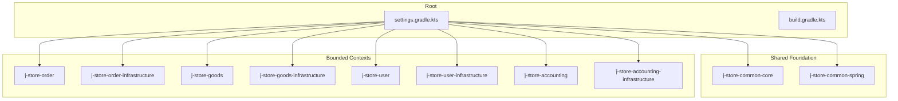
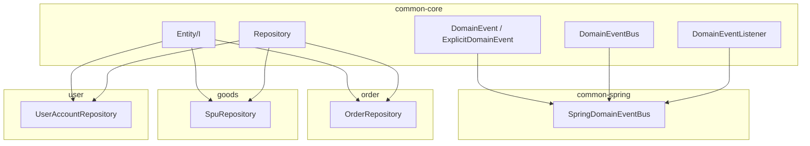
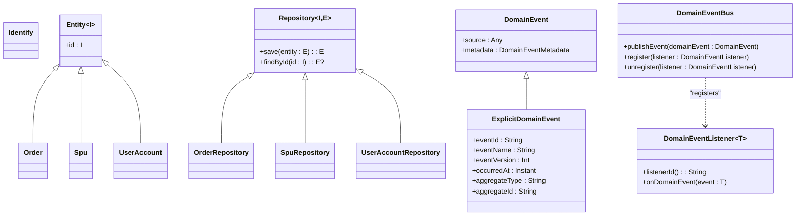
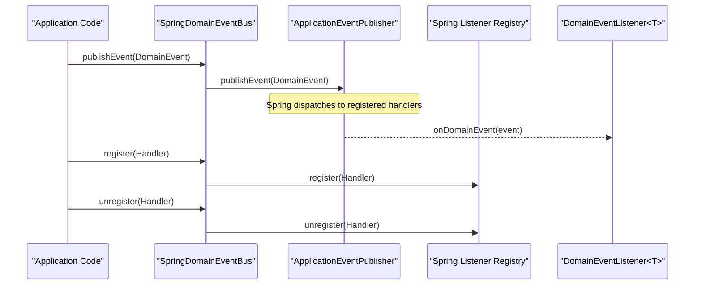
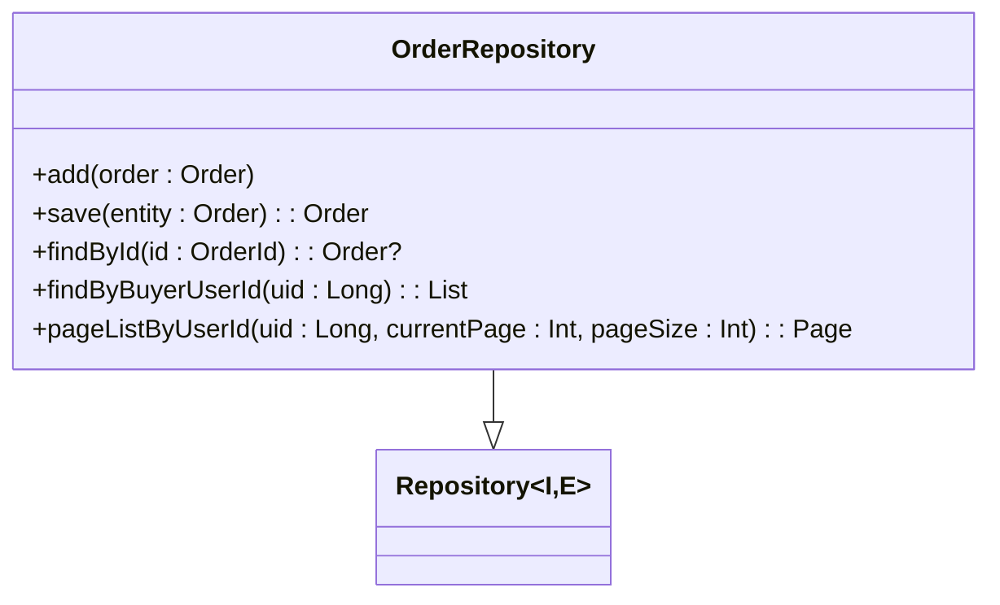
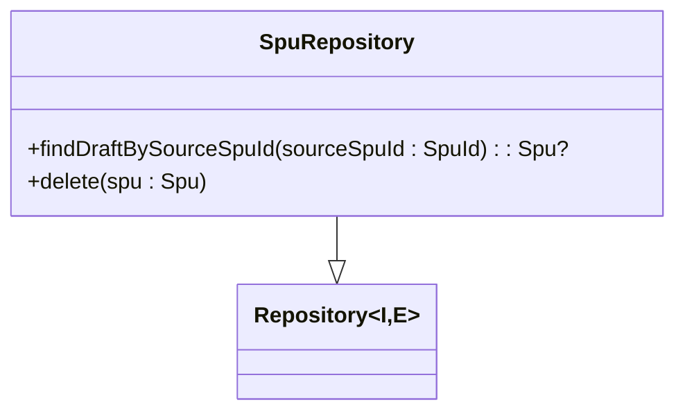
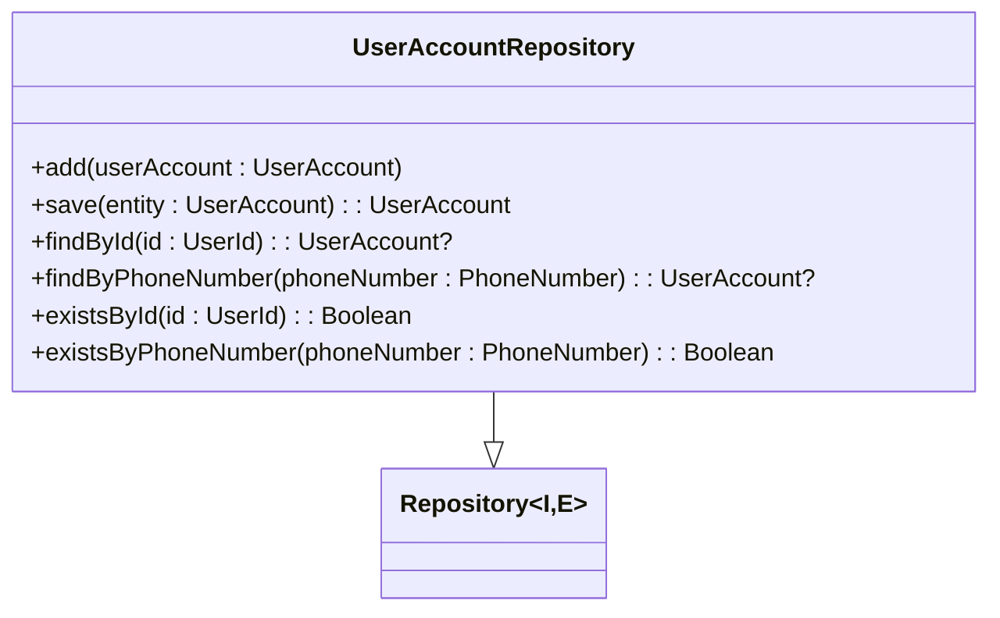
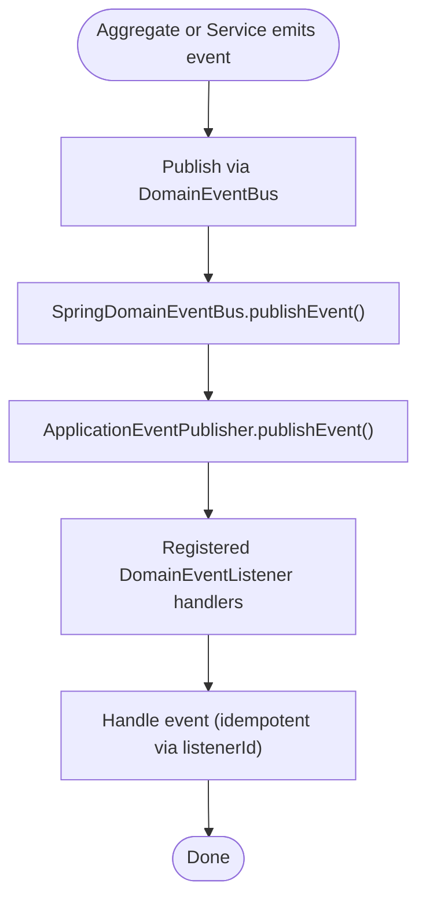
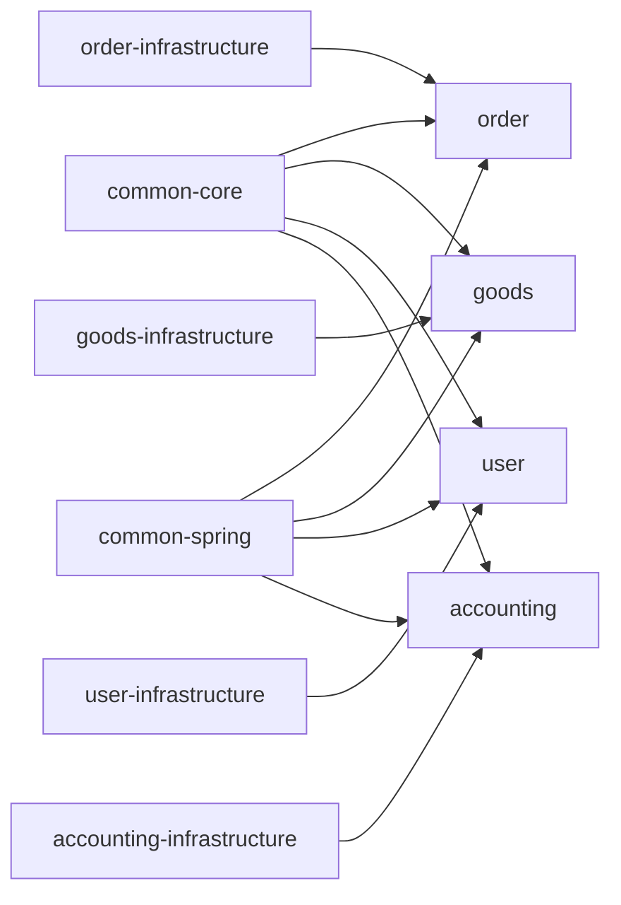

# Core Modules

<cite>
**Referenced Files in This Document**
- [settings.gradle.kts](file://settings.gradle.kts)
- [build.gradle.kts](file://build.gradle.kts)
- [README.md](file://README.md)
- [Entity.kt](file://j-store-common-core/src/main/kotlin/com/jstore/common/framework/Entity.kt)
- [Identify.kt](file://j-store-common-core/src/main/kotlin/com/jstore/common/framework/Identify.kt)
- [Repository.kt](file://j-store-common-core/src/main/kotlin/com/jstore/common/framework/Repository.kt)
- [DomainEvent.kt](file://j-store-common-core/src/main/kotlin/com/jstore/common/framework/event/DomainEvent.kt)
- [DomainEventBus.kt](file://j-store-common-core/src/main/kotlin/com/jstore/common/framework/event/DomainEventBus.kt)
- [DomainEventListener.kt](file://j-store-common-core/src/main/kotlin/com/jstore/common/framework/event/DomainEventListener.kt)
- [SpringDomainEventBus.kt](file://j-store-common-spring/src/main/kotlin/com/jstore/common/framework/event/SpringDomainEventBus.kt)
- [OrderRepository.kt](file://j-store-order/src/main/kotlin/com/jstore/order/domain/order/OrderRepository.kt)
- [SpuRepository.kt](file://j-store-goods/src/main/kotlin/com/jstore/goods/domain/commodity/SpuRepository.kt)
- [UserAccountRepository.kt](file://j-store-user/src/main/kotlin/com/jstore/user/domain/useraccount/UserAccountRepository.kt)
</cite>

## Table of Contents
1. Introduction
2. Project Structure
3. Core Components
4. Architecture Overview
5. Detailed Component Analysis
6. Dependency Analysis
7. Performance Considerations
8. Troubleshooting Guide
9. Conclusion

## Introduction
This document explains the core modules that form J-Store’s shared foundation and bounded contexts. It covers:
- common-core: domain framework types (entities, repositories, events)
- common-spring: Spring-specific utilities (event bus wiring)
- Bounded context modules: order, goods, user, accounting
It also details the repository pattern, event bus architecture, and how modules interact through well-defined interfaces and events. The content is designed for both beginners understanding module boundaries and experienced developers working with the framework.

## Project Structure
J-Store is a multi-module Gradle project. The root configuration defines all modules, including shared foundations and domain modules. Each domain typically has a “domain” module and an “infrastructure” module for persistence and external integrations.

**Diagram sources**
- [settings.gradle.kts:1-28](file://settings.gradle.kts#L1-L28)

**Section sources**
- [settings.gradle.kts:1-28](file://settings.gradle.kts#L1-L28)
- [build.gradle.kts:1-28](file://build.gradle.kts#L1-L28)

## Core Components
The shared foundation provides reusable building blocks used across all bounded contexts.

- Domain primitives
  - Identify: base marker for identifiers
  - Entity<I>: base entity interface with typed id
  - Repository<I, E>: generic repository contract for persistence abstraction

- Eventing primitives
  - DomainEvent and ExplicitDomainEvent: stable envelope metadata for reliable delivery and idempotent consumers
  - DomainEventBus: in-process event bus interface
  - DomainEventListener<T>: typed listener contract with a stable listenerId for idempotency

- Spring integration
  - SpringDomainEventBus: delegates to Spring ApplicationEventPublisher and registers listeners via Spring registry

These components are intentionally minimal and framework-agnostic in common-core, while common-spring wires them into Spring.

**Section sources**
- [Entity.kt:1-5](file://j-store-common-core/src/main/kotlin/com/jstore/common/framework/Entity.kt#L1-L5)
- [Identify.kt:1-3](file://j-store-common-core/src/main/kotlin/com/jstore/common/framework/Identify.kt#L1-L3)
- [Repository.kt:1-7](file://j-store-common-core/src/main/kotlin/com/jstore/common/framework/Repository.kt#L1-L7)
- [DomainEvent.kt:1-74](file://j-store-common-core/src/main/kotlin/com/jstore/common/framework/event/DomainEvent.kt#L1-L74)
- [DomainEventBus.kt:1-14](file://j-store-common-core/src/main/kotlin/com/jstore/common/framework/event/DomainEventBus.kt#L1-L14)
- [DomainEventListener.kt:1-25](file://j-store-common-core/src/main/kotlin/com/jstore/common/framework/event/DomainEventListener.kt#L1-L25)
- [SpringDomainEventBus.kt:1-24](file://j-store-common-spring/src/main/kotlin/com/jstore/common/framework/event/SpringDomainEventBus.kt#L1-L24)

## Architecture Overview
At a high level:
- Domain modules define aggregates, value objects, commands, and repository interfaces.
- Infrastructure modules implement repositories and external integrations.
- common-core defines the domain framework contracts.
- common-spring integrates the event bus with Spring.

**Diagram sources**
- [Entity.kt:1-5](file://j-store-common-core/src/main/kotlin/com/jstore/common/framework/Entity.kt#L1-L5)
- [Repository.kt:1-7](file://j-store-common-core/src/main/kotlin/com/jstore/common/framework/Repository.kt#L1-L7)
- [DomainEvent.kt:1-74](file://j-store-common-core/src/main/kotlin/com/jstore/common/framework/event/DomainEvent.kt#L1-L74)
- [DomainEventBus.kt:1-14](file://j-store-common-core/src/main/kotlin/com/jstore/common/framework/event/DomainEventBus.kt#L1-L14)
- [DomainEventListener.kt:1-25](file://j-store-common-core/src/main/kotlin/com/jstore/common/framework/event/DomainEventListener.kt#L1-L25)
- [SpringDomainEventBus.kt:1-24](file://j-store-common-spring/src/main/kotlin/com/jstore/common/framework/event/SpringDomainEventBus.kt#L1-L24)
- [OrderRepository.kt:1-39](file://j-store-order/src/main/kotlin/com/jstore/order/domain/order/OrderRepository.kt#L1-L39)
- [SpuRepository.kt:1-12](file://j-store-goods/src/main/kotlin/com/jstore/goods/domain/commodity/SpuRepository.kt#L1-L12)
- [UserAccountRepository.kt:1-30](file://j-store-user/src/main/kotlin/com/jstore/user/domain/useraccount/UserAccountRepository.kt#L1-L30)

## Detailed Component Analysis

### Shared Foundation: common-core
- Entities and Identifiers
  - Identify: base marker for identifiers
  - Entity<I>: entities expose a stable id of type I
- Repository Pattern
  - Repository<I, E>: generic contract with save and findById; domain repositories extend this to add domain-specific queries
- Events
  - DomainEvent and ExplicitDomainEvent: provide stable metadata (eventId, eventName, eventVersion, occurredAt, aggregateType, aggregateId)
  - DomainEventBus: publish and register/unregister listeners
  - DomainEventListener<T>: typed handler with listenerId for idempotent consumption

**Diagram sources**
- [Entity.kt:1-5](file://j-store-common-core/src/main/kotlin/com/jstore/common/framework/Entity.kt#L1-L5)
- [Repository.kt:1-7](file://j-store-common-core/src/main/kotlin/com/jstore/common/framework/Repository.kt#L1-L7)
- [DomainEvent.kt:1-74](file://j-store-common-core/src/main/kotlin/com/jstore/common/framework/event/DomainEvent.kt#L1-L74)
- [DomainEventBus.kt:1-14](file://j-store-common-core/src/main/kotlin/com/jstore/common/framework/event/DomainEventBus.kt#L1-L14)
- [DomainEventListener.kt:1-25](file://j-store-common-core/src/main/kotlin/com/jstore/common/framework/event/DomainEventListener.kt#L1-L25)
- [OrderRepository.kt:1-39](file://j-store-order/src/main/kotlin/com/jstore/order/domain/order/OrderRepository.kt#L1-L39)
- [SpuRepository.kt:1-12](file://j-store-goods/src/main/kotlin/com/jstore/goods/domain/commodity/SpuRepository.kt#L1-L12)
- [UserAccountRepository.kt:1-30](file://j-store-user/src/main/kotlin/com/jstore/user/domain/useraccount/UserAccountRepository.kt#L1-L30)

**Section sources**
- [Entity.kt:1-5](file://j-store-common-core/src/main/kotlin/com/jstore/common/framework/Entity.kt#L1-L5)
- [Repository.kt:1-7](file://j-store-common-core/src/main/kotlin/com/jstore/common/framework/Repository.kt#L1-L7)
- [DomainEvent.kt:1-74](file://j-store-common-core/src/main/kotlin/com/jstore/common/framework/event/DomainEvent.kt#L1-L74)
- [DomainEventBus.kt:1-14](file://j-store-common-core/src/main/kotlin/com/jstore/common/framework/event/DomainEventBus.kt#L1-L14)
- [DomainEventListener.kt:1-25](file://j-store-common-core/src/main/kotlin/com/jstore/common/framework/event/DomainEventListener.kt#L1-L25)

### Shared Foundation: common-spring
- SpringDomainEventBus
  - Delegates publishing to Spring ApplicationEventPublisher
  - Registers/unregisters listeners via Spring registry
- Outbox support exists in common-spring under event/outbox for transactional reliability (referenced by infrastructure tests and configurations)

**Diagram sources**
- [SpringDomainEventBus.kt:1-24](file://j-store-common-spring/src/main/kotlin/com/jstore/common/framework/event/SpringDomainEventBus.kt#L1-L24)
- [DomainEventBus.kt:1-14](file://j-store-common-core/src/main/kotlin/com/jstore/common/framework/event/DomainEventBus.kt#L1-L14)
- [DomainEventListener.kt:1-25](file://j-store-common-core/src/main/kotlin/com/jstore/common/framework/event/DomainEventListener.kt#L1-L25)

**Section sources**
- [SpringDomainEventBus.kt:1-24](file://j-store-common-spring/src/main/kotlin/com/jstore/common/framework/event/SpringDomainEventBus.kt#L1-L24)

### Bounded Context: Order
- Repository: OrderRepository extends generic Repository<OrderId, Order>, adding add, save, findById, findByBuyerUserId, and pageListByUserId
- Purpose: encapsulates order persistence operations and query capabilities exposed to application services

**Diagram sources**
- [OrderRepository.kt:1-39](file://j-store-order/src/main/kotlin/com/jstore/order/domain/order/OrderRepository.kt#L1-L39)
- [Repository.kt:1-7](file://j-store-common-core/src/main/kotlin/com/jstore/common/framework/Repository.kt#L1-L7)

**Section sources**
- [OrderRepository.kt:1-39](file://j-store-order/src/main/kotlin/com/jstore/order/domain/order/OrderRepository.kt#L1-L39)

### Bounded Context: Goods
- Repository: SpuRepository extends generic Repository<SpuId, Spu>, providing draft lookup and deletion for SPU lifecycle management

**Diagram sources**
- [SpuRepository.kt:1-12](file://j-store-goods/src/main/kotlin/com/jstore/goods/domain/commodity/SpuRepository.kt#L1-L12)
- [Repository.kt:1-7](file://j-store-common-core/src/main/kotlin/com/jstore/common/framework/Repository.kt#L1-L7)

**Section sources**
- [SpuRepository.kt:1-12](file://j-store-goods/src/main/kotlin/com/jstore/goods/domain/commodity/SpuRepository.kt#L1-L12)

### Bounded Context: User
- Repository: UserAccountRepository extends generic Repository<UserId, UserAccount>, supporting add, save, findById, findByPhoneNumber, and existence checks

**Diagram sources**
- [UserAccountRepository.kt:1-30](file://j-store-user/src/main/kotlin/com/jstore/user/domain/useraccount/UserAccountRepository.kt#L1-L30)
- [Repository.kt:1-7](file://j-store-common-core/src/main/kotlin/com/jstore/common/framework/Repository.kt#L1-L7)

**Section sources**
- [UserAccountRepository.kt:1-30](file://j-store-user/src/main/kotlin/com/jstore/user/domain/useraccount/UserAccountRepository.kt#L1-L30)

### Bounded Context: Accounting
- The accounting module follows the same pattern: domain definitions in j-store-accounting and persistence implementations in j-store-accounting-infrastructure.
- Use the same repository and event abstractions from common-core to maintain consistency across contexts.

[No sources needed since this section summarizes patterns already covered]

### Event Bus Architecture and Outbox
- In-process event bus: DomainEventBus publishes events within the JVM; SpringDomainEventBus bridges to Spring ApplicationEventPublisher
- Stable metadata: ExplicitDomainEvent ensures eventId, eventName, eventVersion, occurredAt, aggregateType, aggregateId for idempotent processing and diagnostics
- Outbox: Transactional outbox support is present in common-spring event/outbox to guarantee reliable delivery when combined with persistence transactions

**Diagram sources**
- [DomainEvent.kt:1-74](file://j-store-common-core/src/main/kotlin/com/jstore/common/framework/event/DomainEvent.kt#L1-L74)
- [DomainEventBus.kt:1-14](file://j-store-common-core/src/main/kotlin/com/jstore/common/framework/event/DomainEventBus.kt#L1-L14)
- [SpringDomainEventBus.kt:1-24](file://j-store-common-spring/src/main/kotlin/com/jstore/common/framework/event/SpringDomainEventBus.kt#L1-L24)
- [DomainEventListener.kt:1-25](file://j-store-common-core/src/main/kotlin/com/jstore/common/framework/event/DomainEventListener.kt#L1-L25)

**Section sources**
- [DomainEvent.kt:1-74](file://j-store-common-core/src/main/kotlin/com/jstore/common/framework/event/DomainEvent.kt#L1-L74)
- [DomainEventBus.kt:1-14](file://j-store-common-core/src/main/kotlin/com/jstore/common/framework/event/DomainEventBus.kt#L1-L14)
- [SpringDomainEventBus.kt:1-24](file://j-store-common-spring/src/main/kotlin/com/jstore/common/framework/event/SpringDomainEventBus.kt#L1-L24)
- [DomainEventListener.kt:1-25](file://j-store-common-core/src/main/kotlin/com/jstore/common/framework/event/DomainEventListener.kt#L1-L25)

## Dependency Analysis
Module dependencies follow clear boundaries:
- Domain modules depend on common-core for framework contracts
- Infrastructure modules depend on domain modules to implement repositories
- common-spring depends on common-core and Spring to wire eventing

**Diagram sources**
- [settings.gradle.kts:1-28](file://settings.gradle.kts#L1-L28)

**Section sources**
- [settings.gradle.kts:1-28](file://settings.gradle.kts#L1-L28)

## Performance Considerations
- Event bus: In-process publishing is fast; ensure handlers are efficient and avoid blocking long-running work inside synchronous handlers.
- Repositories: Keep repository methods focused; use pagination where applicable to reduce memory footprint.
- Outbox: Use transactional outbox to decouple persistence and event emission, improving throughput and reliability.

[No sources needed since this section provides general guidance]

## Troubleshooting Guide
- Event handling idempotency: Ensure each DomainEventListener implements a stable listenerId to prevent duplicate processing.
- Missing listeners: Verify registration via Spring registry and that the event type matches the listener’s generic parameter.
- Metadata validation: ExplicitDomainEvent must supply stable metadata; otherwise metadata extraction will fail.

**Section sources**
- [DomainEventListener.kt:1-25](file://j-store-common-core/src/main/kotlin/com/jstore/common/framework/event/DomainEventListener.kt#L1-L25)
- [DomainEvent.kt:1-74](file://j-store-common-core/src/main/kotlin/com/jstore/common/framework/event/DomainEvent.kt#L1-L74)

## Conclusion
J-Store’s core modules establish a clean separation between domain logic and infrastructure, using common-core for domain primitives and common-spring for Spring integration. The repository pattern abstracts persistence, while the event bus enables loose coupling across bounded contexts. Following these patterns ensures consistent, testable, and scalable development across order, goods, user, and accounting domains.