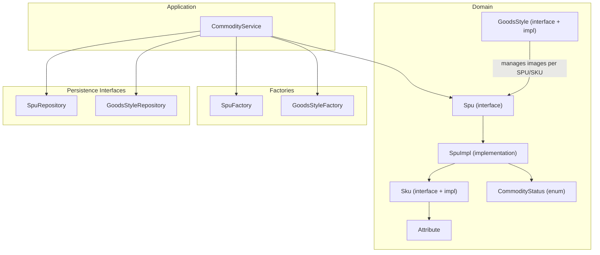
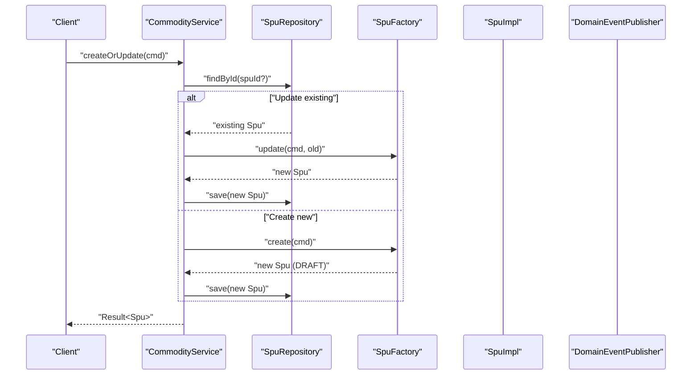
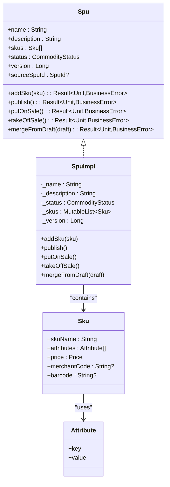
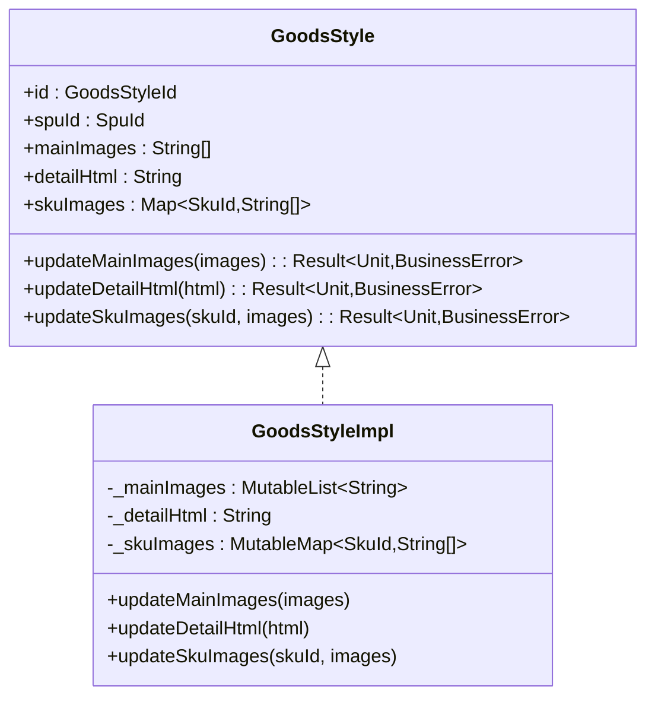
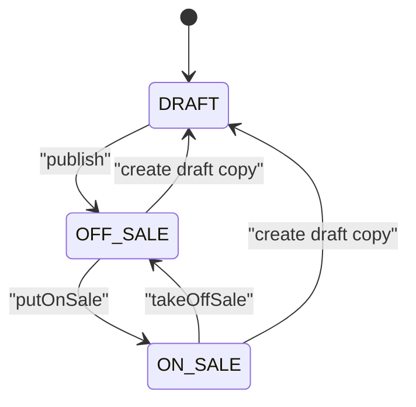
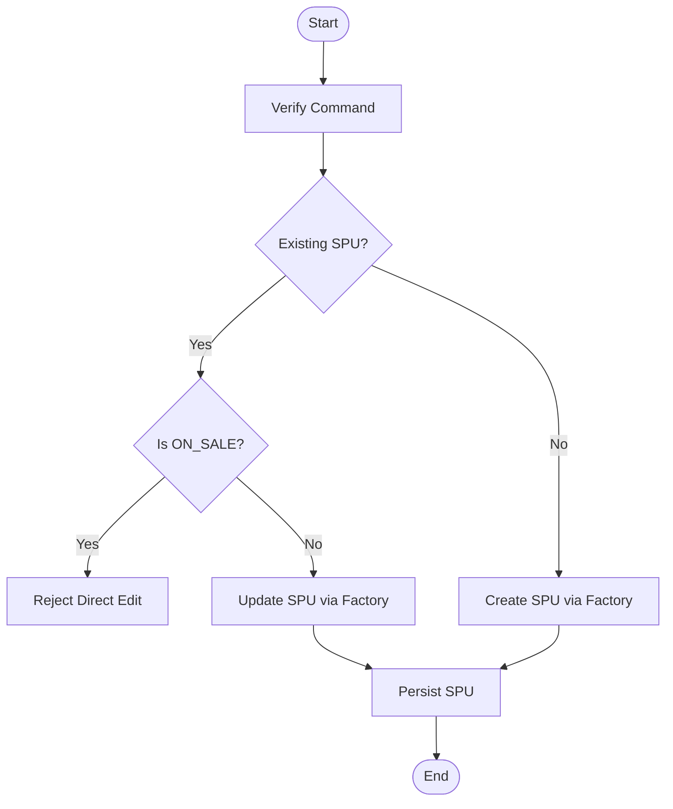
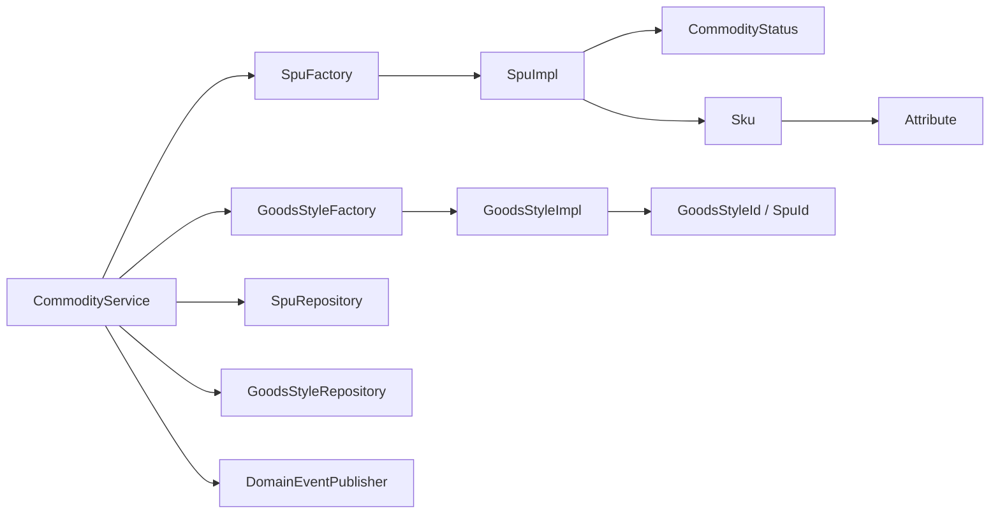

# Commodity Management

<cite>
**Referenced Files in This Document**
- [Spu.kt](file://j-store-goods/src/main/kotlin/com/jstore/goods/domain/commodity/Spu.kt)
- [Sku.kt](file://j-store-goods/src/main/kotlin/com/jstore/goods/domain/commodity/Sku.kt)
- [CommodityStatus.kt](file://j-store-goods/src/main/kotlin/com/jstore/goods/domain/commodity/CommodityStatus.kt)
- [GoodsStyle.kt](file://j-store-goods/src/main/kotlin/com/jstore/goods/domain/commodity/GoodsStyle.kt)
- [SpuImpl.kt](file://j-store-goods/src/main/kotlin/com/jstore/goods/domain/commodity/SpuImpl.kt)
- [Attribute.kt](file://j-store-goods/src/main/kotlin/com/jstore/goods/domain/commodity/Attribute.kt)
- [SpuFactory.kt](file://j-store-goods/src/main/kotlin/com/jstore/goods/domain/commodity/SpuFactory.kt)
- [GoodsStyleFactory.kt](file://j-store-goods/src/main/kotlin/com/jstore/goods/domain/commodity/GoodsStyleFactory.kt)
- [CommodityErrors.kt](file://j-store-goods/src/main/kotlin/com/jstore/goods/domain/commodity/CommodityErrors.kt)
- [CommodityService.kt](file://j-store-goods/src/main/kotlin/com/jstore/goods/service/CommodityService.kt)
- [CommodityCreateCmd.kt](file://j-store-goods/src/main/kotlin/com/jstore/goods/domain/commodity/comand/CommodityCreateCmd.kt)
- [SkuCreateCmd.kt](file://j-store-goods/src/main/kotlin/com/jstore/goods/domain/commodity/comand/SkuCreateCmd.kt)
- [SpuRepository.kt](file://j-store-goods/src/main/kotlin/com/jstore/goods/domain/commodity/SpuRepository.kt)
- [GoodsStyleRepository.kt](file://j-store-goods/src/main/kotlin/com/jstore/goods/domain/commodity/GoodsStyleRepository.kt)
</cite>

## Table of Contents
1. [Introduction](#introduction)
2. [Project Structure](#project-structure)
3. [Core Components](#core-components)
4. [Architecture Overview](#architecture-overview)
5. [Detailed Component Analysis](#detailed-component-analysis)
6. [Dependency Analysis](#dependency-analysis)
7. [Performance Considerations](#performance-considerations)
8. [Troubleshooting Guide](#troubleshooting-guide)
9. [Conclusion](#conclusion)
10. [Appendices](#appendices)

## Introduction
This document explains the Commodity Management system that models product catalog data using a two-level hierarchy: SPU (Standard Product Unit) and SKU (Stock Keeping Unit). It covers the Spu interface and implementation, Sku model with pricing and attributes, GoodsStyle for presentation, and the CommodityStatus lifecycle transitions from DRAFT to OFF_SALE to ON_SALE. It also provides practical examples for creating products, adding SKUs, managing variants, and handling state transitions, while clarifying how SPU and SKU collaborate to represent catalog data.

## Project Structure
The commodity domain is implemented within the goods module under the commodity package. Key elements include:
- Domain interfaces and entities: Spu, Sku, Attribute, GoodsStyle
- Implementations: SpuImpl, GoodsStyleImpl
- Factories: SpuFactory, GoodsStyleFactory
- Commands: CommodityCreateCmd, SkuCreateCmd
- Repositories: SpuRepository, GoodsStyleRepository
- Application service: CommodityService orchestrating operations and events

**Diagram sources**
- [Spu.kt](file://j-store-goods/src/main/kotlin/com/jstore/goods/domain/commodity/Spu.kt)
- [SpuImpl.kt](file://j-store-goods/src/main/kotlin/com/jstore/goods/domain/commodity/SpuImpl.kt)
- [Sku.kt](file://j-store-goods/src/main/kotlin/com/jstore/goods/domain/commodity/Sku.kt)
- [Attribute.kt](file://j-store-goods/src/main/kotlin/com/jstore/goods/domain/commodity/Attribute.kt)
- [GoodsStyle.kt](file://j-store-goods/src/main/kotlin/com/jstore/goods/domain/commodity/GoodsStyle.kt)
- [CommodityStatus.kt](file://j-store-goods/src/main/kotlin/com/jstore/goods/domain/commodity/CommodityStatus.kt)
- [CommodityService.kt](file://j-store-goods/src/main/kotlin/com/jstore/goods/service/CommodityService.kt)
- [SpuFactory.kt](file://j-store-goods/src/main/kotlin/com/jstore/goods/domain/commodity/SpuFactory.kt)
- [GoodsStyleFactory.kt](file://j-store-goods/src/main/kotlin/com/jstore/goods/domain/commodity/GoodsStyleFactory.kt)
- [SpuRepository.kt](file://j-store-goods/src/main/kotlin/com/jstore/goods/domain/commodity/SpuRepository.kt)
- [GoodsStyleRepository.kt](file://j-store-goods/src/main/kotlin/com/jstore/goods/domain/commodity/GoodsStyleRepository.kt)

**Section sources**
- [Spu.kt](file://j-store-goods/src/main/kotlin/com/jstore/goods/domain/commodity/Spu.kt)
- [Sku.kt](file://j-store-goods/src/main/kotlin/com/jstore/goods/domain/commodity/Sku.kt)
- [GoodsStyle.kt](file://j-store-goods/src/main/kotlin/com/jstore/goods/domain/commodity/GoodsStyle.kt)
- [CommodityStatus.kt](file://j-store-goods/src/main/kotlin/com/jstore/goods/domain/commodity/CommodityStatus.kt)
- [SpuImpl.kt](file://j-store-goods/src/main/kotlin/com/jstore/goods/domain/commodity/SpuImpl.kt)
- [SpuFactory.kt](file://j-store-goods/src/main/kotlin/com/jstore/goods/domain/commodity/SpuFactory.kt)
- [GoodsStyleFactory.kt](file://j-store-goods/src/main/kotlin/com/jstore/goods/domain/commodity/GoodsStyleFactory.kt)
- [CommodityService.kt](file://j-store-goods/src/main/kotlin/com/jstore/goods/service/CommodityService.kt)
- [SpuRepository.kt](file://j-store-goods/src/main/kotlin/com/jstore/goods/domain/commodity/SpuRepository.kt)
- [GoodsStyleRepository.kt](file://j-store-goods/src/main/kotlin/com/jstore/goods/domain/commodity/GoodsStyleRepository.kt)

## Core Components
- Spu interface defines the product aggregate: name, description, read-only SKU list, status, version, source draft reference, and methods to add SKU, publish, put on sale, take off sale, and merge from draft.
- SpuImpl implements lifecycle transitions, SKU addition with attribute uniqueness checks, version incrementing, and event publishing.
- Sku represents a concrete variant with name, attributes, price, merchant code, and barcode.
- GoodsStyle encapsulates presentation assets: main images, detail HTML, and per-SKU images with duplicate validation.
- CommodityStatus enumerates lifecycle states: DRAFT, OFF_SALE, ON_SALE.
- Factories create SPU/SKU instances and drafts; services orchestrate commands, persistence, snapshots, and domain events.

**Section sources**
- [Spu.kt](file://j-store-goods/src/main/kotlin/com/jstore/goods/domain/commodity/Spu.kt)
- [SpuImpl.kt](file://j-store-goods/src/main/kotlin/com/jstore/goods/domain/commodity/SpuImpl.kt)
- [Sku.kt](file://j-store-goods/src/main/kotlin/com/jstore/goods/domain/commodity/Sku.kt)
- [GoodsStyle.kt](file://j-store-goods/src/main/kotlin/com/jstore/goods/domain/commodity/GoodsStyle.kt)
- [CommodityStatus.kt](file://j-store-goods/src/main/kotlin/com/jstore/goods/domain/commodity/CommodityStatus.kt)
- [SpuFactory.kt](file://j-store-goods/src/main/kotlin/com/jstore/goods/domain/commodity/SpuFactory.kt)
- [GoodsStyleFactory.kt](file://j-store-goods/src/main/kotlin/com/jstore/goods/domain/commodity/GoodsStyleFactory.kt)

## Architecture Overview
The system follows a layered approach:
- Command layer: DTOs for input validation (CommodityCreateCmd, SkuCreateCmd).
- Domain layer: Entities and value objects (Spu, Sku, Attribute, GoodsStyle, CommodityStatus).
- Application layer: CommodityService orchestrates use cases, persists via repositories, creates snapshots, and publishes domain events.
- Infrastructure layer: Repository implementations and persistence are abstracted by repository interfaces.

**Diagram sources**
- [CommodityService.kt](file://j-store-goods/src/main/kotlin/com/jstore/goods/service/CommodityService.kt)
- [SpuFactory.kt](file://j-store-goods/src/main/kotlin/com/jstore/goods/domain/commodity/SpuFactory.kt)
- [SpuRepository.kt](file://j-store-goods/src/main/kotlin/com/jstore/goods/domain/commodity/SpuRepository.kt)
- [SpuImpl.kt](file://j-store-goods/src/main/kotlin/com/jstore/goods/domain/commodity/SpuImpl.kt)

## Detailed Component Analysis

### Spu Interface and Implementation
- Responsibilities:
  - Maintain product identity, name, description, status, version, and draft linkage.
  - Manage SKU collection and enforce attribute uniqueness.
  - Enforce lifecycle transitions and publish domain events.
- Key behaviors:
  - addSku validates attribute combinations to prevent duplicates.
  - publish enforces DRAFT → OFF_SALE transition and requires at least one SKU.
  - putOnSale enforces OFF_SALE → ON_SALE, increments version, and publishes an on-sale event.
  - takeOffSale enforces ON_SALE → OFF_SALE and publishes an off-sale event.
  - mergeFromDraft merges content into an ON_SALE source, clears and replaces SKUs, and increments version.

**Diagram sources**
- [Spu.kt](file://j-store-goods/src/main/kotlin/com/jstore/goods/domain/commodity/Spu.kt)
- [SpuImpl.kt](file://j-store-goods/src/main/kotlin/com/jstore/goods/domain/commodity/SpuImpl.kt)
- [Sku.kt](file://j-store-goods/src/main/kotlin/com/jstore/goods/domain/commodity/Sku.kt)
- [Attribute.kt](file://j-store-goods/src/main/kotlin/com/jstore/goods/domain/commodity/Attribute.kt)

**Section sources**
- [Spu.kt](file://j-store-goods/src/main/kotlin/com/jstore/goods/domain/commodity/Spu.kt)
- [SpuImpl.kt](file://j-store-goods/src/main/kotlin/com/jstore/goods/domain/commodity/SpuImpl.kt)
- [Sku.kt](file://j-store-goods/src/main/kotlin/com/jstore/goods/domain/commodity/Sku.kt)
- [Attribute.kt](file://j-store-goods/src/main/kotlin/com/jstore/goods/domain/commodity/Attribute.kt)

### Sku Model and Variant Management
- Represents a concrete product variant with:
  - skuName: human-readable variant label
  - attributes: key-value pairs defining variant dimensions (e.g., color, size)
  - price: monetary value
  - merchantCode/barcode: optional identifiers
- Uniqueness constraint:
  - Within an SPU, no two SKUs may have identical sorted attribute combinations.

**Section sources**
- [Sku.kt](file://j-store-goods/src/main/kotlin/com/jstore/goods/domain/commodity/Sku.kt)
- [SpuImpl.kt](file://j-store-goods/src/main/kotlin/com/jstore/goods/domain/commodity/SpuImpl.kt)

### GoodsStyle Component
- Purpose: Encapsulate product presentation assets:
  - mainImages: ordered list of main images
  - detailHtml: rich product description HTML
  - skuImages: mapping from SKU ID to ordered image lists
- Validation:
  - Rejects duplicate image keys in updates to ensure integrity.

**Diagram sources**
- [GoodsStyle.kt](file://j-store-goods/src/main/kotlin/com/jstore/goods/domain/commodity/GoodsStyle.kt)

**Section sources**
- [GoodsStyle.kt](file://j-store-goods/src/main/kotlin/com/jstore/goods/domain/commodity/GoodsStyle.kt)

### CommodityStatus Enum and Lifecycle Transitions
- States:
  - DRAFT: newly created or edited draft copy
  - OFF_SALE: published but not yet on sale
  - ON_SALE: actively on sale
- Allowed transitions:
  - DRAFT → OFF_SALE via publish
  - OFF_SALE → ON_SALE via putOnSale
  - ON_SALE → OFF_SALE via takeOffSale
- Guard rules:
  - Draft cannot be directly put on sale
  - Already on/off sale guards prevent redundant transitions
  - Merge from draft requires ON_SALE source and non-empty draft SKUs

**Diagram sources**
- [CommodityStatus.kt](file://j-store-goods/src/main/kotlin/com/jstore/goods/domain/commodity/CommodityStatus.kt)
- [SpuImpl.kt](file://j-store-goods/src/main/kotlin/com/jstore/goods/domain/commodity/SpuImpl.kt)
- [SpuFactory.kt](file://j-store-goods/src/main/kotlin/com/jstore/goods/domain/commodity/SpuFactory.kt)

**Section sources**
- [CommodityStatus.kt](file://j-store-goods/src/main/kotlin/com/jstore/goods/domain/commodity/CommodityStatus.kt)
- [SpuImpl.kt](file://j-store-goods/src/main/kotlin/com/jstore/goods/domain/commodity/SpuImpl.kt)
- [SpuFactory.kt](file://j-store-goods/src/main/kotlin/com/jstore/goods/domain/commodity/SpuFactory.kt)

### CommodityService Orchestration
- createOrUpdate: Validates command, prevents direct edits on ON_SALE, creates or updates SPU.
- addSku: Creates SKU via factory, adds to SPU with uniqueness check, persists.
- publish: Transitions DRAFT → OFF_SALE, publishes domain events.
- putOnSale: Transitions OFF_SALE → ON_SALE, creates snapshot, persists, publishes events.
- takeOffSale: Transitions ON_SALE → OFF_SALE, publishes events.
- getDraft: Idempotent retrieval or creation of a draft copy for ON_SALE SPUs.
- publishDraft: Merges draft into source, creates snapshot, deletes draft, publishes events.
- discardDraft: Deletes draft without affecting source.
- saveGoodsStyle: Upserts style assets with duplicate image validation.

**Diagram sources**
- [CommodityService.kt](file://j-store-goods/src/main/kotlin/com/jstore/goods/service/CommodityService.kt)
- [SpuFactory.kt](file://j-store-goods/src/main/kotlin/com/jstore/goods/domain/commodity/SpuFactory.kt)

**Section sources**
- [CommodityService.kt](file://j-store-goods/src/main/kotlin/com/jstore/goods/service/CommodityService.kt)

### Example Workflows

#### Creating a Product (SPU)
- Use CommodityCreateCmd to create a new SPU in DRAFT state.
- Persist via SpuRepository through CommodityService.createOrUpdate.

**Section sources**
- [CommodityCreateCmd.kt](file://j-store-goods/src/main/kotlin/com/jstore/goods/domain/commodity/comand/CommodityCreateCmd.kt)
- [CommodityService.kt](file://j-store-goods/src/main/kotlin/com/jstore/goods/service/CommodityService.kt)
- [SpuFactory.kt](file://j-store-goods/src/main/kotlin/com/jstore/goods/domain/commodity/SpuFactory.kt)

#### Adding SKUs and Managing Variants
- Build SkuCreateCmd with attributes describing variant dimensions.
- Call CommodityService.addSku to validate uniqueness and persist.

**Section sources**
- [SkuCreateCmd.kt](file://j-store-goods/src/main/kotlin/com/jstore/goods/domain/commodity/comand/SkuCreateCmd.kt)
- [CommodityService.kt](file://j-store-goods/src/main/kotlin/com/jstore/goods/service/CommodityService.kt)
- [SpuImpl.kt](file://j-store-goods/src/main/kotlin/com/jstore/goods/domain/commodity/SpuImpl.kt)

#### Publishing and Lifecycle Management
- Publish: Transition DRAFT → OFF_SALE via CommodityService.publish.
- Put on sale: Transition OFF_SALE → ON_SALE via CommodityService.putOnSale, which also creates a snapshot.
- Take off sale: Transition ON_SALE → OFF_SALE via CommodityService.takeOffSale.

**Section sources**
- [CommodityService.kt](file://j-store-goods/src/main/kotlin/com/jstore/goods/service/CommodityService.kt)
- [SpuImpl.kt](file://j-store-goods/src/main/kotlin/com/jstore/goods/domain/commodity/SpuImpl.kt)

#### Working with Draft Copies
- For ON_SALE SPUs, obtain or create a draft copy via CommodityService.getDraft.
- Edit the draft independently; publish it back via CommodityService.publishDraft to merge changes into the source and generate a new snapshot.
- Discard a draft via CommodityService.discardDraft when not needed.

**Section sources**
- [CommodityService.kt](file://j-store-goods/src/main/kotlin/com/jstore/goods/service/CommodityService.kt)
- [SpuFactory.kt](file://j-store-goods/src/main/kotlin/com/jstore/goods/domain/commodity/SpuFactory.kt)

#### Saving Product Styling
- Use CommodityService.saveGoodsStyle to upsert main images, detail HTML, and per-SKU images.
- Duplicate image keys are rejected to maintain consistency.

**Section sources**
- [CommodityService.kt](file://j-store-goods/src/main/kotlin/com/jstore/goods/service/CommodityService.kt)
- [GoodsStyle.kt](file://j-store-goods/src/main/kotlin/com/jstore/goods/domain/commodity/GoodsStyle.kt)

## Dependency Analysis
- CommodityService depends on:
  - SpuFactory and GoodsStyleFactory for object construction
  - SpuRepository and GoodsStyleRepository for persistence
  - Snapshot factories/repositories for snapshotting (used in putOnSale and publishDraft)
  - DomainEventPublisher for emitting lifecycle events
- SpuImpl depends on:
  - CommodityStatus for state management
  - Sku and Attribute for variant modeling
- GoodsStyleImpl depends on:
  - GoodsStyleId and SpuId for identity mapping
  - Business error definitions for validation failures

**Diagram sources**
- [CommodityService.kt](file://j-store-goods/src/main/kotlin/com/jstore/goods/service/CommodityService.kt)
- [SpuFactory.kt](file://j-store-goods/src/main/kotlin/com/jstore/goods/domain/commodity/SpuFactory.kt)
- [GoodsStyleFactory.kt](file://j-store-goods/src/main/kotlin/com/jstore/goods/domain/commodity/GoodsStyleFactory.kt)
- [SpuRepository.kt](file://j-store-goods/src/main/kotlin/com/jstore/goods/domain/commodity/SpuRepository.kt)
- [GoodsStyleRepository.kt](file://j-store-goods/src/main/kotlin/com/jstore/goods/domain/commodity/GoodsStyleRepository.kt)
- [SpuImpl.kt](file://j-store-goods/src/main/kotlin/com/jstore/goods/domain/commodity/SpuImpl.kt)
- [Sku.kt](file://j-store-goods/src/main/kotlin/com/jstore/goods/domain/commodity/Sku.kt)
- [Attribute.kt](file://j-store-goods/src/main/kotlin/com/jstore/goods/domain/commodity/Attribute.kt)
- [GoodsStyle.kt](file://j-store-goods/src/main/kotlin/com/jstore/goods/domain/commodity/GoodsStyle.kt)
- [CommodityStatus.kt](file://j-store-goods/src/main/kotlin/com/jstore/goods/domain/commodity/CommodityStatus.kt)

**Section sources**
- [CommodityService.kt](file://j-store-goods/src/main/kotlin/com/jstore/goods/service/CommodityService.kt)
- [SpuFactory.kt](file://j-store-goods/src/main/kotlin/com/jstore/goods/domain/commodity/SpuFactory.kt)
- [GoodsStyleFactory.kt](file://j-store-goods/src/main/kotlin/com/jstore/goods/domain/commodity/GoodsStyleFactory.kt)
- [SpuRepository.kt](file://j-store-goods/src/main/kotlin/com/jstore/goods/domain/commodity/SpuRepository.kt)
- [GoodsStyleRepository.kt](file://j-store-goods/src/main/kotlin/com/jstore/goods/domain/commodity/GoodsStyleRepository.kt)
- [SpuImpl.kt](file://j-store-goods/src/main/kotlin/com/jstore/goods/domain/commodity/SpuImpl.kt)
- [Sku.kt](file://j-store-goods/src/main/kotlin/com/jstore/goods/domain/commodity/Sku.kt)
- [Attribute.kt](file://j-store-goods/src/main/kotlin/com/jstore/goods/domain/commodity/Attribute.kt)
- [GoodsStyle.kt](file://j-store-goods/src/main/kotlin/com/jstore/goods/domain/commodity/GoodsStyle.kt)
- [CommodityStatus.kt](file://j-store-goods/src/main/kotlin/com/jstore/goods/domain/commodity/CommodityStatus.kt)

## Performance Considerations
- SKU attribute uniqueness check compares sorted attribute strings across all SKUs; consider indexing or caching for large SKU sets.
- Version increment occurs on critical transitions and merges; ensure efficient persistence to avoid contention.
- Snapshot creation during putOnSale and publishDraft should be optimized for read-heavy scenarios.
- Image update validations perform distinct checks; batch operations can reduce repeated computations.

[No sources needed since this section provides general guidance]

## Troubleshooting Guide
Common errors and their causes:
- Invalid status transition: Attempting illegal state changes (e.g., putting draft on sale directly).
- Draft cannot be put on sale: Must publish first to OFF_SALE.
- Already on sale/off sale: Redundant transitions blocked.
- No SKU for publish: At least one SKU required before publishing.
- Duplicate SKU attributes: Identical attribute combinations detected.
- Only on sale needs draft: Draft workflow applies only to ON_SALE SPUs.
- Not a draft copy: Operation requires a draft copy but none exists.
- Draft has no SKU for publish: Draft must contain at least one SKU.
- Duplicate image key: Images list contains duplicates.

Resolution steps:
- Validate command inputs early (e.g., spuName not blank).
- Follow lifecycle order: DRAFT → publish → OFF_SALE → putOnSale → ON_SALE.
- Ensure unique attribute combinations per SPU.
- Use draft workflow for editing ON_SALE products.
- Avoid duplicate image keys in style updates.

**Section sources**
- [CommodityErrors.kt](file://j-store-goods/src/main/kotlin/com/jstore/goods/domain/commodity/CommodityErrors.kt)
- [CommodityService.kt](file://j-store-goods/src/main/kotlin/com/jstore/goods/service/CommodityService.kt)
- [SpuImpl.kt](file://j-store-goods/src/main/kotlin/com/jstore/goods/domain/commodity/SpuImpl.kt)

## Conclusion
The Commodity Management system cleanly separates concerns between domain entities, application orchestration, and persistence. The SPU/SKU hierarchy models product catalogs effectively, while the GoodsStyle component manages presentation assets. The CommodityStatus enum enforces a robust lifecycle with clear transitions and safeguards. Factories and services provide predictable workflows for creating, updating, publishing, and managing variants, ensuring data integrity and operational clarity.

[No sources needed since this section summarizes without analyzing specific files]

## Appendices

### SPU and SKU Relationship Summary
- One SPU contains many SKUs.
- Each SKU describes a unique variant via attributes.
- SPU maintains read-only view of SKUs and enforces uniqueness constraints.
- Snapshots capture SPU state upon going on sale for consistent reads.

**Section sources**
- [Spu.kt](file://j-store-goods/src/main/kotlin/com/jstore/goods/domain/commodity/Spu.kt)
- [Sku.kt](file://j-store-goods/src/main/kotlin/com/jstore/goods/domain/commodity/Sku.kt)
- [SpuImpl.kt](file://j-store-goods/src/main/kotlin/com/jstore/goods/domain/commodity/SpuImpl.kt)