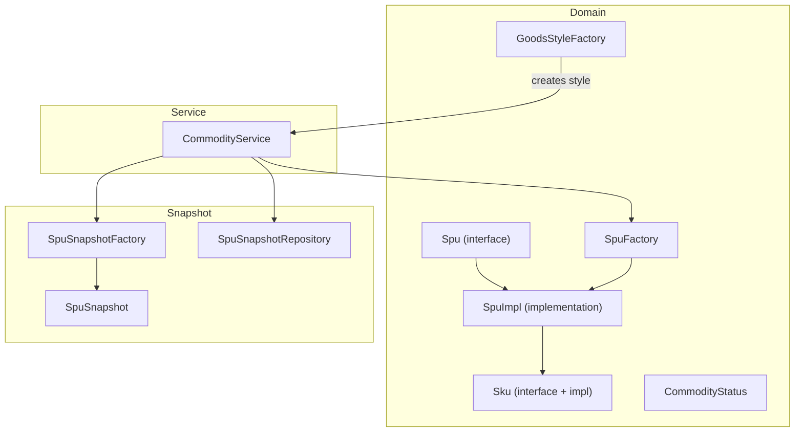
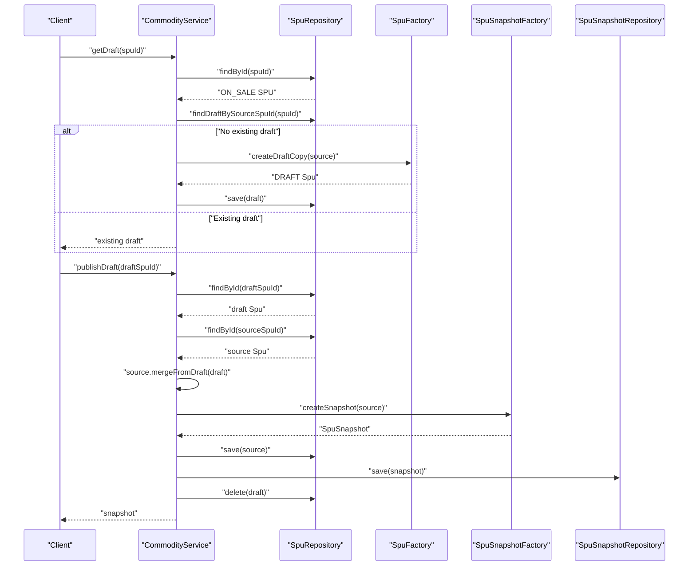
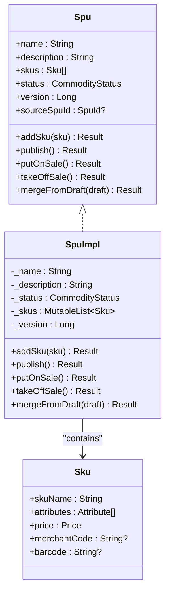
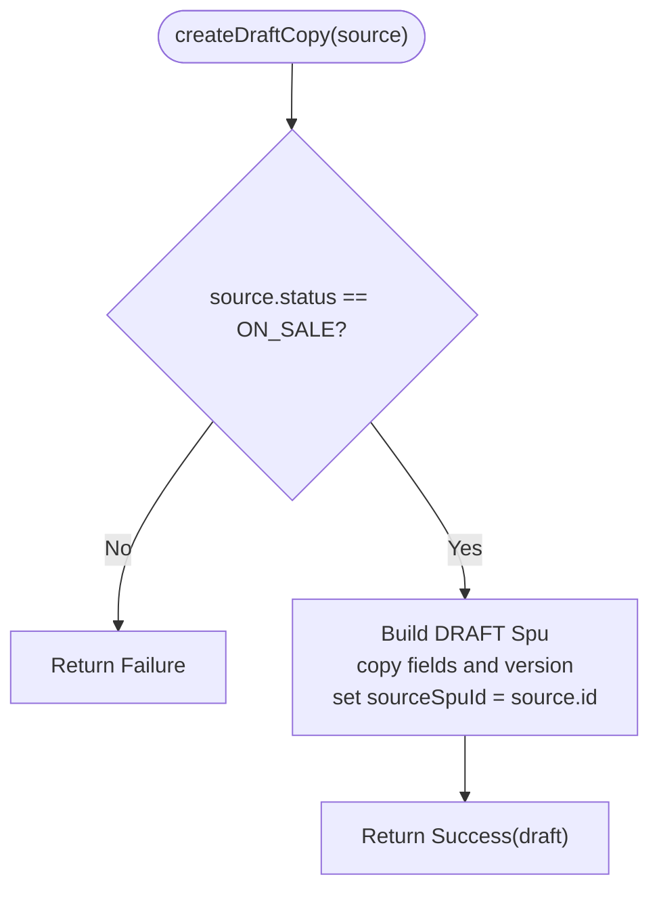
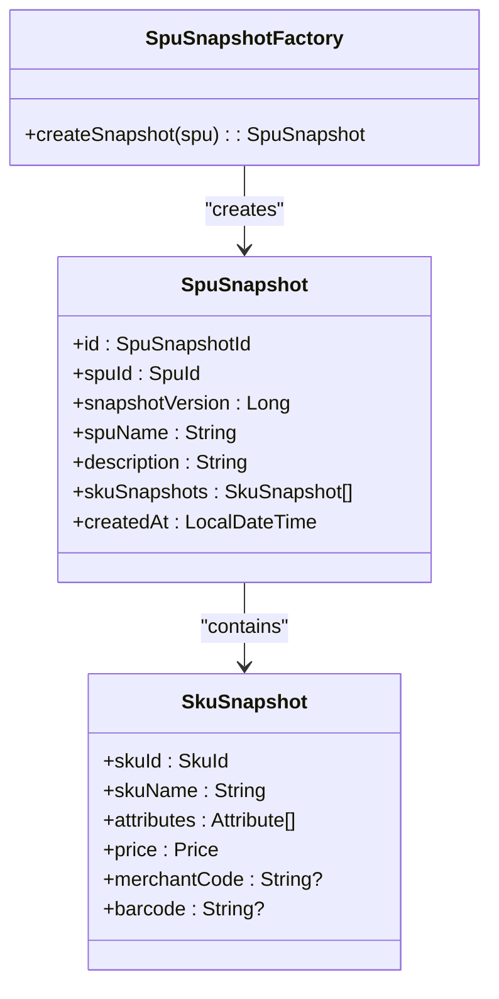
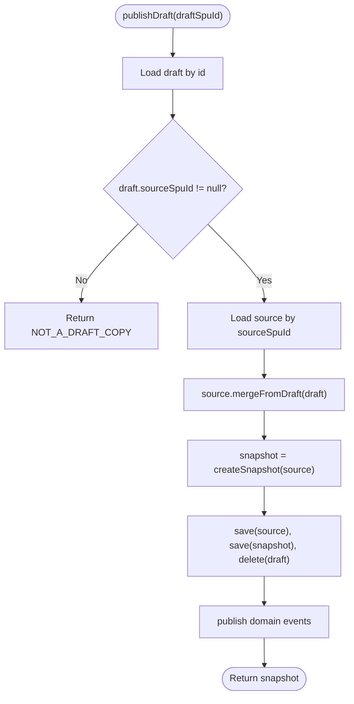
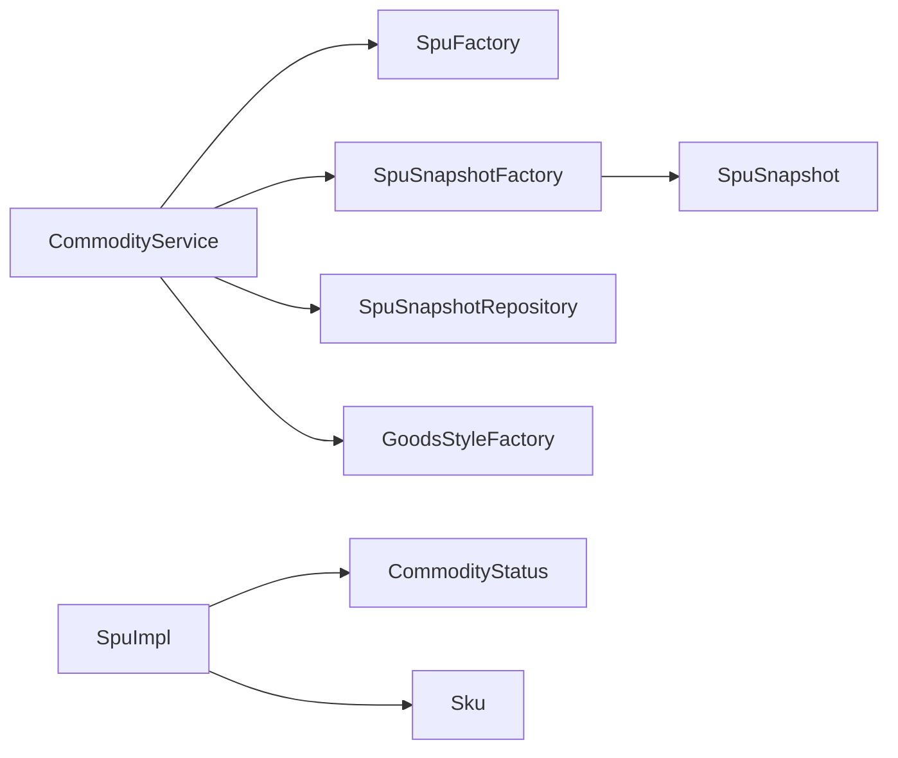

# Draft Workflow and Version Control

<cite>
**Referenced Files in This Document**
- [Spu.kt](file://j-store-goods/src/main/kotlin/com/jstore/goods/domain/commodity/Spu.kt)
- [SpuImpl.kt](file://j-store-goods/src/main/kotlin/com/jstore/goods/domain/commodity/SpuImpl.kt)
- [SpuFactory.kt](file://j-store-goods/src/main/kotlin/com/jstore/goods/domain/commodity/SpuFactory.kt)
- [GoodsStyleFactory.kt](file://j-store-goods/src/main/kotlin/com/jstore/goods/domain/commodity/GoodsStyleFactory.kt)
- [CommodityStatus.kt](file://j-store-goods/src/main/kotlin/com/jstore/goods/domain/commodity/CommodityStatus.kt)
- [Sku.kt](file://j-store-goods/src/main/kotlin/com/jstore/goods/domain/commodity/Sku.kt)
- [CommodityService.kt](file://j-store-goods/src/main/kotlin/com/jstore/goods/service/CommodityService.kt)
- [SpuSnapshot.kt](file://j-store-goods/src/main/kotlin/com/jstore/goods/domain/commodity/snapshot/SpuSnapshot.kt)
- [SpuSnapshotFactory.kt](file://j-store-goods/src/main/kotlin/com/jstore/goods/domain/commodity/snapshot/SpuSnapshotFactory.kt)
- [SpuSnapshotRepository.kt](file://j-store-goods/src/main/kotlin/com/jstore/goods/domain/commodity/snapshot/SpuSnapshotRepository.kt)
</cite>

## Table of Contents
1. Introduction
2. Project Structure
3. Core Components
4. Architecture Overview
5. Detailed Component Analysis
6. Dependency Analysis
7. Performance Considerations
8. Troubleshooting Guide
9. Conclusion

## Introduction
This document explains the draft workflow and version control system for product data in the goods domain. It focuses on how SpuSnapshot provides immutable, versioned snapshots of product data to support safe editing workflows. The design implements a copy-on-write pattern where draft copies are created from source SPU entities. Changes made in drafts can be merged back into the original product via mergeFromDraft, after which a new snapshot is generated. The SpuFactory and GoodsStyleFactory create new product instances and style metadata safely. The versioning mechanism uses a version number per SPU and a sourceSpuId link to track draft relationships. This approach enables collaborative product management with safe editing practices, preventing accidental changes to live products while allowing iterative improvements through drafts.

## Project Structure
The draft workflow spans several modules:
- Domain models and factories define the core entities and creation logic (Spu, Sku, SpuFactory, GoodsStyleFactory).
- Service layer orchestrates the draft lifecycle (getDraft, publishDraft, discardDraft) and integrates with repositories and event publishing.
- Snapshot subsystem captures immutable product state at specific versions for historical consistency and order safety.

**Diagram sources**
- [Spu.kt](file://j-store-goods/src/main/kotlin/com/jstore/goods/domain/commodity/Spu.kt)
- [SpuImpl.kt](file://j-store-goods/src/main/kotlin/com/jstore/goods/domain/commodity/SpuImpl.kt)
- [Sku.kt](file://j-store-goods/src/main/kotlin/com/jstore/goods/domain/commodity/Sku.kt)
- [CommodityStatus.kt](file://j-store-goods/src/main/kotlin/com/jstore/goods/domain/commodity/CommodityStatus.kt)
- [SpuFactory.kt](file://j-store-goods/src/main/kotlin/com/jstore/goods/domain/commodity/SpuFactory.kt)
- [GoodsStyleFactory.kt](file://j-store-goods/src/main/kotlin/com/jstore/goods/domain/commodity/GoodsStyleFactory.kt)
- [CommodityService.kt](file://j-store-goods/src/main/kotlin/com/jstore/goods/service/CommodityService.kt)
- [SpuSnapshot.kt](file://j-store-goods/src/main/kotlin/com/jstore/goods/domain/commodity/snapshot/SpuSnapshot.kt)
- [SpuSnapshotFactory.kt](file://j-store-goods/src/main/kotlin/com/jstore/goods/domain/commodity/snapshot/SpuSnapshotFactory.kt)
- [SpuSnapshotRepository.kt](file://j-store-goods/src/main/kotlin/com/jstore/goods/domain/commodity/snapshot/SpuSnapshotRepository.kt)

**Section sources**
- [Spu.kt](file://j-store-goods/src/main/kotlin/com/jstore/goods/domain/commodity/Spu.kt)
- [SpuImpl.kt](file://j-store-goods/src/main/kotlin/com/jstore/goods/domain/commodity/SpuImpl.kt)
- [SpuFactory.kt](file://j-store-goods/src/main/kotlin/com/jstore/goods/domain/commodity/SpuFactory.kt)
- [GoodsStyleFactory.kt](file://j-store-goods/src/main/kotlin/com/jstore/goods/domain/commodity/GoodsStyleFactory.kt)
- [CommodityStatus.kt](file://j-store-goods/src/main/kotlin/com/jstore/goods/domain/commodity/CommodityStatus.kt)
- [Sku.kt](file://j-store-goods/src/main/kotlin/com/jstore/goods/domain/commodity/Sku.kt)
- [CommodityService.kt](file://j-store-goods/src/main/kotlin/com/jstore/goods/service/CommodityService.kt)
- [SpuSnapshot.kt](file://j-store-goods/src/main/kotlin/com/jstore/goods/domain/commodity/snapshot/SpuSnapshot.kt)
- [SpuSnapshotFactory.kt](file://j-store-goods/src/main/kotlin/com/jstore/goods/domain/commodity/snapshot/SpuSnapshotFactory.kt)
- [SpuSnapshotRepository.kt](file://j-store-goods/src/main/kotlin/com/jstore/goods/domain/commodity/snapshot/SpuSnapshotRepository.kt)

## Core Components
- Spu interface and SpuImpl implement the product entity with versioning and draft linkage:
  - Fields include name, description, skus, status, version, and sourceSpuId.
  - Methods manage SKU addition, publishing, sale states, and merging drafts.
- CommodityStatus enumerates DRAFT, OFF_SALE, ON_SALE to enforce lifecycle transitions.
- Sku defines product variants with attributes, price, and identifiers.
- SpuFactory creates new SPUs, updates existing ones, constructs SKUs, and generates draft copies from ON_SALE SPUs.
- GoodsStyleFactory creates or updates product display styles (images, detail HTML).
- SpuSnapshot and SpuSnapshotFactory capture immutable snapshots of product state at a given version.
- SpuSnapshotRepository persists and retrieves snapshots by SPU ID and version.

Key behaviors:
- Copy-on-write: Drafts are independent copies of an ON_SALE SPU; edits do not affect the source until merge.
- Version increment: putOnSale and mergeFromDraft increment version to produce new snapshots.
- Source linkage: sourceSpuId links a draft to its origin SPU, enabling safe merges and auditability.

**Section sources**
- [Spu.kt](file://j-store-goods/src/main/kotlin/com/jstore/goods/domain/commodity/Spu.kk)
- [SpuImpl.kt](file://j-store-goods/src/main/kotlin/com/jstore/goods/domain/commodity/SpuImpl.kt)
- [CommodityStatus.kt](file://j-store-goods/src/main/kotlin/com/jstore/goods/domain/commodity/CommodityStatus.kt)
- [Sku.kt](file://j-store-goods/src/main/kotlin/com/jstore/goods/domain/commodity/Sku.kt)
- [SpuFactory.kt](file://j-store-goods/src/main/kotlin/com/jstore/goods/domain/commodity/SpuFactory.kt)
- [GoodsStyleFactory.kt](file://j-store-goods/src/main/kotlin/com/jstore/goods/domain/commodity/GoodsStyleFactory.kt)
- [SpuSnapshot.kt](file://j-store-goods/src/main/kotlin/com/jstore/goods/domain/commodity/snapshot/SpuSnapshot.kt)
- [SpuSnapshotFactory.kt](file://j-store-goods/src/main/kotlin/com/jstore/goods/domain/commodity/snapshot/SpuSnapshotFactory.kt)
- [SpuSnapshotRepository.kt](file://j-store-goods/src/main/kotlin/com/jstore/goods/domain/commodity/snapshot/SpuSnapshotRepository.kt)

## Architecture Overview
The draft workflow is orchestrated by CommodityService, which coordinates domain objects and persistence:
- getDraft returns or creates a draft copy for an ON_SALE SPU.
- publishDraft merges draft changes into the source SPU, increments version, creates a snapshot, deletes the draft, and publishes events.
- discardDraft removes a draft without affecting the source.
- putOnSale transitions OFF_SALE to ON_SALE and creates a snapshot.
- publish transitions DRAFT to OFF_SALE.

**Diagram sources**
- [CommodityService.kt](file://j-store-goods/src/main/kotlin/com/jstore/goods/service/CommodityService.kt)
- [SpuFactory.kt](file://j-store-goods/src/main/kotlin/com/jstore/goods/domain/commodity/SpuFactory.kt)
- [SpuSnapshotFactory.kt](file://j-store-goods/src/main/kotlin/com/jstore/goods/domain/commodity/snapshot/SpuSnapshotFactory.kt)
- [SpuSnapshotRepository.kt](file://j-store-goods/src/main/kotlin/com/jstore/goods/domain/commodity/snapshot/SpuSnapshotRepository.kt)

**Section sources**
- [CommodityService.kt](file://j-store-goods/src/main/kotlin/com/jstore/goods/service/CommodityService.kt)

## Detailed Component Analysis

### Spu and SpuImpl: Versioning and Merge Logic
- Spu exposes version and sourceSpuId to support version control and draft lineage.
- SpuImpl enforces state transitions and version increments:
  - putOnSale increments version and emits an on-sale event.
  - mergeFromDraft validates that the source is ON_SALE and the draft has SKUs, then replaces name, description, and SKUs, and increments version.
- addSku prevents duplicate attribute combinations.

**Diagram sources**
- [Spu.kt](file://j-store-goods/src/main/kotlin/com/jstore/goods/domain/commodity/Spu.kt)
- [SpuImpl.kt](file://j-store-goods/src/main/kotlin/com/jstore/goods/domain/commodity/SpuImpl.kt)
- [Sku.kt](file://j-store-goods/src/main/kotlin/com/jstore/goods/domain/commodity/Sku.kt)

**Section sources**
- [Spu.kt](file://j-store-goods/src/main/kotlin/com/jstore/goods/domain/commodity/Spu.kt)
- [SpuImpl.kt](file://j-store-goods/src/main/kotlin/com/jstore/goods/domain/commodity/SpuImpl.kt)
- [Sku.kt](file://j-store-goods/src/main/kotlin/com/jstore/goods/domain/commodity/Sku.kt)

### SpuFactory: Creating Instances and Draft Copies
- create builds a new DRAFT SPU with no SKUs.
- update preserves identity, status, version, and sourceSpuId when updating existing SPUs.
- createSku constructs SKU instances with IDs and attributes.
- createDraftCopy requires the source to be ON_SALE and produces a DRAFT copy with identical content and version, linking sourceSpuId to the original.

**Diagram sources**
- [SpuFactory.kt](file://j-store-goods/src/main/kotlin/com/jstore/goods/domain/commodity/SpuFactory.kt)

**Section sources**
- [SpuFactory.kt](file://j-store-goods/src/main/kotlin/com/jstore/goods/domain/commodity/SpuFactory.kt)

### GoodsStyleFactory: Product Display Metadata
- Creates or updates product style information including main images, detail HTML, and per-SKU images.
- Used by CommodityService.saveGoodsStyle to persist style data alongside product lifecycle operations.

**Section sources**
- [GoodsStyleFactory.kt](file://j-store-goods/src/main/kotlin/com/jstore/goods/domain/commodity/GoodsStyleFactory.kt)
- [CommodityService.kt](file://j-store-goods/src/main/kotlin/com/jstore/goods/service/CommodityService.kt)

### SpuSnapshot and SpuSnapshotFactory: Immutable Versioned Snapshots
- SpuSnapshot captures immutable product state at a specific version, including SKU details and timestamps.
- SpuSnapshotFactory serializes current SPU state into a snapshot using spu.version and spu.skus.
- SpuSnapshotRepository supports retrieval by spuId and version, and latest snapshot queries.

**Diagram sources**
- [SpuSnapshot.kt](file://j-store-goods/src/main/kotlin/com/jstore/goods/domain/commodity/snapshot/SpuSnapshot.kt)
- [SpuSnapshotFactory.kt](file://j-store-goods/src/main/kotlin/com/jstore/goods/domain/commodity/snapshot/SpuSnapshotFactory.kt)

**Section sources**
- [SpuSnapshot.kt](file://j-store-goods/src/main/kotlin/com/jstore/goods/domain/commodity/snapshot/SpuSnapshot.kt)
- [SpuSnapshotFactory.kt](file://j-store-goods/src/main/kotlin/com/jstore/goods/domain/commodity/snapshot/SpuSnapshotFactory.kt)
- [SpuSnapshotRepository.kt](file://j-store-goods/src/main/kotlin/com/jstore/goods/domain/commodity/snapshot/SpuSnapshotRepository.kt)

### CommodityService: Orchestrating Draft Lifecycle
- getDraft ensures only ON_SALE products can have drafts; returns existing draft if present or creates one via factory.
- publishDraft merges draft into source, increments version, creates snapshot, deletes draft, and publishes domain events.
- discardDraft removes draft without side effects.
- putOnSale transitions OFF_SALE to ON_SALE and creates a snapshot.
- publish transitions DRAFT to OFF_SALE.

**Diagram sources**
- [CommodityService.kt](file://j-store-goods/src/main/kotlin/com/jstore/goods/service/CommodityService.kt)
- [SpuSnapshotFactory.kt](file://j-store-goods/src/main/kotlin/com/jstore/goods/domain/commodity/snapshot/SpuSnapshotFactory.kt)

**Section sources**
- [CommodityService.kt](file://j-store-goods/src/main/kotlin/com/jstore/goods/service/CommodityService.kt)

## Dependency Analysis
- CommodityService depends on SpuFactory, SpuRepository, SpuSnapshotFactory, SpuSnapshotRepository, and GoodsStyleFactory.
- SpuImpl depends on Sku and CommodityStatus to enforce business rules.
- SpuSnapshotFactory depends on SnowFlakSequence for unique IDs and maps Spu to SpuSnapshot.
- SpuSnapshotRepository abstracts persistence for snapshots.

**Diagram sources**
- [CommodityService.kt](file://j-store-goods/src/main/kotlin/com/jstore/goods/service/CommodityService.kt)
- [SpuImpl.kt](file://j-store-goods/src/main/kotlin/com/jstore/goods/domain/commodity/SpuImpl.kt)
- [SpuSnapshotFactory.kt](file://j-store-goods/src/main/kotlin/com/jstore/goods/domain/commodity/snapshot/SpuSnapshotFactory.kt)
- [SpuSnapshotRepository.kt](file://j-store-goods/src/main/kotlin/com/jstore/goods/domain/commodity/snapshot/SpuSnapshotRepository.kt)

**Section sources**
- [CommodityService.kt](file://j-store-goods/src/main/kotlin/com/jstore/goods/service/CommodityService.kt)
- [SpuImpl.kt](file://j-store-goods/src/main/kotlin/com/jstore/goods/domain/commodity/SpuImpl.kt)
- [SpuSnapshotFactory.kt](file://j-store-goods/src/main/kotlin/com/jstore/goods/domain/commodity/snapshot/SpuSnapshotFactory.kt)
- [SpuSnapshotRepository.kt](file://j-store-goods/src/main/kotlin/com/jstore/goods/domain/commodity/snapshot/SpuSnapshotRepository.kt)

## Performance Considerations
- Snapshot creation is O(n) over SKU list; consider caching frequently accessed snapshots for read-heavy workloads.
- Draft creation duplicates SKU lists; ensure memory usage is acceptable and avoid unnecessary duplication in high-throughput scenarios.
- Version increments occur on critical transitions; keep repository operations efficient and batch where possible.
- Use repository methods like findLatestBySpuId to minimize queries during preview flows.

[No sources needed since this section provides general guidance]

## Troubleshooting Guide
Common issues and resolutions:
- Direct editing of ON_SALE products is rejected; use getDraft to create a draft first.
- Publishing a draft directly is disallowed; use publishDraft to merge changes back to the source.
- Merging requires the source to be ON_SALE and the draft to contain SKUs; validate inputs before calling mergeFromDraft.
- If snapshots are missing, ensure putOnSale or publishDraft is invoked to generate them.

**Section sources**
- [CommodityService.kt](file://j-store-goods/src/main/kotlin/com/jstore/goods/service/CommodityService.kt)
- [SpuImpl.kt](file://j-store-goods/src/main/kotlin/com/jstore/goods/domain/commodity/SpuImpl.kt)

## Conclusion
The draft workflow and version control system provide a robust foundation for safe, collaborative product management. By enforcing copy-on-write semantics through draft copies and requiring explicit merges back to source products, the system prevents accidental modifications to live items. Version numbers and sourceSpuId relationships enable precise tracking and auditing of changes. Snapshots ensure historical consistency for downstream systems such as orders. Together, these mechanisms support iterative improvements, team collaboration, and reliable product lifecycle management.

[No sources needed since this section summarizes without analyzing specific files]