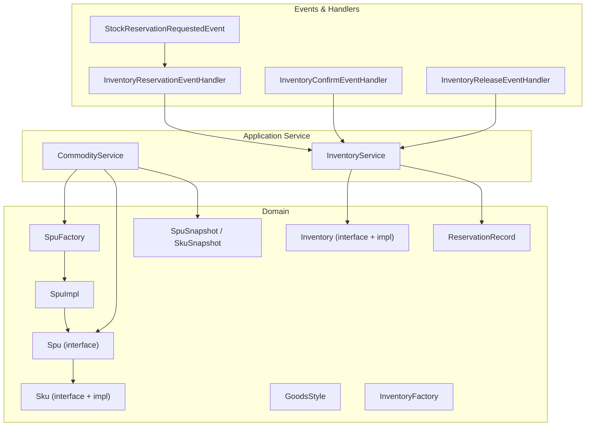
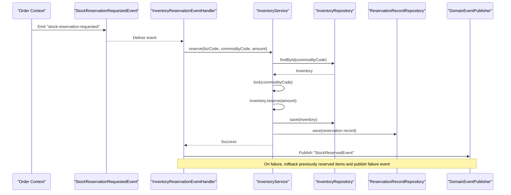
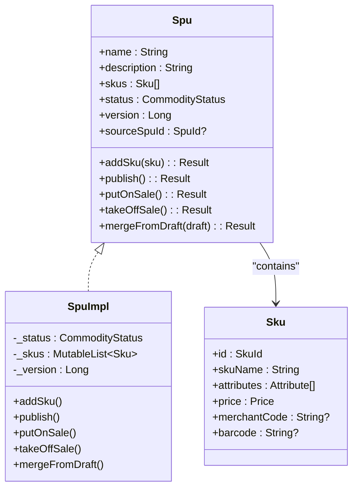
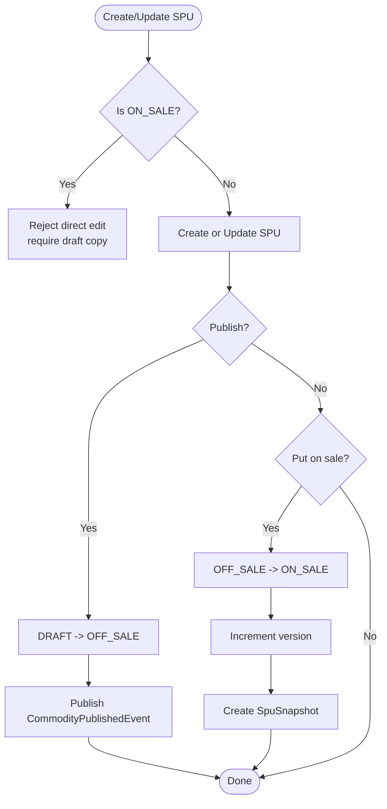
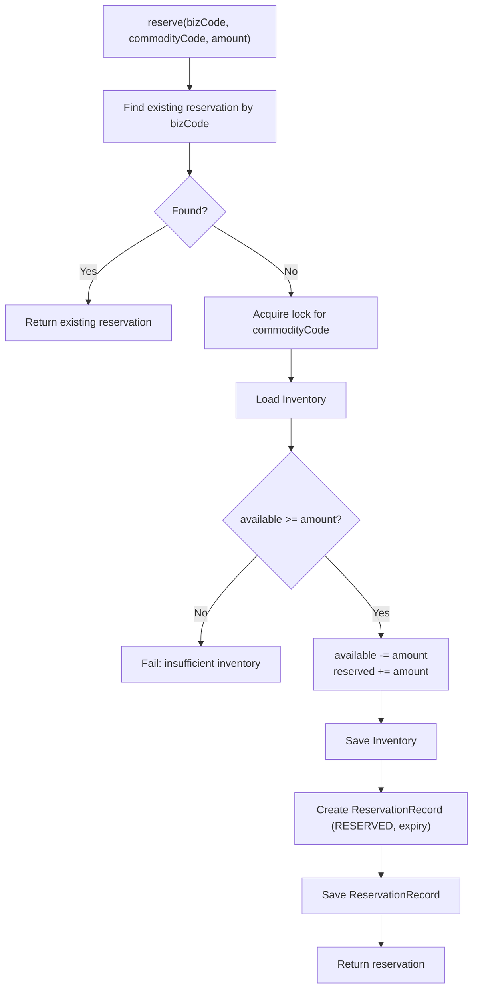
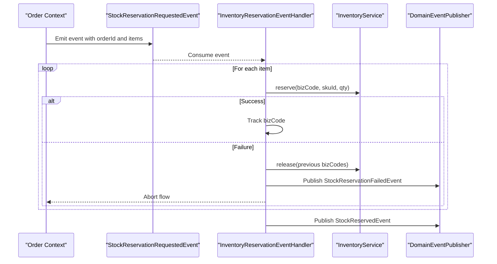
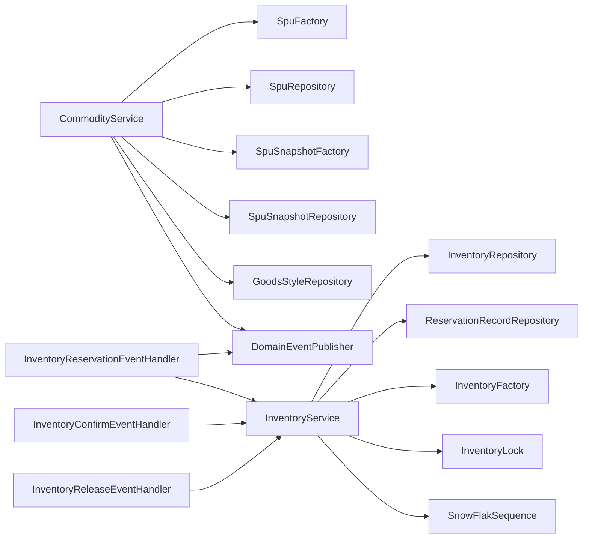

# Goods Module

<cite>
**Referenced Files in This Document**
- [Spu.kt](file://j-store-goods/src/main/kotlin/com/jstore/goods/domain/commodity/Spu.kt)
- [Sku.kt](file://j-store-goods/src/main/kotlin/com/jstore/goods/domain/commodity/Sku.kt)
- [SpuImpl.kt](file://j-store-goods/src/main/kotlin/com/jstore/goods/domain/commodity/SpuImpl.kt)
- [SpuFactory.kt](file://j-store-goods/src/main/kotlin/com/jstore/goods/domain/commodity/SpuFactory.kt)
- [GoodsStyle.kt](file://j-store-goods/src/main/kotlin/com/jstore/goods/domain/commodity/GoodsStyle.kt)
- [SpuSnapshot.kt](file://j-store-goods/src/main/kotlin/com/jstore/goods/domain/commodity/snapshot/SpuSnapshot.kt)
- [CommodityService.kt](file://j-store-goods/src/main/kotlin/com/jstore/goods/service/CommodityService.kt)
- [Inventory.kt](file://j-store-goods/src/main/kotlin/com/jstore/goods/domain/inventory/Inventory.kt)
- [InventoryFactory.kt](file://j-store-goods/src/main/kotlin/com/jstore/goods/domain/inventory/InventoryFactory.kt)
- [ReservationRecord.kt](file://j-store-goods/src/main/kotlin/com/jstore/goods/domain/inventory/ReservationRecord.kt)
- [InventoryService.kt](file://j-store-goods/src/main/kotlin/com/jstore/goods/service/InventoryService.kt)
- [StockReservationRequestedEvent.kt](file://j-store-goods/src/main/kotlin/com/jstore/goods/acl/event/StockReservationRequestedEvent.kt)
- [InventoryConfirmEventHandler.kt](file://j-store-goods/src/main/kotlin/com/jstore/goods/service/InventoryConfirmEventHandler.kt)
- [InventoryReleaseEventHandler.kt](file://j-store-goods/src/main/kotlin/com/jstore/goods/service/InventoryReleaseEventHandler.kt)
- [InventoryEventHandler.kt](file://j-store-goods/src/main/kotlin/com/jstore/goods/service/InventoryEventHandler.kt)
- [04-goods-spu-sku-snapshot.sql](file://docker/postgres/init/04-goods-spu-sku-snapshot.sql)
</cite>

## Table of Contents
1. Introduction
2. Project Structure
3. Core Components
4. Architecture Overview
5. Detailed Component Analysis
6. Dependency Analysis
7. Performance Considerations
8. Troubleshooting Guide
9. Conclusion

## Introduction
The Goods module manages the product catalog and inventory for the platform. It models products using a two-level hierarchy: SPU (Standard Product Unit) and SKU (Stock Keeping Unit). SPUs represent product templates with attributes, pricing, and variants; SKUs are concrete sellable items with specific attribute combinations and prices. The module supports a draft/publish workflow with version control via snapshots to ensure historical consistency for orders and catalogs. Inventory is managed through a TCC-like mechanism with stock reservation, confirmation, and release, coordinated via domain events across bounded contexts such as Orders and external warehouse systems.

## Project Structure
The Goods module is organized into domain, service, ACL event definitions, and snapshot/value objects. Domain entities define core business logic and state transitions. Services orchestrate commands and events. ACL events integrate with other contexts. Snapshots capture immutable product states at key lifecycle points.

**Diagram sources**
- [Spu.kt](file://j-store-goods/src/main/kotlin/com/jstore/goods/domain/commodity/Spu.kt)
- [Sku.kt](file://j-store-goods/src/main/kotlin/com/jstore/goods/domain/commodity/Sku.kt)
- [SpuImpl.kt](file://j-store-goods/src/main/kotlin/com/jstore/goods/domain/commodity/SpuImpl.kt)
- [SpuFactory.kt](file://j-store-goods/src/main/kotlin/com/jstore/goods/domain/commodity/SpuFactory.kt)
- [GoodsStyle.kt](file://j-store-goods/src/main/kotlin/com/jstore/goods/domain/commodity/GoodsStyle.kt)
- [SpuSnapshot.kt](file://j-store-goods/src/main/kotlin/com/jstore/goods/domain/commodity/snapshot/SpuSnapshot.kt)
- [Inventory.kt](file://j-store-goods/src/main/kotlin/com/jstore/goods/domain/inventory/Inventory.kt)
- [InventoryFactory.kt](file://j-store-goods/src/main/kotlin/com/jstore/goods/domain/inventory/InventoryFactory.kt)
- [ReservationRecord.kt](file://j-store-goods/src/main/kotlin/com/jstore/goods/domain/inventory/ReservationRecord.kt)
- [CommodityService.kt](file://j-store-goods/src/main/kotlin/com/jstore/goods/service/CommodityService.kt)
- [InventoryService.kt](file://j-store-goods/src/main/kotlin/com/jstore/goods/service/InventoryService.kt)
- [StockReservationRequestedEvent.kt](file://j-store-goods/src/main/kotlin/com/jstore/goods/acl/event/StockReservationRequestedEvent.kt)
- [InventoryEventHandler.kt](file://j-store-goods/src/main/kotlin/com/jstore/goods/service/InventoryEventHandler.kt)
- [InventoryConfirmEventHandler.kt](file://j-store-goods/src/main/kotlin/com/jstore/goods/service/InventoryConfirmEventHandler.kt)
- [InventoryReleaseEventHandler.kt](file://j-store-goods/src/main/kotlin/com/jstore/goods/service/InventoryReleaseEventHandler.kt)

**Section sources**
- [Spu.kt](file://j-store-goods/src/main/kotlin/com/jstore/goods/domain/commodity/Spu.kt)
- [Sku.kt](file://j-store-goods/src/main/kotlin/com/jstore/goods/domain/commodity/Sku.kt)
- [SpuImpl.kt](file://j-store-goods/src/main/kotlin/com/jstore/goods/domain/commodity/SpuImpl.kt)
- [SpuFactory.kt](file://j-store-goods/src/main/kotlin/com/jstore/goods/domain/commodity/SpuFactory.kt)
- [GoodsStyle.kt](file://j-store-goods/src/main/kotlin/com/jstore/goods/domain/commodity/GoodsStyle.kt)
- [SpuSnapshot.kt](file://j-store-goods/src/main/kotlin/com/jstore/goods/domain/commodity/snapshot/SpuSnapshot.kt)
- [Inventory.kt](file://j-store-goods/src/main/kotlin/com/jstore/goods/domain/inventory/Inventory.kt)
- [InventoryFactory.kt](file://j-store-goods/src/main/kotlin/com/jstore/goods/domain/inventory/InventoryFactory.kt)
- [ReservationRecord.kt](file://j-store-goods/src/main/kotlin/com/jstore/goods/domain/inventory/ReservationRecord.kt)
- [CommodityService.kt](file://j-store-goods/src/main/kotlin/com/jstore/goods/service/CommodityService.kt)
- [InventoryService.kt](file://j-store-goods/src/main/kotlin/com/jstore/goods/service/InventoryService.kt)
- [StockReservationRequestedEvent.kt](file://j-store-goods/src/main/kotlin/com/jstore/goods/acl/event/StockReservationRequestedEvent.kt)
- [InventoryEventHandler.kt](file://j-store-goods/src/main/kotlin/com/jstore/goods/service/InventoryEventHandler.kt)
- [InventoryConfirmEventHandler.kt](file://j-store-goods/src/main/kotlin/com/jstore/goods/service/InventoryConfirmEventHandler.kt)
- [InventoryReleaseEventHandler.kt](file://j-store-goods/src/main/kotlin/com/jstore/goods/service/InventoryReleaseEventHandler.kt)

## Core Components
- SPU and SKU model the product catalog with attributes, pricing, and variant combinations.
- Draft/Publish workflow enables safe editing of live products via drafts and versioned snapshots.
- Inventory uses a TCC-like reserve-confirm-release pattern with idempotency and concurrency controls.
- Event-driven integration coordinates stock operations with order and after-sale processes.

Key responsibilities:
- SPU: lifecycle transitions (DRAFT → OFF_SALE → ON_SALE), merging drafts, publishing events.
- SKU: unique attribute combinations, price, merchant code, barcode.
- Inventory: available/reserved quantities, atomic reserve/deduct/release/add.
- ReservationRecord: idempotent tracking of reservation lifecycle and expiry.
- Snapshots: immutable product state at publish/on-sale for traceability.

**Section sources**
- [Spu.kt](file://j-store-goods/src/main/kotlin/com/jstore/goods/domain/commodity/Spu.kt)
- [Sku.kt](file://j-store-goods/src/main/kotlin/com/jstore/goods/domain/commodity/Sku.kt)
- [SpuImpl.kt](file://j-store-goods/src/main/kotlin/com/jstore/goods/domain/commodity/SpuImpl.kt)
- [Inventory.kt](file://j-store-goods/src/main/kotlin/com/jstore/goods/domain/inventory/Inventory.kt)
- [ReservationRecord.kt](file://j-store-goods/src/main/kotlin/com/jstore/goods/domain/inventory/ReservationRecord.kt)
- [SpuSnapshot.kt](file://j-store-goods/src/main/kotlin/com/jstore/goods/domain/commodity/snapshot/SpuSnapshot.kt)

## Architecture Overview
The Goods module exposes application services that orchestinate domain operations and publish domain events. External contexts (e.g., Order) emit ACL events to trigger inventory actions. Event handlers coordinate multi-step operations like reservation, confirmation, and release.

**Diagram sources**
- [StockReservationRequestedEvent.kt](file://j-store-goods/src/main/kotlin/com/jstore/goods/acl/event/StockReservationRequestedEvent.kt)
- [InventoryEventHandler.kt](file://j-store-goods/src/main/kotlin/com/jstore/goods/service/InventoryEventHandler.kt)
- [InventoryService.kt](file://j-store-goods/src/main/kotlin/com/jstore/goods/service/InventoryService.kt)
- [Inventory.kt](file://j-store-goods/src/main/kotlin/com/jstore/goods/domain/inventory/Inventory.kt)
- [ReservationRecord.kt](file://j-store-goods/src/main/kotlin/com/jstore/goods/domain/inventory/ReservationRecord.kt)

## Detailed Component Analysis

### SPU and SKU Hierarchy
- SPU defines product metadata, status, versioning, and methods to add SKUs and transition states.
- SKU captures name, attributes, price, and optional identifiers (merchant code, barcode).
- Duplicate attribute combinations are rejected to maintain data integrity.
- Version increments on critical transitions to support snapshotting and auditability.

**Diagram sources**
- [Spu.kt](file://j-store-goods/src/main/kotlin/com/jstore/goods/domain/commodity/Spu.kt)
- [Sku.kt](file://j-store-goods/src/main/kotlin/com/jstore/goods/domain/commodity/Sku.kt)
- [SpuImpl.kt](file://j-store-goods/src/main/kotlin/com/jstore/goods/domain/commodity/SpuImpl.kt)

**Section sources**
- [Spu.kt](file://j-store-goods/src/main/kotlin/com/jstore/goods/domain/commodity/Spu.kt)
- [Sku.kt](file://j-store-goods/src/main/kotlin/com/jstore/goods/domain/commodity/Sku.kt)
- [SpuImpl.kt](file://j-store-goods/src/main/kotlin/com/jstore/goods/domain/commodity/SpuImpl.kt)

### Draft/Publish Workflow and Snapshots
- Creating or updating an SPU enforces rules (e.g., direct edits to ON_SALE are rejected).
- Publishing transitions DRAFT → OFF_SALE and publishes a published event.
- Putting on sale transitions OFF_SALE → ON_SALE, increments version, and creates a snapshot.
- Taking off sale transitions ON_SALE → OFF_SALE.
- For live products, editing requires creating a draft copy; merging back increments version and generates a new snapshot.

**Diagram sources**
- [CommodityService.kt](file://j-store-goods/src/main/kotlin/com/jstore/goods/service/CommodityService.kt)
- [SpuImpl.kt](file://j-store-goods/src/main/kotlin/com/jstore/goods/domain/commodity/SpuImpl.kt)
- [SpuSnapshot.kt](file://j-store-goods/src/main/kotlin/com/jstore/goods/domain/commodity/snapshot/SpuSnapshot.kt)

**Section sources**
- [CommodityService.kt](file://j-store-goods/src/main/kotlin/com/jstore/goods/service/CommodityService.kt)
- [SpuImpl.kt](file://j-store-goods/src/main/kotlin/com/jstore/goods/domain/commodity/SpuImpl.kt)
- [SpuSnapshot.kt](file://j-store-goods/src/main/kotlin/com/jstore/goods/domain/commodity/snapshot/SpuSnapshot.kt)

### Inventory Management: Reserve, Confirm, Release
- Reserve checks availability under a lock, updates available/reserved quantities, and persists a reservation record with idempotency by bizCode.
- Confirm transitions reservation from RESERVED to CONFIRMED and deducts reserved quantity.
- Release transitions reservation from RESERVED to RELEASED and restores available quantity.
- Add increases available quantity for restocking.

**Diagram sources**
- [InventoryService.kt](file://j-store-goods/src/main/kotlin/com/jstore/goods/service/InventoryService.kt)
- [Inventory.kt](file://j-store-goods/src/main/kotlin/com/jstore/goods/domain/inventory/Inventory.kt)
- [ReservationRecord.kt](file://j-store-goods/src/main/kotlin/com/jstore/goods/domain/inventory/ReservationRecord.kt)

**Section sources**
- [InventoryService.kt](file://j-store-goods/src/main/kotlin/com/jstore/goods/service/InventoryService.kt)
- [Inventory.kt](file://j-store-goods/src/main/kotlin/com/jstore/goods/domain/inventory/Inventory.kt)
- [ReservationRecord.kt](file://j-store-goods/src/main/kotlin/com/jstore/goods/domain/inventory/ReservationRecord.kt)

### Event-Driven Coordination with Other Domains
- Order context emits StockReservationRequestedEvent to request stock reservation per order item.
- Inventory handler orchestrates per-item reservations, rolling back previous reservations on failure, and publishes success/failure events.
- Separate handlers confirm and release stock based on downstream events (e.g., payment confirmed, order canceled).

**Diagram sources**
- [StockReservationRequestedEvent.kt](file://j-store-goods/src/main/kotlin/com/jstore/goods/acl/event/StockReservationRequestedEvent.kt)
- [InventoryEventHandler.kt](file://j-store-goods/src/main/kotlin/com/jstore/goods/service/InventoryEventHandler.kt)
- [InventoryService.kt](file://j-store-goods/src/main/kotlin/com/jstore/goods/service/InventoryService.kt)

**Section sources**
- [StockReservationRequestedEvent.kt](file://j-store-goods/src/main/kotlin/com/jstore/goods/acl/event/StockReservationRequestedEvent.kt)
- [InventoryEventHandler.kt](file://j-store-goods/src/main/kotlin/com/jstore/goods/service/InventoryEventHandler.kt)
- [InventoryService.kt](file://j-store-goods/src/main/kotlin/com/jstore/goods/service/InventoryService.kt)

### Goods Style and Presentation Data
- GoodsStyle maintains main images, detail HTML, and per-SKU images with validation against duplicates.
- CommodityService provides methods to create or update style data atomically.

**Section sources**
- [GoodsStyle.kt](file://j-store-goods/src/main/kotlin/com/jstore/goods/domain/commodity/GoodsStyle.kt)
- [CommodityService.kt](file://j-store-goods/src/main/kotlin/com/jstore/goods/service/CommodityService.kt)

## Dependency Analysis
- CommodityService depends on SpuFactory, SpuRepository, DomainEventPublisher, SpuSnapshotFactory, SpuSnapshotRepository, and GoodsStyleRepository.
- InventoryService depends on InventoryRepository, ReservationRecordRepository, InventoryFactory, InventoryLock, and SnowFlakSequence.
- Event handlers depend on InventoryService and DomainEventPublisher.
- Snapshots decouple product state changes from consumers (orders, catalogs).

**Diagram sources**
- [CommodityService.kt](file://j-store-goods/src/main/kotlin/com/jstore/goods/service/CommodityService.kt)
- [InventoryService.kt](file://j-store-goods/src/main/kotlin/com/jstore/goods/service/InventoryService.kt)
- [InventoryEventHandler.kt](file://j-store-goods/src/main/kotlin/com/jstore/goods/service/InventoryEventHandler.kt)
- [InventoryConfirmEventHandler.kt](file://j-store-goods/src/main/kotlin/com/jstore/goods/service/InventoryConfirmEventHandler.kt)
- [InventoryReleaseEventHandler.kt](file://j-store-goods/src/main/kotlin/com/jstore/goods/service/InventoryReleaseEventHandler.kt)

**Section sources**
- [CommodityService.kt](file://j-store-goods/src/main/kotlin/com/jstore/goods/service/CommodityService.kt)
- [InventoryService.kt](file://j-store-goods/src/main/kotlin/com/jstore/goods/service/InventoryService.kt)
- [InventoryEventHandler.kt](file://j-store-goods/src/main/kotlin/com/jstore/goods/service/InventoryEventHandler.kt)
- [InventoryConfirmEventHandler.kt](file://j-store-goods/src/main/kotlin/com/jstore/goods/service/InventoryConfirmEventHandler.kt)
- [InventoryReleaseEventHandler.kt](file://j-store-goods/src/main/kotlin/com/jstore/goods/service/InventoryReleaseEventHandler.kt)

## Performance Considerations
- Use locks around inventory operations to prevent race conditions during concurrent reservations and updates.
- Idempotency via bizCode avoids duplicate reservations and ensures safe retries.
- Snapshots reduce read contention on live SPU state for order processing and catalog queries.
- Batch operations should be considered when handling large order item lists to minimize round-trips.

[No sources needed since this section provides general guidance]

## Troubleshooting Guide
Common issues and resolutions:
- Insufficient inventory during reservation: Ensure adequate availableQuantity and verify no conflicting reservations exist.
- Concurrent conflicts: Investigate lock acquisition failures and retry strategies; check for long-running transactions holding locks.
- Reservation not found during confirm/release: Validate bizCode construction and ensure reservation was created before confirm/release calls.
- Illegal state transitions: Verify reservation status and expiry time; expired or already released records cannot be confirmed.

Operational tips:
- Log all ACL events and handler outcomes for traceability.
- Monitor reservation expiry and implement cleanup jobs if necessary.
- Validate SKU attribute uniqueness and image deduplication to avoid data corruption.

**Section sources**
- [InventoryService.kt](file://j-store-goods/src/main/kotlin/com/jstore/goods/service/InventoryService.kt)
- [ReservationRecord.kt](file://j-store-goods/src/main/kotlin/com/jstore/goods/domain/inventory/ReservationRecord.kt)
- [Inventory.kt](file://j-store-goods/src/main/kotlin/com/jstore/goods/domain/inventory/Inventory.kt)

## Conclusion
The Goods module provides a robust foundation for product catalog and inventory management. Its clear separation between domain entities, application services, and event-driven integrations enables scalable and maintainable operations. The draft/publish workflow with snapshots ensures consistent product history, while the TCC-like inventory model guarantees reliable stock coordination across domains. Proper use of locks, idempotency keys, and events facilitates resilient interactions with external systems such as warehouses and order processors.

[No sources needed since this section summarizes without analyzing specific files]

## Appendices

### Example Workflows

- Creating a product:
  - Create SPU in DRAFT state via CommodityService.createOrUpdate.
  - Add SKUs with unique attribute combinations.
  - Publish to OFF_SALE; put on sale to ON_SALE to generate snapshot.

- Managing product variants:
  - Edit live products by creating a draft copy via getDraft.
  - Modify SKUs and attributes in the draft.
  - Merge draft back to source SPU to increment version and create a new snapshot.

- Handling inventory reservations during order placement:
  - Order emits StockReservationRequestedEvent with items.
  - Inventory handler reserves stock per item; on failure, rolls back previous reservations and publishes failure event.
  - On successful payment, confirm releases reserved to actual deduction.
  - On cancellation, release restores available quantity.

- Coordinating with external warehouse systems:
  - Use ACL events to signal reservation requests and confirmations.
  - Implement handlers to translate domain events into warehouse API calls.
  - Ensure idempotency and error handling for network failures.

[No sources needed since this section provides conceptual examples]

### Database Schema Notes
- The schema includes tables for SPU, SKU, and snapshots to support versioned product states.

**Section sources**
- [04-goods-spu-sku-snapshot.sql](file://docker/postgres/init/04-goods-spu-sku-snapshot.sql)