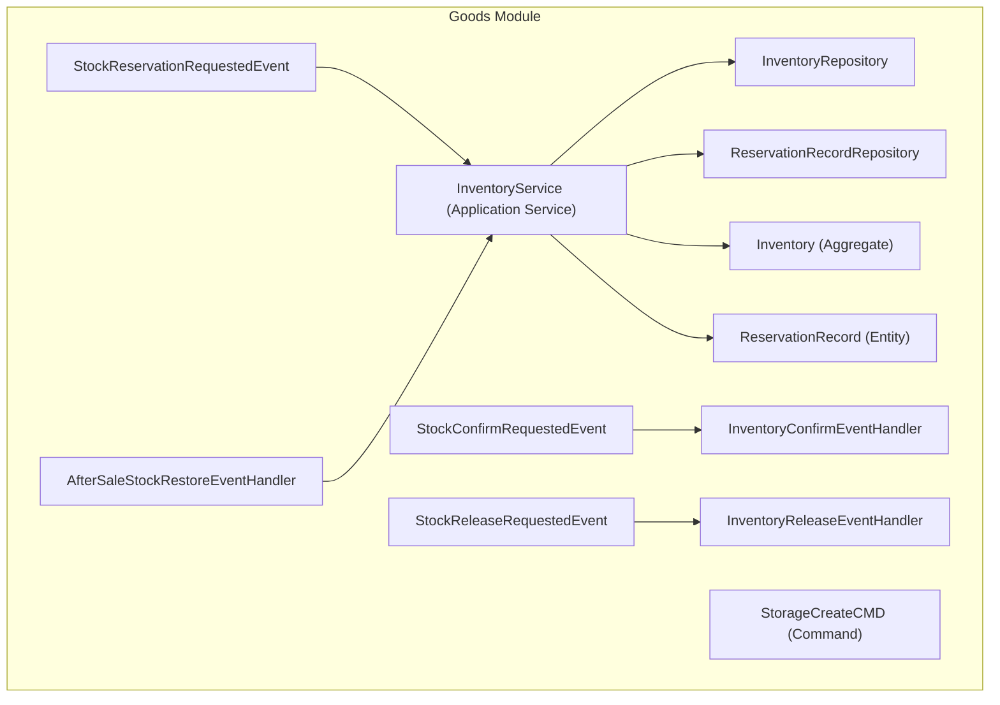
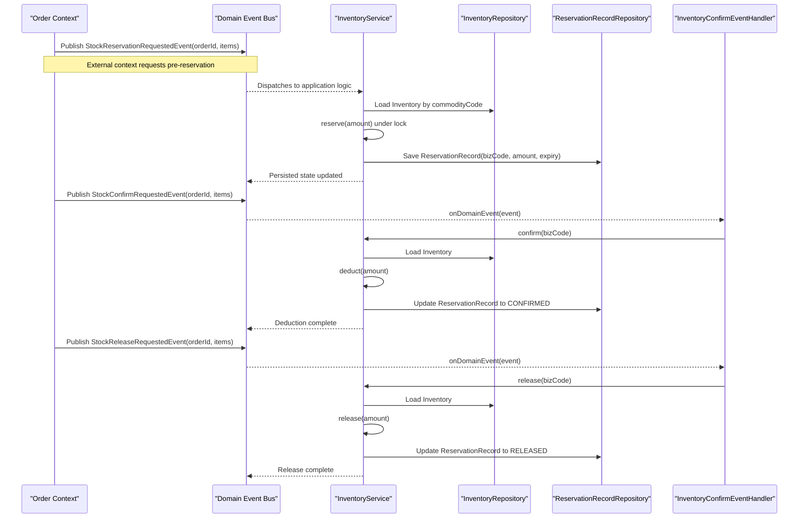
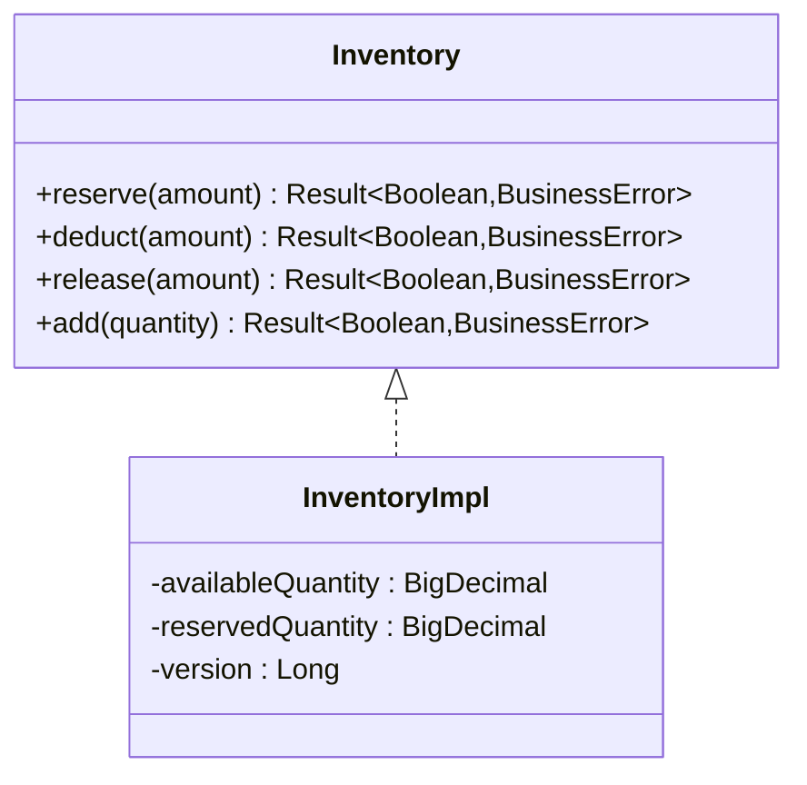
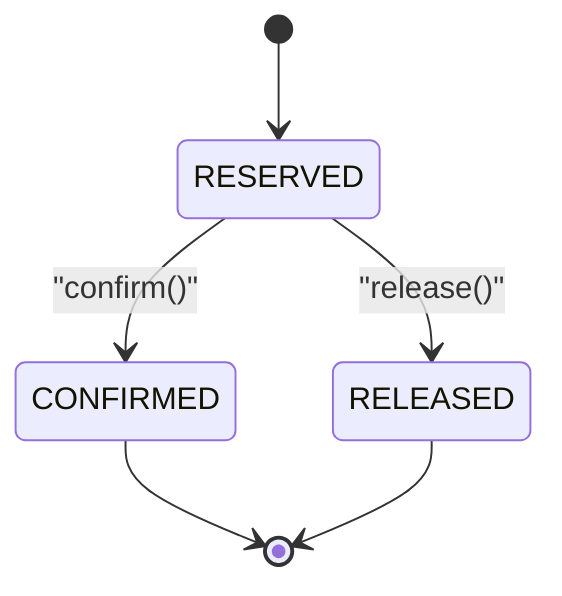
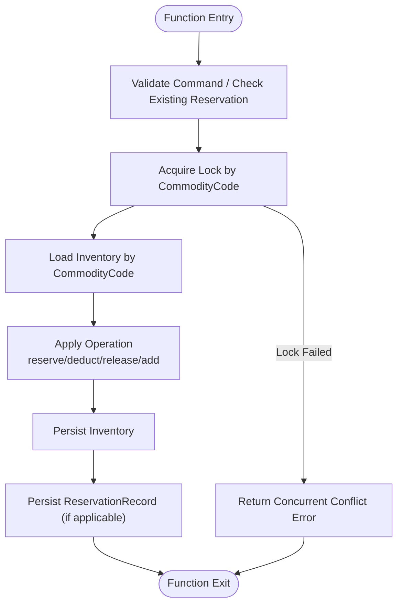
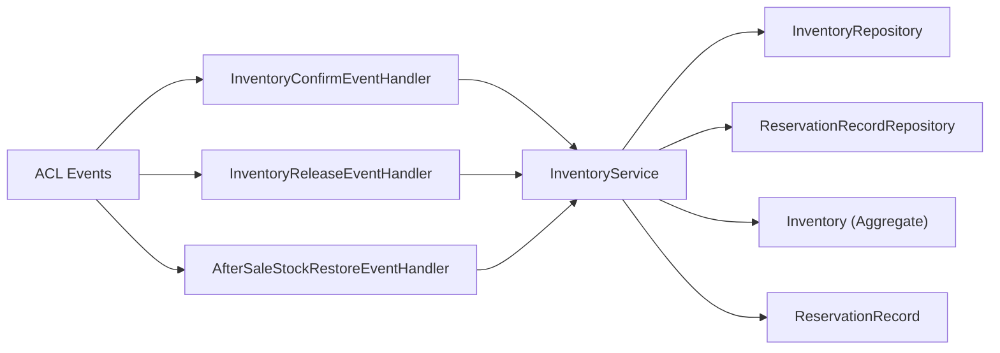

# Inventory Control

<cite>
**Referenced Files in This Document**
- [Inventory.kt](file://j-store-goods/src/main/kotlin/com/jstore/goods/domain/inventory/Inventory.kt)
- [ReservationRecord.kt](file://j-store-goods/src/main/kotlin/com/jstore/goods/domain/inventory/ReservationRecord.kt)
- [StorageCreateCMD.kt](file://j-store-goods/src/main/kotlin/com/jstore/goods/domain/inventory/StorageCreateCMD.kt)
- [InventoryFactory.kt](file://j-store-goods/src/main/kotlin/com/jstore/goods/domain/inventory/InventoryFactory.kt)
- [InventoryRepository.kt](file://j-store-goods/src/main/kotlin/com/jstore/goods/domain/inventory/InventoryRepository.kt)
- [ReservationRecordRepository.kt](file://j-store-goods/src/main/kotlin/com/jstore/goods/domain/inventory/ReservationRecordRepository.kt)
- [StorageErrors.kt](file://j-store-goods/src/main/kotlin/com/jstore/goods/domain/inventory/StorageErrors.kt)
- [InventoryService.kt](file://j-store-goods/src/main/kotlin/com/jstore/goods/service/InventoryService.kt)
- [InventoryConfirmEventHandler.kt](file://j-store-goods/src/main/kotlin/com/jstore/goods/service/InventoryConfirmEventHandler.kt)
- [InventoryReleaseEventHandler.kt](file://j-store-goods/src/main/kotlin/com/jstore/goods/service/InventoryReleaseEventHandler.kt)
- [AfterSaleStockRestoreEventHandler.kt](file://j-store-goods/src/main/kotlin/com/jstore/goods/service/AfterSaleStockRestoreEventHandler.kt)
- [StockReservationRequestedEvent.kt](file://j-store-goods/src/main/kotlin/com/jstore/goods/acl/event/StockReservationRequestedEvent.kt)
- [StockConfirmRequestedEvent.kt](file://j-store-goods/src/main/kotlin/com/jstore/goods/acl/event/StockConfirmRequestedEvent.kt)
- [StockReleaseRequestedEvent.kt](file://j-store-goods/src/main/kotlin/com/jstore/goods/acl/event/StockReleaseRequestedEvent.kt)
</cite>

## Table of Contents
1. Introduction
2. Project Structure
3. Core Components
4. Architecture Overview
5. Detailed Component Analysis
6. Dependency Analysis
7. Performance Considerations
8. Troubleshooting Guide
9. Conclusion

## Introduction
This document explains the Inventory Control system that manages stock levels and reservations for product SKUs. It covers the Inventory aggregate, ReservationRecord for temporary allocations during order processing, StorageCreateCMD for initial stock creation, and event-driven integration with external systems (e.g., warehouse or order fulfillment). It also details concurrency handling, SKU relationships, and coordination with order fulfillment and after-sale processes.

## Project Structure
The inventory functionality is implemented within the goods module:
- Domain layer defines aggregates and value objects (Inventory, ReservationRecord, commands, errors).
- Application service coordinates operations with repositories and locks.
- Event handlers react to ACL events from other contexts (order, after-sale).
- ACL events define cross-context contracts for reservation, confirmation, and release.

**Diagram sources**
- [Inventory.kt:1-77](file://j-store-goods/src/main/kotlin/com/jstore/goods/domain/inventory/Inventory.kt#L1-L77)
- [ReservationRecord.kt:1-51](file://j-store-goods/src/main/kotlin/com/jstore/goods/domain/inventory/ReservationRecord.kt#L1-L51)
- [StorageCreateCMD.kt:1-20](file://j-store-goods/src/main/kotlin/com/jstore/goods/domain/inventory/StorageCreateCMD.kt#L1-L20)
- [InventoryService.kt:1-125](file://j-store-goods/src/main/kotlin/com/jstore/goods/service/InventoryService.kt#L1-L125)
- [InventoryConfirmEventHandler.kt:1-35](file://j-store-goods/src/main/kotlin/com/jstore/goods/service/InventoryConfirmEventHandler.kt#L1-L35)
- [InventoryReleaseEventHandler.kt:1-33](file://j-store-goods/src/main/kotlin/com/jstore/goods/service/InventoryReleaseEventHandler.kt#L1-L33)
- [AfterSaleStockRestoreEventHandler.kt:1-11](file://j-store-goods/src/main/kotlin/com/jstore/goods/service/AfterSaleStockRestoreEventHandler.kt#L1-L11)
- [StockReservationRequestedEvent.kt:1-30](file://j-store-goods/src/main/kotlin/com/jstore/goods/acl/event/StockReservationRequestedEvent.kt#L1-L30)
- [StockConfirmRequestedEvent.kt:1-28](file://j-store-goods/src/main/kotlin/com/jstore/goods/acl/event/StockConfirmRequestedEvent.kt#L1-L28)
- [StockReleaseRequestedEvent.kt:1-28](file://j-store-goods/src/main/kotlin/com/jstore/goods/acl/event/StockReleaseRequestedEvent.kt#L1-L28)

**Section sources**
- [Inventory.kt:1-77](file://j-store-goods/src/main/kotlin/com/jstore/goods/domain/inventory/Inventory.kt#L1-L77)
- [ReservationRecord.kt:1-51](file://j-store-goods/src/main/kotlin/com/jstore/goods/domain/inventory/ReservationRecord.kt#L1-L51)
- [StorageCreateCMD.kt:1-20](file://j-store-goods/src/main/kotlin/com/jstore/goods/domain/inventory/StorageCreateCMD.kt#L1-L20)
- [InventoryService.kt:1-125](file://j-store-goods/src/main/kotlin/com/jstore/goods/service/InventoryService.kt#L1-L125)
- [InventoryConfirmEventHandler.kt:1-35](file://j-store-goods/src/main/kotlin/com/jstore/goods/service/InventoryConfirmEventHandler.kt#L1-L35)
- [InventoryReleaseEventHandler.kt:1-33](file://j-store-goods/src/main/kotlin/com/jstore/goods/service/InventoryReleaseEventHandler.kt#L1-L33)
- [AfterSaleStockRestoreEventHandler.kt:1-11](file://j-store-goods/src/main/kotlin/com/jstore/goods/service/AfterSaleStockRestoreEventHandler.kt#L1-L11)
- [StockReservationRequestedEvent.kt:1-30](file://j-store-goods/src/main/kotlin/com/jstore/goods/acl/event/StockReservationRequestedEvent.kt#L1-L30)
- [StockConfirmRequestedEvent.kt:1-28](file://j-store-goods/src/main/kotlin/com/jstore/goods/acl/event/StockConfirmRequestedEvent.kt#L1-L28)
- [StockReleaseRequestedEvent.kt:1-28](file://j-store-goods/src/main/kotlin/com/jstore/goods/acl/event/StockReleaseRequestedEvent.kt#L1-L28)

## Core Components
- Inventory aggregate tracks availableQuantity and reservedQuantity per CommodityCode (SKU). Supports reserve, deduct, release, and add operations.
- ReservationRecord models a temporary allocation with lifecycle states RESERVED → CONFIRMED or RELEASED, including expiry time.
- StorageCreateCMD validates and creates initial inventory records.
- InventoryService orchestrates operations with concurrency control via a lock abstraction and repository persistence.
- Event handlers integrate with external contexts through ACL events for reservation requests, confirmations, releases, and after-sale restores.

Key responsibilities:
- Concurrency-safe updates using a lock keyed by commodity code.
- Idempotent reservation creation via bizCode lookup.
- Clear separation between pre-reservation and final deduction.
- Event-driven integration points for order and after-sale flows.

**Section sources**
- [Inventory.kt:1-77](file://j-store-goods/src/main/kotlin/com/jstore/goods/domain/inventory/Inventory.kt#L1-L77)
- [ReservationRecord.kt:1-51](file://j-store-goods/src/main/kotlin/com/jstore/goods/domain/inventory/ReservationRecord.kt#L1-L51)
- [StorageCreateCMD.kt:1-20](file://j-store-goods/src/main/kotlin/com/jstore/goods/domain/inventory/StorageCreateCMD.kt#L1-L20)
- [InventoryService.kt:1-125](file://j-store-goods/src/main/kotlin/com/jstore/goods/service/InventoryService.kt#L1-L125)

## Architecture Overview
The system uses an event-driven architecture where external contexts publish ACL events to request inventory actions. The goods module reacts via domain event listeners to apply changes safely and consistently.

**Diagram sources**
- [StockReservationRequestedEvent.kt:1-30](file://j-store-goods/src/main/kotlin/com/jstore/goods/acl/event/StockReservationRequestedEvent.kt#L1-L30)
- [StockConfirmRequestedEvent.kt:1-28](file://j-store-goods/src/main/kotlin/com/jstore/goods/acl/event/StockConfirmRequestedEvent.kt#L1-L28)
- [StockReleaseRequestedEvent.kt:1-28](file://j-store-goods/src/main/kotlin/com/jstore/goods/acl/event/StockReleaseRequestedEvent.kt#L1-L28)
- [InventoryService.kt:1-125](file://j-store-goods/src/main/kotlin/com/jstore/goods/service/InventoryService.kt#L1-L125)
- [InventoryConfirmEventHandler.kt:1-35](file://j-store-goods/src/main/kotlin/com/jstore/goods/service/InventoryConfirmEventHandler.kt#L1-L35)
- [InventoryReleaseEventHandler.kt:1-33](file://j-store-goods/src/main/kotlin/com/jstore/goods/service/InventoryReleaseEventHandler.kt#L1-L33)
- [InventoryRepository.kt:1-6](file://j-store-goods/src/main/kotlin/com/jstore/goods/domain/inventory/InventoryRepository.kt#L1-L6)
- [ReservationRecordRepository.kt:1-7](file://j-store-goods/src/main/kotlin/com/jstore/goods/domain/inventory/ReservationRecordRepository.kt#L1-L7)

## Detailed Component Analysis

### Inventory Aggregate
- Tracks availableQuantity and reservedQuantity per CommodityCode.
- Operations:
  - reserve(amount): Moves stock from available to reserved if sufficient.
  - deduct(amount): Converts reserved to sold; fails if insufficient reserved.
  - release(amount): Returns reserved to available; fails if insufficient reserved.
  - add(quantity): Increases available stock (used for restocking and after-sale restoration).

Concurrency model:
- Locking is enforced at the application service level using a lock keyed by commodity code.
- Idempotency for reservations is achieved via bizCode-based lookups before creating new records.

**Diagram sources**
- [Inventory.kt:1-77](file://j-store-goods/src/main/kotlin/com/jstore/goods/domain/inventory/Inventory.kt#L1-L77)

**Section sources**
- [Inventory.kt:1-77](file://j-store-goods/src/main/kotlin/com/jstore/goods/domain/inventory/Inventory.kt#L1-L77)

### ReservationRecord
- Represents a temporary allocation with fields: id, bizCode, commodityCode, amount, status, expiryTime.
- Lifecycle transitions:
  - confirm(): RESERVED → CONFIRMED (idempotent; rejects if already released or expired).
  - release(): RESERVED → RELEASED (rejects if already confirmed).

**Diagram sources**
- [ReservationRecord.kt:1-51](file://j-store-goods/src/main/kotlin/com/jstore/goods/domain/inventory/ReservationRecord.kt#L1-L51)

**Section sources**
- [ReservationRecord.kt:1-51](file://j-store-goods/src/main/kotlin/com/jstore/goods/domain/inventory/ReservationRecord.kt#L1-L51)

### StorageCreateCMD and Factory
- StorageCreateCMD validates quantity >= 0 and carries commodityCode and initial quantity.
- InventoryFactory creates Inventory instances initialized with provided quantity.

Usage example:
- Create initial stock record for a SKU with a given quantity.

**Section sources**
- [StorageCreateCMD.kt:1-20](file://j-store-goods/src/main/kotlin/com/jstore/goods/domain/inventory/StorageCreateCMD.kt#L1-L20)
- [InventoryFactory.kt:1-16](file://j-store-goods/src/main/kotlin/com/jstore/goods/domain/inventory/InventoryFactory.kt#L1-L16)

### InventoryService Orchestration
Responsibilities:
- create(cmd): Validates command, creates inventory via factory, persists.
- reserve(bizCode, commodityCode, amount): Idempotent reservation with locking, persists both inventory and reservation record.
- confirm(bizCode): Transitions reservation to confirmed and deducts reserved stock.
- release(bizCode): Releases reserved stock and marks reservation as released.
- add(commodityCode, quantity): Restocks available inventory under lock.

Concurrency handling:
- Uses inventoryLock.lock(commodityCode, timeout, unit) to serialize updates per SKU.
- Maps lock acquisition failures to a concurrent conflict error.

**Diagram sources**
- [InventoryService.kt:1-125](file://j-store-goods/src/main/kotlin/com/jstore/goods/service/InventoryService.kt#L1-L125)

**Section sources**
- [InventoryService.kt:1-125](file://j-store-goods/src/main/kotlin/com/jstore/goods/service/InventoryService.kt#L1-L125)

### Event Handlers and Integration
- InventoryConfirmEventHandler listens to StockConfirmRequestedEvent and calls confirm for each item’s bizCode derived from orderId and skuId.
- InventoryReleaseEventHandler listens to StockReleaseRequestedEvent and calls release for each item’s bizCode.
- AfterSaleStockRestoreEventHandler listens to AfterSaleStockRestoreRequestedEvent and adds stock back for specified quantities.

Integration pattern:
- External contexts publish ACL events; goods module consumes them via domain event listeners to ensure loose coupling and eventual consistency.

**Section sources**
- [InventoryConfirmEventHandler.kt:1-35](file://j-store-goods/src/main/kotlin/com/jstore/goods/service/InventoryConfirmEventHandler.kt#L1-L35)
- [InventoryReleaseEventHandler.kt:1-33](file://j-store-goods/src/main/kotlin/com/jstore/goods/service/InventoryReleaseEventHandler.kt#L1-L33)
- [AfterSaleStockRestoreEventHandler.kt:1-11](file://j-store-goods/src/main/kotlin/com/jstore/goods/service/AfterSaleStockRestoreEventHandler.kt#L1-L11)
- [StockConfirmRequestedEvent.kt:1-28](file://j-store-goods/src/main/kotlin/com/jstore/goods/acl/event/StockConfirmRequestedEvent.kt#L1-L28)
- [StockReleaseRequestedEvent.kt:1-28](file://j-store-goods/src/main/kotlin/com/jstore/goods/acl/event/StockReleaseRequestedEvent.kt#L1-L28)

### Relationship Between Inventory and Product SKUs
- CommodityCode identifies a SKU-level inventory record.
- Each operation is scoped to a specific CommodityCode to ensure accurate stock tracking per SKU.
- ReservationRecord links commodityCode to a business transaction (bizCode), enabling traceability across order lines.

**Section sources**
- [Inventory.kt:1-77](file://j-store-goods/src/main/kotlin/com/jstore/goods/domain/inventory/Inventory.kt#L1-L77)
- [ReservationRecord.kt:1-51](file://j-store-goods/src/main/kotlin/com/jstore/goods/domain/inventory/ReservationRecord.kt#L1-L51)

## Dependency Analysis
The following diagram shows key dependencies among components:

**Diagram sources**
- [InventoryService.kt:1-125](file://j-store-goods/src/main/kotlin/com/jstore/goods/service/InventoryService.kt#L1-L125)
- [InventoryRepository.kt:1-6](file://j-store-goods/src/main/kotlin/com/jstore/goods/domain/inventory/InventoryRepository.kt#L1-L6)
- [ReservationRecordRepository.kt:1-7](file://j-store-goods/src/main/kotlin/com/jstore/goods/domain/inventory/ReservationRecordRepository.kt#L1-L7)
- [InventoryConfirmEventHandler.kt:1-35](file://j-store-goods/src/main/kotlin/com/jstore/goods/service/InventoryConfirmEventHandler.kt#L1-L35)
- [InventoryReleaseEventHandler.kt:1-33](file://j-store-goods/src/main/kotlin/com/jstore/goods/service/InventoryReleaseEventHandler.kt#L1-L33)
- [AfterSaleStockRestoreEventHandler.kt:1-11](file://j-store-goods/src/main/kotlin/com/jstore/goods/service/AfterSaleStockRestoreEventHandler.kt#L1-L11)
- [StockConfirmRequestedEvent.kt:1-28](file://j-store-goods/src/main/kotlin/com/jstore/goods/acl/event/StockConfirmRequestedEvent.kt#L1-L28)
- [StockReleaseRequestedEvent.kt:1-28](file://j-store-goods/src/main/kotlin/com/jstore/goods/acl/event/StockReleaseRequestedEvent.kt#L1-L28)

**Section sources**
- [InventoryService.kt:1-125](file://j-store-goods/src/main/kotlin/com/jstore/goods/service/InventoryService.kt#L1-L125)
- [InventoryRepository.kt:1-6](file://j-store-goods/src/main/kotlin/com/jstore/goods/domain/inventory/InventoryRepository.kt#L1-L6)
- [ReservationRecordRepository.kt:1-7](file://j-store-goods/src/main/kotlin/com/jstore/goods/domain/inventory/ReservationRecordRepository.kt#L1-L7)
- [InventoryConfirmEventHandler.kt:1-35](file://j-store-goods/src/main/kotlin/com/jstore/goods/service/InventoryConfirmEventHandler.kt#L1-L35)
- [InventoryReleaseEventHandler.kt:1-33](file://j-store-goods/src/main/kotlin/com/jstore/goods/service/InventoryReleaseEventHandler.kt#L1-L33)
- [AfterSaleStockRestoreEventHandler.kt:1-11](file://j-store-goods/src/main/kotlin/com/jstore/goods/service/AfterSaleStockRestoreEventHandler.kt#L1-L11)
- [StockConfirmRequestedEvent.kt:1-28](file://j-store-goods/src/main/kotlin/com/jstore/goods/acl/event/StockConfirmRequestedEvent.kt#L1-L28)
- [StockReleaseRequestedEvent.kt:1-28](file://j-store-goods/src/main/kotlin/com/jstore/goods/acl/event/StockReleaseRequestedEvent.kt#L1-L28)

## Performance Considerations
- Concurrency control: Locking per commodity code serializes updates to avoid race conditions and double-spending.
- Idempotency: Reservation creation checks existing bizCode to prevent duplicate reservations.
- Expiry handling: ReservationRecord includes an expiry time to automatically invalidate stale reservations.
- Minimal state mutations: Operations are atomic within locked sections to reduce contention.
- Eventual consistency: External integrations rely on events, decoupling throughput from synchronous operations.

[No sources needed since this section provides general guidance]

## Troubleshooting Guide
Common issues and resolutions:
- Insufficient inventory: Occurs when availableQuantity < requested amount during reserve. Verify stock levels and upstream demand.
- Insufficient reserved inventory: Occurs during deduct or release when reservedQuantity < amount. Ensure confirm happens before deduct and release only applies to active reservations.
- Reservation not found: Confirm or release requires an existing ReservationRecord by bizCode. Validate bizCode generation and ordering flow.
- Concurrent conflicts: Lock acquisition failures map to a concurrent conflict error. Retry strategies should be considered at the caller level.
- Expired reservations: Confirming an expired or already released reservation fails. Implement cleanup jobs to handle expired reservations.

Relevant error definitions:
- INSUFFICIENT_INVENTORY, INVALID_AMOUNT, STORAGE_DOSE_NOT_EXIST, STORAGE_OPERATION_FAILED, RESERVATION_RECORD_NOT_FOUND.

**Section sources**
- [StorageErrors.kt:1-12](file://j-store-goods/src/main/kotlin/com/jstore/goods/domain/inventory/StorageErrors.kt#L1-L12)
- [InventoryService.kt:1-125](file://j-store-goods/src/main/kotlin/com/jstore/goods/service/InventoryService.kt#L1-L125)
- [ReservationRecord.kt:1-51](file://j-store-goods/src/main/kotlin/com/jstore/goods/domain/inventory/ReservationRecord.kt#L1-L51)

## Conclusion
The Inventory Control system provides robust, concurrency-safe stock management with clear separation between pre-reservation and final deduction. Through event-driven integration, it coordinates seamlessly with order fulfillment and after-sale processes while maintaining data integrity and scalability. Proper use of bizCode-based idempotency, SKU-scoped locking, and explicit lifecycle states ensures reliable operations under high load.

[No sources needed since this section summarizes without analyzing specific files]