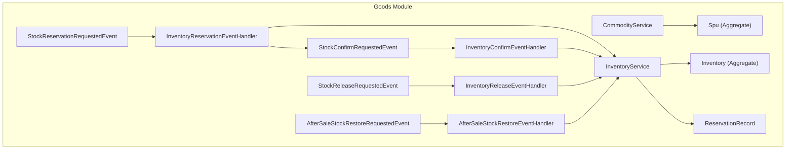
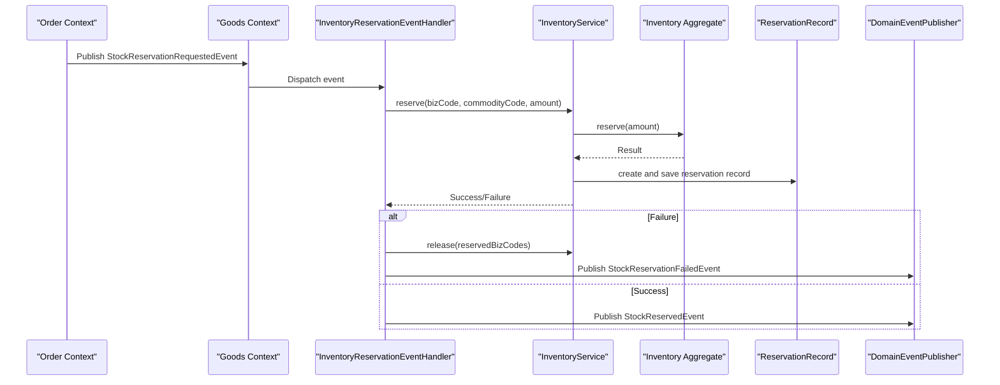
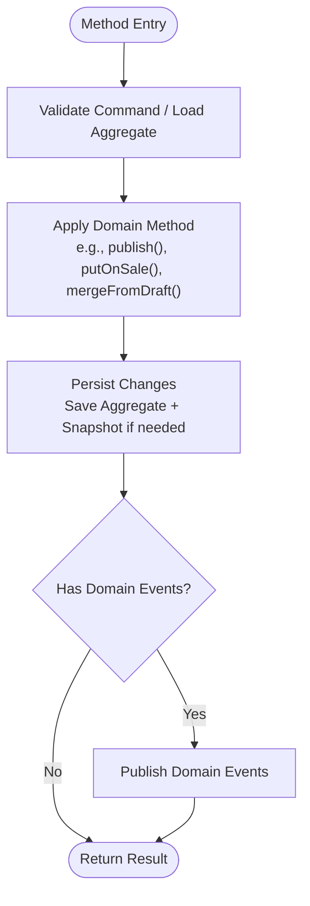
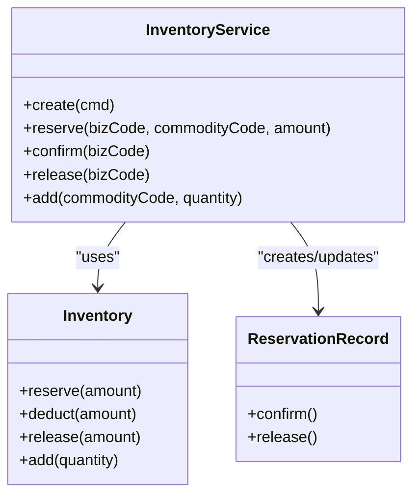
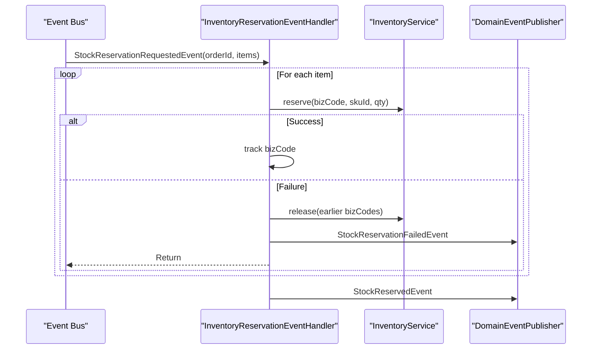
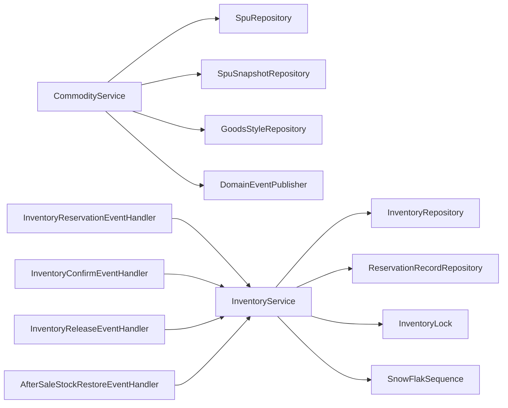

# Service Layer and Business Orchestration

<cite>
**Referenced Files in This Document**
- [CommodityService.kt](file://j-store-goods/src/main/kotlin/com/jstore/goods/service/CommodityService.kt)
- [InventoryService.kt](file://j-store-goods/src/main/kotlin/com/jstore/goods/service/InventoryService.kt)
- [InventoryEventHandler.kt](file://j-store-goods/src/main/kotlin/com/jstore/goods/service/InventoryEventHandler.kt)
- [AfterSaleStockRestoreEventHandler.kt](file://j-store-goods/src/main/kotlin/com/jstore/goods/service/AfterSaleStockRestoreEventHandler.kt)
- [InventoryConfirmEventHandler.kt](file://j-store-goods/src/main/kotlin/com/jstore/goods/service/InventoryConfirmEventHandler.kt)
- [InventoryReleaseEventHandler.kt](file://j-store-goods/src/main/kotlin/com/jstore/goods/service/InventoryReleaseEventHandler.kt)
- [Spu.kt](file://j-store-goods/src/main/kotlin/com/jstore/goods/domain/commodity/Spu.kt)
- [Inventory.kt](file://j-store-goods/src/main/kotlin/com/jstore/goods/domain/inventory/Inventory.kt)
- [ReservationRecord.kt](file://j-store-goods/src/main/kotlin/com/jstore/goods/domain/inventory/ReservationRecord.kt)
- [StockReservationRequestedEvent.kt](file://j-store-goods/src/main/kotlin/com/jstore/goods/acl/event/StockReservationRequestedEvent.kt)
- [StockConfirmRequestedEvent.kt](file://j-store-goods/src/main/kotlin/com/jstore/goods/acl/event/StockConfirmRequestedEvent.kt)
- [StockReleaseRequestedEvent.kt](file://j-store-goods/src/main/kotlin/com/jstore/goods/acl/event/StockReleaseRequestedEvent.kt)
- [AfterSaleStockRestoreRequestedEvent.kt](file://j-store-goods/src/main/kotlin/com/jstore/goods/acl/event/AfterSaleStockRestoreRequestedEvent.kt)
</cite>

## Table of Contents
1. Introduction
2. Project Structure
3. Core Components
4. Architecture Overview
5. Detailed Component Analysis
6. Dependency Analysis
7. Performance Considerations
8. Troubleshooting Guide
9. Conclusion

## Introduction
This document explains the service layer that orchestrates business operations across commodity and inventory domains. It focuses on:
- CommodityService for product lifecycle management (create/update, draft workflow, publish, put-on-sale, take-off-sale, snapshotting).
- InventoryService for stock operations and reservation management (reserve, confirm, release, add).
- Event-driven coordination via event handlers: InventoryReservationEventHandler, InventoryConfirmEventHandler, InventoryReleaseEventHandler, AfterSaleStockRestoreEventHandler.
- Transaction boundaries, error handling patterns, cross-aggregate validation, and integration points with external modules through domain events.

## Project Structure
The goods module contains:
- Domain models for commodity (SPU, SKU, status, factories, repositories) and inventory (Inventory, ReservationRecord, locks, factories, repositories).
- Application services that orchestrate use cases and enforce business rules.
- ACL events that integrate with other modules (order, after-sale).
- Event listeners that translate incoming events into service calls and publish follow-up events.

**Diagram sources**
- [CommodityService.kt](file://j-store-goods/src/main/kotlin/com/jstore/goods/service/CommodityService.kt)
- [InventoryService.kt](file://j-store-goods/src/main/kotlin/com/jstore/goods/service/InventoryService.kt)
- [InventoryEventHandler.kt](file://j-store-goods/src/main/kotlin/com/jstore/goods/service/InventoryEventHandler.kt)
- [InventoryConfirmEventHandler.kt](file://j-store-goods/src/main/kotlin/com/jstore/goods/service/InventoryConfirmEventHandler.kt)
- [InventoryReleaseEventHandler.kt](file://j-store-goods/src/main/kotlin/com/jstore/goods/service/InventoryReleaseEventHandler.kt)
- [AfterSaleStockRestoreEventHandler.kt](file://j-store-goods/src/main/kotlin/com/jstore/goods/service/AfterSaleStockRestoreEventHandler.kt)
- [Spu.kt](file://j-store-goods/src/main/kotlin/com/jstore/goods/domain/commodity/Spu.kt)
- [Inventory.kt](file://j-store-goods/src/main/kotlin/com/jstore/goods/domain/inventory/Inventory.kt)
- [ReservationRecord.kt](file://j-store-goods/src/main/kotlin/com/jstore/goods/domain/inventory/ReservationRecord.kt)
- [StockReservationRequestedEvent.kt](file://j-store-goods/src/main/kotlin/com/jstore/goods/acl/event/StockReservationRequestedEvent.kt)
- [StockConfirmRequestedEvent.kt](file://j-store-goods/src/main/kotlin/com/jstore/goods/acl/event/StockConfirmRequestedEvent.kt)
- [StockReleaseRequestedEvent.kt](file://j-store-goods/src/main/kotlin/com/jstore/goods/acl/event/StockReleaseRequestedEvent.kt)
- [AfterSaleStockRestoreRequestedEvent.kt](file://j-store-goods/src/main/kotlin/com/jstore/goods/acl/event/AfterSaleStockRestoreRequestedEvent.kt)

**Section sources**
- [CommodityService.kt](file://j-store-goods/src/main/kotlin/com/jstore/goods/service/CommodityService.kt)
- [InventoryService.kt](file://j-store-goods/src/main/kotlin/com/jstore/goods/service/InventoryService.kt)
- [InventoryEventHandler.kt](file://j-store-goods/src/main/kotlin/com/jstore/goods/service/InventoryEventHandler.kt)
- [InventoryConfirmEventHandler.kt](file://j-store-goods/src/main/kotlin/com/jstore/goods/service/InventoryConfirmEventHandler.kt)
- [InventoryReleaseEventHandler.kt](file://j-store-goods/src/main/kotlin/com/jstore/goods/service/InventoryReleaseEventHandler.kt)
- [AfterSaleStockRestoreEventHandler.kt](file://j-store-goods/src/main/kotlin/com/jstore/goods/service/AfterSaleStockRestoreEventHandler.kt)
- [Spu.kt](file://j-store-goods/src/main/kotlin/com/jstore/goods/domain/commodity/Spu.kt)
- [Inventory.kt](file://j-store-goods/src/main/kotlin/com/jstore/goods/domain/inventory/Inventory.kt)
- [ReservationRecord.kt](file://j-store-goods/src/main/kotlin/com/jstore/goods/domain/inventory/ReservationRecord.kt)
- [StockReservationRequestedEvent.kt](file://j-store-goods/src/main/kotlin/com/jstore/goods/acl/event/StockReservationRequestedEvent.kt)
- [StockConfirmRequestedEvent.kt](file://j-store-goods/src/main/kotlin/com/jstore/goods/acl/event/StockConfirmRequestedEvent.kt)
- [StockReleaseRequestedEvent.kt](file://j-store-goods/src/main/kotlin/com/jstore/goods/acl/event/StockReleaseRequestedEvent.kt)
- [AfterSaleStockRestoreRequestedEvent.kt](file://j-store-goods/src/main/kotlin/com/jstore/goods/acl/event/AfterSaleStockRestoreRequestedEvent.kt)

## Core Components
- CommodityService: Orchestrates SPU lifecycle, draft workflows, publishing, snapshots, and style updates. Enforces state transitions and publishes domain events.
- InventoryService: Implements TCC-style stock operations with idempotency via bizCode, concurrency control via lock, and reservation record state machine.
- Event Handlers: Translate ACL events into service calls; handle failures with rollback or compensating actions; publish follow-up events.

Key responsibilities:
- Cross-aggregate validation: e.g., preventing direct edits to ON_SALE SPU; requiring draft copy for changes.
- Event-driven communication: Outbound events published after successful state transitions; inbound events trigger service operations.
- Transaction boundaries: Each method performs repository saves within a single transactional boundary; event publication occurs after persistence.

**Section sources**
- [CommodityService.kt](file://j-store-goods/src/main/kotlin/com/jstore/goods/service/CommodityService.kt)
- [InventoryService.kt](file://j-store-goods/src/main/kotlin/com/jstore/goods/service/InventoryService.kt)
- [InventoryEventHandler.kt](file://j-store-goods/src/main/kotlin/com/jstore/goods/service/InventoryEventHandler.kt)
- [InventoryConfirmEventHandler.kt](file://j-store-goods/src/main/kotlin/com/jstore/goods/service/InventoryConfirmEventHandler.kt)
- [InventoryReleaseEventHandler.kt](file://j-store-goods/src/main/kotlin/com/jstore/goods/service/InventoryReleaseEventHandler.kt)
- [AfterSaleStockRestoreEventHandler.kt](file://j-store-goods/src/main/kotlin/com/jstore/goods/service/AfterSaleStockRestoreEventHandler.kt)

## Architecture Overview
The system uses an event-driven architecture with clear separation between application services and domain aggregates. External modules communicate via explicit domain events.

**Diagram sources**
- [InventoryEventHandler.kt](file://j-store-goods/src/main/kotlin/com/jstore/goods/service/InventoryEventHandler.kt)
- [InventoryService.kt](file://j-store-goods/src/main/kotlin/com/jstore/goods/service/InventoryService.kt)
- [Inventory.kt](file://j-store-goods/src/main/kotlin/com/jstore/goods/domain/inventory/Inventory.kt)
- [ReservationRecord.kt](file://j-store-goods/src/main/kotlin/com/jstore/goods/domain/inventory/ReservationRecord.kt)
- [StockReservationRequestedEvent.kt](file://j-store-goods/src/main/kotlin/com/jstore/goods/acl/event/StockReservationRequestedEvent.kt)

## Detailed Component Analysis

### CommodityService
Responsibilities:
- Create or update SPU with guard against editing ON_SALE items directly.
- Add SKU to existing SPU.
- Draft workflow: get draft, merge draft into source, publish draft, discard draft.
- Lifecycle transitions: publish (DRAFT → OFF_SALE), putOnSale (OFF_SALE → ON_SALE), takeOffSale (ON_SALE → OFF_SALE).
- Snapshot creation on putOnSale and publishDraft.
- Save/update goods style (main images, detail HTML, SKU images).

Transaction boundaries:
- Each method loads the aggregate, applies domain methods, persists changes, then publishes domain events.

Error handling:
- Returns typed results indicating success/failure with business errors.
- Validates commands before applying domain logic.

Example call flows:
- createOrUpdate(cmd): verify → load or create → save → return result.
- publish(spuId): load → publish() → save → publish domain events.
- putOnSale(spuId): load → putOnSale() → create snapshot → save both → publish events.
- getDraft(spuId): validate ON_SALE → find/create draft → save → return.
- publishDraft(draftSpuId): load draft/source → mergeFromDraft → create snapshot → persist → delete draft → publish events.

**Diagram sources**
- [CommodityService.kt](file://j-store-goods/src/main/kotlin/com/jstore/goods/service/CommodityService.kt)
- [Spu.kt](file://j-store-goods/src/main/kotlin/com/jstore/goods/domain/commodity/Spu.kt)

**Section sources**
- [CommodityService.kt](file://j-store-goods/src/main/kotlin/com/jstore/goods/service/CommodityService.kt)
- [Spu.kt](file://j-store-goods/src/main/kotlin/com/jstore/goods/domain/commodity/Spu.kt)

### InventoryService
Responsibilities:
- Reserve stock with idempotency by bizCode and concurrency protection via lock.
- Confirm reservation: transition from reserved to confirmed and deduct available stock.
- Release reservation: transition from reserved to released and restore available stock.
- Add stock (prepare) with concurrency protection.

Concurrency and idempotency:
- Lock per commodity code ensures safe concurrent updates.
- Reservation records keyed by bizCode provide idempotent operations.

State machine:
- ReservationRecord transitions: RESERVED → CONFIRMED or RESERVED → RELEASED.

Transaction boundaries:
- reserve(): lock → load inventory → reserve() → save inventory → create and save reservation record.
- confirm(): load reservation → confirm() → load inventory → deduct() → save both.
- release(): load reservation → release() → load inventory → release() → save both.
- add(): lock → load inventory → add() → save.

Error handling:
- Returns typed results; maps lock acquisition failures to a common conflict error.

**Diagram sources**
- [InventoryService.kt](file://j-store-goods/src/main/kotlin/com/jstore/goods/service/InventoryService.kt)
- [Inventory.kt](file://j-store-goods/src/main/kotlin/com/jstore/goods/domain/inventory/Inventory.kt)
- [ReservationRecord.kt](file://j-store-goods/src/main/kotlin/com/jstore/goods/domain/inventory/ReservationRecord.kt)

**Section sources**
- [InventoryService.kt](file://j-store-goods/src/main/kotlin/com/jstore/goods/service/InventoryService.kt)
- [Inventory.kt](file://j-store-goods/src/main/kotlin/com/jstore/goods/domain/inventory/Inventory.kt)
- [ReservationRecord.kt](file://j-store-goods/src/main/kotlin/com/jstore/goods/domain/inventory/ReservationRecord.kt)

### InventoryEventHandler (Reservation)
Responsibilities:
- Listen to StockReservationRequestedEvent.
- For each item, attempt reserve with a unique bizCode per order+sku.
- On partial failure, roll back previously reserved items and publish StockReservationFailedEvent.
- On full success, publish StockReservedEvent.

Error handling and compensation:
- Rollback loop attempts release for each successfully reserved item; logs failures but continues.

**Diagram sources**
- [InventoryEventHandler.kt](file://j-store-goods/src/main/kotlin/com/jstore/goods/service/InventoryEventHandler.kt)
- [InventoryService.kt](file://j-store-goods/src/main/kotlin/com/jstore/goods/service/InventoryService.kt)
- [StockReservationRequestedEvent.kt](file://j-store-goods/src/main/kotlin/com/jstore/goods/acl/event/StockReservationRequestedEvent.kt)

**Section sources**
- [InventoryEventHandler.kt](file://j-store-goods/src/main/kotlin/com/jstore/goods/service/InventoryEventHandler.kt)
- [InventoryService.kt](file://j-store-goods/src/main/kotlin/com/jstore/goods/service/InventoryService.kt)
- [StockReservationRequestedEvent.kt](file://j-store-goods/src/main/kotlin/com/jstore/goods/acl/event/StockReservationRequestedEvent.kt)

### InventoryConfirmEventHandler
Responsibilities:
- Listen to StockConfirmRequestedEvent.
- For each item, confirm reservation and deduct stock.
- Logs failures without failing the whole batch.

**Section sources**
- [InventoryConfirmEventHandler.kt](file://j-store-goods/src/main/kotlin/com/jstore/goods/service/InventoryConfirmEventHandler.kt)
- [InventoryService.kt](file://j-store-goods/src/main/kotlin/com/jstore/goods/service/InventoryService.kt)
- [StockConfirmRequestedEvent.kt](file://j-store-goods/src/main/kotlin/com/jstore/goods/acl/event/StockConfirmRequestedEvent.kt)

### InventoryReleaseEventHandler
Responsibilities:
- Listen to StockReleaseRequestedEvent.
- For each item, release reservation and restore stock.
- Logs warnings on failures.

**Section sources**
- [InventoryReleaseEventHandler.kt](file://j-store-goods/src/main/kotlin/com/jstore/goods/service/InventoryReleaseEventHandler.kt)
- [InventoryService.kt](file://j-store-goods/src/main/kotlin/com/jstore/goods/service/InventoryService.kt)
- [StockReleaseRequestedEvent.kt](file://j-store-goods/src/main/kotlin/com/jstore/goods/acl/event/StockReleaseRequestedEvent.kt)

### AfterSaleStockRestoreEventHandler
Responsibilities:
- Listen to AfterSaleStockRestoreRequestedEvent.
- For each item, add stock back using InventoryService.add().
- Throws on failure to signal processing error.

**Section sources**
- [AfterSaleStockRestoreEventHandler.kt](file://j-store-goods/src/main/kotlin/com/jstore/goods/service/AfterSaleStockRestoreEventHandler.kt)
- [InventoryService.kt](file://j-store-goods/src/main/kotlin/com/jstore/goods/service/InventoryService.kt)
- [AfterSaleStockRestoreRequestedEvent.kt](file://j-store-goods/src/main/kotlin/com/jstore/goods/acl/event/AfterSaleStockRestoreRequestedEvent.kt)

## Dependency Analysis
- CommodityService depends on SpuFactory, SpuRepository, SpuSnapshotFactory, SpuSnapshotRepository, GoodsStyleRepository, GoodsStyleFactory, and DomainEventPublisher.
- InventoryService depends on InventoryRepository, ReservationRecordRepository, InventoryFactory, InventoryLock, InventoryLockConfig, and SnowFlakSequence.
- Event handlers depend on InventoryService and DomainEventPublisher (for publishing follow-up events).

**Diagram sources**
- [CommodityService.kt](file://j-store-goods/src/main/kotlin/com/jstore/goods/service/CommodityService.kt)
- [InventoryService.kt](file://j-store-goods/src/main/kotlin/com/jstore/goods/service/InventoryService.kt)
- [InventoryEventHandler.kt](file://j-store-goods/src/main/kotlin/com/jstore/goods/service/InventoryEventHandler.kt)
- [InventoryConfirmEventHandler.kt](file://j-store-goods/src/main/kotlin/com/jstore/goods/service/InventoryConfirmEventHandler.kt)
- [InventoryReleaseEventHandler.kt](file://j-store-goods/src/main/kotlin/com/jstore/goods/service/InventoryReleaseEventHandler.kt)
- [AfterSaleStockRestoreEventHandler.kt](file://j-store-goods/src/main/kotlin/com/jstore/goods/service/AfterSaleStockRestoreEventHandler.kt)

**Section sources**
- [CommodityService.kt](file://j-store-goods/src/main/kotlin/com/jstore/goods/service/CommodityService.kt)
- [InventoryService.kt](file://j-store-goods/src/main/kotlin/com/jstore/goods/service/InventoryService.kt)
- [InventoryEventHandler.kt](file://j-store-goods/src/main/kotlin/com/jstore/goods/service/InventoryEventHandler.kt)
- [InventoryConfirmEventHandler.kt](file://j-store-goods/src/main/kotlin/com/jstore/goods/service/InventoryConfirmEventHandler.kt)
- [InventoryReleaseEventHandler.kt](file://j-store-goods/src/main/kotlin/com/jstore/goods/service/InventoryReleaseEventHandler.kt)
- [AfterSaleStockRestoreEventHandler.kt](file://j-store-goods/src/main/kotlin/com/jstore/goods/service/AfterSaleStockRestoreEventHandler.kt)

## Performance Considerations
- Concurrency control: InventoryService uses per-commodity locks to serialize conflicting operations; ensure lock timeouts are tuned to avoid deadlocks under high contention.
- Idempotency: ReservationRecord keyed by bizCode prevents duplicate operations; callers should generate stable bizCodes.
- Batch operations: Event handlers process items sequentially; consider batching or parallelization where safe to reduce latency.
- Snapshotting: Snapshots are created on putOnSale and publishDraft; keep snapshot size reasonable to avoid large payloads.
- Event throughput: Ensure DomainEventPublisher is configured for reliable delivery and backpressure handling.

[No sources needed since this section provides general guidance]

## Troubleshooting Guide
Common issues and remedies:
- Insufficient inventory during reserve: Check availableQuantity vs requested amount; ensure upstream validations and pricing checks are correct.
- Concurrent conflicts: Lock acquisition failures map to a common conflict error; retry with backoff or inform caller to retry later.
- Reservation not found: Confirm bizCode generation matches handler expectations; verify reservation was created before confirm/release.
- Illegal state transitions: ReservationRecord enforces RESERVED→CONFIRMED or RESERVED→RELEASED; ensure handlers respect these transitions.
- Draft editing restrictions: Direct edits to ON_SALE SPU are rejected; use draft copy flow to modify products.

Operational tips:
- Log correlation: Use orderId and skuId in logs to trace flows across handlers and services.
- Compensation: In case of partial failures during reservation, ensure all previously reserved items are released.
- Monitoring: Track event counts and failure rates for reserve/confirm/release operations.

**Section sources**
- [InventoryService.kt](file://j-store-goods/src/main/kotlin/com/jstore/goods/service/InventoryService.kt)
- [ReservationRecord.kt](file://j-store-goods/src/main/kotlin/com/jstore/goods/domain/inventory/ReservationRecord.kt)
- [InventoryEventHandler.kt](file://j-store-goods/src/main/kotlin/com/jstore/goods/service/InventoryEventHandler.kt)
- [CommodityService.kt](file://j-store-goods/src/main/kotlin/com/jstore/goods/service/CommodityService.kt)

## Conclusion
The service layer coordinates commodity and inventory operations through well-defined application services and event handlers. CommodityService manages product lifecycles and snapshots, while InventoryService implements robust TCC-style stock operations with idempotency and concurrency controls. Event handlers bridge external contexts (orders, after-sale) with internal services, ensuring consistency and resilience. Clear transaction boundaries, typed error handling, and domain events enable scalable and maintainable business orchestration.

[No sources needed since this section summarizes without analyzing specific files]