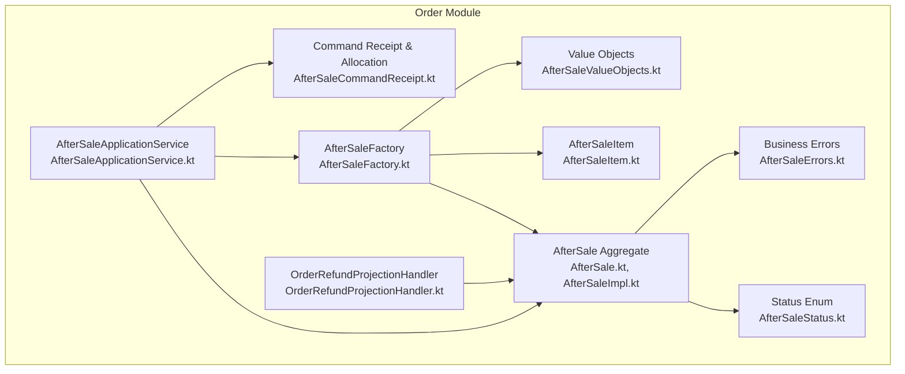
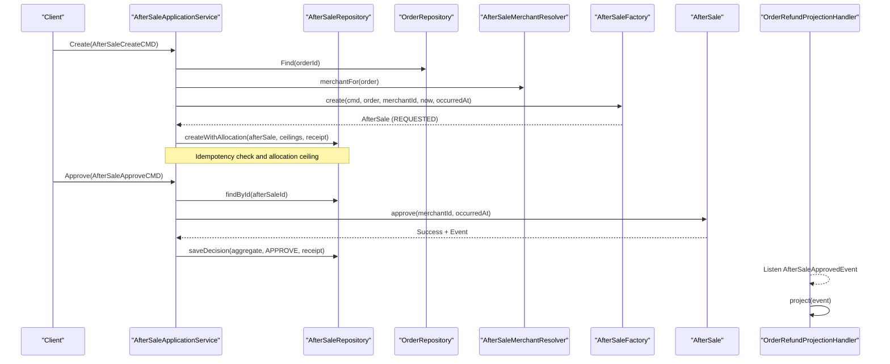
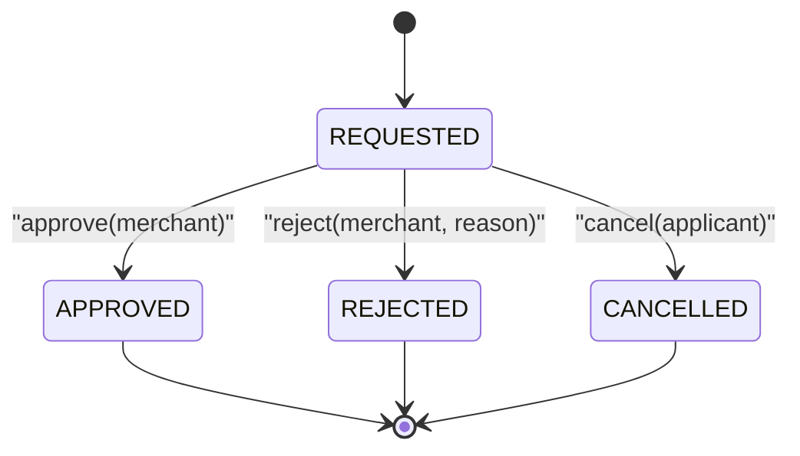
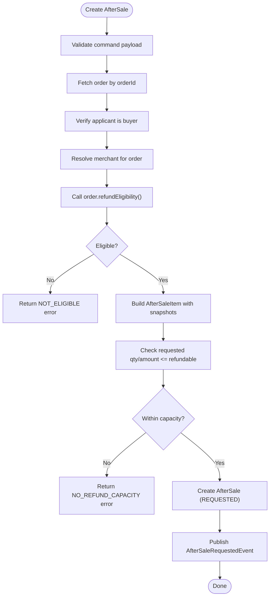
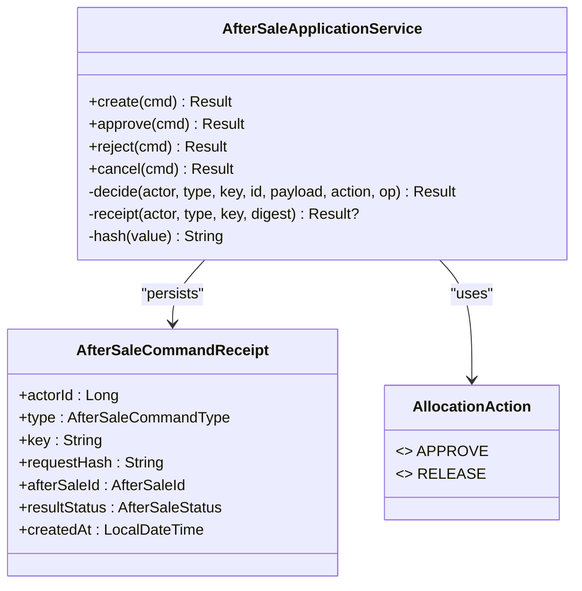
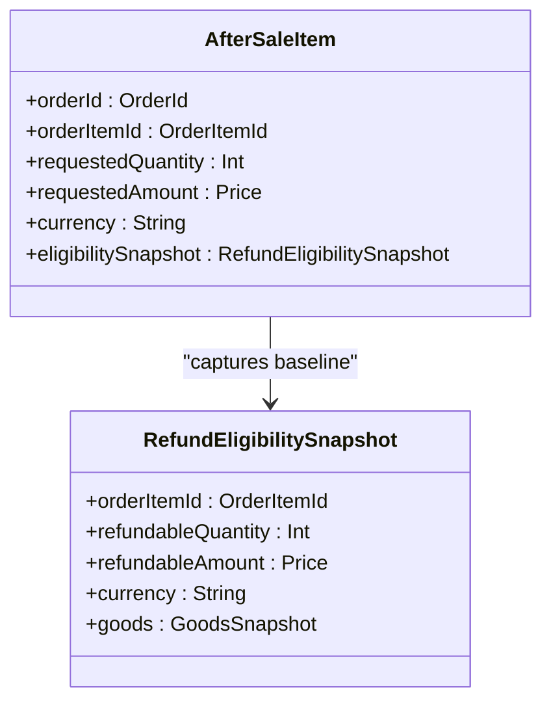
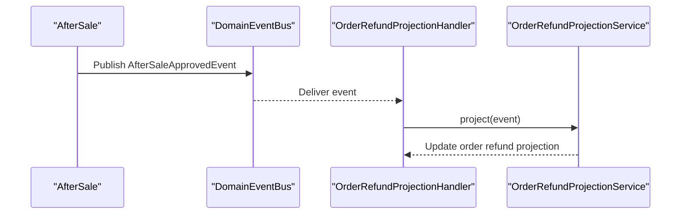
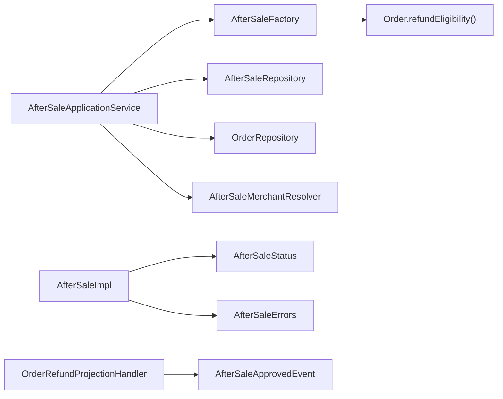

# After-Sale Processing

<cite>
**Referenced Files in This Document**
- [AfterSale.kt](file://j-store-order/src/main/kotlin/com/jstore/order/domain/aftersale/AfterSale.kt)
- [AfterSaleImpl.kt](file://j-store-order/src/main/kotlin/com/jstore/order/domain/aftersale/AfterSaleImpl.kt)
- [AfterSaleStatus.kt](file://j-store-order/src/main/kotlin/com/jstore/order/domain/aftersale/AfterSaleStatus.kt)
- [AfterSaleFactory.kt](file://j-store-order/src/main/kotlin/com/jstore/order/domain/aftersale/AfterSaleFactory.kt)
- [AfterSaleItem.kt](file://j-store-order/src/main/kotlin/com/jstore/order/domain/aftersale/AfterSaleItem.kt)
- [AfterSaleValueObjects.kt](file://j-store-order/src/main/kotlin/com/jstore/order/domain/aftersale/AfterSaleValueObjects.kt)
- [AfterSaleCommandReceipt.kt](file://j-store-order/src/main/kotlin/com/jstore/order/domain/aftersale/AfterSaleCommandReceipt.kt)
- [AfterSaleErrors.kt](file://j-store-order/src/main/kotlin/com/jstore/order/domain/aftersale/AfterSaleErrors.kt)
- [AfterSaleApplicationService.kt](file://j-store-order/src/main/kotlin/com/jstore/order/service/AfterSaleApplicationService.kt)
- [OrderRefundProjectionHandler.kt](file://j-store-order/src/main/kotlin/com/jstore/order/service/OrderRefundProjectionHandler.kt)
- [AfterSaleAggregateTest.kt](file://j-store-order/src/test/kotlin/com/jstore/order/domain/aftersale/AfterSaleAggregateTest.kt)
</cite>

## Table of Contents
1. [Introduction](#introduction)
2. [Project Structure](#project-structure)
3. [Core Components](#core-components)
4. [Architecture Overview](#architecture-overview)
5. [Detailed Component Analysis](#detailed-component-analysis)
6. [Dependency Analysis](#dependency-analysis)
7. [Performance Considerations](#performance-considerations)
8. [Troubleshooting Guide](#troubleshooting-guide)
9. [Conclusion](#conclusion)

## Introduction
This document explains the after-sale processing functionality for returns and refunds within the order domain. It focuses on the AfterSale aggregate, its lifecycle from creation to completion, status transitions, and business rules for different refund scenarios. It also details the command-driven approach for after-sale operations (return requests, approvals, rejections, cancellations), integration with order refund eligibility checking, handling partial vs full refunds, and how after-sale events drive downstream processes such as inventory restoration, accounting entries, and order status updates.

## Project Structure
The after-sale feature is implemented primarily in the order module under the aftersale package and service layer:
- Domain models and value objects define the AfterSale aggregate, items, eligibility snapshots, and statuses.
- The factory encapsulates creation logic and integrates with order refund eligibility.
- The application service orchestrates commands, idempotency, authorization, and persistence.
- A projection handler listens to after-sale approved events to update order refund projections.

**Diagram sources**
- [AfterSale.kt](file://j-store-order/src/main/kotlin/com/jstore/order/domain/aftersale/AfterSale.kt)
- [AfterSaleImpl.kt](file://j-store-order/src/main/kotlin/com/jstore/order/domain/aftersale/AfterSaleImpl.kt)
- [AfterSaleFactory.kt](file://j-store-order/src/main/kotlin/com/jstore/order/domain/aftersale/AfterSaleFactory.kt)
- [AfterSaleItem.kt](file://j-store-order/src/main/kotlin/com/jstore/order/domain/aftersale/AfterSaleItem.kt)
- [AfterSaleValueObjects.kt](file://j-store-order/src/main/kotlin/com/jstore/order/domain/aftersale/AfterSaleValueObjects.kt)
- [AfterSaleStatus.kt](file://j-store-order/src/main/kotlin/com/jstore/order/domain/aftersale/AfterSaleStatus.kt)
- [AfterSaleErrors.kt](file://j-store-order/src/main/kotlin/com/jstore/order/domain/aftersale/AfterSaleErrors.kt)
- [AfterSaleCommandReceipt.kt](file://j-store-order/src/main/kotlin/com/jstore/order/domain/aftersale/AfterSaleCommandReceipt.kt)
- [AfterSaleApplicationService.kt](file://j-store-order/src/main/kotlin/com/jstore/order/service/AfterSaleApplicationService.kt)
- [OrderRefundProjectionHandler.kt](file://j-store-order/src/main/kotlin/com/jstore/order/service/OrderRefundProjectionHandler.kt)

**Section sources**
- [AfterSale.kt](file://j-store-order/src/main/kotlin/com/jstore/order/domain/aftersale/AfterSale.kt)
- [AfterSaleImpl.kt](file://j-store-order/src/main/kotlin/com/jstore/order/domain/aftersale/AfterSaleImpl.kt)
- [AfterSaleFactory.kt](file://j-store-order/src/main/kotlin/com/jstore/order/domain/aftersale/AfterSaleFactory.kt)
- [AfterSaleItem.kt](file://j-store-order/src/main/kotlin/com/jstore/order/domain/aftersale/AfterSaleItem.kt)
- [AfterSaleValueObjects.kt](file://j-store-order/src/main/kotlin/com/jstore/order/domain/aftersale/AfterSaleValueObjects.kt)
- [AfterSaleStatus.kt](file://j-store-order/src/main/kotlin/com/jstore/order/domain/aftersale/AfterSaleStatus.kt)
- [AfterSaleErrors.kt](file://j-store-order/src/main/kotlin/com/jstore/order/domain/aftersale/AfterSaleErrors.kt)
- [AfterSaleCommandReceipt.kt](file://j-store-order/src/main/kotlin/com/jstore/order/domain/aftersale/AfterSaleCommandReceipt.kt)
- [AfterSaleApplicationService.kt](file://j-store-order/src/main/kotlin/com/jstore/order/service/AfterSaleApplicationService.kt)
- [OrderRefundProjectionHandler.kt](file://j-store-order/src/main/kotlin/com/jstore/order/service/OrderRefundProjectionHandler.kt)

## Core Components
- AfterSale aggregate: Represents a return/refund request with state transitions for approve, reject, and cancel. Emits domain events upon state changes.
- AfterSaleFactory: Creates AfterSale instances by validating against order refund eligibility and building item-level snapshots.
- AfterSaleApplicationService: Command entry points for create, approve, reject, cancel; enforces idempotency, authorization, and allocation ceilings.
- Value objects and enums: RefundReason, FulfillmentSnapshot, GoodsSnapshot, RefundEligibilitySnapshot, ReviewDecision, AfterSaleStatus, and error definitions.
- OrderRefundProjectionHandler: Listens to AfterSaleApprovedEvent to project refund facts onto the order side.

Key responsibilities:
- Enforce refund capacity per order line item.
- Capture immutable snapshots of goods and eligibility at request time.
- Ensure only authorized actors can transition states.
- Persist command receipts to guarantee idempotent operations.

**Section sources**
- [AfterSale.kt](file://j-store-order/src/main/kotlin/com/jstore/order/domain/aftersale/AfterSale.kt)
- [AfterSaleImpl.kt](file://j-store-order/src/main/kotlin/com/jstore/order/domain/aftersale/AfterSaleImpl.kt)
- [AfterSaleFactory.kt](file://j-store-order/src/main/kotlin/com/jstore/order/domain/aftersale/AfterSaleFactory.kt)
- [AfterSaleItem.kt](file://j-store-order/src/main/kotlin/com/jstore/order/domain/aftersale/AfterSaleItem.kt)
- [AfterSaleValueObjects.kt](file://j-store-order/src/main/kotlin/com/jstore/order/domain/aftersale/AfterSaleValueObjects.kt)
- [AfterSaleStatus.kt](file://j-store-order/src/main/kotlin/com/jstore/order/domain/aftersale/AfterSaleStatus.kt)
- [AfterSaleErrors.kt](file://j-store-order/src/main/kotlin/com/jstore/order/domain/aftersale/AfterSaleErrors.kt)
- [AfterSaleApplicationService.kt](file://j-store-order/src/main/kotlin/com/jstore/order/service/AfterSaleApplicationService.kt)
- [OrderRefundProjectionHandler.kt](file://j-store-order/src/main/kotlin/com/jstore/order/service/OrderRefundProjectionHandler.kt)

## Architecture Overview
The after-sale process follows a command-driven design:
- Commands enter via AfterSaleApplicationService.
- Factory validates eligibility and constructs the AfterSale aggregate with item snapshots.
- Aggregate methods enforce state transitions and publish domain events.
- Application service persists decisions and command receipts for idempotency.
- Downstream consumers (e.g., order refund projection) react to events.

**Diagram sources**
- [AfterSaleApplicationService.kt](file://j-store-order/src/main/kotlin/com/jstore/order/service/AfterSaleApplicationService.kt)
- [AfterSaleFactory.kt](file://j-store-order/src/main/kotlin/com/jstore/order/domain/aftersale/AfterSaleFactory.kt)
- [AfterSaleImpl.kt](file://j-store-order/src/main/kotlin/com/jstore/order/domain/aftersale/AfterSaleImpl.kt)
- [OrderRefundProjectionHandler.kt](file://j-store-order/src/main/kotlin/com/jstore/order/service/OrderRefundProjectionHandler.kt)

## Detailed Component Analysis

### AfterSale Aggregate Lifecycle and State Machine
- States: REQUESTED, APPROVED, REJECTED, CANCELLED.
- Transitions:
  - REQUESTED -> APPROVED: Merchant approves; emits approval event.
  - REQUESTED -> REJECTED: Merchant rejects with reason; emits rejection event.
  - REQUESTED -> CANCELLED: Applicant cancels before review; emits cancellation event.
- Authorization: Only the merchant can approve/reject; only the applicant can cancel.
- Events: Each transition publishes exactly one domain event capturing relevant context.

**Diagram sources**
- [AfterSaleStatus.kt](file://j-store-order/src/main/kotlin/com/jstore/order/domain/aftersale/AfterSaleStatus.kt)
- [AfterSaleImpl.kt](file://j-store-order/src/main/kotlin/com/jstore/order/domain/aftersale/AfterSaleImpl.kt)

**Section sources**
- [AfterSale.kt](file://j-store-order/src/main/kotlin/com/jstore/order/domain/aftersale/AfterSale.kt)
- [AfterSaleImpl.kt](file://j-store-order/src/main/kotlin/com/jstore/order/domain/aftersale/AfterSaleImpl.kt)
- [AfterSaleStatus.kt](file://j-store-order/src/main/kotlin/com/jstore/order/domain/aftersale/AfterSaleStatus.kt)

### Creation Flow and Refund Eligibility Integration
- The factory checks order.refundEligibility() to ensure the buyer is eligible and to compute per-item refundable quantity and amount.
- Items are validated against eligibility: quantity and amount must not exceed refundable limits; currency must match.
- Fulfillment snapshot determines whether a physical return is required based on fulfillment status.
- Upon successful creation, an AfterSaleRequestedEvent is published with item-level details.

**Diagram sources**
- [AfterSaleFactory.kt](file://j-store-order/src/main/kotlin/com/jstore/order/domain/aftersale/AfterSaleFactory.kt)
- [AfterSaleValueObjects.kt](file://j-store-order/src/main/kotlin/com/jstore/order/domain/aftersale/AfterSaleValueObjects.kt)

**Section sources**
- [AfterSaleFactory.kt](file://j-store-order/src/main/kotlin/com/jstore/order/domain/aftersale/AfterSaleFactory.kt)
- [AfterSaleValueObjects.kt](file://j-store-order/src/main/kotlin/com/jstore/order/domain/aftersale/AfterSaleValueObjects.kt)

### Command-Driven Operations and Idempotency
- Create: Validates payload, resolves merchant, builds aggregate, allocates refund capacity ceilings, and persists with a command receipt.
- Approve/Reject/Cancel: Centralized decide method enforces idempotency key validation, loads aggregate, executes operation, and saves decision with allocation action (APPROVE or RELEASE).
- Idempotency: Command receipts store actor, type, key, and hash digest to prevent duplicate execution and detect conflicts.

**Diagram sources**
- [AfterSaleApplicationService.kt](file://j-store-order/src/main/kotlin/com/jstore/order/service/AfterSaleApplicationService.kt)
- [AfterSaleCommandReceipt.kt](file://j-store-order/src/main/kotlin/com/jstore/order/domain/aftersale/AfterSaleCommandReceipt.kt)

**Section sources**
- [AfterSaleApplicationService.kt](file://j-store-order/src/main/kotlin/com/jstore/order/service/AfterSaleApplicationService.kt)
- [AfterSaleCommandReceipt.kt](file://j-store-order/src/main/kotlin/com/jstore/order/domain/aftersale/AfterSaleCommandReceipt.kt)

### Partial vs Full Refunds and Refund Facts
- Partial refund: Requested quantity and/or amount less than or equal to refundable limits per item.
- Full refund: Requested quantity equals refundable quantity and amount equals refundable amount.
- Refund facts: Captured via RefundEligibilitySnapshot and item-level snapshots; these immutables persist the baseline for any subsequent refund calculations.
- Approval triggers downstream projection to record approved refund items on the order side.

**Diagram sources**
- [AfterSaleItem.kt](file://j-store-order/src/main/kotlin/com/jstore/order/domain/aftersale/AfterSaleItem.kt)
- [AfterSaleValueObjects.kt](file://j-store-order/src/main/kotlin/com/jstore/order/domain/aftersale/AfterSaleValueObjects.kt)

**Section sources**
- [AfterSaleItem.kt](file://j-store-order/src/main/kotlin/com/jstore/order/domain/aftersale/AfterSaleItem.kt)
- [AfterSaleValueObjects.kt](file://j-store-order/src/main/kotlin/com/jstore/order/domain/aftersale/AfterSaleValueObjects.kt)

### Inventory Restoration and Accounting Entries
- Inventory restoration: When an after-sale is approved, downstream services (e.g., goods/inventory) may receive stock restore requests triggered by after-sale events.
- Accounting entries: Approved refunds typically generate accounting journal entries through separate accounting modules reacting to after-sale events.
- Order status updates: Order refund projections are updated when AfterSaleApprovedEvent is consumed.

Note: The exact handlers for inventory and accounting reside in other modules; this section describes integration points driven by after-sale events.

[No sources needed since this section provides general guidance]

### Order Status Updates Through Domain Events
- AfterSaleApprovedEvent is consumed by OrderRefundProjectionHandler to project approved refund facts onto the order.
- This decouples order state updates from after-sale processing while ensuring eventual consistency.

**Diagram sources**
- [AfterSaleImpl.kt](file://j-store-order/src/main/kotlin/com/jstore/order/domain/aftersale/AfterSaleImpl.kt)
- [OrderRefundProjectionHandler.kt](file://j-store-order/src/main/kotlin/com/jstore/order/service/OrderRefundProjectionHandler.kt)

**Section sources**
- [OrderRefundProjectionHandler.kt](file://j-store-order/src/main/kotlin/com/jstore/order/service/OrderRefundProjectionHandler.kt)

## Dependency Analysis
- AfterSaleApplicationService depends on:
  - AfterSaleFactory for creation and eligibility validation.
  - AfterSaleRepository for persistence and idempotency receipts.
  - OrderRepository for fetching order details.
  - AfterSaleMerchantResolver for resolving merchant context.
- AfterSaleFactory depends on Order.refundEligibility() to build accurate item snapshots and enforce capacity.
- AfterSaleImpl depends on AfterSaleStatus and AfterSaleErrors for state machine enforcement and error signaling.
- OrderRefundProjectionHandler depends on AfterSaleApprovedEvent to update order-side refund projections.

**Diagram sources**
- [AfterSaleApplicationService.kt](file://j-store-order/src/main/kotlin/com/jstore/order/service/AfterSaleApplicationService.kt)
- [AfterSaleFactory.kt](file://j-store-order/src/main/kotlin/com/jstore/order/domain/aftersale/AfterSaleFactory.kt)
- [AfterSaleImpl.kt](file://j-store-order/src/main/kotlin/com/jstore/order/domain/aftersale/AfterSaleImpl.kt)
- [AfterSaleStatus.kt](file://j-store-order/src/main/kotlin/com/jstore/order/domain/aftersale/AfterSaleStatus.kt)
- [AfterSaleErrors.kt](file://j-store-order/src/main/kotlin/com/jstore/order/domain/aftersale/AfterSaleErrors.kt)
- [OrderRefundProjectionHandler.kt](file://j-store-order/src/main/kotlin/com/jstore/order/service/OrderRefundProjectionHandler.kt)

**Section sources**
- [AfterSaleApplicationService.kt](file://j-store-order/src/main/kotlin/com/jstore/order/service/AfterSaleApplicationService.kt)
- [AfterSaleFactory.kt](file://j-store-order/src/main/kotlin/com/jstore/order/domain/aftersale/AfterSaleFactory.kt)
- [AfterSaleImpl.kt](file://j-store-order/src/main/kotlin/com/jstore/order/domain/aftersale/AfterSaleImpl.kt)
- [AfterSaleStatus.kt](file://j-store-order/src/main/kotlin/com/jstore/order/domain/aftersale/AfterSaleStatus.kt)
- [AfterSaleErrors.kt](file://j-store-order/src/main/kotlin/com/jstore/order/domain/aftersale/AfterSaleErrors.kt)
- [OrderRefundProjectionHandler.kt](file://j-store-order/src/main/kotlin/com/jstore/order/service/OrderRefundProjectionHandler.kt)

## Performance Considerations
- Idempotency checks use hashed digests to avoid repeated work and protect against concurrent duplicates.
- Snapshotting eligibility and goods data at creation time avoids repeated lookups and ensures consistent refund calculations.
- Allocation ceilings per order line item prevent over-refunding and reduce contention during approvals.
- Event-driven projections enable asynchronous updates, improving throughput and responsiveness.

[No sources needed since this section provides general guidance]

## Troubleshooting Guide
Common errors and their meanings:
- NotFound / OrderNotFound: After-sale or order does not exist.
- ActorForbidden: Applicant or merchant attempted unauthorized actions.
- NotEligible / NoRefundCapacity: Order or item lacks refund capacity; verify eligibility and requested amounts.
- InvalidState: Attempted invalid state transition; ensure current status allows the operation.
- ReasonInvalid / RejectionReasonInvalid: Validation failed for reason length/format.
- IdempotencyKeyInvalid / IdempotencyConflict: Duplicate or malformed idempotency keys; ensure unique keys per operation.
- ConcurrentModification: Aggregate modified concurrently; retry with fresh state.

Validation and tests:
- Value object constraints enforce bounds (e.g., positive quantities, non-zero amounts, currency matching).
- Aggregate tests confirm state machine behavior and single-event emission.

**Section sources**
- [AfterSaleErrors.kt](file://j-store-order/src/main/kotlin/com/jstore/order/domain/aftersale/AfterSaleErrors.kt)
- [AfterSaleValueObjects.kt](file://j-store-order/src/main/kotlin/com/jstore/order/domain/aftersale/AfterSaleValueObjects.kt)
- [AfterSaleAggregateTest.kt](file://j-store-order/src/test/kotlin/com/jstore/order/domain/aftersale/AfterSaleAggregateTest.kt)

## Conclusion
The AfterSale aggregate provides a robust, command-driven model for managing returns and refunds. It enforces strict eligibility checks, captures immutable snapshots, and uses domain events to coordinate downstream processes like inventory restoration, accounting entries, and order status updates. The application service centralizes authorization, idempotency, and allocation management, ensuring reliable and auditable after-sale operations across the system.