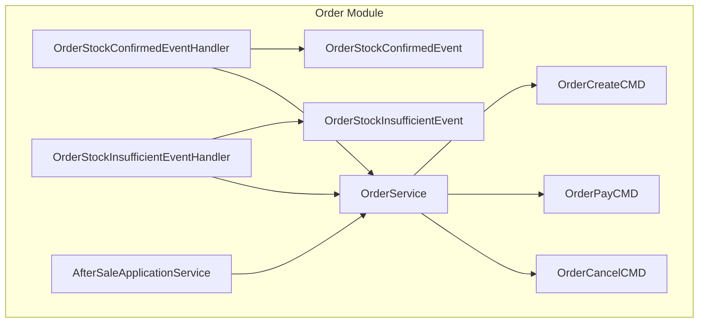
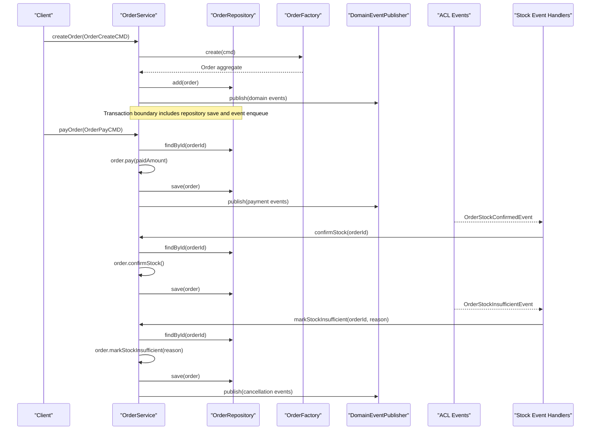
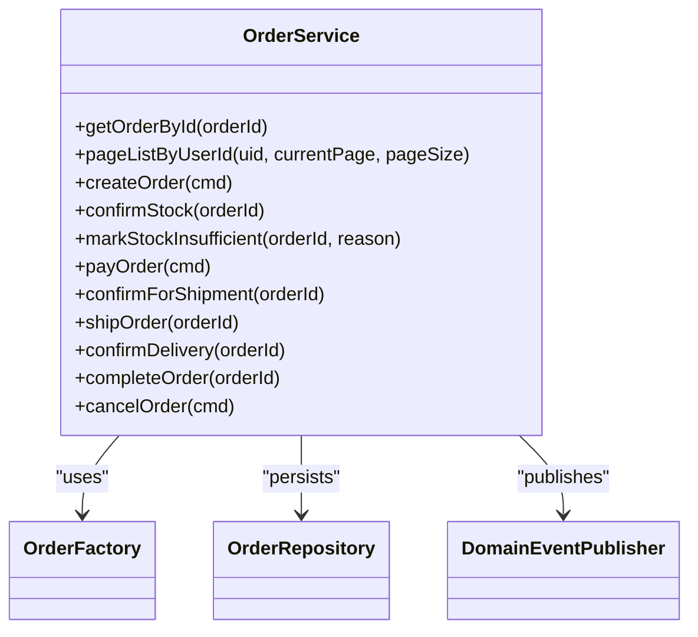
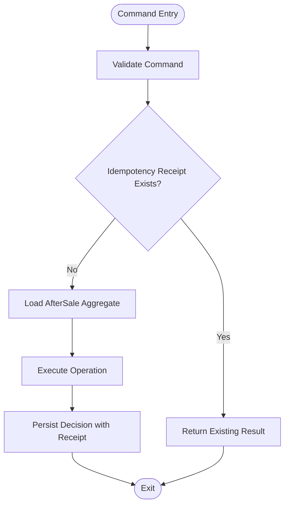
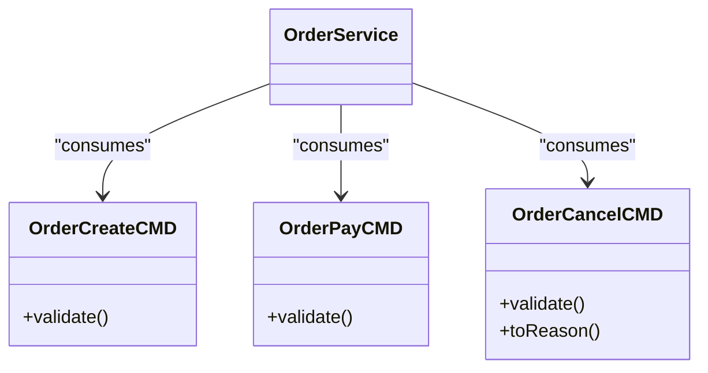
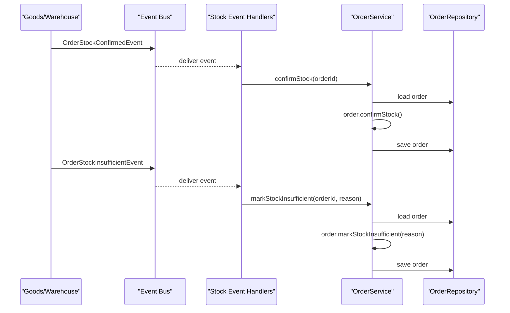
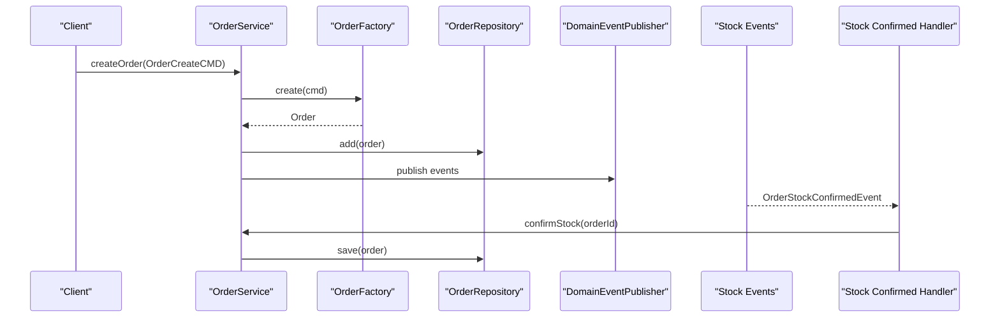
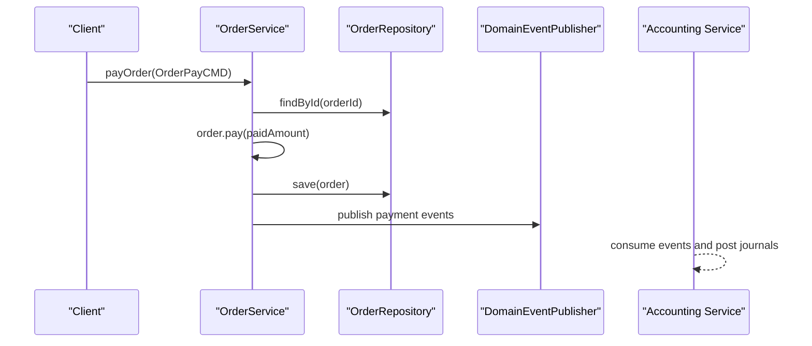
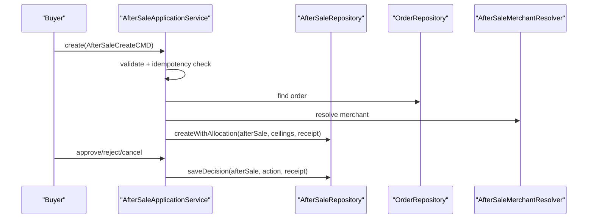
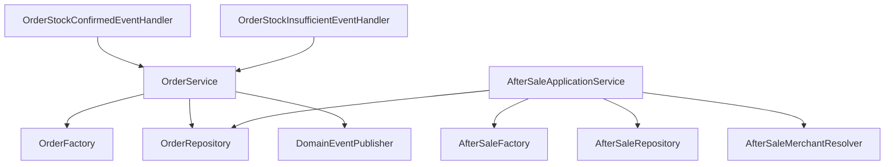

# Application Services

<cite>
**Referenced Files in This Document**
- [OrderService.kt](file://j-store-order/src/main/kotlin/com/jstore/order/service/OrderService.kt)
- [AfterSaleApplicationService.kt](file://j-store-order/src/main/kotlin/com/jstore/order/service/AfterSaleApplicationService.kt)
- [OrderCreateCMD.kt](file://j-store-order/src/main/kotlin/com/jstore/order/domain/order/command/OrderCreateCMD.kt)
- [OrderPayCMD.kt](file://j-store-order/src/main/kotlin/com/jstore/order/domain/order/command/OrderPayCMD.kt)
- [OrderCancelCMD.kt](file://j-store-order/src/main/kotlin/com/jstore/order/domain/order/command/OrderCancelCMD.kt)
- [OrderStockEventHandler.kt](file://j-store-order/src/main/kotlin/com/jstore/order/service/OrderStockEventHandler.kt)
- [OrderStockInsufficientEventHandler.kt](file://j-store-order/src/main/kotlin/com/jstore/order/service/OrderStockInsufficientEventHandler.kt)
- [OrderStockConfirmedEvent.kt](file://j-store-order/src/main/kotlin/com/jstore/order/acl/event/OrderStockConfirmedEvent.kt)
- [OrderStockInsufficientEvent.kt](file://j-store-order/src/main/kotlin/com/jstore/order/acl/event/OrderStockInsufficientEvent.kt)
</cite>

## Table of Contents
1. [Introduction](#introduction)
2. [Project Structure](#project-structure)
3. [Core Components](#core-components)
4. [Architecture Overview](#architecture-overview)
5. [Detailed Component Analysis](#detailed-component-analysis)
6. [Dependency Analysis](#dependency-analysis)
7. [Performance Considerations](#performance-considerations)
8. [Troubleshooting Guide](#troubleshooting-guide)
9. [Conclusion](#conclusion)

## Introduction
This document explains the application services layer for the order module, focusing on how business workflows are orchestrated between user-facing operations and domain aggregates. It covers OrderService and AfterSaleApplicationService, details the command pattern implementation for order operations (OrderCreateCMD, OrderPayCMD, OrderCancelCMD), and documents event handlers that respond to stock confirmation and insufficient stock scenarios. It also provides end-to-end examples of order creation with inventory reservation, payment processing with accounting integration, and after-sale request handling, while addressing transaction boundaries, error handling strategies, and cross-domain communication through domain events.

## Project Structure
The order module’s application services reside under j-store-order/src/main/kotlin/com/jstore/order/service. Commands are defined under j-store-order/src/main/kotlin/com/jstore/order/domain/order/command. Cross-domain ACL events are located under j-store-order/src/main/kotlin/com/jstore/order/acl/event. Event listeners bridge external domain events into order state transitions.

**Diagram sources**
- [OrderService.kt:25-130](file://j-store-order/src/main/kotlin/com/jstore/order/service/OrderService.kt#L25-L130)
- [AfterSaleApplicationService.kt:13-41](file://j-store-order/src/main/kotlin/com/jstore/order/service/AfterSaleApplicationService.kt#L13-L41)
- [OrderStockEventHandler.kt:13-28](file://j-store-order/src/main/kotlin/com/jstore/order/service/OrderStockEventHandler.kt#L13-L28)
- [OrderStockInsufficientEventHandler.kt:13-28](file://j-store-order/src/main/kotlin/com/jstore/order/service/OrderStockInsufficientEventHandler.kt#L13-L28)
- [OrderCreateCMD.kt:15-61](file://j-store-order/src/main/kotlin/com/jstore/order/domain/order/command/OrderCreateCMD.kt#L15-L61)
- [OrderPayCMD.kt:14-22](file://j-store-order/src/main/kotlin/com/jstore/order/domain/order/command/OrderPayCMD.kt#L14-L22)
- [OrderCancelCMD.kt:15-26](file://j-store-order/src/main/kotlin/com/jstore/order/domain/order/command/OrderCancelCMD.kt#L15-L26)
- [OrderStockConfirmedEvent.kt:12-23](file://j-store-order/src/main/kotlin/com/jstore/order/acl/event/OrderStockConfirmedEvent.kt#L12-L23)
- [OrderStockInsufficientEvent.kt:12-24](file://j-store-order/src/main/kotlin/com/jstore/order/acl/event/OrderStockInsufficientEvent.kt#L12-L24)

**Section sources**
- [OrderService.kt:25-130](file://j-store-order/src/main/kotlin/com/jstore/order/service/OrderService.kt#L25-L130)
- [AfterSaleApplicationService.kt:13-41](file://j-store-order/src/main/kotlin/com/jstore/order/service/AfterSaleApplicationService.kt#L13-L41)
- [OrderStockEventHandler.kt:13-28](file://j-store-order/src/main/kotlin/com/jstore/order/service/OrderStockEventHandler.kt#L13-L28)
- [OrderStockInsufficientEventHandler.kt:13-28](file://j-store-order/src/main/kotlin/com/jstore/order/service/OrderStockInsufficientEventHandler.kt#L13-L28)
- [OrderCreateCMD.kt:15-61](file://j-store-order/src/main/kotlin/com/jstore/order/domain/order/command/OrderCreateCMD.kt#L15-L61)
- [OrderPayCMD.kt:14-22](file://j-store-order/src/main/kotlin/com/jstore/order/domain/order/command/OrderPayCMD.kt#L14-L22)
- [OrderCancelCMD.kt:15-26](file://j-store-order/src/main/kotlin/com/jstore/order/domain/order/command/OrderCancelCMD.kt#L15-L26)
- [OrderStockConfirmedEvent.kt:12-23](file://j-store-order/src/main/kotlin/com/jstore/order/acl/event/OrderStockConfirmedEvent.kt#L12-L23)
- [OrderStockInsufficientEvent.kt:12-24](file://j-store-order/src/main/kotlin/com/jstore/order/acl/event/OrderStockInsufficientEvent.kt#L12-L24)

## Core Components
- OrderService: Orchestrates order lifecycle operations by loading aggregates, invoking domain behavior, persisting changes, and publishing domain events. It exposes methods for creating orders, confirming stock, marking insufficient stock, processing payments, preparing for shipment, shipping, confirming delivery, completing orders, and canceling orders.
- AfterSaleApplicationService: Handles after-sale requests with idempotency guarantees, authorization checks against buyer/merchant roles, merchant resolution, aggregate creation, allocation ceilings, and decision persistence.

Key responsibilities:
- Command validation and transformation
- Aggregate factory usage to create consistent domain objects
- Repository interactions for persistence
- Domain event publication for cross-boundary communication
- Idempotency and safety mechanisms for after-sale decisions

**Section sources**
- [OrderService.kt:25-130](file://j-store-order/src/main/kotlin/com/jstore/order/service/OrderService.kt#L25-L130)
- [AfterSaleApplicationService.kt:13-41](file://j-store-order/src/main/kotlin/com/jstore/order/service/AfterSaleApplicationService.kt#L13-L41)

## Architecture Overview
The application services layer coordinates user-facing commands with domain aggregates and external systems via domain events. Stock-related events from the goods/warehouse context trigger order state transitions. Payment flows integrate with accounting through domain events published by the order aggregate.

**Diagram sources**
- [OrderService.kt:44-128](file://j-store-order/src/main/kotlin/com/jstore/order/service/OrderService.kt#L44-L128)
- [OrderStockEventHandler.kt:22-27](file://j-store-order/src/main/kotlin/com/jstore/order/service/OrderStockEventHandler.kt#L22-L27)
- [OrderStockInsufficientEventHandler.kt:22-27](file://j-store-order/src/main/kotlin/com/jstore/order/service/OrderStockInsufficientEventHandler.kt#L22-L27)
- [OrderStockConfirmedEvent.kt:12-23](file://j-store-order/src/main/kotlin/com/jstore/order/acl/event/OrderStockConfirmedEvent.kt#L12-L23)
- [OrderStockInsufficientEvent.kt:12-24](file://j-store-order/src/main/kotlin/com/jstore/order/acl/event/OrderStockInsufficientEvent.kt#L12-L24)

## Detailed Component Analysis

### OrderService
OrderService implements the command-driven orchestration pattern:
- Validates commands using their built-in validators
- Uses OrderFactory to construct aggregates consistently
- Persists changes via OrderRepository
- Publishes domain events for downstream processes

Important operations:
- createOrder: validates input, creates order, persists, publishes events
- confirmStock: transitions order to paid/preparing based on stock confirmation
- markStockInsufficient: cancels order due to insufficient stock and publishes cancellation events
- payOrder: applies payment, updates state, publishes payment events
- confirmForShipment, shipOrder, confirmDelivery, completeOrder: progress order through fulfillment states
- cancelOrder: handles buyer-initiated cancellations with reason capture

Error handling:
- Returns Result types with Failure carrying BusinessError
- Logs and continues when appropriate (e.g., event handler retries)

Transaction boundaries:
- Each method typically wraps repository operations within a single transaction scope
- Domain events are enqueued within the same transaction to ensure consistency

Cross-domain communication:
- Publishes domain events via DomainEventPublisher
- Consumes ACL events through dedicated event handlers

**Diagram sources**
- [OrderService.kt:25-130](file://j-store-order/src/main/kotlin/com/jstore/order/service/OrderService.kt#L25-L130)

**Section sources**
- [OrderService.kt:25-130](file://j-store-order/src/main/kotlin/com/jstore/order/service/OrderService.kt#L25-L130)

### AfterSaleApplicationService
AfterSaleApplicationService manages after-sale requests with strong idempotency and authorization:
- create: validates command, checks idempotency receipt, verifies buyer ownership, resolves merchant, constructs after-sale aggregate, computes refund capacity ceilings, and persists with command receipt
- get/listByOrder: enforces actor-based access control (buyer or merchant)
- approve/reject/cancel: shared decide flow ensures idempotency, loads aggregate, executes operation, and saves decision with receipt

Idempotency strategy:
- Computes a digest from command type, after-sale ID, actor, and payload
- Stores receipts to prevent duplicate processing
- Detects conflicts if digests mismatch

Authorization and merchant resolution:
- Ensures only the buyer or resolved merchant can act
- Uses AfterSaleMerchantResolver to determine merchant context

**Diagram sources**
- [AfterSaleApplicationService.kt:34-38](file://j-store-order/src/main/kotlin/com/jstore/order/service/AfterSaleApplicationService.kt#L34-L38)

**Section sources**
- [AfterSaleApplicationService.kt:13-41](file://j-store-order/src/main/kotlin/com/jstore/order/service/AfterSaleApplicationService.kt#L13-L41)

### Command Pattern Implementation
Commands encapsulate user intentions and carry validation logic:
- OrderCreateCMD: validates items, buyer info, recipient details, and contact constraints
- OrderPayCMD: validates paid amount positivity
- OrderCancelCMD: validates cancellation reason and converts to domain reason

These commands are consumed by OrderService methods which delegate domain behavior to aggregates.

**Diagram sources**
- [OrderCreateCMD.kt:15-61](file://j-store-order/src/main/kotlin/com/jstore/order/domain/order/command/OrderCreateCMD.kt#L15-L61)
- [OrderPayCMD.kt:14-22](file://j-store-order/src/main/kotlin/com/jstore/order/domain/order/command/OrderPayCMD.kt#L14-L22)
- [OrderCancelCMD.kt:15-26](file://j-store-order/src/main/kotlin/com/jstore/order/domain/order/command/OrderCancelCMD.kt#L15-L26)

**Section sources**
- [OrderCreateCMD.kt:15-61](file://j-store-order/src/main/kotlin/com/jstore/order/domain/order/command/OrderCreateCMD.kt#L15-L61)
- [OrderPayCMD.kt:14-22](file://j-store-order/src/main/kotlin/com/jstore/order/domain/order/command/OrderPayCMD.kt#L14-L22)
- [OrderCancelCMD.kt:15-26](file://j-store-order/src/main/kotlin/com/jstore/order/domain/order/command/OrderCancelCMD.kt#L15-L26)

### Event Handlers for Stock Scenarios
Two event handlers bridge external stock events into order state changes:
- OrderStockConfirmedEventHandler: listens for stock confirmation and calls OrderService.confirmStock
- OrderStockInsufficientEventHandler: listens for insufficient stock and calls OrderService.markStockInsufficient

Both handlers log outcomes and handle failures gracefully without blocking event processing.

**Diagram sources**
- [OrderStockEventHandler.kt:22-27](file://j-store-order/src/main/kotlin/com/jstore/order/service/OrderStockEventHandler.kt#L22-L27)
- [OrderStockInsufficientEventHandler.kt:22-27](file://j-store-order/src/main/kotlin/com/jstore/order/service/OrderStockInsufficientEventHandler.kt#L22-L27)
- [OrderStockConfirmedEvent.kt:12-23](file://j-store-order/src/main/kotlin/com/jstore/order/acl/event/OrderStockConfirmedEvent.kt#L12-L23)
- [OrderStockInsufficientEvent.kt:12-24](file://j-store-order/src/main/kotlin/com/jstore/order/acl/event/OrderStockInsufficientEvent.kt#L12-L24)

**Section sources**
- [OrderStockEventHandler.kt:13-28](file://j-store-order/src/main/kotlin/com/jstore/order/service/OrderStockEventHandler.kt#L13-L28)
- [OrderStockInsufficientEventHandler.kt:13-28](file://j-store-order/src/main/kotlin/com/jstore/order/service/OrderStockInsufficientEventHandler.kt#L13-L28)
- [OrderStockConfirmedEvent.kt:12-23](file://j-store-order/src/main/kotlin/com/jstore/order/acl/event/OrderStockConfirmedEvent.kt#L12-L23)
- [OrderStockInsufficientEvent.kt:12-24](file://j-store-order/src/main/kotlin/com/jstore/order/acl/event/OrderStockInsufficientEvent.kt#L12-L24)

### Complete Business Flows

#### Order Creation with Inventory Reservation
1. Client sends OrderCreateCMD
2. OrderService validates command and uses OrderFactory to create Order
3. Order is persisted via OrderRepository
4. Order publishes domain events (e.g., order created)
5. Downstream processes may reserve inventory; upon success, OrderStockConfirmedEvent triggers OrderService.confirmStock

**Diagram sources**
- [OrderService.kt:44-49](file://j-store-order/src/main/kotlin/com/jstore/order/service/OrderService.kt#L44-L49)
- [OrderStockEventHandler.kt:22-27](file://j-store-order/src/main/kotlin/com/jstore/order/service/OrderStockEventHandler.kt#L22-L27)

#### Payment Processing with Accounting Integration
1. Client sends OrderPayCMD
2. OrderService loads order, invokes order.pay(paidAmount)
3. Order is saved and payment events are published
4. Accounting service consumes payment events to record journals and settle accounts

**Diagram sources**
- [OrderService.kt:73-81](file://j-store-order/src/main/kotlin/com/jstore/order/service/OrderService.kt#L73-L81)

#### After-Sale Request Handling
1. Buyer submits AfterSaleCreateCMD
2. AfterSaleApplicationService validates, checks idempotency, verifies buyer ownership, resolves merchant
3. AfterSale aggregate is created with refund capacity ceilings
4. Merchant approves or rejects; idempotency prevents duplicate decisions
5. Decisions are persisted with receipts to ensure consistency

**Diagram sources**
- [AfterSaleApplicationService.kt:14-23](file://j-store-order/src/main/kotlin/com/jstore/order/service/AfterSaleApplicationService.kt#L14-L23)
- [AfterSaleApplicationService.kt:31-38](file://j-store-order/src/main/kotlin/com/jstore/order/service/AfterSaleApplicationService.kt#L31-L38)

## Dependency Analysis
OrderService depends on:
- OrderFactory for consistent aggregate construction
- OrderRepository for persistence
- DomainEventPublisher for event emission

AfterSaleApplicationService depends on:
- AfterSaleFactory for after-sale aggregate creation
- AfterSaleRepository for persistence and idempotency receipts
- OrderRepository for order verification
- AfterSaleMerchantResolver for merchant context

Event handlers depend on:
- OrderService for state transitions
- DomainEvent infrastructure for event consumption

**Diagram sources**
- [OrderService.kt:25-29](file://j-store-order/src/main/kotlin/com/jstore/order/service/OrderService.kt#L25-L29)
- [AfterSaleApplicationService.kt:13-13](file://j-store-order/src/main/kotlin/com/jstore/order/service/AfterSaleApplicationService.kt#L13-L13)
- [OrderStockEventHandler.kt:13-15](file://j-store-order/src/main/kotlin/com/jstore/order/service/OrderStockEventHandler.kt#L13-L15)
- [OrderStockInsufficientEventHandler.kt:13-15](file://j-store-order/src/main/kotlin/com/jstore/order/service/OrderStockInsufficientEventHandler.kt#L13-L15)

**Section sources**
- [OrderService.kt:25-29](file://j-store-order/src/main/kotlin/com/jstore/order/service/OrderService.kt#L25-L29)
- [AfterSaleApplicationService.kt:13-13](file://j-store-order/src/main/kotlin/com/jstore/order/service/AfterSaleApplicationService.kt#L13-L13)
- [OrderStockEventHandler.kt:13-15](file://j-store-order/src/main/kotlin/com/jstore/order/service/OrderStockEventHandler.kt#L13-L15)
- [OrderStockInsufficientEventHandler.kt:13-15](file://j-store-order/src/main/kotlin/com/jstore/order/service/OrderStockInsufficientEventHandler.kt#L13-L15)

## Performance Considerations
- Minimize repository round-trips by batching reads/writes where possible
- Use idempotency keys to avoid redundant processing in high-throughput scenarios
- Ensure event handlers are lightweight and non-blocking to maintain throughput
- Leverage domain events for decoupled processing to reduce synchronous dependencies

[No sources needed since this section provides general guidance]

## Troubleshooting Guide
Common issues and resolutions:
- Order not found: Verify orderId validity and repository availability
- Validation failures: Inspect command validators for missing or invalid fields
- Idempotency conflicts: Ensure unique idempotency keys per operation; check digest mismatches
- Event processing errors: Review handler logs for failed state transitions and retry policies

**Section sources**
- [OrderService.kt:32-36](file://j-store-order/src/main/kotlin/com/jstore/order/service/OrderService.kt#L32-L36)
- [AfterSaleApplicationService.kt:34-39](file://j-store-order/src/main/kotlin/com/jstore/order/service/AfterSaleApplicationService.kt#L34-L39)

## Conclusion
The application services layer in the order module orchestrates business workflows through clear command-driven operations and robust event handling. OrderService focuses on order lifecycle management with consistent domain behavior delegation, while AfterSaleApplicationService ensures secure, idempotent after-sale processing. Cross-domain communication via domain events enables loose coupling and scalability, supporting complex flows such as inventory reservation, payment processing, and after-sale decisions. Proper transaction boundaries, error handling, and idempotency strategies ensure reliability and correctness across distributed operations.