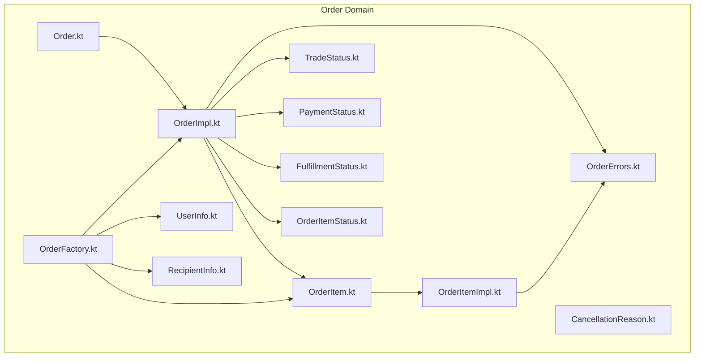
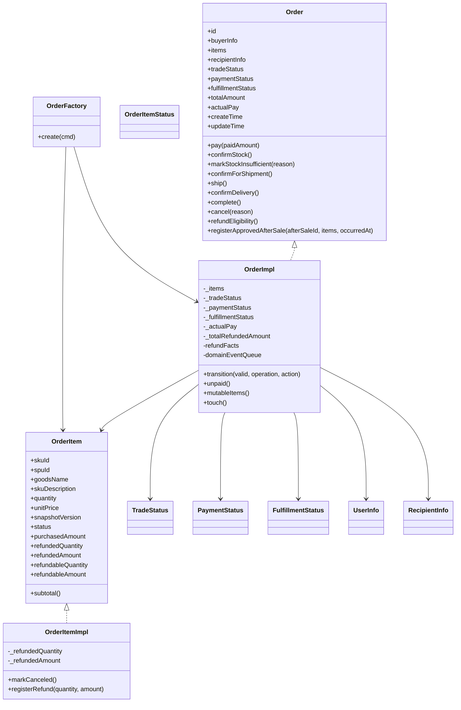
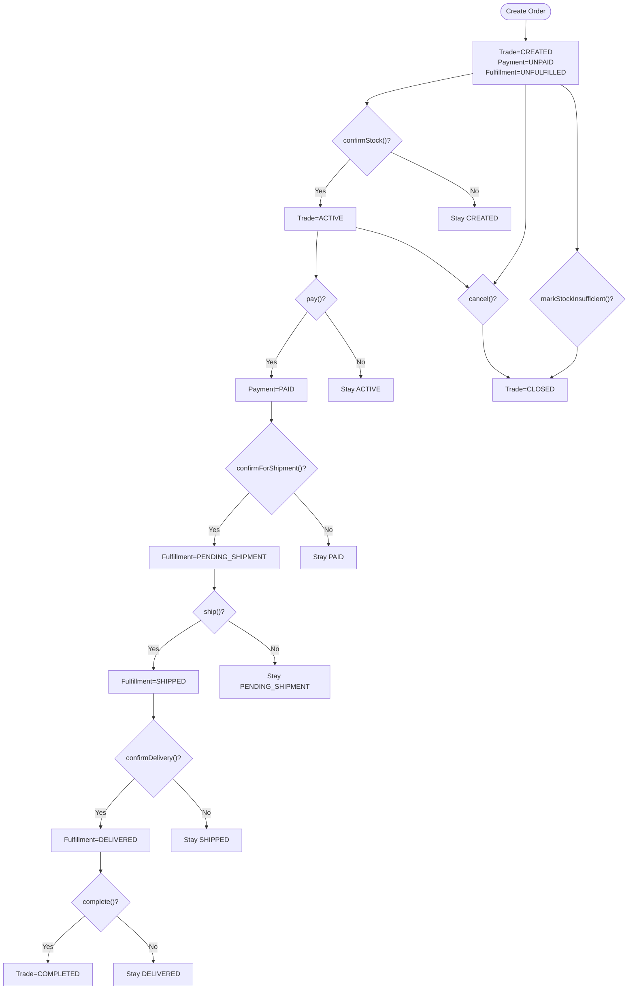
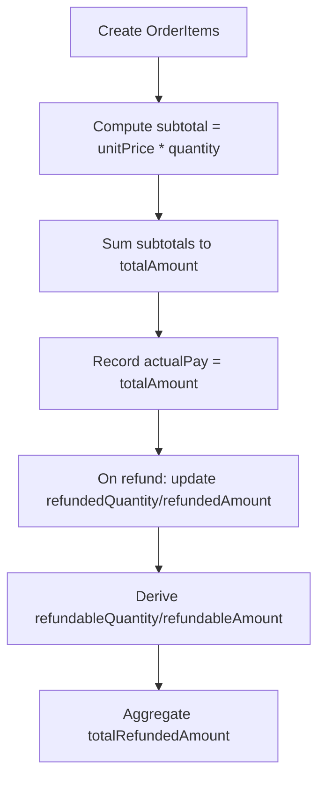
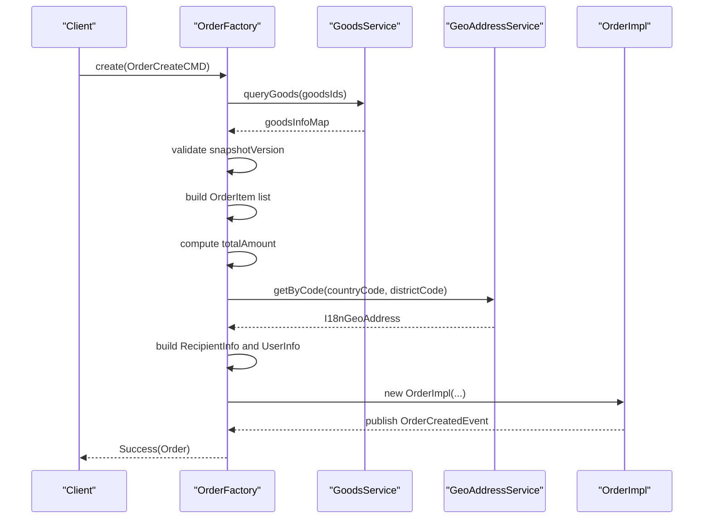
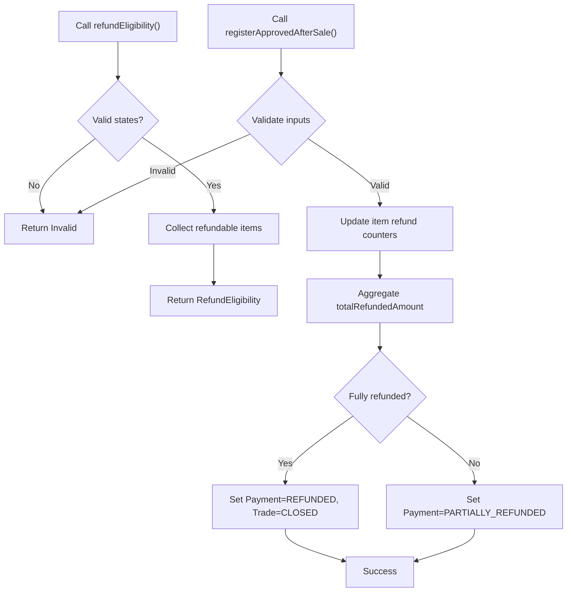
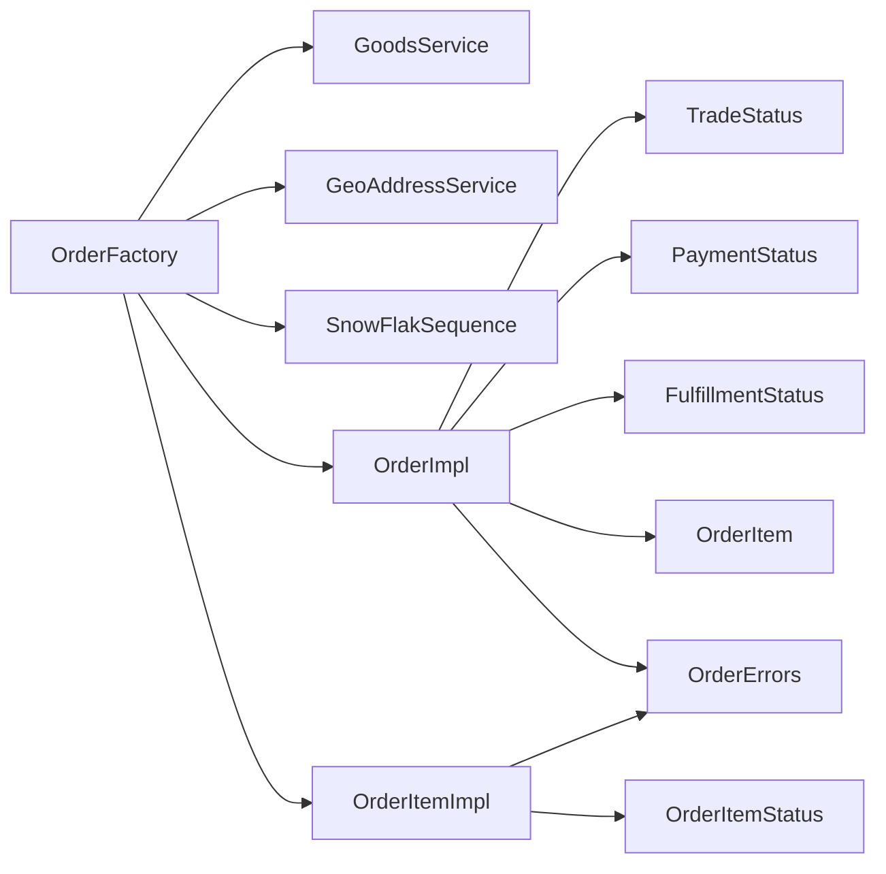

# Order Aggregate

<cite>
**Referenced Files in This Document**
- [Order.kt](file://j-store-order/src/main/kotlin/com/jstore/order/domain/order/Order.kt)
- [OrderImpl.kt](file://j-store-order/src/main/kotlin/com/jstore/order/domain/order/OrderImpl.kt)
- [OrderItem.kt](file://j-store-order/src/main/kotlin/com/jstore/order/domain/order/OrderItem.kt)
- [OrderItemImpl.kt](file://j-store-order/src/main/kotlin/com/jstore/order/domain/order/OrderItemImpl.kt)
- [TradeStatus.kt](file://j-store-order/src/main/kotlin/com/jstore/order/domain/order/TradeStatus.kt)
- [PaymentStatus.kt](file://j-store-order/src/main/kotlin/com/jstore/order/domain/order/PaymentStatus.kt)
- [FulfillmentStatus.kt](file://j-store-order/src/main/kotlin/com/jstore/order/domain/order/FulfillmentStatus.kt)
- [OrderItemStatus.kt](file://j-store-order/src/main/kotlin/com/jstore/order/domain/order/OrderItemStatus.kt)
- [UserInfo.kt](file://j-store-order/src/main/kotlin/com/jstore/order/domain/order/UserInfo.kt)
- [RecipientInfo.kt](file://j-store-order/src/main/kotlin/com/jstore/order/domain/order/RecipientInfo.kt)
- [OrderFactory.kt](file://j-store-order/src/main/kotlin/com/jstore/order/domain/order/OrderFactory.kt)
- [CancellationReason.kt](file://j-store-order/src/main/kotlin/com/jstore/order/domain/order/CancellationReason.kt)
- [OrderErrors.kt](file://j-store-order/src/main/kotlin/com/jstore/order/domain/order/OrderErrors.kt)
</cite>

## Table of Contents
1. Introduction
2. Project Structure
3. Core Components
4. Architecture Overview
5. Detailed Component Analysis
6. Dependency Analysis
7. Performance Considerations
8. Troubleshooting Guide
9. Conclusion

## Introduction
This document explains the Order aggregate, the core business entity for order management. It covers the rich domain model (buyer information, order items, recipient details), and the multi-dimensional status system where trade, payment, and fulfillment statuses evolve independently. It also documents the complete lifecycle from creation to completion, including state transitions, business rules, validation logic, and key operations such as pay(), confirmStock(), confirmForShipment(), ship(), confirmDelivery(), complete(), and cancel(). Pricing calculations and total amount computations are explained alongside the relationship between orders and their items.

## Project Structure
The Order aggregate resides in the order module under the domain package. The interface defines the aggregate contract; the implementation encapsulates state transitions and business rules. Value objects represent buyer and recipient information. A factory constructs valid initial states by resolving cross-context dependencies (goods and geo address).

**Diagram sources**
- [Order.kt:1-69](file://j-store-order/src/main/kotlin/com/jstore/order/domain/order/Order.kt#L1-L69)
- [OrderImpl.kt:1-71](file://j-store-order/src/main/kotlin/com/jstore/order/domain/order/OrderImpl.kt#L1-L71)
- [OrderItem.kt:1-29](file://j-store-order/src/main/kotlin/com/jstore/order/domain/order/OrderItem.kt#L1-L29)
- [OrderItemImpl.kt:1-42](file://j-store-order/src/main/kotlin/com/jstore/order/domain/order/OrderItemImpl.kt#L1-L42)
- [OrderFactory.kt:1-119](file://j-store-order/src/main/kotlin/com/jstore/order/domain/order/OrderFactory.kt#L1-L119)
- [TradeStatus.kt:1-4](file://j-store-order/src/main/kotlin/com/jstore/order/domain/order/TradeStatus.kt#L1-L4)
- [PaymentStatus.kt:1-4](file://j-store-order/src/main/kotlin/com/jstore/order/domain/order/PaymentStatus.kt#L1-L4)
- [FulfillmentStatus.kt:1-4](file://j-store-order/src/main/kotlin/com/jstore/order/domain/order/FulfillmentStatus.kt#L1-L4)
- [OrderItemStatus.kt:1-6](file://j-store-order/src/main/kotlin/com/jstore/order/domain/order/OrderItemStatus.kt#L1-L6)
- [UserInfo.kt:1-18](file://j-store-order/src/main/kotlin/com/jstore/order/domain/order/UserInfo.kt#L1-L18)
- [RecipientInfo.kt:1-26](file://j-store-order/src/main/kotlin/com/jstore/order/domain/order/RecipientInfo.kt#L1-L26)
- [CancellationReason.kt:1-24](file://j-store-order/src/main/kotlin/com/jstore/order/domain/order/CancellationReason.kt#L1-L24)
- [OrderErrors.kt:1-24](file://j-store-order/src/main/kotlin/com/jstore/order/domain/order/OrderErrors.kt#L1-L24)

**Section sources**
- [Order.kt:1-69](file://j-store-order/src/main/kotlin/com/jstore/order/domain/order/Order.kt#L1-L69)
- [OrderImpl.kt:1-71](file://j-store-order/src/main/kotlin/com/jstore/order/domain/order/OrderImpl.kt#L1-L71)
- [OrderFactory.kt:1-119](file://j-store-order/src/main/kotlin/com/jstore/order/domain/order/OrderFactory.kt#L1-L119)

## Core Components
- Order interface: Defines the aggregate’s identity, read-only views (items, buyer, recipient), three parallel status dimensions (trade, payment, fulfillment), totals, timestamps, and all domain operations.
- OrderImpl: Implements state transitions, validations, event publishing hooks, refund eligibility, and after-sale registration.
- OrderItem and OrderItemImpl: Represent line items with pricing snapshots, quantities, and per-item refund tracking.
- Status enums: TradeStatus, PaymentStatus, FulfillmentStatus, and OrderItemStatus define independent dimensions.
- Value objects: UserInfo and RecipientInfo capture immutable buyer and shipping data.
- OrderFactory: Creates a valid initial Order with goods snapshot verification and address resolution.
- CancellationReason and OrderErrors: Encapsulate cancellation metadata and error definitions used across the aggregate.

Key responsibilities:
- Maintain consistent state across three status dimensions.
- Enforce business rules via guarded transitions.
- Compute totals and refundable amounts based on item snapshots and refunds.
- Publish domain events at key milestones (creation, payment, shipment, completion, cancellation).

**Section sources**
- [Order.kt:1-69](file://j-store-order/src/main/kotlin/com/jstore/order/domain/order/Order.kt#L1-L69)
- [OrderImpl.kt:1-71](file://j-store-order/src/main/kotlin/com/jstore/order/domain/order/OrderImpl.kt#L1-L71)
- [OrderItem.kt:1-29](file://j-store-order/src/main/kotlin/com/jstore/order/domain/order/OrderItem.kt#L1-L29)
- [OrderItemImpl.kt:1-42](file://j-store-order/src/main/kotlin/com/jstore/order/domain/order/OrderItemImpl.kt#L1-L42)
- [TradeStatus.kt:1-4](file://j-store-order/src/main/kotlin/com/jstore/order/domain/order/TradeStatus.kt#L1-L4)
- [PaymentStatus.kt:1-4](file://j-store-order/src/main/kotlin/com/jstore/order/domain/order/PaymentStatus.kt#L1-L4)
- [FulfillmentStatus.kt:1-4](file://j-store-order/src/main/kotlin/com/jstore/order/domain/order/FulfillmentStatus.kt#L1-L4)
- [OrderItemStatus.kt:1-6](file://j-store-order/src/main/kotlin/com/jstore/order/domain/order/OrderItemStatus.kt#L1-L6)
- [UserInfo.kt:1-18](file://j-store-order/src/main/kotlin/com/jstore/order/domain/order/UserInfo.kt#L1-L18)
- [RecipientInfo.kt:1-26](file://j-store-order/src/main/kotlin/com/jstore/order/domain/order/RecipientInfo.kt#L1-L26)
- [OrderFactory.kt:1-119](file://j-store-order/src/main/kotlin/com/jstore/order/domain/order/OrderFactory.kt#L1-L119)
- [CancellationReason.kt:1-24](file://j-store-order/src/main/kotlin/com/jstore/order/domain/order/CancellationReason.kt#L1-L24)
- [OrderErrors.kt:1-24](file://j-store-order/src/main/kotlin/com/jstore/order/domain/order/OrderErrors.kt#L1-L24)

## Architecture Overview
The Order aggregate is designed around a clear separation of concerns:
- Interface vs Implementation: Order exposes behavior and read-only views; OrderImpl holds mutable state and enforces transitions.
- Value Objects: UserInfo and RecipientInfo are immutable and validate constraints at construction.
- Factory Pattern: OrderFactory orchestrates cross-context reads (goods and geo address) and builds a valid initial state, keeping the aggregate free of infrastructure concerns.
- Multi-dimensional Status: Trade, payment, and fulfillment statuses evolve independently but are coordinated by transition guards.

**Diagram sources**
- [Order.kt:1-69](file://j-store-order/src/main/kotlin/com/jstore/order/domain/order/Order.kt#L1-L69)
- [OrderImpl.kt:1-71](file://j-store-order/src/main/kotlin/com/jstore/order/domain/order/OrderImpl.kt#L1-L71)
- [OrderItem.kt:1-29](file://j-store-order/src/main/kotlin/com/jstore/order/domain/order/OrderItem.kt#L1-L29)
- [OrderItemImpl.kt:1-42](file://j-store-order/src/main/kotlin/com/jstore/order/domain/order/OrderItemImpl.kt#L1-L42)
- [OrderFactory.kt:1-119](file://j-store-order/src/main/kotlin/com/jstore/order/domain/order/OrderFactory.kt#L1-L119)
- [TradeStatus.kt:1-4](file://j-store-order/src/main/kotlin/com/jstore/order/domain/order/TradeStatus.kt#L1-L4)
- [PaymentStatus.kt:1-4](file://j-store-order/src/main/kotlin/com/jstore/order/domain/order/PaymentStatus.kt#L1-L4)
- [FulfillmentStatus.kt:1-4](file://j-store-order/src/main/kotlin/com/jstore/order/domain/order/FulfillmentStatus.kt#L1-L4)
- [OrderItemStatus.kt:1-6](file://j-store-order/src/main/kotlin/com/jstore/order/domain/order/OrderItemStatus.kt#L1-L6)
- [UserInfo.kt:1-18](file://j-store-order/src/main/kotlin/com/jstore/order/domain/order/UserInfo.kt#L1-L18)
- [RecipientInfo.kt:1-26](file://j-store-order/src/main/kotlin/com/jstore/order/domain/order/RecipientInfo.kt#L1-L26)

## Detailed Component Analysis

### Order Lifecycle and State Transitions
The lifecycle spans creation through completion or cancellation, with independent evolution of trade, payment, and fulfillment statuses.

- Creation: OrderFactory creates an order with CREATED trade status, UNPAID payment status, and UNFULFILLED fulfillment status. Total amount equals sum of item subtotals.
- Stock confirmation: confirmStock() moves trade status from CREATED to ACTIVE when unpaid.
- Payment: pay() requires ACTIVE trade and UNPAID payment; sets payment to PAID and records actual paid amount.
- Shipment preparation: confirmForShipment() requires PAID payment and UNFULFILLED fulfillment; sets PENDING_SHIPMENT.
- Shipping: ship() requires PENDING_SHIPMENT; sets SHIPPED and updates item statuses to SHIPPING.
- Delivery confirmation: confirmDelivery() requires SHIPPED; sets DELIVERED and updates item statuses to SHIPPING_FINISHED.
- Completion: complete() requires DELIVERED; sets trade status COMPLETED.
- Cancellation: cancel() allowed when CREATED or ACTIVE and unpaid; sets CLOSED and marks items canceled.
- Stock insufficient: markStockInsufficient() cancels order when CREATED and unpaid.

**Diagram sources**
- [OrderImpl.kt:39-46](file://j-store-order/src/main/kotlin/com/jstore/order/domain/order/OrderImpl.kt#L39-L46)
- [Order.kt:43-64](file://j-store-order/src/main/kotlin/com/jstore/order/domain/order/Order.kt#L43-L64)
- [TradeStatus.kt:1-4](file://j-store-order/src/main/kotlin/com/jstore/order/domain/order/TradeStatus.kt#L1-L4)
- [PaymentStatus.kt:1-4](file://j-store-order/src/main/kotlin/com/jstore/order/domain/order/PaymentStatus.kt#L1-L4)
- [FulfillmentStatus.kt:1-4](file://j-store-order/src/main/kotlin/com/jstore/order/domain/order/FulfillmentStatus.kt#L1-L4)

**Section sources**
- [OrderImpl.kt:39-46](file://j-store-order/src/main/kotlin/com/jstore/order/domain/order/OrderImpl.kt#L39-L46)
- [Order.kt:43-64](file://j-store-order/src/main/kotlin/com/jstore/order/domain/order/Order.kt#L43-L64)

### Multi-Dimensional Status System
- TradeStatus: CREATED → ACTIVE → COMPLETED or CLOSED.
- PaymentStatus: UNPAID → PAID → PARTIALLY_REFUNDED or REFUNDED.
- FulfillmentStatus: UNFULFILLED → PENDING_SHIPMENT → SHIPPED → DELIVERED.
- OrderItemStatus: NONE → WAIT_SHIPPING → SHIPPING → SHIPPING_ERROR → SHIPPING_FINISHED or CANCELED.

Transitions are enforced by guard conditions in each operation. For example, ship() requires PAID payment and PENDING_SHIPMENT fulfillment.

**Section sources**
- [TradeStatus.kt:1-4](file://j-store-order/src/main/kotlin/com/jstore/order/domain/order/TradeStatus.kt#L1-L4)
- [PaymentStatus.kt:1-4](file://j-store-order/src/main/kotlin/com/jstore/order/domain/order/PaymentStatus.kt#L1-L4)
- [FulfillmentStatus.kt:1-4](file://j-store-order/src/main/kotlin/com/jstore/order/domain/order/FulfillmentStatus.kt#L1-L4)
- [OrderItemStatus.kt:1-6](file://j-store-order/src/main/kotlin/com/jstore/order/domain/order/OrderItemStatus.kt#L1-L6)
- [OrderImpl.kt:42-45](file://j-store-order/src/main/kotlin/com/jstore/order/domain/order/OrderImpl.kt#L42-L45)

### Order Items and Pricing Calculations
- Each OrderItem captures a snapshot of product information (SPU/SKU IDs, names, attributes) and unit price at purchase time.
- purchasedAmount equals unitPrice × quantity.
- Refund tracking per item maintains refundedQuantity and refundedAmount; refundableQuantity and refundableAmount are derived.
- Order.totalAmount is computed as the sum of item subtotals during creation.
- Order.actualPay reflects the paid amount recorded at pay().
- Order.totalRefundedAmount aggregates per-item refunds and constrains payment status transitions.

**Diagram sources**
- [OrderItem.kt:20-28](file://j-store-order/src/main/kotlin/com/jstore/order/domain/order/OrderItem.kt#L20-L28)
- [OrderItemImpl.kt:21-41](file://j-store-order/src/main/kotlin/com/jstore/order/domain/order/OrderItemImpl.kt#L21-L41)
- [OrderFactory.kt:62-63](file://j-store-order/src/main/kotlin/com/jstore/order/domain/order/OrderFactory.kt#L62-L63)
- [OrderImpl.kt:37](file://j-store-order/src/main/kotlin/com/jstore/order/domain/order/OrderImpl.kt#L37)

**Section sources**
- [OrderItem.kt:20-28](file://j-store-order/src/main/kotlin/com/jstore/order/domain/order/OrderItem.kt#L20-L28)
- [OrderItemImpl.kt:21-41](file://j-store-order/src/main/kotlin/com/jstore/order/domain/order/OrderItemImpl.kt#L21-L41)
- [OrderFactory.kt:62-63](file://j-store-order/src/main/kotlin/com/jstore/order/domain/order/OrderFactory.kt#L62-L63)
- [OrderImpl.kt:37](file://j-store-order/src/main/kotlin/com/jstore/order/domain/order/OrderImpl.kt#L37)

### Buyer and Recipient Information
- UserInfo: Immutable value object containing buyer uid and optional phone/name.
- RecipientInfo: Immutable value object capturing consignee name, contact info, shipping address, and detail address.

These values are set at creation and remain unchanged throughout the order lifecycle.

**Section sources**
- [UserInfo.kt:1-18](file://j-store-order/src/main/kotlin/com/jstore/order/domain/order/UserInfo.kt#L1-L18)
- [RecipientInfo.kt:1-26](file://j-store-order/src/main/kotlin/com/jstore/order/domain/order/RecipientInfo.kt#L1-L26)
- [OrderFactory.kt:86-101](file://j-store-order/src/main/kotlin/com/jstore/order/domain/order/OrderFactory.kt#L86-L101)

### Order Creation Flow
OrderFactory coordinates cross-context reads and validates snapshots before building the aggregate:
1. Resolve goods by SPU/SKU IDs.
2. Validate snapshot version to prevent stale data usage.
3. Build OrderItem instances with snapshot prices and descriptions.
4. Compute totalAmount from item subtotals.
5. Resolve shipping address using geo service.
6. Construct RecipientInfo and UserInfo.
7. Create OrderImpl with initial statuses and publish creation event.

**Diagram sources**
- [OrderFactory.kt:33-108](file://j-store-order/src/main/kotlin/com/jstore/order/domain/order/OrderFactory.kt#L33-L108)

**Section sources**
- [OrderFactory.kt:33-108](file://j-store-order/src/main/kotlin/com/jstore/order/domain/order/OrderFactory.kt#L33-L108)

### Key Operations and Business Rules
- confirmStock(): Allowed only when trade status is CREATED and unpaid; transitions to ACTIVE.
- markStockInsufficient(reason): Allowed only when CREATED and unpaid; transitions to CLOSED and publishes cancellation event.
- pay(paidAmount): Allowed only when ACTIVE and UNPAID; sets payment to PAID and records actualPay.
- confirmForShipment(): Allowed only when ACTIVE, PAID, and UNFULFILLED; transitions to PENDING_SHIPMENT.
- ship(): Allowed only when ACTIVE, PAID, and PENDING_SHIPMENT; transitions to SHIPPED and updates item statuses.
- confirmDelivery(): Allowed only when ACTIVE, PAID, and SHIPPED; transitions to DELIVERED and updates item statuses.
- complete(): Allowed only when ACTIVE, PAID, and DELIVERED; transitions to COMPLETED.
- cancel(reason): Allowed only when CREATED or ACTIVE and unpaid; transitions to CLOSED and marks items canceled.

All transitions use a guarded transition helper that returns failure with ILLEGAL_STATE when invalid.

**Section sources**
- [OrderImpl.kt:39-46](file://j-store-order/src/main/kotlin/com/jstore/order/domain/order/OrderImpl.kt#L39-L46)
- [OrderErrors.kt:8](file://j-store-order/src/main/kotlin/com/jstore/order/domain/order/OrderErrors.kt#L8)

### Refund Eligibility and After-Sale Registration
- refundEligibility(): Returns eligibility if payment is PAID or PARTIALLY_REFUNDED, trade is ACTIVE or COMPLETED, and fulfillment is not closed; lists refundable items.
- registerApprovedAfterSale(afterSaleId, items, occurredAt): Validates uniqueness of after-sale id, item references, quantities, and amounts; updates per-item refund counters and aggregate totals; transitions payment status to PARTIALLY_REFUNDED or REFUNDED and closes trade when fully refunded.

**Diagram sources**
- [OrderImpl.kt:48-65](file://j-store-order/src/main/kotlin/com/jstore/order/domain/order/OrderImpl.kt#L48-L65)

**Section sources**
- [OrderImpl.kt:48-65](file://j-store-order/src/main/kotlin/com/jstore/order/domain/order/OrderImpl.kt#L48-L65)

## Dependency Analysis
- OrderImpl depends on status enums and OrderItem for state and pricing.
- OrderFactory depends on external services (GoodsService, GeoAddressService) and sequence generator to produce identifiers.
- OrderItemImpl depends on Price arithmetic and OrderItemStatus for lifecycle.
- Error definitions centralize business error codes and messages.

**Diagram sources**
- [OrderFactory.kt:27-31](file://j-store-order/src/main/kotlin/com/jstore/order/domain/order/OrderFactory.kt#L27-L31)
- [OrderImpl.kt:16-30](file://j-store-order/src/main/kotlin/com/jstore/order/domain/order/OrderImpl.kt#L16-L30)
- [OrderItemImpl.kt:8-20](file://j-store-order/src/main/kotlin/com/jstore/order/domain/order/OrderItemImpl.kt#L8-L20)
- [OrderErrors.kt:5-23](file://j-store-order/src/main/kotlin/com/jstore/order/domain/order/OrderErrors.kt#L5-L23)

**Section sources**
- [OrderFactory.kt:27-31](file://j-store-order/src/main/kotlin/com/jstore/order/domain/order/OrderFactory.kt#L27-L31)
- [OrderImpl.kt:16-30](file://j-store-order/src/main/kotlin/com/jstore/order/domain/order/OrderImpl.kt#L16-L30)
- [OrderItemImpl.kt:8-20](file://j-store-order/src/main/kotlin/com/jstore/order/domain/order/OrderItemImpl.kt#L8-L20)
- [OrderErrors.kt:5-23](file://j-store-order/src/main/kotlin/com/jstore/order/domain/order/OrderErrors.kt#L5-L23)

## Performance Considerations
- Snapshot-based pricing ensures stable calculations even if product prices change later.
- Minimal mutable state within the aggregate reduces contention; transitions are guarded and localized.
- Aggregating totals and refund amounts avoids repeated recomputation.
- Event publishing occurs at boundaries, enabling asynchronous processing without blocking core transitions.

[No sources needed since this section provides general guidance]

## Troubleshooting Guide
Common errors and their triggers:
- ILLEGAL_STATE: Occurs when an operation is invoked in an invalid state (e.g., paying an already paid order).
- SNAPSHOT_VERSION_MISMATCH: Occurs when item snapshot versions differ from current goods data during creation.
- PAY_AMOUNT_INVALID: Occurs when payment amount is invalid.
- REFUND_PROJECTION_INVALID: Occurs when refund eligibility or after-sale registration fails due to invalid states or quantities.
- ITEMS_EMPTY: Occurs when creating an order with no items.
- BUYER_INVALID / CONTRACT_INFO_INVALID: Occurs when buyer or contact info is invalid.
- CANCEL_REASON_INVALID: Occurs when cancellation reason is invalid.

Resolution steps:
- Verify current status dimensions before invoking operations.
- Ensure snapshot versions match goods data at creation time.
- Validate input parameters (quantities, amounts, reasons).
- Check refund eligibility before attempting after-sale registration.

**Section sources**
- [OrderErrors.kt:5-23](file://j-store-order/src/main/kotlin/com/jstore/order/domain/order/OrderErrors.kt#L5-L23)
- [OrderImpl.kt:39-46](file://j-store-order/src/main/kotlin/com/jstore/order/domain/order/OrderImpl.kt#L39-L46)
- [OrderFactory.kt:44-48](file://j-store-order/src/main/kotlin/com/jstore/order/domain/order/OrderFactory.kt#L44-L48)

## Conclusion
The Order aggregate models a robust, multi-dimensional order lifecycle with strong invariants and clear transitions. By separating concerns across interface, implementation, value objects, and factory, it maintains domain integrity while supporting complex operations like payments, shipments, deliveries, cancellations, and refunds. The snapshot-based approach ensures pricing stability, and the guarded transitions enforce business rules consistently.

[No sources needed since this section summarizes without analyzing specific files]