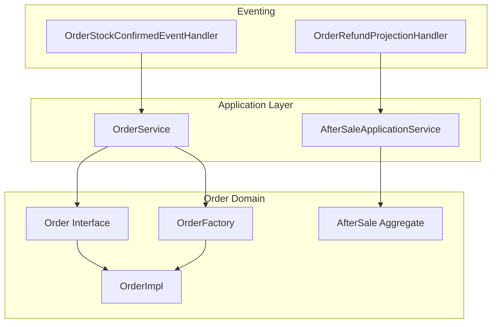
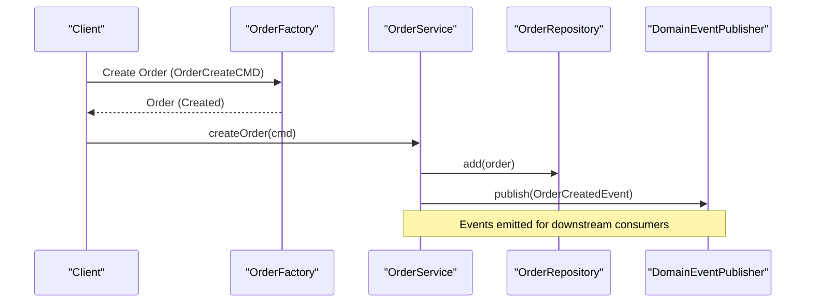
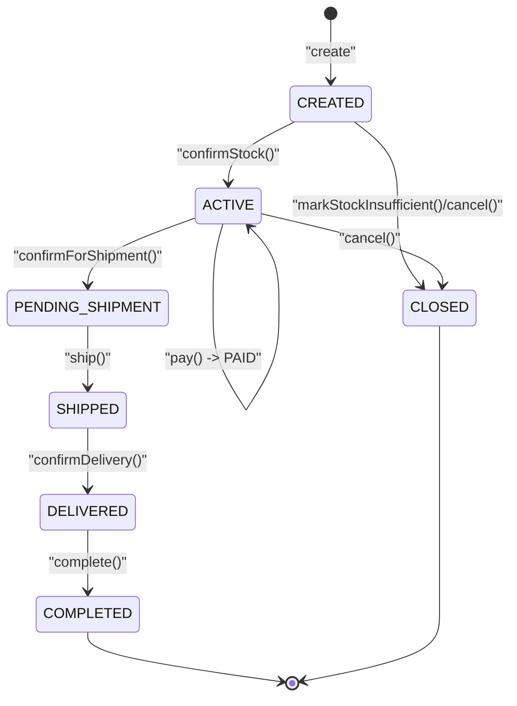
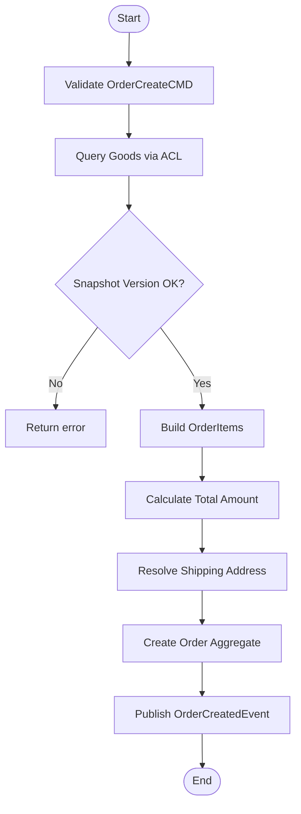
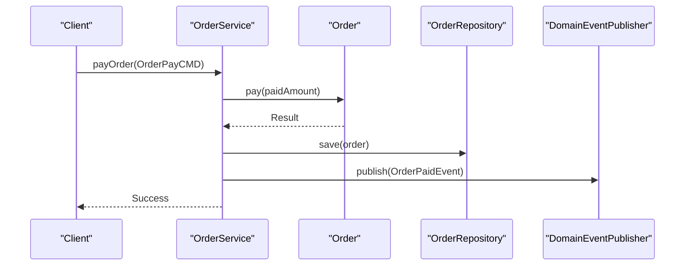
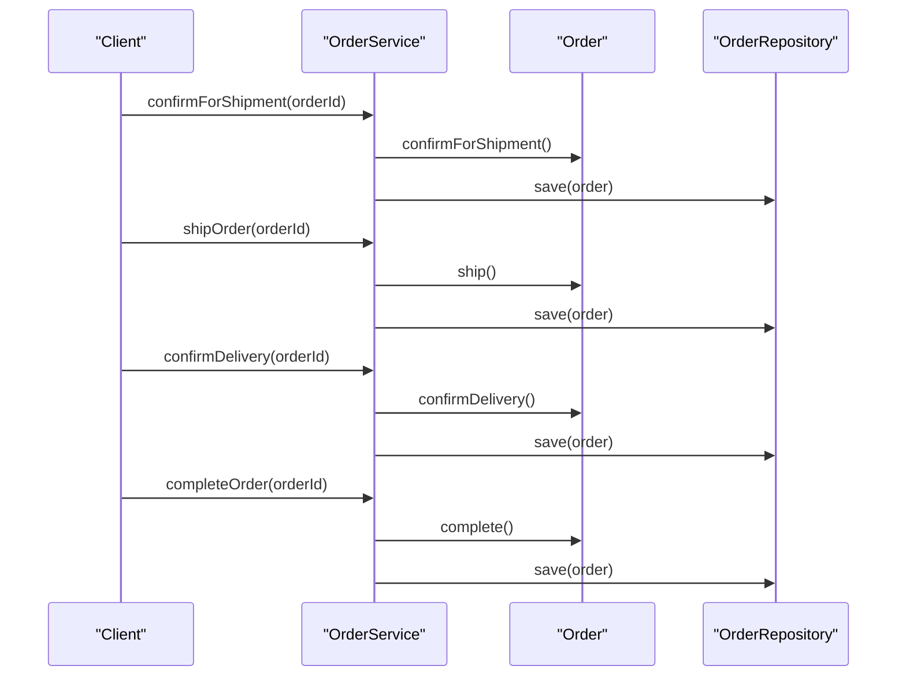
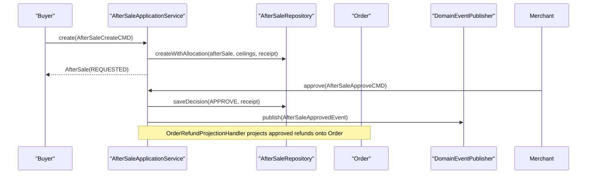
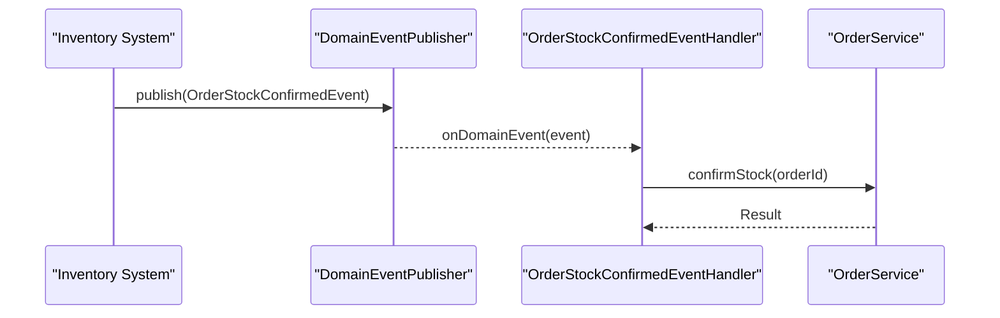
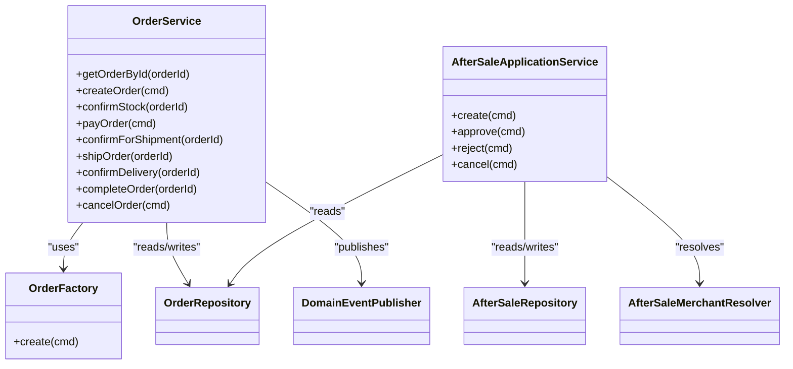

# Order Module

<cite>
**Referenced Files in This Document**
- [Order.kt](file://j-store-order/src/main/kotlin/com/jstore/order/domain/order/Order.kt)
- [OrderImpl.kt](file://j-store-order/src/main/kotlin/com/jstore/order/domain/order/OrderImpl.kt)
- [TradeStatus.kt](file://j-store-order/src/main/kotlin/com/jstore/order/domain/order/TradeStatus.kt)
- [PaymentStatus.kt](file://j-store-order/src/main/kotlin/com/jstore/order/domain/order/PaymentStatus.kt)
- [FulfillmentStatus.kt](file://j-store-order/src/main/kotlin/com/jstore/order/domain/order/FulfillmentStatus.kt)
- [OrderFactory.kt](file://j-store-order/src/main/kotlin/com/jstore/order/domain/order/OrderFactory.kt)
- [OrderService.kt](file://j-store-order/src/main/kotlin/com/jstore/order/service/OrderService.kt)
- [AfterSale.kt](file://j-store-order/src/main/kotlin/com/jstore/order/domain/aftersale/AfterSale.kt)
- [AfterSaleApplicationService.kt](file://j-store-order/src/main/kotlin/com/jstore/order/service/AfterSaleApplicationService.kt)
- [OrderStockEventHandler.kt](file://j-store-order/src/main/kotlin/com/jstore/order/service/OrderStockEventHandler.kt)
- [OrderRefundProjectionHandler.kt](file://j-store-order/src/main/kotlin/com/jstore/order/service/OrderRefundProjectionHandler.kt)
</cite>

## Table of Contents
1. [Introduction](#introduction)
2. [Project Structure](#project-structure)
3. [Core Components](#core-components)
4. [Architecture Overview](#architecture-overview)
5. [Detailed Component Analysis](#detailed-component-analysis)
6. [Dependency Analysis](#dependency-analysis)
7. [Performance Considerations](#performance-considerations)
8. [Troubleshooting Guide](#troubleshooting-guide)
9. [Conclusion](#conclusion)

## Introduction
This document explains the Order module that implements the order management bounded context. It covers the Order aggregate lifecycle from creation to completion, state transitions, business rules, and validation logic. It also documents after-sale processing for returns and refunds, application services orchestrating workflows, command handlers for user interactions, and integration points with goods inventory and accounting systems via domain events.

## Project Structure
The Order module is organized into domain, service (application layer), and ACL layers:
- Domain: Order aggregate, statuses, factory, and AfterSale aggregate.
- Application Services: OrderService and AfterSaleApplicationService orchestrate use cases.
- Event Handlers: Listen to cross-context events (e.g., stock confirmation) and trigger domain operations.

**Diagram sources**
- [Order.kt:12-68](file://j-store-order/src/main/kotlin/com/jstore/order/domain/order/Order.kt#L12-L68)
- [OrderImpl.kt:16-70](file://j-store-order/src/main/kotlin/com/jstore/order/domain/order/OrderImpl.kt#L16-L70)
- [OrderFactory.kt:27-108](file://j-store-order/src/main/kotlin/com/jstore/order/domain/order/OrderFactory.kt#L27-L108)
- [OrderService.kt:25-131](file://j-store-order/src/main/kotlin/com/jstore/order/service/OrderService.kt#L25-L131)
- [AfterSale.kt:10-18](file://j-store-order/src/main/kotlin/com/jstore/order/domain/aftersale/AfterSale.kt#L10-L18)
- [AfterSaleApplicationService.kt:13-41](file://j-store-order/src/main/kotlin/com/jstore/order/service/AfterSaleApplicationService.kt#L13-L41)
- [OrderStockEventHandler.kt:13-28](file://j-store-order/src/main/kotlin/com/jstore/order/service/OrderStockEventHandler.kt#L13-L28)
- [OrderRefundProjectionHandler.kt:8-11](file://j-store-order/src/main/kotlin/com/jstore/order/service/OrderRefundProjectionHandler.kt#L8-L11)

**Section sources**
- [Order.kt:12-68](file://j-store-order/src/main/kotlin/com/jstore/order/domain/order/Order.kt#L12-L68)
- [OrderImpl.kt:16-70](file://j-store-order/src/main/kotlin/com/jstore/order/domain/order/OrderImpl.kt#L16-L70)
- [OrderFactory.kt:27-108](file://j-store-order/src/main/kotlin/com/jstore/order/domain/order/OrderFactory.kt#L27-L108)
- [OrderService.kt:25-131](file://j-store-order/src/main/kotlin/com/jstore/order/service/OrderService.kt#L25-L131)
- [AfterSale.kt:10-18](file://j-store-order/src/main/kotlin/com/jstore/order/domain/aftersale/AfterSale.kt#L10-L18)
- [AfterSaleApplicationService.kt:13-41](file://j-store-order/src/main/kotlin/com/jstore/order/service/AfterSaleApplicationService.kt#L13-L41)
- [OrderStockEventHandler.kt:13-28](file://j-store-order/src/main/kotlin/com/jstore/order/service/OrderStockEventHandler.kt#L13-L28)
- [OrderRefundProjectionHandler.kt:8-11](file://j-store-order/src/main/kotlin/com/jstore/order/service/OrderRefundProjectionHandler.kt#L8-L11)

## Core Components
- Order aggregate interface defines the contract for trade, payment, fulfillment states, refund eligibility, and approved after-sale registration.
- OrderImpl implements state transitions, validations, and event publishing.
- OrderFactory constructs a valid initial Order by validating snapshots and building value objects.
- OrderService orchestrates commands: create, pay, confirm stock, ship, deliver, complete, cancel.
- AfterSale aggregate models return/refund requests with approval/rejection/cancel flows.
- AfterSaleApplicationService enforces idempotency, authorization, merchant resolution, and allocation ceilings.
- Event handlers integrate with external domains (inventory, accounting).

**Section sources**
- [Order.kt:12-68](file://j-store-order/src/main/kotlin/com/jstore/order/domain/order/Order.kt#L12-L68)
- [OrderImpl.kt:16-70](file://j-store-order/src/main/kotlin/com/jstore/order/domain/order/OrderImpl.kt#L16-L70)
- [OrderFactory.kt:27-108](file://j-store-order/src/main/kotlin/com/jstore/order/domain/order/OrderFactory.kt#L27-L108)
- [OrderService.kt:25-131](file://j-store-order/src/main/kotlin/com/jstore/order/service/OrderService.kt#L25-L131)
- [AfterSale.kt:10-18](file://j-store-order/src/main/kotlin/com/jstore/order/domain/aftersale/AfterSale.kt#L10-L18)
- [AfterSaleApplicationService.kt:13-41](file://j-store-order/src/main/kotlin/com/jstore/order/service/AfterSaleApplicationService.kt#L13-L41)

## Architecture Overview
The Order module follows DDD patterns:
- Aggregates encapsulate business rules and state transitions.
- Application services coordinate use cases without containing business logic.
- Domain events enable loose coupling across bounded contexts (goods/inventory, accounting).

**Diagram sources**
- [OrderFactory.kt:33-108](file://j-store-order/src/main/kotlin/com/jstore/order/domain/order/OrderFactory.kt#L33-L108)
- [OrderService.kt:44-50](file://j-store-order/src/main/kotlin/com/jstore/order/service/OrderService.kt#L44-L50)

## Detailed Component Analysis

### Order Aggregate Lifecycle and State Transitions
- States are modeled across three orthogonal dimensions:
  - TradeStatus: CREATED → ACTIVE → COMPLETED or CLOSED
  - PaymentStatus: UNPAID → PAID → PARTIALLY_REFUNDED or REFUNDED
  - FulfillmentStatus: UNFULFILLED → PENDING_SHIPMENT → SHIPPED → DELIVERED
- Key transitions:
  - confirmStock(): CREATED + UNPAID → ACTIVE
  - markStockInsufficient(): CREATED + UNPAID → CLOSED (with cancellation event)
  - pay(): ACTIVE + UNPAID → PAID (emits paid event)
  - confirmForShipment(): ACTIVE + PAID + UNFULFILLED → PENDING_SHIPMENT
  - ship(): ACTIVE + PAID + PENDING_SHIPMENT → SHIPPED (emits shipped event)
  - confirmDelivery(): ACTIVE + PAID + SHIPPED → DELIVERED
  - complete(): ACTIVE + PAID + DELIVERED → COMPLETED (emits completed event)
  - cancel(): CREATED/ACTIVE + UNPAID → CLOSED (emits cancelled event)
- Refund eligibility checks current states and item-level refundable quantities/amounts.
- Approved after-sale registration updates total refunded amount, sets payment/trade status accordingly, and records refund facts.

**Diagram sources**
- [OrderImpl.kt:39-46](file://j-store-order/src/main/kotlin/com/jstore/order/domain/order/OrderImpl.kt#L39-L46)
- [TradeStatus.kt:1-4](file://j-store-order/src/main/kotlin/com/jstore/order/domain/order/TradeStatus.kt#L1-L4)
- [PaymentStatus.kt:1-4](file://j-store-order/src/main/kotlin/com/jstore/order/domain/order/PaymentStatus.kt#L1-L4)
- [FulfillmentStatus.kt:1-4](file://j-store-order/src/main/kotlin/com/jstore/order/domain/order/FulfillmentStatus.kt#L1-L4)

**Section sources**
- [OrderImpl.kt:39-65](file://j-store-order/src/main/kotlin/com/jstore/order/domain/order/OrderImpl.kt#L39-L65)
- [Order.kt:43-68](file://j-store-order/src/main/kotlin/com/jstore/order/domain/order/Order.kt#L43-L68)

### Order Creation Flow
- OrderFactory validates SPU/SKU snapshot versions, builds OrderItem value objects, computes totals, resolves shipping address, and creates the Order aggregate.
- On creation, an OrderCreatedEvent is published for downstream processes.

**Diagram sources**
- [OrderFactory.kt:33-108](file://j-store-order/src/main/kotlin/com/jstore/order/domain/order/OrderFactory.kt#L33-L108)

**Section sources**
- [OrderFactory.kt:33-108](file://j-store-order/src/main/kotlin/com/jstore/order/domain/order/OrderFactory.kt#L33-L108)

### Payment Processing Integration
- OrderService.payOrder validates command, loads Order, invokes pay(), persists changes, and publishes payment events.
- Downstream systems (accounting) can react to payment events.

**Diagram sources**
- [OrderService.kt:73-81](file://j-store-order/src/main/kotlin/com/jstore/order/service/OrderService.kt#L73-L81)
- [OrderImpl.kt:41](file://j-store-order/src/main/kotlin/com/jstore/order/domain/order/OrderImpl.kt#L41)

**Section sources**
- [OrderService.kt:73-81](file://j-store-order/src/main/kotlin/com/jstore/order/service/OrderService.kt#L73-L81)

### Status Management and Completion
- Confirm shipment, ship, confirm delivery, and complete transitions are enforced by state guards in OrderImpl.
- Each transition may update item statuses and publish relevant events.

**Diagram sources**
- [OrderService.kt:84-117](file://j-store-order/src/main/kotlin/com/jstore/order/service/OrderService.kt#L84-L117)
- [OrderImpl.kt:42-45](file://j-store-order/src/main/kotlin/com/jstore/order/domain/order/OrderImpl.kt#L42-L45)

**Section sources**
- [OrderService.kt:84-117](file://j-store-order/src/main/kotlin/com/jstore/order/service/OrderService.kt#L84-L117)
- [OrderImpl.kt:42-45](file://j-store-order/src/main/kotlin/com/jstore/order/domain/order/OrderImpl.kt#L42-L45)

### After-Sale Processing (Returns and Refunds)
- AfterSaleApplicationService handles create, approve, reject, and cancel with idempotency keys and receipts.
- Approve triggers refund projection; reject/cancel release allocated capacity.
- Order.registerApprovedAfterSale validates refund items against refundable quantities/amounts and updates payment/trade status.

**Diagram sources**
- [AfterSaleApplicationService.kt:14-33](file://j-store-order/src/main/kotlin/com/jstore/order/service/AfterSaleApplicationService.kt#L14-L33)
- [OrderRefundProjectionHandler.kt:8-11](file://j-store-order/src/main/kotlin/com/jstore/order/service/OrderRefundProjectionHandler.kt#L8-L11)
- [OrderImpl.kt:55-65](file://j-store-order/src/main/kotlin/com/jstore/order/domain/order/OrderImpl.kt#L55-L65)

**Section sources**
- [AfterSaleApplicationService.kt:14-41](file://j-store-order/src/main/kotlin/com/jstore/order/service/AfterSaleApplicationService.kt#L14-L41)
- [OrderImpl.kt:55-65](file://j-store-order/src/main/kotlin/com/jstore/order/domain/order/OrderImpl.kt#L55-L65)

### Inventory Integration via Domain Events
- OrderStockConfirmedEventHandler listens to stock confirmation events and transitions orders to active (awaiting payment).
- This decouples inventory confirmation from order creation.

**Diagram sources**
- [OrderStockEventHandler.kt:22-27](file://j-store-order/src/main/kotlin/com/jstore/order/service/OrderStockEventHandler.kt#L22-L27)

**Section sources**
- [OrderStockEventHandler.kt:22-27](file://j-store-order/src/main/kotlin/com/jstore/order/service/OrderStockEventHandler.kt#L22-L27)

## Dependency Analysis
- OrderService depends on OrderFactory, OrderRepository, and DomainEventPublisher.
- OrderFactory depends on external ACL (GoodsService) and GeoAddressService for data enrichment during creation.
- AfterSaleApplicationService depends on AfterSaleRepository, OrderRepository, and AfterSaleMerchantResolver.
- Event handlers bridge between external events and application services.

**Diagram sources**
- [OrderService.kt:25-131](file://j-store-order/src/main/kotlin/com/jstore/order/service/OrderService.kt#L25-L131)
- [OrderFactory.kt:27-108](file://j-store-order/src/main/kotlin/com/jstore/order/domain/order/OrderFactory.kt#L27-L108)
- [AfterSaleApplicationService.kt:13-41](file://j-store-order/src/main/kotlin/com/jstore/order/service/AfterSaleApplicationService.kt#L13-L41)

**Section sources**
- [OrderService.kt:25-131](file://j-store-order/src/main/kotlin/com/jstore/order/service/OrderService.kt#L25-L131)
- [OrderFactory.kt:27-108](file://j-store-order/src/main/kotlin/com/jstore/order/domain/order/OrderFactory.kt#L27-L108)
- [AfterSaleApplicationService.kt:13-41](file://j-store-order/src/main/kotlin/com/jstore/order/service/AfterSaleApplicationService.kt#L13-L41)

## Performance Considerations
- Use idempotency keys in after-sale commands to avoid duplicate processing.
- Minimize repository calls by batching where possible (e.g., pageListByUserId).
- Keep event handlers lightweight; offload heavy work to async consumers if needed.
- Snapshot version checks prevent expensive rework due to stale product data.

[No sources needed since this section provides general guidance]

## Troubleshooting Guide
- Illegal state transitions: Ensure the order’s current states match preconditions before invoking methods like pay, ship, or complete.
- Refund eligibility failures: Verify payment and fulfillment states allow refunds and that item-level refundable quantities/amounts are sufficient.
- Idempotency conflicts: Recheck idempotency key format and digest computation for after-sale commands.
- Stock insufficient handling: Confirm that stock confirmation events are correctly published and handled.

**Section sources**
- [OrderImpl.kt:48-65](file://j-store-order/src/main/kotlin/com/jstore/order/domain/order/OrderImpl.kt#L48-L65)
- [AfterSaleApplicationService.kt:34-41](file://j-store-order/src/main/kotlin/com/jstore/order/service/AfterSaleApplicationService.kt#L34-L41)

## Conclusion
The Order module cleanly separates domain logic within aggregates, orchestrates workflows through application services, and integrates with other domains via domain events. The design supports robust state management, after-sale processing with idempotency, and scalable event-driven integrations for inventory and accounting systems.