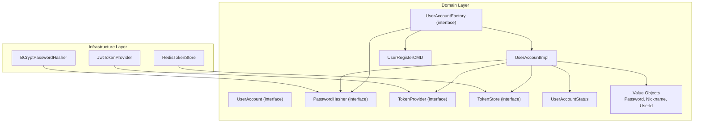
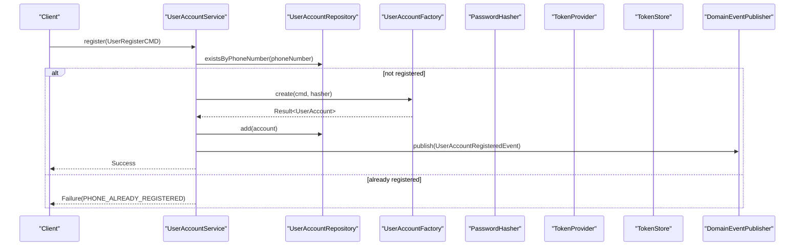
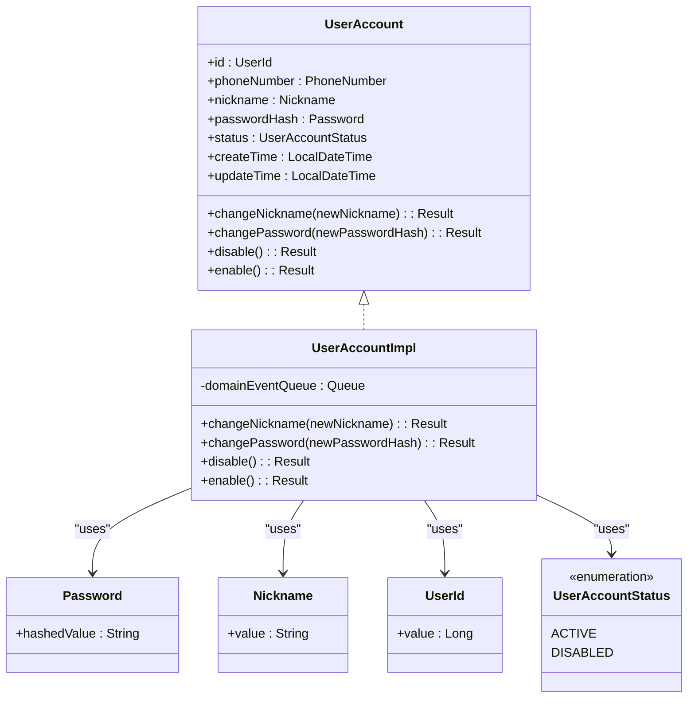
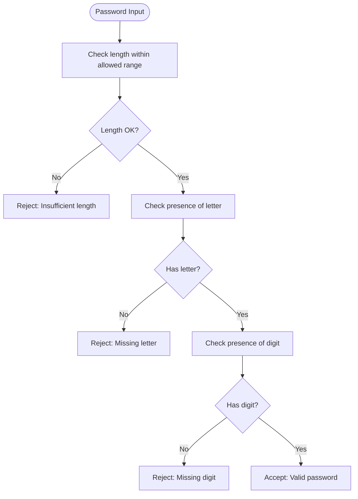
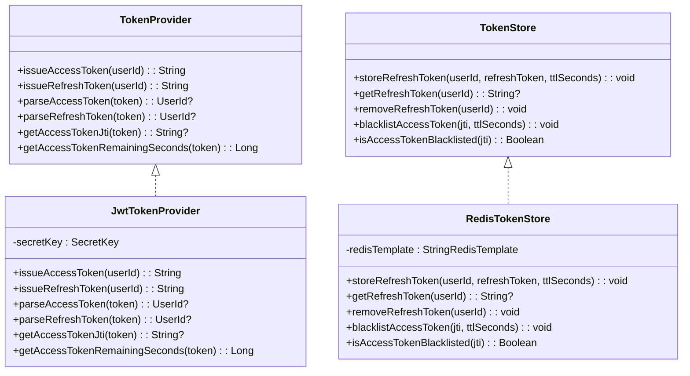
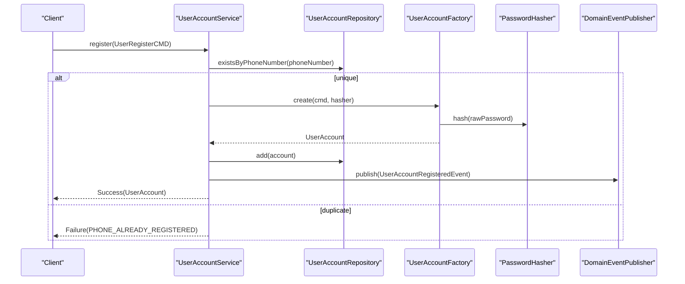
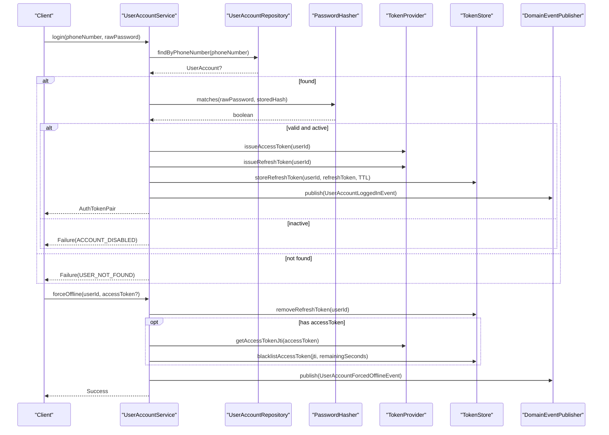
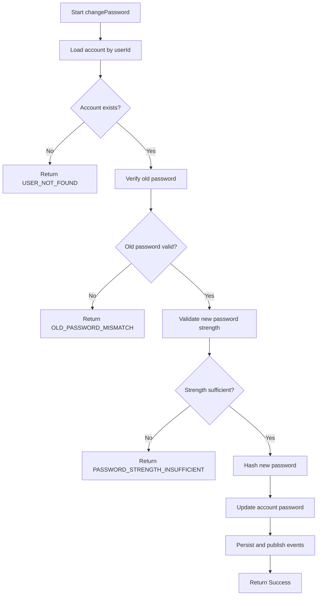
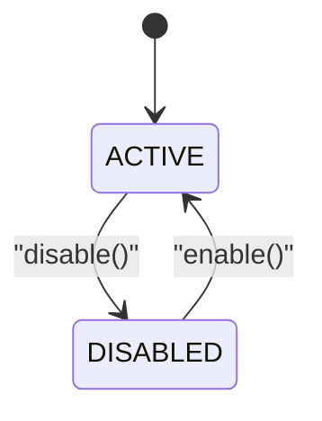
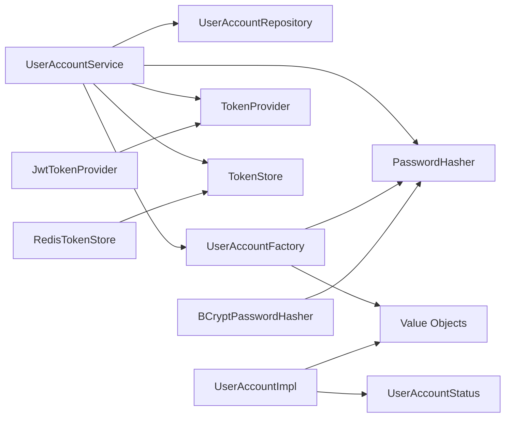

# User Module

<cite>
**Referenced Files in This Document**
- [UserAccount.kt](file://j-store-user/src/main/kotlin/com/jstore/user/domain/useraccount/UserAccount.kt)
- [UserAccountImpl.kt](file://j-store-user/src/main/kotlin/com/jstore/user/domain/useraccount/UserAccountImpl.kt)
- [Password.kt](file://j-store-user/src/main/kotlin/com/jstore/user/domain/useraccount/Password.kt)
- [PasswordHasher.kt](file://j-store-user/src/main/kotlin/com/jstore/user/domain/useraccount/PasswordHasher.kt)
- [TokenProvider.kt](file://j-store-user/src/main/kotlin/com/jstore/user/domain/useraccount/TokenProvider.kt)
- [TokenStore.kt](file://j-store-user/src/main/kotlin/com/jstore/user/domain/useraccount/TokenStore.kt)
- [UserId.kt](file://j-store-user/src/main/kotlin/com/jstore/user/domain/useraccount/UserId.kt)
- [Nickname.kt](file://j-store-user/src/main/kotlin/com/jstore/user/domain/useraccount/Nickname.kt)
- [UserAccountStatus.kt](file://j-store-user/src/main/kotlin/com/jstore/user/domain/useraccount/UserAccountStatus.kt)
- [UserRegisterCMD.kt](file://j-store-user/src/main/kotlin/com/jstore/user/domain/useraccount/command/UserRegisterCMD.kt)
- [UserAccountFactory.kt](file://j-store-user/src/main/kotlin/com/jstore/user/domain/useraccount/UserAccountFactory.kt)
- [UserAccountService.kt](file://j-store-user/src/main/kotlin/com/jstore/user/service/UserAccountService.kt)
- [BCryptPasswordHasher.kt](file://j-store-user-infrastructure/src/main/kotlin/com/jstore/user/domain/useraccount/BCryptPasswordHasher.kt)
- [JwtTokenProvider.kt](file://j-store-user-infrastructure/src/main/kotlin/com/jstore/user/domain/useraccount/JwtTokenProvider.kt)
- [RedisTokenStore.kt](file://j-store-user-infrastructure/src/main/kotlin/com/jstore/user/domain/useraccount/RedisTokenStore.kt)
</cite>

## Table of Contents
1. [Introduction](#introduction)
2. [Project Structure](#project-structure)
3. [Core Components](#core-components)
4. [Architecture Overview](#architecture-overview)
5. [Detailed Component Analysis](#detailed-component-analysis)
6. [Dependency Analysis](#dependency-analysis)
7. [Performance Considerations](#performance-considerations)
8. [Troubleshooting Guide](#troubleshooting-guide)
9. [Conclusion](#conclusion)

## Introduction
This document explains the User module responsible for user account management and authentication. It covers the UserAccount aggregate (registration, profile updates, status transitions), password security with BCrypt hashing and validation rules, token management using JWT access and refresh tokens, and operational flows such as registration, login/logout, password changes, and account enable/disable. It also highlights integration points with the authentication SDK to ensure consistent security across the application.

## Project Structure
The User module is split into a domain layer and an infrastructure layer:
- Domain layer defines aggregates, value objects, interfaces for external concerns (password hashing, token generation/storage), commands, and events.
- Infrastructure layer provides concrete implementations for password hashing (BCrypt), token provider (JWT), and token storage (Redis).

**Diagram sources**
- [UserAccount.kt](file://j-store-user/src/main/kotlin/com/jstore/user/domain/useraccount/UserAccount.kt)
- [UserAccountImpl.kt](file://j-store-user/src/main/kotlin/com/jstore/user/domain/useraccount/UserAccountImpl.kt)
- [PasswordHasher.kt](file://j-store-user/src/main/kotlin/com/jstore/user/domain/useraccount/PasswordHasher.kt)
- [TokenProvider.kt](file://j-store-user/src/main/kotlin/com/jstore/user/domain/useraccount/TokenProvider.kt)
- [TokenStore.kt](file://j-store-user/src/main/kotlin/com/jstore/user/domain/useraccount/TokenStore.kt)
- [UserRegisterCMD.kt](file://j-store-user/src/main/kotlin/com/jstore/user/domain/useraccount/command/UserRegisterCMD.kt)
- [UserAccountFactory.kt](file://j-store-user/src/main/kotlin/com/jstore/user/domain/useraccount/UserAccountFactory.kt)
- [UserAccountStatus.kt](file://j-store-user/src/main/kotlin/com/jstore/user/domain/useraccount/UserAccountStatus.kt)
- [Password.kt](file://j-store-user/src/main/kotlin/com/jstore/user/domain/useraccount/Password.kt)
- [Nickname.kt](file://j-store-user/src/main/kotlin/com/jstore/user/domain/useraccount/Nickname.kt)
- [UserId.kt](file://j-store-user/src/main/kotlin/com/jstore/user/domain/useraccount/UserId.kt)
- [BCryptPasswordHasher.kt](file://j-store-user-infrastructure/src/main/kotlin/com/jstore/user/domain/useraccount/BCryptPasswordHasher.kt)
- [JwtTokenProvider.kt](file://j-store-user-infrastructure/src/main/kotlin/com/jstore/user/domain/useraccount/JwtTokenProvider.kt)
- [RedisTokenStore.kt](file://j-store-user-infrastructure/src/main/kotlin/com/jstore/user/domain/useraccount/RedisTokenStore.kt)

**Section sources**
- [UserAccount.kt](file://j-store-user/src/main/kotlin/com/jstore/user/domain/useraccount/UserAccount.kt)
- [UserAccountImpl.kt](file://j-store-user/src/main/kotlin/com/jstore/user/domain/useraccount/UserAccountImpl.kt)
- [PasswordHasher.kt](file://j-store-user/src/main/kotlin/com/jstore/user/domain/useraccount/PasswordHasher.kt)
- [TokenProvider.kt](file://j-store-user/src/main/kotlin/com/jstore/user/domain/useraccount/TokenProvider.kt)
- [TokenStore.kt](file://j-store-user/src/main/kotlin/com/jstore/user/domain/useraccount/TokenStore.kt)
- [UserAccountFactory.kt](file://j-store-user/src/main/kotlin/com/jstore/user/domain/useraccount/UserAccountFactory.kt)
- [UserAccountService.kt](file://j-store-user/src/main/kotlin/com/jstore/user/service/UserAccountService.kt)
- [BCryptPasswordHasher.kt](file://j-store-user-infrastructure/src/main/kotlin/com/jstore/user/domain/useraccount/BCryptPasswordHasher.kt)
- [JwtTokenProvider.kt](file://j-store-user-infrastructure/src/main/kotlin/com/jstore/user/domain/useraccount/JwtTokenProvider.kt)
- [RedisTokenStore.kt](file://j-store-user-infrastructure/src/main/kotlin/com/jstore/user/domain/useraccount/RedisTokenStore.kt)

## Core Components
- UserAccount aggregate: Encapsulates lifecycle behaviors including nickname change, password update, and status transitions (enable/disable).
- Password security: Uses a PasswordHasher interface implemented by BCryptPasswordHasher; passwords are hashed before storage and validated on login and password change.
- Token management: TokenProvider issues short-lived access tokens and longer-lived refresh tokens; TokenStore persists refresh tokens and supports access token blacklisting.
- Application service: Orchestrates use cases (register, login, refresh, change password, disable/enable, force offline) while delegating business rules to the aggregate and factory.

Key responsibilities:
- Registration: Validate uniqueness, enforce password policy, hash password, create aggregate, persist, publish event.
- Login: Verify credentials, check active status, issue tokens, store refresh token, publish login event.
- Refresh: Validate refresh token against store and token type, reissue tokens if valid and account active.
- Profile updates: Change nickname or password after validation and persistence.
- Status management: Enable/disable with state guards; disabling triggers forced offline behavior.

**Section sources**
- [UserAccount.kt](file://j-store-user/src/main/kotlin/com/jstore/user/domain/useraccount/UserAccount.kt)
- [UserAccountImpl.kt](file://j-store-user/src/main/kotlin/com/jstore/user/domain/useraccount/UserAccountImpl.kt)
- [Password.kt](file://j-store-user/src/main/kotlin/com/jstore/user/domain/useraccount/Password.kt)
- [PasswordHasher.kt](file://j-store-user/src/main/kotlin/com/jstore/user/domain/useraccount/PasswordHasher.kt)
- [TokenProvider.kt](file://j-store-user/src/main/kotlin/com/jstore/user/domain/useraccount/TokenProvider.kt)
- [TokenStore.kt](file://j-store-user/src/main/kotlin/com/jstore/user/domain/useraccount/TokenStore.kt)
- [UserAccountFactory.kt](file://j-store-user/src/main/kotlin/com/jstore/user/domain/useraccount/UserAccountFactory.kt)
- [UserAccountService.kt](file://j-store-user/src/main/kotlin/com/jstore/user/service/UserAccountService.kt)

## Architecture Overview
The User module follows DDD principles with clear separation between domain logic and infrastructure concerns. The application service coordinates repositories, factories, and external services (password hashing, token provider/store) while keeping business rules inside the aggregate and factory.

**Diagram sources**
- [UserAccountService.kt](file://j-store-user/src/main/kotlin/com/jstore/user/service/UserAccountService.kt)
- [UserAccountFactory.kt](file://j-store-user/src/main/kotlin/com/jstore/user/domain/useraccount/UserAccountFactory.kt)
- [PasswordHasher.kt](file://j-store-user/src/main/kotlin/com/jstore/user/domain/useraccount/PasswordHasher.kt)
- [TokenProvider.kt](file://j-store-user/src/main/kotlin/com/jstore/user/domain/useraccount/TokenProvider.kt)
- [TokenStore.kt](file://j-store-user/src/main/kotlin/com/jstore/user/domain/useraccount/TokenStore.kt)

## Detailed Component Analysis

### UserAccount Aggregate
The aggregate enforces core behaviors:
- changeNickname: Updates nickname and timestamp.
- changePassword: Accepts a pre-hashed Password value object.
- disable/enable: Enforces state transitions from ACTIVE to DISABLED and vice versa.

**Diagram sources**
- [UserAccount.kt](file://j-store-user/src/main/kotlin/com/jstore/user/domain/useraccount/UserAccount.kt)
- [UserAccountImpl.kt](file://j-store-user/src/main/kotlin/com/jstore/user/domain/useraccount/UserAccountImpl.kt)
- [Password.kt](file://j-store-user/src/main/kotlin/com/jstore/user/domain/useraccount/Password.kt)
- [Nickname.kt](file://j-store-user/src/main/kotlin/com/jstore/user/domain/useraccount/Nickname.kt)
- [UserId.kt](file://j-store-user/src/main/kotlin/com/jstore/user/domain/useraccount/UserId.kt)
- [UserAccountStatus.kt](file://j-store-user/src/main/kotlin/com/jstore/user/domain/useraccount/UserAccountStatus.kt)

**Section sources**
- [UserAccount.kt](file://j-store-user/src/main/kotlin/com/jstore/user/domain/useraccount/UserAccount.kt)
- [UserAccountImpl.kt](file://j-store-user/src/main/kotlin/com/jstore/user/domain/useraccount/UserAccountImpl.kt)
- [UserAccountStatus.kt](file://j-store-user/src/main/kotlin/com/jstore/user/domain/useraccount/UserAccountStatus.kt)

### Password Security Implementation
- Interface: PasswordHasher defines hash and matches operations.
- Implementation: BCryptPasswordHasher uses Spring Security’s BCryptPasswordEncoder with configurable strength.
- Validation: Password strength enforced during registration and password change via factory utility.

Security considerations:
- Never store plaintext passwords.
- Use strong BCrypt cost factor.
- Enforce minimum complexity (length, letters, digits).
- Reject weak or invalid inputs early.

**Diagram sources**
- [UserAccountFactory.kt](file://j-store-user/src/main/kotlin/com/jstore/user/domain/useraccount/UserAccountFactory.kt)
- [PasswordHasher.kt](file://j-store-user/src/main/kotlin/com/jstore/user/domain/useraccount/PasswordHasher.kt)
- [BCryptPasswordHasher.kt](file://j-store-user-infrastructure/src/main/kotlin/com/jstore/user/domain/useraccount/BCryptPasswordHasher.kt)

**Section sources**
- [PasswordHasher.kt](file://j-store-user/src/main/kotlin/com/jstore/user/domain/useraccount/PasswordHasher.kt)
- [BCryptPasswordHasher.kt](file://j-store-user-infrastructure/src/main/kotlin/com/jstore/user/domain/useraccount/BCryptPasswordHasher.kt)
- [UserAccountFactory.kt](file://j-store-user/src/main/kotlin/com/jstore/user/domain/useraccount/UserAccountFactory.kt)

### Token Management (JWT and Storage)
- TokenProvider: Issues and parses access and refresh tokens; exposes jti and remaining seconds for access tokens.
- JwtTokenProvider: Implements JWT with HS256, sets claims (userId, type), and defines expiration times.
- TokenStore: Stores refresh tokens keyed by userId and supports access token blacklisting by jti.
- RedisTokenStore: Implements storage using Redis with TTLs.

**Diagram sources**
- [TokenProvider.kt](file://j-store-user/src/main/kotlin/com/jstore/user/domain/useraccount/TokenProvider.kt)
- [JwtTokenProvider.kt](file://j-store-user-infrastructure/src/main/kotlin/com/jstore/user/domain/useraccount/JwtTokenProvider.kt)
- [TokenStore.kt](file://j-store-user/src/main/kotlin/com/jstore/user/domain/useraccount/TokenStore.kt)
- [RedisTokenStore.kt](file://j-store-user-infrastructure/src/main/kotlin/com/jstore/user/domain/useraccount/RedisTokenStore.kt)

**Section sources**
- [TokenProvider.kt](file://j-store-user/src/main/kotlin/com/jstore/user/domain/useraccount/TokenProvider.kt)
- [JwtTokenProvider.kt](file://j-store-user-infrastructure/src/main/kotlin/com/jstore/user/domain/useraccount/JwtTokenProvider.kt)
- [TokenStore.kt](file://j-store-user/src/main/kotlin/com/jstore/user/domain/useraccount/TokenStore.kt)
- [RedisTokenStore.kt](file://j-store-user-infrastructure/src/main/kotlin/com/jstore/user/domain/useraccount/RedisTokenStore.kt)

### Registration Flow
End-to-end flow for user registration:
- Validate phone uniqueness.
- Validate password strength.
- Create nickname value object.
- Hash password.
- Generate UserId.
- Instantiate aggregate and publish registration event.

**Diagram sources**
- [UserAccountService.kt](file://j-store-user/src/main/kotlin/com/jstore/user/service/UserAccountService.kt)
- [UserAccountFactory.kt](file://j-store-user/src/main/kotlin/com/jstore/user/domain/useraccount/UserAccountFactory.kt)
- [PasswordHasher.kt](file://j-store-user/src/main/kotlin/com/jstore/user/domain/useraccount/PasswordHasher.kt)

**Section sources**
- [UserAccountService.kt](file://j-store-user/src/main/kotlin/com/jstore/user/service/UserAccountService.kt)
- [UserAccountFactory.kt](file://j-store-user/src/main/kotlin/com/jstore/user/domain/useraccount/UserAccountFactory.kt)

### Login and Logout Processes
Login:
- Load account by phone number.
- Verify password using PasswordHasher.matches.
- Ensure account is ACTIVE.
- Issue access and refresh tokens; store refresh token with TTL.
- Publish login event.

Logout/Force Offline:
- Remove stored refresh token.
- Optionally blacklist current access token by jti.
- Publish forced offline event.

**Diagram sources**
- [UserAccountService.kt](file://j-store-user/src/main/kotlin/com/jstore/user/service/UserAccountService.kt)
- [PasswordHasher.kt](file://j-store-user/src/main/kotlin/com/jstore/user/domain/useraccount/PasswordHasher.kt)
- [TokenProvider.kt](file://j-store-user/src/main/kotlin/com/jstore/user/domain/useraccount/TokenProvider.kt)
- [TokenStore.kt](file://j-store-user/src/main/kotlin/com/jstore/user/domain/useraccount/TokenStore.kt)

**Section sources**
- [UserAccountService.kt](file://j-store-user/src/main/kotlin/com/jstore/user/service/UserAccountService.kt)

### Password Change Flow
- Load account by userId.
- Verify old password against stored hash.
- Validate new password strength.
- Hash new password and update aggregate.
- Persist and publish events.

**Diagram sources**
- [UserAccountService.kt](file://j-store-user/src/main/kotlin/com/jstore/user/service/UserAccountService.kt)
- [UserAccountFactory.kt](file://j-store-user/src/main/kotlin/com/jstore/user/domain/useraccount/UserAccountFactory.kt)
- [PasswordHasher.kt](file://j-store-user/src/main/kotlin/com/jstore/user/domain/useraccount/PasswordHasher.kt)

**Section sources**
- [UserAccountService.kt](file://j-store-user/src/main/kotlin/com/jstore/user/service/UserAccountService.kt)

### Account Status Management
- Disable: Requires ACTIVE state; transitions to DISABLED; removes refresh token; publishes forced offline event.
- Enable: Requires DISABLED state; transitions to ACTIVE.

**Diagram sources**
- [UserAccountImpl.kt](file://j-store-user/src/main/kotlin/com/jstore/user/domain/useraccount/UserAccountImpl.kt)
- [UserAccountStatus.kt](file://j-store-user/src/main/kotlin/com/jstore/user/domain/useraccount/UserAccountStatus.kt)

**Section sources**
- [UserAccountImpl.kt](file://j-store-user/src/main/kotlin/com/jstore/user/domain/useraccount/UserAccountImpl.kt)
- [UserAccountStatus.kt](file://j-store-user/src/main/kotlin/com/jstore/user/domain/useraccount/UserAccountStatus.kt)

## Dependency Analysis
The User module depends on:
- Common framework utilities (Result, BusinessError, properties).
- Persistence abstractions (repositories defined elsewhere).
- Infrastructure implementations for hashing and tokens.

**Diagram sources**
- [UserAccountService.kt](file://j-store-user/src/main/kotlin/com/jstore/user/service/UserAccountService.kt)
- [UserAccountFactory.kt](file://j-store-user/src/main/kotlin/com/jstore/user/domain/useraccount/UserAccountFactory.kt)
- [UserAccountImpl.kt](file://j-store-user/src/main/kotlin/com/jstore/user/domain/useraccount/UserAccountImpl.kt)
- [PasswordHasher.kt](file://j-store-user/src/main/kotlin/com/jstore/user/domain/useraccount/PasswordHasher.kt)
- [TokenProvider.kt](file://j-store-user/src/main/kotlin/com/jstore/user/domain/useraccount/TokenProvider.kt)
- [TokenStore.kt](file://j-store-user/src/main/kotlin/com/jstore/user/domain/useraccount/TokenStore.kt)
- [BCryptPasswordHasher.kt](file://j-store-user-infrastructure/src/main/kotlin/com/jstore/user/domain/useraccount/BCryptPasswordHasher.kt)
- [JwtTokenProvider.kt](file://j-store-user-infrastructure/src/main/kotlin/com/jstore/user/domain/useraccount/JwtTokenProvider.kt)
- [RedisTokenStore.kt](file://j-store-user-infrastructure/src/main/kotlin/com/jstore/user/domain/useraccount/RedisTokenStore.kt)

**Section sources**
- [UserAccountService.kt](file://j-store-user/src/main/kotlin/com/jstore/user/service/UserAccountService.kt)
- [UserAccountFactory.kt](file://j-store-user/src/main/kotlin/com/jstore/user/domain/useraccount/UserAccountFactory.kt)
- [UserAccountImpl.kt](file://j-store-user/src/main/kotlin/com/jstore/user/domain/useraccount/UserAccountImpl.kt)

## Performance Considerations
- BCrypt hashing cost: Choose an appropriate strength to balance security and latency.
- JWT parsing overhead: Keep payloads minimal; avoid heavy claims.
- Redis operations: Use TTLs effectively; minimize round-trips by batching where possible.
- Repository calls: Avoid N+1 queries; load only necessary data for each use case.

[No sources needed since this section provides general guidance]

## Troubleshooting Guide
Common errors and handling:
- PHONE_ALREADY_REGISTERED: Occurs when attempting to register with an existing phone number.
- USER_NOT_FOUND: Occurs when loading non-existent accounts.
- PASSWORD_MISMATCH / OLD_PASSWORD_MISMATCH: Credential verification failures.
- ACCOUNT_DISABLED: Login attempts on disabled accounts; refresh token revoked on disable.
- TOKEN_INVALID / REFRESH_TOKEN_REVOKED: Invalid or mismatched refresh tokens.
- PASSWORD_STRENGTH_INSUFFICIENT: New password does not meet policy.

Operational tips:
- On disable, verify refresh token removal and forced offline event publication.
- On force offline, ensure access token blacklisting uses correct jti and remaining TTL.
- Validate input early to reduce downstream failures.

**Section sources**
- [UserAccountService.kt](file://j-store-user/src/main/kotlin/com/jstore/user/service/UserAccountService.kt)

## Conclusion
The User module implements a robust, secure, and extensible foundation for user account management and authentication. By separating domain logic from infrastructure concerns, enforcing strict password policies, and managing tokens securely with JWT and Redis, it provides a solid base for consistent security across the application. Integration points with the authentication SDK can be leveraged to standardize authentication decisions and context propagation throughout the system.

[No sources needed since this section summarizes without analyzing specific files]