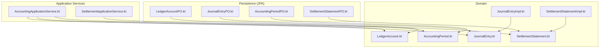
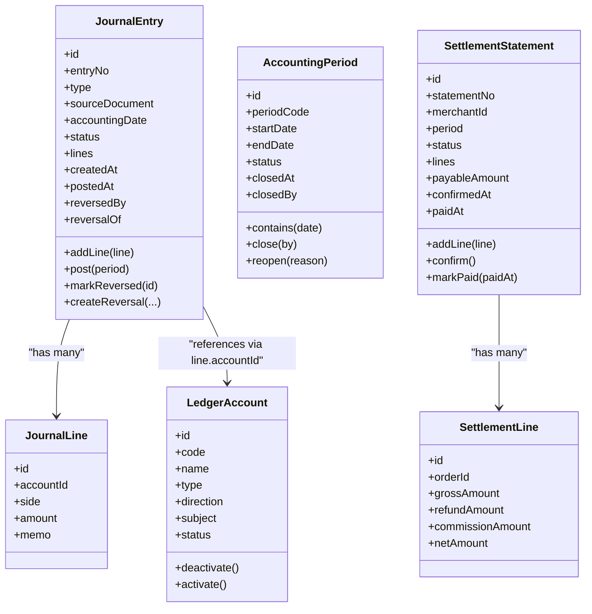
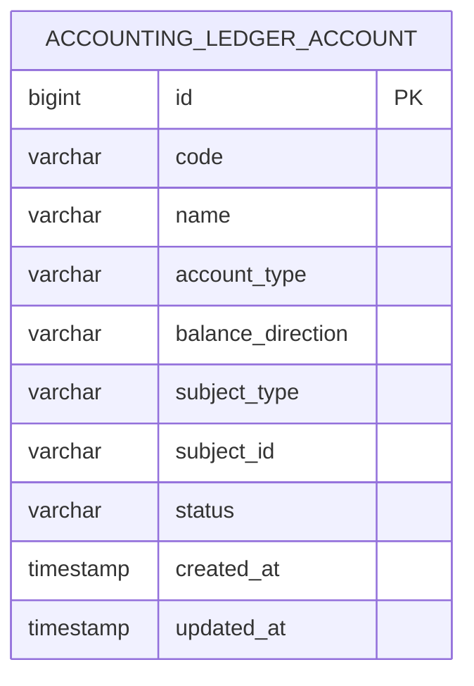
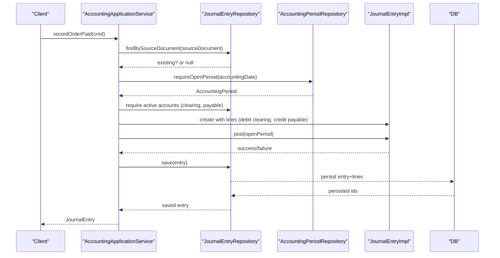
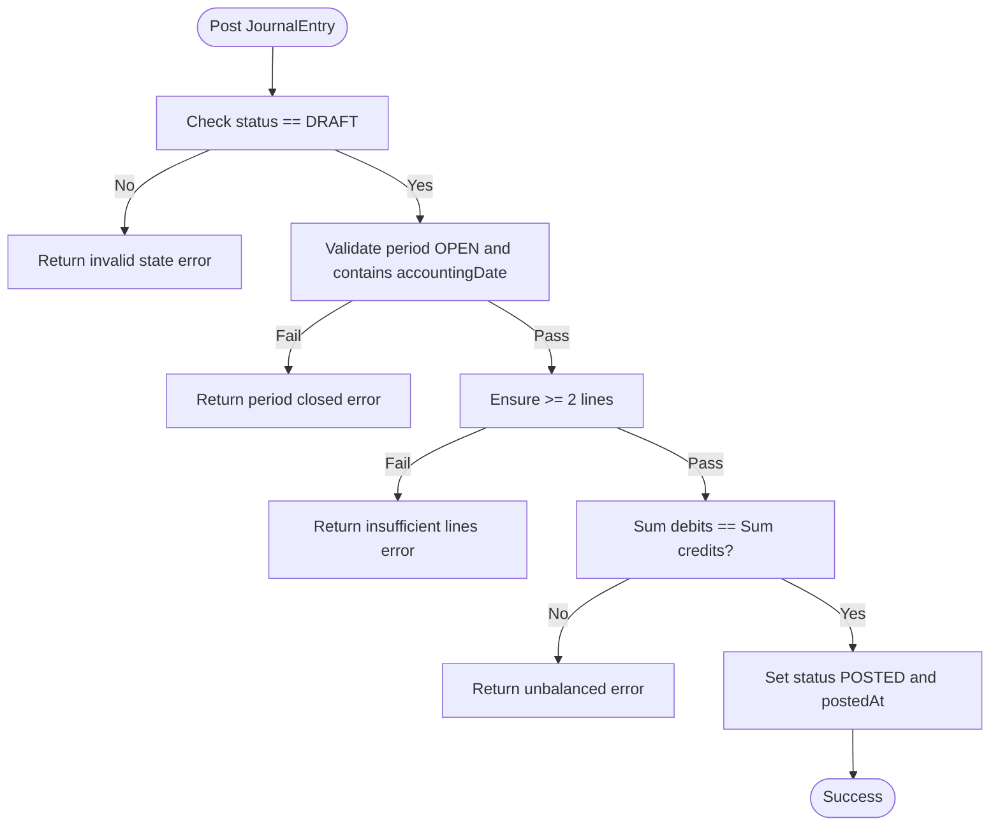
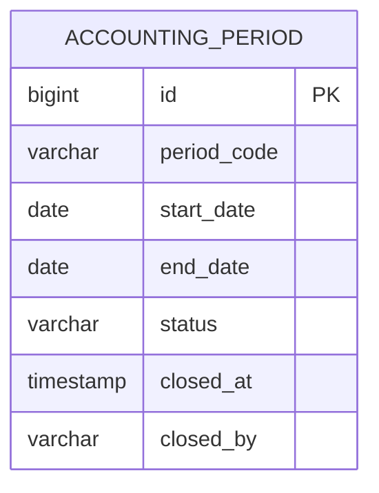
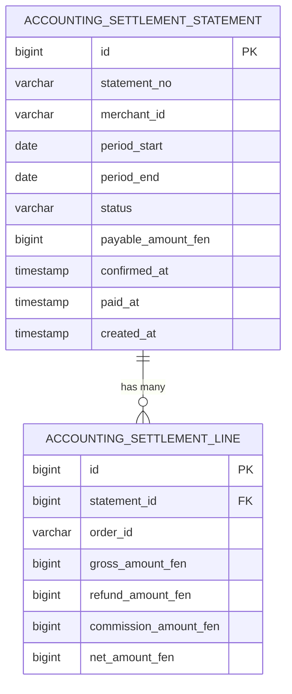
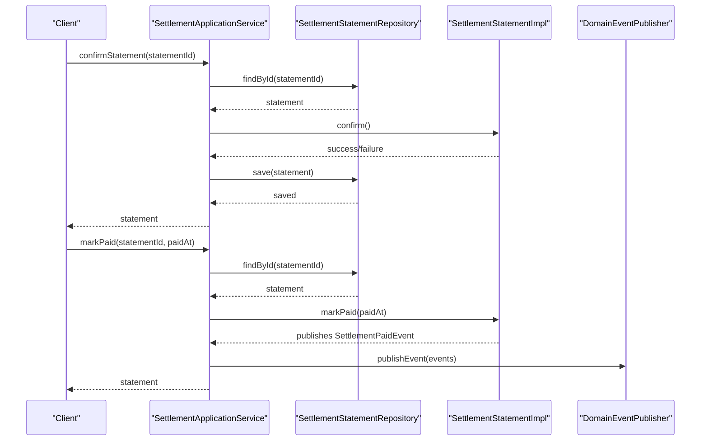
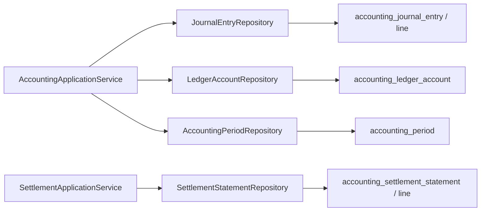

# Accounting Data Model

<cite>
**Referenced Files in This Document**
- [LedgerAccount.kt](file://j-store-accounting/src/main/kotlin/com/jstore/accounting/domain/account/LedgerAccount.kt)
- [JournalEntry.kt](file://j-store-accounting/src/main/kotlin/com/jstore/accounting/domain/journal/JournalEntry.kt)
- [AccountingPeriod.kt](file://j-store-accounting/src/main/kotlin/com/jstore/accounting/domain/journal/AccountingPeriod.kt)
- [SettlementStatement.kt](file://j-store-accounting/src/main/kotlin/com/jstore/accounting/domain/settlement/SettlementStatement.kt)
- [JournalEntryImpl.kt](file://j-store-accounting/src/main/kotlin/com/jstore/accounting/domain/journal/JournalEntryImpl.kt)
- [SettlementStatementImpl.kt](file://j-store-accounting/src/main/kotlin/com/jstore/accounting/domain/settlement/SettlementStatementImpl.kt)
- [AccountingApplicationService.kt](file://j-store-accounting/src/main/kotlin/com/jstore/accounting/service/AccountingApplicationService.kt)
- [SettlementApplicationService.kt](file://j-store-accounting/src/main/kotlin/com/jstore/accounting/service/SettlementApplicationService.kt)
- [LedgerAccountPO.kt](file://j-store-accounting-infrastructure/src/main/kotlin/com/jstore/accounting/domain/account/persistence/LedgerAccountPO.kt)
- [JournalEntryPO.kt](file://j-store-accounting-infrastructure/src/main/kotlin/com/jstore/accounting/domain/journal/persistence/JournalEntryPO.kt)
- [AccountingPeriodPO.kt](file://j-store-accounting-infrastructure/src/main/kotlin/com/jstore/accounting/domain/journal/persistence/AccountingPeriodPO.kt)
- [SettlementStatementPO.kt](file://j-store-accounting-infrastructure/src/main/kotlin/com/jstore/accounting/domain/settlement/persistence/SettlementStatementPO.kt)
</cite>

## Table of Contents
1. Introduction
2. Project Structure
3. Core Components
4. Architecture Overview
5. Detailed Component Analysis
6. Dependency Analysis
7. Performance Considerations
8. Troubleshooting Guide
9. Conclusion

## Introduction
This document defines the accounting data model for the platform, focusing on:
- LedgerAccount entity with chart of accounts, balance direction, and subject scoping
- JournalEntry entity implementing double-entry bookkeeping with debit/credit lines and posting controls
- AccountingPeriod entity for financial period management and reporting constraints
- SettlementStatement entity for merchant settlement statements and commission calculations
It also provides database schema diagrams, validation rules, audit trail requirements, and compliance considerations aligned with standard accounting principles.

## Project Structure
The accounting domain is implemented as a modular Kotlin application with clear separation between domain models, implementations, application services, and persistence entities.

**Diagram sources**
- [LedgerAccount.kt](file://j-store-accounting/src/main/kotlin/com/jstore/accounting/domain/account/LedgerAccount.kt)
- [JournalEntry.kt](file://j-store-accounting/src/main/kotlin/com/jstore/accounting/domain/journal/JournalEntry.kt)
- [AccountingPeriod.kt](file://j-store-accounting/src/main/kotlin/com/jstore/accounting/domain/journal/AccountingPeriod.kt)
- [SettlementStatement.kt](file://j-store-accounting/src/main/kotlin/com/jstore/accounting/domain/settlement/SettlementStatement.kt)
- [JournalEntryImpl.kt](file://j-store-accounting/src/main/kotlin/com/jstore/accounting/domain/journal/JournalEntryImpl.kt)
- [SettlementStatementImpl.kt](file://j-store-accounting/src/main/kotlin/com/jstore/accounting/domain/settlement/SettlementStatementImpl.kt)
- [AccountingApplicationService.kt](file://j-store-accounting/src/main/kotlin/com/jstore/accounting/service/AccountingApplicationService.kt)
- [SettlementApplicationService.kt](file://j-store-accounting/src/main/kotlin/com/jstore/accounting/service/SettlementApplicationService.kt)
- [LedgerAccountPO.kt](file://j-store-accounting-infrastructure/src/main/kotlin/com/jstore/accounting/domain/account/persistence/LedgerAccountPO.kt)
- [JournalEntryPO.kt](file://j-store-accounting-infrastructure/src/main/kotlin/com/jstore/accounting/domain/journal/persistence/JournalEntryPO.kt)
- [AccountingPeriodPO.kt](file://j-store-accounting-infrastructure/src/main/kotlin/com/jstore/accounting/domain/journal/persistence/AccountingPeriodPO.kt)
- [SettlementStatementPO.kt](file://j-store-accounting-infrastructure/src/main/kotlin/com/jstore/accounting/domain/settlement/persistence/SettlementStatementPO.kt)

**Section sources**
- [LedgerAccount.kt](file://j-store-accounting/src/main/kotlin/com/jstore/accounting/domain/account/LedgerAccount.kt)
- [JournalEntry.kt](file://j-store-accounting/src/main/kotlin/com/jstore/accounting/domain/journal/JournalEntry.kt)
- [AccountingPeriod.kt](file://j-store-accounting/src/main/kotlin/com/jstore/accounting/domain/journal/AccountingPeriod.kt)
- [SettlementStatement.kt](file://j-store-accounting/src/main/kotlin/com/jstore/accounting/domain/settlement/SettlementStatement.kt)
- [JournalEntryImpl.kt](file://j-store-accounting/src/main/kotlin/com/jstore/accounting/domain/journal/JournalEntryImpl.kt)
- [SettlementStatementImpl.kt](file://j-store-accounting/src/main/kotlin/com/jstore/accounting/domain/settlement/SettlementStatementImpl.kt)
- [AccountingApplicationService.kt](file://j-store-accounting/src/main/kotlin/com/jstore/accounting/service/AccountingApplicationService.kt)
- [SettlementApplicationService.kt](file://j-store-accounting/src/main/kotlin/com/jstore/accounting/service/SettlementApplicationService.kt)
- [LedgerAccountPO.kt](file://j-store-accounting-infrastructure/src/main/kotlin/com/jstore/accounting/domain/account/persistence/LedgerAccountPO.kt)
- [JournalEntryPO.kt](file://j-store-accounting-infrastructure/src/main/kotlin/com/jstore/accounting/domain/journal/persistence/JournalEntryPO.kt)
- [AccountingPeriodPO.kt](file://j-store-accounting-infrastructure/src/main/kotlin/com/jstore/accounting/domain/journal/persistence/AccountingPeriodPO.kt)
- [SettlementStatementPO.kt](file://j-store-accounting-infrastructure/src/main/kotlin/com/jstore/accounting/domain/settlement/persistence/SettlementStatementPO.kt)

## Core Components
- LedgerAccount: Represents a chart-of-accounts entry scoped by subject type and identifier, with account type and balance direction to support asset/liability/equity/revenue/expense classification.
- JournalEntry: Encapsulates a double-entry transaction with multiple lines, each specifying an account, side (debit/credit), amount, and memo; supports draft/posted/reversed lifecycle and reversal creation.
- AccountingPeriod: Defines open/closed periods with date ranges used to constrain posting dates.
- SettlementStatement: Aggregates order-level settlement lines with gross/refund/commission/net amounts, supporting confirmation and payment marking.

Key relationships:
- JournalEntry lines reference LedgerAccount via account IDs.
- JournalEntry posting validates against AccountingPeriod status and date containment.
- SettlementStatement aggregates SettlementLine records and computes payable totals.

**Section sources**
- [LedgerAccount.kt](file://j-store-accounting/src/main/kotlin/com/jstore/accounting/domain/account/LedgerAccount.kt)
- [JournalEntry.kt](file://j-store-accounting/src/main/kotlin/com/jstore/accounting/domain/journal/JournalEntry.kt)
- [AccountingPeriod.kt](file://j-store-accounting/src/main/kotlin/com/jstore/accounting/domain/journal/AccountingPeriod.kt)
- [SettlementStatement.kt](file://j-store-accounting/src/main/kotlin/com/jstore/accounting/domain/settlement/SettlementStatement.kt)

## Architecture Overview
The system enforces double-entry integrity through domain logic in JournalEntryImpl and application orchestration in AccountingApplicationService. Settlement flows are managed by SettlementApplicationService and SettlementStatementImpl. Persistence mappings are defined in PO classes.

**Diagram sources**
- [LedgerAccount.kt](file://j-store-accounting/src/main/kotlin/com/jstore/accounting/domain/account/LedgerAccount.kt)
- [JournalEntry.kt](file://j-store-accounting/src/main/kotlin/com/jstore/accounting/domain/journal/JournalEntry.kt)
- [AccountingPeriod.kt](file://j-store-accounting/src/main/kotlin/com/jstore/accounting/domain/journal/AccountingPeriod.kt)
- [SettlementStatement.kt](file://j-store-accounting/src/main/kotlin/com/jstore/accounting/domain/settlement/SettlementStatement.kt)

## Detailed Component Analysis

### LedgerAccount Entity
- Purpose: Define chart-of-accounts entries with type (asset, liability, equity, revenue, expense), balance direction (debit/credit), and subject scoping (platform, merchant, user, channel).
- Validation: Account code must be non-blank; subject ID must be non-blank.
- Lifecycle: Active/inactive states with activation/deactivation operations.

Database mapping:
- Table: accounting_ledger_account
- Columns include id, code, name, account_type, balance_direction, subject_type, subject_id, status, created_at, updated_at
- Unique constraint on (code, subject_type, subject_id)

**Diagram sources**
- [LedgerAccountPO.kt](file://j-store-accounting-infrastructure/src/main/kotlin/com/jstore/accounting/domain/account/persistence/LedgerAccountPO.kt)

**Section sources**
- [LedgerAccount.kt](file://j-store-accounting/src/main/kotlin/com/jstore/accounting/domain/account/LedgerAccount.kt)
- [LedgerAccountPO.kt](file://j-store-accounting-infrastructure/src/main/kotlin/com/jstore/accounting/domain/account/persistence/LedgerAccountPO.kt)

### JournalEntry Entity and Double-Entry Posting
- Purpose: Record transactions with balanced debit/credit lines, enforce period constraints, and support reversals.
- Key fields: entryNo, type, sourceDocument (sourceType, sourceId, eventType), accountingDate, status (DRAFT/POSTED/REVERSED), lines, timestamps, reversal links.
- Posting rules:
  - Must have at least two lines
  - Debit sum equals credit sum
  - Accounting period must be OPEN and contain the accounting date
- Reversal: Create a new entry with mirrored sides and reason memo; original entry marked REVERSED.

Database mapping:
- Tables: accounting_journal_entry, accounting_journal_line
- Entry columns: id, entry_no, entry_type, source_type, source_id, source_event_type, accounting_date, status, reversed_by, reversal_of, created_at, posted_at
- Line columns: id, entry_id (FK), account_id, side, amount_fen, memo
- Unique constraint on (source_type, source_id, source_event_type)

**Diagram sources**
- [AccountingApplicationService.kt](file://j-store-accounting/src/main/kotlin/com/jstore/accounting/service/AccountingApplicationService.kt)
- [JournalEntryImpl.kt](file://j-store-accounting/src/main/kotlin/com/jstore/accounting/domain/journal/JournalEntryImpl.kt)
- [JournalEntryPO.kt](file://j-store-accounting-infrastructure/src/main/kotlin/com/jstore/accounting/domain/journal/persistence/JournalEntryPO.kt)

**Diagram sources**
- [JournalEntryImpl.kt](file://j-store-accounting/src/main/kotlin/com/jstore/accounting/domain/journal/JournalEntryImpl.kt)

**Section sources**
- [JournalEntry.kt](file://j-store-accounting/src/main/kotlin/com/jstore/accounting/domain/journal/JournalEntry.kt)
- [JournalEntryImpl.kt](file://j-store-accounting/src/main/kotlin/com/jstore/accounting/domain/journal/JournalEntryImpl.kt)
- [JournalEntryPO.kt](file://j-store-accounting-infrastructure/src/main/kotlin/com/jstore/accounting/domain/journal/persistence/JournalEntryPO.kt)

### AccountingPeriod Entity
- Purpose: Control financial period openness and date containment for posting.
- Fields: periodCode, startDate, endDate, status (OPEN/CLOSED), closedAt, closedBy.
- Operations: contains(date), close(closedBy), reopen(reason).

Database mapping:
- Table: accounting_period
- Columns: id, period_code, start_date, end_date, status, closed_at, closed_by

**Diagram sources**
- [AccountingPeriodPO.kt](file://j-store-accounting-infrastructure/src/main/kotlin/com/jstore/accounting/domain/journal/persistence/AccountingPeriodPO.kt)

**Section sources**
- [AccountingPeriod.kt](file://j-store-accounting/src/main/kotlin/com/jstore/accounting/domain/journal/AccountingPeriod.kt)
- [AccountingPeriodPO.kt](file://j-store-accounting-infrastructure/src/main/kotlin/com/jstore/accounting/domain/journal/persistence/AccountingPeriodPO.kt)

### SettlementStatement Entity
- Purpose: Aggregate merchant settlement lines and manage statement lifecycle (DRAFT -> CONFIRMED -> PAID).
- Lines: orderId, grossAmount, refundAmount, commissionAmount, netAmount.
- Payable amount computed from sum of netAmount across lines.
- Operations: addLine, confirm (validates payable consistency), markPaid (publishes event).

Database mapping:
- Tables: accounting_settlement_statement, accounting_settlement_line
- Statement columns: id, statement_no, merchant_id, period_start, period_end, status, payable_amount_fen, confirmed_at, paid_at, created_at
- Line columns: id, statement_id (FK), order_id, gross_amount_fen, refund_amount_fen, commission_amount_fen, net_amount_fen
- Unique constraint on (merchant_id, period_start, period_end)

**Diagram sources**
- [SettlementStatementPO.kt](file://j-store-accounting-infrastructure/src/main/kotlin/com/jstore/accounting/domain/settlement/persistence/SettlementStatementPO.kt)

**Section sources**
- [SettlementStatement.kt](file://j-store-accounting/src/main/kotlin/com/jstore/accounting/domain/settlement/SettlementStatement.kt)
- [SettlementStatementImpl.kt](file://j-store-accounting/src/main/kotlin/com/jstore/accounting/domain/settlement/SettlementStatementImpl.kt)
- [SettlementStatementPO.kt](file://j-store-accounting-infrastructure/src/main/kotlin/com/jstore/accounting/domain/settlement/persistence/SettlementStatementPO.kt)

### Application Flows and Controls
- AccountingApplicationService orchestrates journal postings for order payments, completions (commission), refunds (reversals), and settlement payments. It ensures:
  - Idempotency via source document lookup
  - Open period validation
  - Active ledger account resolution (with fallback to DEFAULT where applicable)
  - Balanced double-entry construction and posting
- SettlementApplicationService handles statement confirmation and payment marking, publishing domain events upon payment.

**Diagram sources**
- [SettlementApplicationService.kt](file://j-store-accounting/src/main/kotlin/com/jstore/accounting/service/SettlementApplicationService.kt)
- [SettlementStatementImpl.kt](file://j-store-accounting/src/main/kotlin/com/jstore/accounting/domain/settlement/SettlementStatementImpl.kt)

**Section sources**
- [AccountingApplicationService.kt](file://j-store-accounting/src/main/kotlin/com/jstore/accounting/service/AccountingApplicationService.kt)
- [SettlementApplicationService.kt](file://j-store-accounting/src/main/kotlin/com/jstore/accounting/service/SettlementApplicationService.kt)

## Dependency Analysis
- Domain-to-persistence coupling:
  - JournalEntry lines reference LedgerAccount via account_id; uniqueness enforced on source document triple (source_type, source_id, source_event_type)
  - SettlementStatement has unique constraint per merchant and period range
- Service dependencies:
  - AccountingApplicationService depends on repositories for journal entries, ledger accounts, and accounting periods
  - SettlementApplicationService depends on settlement repository and optional event publisher

**Diagram sources**
- [AccountingApplicationService.kt](file://j-store-accounting/src/main/kotlin/com/jstore/accounting/service/AccountingApplicationService.kt)
- [SettlementApplicationService.kt](file://j-store-accounting/src/main/kotlin/com/jstore/accounting/service/SettlementApplicationService.kt)
- [JournalEntryPO.kt](file://j-store-accounting-infrastructure/src/main/kotlin/com/jstore/accounting/domain/journal/persistence/JournalEntryPO.kt)
- [LedgerAccountPO.kt](file://j-store-accounting-infrastructure/src/main/kotlin/com/jstore/accounting/domain/account/persistence/LedgerAccountPO.kt)
- [AccountingPeriodPO.kt](file://j-store-accounting-infrastructure/src/main/kotlin/com/jstore/accounting/domain/journal/persistence/AccountingPeriodPO.kt)
- [SettlementStatementPO.kt](file://j-store-accounting-infrastructure/src/main/kotlin/com/jstore/accounting/domain/settlement/persistence/SettlementStatementPO.kt)

**Section sources**
- [AccountingApplicationService.kt](file://j-store-accounting/src/main/kotlin/com/jstore/accounting/service/AccountingApplicationService.kt)
- [SettlementApplicationService.kt](file://j-store-accounting/src/main/kotlin/com/jstore/accounting/service/SettlementApplicationService.kt)
- [JournalEntryPO.kt](file://j-store-accounting-infrastructure/src/main/kotlin/com/jstore/accounting/domain/journal/persistence/JournalEntryPO.kt)
- [LedgerAccountPO.kt](file://j-store-accounting-infrastructure/src/main/kotlin/com/jstore/accounting/domain/account/persistence/LedgerAccountPO.kt)
- [AccountingPeriodPO.kt](file://j-store-accounting-infrastructure/src/main/kotlin/com/jstore/accounting/domain/journal/persistence/AccountingPeriodPO.kt)
- [SettlementStatementPO.kt](file://j-store-accounting-infrastructure/src/main/kotlin/com/jstore/accounting/domain/settlement/persistence/SettlementStatementPO.kt)

## Performance Considerations
- Use EAGER fetch for one-to-many lines in journal and settlement to simplify read paths; consider lazy loading in high-throughput scenarios to reduce payload size.
- Enforce uniqueness constraints at the database level to prevent duplicates and reduce application-side checks.
- Keep memo lengths bounded to limit storage overhead.
- Partition journal entries by accounting period if volume grows significantly to improve query performance.

[No sources needed since this section provides general guidance]

## Troubleshooting Guide
Common errors and their causes:
- Journal entry already posted: Attempting to modify a non-DRAFT entry.
- Accounting period closed: Posting attempted outside an OPEN period or on a date not contained within the period.
- Insufficient lines: Less than two lines provided.
- Unbalanced entry: Debit sum does not equal credit sum.
- Invalid state transitions: Settlement statement actions performed in incorrect states.
- Amount mismatch: Settlement payable total inconsistent with sum of line net amounts.
- Account not found: Required ledger account missing or inactive.

Mitigations:
- Validate input early and return descriptive errors.
- Ensure idempotent handling using source document lookups before creating new entries.
- Maintain audit trails via status changes, timestamps, and reversal links.

**Section sources**
- [JournalEntryImpl.kt](file://j-store-accounting/src/main/kotlin/com/jstore/accounting/domain/journal/JournalEntryImpl.kt)
- [SettlementStatementImpl.kt](file://j-store-accounting/src/main/kotlin/com/jstore/accounting/domain/settlement/SettlementStatementImpl.kt)
- [AccountingApplicationService.kt](file://j-store-accounting/src/main/kotlin/com/jstore/accounting/service/AccountingApplicationService.kt)

## Conclusion
The accounting data model implements robust double-entry bookkeeping with strict validation, period controls, and auditability. LedgerAccount provides a flexible chart of accounts, JournalEntry enforces balancing and posting rules, AccountingPeriod governs temporal constraints, and SettlementStatement manages merchant settlements and commissions. The design supports compliance with accounting standards through clear audit trails, reversible transactions, and consistent monetary representations.

[No sources needed since this section summarizes without analyzing specific files]