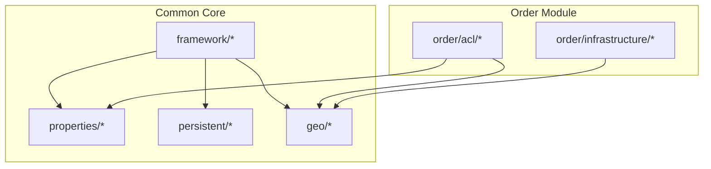
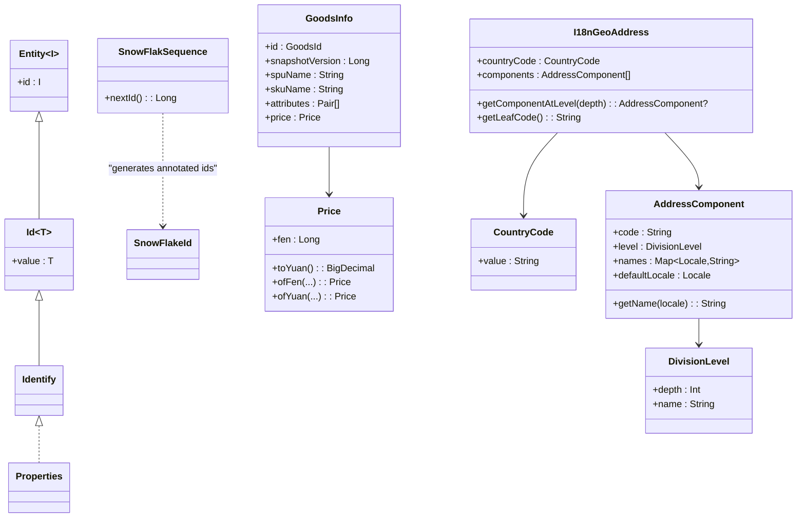
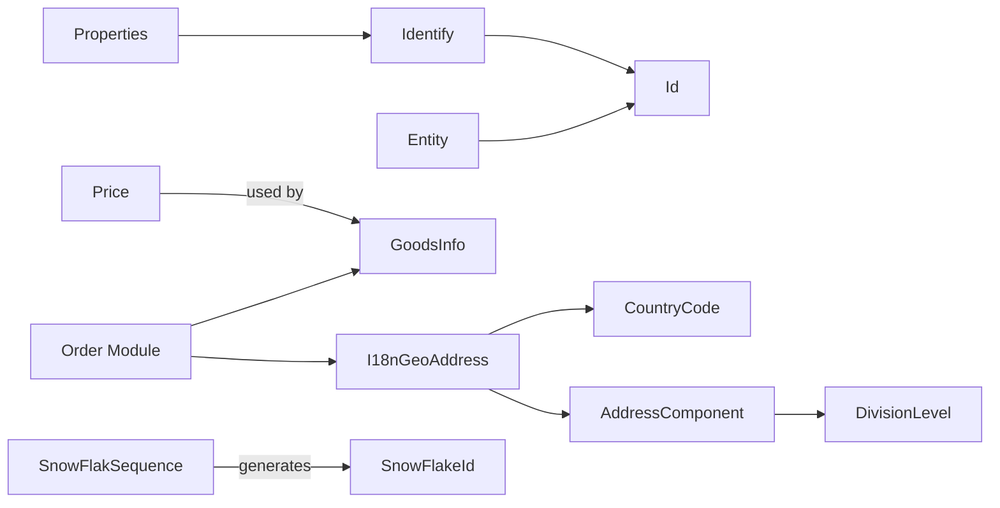

# Common Data Models

<cite>
**Referenced Files in This Document**
- [Entity.kt](file://j-store-common-core/src/main/kotlin/com/jstore/common/framework/Entity.kt)
- [Identify.kt](file://j-store-common-core/src/main/kotlin/com/jstore/common/framework/Identify.kt)
- [Properties.kt](file://j-store-common-core/src/main/kotlin/com/jstore/common/framework/Properties.kt)
- [Id.kt](file://j-store-common-core/src/main/kotlin/com/jstore/common/properties/Id.kt)
- [SnowFlakeId.kt](file://j-store-common-core/src/main/kotlin/com/jstore/common/persistent/SnowFlakeId.kt)
- [SnowFlakSequence.kt](file://j-store-common-core/src/main/kotlin/com/jstore/common/persistent/SnowFlakSequence.kt)
- [Price.kt](file://j-store-common-core/src/main/kotlin/com/jstore/common/properties/Price.kt)
- [I18nGeoAddress.kt](file://j-store-common-core/src/main/kotlin/com/jstore/common/geo/I18nGeoAddress.kt)
- [CountryCode.kt](file://j-store-common-core/src/main/kotlin/com/jstore/common/geo/CountryCode.kt)
- [AddressComponent.kt](file://j-store-common-core/src/main/kotlin/com/jstore/common/geo/AddressComponent.kt)
- [DivisionLevel.kt](file://j-store-common-core/src/main/kotlin/com/jstore/common/geo/DivisionLevel.kt)
- [GeoAddressService.kt](file://j-store-common-core/src/main/kotlin/com/jstore/common/geo/GeoAddressService.kt)
- [GoodsService.kt](file://j-store-order/src/main/kotlin/com/jstore/order/acl/GoodsService.kt)
- [OrderFactoryUnitTest.kt](file://j-store-order/src/test/kotlin/com/jstore/order/domain/order/OrderFactoryUnitTest.kt)
- [GoodsServiceImplTest.kt](file://j-store-order-infrastructure/src/test/kotlin/com/jstore/order/acl/GoodsServiceImplTest.kt)
- [I18nGeoAddressConverter.kt](file://j-store-order-infrastructure/src/main/kotlin/com/jstore/order/domain/order/persistence/I18nGeoAddressConverter.kt)
</cite>

## Table of Contents
1. Introduction
2. Project Structure
3. Core Components
4. Architecture Overview
5. Detailed Component Analysis
6. Dependency Analysis
7. Performance Considerations
8. Troubleshooting Guide
9. Conclusion

## Introduction
This document describes the shared domain models used across all modules in the project. It focuses on:
- The base Entity interface and Identify pattern for unique identification
- SnowFlakeId annotation and SnowFlakSequence distributed ID generation
- Price value object with currency handling and precision management
- I18nGeoAddress for internationalized geographical addresses
- Examples of reuse across domains, validation rules, serialization behavior, integration patterns, and best practices for extending common models consistently

## Project Structure
The shared data models live primarily in j-store-common-core under com.jstore.common.framework, com.jstore.common.properties, com.jstore.common.persistent, and com.jstore.common.geo. Domain modules (e.g., order) consume these models via interfaces and converters to integrate with persistence and cross-module boundaries.

**Diagram sources**
- [Entity.kt:1-5](file://j-store-common-core/src/main/kotlin/com/jstore/common/framework/Entity.kt#L1-L5)
- [Identify.kt:1-3](file://j-store-common-core/src/main/kotlin/com/jstore/common/framework/Identify.kt#L1-L3)
- [Id.kt:1-6](file://j-store-common-core/src/main/kotlin/com/jstore/common/properties/Id.kt#L1-L6)
- [SnowFlakeId.kt:1-11](file://j-store-common-core/src/main/kotlin/com/jstore/common/persistent/SnowFlakeId.kt#L1-L11)
- [SnowFlakSequence.kt:1-191](file://j-store-common-core/src/main/kotlin/com/jstore/common/persistent/SnowFlakSequence.kt#L1-L191)
- [Price.kt:1-71](file://j-store-common-core/src/main/kotlin/com/jstore/common/properties/Price.kt#L1-L71)
- [I18nGeoAddress.kt:1-25](file://j-store-common-core/src/main/kotlin/com/jstore/common/geo/I18nGeoAddress.kt#L1-L25)
- [CountryCode.kt:1-28](file://j-store-common-core/src/main/kotlin/com/jstore/common/geo/CountryCode.kt#L1-L28)
- [AddressComponent.kt:1-45](file://j-store-common-core/src/main/kotlin/com/jstore/common/geo/AddressComponent.kt#L1-L45)
- [DivisionLevel.kt:1-25](file://j-store-common-core/src/main/kotlin/com/jstore/common/geo/DivisionLevel.kt#L1-L25)
- [GeoAddressService.kt:1-8](file://j-store-common-core/src/main/kotlin/com/jstore/common/geo/GeoAddressService.kt#L1-L8)
- [GoodsService.kt:1-18](file://j-store-order/src/main/kotlin/com/jstore/order/acl/GoodsService.kt#L1-L18)
- [I18nGeoAddressConverter.kt:1-23](file://j-store-order-infrastructure/src/main/kotlin/com/jstore/order/domain/order/persistence/I18nGeoAddressConverter.kt#L1-L23)

**Section sources**
- [Entity.kt:1-5](file://j-store-common-core/src/main/kotlin/com/jstore/common/framework/Entity.kt#L1-L5)
- [Identify.kt:1-3](file://j-store-common-core/src/main/kotlin/com/jstore/common/framework/Identify.kt#L1-L3)
- [Properties.kt:1-3](file://j-store-common-core/src/main/kotlin/com/jstore/common/framework/Properties.kt#L1-L3)
- [Id.kt:1-6](file://j-store-common-core/src/main/kotlin/com/jstore/common/properties/Id.kt#L1-L6)
- [SnowFlakeId.kt:1-11](file://j-store-common-core/src/main/kotlin/com/jstore/common/persistent/SnowFlakeId.kt#L1-L11)
- [SnowFlakSequence.kt:1-191](file://j-store-common-core/src/main/kotlin/com/jstore/common/persistent/SnowFlakSequence.kt#L1-L191)
- [Price.kt:1-71](file://j-store-common-core/src/main/kotlin/com/jstore/common/properties/Price.kt#L1-L71)
- [I18nGeoAddress.kt:1-25](file://j-store-common-core/src/main/kotlin/com/jstore/common/geo/I18nGeoAddress.kt#L1-L25)
- [CountryCode.kt:1-28](file://j-store-common-core/src/main/kotlin/com/jstore/common/geo/CountryCode.kt#L1-L28)
- [AddressComponent.kt:1-45](file://j-store-common-core/src/main/kotlin/com/jstore/common/geo/AddressComponent.kt#L1-L45)
- [DivisionLevel.kt:1-25](file://j-store-common-core/src/main/kotlin/com/jstore/common/geo/DivisionLevel.kt#L1-L25)
- [GeoAddressService.kt:1-8](file://j-store-common-core/src/main/kotlin/com/jstore/common/geo/GeoAddressService.kt#L1-L8)
- [GoodsService.kt:1-18](file://j-store-order/src/main/kotlin/com/jstore/order/acl/GoodsService.kt#L1-L18)
- [I18nGeoAddressConverter.kt:1-23](file://j-store-order-infrastructure/src/main/kotlin/com/jstore/order/domain/order/persistence/I18nGeoAddressConverter.kt#L1-L23)

## Core Components
- Entity<I : Identify>: Base interface for entities that must expose a stable identity.
- Identify: Marker interface extending Properties, used as the generic constraint for entity IDs.
- Id<T>: Open wrapper around a typed value implementing Identify; suitable for creating strongly-typed identifiers.
- SnowFlakeId: Annotation marking fields or parameters intended to be generated by Snowflake-like sequences.
- SnowFlakSequence: Distributed ID generator producing monotonically increasing 64-bit IDs using timestamp, datacenter, worker, and sequence bits.
- Price: Immutable value object representing monetary amounts in cents (Long), with arithmetic operators, comparison, and conversion utilities.
- I18nGeoAddress: Immutable value object modeling an address with country code and a list of AddressComponent entries, supporting locale-aware names and leaf-code extraction.
- CountryCode, DivisionLevel, AddressComponent: Supporting value objects for internationalized geographic addressing.

Key behaviors:
- Validation is enforced at construction time via require checks.
- Serialization uses Jackson annotations for compact JSON representation where applicable.
- Cross-domain usage occurs through ACL interfaces (e.g., GoodsInfo includes Price) and JPA AttributeConverters (e.g., I18nGeoAddress).

**Section sources**
- [Entity.kt:1-5](file://j-store-common-core/src/main/kotlin/com/jstore/common/framework/Entity.kt#L1-L5)
- [Identify.kt:1-3](file://j-store-common-core/src/main/kotlin/com/jstore/common/framework/Identify.kt#L1-L3)
- [Properties.kt:1-3](file://j-store-common-core/src/main/kotlin/com/jstore/common/framework/Properties.kt#L1-L3)
- [Id.kt:1-6](file://j-store-common-core/src/main/kotlin/com/jstore/common/properties/Id.kt#L1-L6)
- [SnowFlakeId.kt:1-11](file://j-store-common-core/src/main/kotlin/com/jstore/common/persistent/SnowFlakeId.kt#L1-L11)
- [SnowFlakSequence.kt:1-191](file://j-store-common-core/src/main/kotlin/com/jstore/common/persistent/SnowFlakSequence.kt#L1-L191)
- [Price.kt:1-71](file://j-store-common-core/src/main/kotlin/com/jstore/common/properties/Price.kt#L1-L71)
- [I18nGeoAddress.kt:1-25](file://j-store-common-core/src/main/kotlin/com/jstore/common/geo/I18nGeoAddress.kt#L1-L25)
- [CountryCode.kt:1-28](file://j-store-common-core/src/main/kotlin/com/jstore/common/geo/CountryCode.kt#L1-L28)
- [AddressComponent.kt:1-45](file://j-store-common-core/src/main/kotlin/com/jstore/common/geo/AddressComponent.kt#L1-L45)
- [DivisionLevel.kt:1-25](file://j-store-common-core/src/main/kotlin/com/jstore/common/geo/DivisionLevel.kt#L1-L25)

## Architecture Overview
The common models are consumed by domain modules via clean abstractions:
- Price flows into ACL contracts like GoodsInfo to carry monetary values across module boundaries without exposing internal representations.
- I18nGeoAddress is persisted via a JPA converter to JSON, enabling flexible schema evolution while keeping domain semantics intact.
- SnowFlakSequence provides globally unique IDs; SnowFlakeId marks fields intended for such IDs.

**Diagram sources**
- [Entity.kt:1-5](file://j-store-common-core/src/main/kotlin/com/jstore/common/framework/Entity.kt#L1-L5)
- [Identify.kt:1-3](file://j-store-common-core/src/main/kotlin/com/jstore/common/framework/Identify.kt#L1-L3)
- [Properties.kt:1-3](file://j-store-common-core/src/main/kotlin/com/jstore/common/framework/Properties.kt#L1-L3)
- [Id.kt:1-6](file://j-store-common-core/src/main/kotlin/com/jstore/common/properties/Id.kt#L1-L6)
- [SnowFlakeId.kt:1-11](file://j-store-common-core/src/main/kotlin/com/jstore/common/persistent/SnowFlakeId.kt#L1-L11)
- [SnowFlakSequence.kt:1-191](file://j-store-common-core/src/main/kotlin/com/jstore/common/persistent/SnowFlakSequence.kt#L1-L191)
- [Price.kt:1-71](file://j-store-common-core/src/main/kotlin/com/jstore/common/properties/Price.kt#L1-L71)
- [I18nGeoAddress.kt:1-25](file://j-store-common-core/src/main/kotlin/com/jstore/common/geo/I18nGeoAddress.kt#L1-L25)
- [CountryCode.kt:1-28](file://j-store-common-core/src/main/kotlin/com/jstore/common/geo/CountryCode.kt#L1-L28)
- [AddressComponent.kt:1-45](file://j-store-common-core/src/main/kotlin/com/jstore/common/geo/AddressComponent.kt#L1-L45)
- [DivisionLevel.kt:1-25](file://j-store-common-core/src/main/kotlin/com/jstore/common/geo/DivisionLevel.kt#L1-L25)
- [GoodsService.kt:1-18](file://j-store-order/src/main/kotlin/com/jstore/order/acl/GoodsService.kt#L1-L18)

## Detailed Component Analysis

### Entity and Identify Pattern
- Entity<I : Identify> enforces that every entity exposes a stable identifier constrained to Identify.
- Identify extends Properties to mark immutable, serializable value types used as identifiers.
- Id<T> provides a simple open wrapper for typed identifiers; modules can extend it if needed.

Best practices:
- Prefer strongly-typed identifiers (e.g., UserId, OrderId) built on Id<T>.
- Keep identifiers immutable and comparable.
- Avoid leaking primitive IDs into domain logic; wrap them in typed classes.

**Section sources**
- [Entity.kt:1-5](file://j-store-common-core/src/main/kotlin/com/jstore/common/framework/Entity.kt#L1-L5)
- [Identify.kt:1-3](file://j-store-common-core/src/main/kotlin/com/jstore/common/framework/Identify.kt#L1-L3)
- [Properties.kt:1-3](file://j-store-common-core/src/main/kotlin/com/jstore/common/framework/Properties.kt#L1-L3)
- [Id.kt:1-6](file://j-store-common-core/src/main/kotlin/com/jstore/common/properties/Id.kt#L1-L6)

### SnowFlakeId and SnowFlakSequence
- SnowFlakeId is a runtime annotation indicating fields or parameters that should be assigned via Snowflake-style ID generation.
- SnowFlakSequence generates 64-bit IDs composed of timestamp, datacenter id, worker id, and sequence number. It handles clock drift by waiting or throwing when clocks move backwards beyond tolerance.

Usage patterns:
- Configure one instance per process or service; share across aggregates needing distributed IDs.
- Use SnowFlakeId to mark persistent fields or DTOs expecting Snowflake-generated values.

Validation and error handling:
- Invalid worker/datacenter ranges throw errors during construction.
- Clock backward movement beyond threshold throws runtime exceptions; within small windows, the generator waits and retries.

Performance characteristics:
- Thread-safe nextId() with synchronized access and atomic timestamp updates.
- Sequence wraps within bit limits; on overflow, advances to next millisecond.

**Section sources**
- [SnowFlakeId.kt:1-11](file://j-store-common-core/src/main/kotlin/com/jstore/common/persistent/SnowFlakeId.kt#L1-L11)
- [SnowFlakSequence.kt:1-191](file://j-store-common-core/src/main/kotlin/com/jstore/common/persistent/SnowFlakSequence.kt#L1-L191)

### Price Value Object
Price encapsulates monetary amounts in cents (Long) to avoid floating-point precision issues. It provides:
- Arithmetic operators (+, -, *, /) with consistent rounding (HALF_UP) for multiplication/division by non-integers.
- Comparison via Comparable.
- Conversion helpers: toYuan(), toBigDecimal(), plus factory methods ofFen/ofYuan/fromBigDecimal and sumOf.

Validation rules:
- Non-negative fen enforced at construction.

Serialization behavior:
- toString returns fen value; use explicit conversions for display or storage.

Integration examples:
- Used in ACL contracts (e.g., GoodsInfo.price) to pass price across module boundaries.
- Tests demonstrate mapping from external snapshots to Price instances.

Best practices:
- Always construct via factory methods to ensure valid state.
- Perform calculations using Price operators to maintain precision and invariants.
- Convert to human-readable formats only at presentation boundaries.

**Section sources**
- [Price.kt:1-71](file://j-store-common-core/src/main/kotlin/com/jstore/common/properties/Price.kt#L1-L71)
- [GoodsService.kt:1-18](file://j-store-order/src/main/kotlin/com/jstore/order/acl/GoodsService.kt#L1-L18)
- [GoodsServiceImplTest.kt:1-33](file://j-store-order-infrastructure/src/test/kotlin/com/jstore/order/acl/GoodsServiceImplTest.kt#L1-L33)

### I18nGeoAddress and Related Types
I18nGeoAddress models an address with:
- countryCode: ISO 3166-1 alpha-2 validated via CountryCode.
- components: ordered list of AddressComponent entries, each with code, level, localized names, and defaultLocale.
- getComponentAtLevel(depth) and getLeafCode() for querying hierarchical parts.

Supporting types:
- CountryCode validates format and provides common constants.
- DivisionLevel represents administrative levels with depth and name.
- AddressComponent ensures non-blank codes, at least one locale name, and presence of defaultLocale in names map.

Serialization behavior:
- CountryCode serializes as a plain string (e.g., "CN").
- AddressComponent uses custom serializers/deserializers for Locale keys and values.
- I18nGeoAddress.getLeafCode() is ignored by Jackson (@JsonIgnore).

Persistence integration:
- JPA AttributeConverter persists I18nGeoAddress as JSON using shared JsonUtils ObjectMapper.

Validation rules:
- I18nGeoAddress requires non-empty components.
- AddressComponent requires non-blank code, non-empty names, and defaultLocale present in names.

Best practices:
- Build addresses via factories or builders ensuring required locales and levels.
- Use getComponentAtLevel to query specific administrative levels.
- Persist via converter; avoid manual JSON manipulation in domain logic.

**Section sources**
- [I18nGeoAddress.kt:1-25](file://j-store-common-core/src/main/kotlin/com/jstore/common/geo/I18nGeoAddress.kt#L1-L25)
- [CountryCode.kt:1-28](file://j-store-common-core/src/main/kotlin/com/jstore/common/geo/CountryCode.kt#L1-L28)
- [AddressComponent.kt:1-45](file://j-store-common-core/src/main/kotlin/com/jstore/common/geo/AddressComponent.kt#L1-L45)
- [DivisionLevel.kt:1-25](file://j-store-common-core/src/main/kotlin/com/jstore/common/geo/DivisionLevel.kt#L1-L25)
- [GeoAddressService.kt:1-8](file://j-store-common-core/src/main/kotlin/com/jstore/common/geo/GeoAddressService.kt#L1-L8)
- [I18nGeoAddressConverter.kt:1-23](file://j-store-order-infrastructure/src/main/kotlin/com/jstore/order/domain/order/persistence/I18nGeoAddressConverter.kt#L1-L23)

### Reuse Across Domains
Examples of how common models are reused:
- Price appears in ACL contracts like GoodsInfo to represent item pricing consistently across order and goods boundaries.
- I18nGeoAddress is used in order-related tests and infrastructure to model shipping addresses with localization support.
- SnowFlakSequence is referenced in tests and configuration to generate distributed IDs for entities.

**Section sources**
- [GoodsService.kt:1-18](file://j-store-order/src/main/kotlin/com/jstore/order/acl/GoodsService.kt#L1-L18)
- [OrderFactoryUnitTest.kt:1-41](file://j-store-order/src/test/kotlin/com/jstore/order/domain/order/OrderFactoryUnitTest.kt#L1-L41)
- [GoodsServiceImplTest.kt:1-33](file://j-store-order-infrastructure/src/test/kotlin/com/jstore/order/acl/GoodsServiceImplTest.kt#L1-L33)

## Dependency Analysis
The following diagram shows how common models depend on each other and how domain modules consume them.

**Diagram sources**
- [Properties.kt:1-3](file://j-store-common-core/src/main/kotlin/com/jstore/common/framework/Properties.kt#L1-L3)
- [Identify.kt:1-3](file://j-store-common-core/src/main/kotlin/com/jstore/common/framework/Identify.kt#L1-L3)
- [Id.kt:1-6](file://j-store-common-core/src/main/kotlin/com/jstore/common/properties/Id.kt#L1-L6)
- [Entity.kt:1-5](file://j-store-common-core/src/main/kotlin/com/jstore/common/framework/Entity.kt#L1-L5)
- [Price.kt:1-71](file://j-store-common-core/src/main/kotlin/com/jstore/common/properties/Price.kt#L1-L71)
- [GoodsService.kt:1-18](file://j-store-order/src/main/kotlin/com/jstore/order/acl/GoodsService.kt#L1-L18)
- [I18nGeoAddress.kt:1-25](file://j-store-common-core/src/main/kotlin/com/jstore/common/geo/I18nGeoAddress.kt#L1-L25)
- [CountryCode.kt:1-28](file://j-store-common-core/src/main/kotlin/com/jstore/common/geo/CountryCode.kt#L1-L28)
- [AddressComponent.kt:1-45](file://j-store-common-core/src/main/kotlin/com/jstore/common/geo/AddressComponent.kt#L1-L45)
- [DivisionLevel.kt:1-25](file://j-store-common-core/src/main/kotlin/com/jstore/common/geo/DivisionLevel.kt#L1-L25)
- [SnowFlakeId.kt:1-11](file://j-store-common-core/src/main/kotlin/com/jstore/common/persistent/SnowFlakeId.kt#L1-L11)
- [SnowFlakSequence.kt:1-191](file://j-store-common-core/src/main/kotlin/com/jstore/common/persistent/SnowFlakSequence.kt#L1-L191)

**Section sources**
- [GoodsService.kt:1-18](file://j-store-order/src/main/kotlin/com/jstore/order/acl/GoodsService.kt#L1-L18)
- [I18nGeoAddress.kt:1-25](file://j-store-common-core/src/main/kotlin/com/jstore/common/geo/I18nGeoAddress.kt#L1-L25)
- [Price.kt:1-71](file://j-store-common-core/src/main/kotlin/com/jstore/common/properties/Price.kt#L1-L71)
- [SnowFlakSequence.kt:1-191](file://j-store-common-core/src/main/kotlin/com/jstore/common/persistent/SnowFlakSequence.kt#L1-L191)

## Performance Considerations
- Price operations are O(1) arithmetic on Long values; conversions to BigDecimal occur only when explicitly requested.
- SnowFlakSequence.nextId() is synchronized; contention may arise under high concurrency. Consider multiple instances per service partitioning by worker/datacenter IDs.
- I18nGeoAddress JSON serialization/deserialization adds overhead; prefer caching Locale serializers and reusing ObjectMapper instances (as provided by shared JsonUtils).

[No sources needed since this section provides general guidance]

## Troubleshooting Guide
Common issues and resolutions:
- Price validation failures: Ensure fen is non-negative; use factory methods to construct valid instances.
- CountryCode format errors: Validate two uppercase letters; use predefined constants when possible.
- AddressComponent validation errors: Provide non-blank code, at least one locale name, and ensure defaultLocale exists in names.
- SnowFlake clock drift: If clocks move backward, the generator either waits briefly or throws; synchronize system time and review NTP settings.
- I18nGeoAddress persistence: Confirm the JPA converter is applied and JsonUtils ObjectMapper is configured with KotlinModule and Locale serializers.

**Section sources**
- [Price.kt:1-71](file://j-store-common-core/src/main/kotlin/com/jstore/common/properties/Price.kt#L1-L71)
- [CountryCode.kt:1-28](file://j-store-common-core/src/main/kotlin/com/jstore/common/geo/CountryCode.kt#L1-L28)
- [AddressComponent.kt:1-45](file://j-store-common-core/src/main/kotlin/com/jstore/common/geo/AddressComponent.kt#L1-L45)
- [SnowFlakSequence.kt:1-191](file://j-store-common-core/src/main/kotlin/com/jstore/common/persistent/SnowFlakSequence.kt#L1-L191)
- [I18nGeoAddressConverter.kt:1-23](file://j-store-order-infrastructure/src/main/kotlin/com/jstore/order/domain/order/persistence/I18nGeoAddressConverter.kt#L1-L23)

## Conclusion
The shared data models provide robust, validated, and serializable building blocks for the entire application:
- Entity/Identify enforce consistent identification patterns.
- SnowFlakeId and SnowFlakSequence deliver scalable distributed IDs.
- Price ensures precise monetary handling across boundaries.
- I18nGeoAddress supports internationalized addresses with clear persistence strategies.

Adopting these models consistently across modules improves correctness, maintainability, and interoperability. Extend them thoughtfully by preserving immutability, validation, and serialization contracts.

[No sources needed since this section summarizes without analyzing specific files]