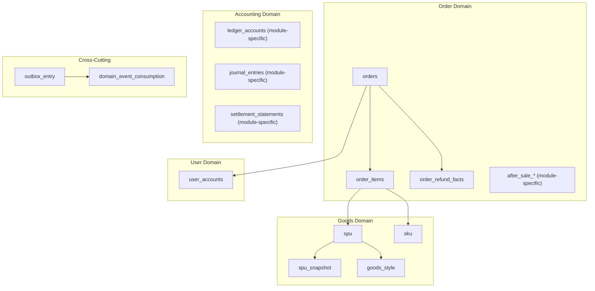
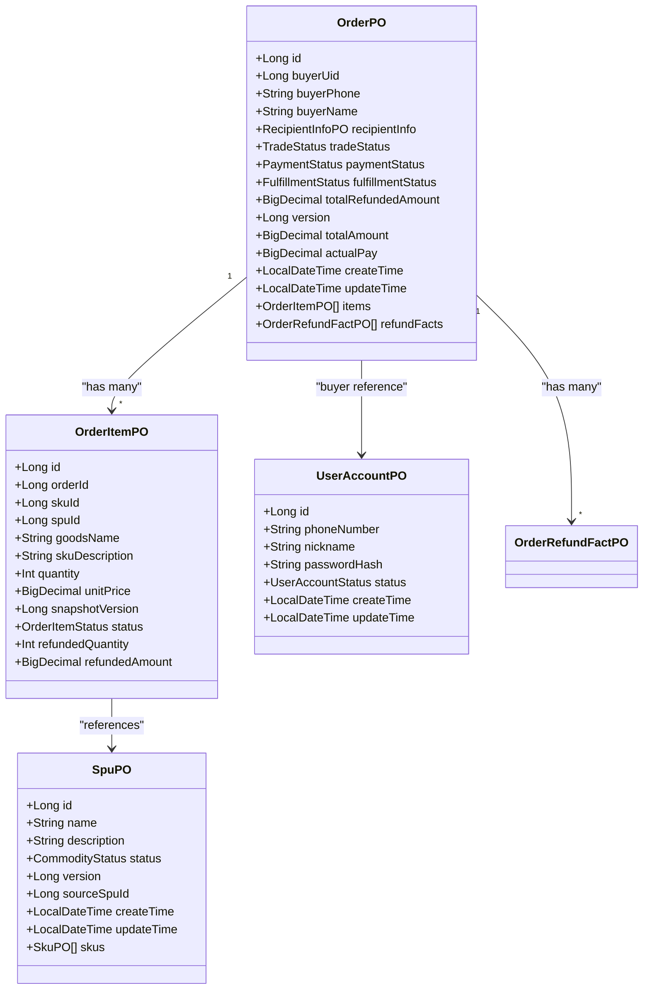
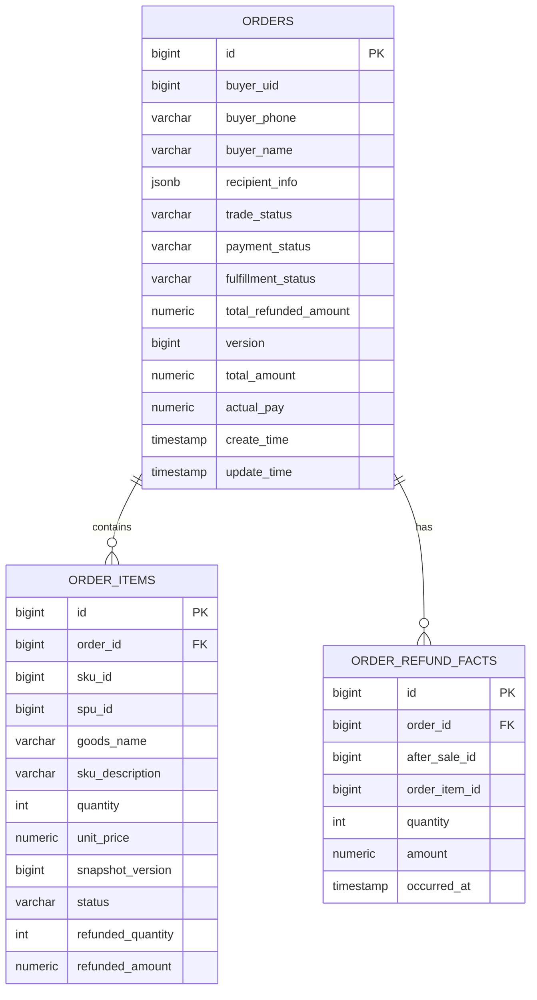
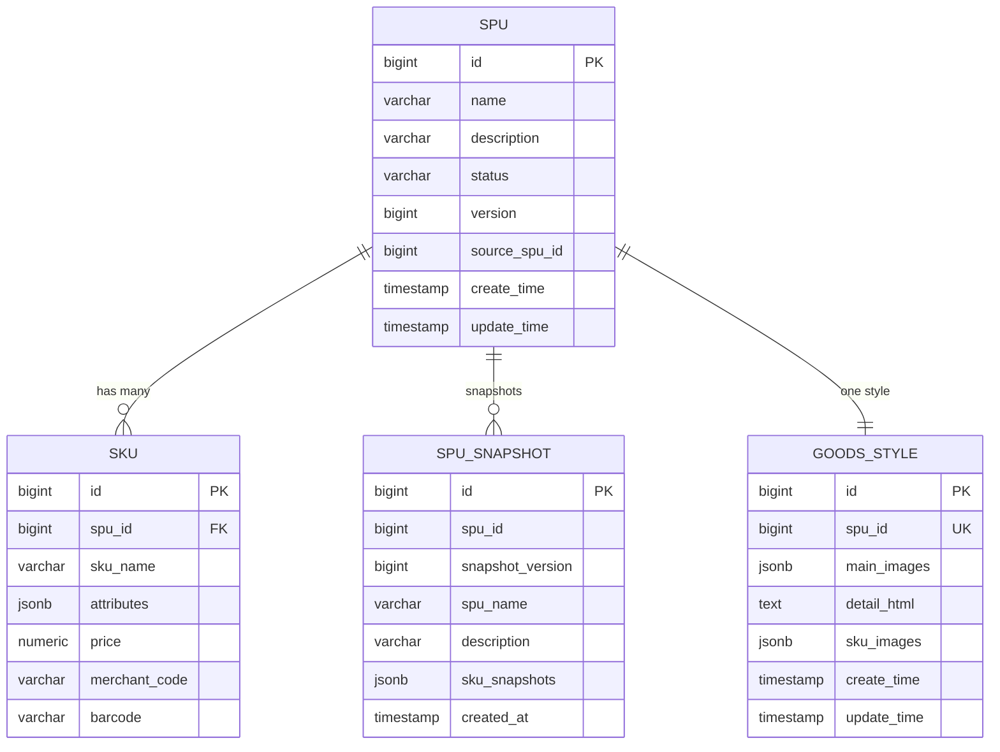
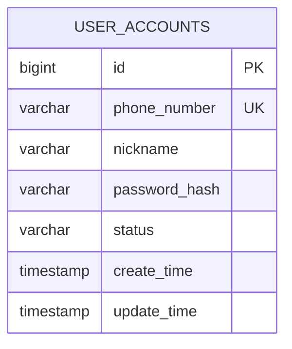
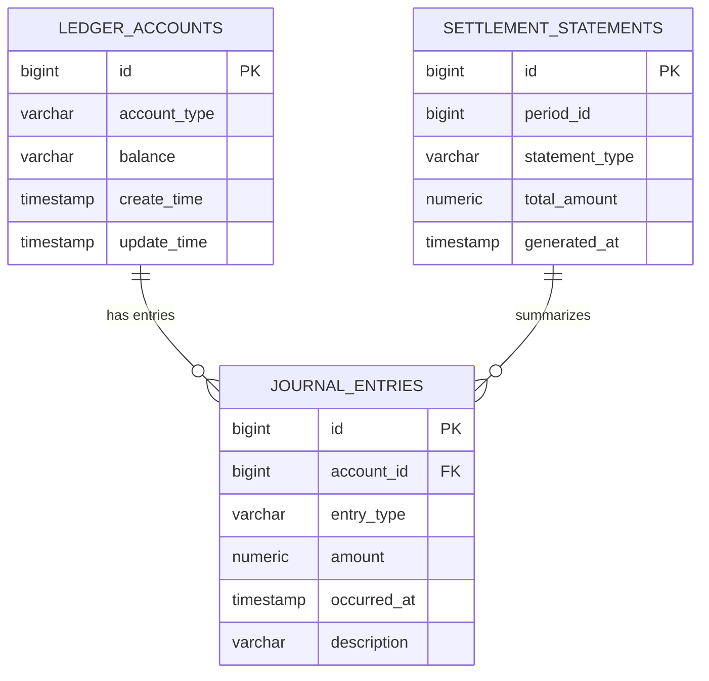
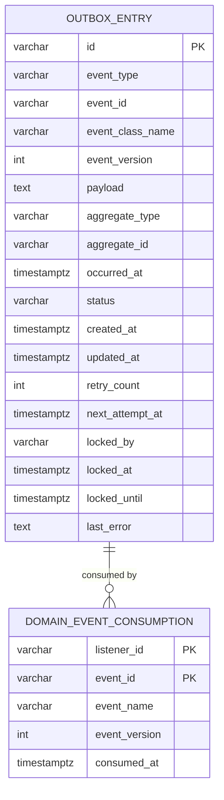
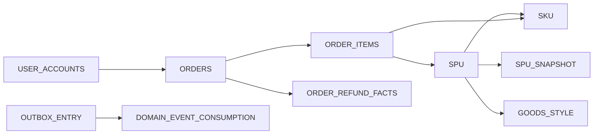

# Data Models and Database Schema

<cite>
**Referenced Files in This Document**
- [01-init.sql](file://docker/postgres/init/01-init.sql)
- [02-add-country-code.sql](file://docker/postgres/init/02-add-country-code.sql)
- [03-order-address-jsonb.sql](file://docker/postgres/init/03-order-address-jsonb.sql)
- [04-goods-spu-sku-snapshot.sql](file://docker/postgres/init/04-goods-spu-sku-snapshot.sql)
- [05-order-consignee-info.sql](file://docker/postgres/init/05-order-consignee-info.sql)
- [06-outbox-entry.sql](file://docker/postgres/init/06-outbox-entry.sql)
- [07-goods-style-sku-code.sql](file://docker/postgres/init/07-goods-style-sku-code.sql)
- [08-order-item-snapshot-version.sql](file://docker/postgres/init/08-order-item-snapshot-version.sql)
- [09-goods-spu-source-spu-id.sql](file://docker/postgres/init/09-goods-spu-source-spu-id.sql)
- [OrderPO.kt](file://j-store-order-infrastructure/src/main/kotlin/com/jstore/order/domain/order/persistence/OrderPO.kt)
- [SpuPO.kt](file://j-store-goods-infrastructure/src/main/kotlin/com/jstore/goods/domain/commodity/persistence/SpuPO.kt)
- [UserAccountPO.kt](file://j-store-user-infrastructure/src/main/kotlin/com/jstore/user/domain/useraccount/persistence/UserAccountPO.kt)
- [OutboxEntryPO.kt](file://j-store-common-spring/src/main/kotlin/com/jstore/common/framework/event/outbox/persistence/OutboxEntryPO.kt)
- [DomainEventConsumptionPO.kt](file://j-store-common-spring/src/main/kotlin/com/jstore/common/framework/event/persistence/DomainEventConsumptionPO.kt)
- [V20260507__baseline_j_store_boot_schema.sql](file://j-store-boot/src/main/resources/db/migration/V20260507__baseline_j_store_boot_schema.sql)
- [V20260731__order_status_dimensions.sql](file://j-store-boot/src/main/resources/db/migration/V20260731__order_status_dimensions.sql)
- [V20260803__order_after_sale_aggregate.sql](file://j-store-boot/src/main/resources/db/migration/V20260803__order_after_sale_aggregate.sql)
</cite>

## Table of Contents
1. Introduction
2. Project Structure
3. Core Components
4. Architecture Overview
5. Detailed Component Analysis
6. Dependency Analysis
7. Performance Considerations
8. Troubleshooting Guide
9. Conclusion

## Introduction
This document provides a comprehensive data model documentation for J-Store’s database schema and entity relationships across the order, goods, user, and accounting domains. It details field definitions, data types, primary and foreign keys, indexes, constraints, validation rules, and business constraints enforced at the database level. It also covers data access patterns via JPA repositories, caching strategies using Redis, performance considerations, data lifecycle management, retention policies, archival rules, migration paths with Flyway, and security and privacy requirements.

## Project Structure
The data model spans multiple modules:
- Order domain: orders, order_items, order_refund_facts, after-sale tables (via migrations)
- Goods domain: spu, sku, spu_snapshot, goods_style
- User domain: user_accounts
- Accounting domain: ledger accounts, journal entries, settlement statements (infrastructure entities exist; detailed schema is managed by module-specific migrations)
- Cross-cutting eventing: outbox_entry, domain_event_consumption

[No sources needed since this diagram shows conceptual workflow, not actual code structure]

**Section sources**
- [04-goods-spu-sku-snapshot.sql:1-55](file://docker/postgres/init/04-goods-spu-sku-snapshot.sql#L1-L55)
- [05-order-consignee-info.sql:1-34](file://docker/postgres/init/05-order-consignee-info.sql#L1-L34)
- [06-outbox-entry.sql:1-62](file://docker/postgres/init/06-outbox-entry.sql#L1-L62)
- [OrderPO.kt:1-140](file://j-store-order-infrastructure/src/main/kotlin/com/jstore/order/domain/order/persistence/OrderPO.kt#L1-L140)
- [SpuPO.kt:1-40](file://j-store-goods-infrastructure/src/main/kotlin/com/jstore/goods/domain/commodity/persistence/SpuPO.kt#L1-L40)
- [UserAccountPO.kt:1-41](file://j-store-user-infrastructure/src/main/kotlin/com/jstore/user/domain/useraccount/persistence/UserAccountPO.kt#L1-L41)

## Core Components
Key persistent entities and their responsibilities:
- OrderPO: Represents an order with trade/payment/fulfillment statuses, amounts, timestamps, and associated items and refund facts. Uses JSONB for recipient info to support flexible address structures.
- SpuPO: Standard Product Unit with name, description, status, versioning, and one-to-many SKUs.
- UserAccountPO: User account with phone number (unique), nickname, password hash, status, and timestamps.
- OutboxEntryPO and DomainEventConsumptionPO: Eventual consistency infrastructure for reliable event publishing and idempotent consumption.

Data types and constraints:
- Numeric fields use precise decimal types for monetary values (e.g., precision 19, scale 0).
- Enumerated statuses are stored as strings with length constraints.
- JSONB columns store complex hierarchical data (addresses, attributes, images) with GIN indexes for efficient querying.
- Versioning fields enable optimistic concurrency control.

Indexes and performance:
- GIN indexes on JSONB columns accelerate queries on shipping_address and consignee_info.
- Foreign key indexes (e.g., sku.spu_id) improve join performance.
- Partial and composite indexes optimize outbox polling and cleanup operations.

Validation and business constraints:
- NOT NULL constraints enforce required fields.
- Unique constraints prevent duplicates (e.g., user phone numbers, unique SPU snapshot versions per SPU).
- Referential integrity via foreign keys ensures consistent relationships.

**Section sources**
- [OrderPO.kt:1-140](file://j-store-order-infrastructure/src/main/kotlin/com/jstore/order/domain/order/persistence/OrderPO.kt#L1-L140)
- [SpuPO.kt:1-40](file://j-store-goods-infrastructure/src/main/kotlin/com/jstore/goods/domain/commodity/persistence/SpuPO.kt#L1-L40)
- [UserAccountPO.kt:1-41](file://j-store-user-infrastructure/src/main/kotlin/com/jstore/user/domain/useraccount/persistence/UserAccountPO.kt#L1-L41)
- [04-goods-spu-sku-snapshot.sql:1-55](file://docker/postgres/init/04-goods-spu-sku-snapshot.sql#L1-L55)
- [05-order-consignee-info.sql:1-34](file://docker/postgres/init/05-order-consignee-info.sql#L1-L34)
- [06-outbox-entry.sql:1-62](file://docker/postgres/init/06-outbox-entry.sql#L1-L62)

## Architecture Overview
The system follows a modular DDD architecture with clear separation between domain, application, and infrastructure layers. The database schema supports both relational integrity and flexible JSONB structures for evolving data models. Event-driven communication uses a transactional outbox pattern for reliability.

**Diagram sources**
- [OrderPO.kt:1-140](file://j-store-order-infrastructure/src/main/kotlin/com/jstore/order/domain/order/persistence/OrderPO.kt#L1-L140)
- [SpuPO.kt:1-40](file://j-store-goods-infrastructure/src/main/kotlin/com/jstore/goods/domain/commodity/persistence/SpuPO.kt#L1-L40)
- [UserAccountPO.kt:1-41](file://j-store-user-infrastructure/src/main/kotlin/com/jstore/user/domain/useraccount/persistence/UserAccountPO.kt#L1-L41)

## Detailed Component Analysis

### Order Domain Data Model
The order domain includes orders, order items, and refund facts. Orders contain buyer information, recipient details (JSONB), and multiple line items. Each item captures product snapshots for historical accuracy.

**Diagram sources**
- [OrderPO.kt:1-140](file://j-store-order-infrastructure/src/main/kotlin/com/jstore/order/domain/order/persistence/OrderPO.kt#L1-L140)
- [05-order-consignee-info.sql:1-34](file://docker/postgres/init/05-order-consignee-info.sql#L1-L34)
- [08-order-item-snapshot-version.sql:1-5](file://docker/postgres/init/08-order-item-snapshot-version.sql#L1-L5)

**Section sources**
- [OrderPO.kt:1-140](file://j-store-order-infrastructure/src/main/kotlin/com/jstore/order/domain/order/persistence/OrderPO.kt#L1-L140)
- [05-order-consignee-info.sql:1-34](file://docker/postgres/init/05-order-consignee-info.sql#L1-L34)
- [08-order-item-snapshot-version.sql:1-5](file://docker/postgres/init/08-order-item-snapshot-version.sql#L1-L5)

### Goods Domain Data Model
The goods domain manages products through SPU (Standard Product Unit) and SKU (Stock Keeping Unit) entities. SPU represents the product catalog entry, while SKU defines specific variants with attributes and pricing. A snapshot table preserves product state at the time of order placement.

**Diagram sources**
- [04-goods-spu-sku-snapshot.sql:1-55](file://docker/postgres/init/04-goods-spu-sku-snapshot.sql#L1-L55)
- [07-goods-style-sku-code.sql:1-32](file://docker/postgres/init/07-goods-style-sku-code.sql#L1-L32)
- [09-goods-spu-source-spu-id.sql:1-9](file://docker/postgres/init/09-goods-spu-source-spu-id.sql#L1-L9)
- [SpuPO.kt:1-40](file://j-store-goods-infrastructure/src/main/kotlin/com/jstore/goods/domain/commodity/persistence/SpuPO.kt#L1-L40)

**Section sources**
- [04-goods-spu-sku-snapshot.sql:1-55](file://docker/postgres/init/04-goods-spu-sku-snapshot.sql#L1-L55)
- [07-goods-style-sku-code.sql:1-32](file://docker/postgres/init/07-goods-style-sku-code.sql#L1-L32)
- [09-goods-spu-source-spu-id.sql:1-9](file://docker/postgres/init/09-goods-spu-source-spu-id.sql#L1-L9)
- [SpuPO.kt:1-40](file://j-store-goods-infrastructure/src/main/kotlin/com/jstore/goods/domain/commodity/persistence/SpuPO.kt#L1-L40)

### User Domain Data Model
User accounts store authentication and profile information with strict validation for phone numbers and secure password storage.

**Diagram sources**
- [UserAccountPO.kt:1-41](file://j-store-user-infrastructure/src/main/kotlin/com/jstore/user/domain/useraccount/persistence/UserAccountPO.kt#L1-L41)

**Section sources**
- [UserAccountPO.kt:1-41](file://j-store-user-infrastructure/src/main/kotlin/com/jstore/user/domain/useraccount/persistence/UserAccountPO.kt#L1-L41)

### Accounting Domain Data Model
The accounting domain includes ledger accounts, journal entries, and settlement statements. While infrastructure entities exist, the detailed schema is managed through module-specific migrations and repositories.

[No sources needed since this diagram shows conceptual workflow, not actual code structure]

### Event Infrastructure Data Model
The event infrastructure ensures reliable message delivery and idempotent consumption through outbox entries and consumption tracking.

**Diagram sources**
- [06-outbox-entry.sql:1-62](file://docker/postgres/init/06-outbox-entry.sql#L1-L62)
- [OutboxEntryPO.kt:1-100](file://j-store-common-spring/src/main/kotlin/com/jstore/common/framework/event/outbox/persistence/OutboxEntryPO.kt#L1-L100)
- [DomainEventConsumptionPO.kt:1-100](file://j-store-common-spring/src/main/kotlin/com/jstore/common/framework/event/persistence/DomainEventConsumptionPO.kt#L1-L100)

**Section sources**
- [06-outbox-entry.sql:1-62](file://docker/postgres/init/06-outbox-entry.sql#L1-L62)
- [OutboxEntryPO.kt:1-100](file://j-store-common-spring/src/main/kotlin/com/jstore/common/framework/event/outbox/persistence/OutboxEntryPO.kt#L1-L100)
- [DomainEventConsumptionPO.kt:1-100](file://j-store-common-spring/src/main/kotlin/com/jstore/common/framework/event/persistence/DomainEventConsumptionPO.kt#L1-L100)

## Dependency Analysis
The data model demonstrates clear dependency relationships:
- Orders depend on users (buyers) and goods (SKUs/SPUs)
- Order items reference product snapshots for historical accuracy
- Goods have hierarchical relationships (SPU → SKU, SPU → Style)
- Event infrastructure is cross-cutting and independent

**Diagram sources**
- [OrderPO.kt:1-140](file://j-store-order-infrastructure/src/main/kotlin/com/jstore/order/domain/order/persistence/OrderPO.kt#L1-L140)
- [SpuPO.kt:1-40](file://j-store-goods-infrastructure/src/main/kotlin/com/jstore/goods/domain/commodity/persistence/SpuPO.kt#L1-L40)
- [UserAccountPO.kt:1-41](file://j-store-user-infrastructure/src/main/kotlin/com/jstore/user/domain/useraccount/persistence/UserAccountPO.kt#L1-L41)
- [06-outbox-entry.sql:1-62](file://docker/postgres/init/06-outbox-entry.sql#L1-L62)

**Section sources**
- [OrderPO.kt:1-140](file://j-store-order-infrastructure/src/main/kotlin/com/jstore/order/domain/order/persistence/OrderPO.kt#L1-L140)
- [SpuPO.kt:1-40](file://j-store-goods-infrastructure/src/main/kotlin/com/jstore/goods/domain/commodity/persistence/SpuPO.kt#L1-L40)
- [UserAccountPO.kt:1-41](file://j-store-user-infrastructure/src/main/kotlin/com/jstore/user/domain/useraccount/persistence/UserAccountPO.kt#L1-L41)
- [06-outbox-entry.sql:1-62](file://docker/postgres/init/06-outbox-entry.sql#L1-L62)

## Performance Considerations
- **Indexing Strategy**: GIN indexes on JSONB columns (shipping_address, consignee_info) enable efficient querying of complex address structures. Composite indexes on outbox_entry optimize polling and cleanup operations.
- **Optimistic Concurrency**: Version fields in orders and SPU entities prevent lost updates in concurrent scenarios.
- **Denormalization**: Order items store product snapshots (name, description, price) to avoid joins with frequently changing product data.
- **Partitioning Opportunities**: Large tables like outbox_entry can benefit from partitioning by date or status for improved query performance.
- **Connection Pooling**: Proper configuration of connection pools is essential for handling high-concurrency scenarios.

## Troubleshooting Guide
Common issues and solutions:
- **JSONB Query Performance**: Ensure proper GIN indexes are created for JSONB columns when adding new query patterns.
- **Event Processing Failures**: Monitor outbox_entry status transitions and retry counts. Check locked_by fields for stuck messages.
- **Constraint Violations**: Review unique constraints on user accounts and SPU snapshots when encountering duplicate key errors.
- **Migration Issues**: Validate migration scripts and rollback procedures before deployment.

**Section sources**
- [06-outbox-entry.sql:1-62](file://docker/postgres/init/06-outbox-entry.sql#L1-L62)
- [05-order-consignee-info.sql:1-34](file://docker/postgres/init/05-order-consignee-info.sql#L1-L34)

## Conclusion
J-Store's data model demonstrates a well-architected approach combining relational integrity with flexible JSONB structures. The design supports scalability through proper indexing, optimistic concurrency control, and event-driven architecture. The modular structure allows independent evolution of each domain while maintaining data consistency through foreign keys and constraints. Migration strategies ensure backward compatibility and smooth schema evolution.