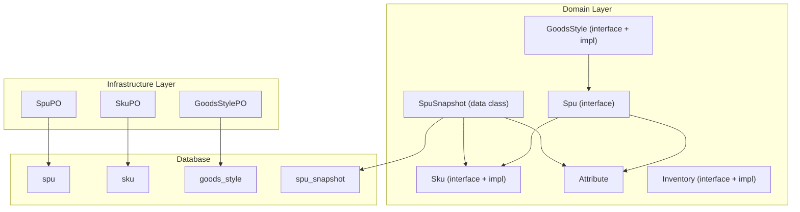
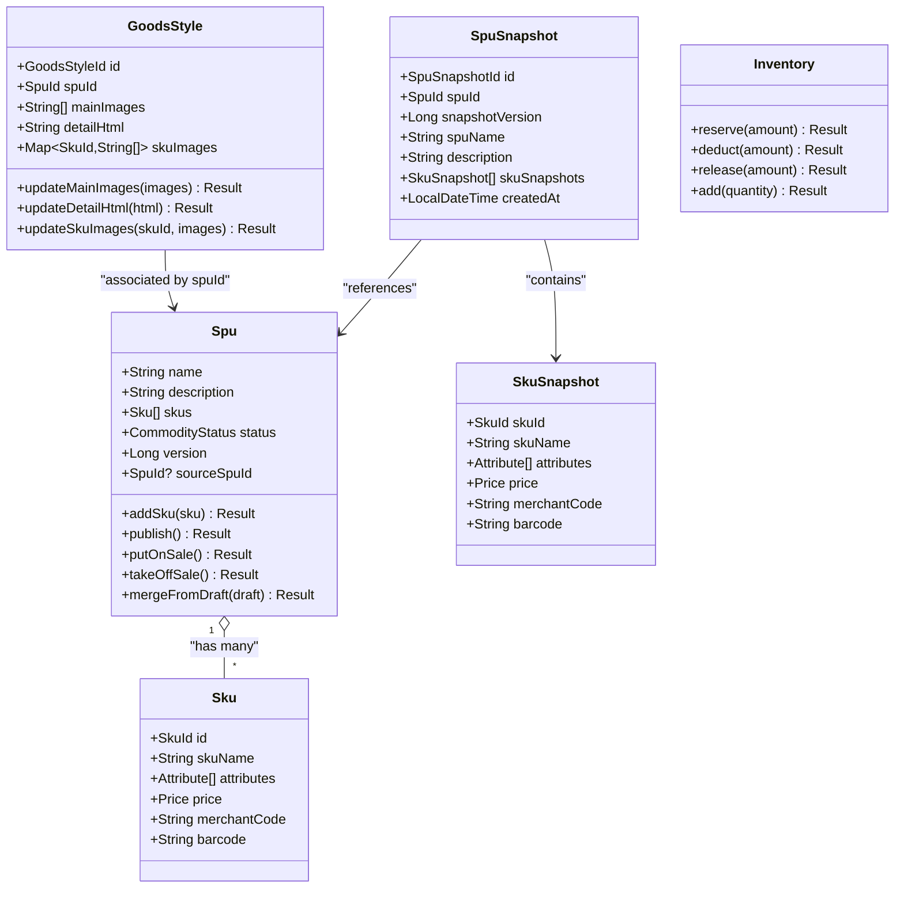
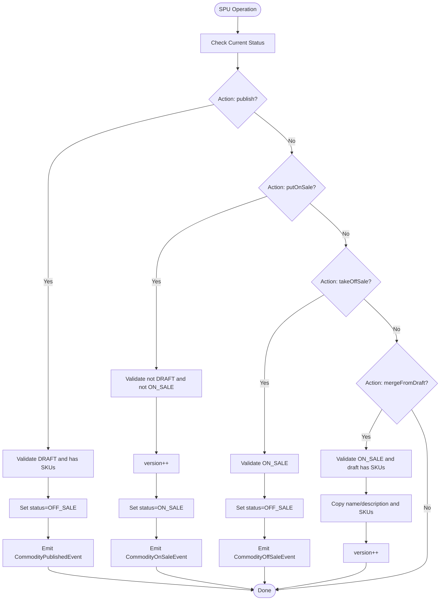
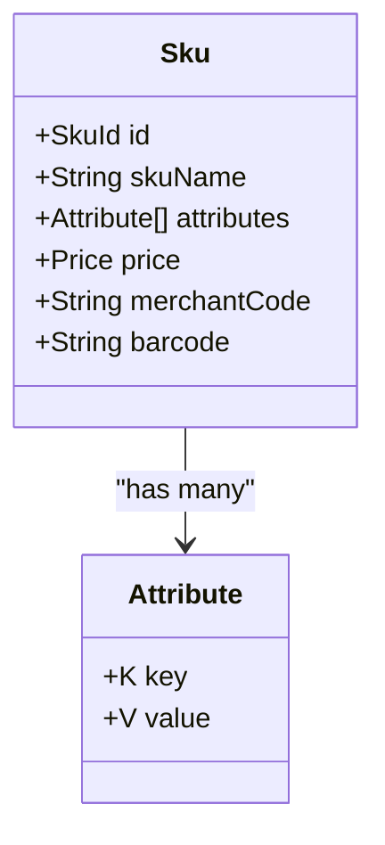
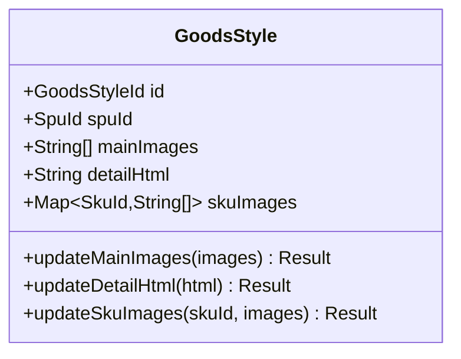
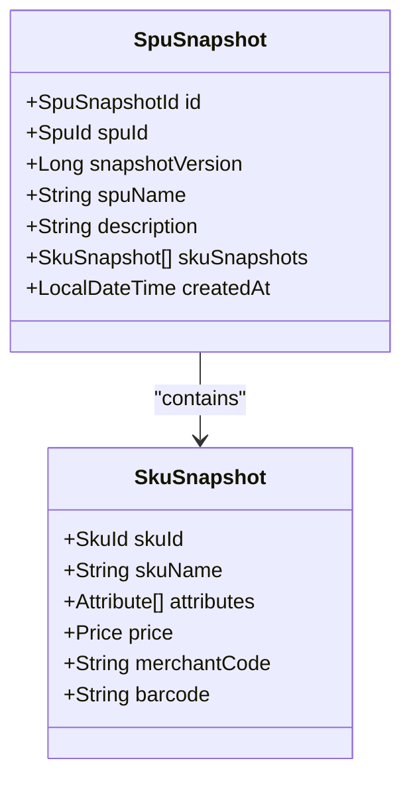
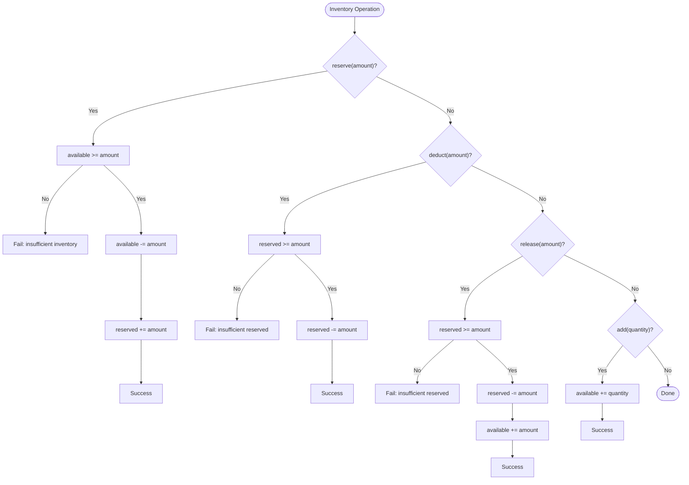
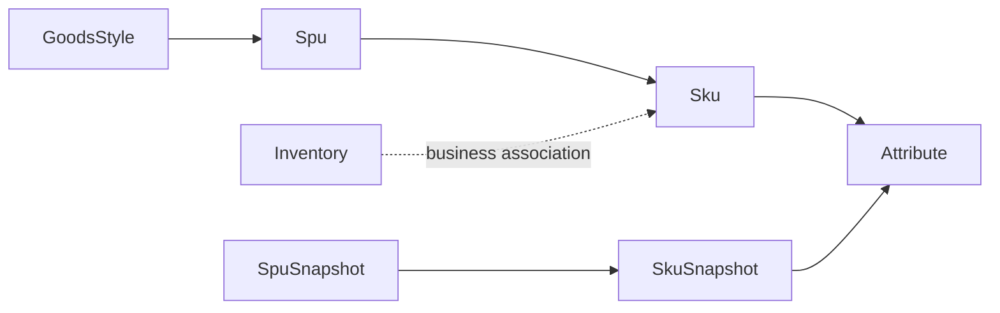
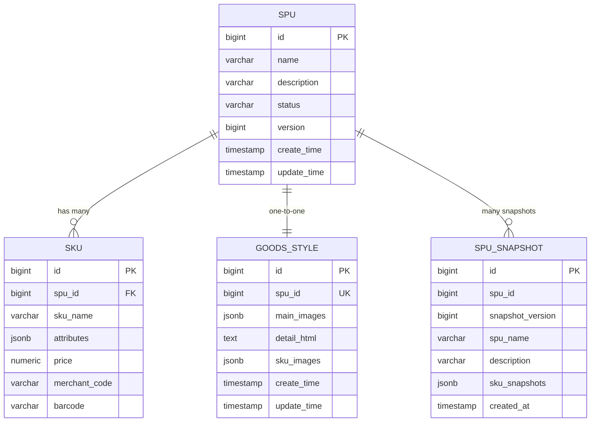
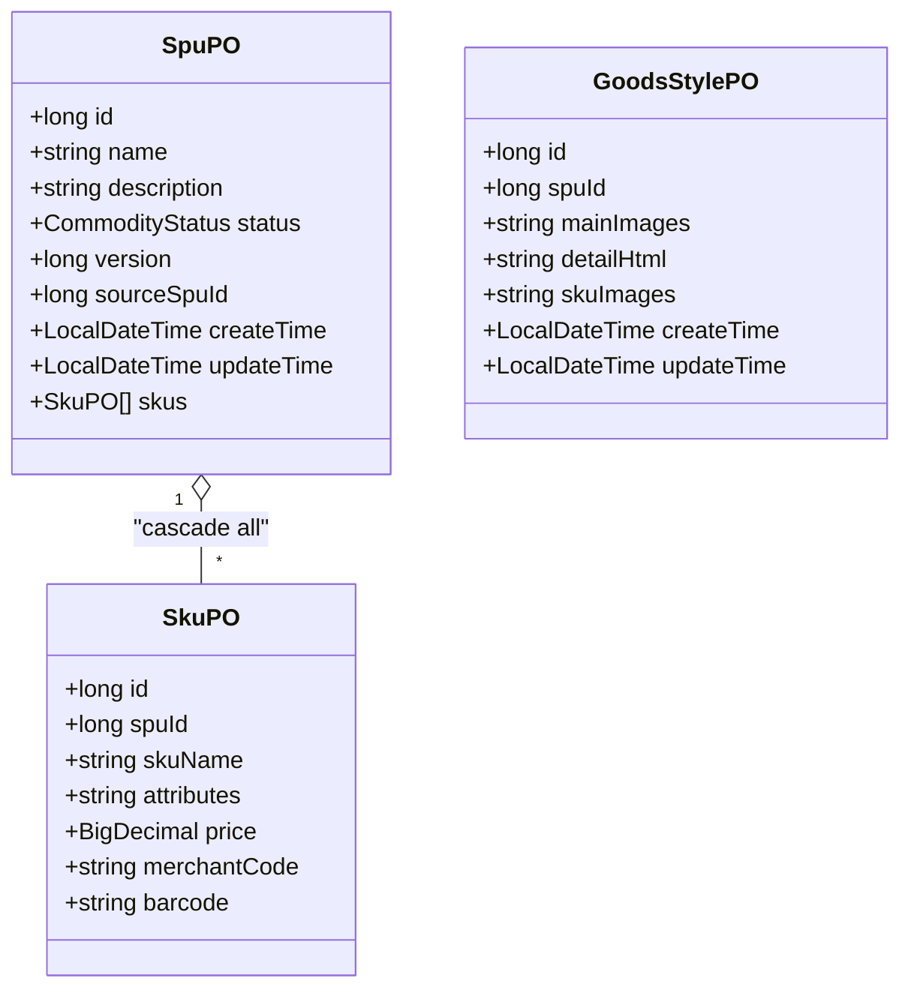

# Goods Data Model

<cite>
**Referenced Files in This Document**
- [Spu.kt](file://j-store-goods/src/main/kotlin/com/jstore/goods/domain/commodity/Spu.kt)
- [Sku.kt](file://j-store-goods/src/main/kotlin/com/jstore/goods/domain/commodity/Sku.kt)
- [GoodsStyle.kt](file://j-store-goods/src/main/kotlin/com/jstore/goods/domain/commodity/GoodsStyle.kt)
- [SpuSnapshot.kt](file://j-store-goods/src/main/kotlin/com/jstore/goods/domain/commodity/snapshot/SpuSnapshot.kt)
- [Attribute.kt](file://j-store-goods/src/main/kotlin/com/jstore/goods/domain/commodity/Attribute.kt)
- [SpuImpl.kt](file://j-store-goods/src/main/kotlin/com/jstore/goods/domain/commodity/SpuImpl.kt)
- [CommodityStatus.kt](file://j-store-goods/src/main/kotlin/com/jstore/goods/domain/commodity/CommodityStatus.kt)
- [SpuFactory.kt](file://j-store-goods/src/main/kotlin/com/jstore/goods/domain/commodity/SpuFactory.kt)
- [Inventory.kt](file://j-store-goods/src/main/kotlin/com/jstore/goods/domain/inventory/Inventory.kt)
- [04-goods-spu-sku-snapshot.sql](file://docker/postgres/init/04-goods-spu-sku-snapshot.sql)
- [07-goods-style-sku-code.sql](file://docker/postgres/init/07-goods-style-sku-code.sql)
- [SpuPO.kt](file://j-store-goods-infrastructure/src/main/kotlin/com/jstore/goods/domain/commodity/persistence/SpuPO.kt)
- [SkuPO.kt](file://j-store-goods-infrastructure/src/main/kotlin/com/jstore/goods/domain/commodity/persistence/SkuPO.kt)
- [GoodsStylePO.kt](file://j-store-goods-infrastructure/src/main/kotlin/com/jstore/goods/domain/commodity/persistence/GoodsStylePO.kt)
</cite>

## Table of Contents
1. Introduction
2. Project Structure
3. Core Components
4. Architecture Overview
5. Detailed Component Analysis
6. Dependency Analysis
7. Performance Considerations
8. Troubleshooting Guide
9. Conclusion

## Introduction
This document provides a comprehensive data model for the Goods domain, focusing on:
- SPU (Standard Product Unit): product identity, attributes, categories, and metadata
- SKU (Stock Keeping Unit): variant-specific details, pricing, and identifiers
- GoodsStyle: presentation assets such as images and detail HTML
- SpuSnapshot: immutable snapshots for version control and draft/publish workflows
- Inventory: stock reservation and allocation mechanisms tied to SKUs

It includes database schema diagrams, validation rules, and relationships between goods and inventory records.

## Project Structure
The Goods domain is implemented across multiple modules:
- Domain layer defines entities, value objects, factories, and state transitions
- Infrastructure layer maps domain models to relational tables via JPA POs
- Database migrations define the canonical schema for SPU, SKU, GoodsStyle, and snapshots

[No sources needed since this diagram shows conceptual module structure]

## Core Components
- SPU: Represents a product with name, description, status, version, and a read-only view of its SKUs. Supports lifecycle transitions (draft, off-sale, on-sale), publishing, and merging from drafts.
- SKU: Variant-level entity with name, attributes, price, merchant code, and barcode.
- GoodsStyle: Presentation layer for main images, detail HTML, and per-SKU images.
- SpuSnapshot: Immutable snapshot capturing SPU and SKU state at a point in time, used for order history and price/attribute traceability.
- Attribute: Generic key-value pair for flexible attribute storage.
- Inventory: TCC-based stock model supporting reserve, deduct, release, and add operations with concurrency safeguards.

**Section sources**
- [Spu.kt:11-44](file://j-store-goods/src/main/kotlin/com/jstore/goods/domain/commodity/Spu.kt#L11-L44)
- [Sku.kt:9-33](file://j-store-goods/src/main/kotlin/com/jstore/goods/domain/commodity/Sku.kt#L9-L33)
- [GoodsStyle.kt:9-51](file://j-store-goods/src/main/kotlin/com/jstore/goods/domain/commodity/GoodsStyle.kt#L9-L51)
- [SpuSnapshot.kt:18-44](file://j-store-goods/src/main/kotlin/com/jstore/goods/domain/commodity/snapshot/SpuSnapshot.kt#L18-L44)
- [Attribute.kt:3-6](file://j-store-goods/src/main/kotlin/com/jstore/goods/domain/commodity/Attribute.kt#L3-L6)
- [Inventory.kt:22-76](file://j-store-goods/src/main/kotlin/com/jstore/goods/domain/inventory/Inventory.kt#L22-L76)

## Architecture Overview
The Goods data model separates mutable domain aggregates (SPU, SKU, GoodsStyle) from immutable snapshots (SpuSnapshot). Persistence is handled by JPA POs that map directly to Postgres tables defined by migration scripts. Inventory operations are modeled as TCC transactions ensuring consistency during reservations and allocations.

**Diagram sources**
- [Spu.kt:11-44](file://j-store-goods/src/main/kotlin/com/jstore/goods/domain/commodity/Spu.kt#L11-L44)
- [Sku.kt:9-33](file://j-store-goods/src/main/kotlin/com/jstore/goods/domain/commodity/Sku.kt#L9-L33)
- [GoodsStyle.kt:9-51](file://j-store-goods/src/main/kotlin/com/jstore/goods/domain/commodity/GoodsStyle.kt#L9-L51)
- [SpuSnapshot.kt:18-44](file://j-store-goods/src/main/kotlin/com/jstore/goods/domain/commodity/snapshot/SpuSnapshot.kt#L18-L44)
- [Inventory.kt:22-76](file://j-store-goods/src/main/kotlin/com/jstore/goods/domain/inventory/Inventory.kt#L22-L76)

## Detailed Component Analysis

### SPU Entity
- Fields: name, description, status, version, sourceSpuId (for draft copies)
- Lifecycle: DRAFT → OFF_SALE (publish), OFF_SALE ↔ ON_SALE (putOnSale/takeOffSale)
- Versioning: version increments on putOnSale and mergeFromDraft
- Draft workflow: createDraftCopy produces a new SPU linked to source; mergeFromDraft updates current SPU when valid

Validation rules:
- publish requires DRAFT status and at least one SKU
- putOnSale disallows DRAFT and already ON_SALE states
- takeOffSale requires ON_SALE state
- mergeFromDraft requires ON_SALE state and non-empty draft SKUs

**Diagram sources**
- [SpuImpl.kt:51-105](file://j-store-goods/src/main/kotlin/com/jstore/goods/domain/commodity/SpuImpl.kt#L51-L105)
- [CommodityStatus.kt:3-10](file://j-store-goods/src/main/kotlin/com/jstore/goods/domain/commodity/CommodityStatus.kt#L3-L10)

**Section sources**
- [Spu.kt:11-44](file://j-store-goods/src/main/kotlin/com/jstore/goods/domain/commodity/Spu.kt#L11-L44)
- [SpuImpl.kt:38-105](file://j-store-goods/src/main/kotlin/com/jstore/goods/domain/commodity/SpuImpl.kt#L38-L105)
- [SpuFactory.kt:56-75](file://j-store-goods/src/main/kotlin/com/jstore/goods/domain/commodity/SpuFactory.kt#L56-L75)
- [CommodityStatus.kt:3-10](file://j-store-goods/src/main/kotlin/com/jstore/goods/domain/commodity/CommodityStatus.kt#L3-L10)

### SKU Entity
- Fields: skuName, attributes (list of key/value pairs), price (in cents), merchantCode, barcode
- Uniqueness: attribute combinations must be unique within an SPU
- Pricing: stored as integer cents for precision

Validation rules:
- Duplicate attribute combination rejected on addSku
- Price must be non-negative (enforced by business logic where created)

**Diagram sources**
- [Sku.kt:9-33](file://j-store-goods/src/main/kotlin/com/jstore/goods/domain/commodity/Sku.kt#L9-L33)
- [Attribute.kt:3-6](file://j-store-goods/src/main/kotlin/com/jstore/goods/domain/commodity/Attribute.kt#L3-L6)

**Section sources**
- [Sku.kt:9-33](file://j-store-goods/src/main/kotlin/com/jstore/goods/domain/commodity/Sku.kt#L9-L33)
- [SpuImpl.kt:38-49](file://j-store-goods/src/main/kotlin/com/jstore/goods/domain/commodity/SpuImpl.kt#L38-L49)

### GoodsStyle Entity
- Fields: spuId, mainImages (ordered list), detailHtml (rich text), skuImages (map from skuId to image list)
- Validation: duplicate image keys rejected for both main and SKU images

**Diagram sources**
- [GoodsStyle.kt:9-51](file://j-store-goods/src/main/kotlin/com/jstore/goods/domain/commodity/GoodsStyle.kt#L9-L51)

**Section sources**
- [GoodsStyle.kt:9-51](file://j-store-goods/src/main/kotlin/com/jstore/goods/domain/commodity/GoodsStyle.kt#L9-L51)

### SpuSnapshot Entity
- Purpose: immutable record of SPU and SKU state at a specific snapshotVersion
- Fields: spuId, snapshotVersion, spuName, description, skuSnapshots, createdAt
- Used by orders to preserve historical prices and attributes

**Diagram sources**
- [SpuSnapshot.kt:18-44](file://j-store-goods/src/main/kotlin/com/jstore/goods/domain/commodity/snapshot/SpuSnapshot.kt#L18-L44)

**Section sources**
- [SpuSnapshot.kt:18-44](file://j-store-goods/src/main/kotlin/com/jstore/goods/domain/commodity/snapshot/SpuSnapshot.kt#L18-L44)

### Inventory Entity
- Purpose: TCC-based stock management for SKUs
- Operations: reserve (pre-allocate), deduct (confirm consumption), release (rollback reservation), add (restock)
- Concurrency: uses storageLock concept; implementation enforces available/reserved checks

**Diagram sources**
- [Inventory.kt:38-76](file://j-store-goods/src/main/kotlin/com/jstore/goods/domain/inventory/Inventory.kt#L38-L76)

**Section sources**
- [Inventory.kt:22-76](file://j-store-goods/src/main/kotlin/com/jstore/goods/domain/inventory/Inventory.kt#L22-L76)

## Dependency Analysis
- SPU depends on Sku and Attribute for composition
- GoodsStyle depends on SpuId and SkuId for associations
- SpuSnapshot depends on SkuSnapshot and Attribute for immutable representation
- Inventory operates independently but is logically associated with SKUs through business processes

**Diagram sources**
- [Spu.kt:11-44](file://j-store-goods/src/main/kotlin/com/jstore/goods/domain/commodity/Spu.kt#L11-L44)
- [Sku.kt:9-33](file://j-store-goods/src/main/kotlin/com/jstore/goods/domain/commodity/Sku.kt#L9-L33)
- [GoodsStyle.kt:9-51](file://j-store-goods/src/main/kotlin/com/jstore/goods/domain/commodity/GoodsStyle.kt#L9-L51)
- [SpuSnapshot.kt:18-44](file://j-store-goods/src/main/kotlin/com/jstore/goods/domain/commodity/snapshot/SpuSnapshot.kt#L18-L44)
- [Inventory.kt:22-76](file://j-store-goods/src/main/kotlin/com/jstore/goods/domain/inventory/Inventory.kt#L22-L76)

**Section sources**
- [Spu.kt:11-44](file://j-store-goods/src/main/kotlin/com/jstore/goods/domain/commodity/Spu.kt#L11-L44)
- [Sku.kt:9-33](file://j-store-goods/src/main/kotlin/com/jstore/goods/domain/commodity/Sku.kt#L9-L33)
- [GoodsStyle.kt:9-51](file://j-store-goods/src/main/kotlin/com/jstore/goods/domain/commodity/GoodsStyle.kt#L9-L51)
- [SpuSnapshot.kt:18-44](file://j-store-goods/src/main/kotlin/com/jstore/goods/domain/commodity/snapshot/SpuSnapshot.kt#L18-L44)
- [Inventory.kt:22-76](file://j-store-goods/src/main/kotlin/com/jstore/goods/domain/inventory/Inventory.kt#L22-L76)

## Performance Considerations
- JSONB columns for attributes and images allow flexible schemas while maintaining query performance via indexes
- Unique constraints on spu_id and (spu_id, snapshot_version) prevent duplicates and support efficient lookups
- Eager loading of SKUs in SpuPO can increase memory usage; consider lazy loading for large catalogs
- Price stored as integer cents avoids floating-point rounding issues and improves comparison speed

[No sources needed since this section provides general guidance]

## Troubleshooting Guide
Common validation errors and their causes:
- Duplicate SKU attributes: ensure attribute combinations are unique within an SPU
- Invalid status transitions: verify current SPU status before calling publish/putOnSale/takeOffSale
- Insufficient inventory: check availableQuantity and reservedQuantity before reserve/deduct/release
- Duplicate image keys: ensure image lists contain distinct keys for main and SKU images

Operational tips:
- Use draft copies to modify products without affecting live listings
- Always create snapshots on publish or on sale changes to maintain historical accuracy
- Monitor inventory locks and TCC outcomes to avoid inconsistent states

**Section sources**
- [SpuImpl.kt:51-105](file://j-store-goods/src/main/kotlin/com/jstore/goods/domain/commodity/SpuImpl.kt#L51-L105)
- [Inventory.kt:44-76](file://j-store-goods/src/main/kotlin/com/jstore/goods/domain/inventory/Inventory.kt#L44-L76)
- [GoodsStyle.kt:31-50](file://j-store-goods/src/main/kotlin/com/jstore/goods/domain/commodity/GoodsStyle.kt#L31-L50)

## Conclusion
The Goods data model provides a robust foundation for e-commerce product management:
- SPU and SKU separate product identity from variants, enabling flexible attribute modeling
- GoodsStyle encapsulates presentation assets independently from core product data
- SpuSnapshot ensures historical integrity for orders and analytics
- Inventory supports reliable stock operations with TCC semantics

Adhering to the documented validation rules and workflows will ensure data consistency and operational reliability.

[No sources needed since this section summarizes without analyzing specific files]

## Appendices

### Database Schema Diagram

**Diagram sources**
- [04-goods-spu-sku-snapshot.sql:6-55](file://docker/postgres/init/04-goods-spu-sku-snapshot.sql#L6-L55)
- [07-goods-style-sku-code.sql:6-32](file://docker/postgres/init/07-goods-style-sku-code.sql#L6-L32)

**Section sources**
- [04-goods-spu-sku-snapshot.sql:6-55](file://docker/postgres/init/04-goods-spu-sku-snapshot.sql#L6-L55)
- [07-goods-style-sku-code.sql:6-32](file://docker/postgres/init/07-goods-style-sku-code.sql#L6-L32)

### Persistence Mapping

**Diagram sources**
- [SpuPO.kt:7-39](file://j-store-goods-infrastructure/src/main/kotlin/com/jstore/goods/domain/commodity/persistence/SpuPO.kt#L7-L39)
- [SkuPO.kt:6-31](file://j-store-goods-infrastructure/src/main/kotlin/com/jstore/goods/domain/commodity/persistence/SkuPO.kt#L6-L31)
- [GoodsStylePO.kt:6-30](file://j-store-goods-infrastructure/src/main/kotlin/com/jstore/goods/domain/commodity/persistence/GoodsStylePO.kt#L6-L30)

**Section sources**
- [SpuPO.kt:7-39](file://j-store-goods-infrastructure/src/main/kotlin/com/jstore/goods/domain/commodity/persistence/SpuPO.kt#L7-L39)
- [SkuPO.kt:6-31](file://j-store-goods-infrastructure/src/main/kotlin/com/jstore/goods/domain/commodity/persistence/SkuPO.kt#L6-L31)
- [GoodsStylePO.kt:6-30](file://j-store-goods-infrastructure/src/main/kotlin/com/jstore/goods/domain/commodity/persistence/GoodsStylePO.kt#L6-L30)