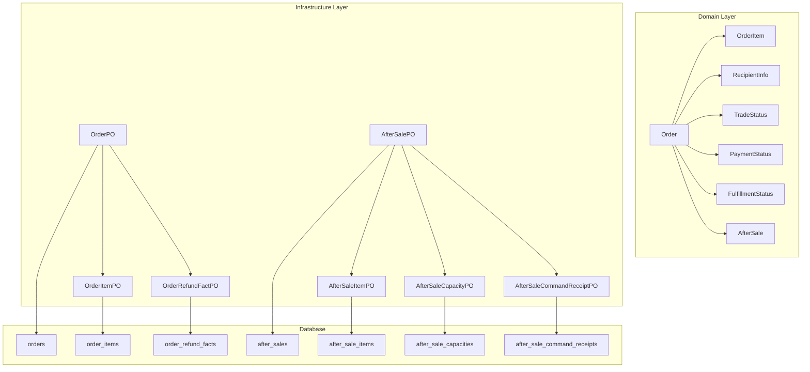
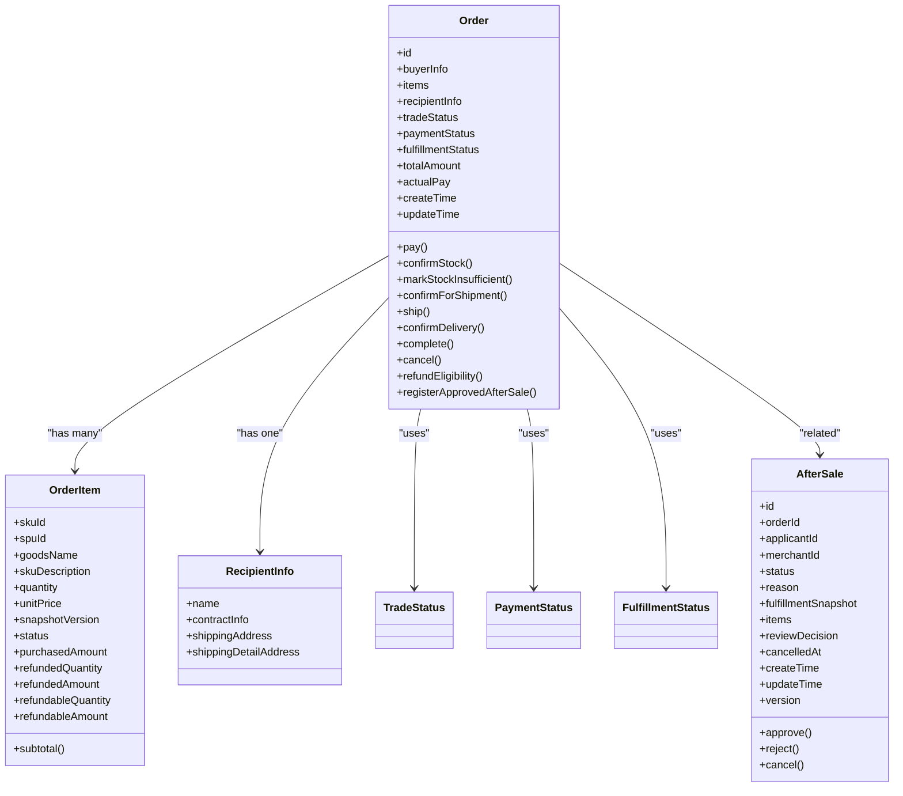
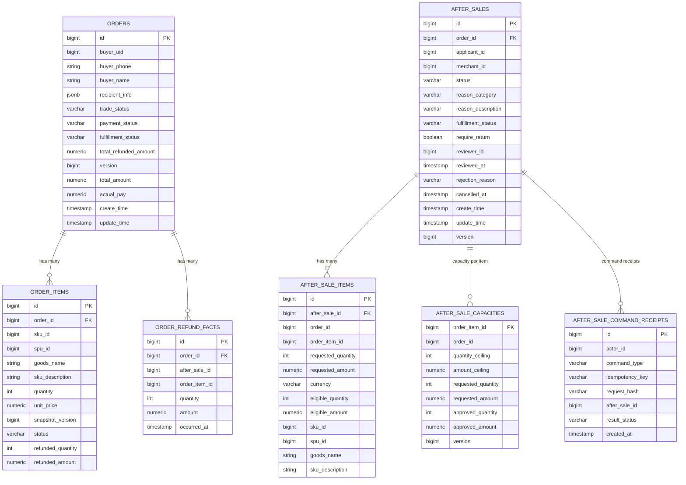
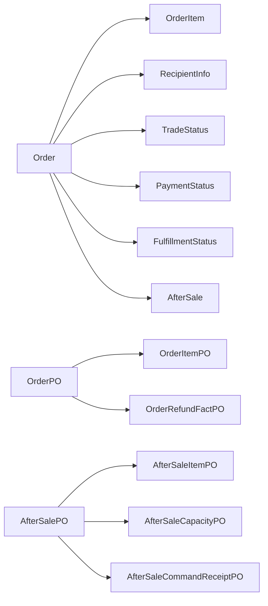
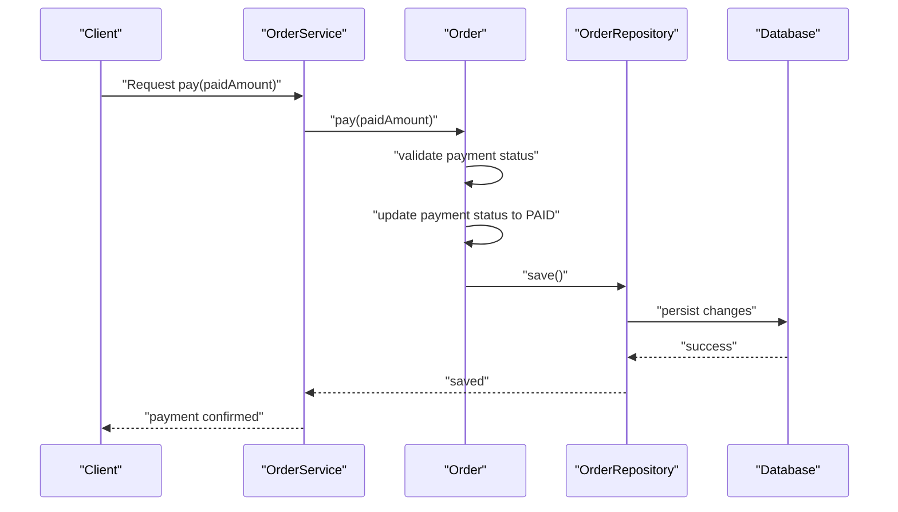
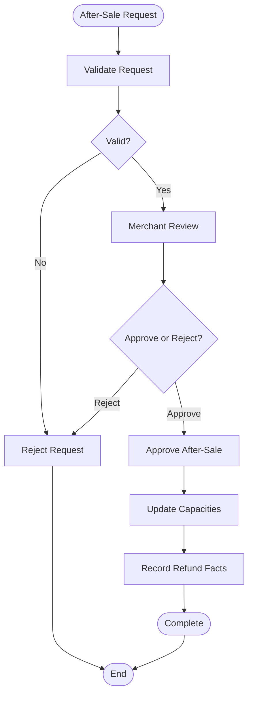

# Order Data Model

<cite>
**Referenced Files in This Document**
- [Order.kt](file://j-store-order/src/main/kotlin/com/jstore/order/domain/order/Order.kt)
- [OrderItem.kt](file://j-store-order/src/main/kotlin/com/jstore/order/domain/order/OrderItem.kt)
- [RecipientInfo.kt](file://j-store-order/src/main/kotlin/com/jstore/order/domain/order/RecipientInfo.kt)
- [TradeStatus.kt](file://j-store-order/src/main/kotlin/com/jstore/order/domain/order/TradeStatus.kt)
- [PaymentStatus.kt](file://j-store-order/src/main/kotlin/com/jstore/order/domain/order/PaymentStatus.kt)
- [FulfillmentStatus.kt](file://j-store-order/src/main/kotlin/com/jstore/order/domain/order/FulfillmentStatus.kt)
- [AfterSale.kt](file://j-store-order/src/main/kotlin/com/jstore/order/domain/aftersale/AfterSale.kt)
- [OrderPO.kt](file://j-store-order-infrastructure/src/main/kotlin/com/jstore/order/domain/order/persistence/OrderPO.kt)
- [AfterSalePO.kt](file://j-store-order-infrastructure/src/main/kotlin/com/jstore/order/domain/aftersale/persistence/AfterSalePO.kt)
- [V20260731__order_status_dimensions.sql](file://j-store-boot/src/main/resources/db/migration/V20260731__order_status_dimensions.sql)
- [V20260803__order_after_sale_aggregate.sql](file://j-store-boot/src/main/resources/db/migration/V20260803__order_after_sale_aggregate.sql)
- [03-order-address-jsonb.sql](file://docker/postgres/init/03-order-address-jsonb.sql)
- [05-order-consignee-info.sql](file://docker/postgres/init/05-order-consignee-info.sql)
</cite>

## Table of Contents
1. [Introduction](#introduction)
2. [Project Structure](#project-structure)
3. [Core Components](#core-components)
4. [Architecture Overview](#architecture-overview)
5. [Detailed Component Analysis](#detailed-component-analysis)
6. [Dependency Analysis](#dependency-analysis)
7. [Performance Considerations](#performance-considerations)
8. [Troubleshooting Guide](#troubleshooting-guide)
9. [Conclusion](#conclusion)
10. [Appendices](#appendices)

## Introduction
This document provides a comprehensive data model for the Order domain, focusing on:
- The Order entity and its status dimensions (trade, payment, fulfillment).
- Recipient information with address components and geographical data.
- The relationship between orders and order items, including pricing calculations and quantity management.
- The after-sale aggregate structure supporting returns and refunds.
- Database schema diagrams showing table relationships, foreign key constraints, and indexes.
- Data validation rules enforced at the database level, including status transition constraints and business rule validations.
- Data migration paths for order status dimensions and after-sale features using Flyway migrations.

## Project Structure
The Order domain is implemented across multiple modules:
- Domain layer defines entities and value objects (Order, OrderItem, RecipientInfo, statuses).
- Infrastructure layer maps domain models to JPA persistence objects and tables.
- Database migrations define schema evolution and constraints.

**Diagram sources**
- [Order.kt](file://j-store-order/src/main/kotlin/com/jstore/order/domain/order/Order.kt)
- [OrderItem.kt](file://j-store-order/src/main/kotlin/com/jstore/order/domain/order/OrderItem.kt)
- [RecipientInfo.kt](file://j-store-order/src/main/kotlin/com/jstore/order/domain/order/RecipientInfo.kt)
- [TradeStatus.kt](file://j-store-order/src/main/kotlin/com/jstore/order/domain/order/TradeStatus.kt)
- [PaymentStatus.kt](file://j-store-order/src/main/kotlin/com/jstore/order/domain/order/PaymentStatus.kt)
- [FulfillmentStatus.kt](file://j-store-order/src/main/kotlin/com/jstore/order/domain/order/FulfillmentStatus.kt)
- [AfterSale.kt](file://j-store-order/src/main/kotlin/com/jstore/order/domain/aftersale/AfterSale.kt)
- [OrderPO.kt](file://j-store-order-infrastructure/src/main/kotlin/com/jstore/order/domain/order/persistence/OrderPO.kt)
- [AfterSalePO.kt](file://j-store-order-infrastructure/src/main/kotlin/com/jstore/order/domain/aftersale/persistence/AfterSalePO.kt)

**Section sources**
- [Order.kt](file://j-store-order/src/main/kotlin/com/jstore/order/domain/order/Order.kt)
- [OrderItem.kt](file://j-store-order/src/main/kotlin/com/jstore/order/domain/order/OrderItem.kt)
- [RecipientInfo.kt](file://j-store-order/src/main/kotlin/com/jstore/order/domain/order/RecipientInfo.kt)
- [TradeStatus.kt](file://j-store-order/src/main/kotlin/com/jstore/order/domain/order/TradeStatus.kt)
- [PaymentStatus.kt](file://j-store-order/src/main/kotlin/com/jstore/order/domain/order/PaymentStatus.kt)
- [FulfillmentStatus.kt](file://j-store-order/src/main/kotlin/com/jstore/order/domain/order/FulfillmentStatus.kt)
- [AfterSale.kt](file://j-store-order/src/main/kotlin/com/jstore/order/domain/aftersale/AfterSale.kt)
- [OrderPO.kt](file://j-store-order-infrastructure/src/main/kotlin/com/jstore/order/domain/order/persistence/OrderPO.kt)
- [AfterSalePO.kt](file://j-store-order-infrastructure/src/main/kotlin/com/jstore/order/domain/aftersale/persistence/AfterSalePO.kt)

## Core Components
- Order: Aggregate root representing an order with buyer info, recipient info, items, and three parallel status dimensions (trade, payment, fulfillment), plus refund tracking fields.
- OrderItem: Line item referencing goods via SKU and SPU IDs, capturing snapshot details, quantities, unit price, and refund accounting fields.
- RecipientInfo: Immutable shipping and contact details including internationalized geographic address and optional detail address.
- AfterSale: Aggregate capturing return/refund lifecycle, review decisions, and fulfillment snapshot.

Key responsibilities:
- Status transitions are modeled as methods on Order.
- Refund eligibility and approved after-sale registration update refund facts and totals.
- OrderItem exposes subtotal calculation and refundable metrics.

**Section sources**
- [Order.kt](file://j-store-order/src/main/kotlin/com/jstore/order/domain/order/Order.kt)
- [OrderItem.kt](file://j-store-order/src/main/kotlin/com/jstore/order/domain/order/OrderItem.kt)
- [RecipientInfo.kt](file://j-store-order/src/main/kotlin/com/jstore/order/domain/order/RecipientInfo.kt)
- [AfterSale.kt](file://j-store-order/src/main/kotlin/com/jstore/order/domain/aftersale/AfterSale.kt)

## Architecture Overview
The Order domain follows DDD principles with clear separation between domain models and persistence. JPA entities map directly to tables, while domain interfaces encapsulate business logic. Migrations evolve the schema to support new status dimensions and after-sale capabilities.

**Diagram sources**
- [Order.kt](file://j-store-order/src/main/kotlin/com/jstore/order/domain/order/Order.kt)
- [OrderItem.kt](file://j-store-order/src/main/kotlin/com/jstore/order/domain/order/OrderItem.kt)
- [RecipientInfo.kt](file://j-store-order/src/main/kotlin/com/jstore/order/domain/order/RecipientInfo.kt)
- [TradeStatus.kt](file://j-store-order/src/main/kotlin/com/jstore/order/domain/order/TradeStatus.kt)
- [PaymentStatus.kt](file://j-store-order/src/main/kotlin/com/jstore/order/domain/order/PaymentStatus.kt)
- [FulfillmentStatus.kt](file://j-store-order/src/main/kotlin/com/jstore/order/domain/order/FulfillmentStatus.kt)
- [AfterSale.kt](file://j-store-order/src/main/kotlin/com/jstore/order/domain/aftersale/AfterSale.kt)

## Detailed Component Analysis

### Order Entity
- Fields include identifiers, buyer info, recipient info, three status dimensions, monetary totals, timestamps, and refund-related aggregates.
- Methods implement state transitions for stock confirmation, payment, shipment, delivery, completion, cancellation, and after-sale registration.

Data model highlights:
- Parallel status dimensions allow independent tracking of trade, payment, and fulfillment states.
- Refund tracking includes total refunded amount and approved refund facts list.

**Section sources**
- [Order.kt](file://j-store-order/src/main/kotlin/com/jstore/order/domain/order/Order.kt)

### OrderItem Entity
- Captures product snapshot details (SKU/SPU IDs, names, descriptions), quantity, unit price, snapshot version, and item-level status.
- Tracks refund accounting: refunded quantity and amount; derived refundable quantity and amount.
- Provides subtotal calculation based on quantity and unit price.

Business rules:
- Quantity must be positive.
- Refunded quantity cannot exceed ordered quantity.
- Refunded amount cannot exceed unit price times quantity.

**Section sources**
- [OrderItem.kt](file://j-store-order/src/main/kotlin/com/jstore/order/domain/order/OrderItem.kt)

### RecipientInfo Entity
- Holds recipient name, contract info (contact details), internationalized geographic address, and optional detailed address.
- Uses I18nGeoAddress to support arbitrary-depth hierarchical addresses across countries.

Validation considerations:
- Address components should be validated against country-specific rules.
- Detail address is optional but recommended for precise delivery.

**Section sources**
- [RecipientInfo.kt](file://j-store-order/src/main/kotlin/com/jstore/order/domain/order/RecipientInfo.kt)

### AfterSale Aggregate
- Represents return/refund requests with applicant and merchant roles.
- Includes reason category/description, fulfillment snapshot, items, review decision, and cancellation timestamp.
- Supports approve, reject, and cancel operations.

Persistence mapping:
- after_sales, after_sale_items, after_sale_capacities, after_sale_command_receipts.

**Section sources**
- [AfterSale.kt](file://j-store-order/src/main/kotlin/com/jstore/order/domain/aftersale/AfterSale.kt)
- [AfterSalePO.kt](file://j-store-order-infrastructure/src/main/kotlin/com/jstore/order/domain/aftersale/persistence/AfterSalePO.kt)

### Persistence Mapping (JPA Entities)
- OrderPO maps to orders table with JSONB recipient_info and enum columns for status dimensions.
- OrderItemPO maps to order_items with snapshot and refund accounting fields.
- OrderRefundFactPO captures approved refund events per order item.
- AfterSalePO and related entities persist after-sale lifecycle and capacities.

Indexes and constraints:
- GIN indexes on JSONB columns for efficient querying.
- CHECK constraints enforce valid status values and business rules.
- Unique constraints prevent duplicate refund facts and idempotent command receipts.

**Section sources**
- [OrderPO.kt](file://j-store-order-infrastructure/src/main/kotlin/com/jstore/order/domain/order/persistence/OrderPO.kt)
- [AfterSalePO.kt](file://j-store-order-infrastructure/src/main/kotlin/com/jstore/order/domain/aftersale/persistence/AfterSalePO.kt)

### Database Schema Diagram

**Diagram sources**
- [OrderPO.kt](file://j-store-order-infrastructure/src/main/kotlin/com/jstore/order/domain/order/persistence/OrderPO.kt)
- [AfterSalePO.kt](file://j-store-order-infrastructure/src/main/kotlin/com/jstore/order/domain/aftersale/persistence/AfterSalePO.kt)
- [V20260731__order_status_dimensions.sql](file://j-store-boot/src/main/resources/db/migration/V20260731__order_status_dimensions.sql)
- [V20260803__order_after_sale_aggregate.sql](file://j-store-boot/src/main/resources/db/migration/V20260803__order_after_sale_aggregate.sql)

### Data Validation Rules (Database Level)
- Status dimension constraints:
  - trade_status: CREATED, ACTIVE, CLOSED, COMPLETED
  - payment_status: UNPAID, PAID, PARTIALLY_REFUNDED, REFUNDED
  - fulfillment_status: UNFULFILLED, PENDING_SHIPMENT, SHIPPED, DELIVERED
  - after_sale_status (legacy column removed): NONE, PROCESSING, PARTIALLY_COMPLETED, COMPLETED
- Business rule checks:
  - refunded_quantity >= 0 and <= quantity
  - refunded_amount >= 0 and <= unit_price * quantity
  - after_sale status transitions enforced by CHECK constraints
  - unique(order_id, after_sale_id, order_item_id) for refund facts
  - unique(actor_id, command_type, idempotency_key) for idempotency
- Indexes:
  - GIN indexes on JSONB columns (shipping_address, consignee_info)
  - Composite indexes on status + create_time for queries
  - Foreign keys from after_sale_items and order_refund_facts to parent tables

**Section sources**
- [V20260731__order_status_dimensions.sql](file://j-store-boot/src/main/resources/db/migration/V20260731__order_status_dimensions.sql)
- [V20260803__order_after_sale_aggregate.sql](file://j-store-boot/src/main/resources/db/migration/V20260803__order_after_sale_aggregate.sql)
- [03-order-address-jsonb.sql](file://docker/postgres/init/03-order-address-jsonb.sql)
- [05-order-consignee-info.sql](file://docker/postgres/init/05-order-consignee-info.sql)

### Data Migration Paths
- Address normalization:
  - Replace province/city/county with JSONB shipping_address supporting arbitrary depth and i18n.
  - Merge scattered consignee columns into unified consignee_info JSONB with GIN index.
- Status dimensions:
  - Introduce trade_status, payment_status, fulfillment_status with CHECK constraints and composite indexes.
- After-sale aggregate:
  - Create after_sales, after_sale_items, after_sale_capacities, after_sale_command_receipts, order_refund_facts.
  - Enforce business rules via CHECK constraints and unique constraints.

**Section sources**
- [03-order-address-jsonb.sql](file://docker/postgres/init/03-order-address-jsonb.sql)
- [05-order-consignee-info.sql](file://docker/postgres/init/05-order-consignee-info.sql)
- [V20260731__order_status_dimensions.sql](file://j-store-boot/src/main/resources/db/migration/V20260731__order_status_dimensions.sql)
- [V20260803__order_after_sale_aggregate.sql](file://j-store-boot/src/main/resources/db/migration/V20260803__order_after_sale_aggregate.sql)

## Dependency Analysis
- Order depends on OrderItem, RecipientInfo, and status enums.
- AfterSale aggregate depends on order context and item capacities.
- Persistence layer maps domain models to tables with cascading relationships.

**Diagram sources**
- [Order.kt](file://j-store-order/src/main/kotlin/com/jstore/order/domain/order/Order.kt)
- [OrderItem.kt](file://j-store-order/src/main/kotlin/com/jstore/order/domain/order/OrderItem.kt)
- [RecipientInfo.kt](file://j-store-order/src/main/kotlin/com/jstore/order/domain/order/RecipientInfo.kt)
- [TradeStatus.kt](file://j-store-order/src/main/kotlin/com/jstore/order/domain/order/TradeStatus.kt)
- [PaymentStatus.kt](file://j-store-order/src/main/kotlin/com/jstore/order/domain/order/PaymentStatus.kt)
- [FulfillmentStatus.kt](file://j-store-order/src/main/kotlin/com/jstore/order/domain/order/FulfillmentStatus.kt)
- [AfterSale.kt](file://j-store-order/src/main/kotlin/com/jstore/order/domain/aftersale/AfterSale.kt)
- [OrderPO.kt](file://j-store-order-infrastructure/src/main/kotlin/com/jstore/order/domain/order/persistence/OrderPO.kt)
- [AfterSalePO.kt](file://j-store-order-infrastructure/src/main/kotlin/com/jstore/order/domain/aftersale/persistence/AfterSalePO.kt)

**Section sources**
- [Order.kt](file://j-store-order/src/main/kotlin/com/jstore/order/domain/order/Order.kt)
- [OrderItem.kt](file://j-store-order/src/main/kotlin/com/jstore/order/domain/order/OrderItem.kt)
- [RecipientInfo.kt](file://j-store-order/src/main/kotlin/com/jstore/order/domain/order/RecipientInfo.kt)
- [TradeStatus.kt](file://j-store-order/src/main/kotlin/com/jstore/order/domain/order/TradeStatus.kt)
- [PaymentStatus.kt](file://j-store-order/src/main/kotlin/com/jstore/order/domain/order/PaymentStatus.kt)
- [FulfillmentStatus.kt](file://j-store-order/src/main/kotlin/com/jstore/order/domain/order/FulfillmentStatus.kt)
- [AfterSale.kt](file://j-store-order/src/main/kotlin/com/jstore/order/domain/aftersale/AfterSale.kt)
- [OrderPO.kt](file://j-store-order-infrastructure/src/main/kotlin/com/jstore/order/domain/order/persistence/OrderPO.kt)
- [AfterSalePO.kt](file://j-store-order-infrastructure/src/main/kotlin/com/jstore/order/domain/aftersale/persistence/AfterSalePO.kt)

## Performance Considerations
- Use GIN indexes on JSONB columns for fast address and consignee queries.
- Composite indexes on status + create_time optimize common filtering and sorting.
- Avoid heavy joins by leveraging denormalized snapshots in order items.
- Monitor transaction sizes when updating multiple rows (e.g., bulk refund updates).

[No sources needed since this section provides general guidance]

## Troubleshooting Guide
Common issues and resolutions:
- Invalid status transitions: Ensure CHECK constraints match allowed values; verify application logic enforces transitions.
- Duplicate refund facts: Unique constraint prevents duplicates; check idempotency keys.
- Address parsing errors: Validate JSONB structure against expected schema; use migration scripts to normalize legacy data.
- After-sale capacity violations: Verify requested/approved amounts do not exceed ceilings; update capacities before approvals.

**Section sources**
- [V20260731__order_status_dimensions.sql](file://j-store-boot/src/main/resources/db/migration/V20260731__order_status_dimensions.sql)
- [V20260803__order_after_sale_aggregate.sql](file://j-store-boot/src/main/resources/db/migration/V20260803__order_after_sale_aggregate.sql)
- [03-order-address-jsonb.sql](file://docker/postgres/init/03-order-address-jsonb.sql)
- [05-order-consignee-info.sql](file://docker/postgres/init/05-order-consignee-info.sql)

## Conclusion
The Order data model provides a robust foundation for e-commerce order processing with clear separation of concerns, strong validation, and scalable schema design. The integration of JSONB for addresses and consignee info enables flexibility, while strict constraints ensure data integrity. The after-sale aggregate supports complex return/refund workflows with auditability and idempotency.

[No sources needed since this section summarizes without analyzing specific files]

## Appendices

### Sequence Diagram: Order Payment Flow

**Diagram sources**
- [Order.kt](file://j-store-order/src/main/kotlin/com/jstore/order/domain/order/Order.kt)
- [OrderPO.kt](file://j-store-order-infrastructure/src/main/kotlin/com/jstore/order/domain/order/persistence/OrderPO.kt)

### Flowchart: After-Sale Approval Process

**Diagram sources**
- [AfterSale.kt](file://j-store-order/src/main/kotlin/com/jstore/order/domain/aftersale/AfterSale.kt)
- [AfterSalePO.kt](file://j-store-order-infrastructure/src/main/kotlin/com/jstore/order/domain/aftersale/persistence/AfterSalePO.kt)