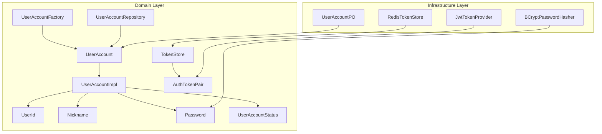
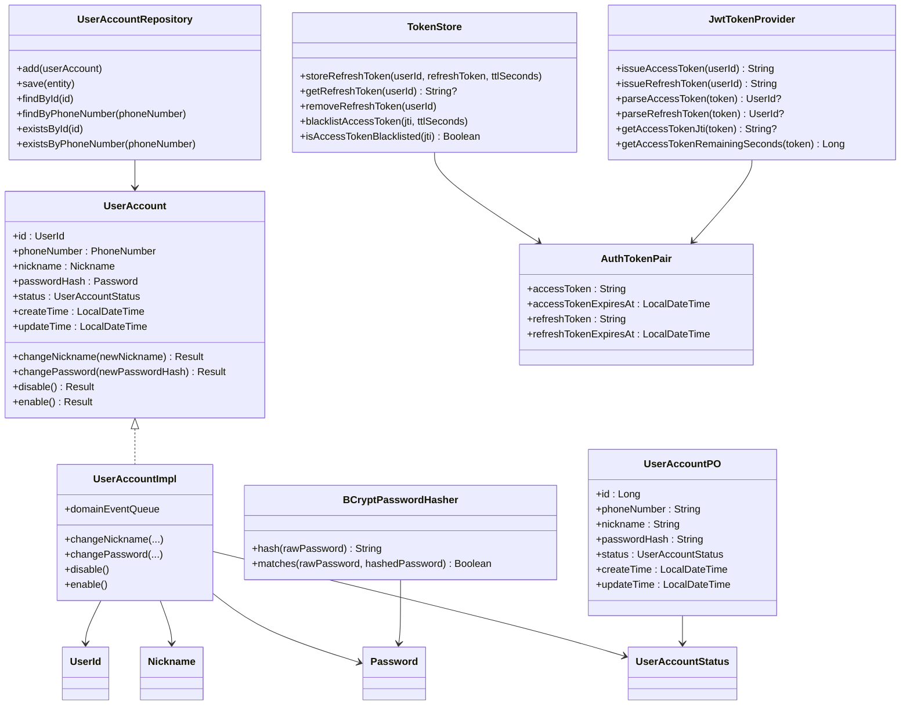
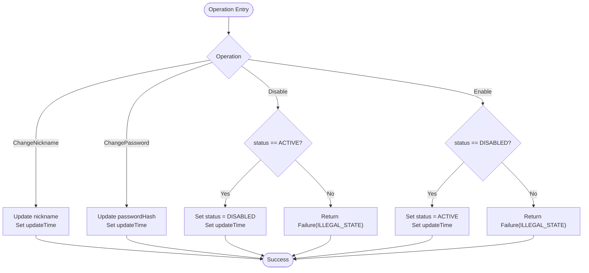
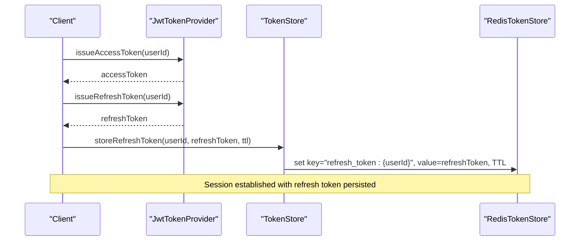
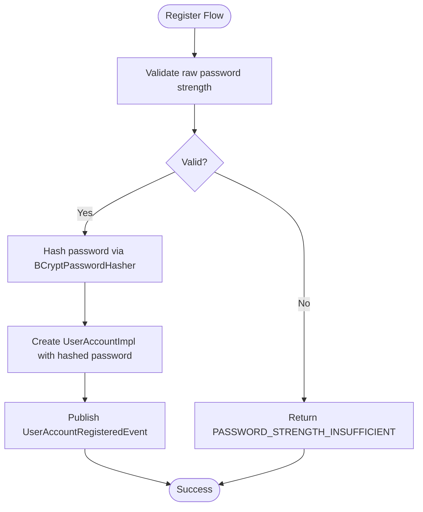
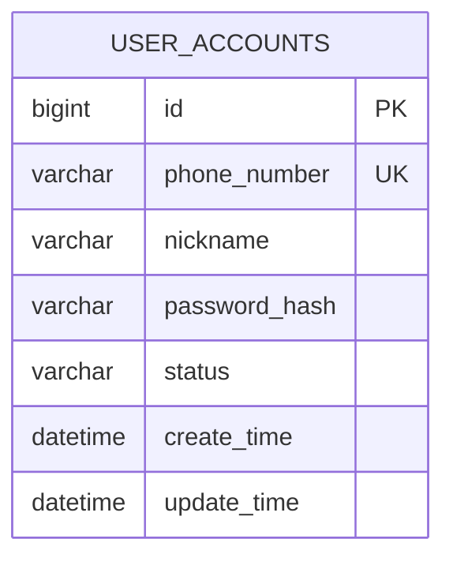
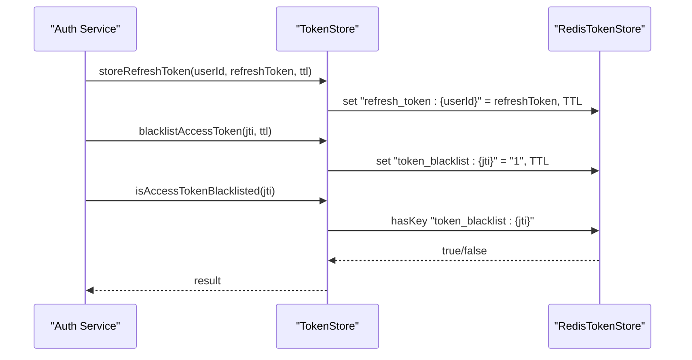
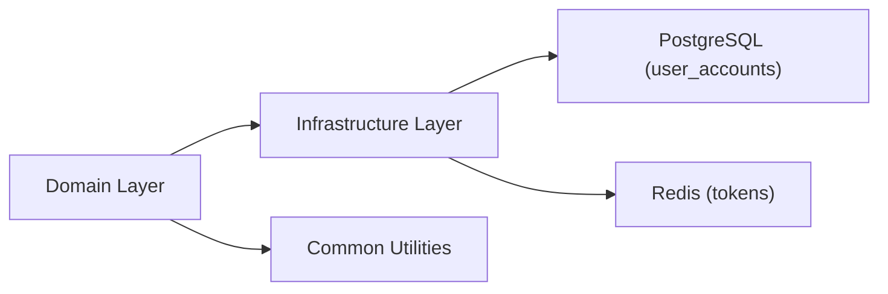

# User Data Model

<cite>
**Referenced Files in This Document**
- [UserAccount.kt](file://j-store-user/src/main/kotlin/com/jstore/user/domain/useraccount/UserAccount.kt)
- [UserAccountImpl.kt](file://j-store-user/src/main/kotlin/com/jstore/user/domain/useraccount/UserAccountImpl.kt)
- [AuthTokenPair.kt](file://j-store-user/src/main/kotlin/com/jstore/user/domain/useraccount/AuthTokenPair.kt)
- [Password.kt](file://j-store-user/src/main/kotlin/com/jstore/user/domain/useraccount/Password.kt)
- [UserAccountStatus.kt](file://j-store-user/src/main/kotlin/com/jstore/user/domain/useraccount/UserAccountStatus.kt)
- [UserId.kt](file://j-store-user/src/main/kotlin/com/jstore/user/domain/useraccount/UserId.kt)
- [Nickname.kt](file://j-store-user/src/main/kotlin/com/jstore/user/domain/useraccount/Nickname.kt)
- [UserAccountFactory.kt](file://j-store-user/src/main/kotlin/com/jstore/user/domain/useraccount/UserAccountFactory.kt)
- [UserAccountRepository.kt](file://j-store-user/src/main/kotlin/com/jstore/user/domain/useraccount/UserAccountRepository.kt)
- [TokenStore.kt](file://j-store-user/src/main/kotlin/com/jstore/user/domain/useraccount/TokenStore.kt)
- [UserAccountPO.kt](file://j-store-user-infrastructure/src/main/kotlin/com/jstore/user/domain/useraccount/persistence/UserAccountPO.kt)
- [BCryptPasswordHasher.kt](file://j-store-user-infrastructure/src/main/kotlin/com/jstore/user/domain/useraccount/BCryptPasswordHasher.kt)
- [JwtTokenProvider.kt](file://j-store-user-infrastructure/src/main/kotlin/com/jstore/user/domain/useraccount/JwtTokenProvider.kt)
- [RedisTokenStore.kt](file://j-store-user-infrastructure/src/main/kotlin/com/jstore/user/domain/useraccount/RedisTokenStore.kt)
</cite>

## Table of Contents
1. [Introduction](#introduction)
2. [Project Structure](#project-structure)
3. [Core Components](#core-components)
4. [Architecture Overview](#architecture-overview)
5. [Detailed Component Analysis](#detailed-component-analysis)
6. [Dependency Analysis](#dependency-analysis)
7. [Performance Considerations](#performance-considerations)
8. [Troubleshooting Guide](#troubleshooting-guide)
9. [Conclusion](#conclusion)
10. [Appendices](#appendices)

## Introduction
This document provides comprehensive data model documentation for the User domain, focusing on the UserAccount entity and related authentication structures. It explains user credentials, profile information, account status, JWT-based token pairs, session management via Redis, and security-related fields. It also includes database schema diagrams, validation rules, security considerations (password hashing, token expiration, access control), and privacy/data protection measures.

## Project Structure
The User domain is implemented as a layered architecture:
- Domain layer defines aggregates, value objects, factories, repositories, and interfaces for security primitives.
- Infrastructure layer implements persistence (JPA), token generation (JWT), password hashing (BCrypt), and token storage (Redis).

**Diagram sources**
- [UserAccount.kt](file://j-store-user/src/main/kotlin/com/jstore/user/domain/useraccount/UserAccount.kt)
- [UserAccountImpl.kt](file://j-store-user/src/main/kotlin/com/jstore/user/domain/useraccount/UserAccountImpl.kt)
- [UserId.kt](file://j-store-user/src/main/kotlin/com/jstore/user/domain/useraccount/UserId.kt)
- [Nickname.kt](file://j-store-user/src/main/kotlin/com/jstore/user/domain/useraccount/Nickname.kt)
- [Password.kt](file://j-store-user/src/main/kotlin/com/jstore/user/domain/useraccount/Password.kt)
- [UserAccountStatus.kt](file://j-store-user/src/main/kotlin/com/jstore/user/domain/useraccount/UserAccountStatus.kt)
- [UserAccountFactory.kt](file://j-store-user/src/main/kotlin/com/jstore/user/domain/useraccount/UserAccountFactory.kt)
- [UserAccountRepository.kt](file://j-store-user/src/main/kotlin/com/jstore/user/domain/useraccount/UserAccountRepository.kt)
- [TokenStore.kt](file://j-store-user/src/main/kotlin/com/jstore/user/domain/useraccount/TokenStore.kt)
- [AuthTokenPair.kt](file://j-store-user/src/main/kotlin/com/jstore/user/domain/useraccount/AuthTokenPair.kt)
- [UserAccountPO.kt](file://j-store-user-infrastructure/src/main/kotlin/com/jstore/user/domain/useraccount/persistence/UserAccountPO.kt)
- [BCryptPasswordHasher.kt](file://j-store-user-infrastructure/src/main/kotlin/com/jstore/user/domain/useraccount/BCryptPasswordHasher.kt)
- [JwtTokenProvider.kt](file://j-store-user-infrastructure/src/main/kotlin/com/jstore/user/domain/useraccount/JwtTokenProvider.kt)
- [RedisTokenStore.kt](file://j-store-user-infrastructure/src/main/kotlin/com/jstore/user/domain/useraccount/RedisTokenStore.kt)

**Section sources**
- [UserAccount.kt](file://j-store-user/src/main/kotlin/com/jstore/user/domain/useraccount/UserAccount.kt)
- [UserAccountImpl.kt](file://j-store-user/src/main/kotlin/com/jstore/user/domain/useraccount/UserAccountImpl.kt)
- [UserAccountPO.kt](file://j-store-user-infrastructure/src/main/kotlin/com/jstore/user/domain/useraccount/persistence/UserAccountPO.kt)
- [JwtTokenProvider.kt](file://j-store-user-infrastructure/src/main/kotlin/com/jstore/user/domain/useraccount/JwtTokenProvider.kt)
- [RedisTokenStore.kt](file://j-store-user-infrastructure/src/main/kotlin/com/jstore/user/domain/useraccount/RedisTokenStore.kt)

## Core Components
- UserAccount aggregate root encapsulates user identity, credentials, profile, and lifecycle operations (nickname change, password change, enable/disable).
- Value objects enforce constraints: UserId, Nickname, Password.
- UserAccountStatus enumerates allowed states with transitions enforced by the aggregate.
- Token pair structure models short-lived access tokens and longer-lived refresh tokens with explicit expiry times.
- TokenStore abstracts refresh token storage and access token blacklisting.
- JwtTokenProvider generates and validates JWTs with HS256 and defined lifetimes.
- BCryptPasswordHasher secures passwords using BCrypt.
- UserAccountRepository abstracts persistence operations for user accounts.
- UserAccountPO maps to the relational schema for user_accounts.

**Section sources**
- [UserAccount.kt](file://j-store-user/src/main/kotlin/com/jstore/user/domain/useraccount/UserAccount.kt)
- [UserAccountImpl.kt](file://j-store-user/src/main/kotlin/com/jstore/user/domain/useraccount/UserAccountImpl.kt)
- [AuthTokenPair.kt](file://j-store-user/src/main/kotlin/com/jstore/user/domain/useraccount/AuthTokenPair.kt)
- [TokenStore.kt](file://j-store-user/src/main/kotlin/com/jstore/user/domain/useraccount/TokenStore.kt)
- [JwtTokenProvider.kt](file://j-store-user-infrastructure/src/main/kotlin/com/jstore/user/domain/useraccount/JwtTokenProvider.kt)
- [BCryptPasswordHasher.kt](file://j-store-user-infrastructure/src/main/kotlin/com/jstore/user/domain/useraccount/BCryptPasswordHasher.kt)
- [UserAccountRepository.kt](file://j-store-user/src/main/kotlin/com/jstore/user/domain/useraccount/UserAccountRepository.kt)
- [UserAccountPO.kt](file://j-store-user-infrastructure/src/main/kotlin/com/jstore/user/domain/useraccount/persistence/UserAccountPO.kt)

## Architecture Overview
The User domain follows DDD principles with clear separation between domain logic and infrastructure concerns. The aggregate enforces business rules; infrastructure provides concrete implementations for hashing, tokenization, and storage.

**Diagram sources**
- [UserAccount.kt](file://j-store-user/src/main/kotlin/com/jstore/user/domain/useraccount/UserAccount.kt)
- [UserAccountImpl.kt](file://j-store-user/src/main/kotlin/com/jstore/user/domain/useraccount/UserAccountImpl.kt)
- [UserId.kt](file://j-store-user/src/main/kotlin/com/jstore/user/domain/useraccount/UserId.kt)
- [Nickname.kt](file://j-store-user/src/main/kotlin/com/jstore/user/domain/useraccount/Nickname.kt)
- [Password.kt](file://j-store-user/src/main/kotlin/com/jstore/user/domain/useraccount/Password.kt)
- [UserAccountStatus.kt](file://j-store-user/src/main/kotlin/com/jstore/user/domain/useraccount/UserAccountStatus.kt)
- [UserAccountRepository.kt](file://j-store-user/src/main/kotlin/com/jstore/user/domain/useraccount/UserAccountRepository.kt)
- [TokenStore.kt](file://j-store-user/src/main/kotlin/com/jstore/user/domain/useraccount/TokenStore.kt)
- [AuthTokenPair.kt](file://j-store-user/src/main/kotlin/com/jstore/user/domain/useraccount/AuthTokenPair.kt)
- [JwtTokenProvider.kt](file://j-store-user-infrastructure/src/main/kotlin/com/jstore/user/domain/useraccount/JwtTokenProvider.kt)
- [BCryptPasswordHasher.kt](file://j-store-user-infrastructure/src/main/kotlin/com/jstore/user/domain/useraccount/BCryptPasswordHasher.kt)
- [UserAccountPO.kt](file://j-store-user-infrastructure/src/main/kotlin/com/jstore/user/domain/useraccount/persistence/UserAccountPO.kt)

## Detailed Component Analysis

### UserAccount Entity and Lifecycle
- Fields include unique identifier, phone number, nickname, password hash, status, and timestamps.
- Operations:
  - Change nickname updates profile and timestamp.
  - Change password updates stored hash and timestamp.
  - Disable requires ACTIVE state; sets DISABLED.
  - Enable requires DISABLED state; sets ACTIVE.
- State transitions are guarded to prevent illegal state changes.

**Diagram sources**
- [UserAccountImpl.kt](file://j-store-user/src/main/kotlin/com/jstore/user/domain/useraccount/UserAccountImpl.kt)
- [UserAccountStatus.kt](file://j-store-user/src/main/kotlin/com/jstore/user/domain/useraccount/UserAccountStatus.kt)

**Section sources**
- [UserAccount.kt](file://j-store-user/src/main/kotlin/com/jstore/user/domain/useraccount/UserAccount.kt)
- [UserAccountImpl.kt](file://j-store-user/src/main/kotlin/com/jstore/user/domain/useraccount/UserAccountImpl.kt)
- [UserAccountStatus.kt](file://j-store-user/src/main/kotlin/com/jstore/user/domain/useraccount/UserAccountStatus.kt)

### Authentication Token Pair and JWT Provider
- AuthTokenPair holds access token, access token expiry, refresh token, and refresh token expiry.
- JwtTokenProvider issues signed HS256 tokens:
  - Access token: short lifetime (15 minutes), claims include userId, jti, exp, iat, type.
  - Refresh token: longer lifetime (7 days), similar claims.
- Parsing methods validate token type and extract userId; helper methods retrieve jti and remaining seconds.

**Diagram sources**
- [AuthTokenPair.kt](file://j-store-user/src/main/kotlin/com/jstore/user/domain/useraccount/AuthTokenPair.kt)
- [JwtTokenProvider.kt](file://j-store-user-infrastructure/src/main/kotlin/com/jstore/user/domain/useraccount/JwtTokenProvider.kt)
- [TokenStore.kt](file://j-store-user/src/main/kotlin/com/jstore/user/domain/useraccount/TokenStore.kt)
- [RedisTokenStore.kt](file://j-store-user-infrastructure/src/main/kotlin/com/jstore/user/domain/useraccount/RedisTokenStore.kt)

**Section sources**
- [AuthTokenPair.kt](file://j-store-user/src/main/kotlin/com/jstore/user/domain/useraccount/AuthTokenPair.kt)
- [JwtTokenProvider.kt](file://j-store-user-infrastructure/src/main/kotlin/com/jstore/user/domain/useraccount/JwtTokenProvider.kt)
- [TokenStore.kt](file://j-store-user/src/main/kotlin/com/jstore/user/domain/useraccount/TokenStore.kt)
- [RedisTokenStore.kt](file://j-store-user-infrastructure/src/main/kotlin/com/jstore/user/domain/useraccount/RedisTokenStore.kt)

### Password Hashing and Validation
- Password value object ensures non-empty hashed values.
- BCryptPasswordHasher uses Spring Security’s BCrypt encoder for secure hashing and matching.
- Factory validates raw password strength before hashing:
  - Length within a defined range.
  - Must contain at least one letter and one digit.

**Diagram sources**
- [Password.kt](file://j-store-user/src/main/kotlin/com/jstore/user/domain/useraccount/Password.kt)
- [BCryptPasswordHasher.kt](file://j-store-user-infrastructure/src/main/kotlin/com/jstore/user/domain/useraccount/BCryptPasswordHasher.kt)
- [UserAccountFactory.kt](file://j-store-user/src/main/kotlin/com/jstore/user/domain/useraccount/UserAccountFactory.kt)

**Section sources**
- [Password.kt](file://j-store-user/src/main/kotlin/com/jstore/user/domain/useraccount/Password.kt)
- [BCryptPasswordHasher.kt](file://j-store-user-infrastructure/src/main/kotlin/com/jstore/user/domain/useraccount/BCryptPasswordHasher.kt)
- [UserAccountFactory.kt](file://j-store-user/src/main/kotlin/com/jstore/user/domain/useraccount/UserAccountFactory.kt)

### Database Schema and Persistence Mapping
- UserAccountPO maps to table user_accounts with columns: id, phone_number, nickname, password_hash, status, create_time, update_time.
- phone_number is unique and constrained; status is an enumerated string; timestamps default to current time.

**Diagram sources**
- [UserAccountPO.kt](file://j-store-user-infrastructure/src/main/kotlin/com/jstore/user/domain/useraccount/persistence/UserAccountPO.kt)

**Section sources**
- [UserAccountPO.kt](file://j-store-user-infrastructure/src/main/kotlin/com/jstore/user/domain/useraccount/persistence/UserAccountPO.kt)

### Token Storage and Session Management
- TokenStore interface abstracts:
  - Storing and retrieving refresh tokens per user.
  - Blacklisting access tokens by jti with TTL.
- RedisTokenStore implementation:
  - Keys: "refresh_token:{userId}" for refresh tokens; "token_blacklist:{jti}" for access token blacklist.
  - TTL applied to both keys to ensure automatic cleanup.

**Diagram sources**
- [TokenStore.kt](file://j-store-user/src/main/kotlin/com/jstore/user/domain/useraccount/TokenStore.kt)
- [RedisTokenStore.kt](file://j-store-user-infrastructure/src/main/kotlin/com/jstore/user/domain/useraccount/RedisTokenStore.kt)

**Section sources**
- [TokenStore.kt](file://j-store-user/src/main/kotlin/com/jstore/user/domain/useraccount/TokenStore.kt)
- [RedisTokenStore.kt](file://j-store-user-infrastructure/src/main/kotlin/com/jstore/user/domain/useraccount/RedisTokenStore.kt)

## Dependency Analysis
- Domain layer depends on common utilities and properties (e.g., Id, PhoneNumber, Result).
- Infrastructure layer implements domain interfaces:
  - BCryptPasswordHasher implements PasswordHasher.
  - JwtTokenProvider implements TokenProvider (used alongside TokenStore).
  - RedisTokenStore implements TokenStore.
  - JPA repository persists UserAccountPO mapped to UserAccount.

**Diagram sources**
- [UserAccountRepository.kt](file://j-store-user/src/main/kotlin/com/jstore/user/domain/useraccount/UserAccountRepository.kt)
- [UserAccountPO.kt](file://j-store-user-infrastructure/src/main/kotlin/com/jstore/user/domain/useraccount/persistence/UserAccountPO.kt)
- [RedisTokenStore.kt](file://j-store-user-infrastructure/src/main/kotlin/com/jstore/user/domain/useraccount/RedisTokenStore.kt)

**Section sources**
- [UserAccountRepository.kt](file://j-store-user/src/main/kotlin/com/jstore/user/domain/useraccount/UserAccountRepository.kt)
- [UserAccountPO.kt](file://j-store-user-infrastructure/src/main/kotlin/com/jstore/user/domain/useraccount/persistence/UserAccountPO.kt)
- [RedisTokenStore.kt](file://j-store-user-infrastructure/src/main/kotlin/com/jstore/user/domain/useraccount/RedisTokenStore.kt)

## Performance Considerations
- Short-lived access tokens reduce exposure window and minimize server-side state checks.
- Refresh token rotation and blacklisting mitigate token theft risks while maintaining usability.
- Redis TTL-based storage ensures automatic cleanup and reduces memory growth.
- BCrypt cost factor balances security and performance; tune strength based on deployment capacity.

[No sources needed since this section provides general guidance]

## Troubleshooting Guide
- Illegal state errors during enable/disable indicate incorrect current status; verify state transitions.
- Invalid nickname or password strength failures occur when input constraints are not met; adjust inputs accordingly.
- Token parsing failures may arise from wrong token type or invalid signatures; confirm token type and secret configuration.
- Redis connectivity issues can cause token storage failures; check Redis availability and key prefixes.

**Section sources**
- [UserAccountImpl.kt](file://j-store-user/src/main/kotlin/com/jstore/user/domain/useraccount/UserAccountImpl.kt)
- [UserAccountFactory.kt](file://j-store-user/src/main/kotlin/com/jstore/user/domain/useraccount/UserAccountFactory.kt)
- [JwtTokenProvider.kt](file://j-store-user-infrastructure/src/main/kotlin/com/jstore/user/domain/useraccount/JwtTokenProvider.kt)
- [RedisTokenStore.kt](file://j-store-user-infrastructure/src/main/kotlin/com/jstore/user/domain/useraccount/RedisTokenStore.kt)

## Conclusion
The User domain model provides a robust foundation for user account management and secure authentication. It enforces strong validation, maintains clear state transitions, and leverages industry-standard practices for password hashing and JWT-based sessions. The separation of domain and infrastructure layers ensures maintainability and testability while supporting scalable storage and security mechanisms.

[No sources needed since this section summarizes without analyzing specific files]

## Appendices

### Data Validation Rules
- Password strength: length within a defined range; must include at least one letter and one digit.
- Nickname: non-blank and maximum length constraint.
- Account status transitions: only ACTIVE <-> DISABLED with guards preventing illegal transitions.

**Section sources**
- [UserAccountFactory.kt](file://j-store-user/src/main/kotlin/com/jstore/user/domain/useraccount/UserAccountFactory.kt)
- [Nickname.kt](file://j-store-user/src/main/kotlin/com/jstore/user/domain/useraccount/Nickname.kt)
- [UserAccountImpl.kt](file://j-store-user/src/main/kotlin/com/jstore/user/domain/useraccount/UserAccountImpl.kt)

### Security Considerations
- Password hashing: BCrypt with configurable strength.
- Token expiration: access token short-lived; refresh token longer-lived with TTL.
- Access control: token type enforcement and blacklist checks for revoked access tokens.

**Section sources**
- [BCryptPasswordHasher.kt](file://j-store-user-infrastructure/src/main/kotlin/com/jstore/user/domain/useraccount/BCryptPasswordHasher.kt)
- [JwtTokenProvider.kt](file://j-store-user-infrastructure/src/main/kotlin/com/jstore/user/domain/useraccount/JwtTokenProvider.kt)
- [RedisTokenStore.kt](file://j-store-user-infrastructure/src/main/kotlin/com/jstore/user/domain/useraccount/RedisTokenStore.kt)

### Privacy and Data Protection
- Sensitive fields (password_hash) stored securely with hashing; no plaintext passwords persisted.
- Personal identifiers (phone_number, nickname) constrained and validated at the domain level.
- Token storage uses ephemeral Redis entries with TTL to limit retention.

**Section sources**
- [UserAccountPO.kt](file://j-store-user-infrastructure/src/main/kotlin/com/jstore/user/domain/useraccount/persistence/UserAccountPO.kt)
- [Password.kt](file://j-store-user/src/main/kotlin/com/jstore/user/domain/useraccount/Password.kt)
- [RedisTokenStore.kt](file://j-store-user-infrastructure/src/main/kotlin/com/jstore/user/domain/useraccount/RedisTokenStore.kt)