# Core Schema & Foundation Tables

<cite>
**Referenced Files in This Document**
- [01-init.sql](file://docker/postgres/init/01-init.sql)
- [init_j_store_boot_schema.sql](file://j-store-boot/src/main/resources/db/init/init_j_store_boot_schema.sql)
- [V20260507__baseline_j_store_boot_schema.sql](file://j-store-boot/src/main/resources/db/migration/V20260507__baseline_j_store_boot_schema.sql)
- [V20260805__order_payment_fulfillment_boundaries.sql](file://j-store-boot/src/main/resources/db/migration/V20260805__order_payment_fulfillment_boundaries.sql)
- [V20260806__unified_account_merchant_membership.sql](file://j-store-boot/src/main/resources/db/migration/V20260806__unified_account_merchant_membership.sql)
- [V20260807__event_delivery_targets.sql](file://j-store-boot/src/main/resources/db/migration/V20260807__event_delivery_targets.sql)
- [UserAccountPO.kt](file://j-store-user-infrastructure/src/main/kotlin/com/jstore/user/domain/useraccount/persistence/UserAccountPO.kt)
- [RedisTokenStore.kt](file://j-store-user-infrastructure/src/main/kotlin/com/jstore/user/domain/useraccount/RedisTokenStore.kt)
- [MerchantPO.kt](file://j-store-shop-infrastructure/src/main/kotlin/com/jstore/shop/domain/merchant/persistence/MerchantPO.kt)
</cite>

## Table of Contents
1. Introduction
2. Project Structure
3. Core Components
4. Architecture Overview
5. Detailed Component Analysis
6. Dependency Analysis
7. Performance Considerations
8. Troubleshooting Guide
9. Conclusion
10. Appendices

## Introduction
This document describes the core foundation data model for J-Store, focusing on base schema tables that underpin user accounts, authentication tokens, merchant information, and system configuration. It details primary and foreign keys, indexes, constraints, validation rules enforced at the database level, entity relationships, data access patterns, performance considerations, and lifecycle/retention strategies for foundational entities.

## Project Structure
The schema is defined through:
- A development schema bootstrap script
- An idempotent full initialization script
- Versioned Flyway migrations that evolve the schema over time

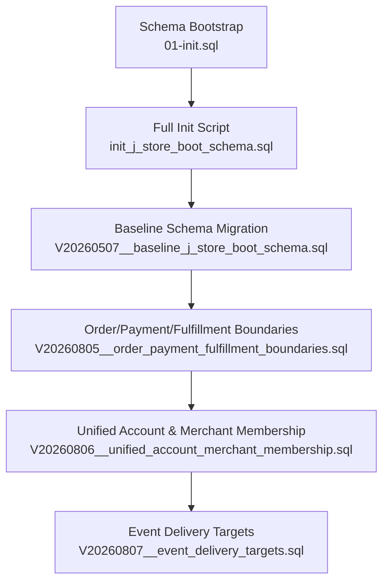

**Diagram sources**
- [01-init.sql:1-5](file://docker/postgres/init/01-init.sql#L1-L5)
- [init_j_store_boot_schema.sql:1-309](file://j-store-boot/src/main/resources/db/init/init_j_store_boot_schema.sql#L1-L309)
- [V20260507__baseline_j_store_boot_schema.sql:1-318](file://j-store-boot/src/main/resources/db/migration/V20260507__baseline_j_store_boot_schema.sql#L1-L318)
- [V20260805__order_payment_fulfillment_boundaries.sql:1-153](file://j-store-boot/src/main/resources/db/migration/V20260805__order_payment_fulfillment_boundaries.sql#L1-L153)
- [V20260806__unified_account_merchant_membership.sql:1-48](file://j-store-boot/src/main/resources/db/migration/V20260806__unified_account_merchant_membership.sql#L1-L48)
- [V20260807__event_delivery_targets.sql:1-28](file://j-store-boot/src/main/resources/db/migration/V20260807__event_delivery_targets.sql#L1-L28)

**Section sources**
- [01-init.sql:1-5](file://docker/postgres/init/01-init.sql#L1-L5)
- [init_j_store_boot_schema.sql:1-309](file://j-store-boot/src/main/resources/db/init/init_j_store_boot_schema.sql#L1-L309)
- [V20260507__baseline_j_store_boot_schema.sql:1-318](file://j-store-boot/src/main/resources/db/migration/V20260507__baseline_j_store_boot_schema.sql#L1-L318)

## Core Components
This section outlines the core foundation tables and their roles:
- User Accounts: identity and authentication baseline
- Merchants and Memberships: multi-tenant ownership and role-based membership
- Orders, Items, After-sales: commerce core with payment and fulfillment boundaries
- Accounting: ledger, journal entries, periods, settlement statements
- Outbox and Event Consumption: reliable event delivery and idempotency
- Timer Jobs: background job scheduling and dead-letter handling

Key characteristics:
- Primary keys are either BIGSERIAL or BIGINT (for external IDs)
- Foreign keys enforce referential integrity across aggregates
- CHECK constraints enforce business rules at the database level
- Indexes optimize frequent queries by status, timestamps, and tenant/merchant scoping

**Section sources**
- [init_j_store_boot_schema.sql:13-309](file://j-store-boot/src/main/resources/db/init/init_j_store_boot_schema.sql#L13-L309)
- [V20260805__order_payment_fulfillment_boundaries.sql:14-153](file://j-store-boot/src/main/resources/db/migration/V20260805__order_payment_fulfillment_boundaries.sql#L14-L153)
- [V20260806__unified_account_merchant_membership.sql:1-48](file://j-store-boot/src/main/resources/db/migration/V20260806__unified_account_merchant_membership.sql#L1-L48)

## Architecture Overview
The foundation schema supports a modular architecture where each domain (user, shop, order, payment, fulfillment, accounting) persists its state in dedicated tables while sharing common infrastructure tables (outbox, timer jobs).

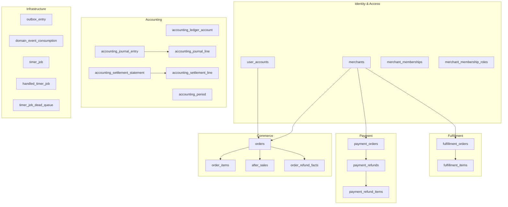

**Diagram sources**
- [init_j_store_boot_schema.sql:13-309](file://j-store-boot/src/main/resources/db/init/init_j_store_boot_schema.sql#L13-L309)
- [V20260805__order_payment_fulfillment_boundaries.sql:14-153](file://j-store-boot/src/main/resources/db/migration/V20260805__order_payment_fulfillment_boundaries.sql#L14-L153)
- [V20260806__unified_account_merchant_membership.sql:1-48](file://j-store-boot/src/main/resources/db/migration/V20260806__unified_account_merchant_membership.sql#L1-L48)

## Detailed Component Analysis

### User Accounts
- Purpose: Stores user identity and authentication baseline
- Key fields: id (PK), phone_number (unique), nickname, password_hash, status, create_time, update_time
- Constraints: Unique phone number; status enum enforced via application layer; timestamps default to now
- Persistence mapping: JPA entity maps directly to table columns

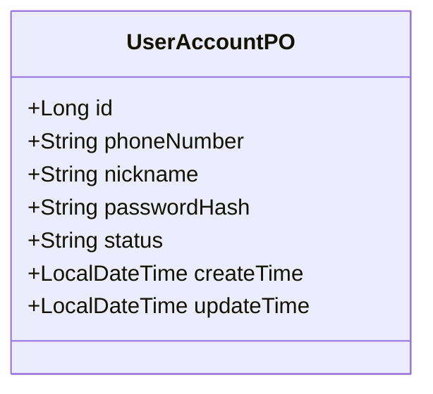

**Diagram sources**
- [UserAccountPO.kt:14-29](file://j-store-user-infrastructure/src/main/kotlin/com/jstore/user/domain/useraccount/persistence/UserAccountPO.kt#L14-L29)

**Section sources**
- [init_j_store_boot_schema.sql:13-22](file://j-store-boot/src/main/resources/db/init/init_j_store_boot_schema.sql#L13-L22)
- [UserAccountPO.kt:14-29](file://j-store-user-infrastructure/src/main/kotlin/com/jstore/user/domain/useraccount/persistence/UserAccountPO.kt#L14-L29)

### Authentication Tokens
- Storage: Redis-backed token store for refresh tokens and access token blacklist
- Keys:
  - refresh_token:{userId} -> refreshToken with TTL
  - token_blacklist:{jti} -> marker with TTL
- Operations: store, get, remove refresh tokens; blacklist and check access tokens

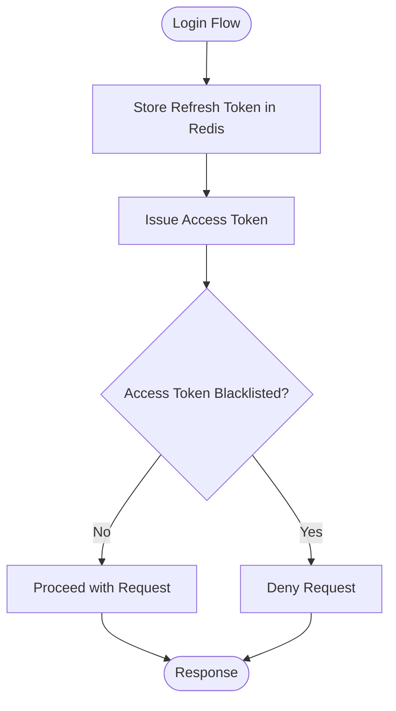

**Diagram sources**
- [RedisTokenStore.kt:12-43](file://j-store-user-infrastructure/src/main/kotlin/com/jstore/user/domain/useraccount/RedisTokenStore.kt#L12-L43)

**Section sources**
- [RedisTokenStore.kt:12-43](file://j-store-user-infrastructure/src/main/kotlin/com/jstore/user/domain/useraccount/RedisTokenStore.kt#L12-L43)

### Merchants and Memberships
- Merchants: id (PK), name, status (ACTIVE/DISABLED), timestamps
- Merchant Memberships: links users to merchants with unique (merchant_id, user_id); status ACTIVE/DISABLED; positive user_id constraint
- Roles: composite key (membership_id, role) with allowed roles enumerated
- Integration: FKs added to spu, spu_snapshot, orders, after_sales, payment_orders, fulfillment_orders to link to merchants

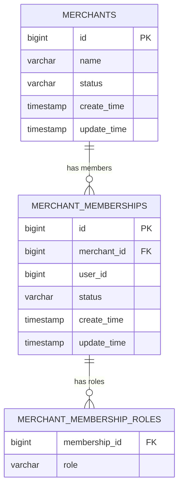

**Diagram sources**
- [V20260806__unified_account_merchant_membership.sql:3-34](file://j-store-boot/src/main/resources/db/migration/V20260806__unified_account_merchant_membership.sql#L3-L34)

**Section sources**
- [V20260806__unified_account_merchant_membership.sql:3-34](file://j-store-boot/src/main/resources/db/migration/V20260806__unified_account_merchant_membership.sql#L3-L34)
- [MerchantPO.kt:12-24](file://j-store-shop-infrastructure/src/main/kotlin/com/jstore/shop/domain/merchant/persistence/MerchantPO.kt#L12-L24)

### Orders, Items, and After-sales
- Orders: buyer info, recipient_info JSONB, status tracking, amount composition fields, references to payment and fulfillment
- Order Items: snapshot of goods at order time, quantity, unit price, status
- After-sales: refund lifecycle with statuses and reasons
- Refund Facts: per-order-item refund records with uniqueness constraints

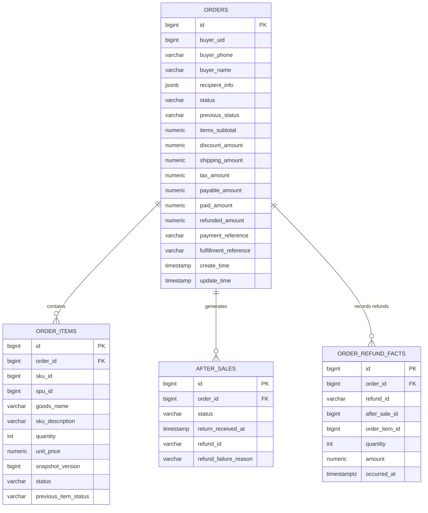

**Diagram sources**
- [init_j_store_boot_schema.sql:82-116](file://j-store-boot/src/main/resources/db/init/init_j_store_boot_schema.sql#L82-L116)
- [V20260805__order_payment_fulfillment_boundaries.sql:20-76](file://j-store-boot/src/main/resources/db/migration/V20260805__order_payment_fulfillment_boundaries.sql#L20-L76)

**Section sources**
- [init_j_store_boot_schema.sql:82-116](file://j-store-boot/src/main/resources/db/init/init_j_store_boot_schema.sql#L82-L116)
- [V20260805__order_payment_fulfillment_boundaries.sql:20-76](file://j-store-boot/src/main/resources/db/migration/V20260805__order_payment_fulfillment_boundaries.sql#L20-L76)

### Payment and Fulfillment Boundaries
- Payment Orders: one-to-one with orders; captures provider transaction ids and amounts; strict status transitions enforced via CHECK
- Payment Refunds: linked to after-sales; provider refund ids; status transitions
- Fulfillment Orders: one-to-one with orders; address and carrier/tracking fields; status-dependent nullability enforced via CHECK

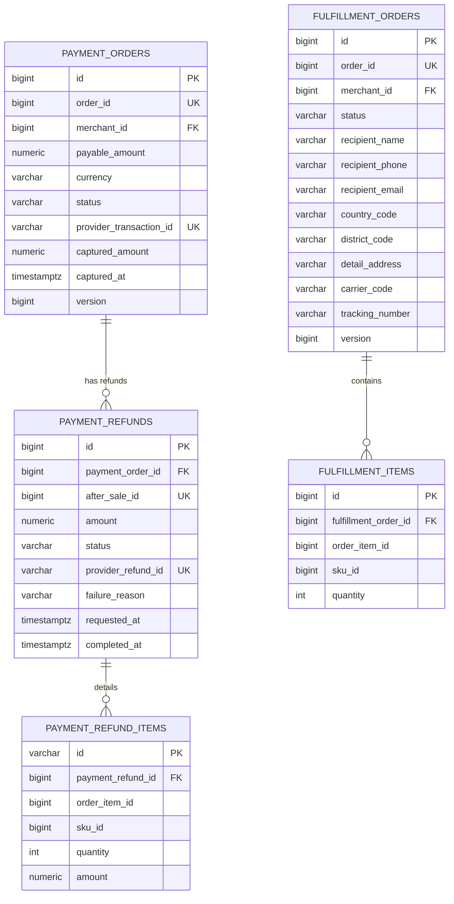

**Diagram sources**
- [V20260805__order_payment_fulfillment_boundaries.sql:79-153](file://j-store-boot/src/main/resources/db/migration/V20260805__order_payment_fulfillment_boundaries.sql#L79-L153)

**Section sources**
- [V20260805__order_payment_fulfillment_boundaries.sql:79-153](file://j-store-boot/src/main/resources/db/migration/V20260805__order_payment_fulfillment_boundaries.sql#L79-L153)

### Accounting Foundation
- Ledger Accounts: code/name/type/direction/subject linkage; unique code+subject
- Journal Entries: unique entry_no; source deduplication; reversal support
- Journal Lines: positive amount constraint; FK to entry and account
- Periods: period_code unique; closed state tracking
- Settlement Statements: merchant+period uniqueness; payable amounts and lifecycle timestamps
- Settlement Lines: per-statement breakdown with FK to statement

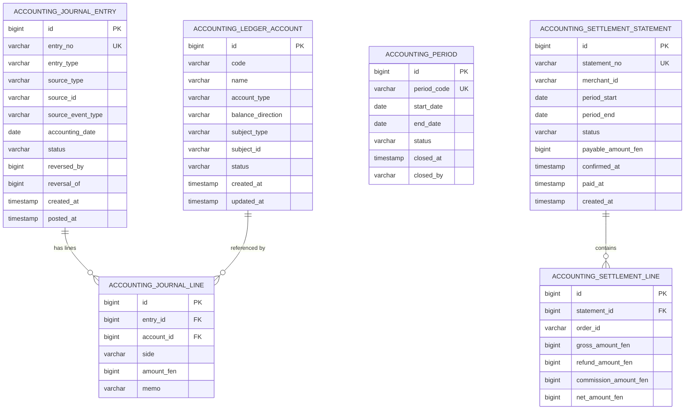

**Diagram sources**
- [init_j_store_boot_schema.sql:232-309](file://j-store-boot/src/main/resources/db/init/init_j_store_boot_schema.sql#L232-L309)

**Section sources**
- [init_j_store_boot_schema.sql:232-309](file://j-store-boot/src/main/resources/db/init/init_j_store_boot_schema.sql#L232-L309)

### Outbox and Event Consumption
- Outbox Entry: reliable event persistence with status-driven indexing; enriched message metadata (kind, target, destination, partition_key, correlation/causation, tenant)
- Domain Event Consumption: listener-level idempotency keyed by listener_id and event_id

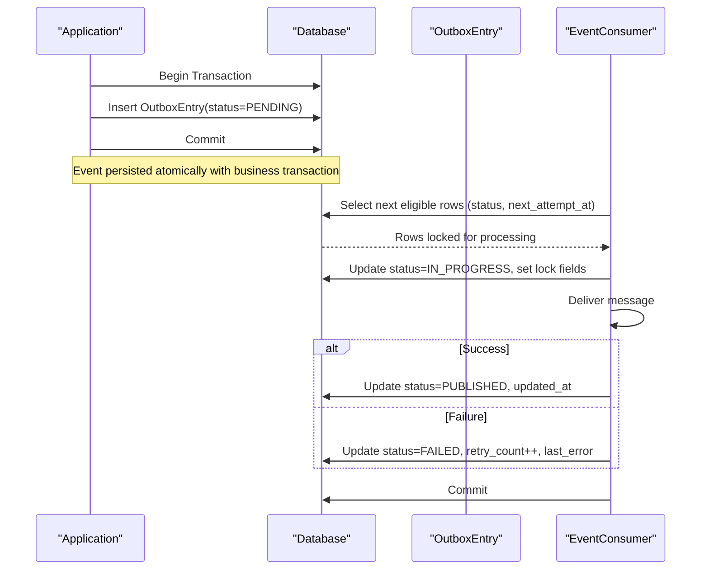

**Diagram sources**
- [init_j_store_boot_schema.sql:121-183](file://j-store-boot/src/main/resources/db/init/init_j_store_boot_schema.sql#L121-L183)
- [V20260807__event_delivery_targets.sql:1-28](file://j-store-boot/src/main/resources/db/migration/V20260807__event_delivery_targets.sql#L1-L28)

**Section sources**
- [init_j_store_boot_schema.sql:121-183](file://j-store-boot/src/main/resources/db/init/init_j_store_boot_schema.sql#L121-L183)
- [V20260807__event_delivery_targets.sql:1-28](file://j-store-boot/src/main/resources/db/migration/V20260807__event_delivery_targets.sql#L1-L28)

### Timer Jobs
- Active Jobs: topic/content/status/execute_time; indexed by execute_time and status
- Handled Jobs: archived processed jobs with remind_ttl and execute_time
- Dead Queue: failed jobs with dead_time; prevents reprocessing loops

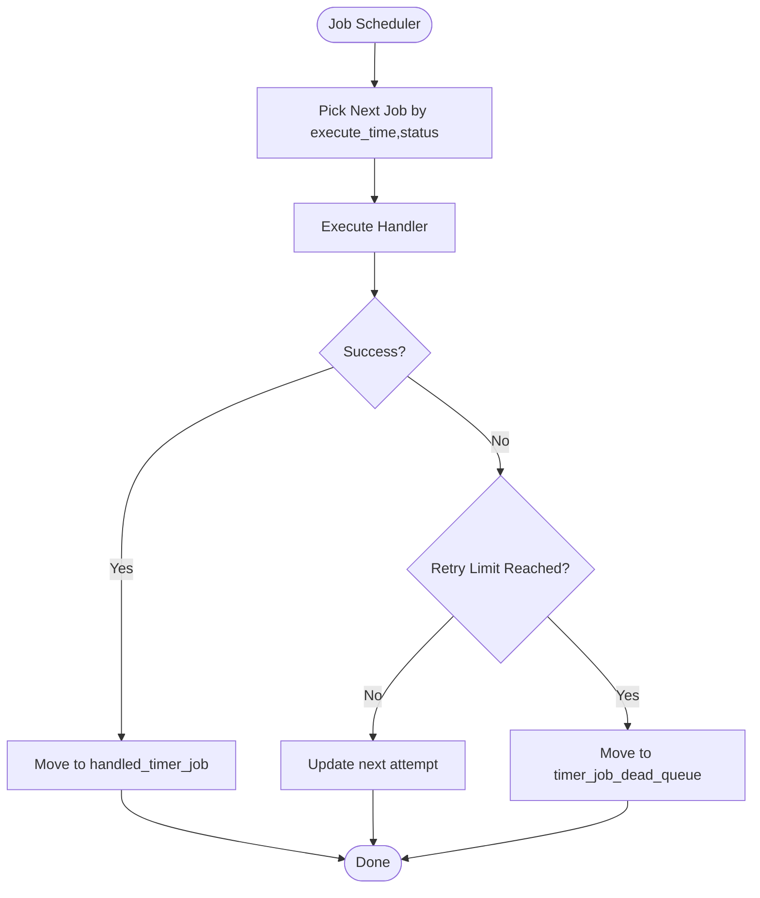

**Diagram sources**
- [init_j_store_boot_schema.sql:188-227](file://j-store-boot/src/main/resources/db/init/init_j_store_boot_schema.sql#L188-L227)

**Section sources**
- [init_j_store_boot_schema.sql:188-227](file://j-store-boot/src/main/resources/db/init/init_j_store_boot_schema.sql#L188-L227)

## Dependency Analysis
Core dependencies and relationships:
- user_accounts referenced by orders.buyer_uid
- merchants referenced by spu, spu_snapshot, orders, after_sales, payment_orders, fulfillment_orders
- orders referenced by order_items, after_sales, order_refund_facts, payment_orders, fulfillment_orders
- payment_orders referenced by payment_refunds
- payment_refunds referenced by payment_refund_items
- accounting_journal_entry referenced by accounting_journal_line
- accounting_settlement_statement referenced by accounting_settlement_line

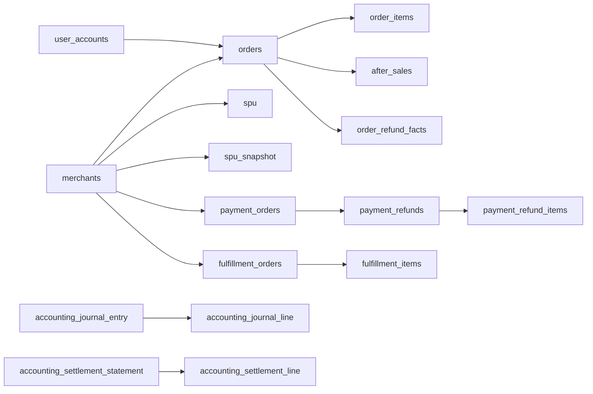

**Diagram sources**
- [init_j_store_boot_schema.sql:82-309](file://j-store-boot/src/main/resources/db/init/init_j_store_boot_schema.sql#L82-L309)
- [V20260805__order_payment_fulfillment_boundaries.sql:14-153](file://j-store-boot/src/main/resources/db/migration/V20260805__order_payment_fulfillment_boundaries.sql#L14-L153)
- [V20260806__unified_account_merchant_membership.sql:36-48](file://j-store-boot/src/main/resources/db/migration/V20260806__unified_account_merchant_membership.sql#L36-L48)

**Section sources**
- [init_j_store_boot_schema.sql:82-309](file://j-store-boot/src/main/resources/db/init/init_j_store_boot_schema.sql#L82-L309)
- [V20260805__order_payment_fulfillment_boundaries.sql:14-153](file://j-store-boot/src/main/resources/db/migration/V20260805__order_payment_fulfillment_boundaries.sql#L14-L153)
- [V20260806__unified_account_merchant_membership.sql:36-48](file://j-store-boot/src/main/resources/db/migration/V20260806__unified_account_merchant_membership.sql#L36-L48)

## Performance Considerations
- Indexing strategy:
  - Status+time composite indexes for high-throughput scans (orders.status+create_time, outbox_entry.status+created_at)
  - GIN index on JSONB recipient_info for fast address queries
  - Merchant-scoped indexes (merchant_id+status, merchant_id+create_time) for multi-tenant filtering
  - Conditional indexes for outbox claim and cleanup paths
- Locking and contention:
  - Outbox uses row-level locking fields (locked_by, locked_until) to avoid duplicate processing
  - Idempotency via unique constraints (e.g., payment_orders.order_id, payment_refunds.after_sale_id)
- Data volume management:
  - Outbox and timer job histories should be partitioned or archived periodically
  - Use conditional indexes to reduce bloat on large tables

[No sources needed since this section provides general guidance]

## Troubleshooting Guide
Common issues and mitigations:
- Duplicate events: Ensure outbox_entry.event_id uniqueness checks and consumer idempotency via domain_event_consumption
- Stuck outbox entries: Inspect status IN ('PENDING','FAILED','IN_PROGRESS') and lock_expired index; clear stale locks if necessary
- Payment state inconsistencies: Validate CHECK constraints on payment_orders and fulfillment_orders; verify provider_transaction_id and captured_amount consistency
- Merchant membership conflicts: Enforce unique (merchant_id, user_id) and role enumeration; audit membership roles for unauthorized access

**Section sources**
- [init_j_store_boot_schema.sql:121-183](file://j-store-boot/src/main/resources/db/init/init_j_store_boot_schema.sql#L121-L183)
- [V20260805__order_payment_fulfillment_boundaries.sql:79-153](file://j-store-boot/src/main/resources/db/migration/V20260805__order_payment_fulfillment_boundaries.sql#L79-L153)
- [V20260806__unified_account_merchant_membership.sql:12-34](file://j-store-boot/src/main/resources/db/migration/V20260806__unified_account_merchant_membership.sql#L12-L34)

## Conclusion
The J-Store foundation schema establishes a robust, constraint-rich data model supporting user identity, merchant multi-tenancy, order lifecycle, payment and fulfillment boundaries, accounting integrity, and reliable event delivery. Carefully designed indexes and CHECK constraints ensure performance and correctness at scale. Lifecycle policies for outbox and timer jobs, along with idempotency mechanisms, provide resilience against failures and duplicates.

[No sources needed since this section summarizes without analyzing specific files]

## Appendices

### Data Validation Rules and Business Constraints
- Amount composition and non-negativity enforced via CHECK constraints on orders
- Payment and fulfillment state transitions validated by CHECK constraints
- Positive amount constraints on journal lines and refund items
- Role enumeration and membership status enforcement via CHECK constraints

**Section sources**
- [V20260805__order_payment_fulfillment_boundaries.sql:39-50](file://j-store-boot/src/main/resources/db/migration/V20260805__order_payment_fulfillment_boundaries.sql#L39-L50)
- [init_j_store_boot_schema.sql:269-272](file://j-store-boot/src/main/resources/db/init/init_j_store_boot_schema.sql#L269-L272)
- [V20260806__unified_account_merchant_membership.sql:19-33](file://j-store-boot/src/main/resources/db/migration/V20260806__unified_account_merchant_membership.sql#L19-L33)

### Data Lifecycle Policies and Retention Strategies
- Outbox entries: transition from PENDING to IN_PROGRESS to PUBLISHED/FAILED; archive published entries periodically using conditional indexes
- Domain event consumption: retain consumed markers for idempotency; consider retention windows per listener
- Timer jobs: move handled jobs to handled_timer_job; route persistent failures to timer_job_dead_queue for manual inspection
- Accounting periods: close periods and prevent further postings post-close; settle statements with lifecycle timestamps

**Section sources**
- [init_j_store_boot_schema.sql:121-183](file://j-store-boot/src/main/resources/db/init/init_j_store_boot_schema.sql#L121-L183)
- [V20260807__event_delivery_targets.sql:1-28](file://j-store-boot/src/main/resources/db/migration/V20260807__event_delivery_targets.sql#L1-L28)
- [init_j_store_boot_schema.sql:188-227](file://j-store-boot/src/main/resources/db/init/init_j_store_boot_schema.sql#L188-L227)
- [init_j_store_boot_schema.sql:274-296](file://j-store-boot/src/main/resources/db/init/init_j_store_boot_schema.sql#L274-L296)