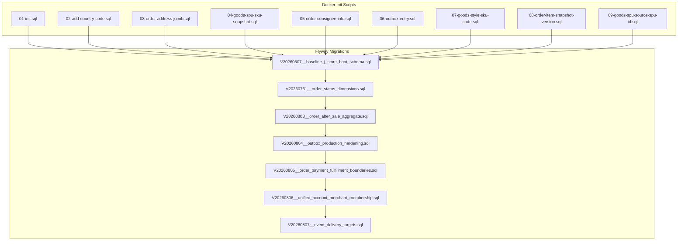
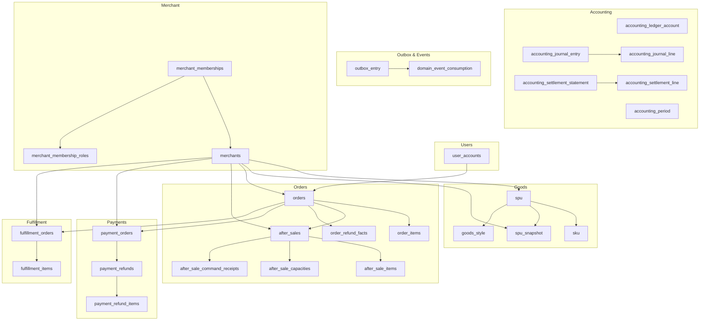
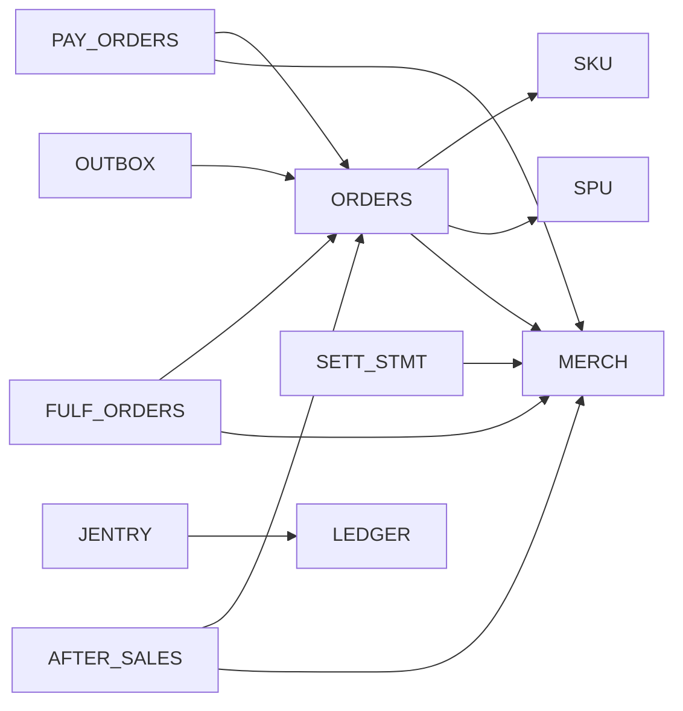

# Database Schema & Migrations

<cite>
**Referenced Files in This Document**
- [V20260507__baseline_j_store_boot_schema.sql](file://j-store-boot/src/main/resources/db/migration/V20260507__baseline_j_store_boot_schema.sql)
- [V20260731__order_status_dimensions.sql](file://j-store-boot/src/main/resources/db/migration/V20260731__order_status_dimensions.sql)
- [V20260803__order_after_sale_aggregate.sql](file://j-store-boot/src/main/resources/db/migration/V20260803__order_after_sale_aggregate.sql)
- [V20260804__outbox_production_hardening.sql](file://j-store-boot/src/main/resources/db/migration/V20260804__outbox_production_hardening.sql)
- [V20260805__order_payment_fulfillment_boundaries.sql](file://j-store-boot/src/main/resources/db/migration/V20260805__order_payment_fulfillment_boundaries.sql)
- [V20260806__unified_account_merchant_membership.sql](file://j-store-boot/src/main/resources/db/migration/V20260806__unified_account_merchant_membership.sql)
- [V20260807__event_delivery_targets.sql](file://j-store-boot/src/main/resources/db/migration/V20260807__event_delivery_targets.sql)
- [01-init.sql](file://docker/postgres/init/01-init.sql)
- [02-add-country-code.sql](file://docker/postgres/init/02-add-country-code.sql)
- [03-order-address-jsonb.sql](file://docker/postgres/init/03-order-address-jsonb.sql)
- [04-goods-spu-sku-snapshot.sql](file://docker/postgres/init/04-goods-spu-sku-snapshot.sql)
- [05-order-consignee-info.sql](file://docker/postgres/init/05-order-consignee-info.sql)
- [06-outbox-entry.sql](file://docker/postgres/init/06-outbox-entry.sql)
- [07-goods-style-sku-code.sql](file://docker/postgres/init/07-goods-style-sku-code.sql)
- [08-order-item-snapshot-version.sql](file://docker/postgres/init/08-order-item-snapshot-version.sql)
- [09-goods-spu-source-spu-id.sql](file://docker/postgres/init/09-goods-spu-source-spu-id.sql)
</cite>

## Table of Contents
1. Introduction
2. Project Structure
3. Core Components
4. Architecture Overview
5. Detailed Component Analysis
6. Dependency Analysis
7. Performance Considerations
8. Troubleshooting Guide
9. Conclusion
10. Appendices

## Introduction
This document provides comprehensive data model documentation for the J-Store database schema. It covers entity relationships, field definitions, and data types across orders, goods, users, payments, fulfillment, and accounting modules. It also documents primary/foreign keys, indexes, constraints, validation rules enforced at the database level, data access patterns, caching strategies, query optimization techniques, data lifecycle and retention policies, Flyway migration paths and version management, security and privacy requirements, and backup and recovery procedures.

## Project Structure
The database schema is defined through two complementary sources:
- Docker initialization scripts under docker/postgres/init for local development bootstrap and incremental schema changes.
- Flyway migrations under j-store-boot/src/main/resources/db/migration for application-driven evolution and production upgrades.

**Diagram sources**
- [01-init.sql:1-5](file://docker/postgres/init/01-init.sql#L1-L5)
- [02-add-country-code.sql:1-5](file://docker/postgres/init/02-add-country-code.sql#L1-L5)
- [03-order-address-jsonb.sql:1-43](file://docker/postgres/init/03-order-address-jsonb.sql#L1-L43)
- [04-goods-spu-sku-snapshot.sql:1-55](file://docker/postgres/init/04-goods-spu-sku-snapshot.sql#L1-L55)
- [05-order-consignee-info.sql:1-34](file://docker/postgres/init/05-order-consignee-info.sql#L1-L34)
- [06-outbox-entry.sql:1-72](file://docker/postgres/init/06-outbox-entry.sql#L1-L72)
- [07-goods-style-sku-code.sql:1-32](file://docker/postgres/init/07-goods-style-sku-code.sql#L1-L32)
- [08-order-item-snapshot-version.sql:1-5](file://docker/postgres/init/08-order-item-snapshot-version.sql#L1-L5)
- [09-goods-spu-source-spu-id.sql:1-9](file://docker/postgres/init/09-goods-spu-source-spu-id.sql#L1-L9)
- [V20260507__baseline_j_store_boot_schema.sql:1-318](file://j-store-boot/src/main/resources/db/migration/V20260507__baseline_j_store_boot_schema.sql#L1-L318)
- [V20260731__order_status_dimensions.sql:1-34](file://j-store-boot/src/main/resources/db/migration/V20260731__order_status_dimensions.sql#L1-L34)
- [V20260803__order_after_sale_aggregate.sql:1-22](file://j-store-boot/src/main/resources/db/migration/V20260803__order_after_sale_aggregate.sql#L1-L22)
- [V20260804__outbox_production_hardening.sql:1-28](file://j-store-boot/src/main/resources/db/migration/V20260804__outbox_production_hardening.sql#L1-L28)
- [V20260805__order_payment_fulfillment_boundaries.sql:1-153](file://j-store-boot/src/main/resources/db/migration/V20260805__order_payment_fulfillment_boundaries.sql#L1-L153)
- [V20260806__unified_account_merchant_membership.sql:1-48](file://j-store-boot/src/main/resources/db/migration/V20260806__unified_account_merchant_membership.sql#L1-L48)
- [V20260807__event_delivery_targets.sql:1-28](file://j-store-boot/src/main/resources/db/migration/V20260807__event_delivery_targets.sql#L1-L28)

**Section sources**
- [01-init.sql:1-5](file://docker/postgres/init/01-init.sql#L1-L5)
- [V20260507__baseline_j_store_boot_schema.sql:1-318](file://j-store-boot/src/main/resources/db/migration/V20260507__baseline_j_store_boot_schema.sql#L1-L318)

## Core Components
This section summarizes the core entities and their roles:
- Users: user_accounts stores user identity and authentication-related fields.
- Goods: spu, sku, spu_snapshot, goods_style define product catalog and presentation assets.
- Orders: orders and order_items capture purchase transactions with status dimensions and financial breakdowns.
- After-sales: after_sales, after_sale_items, after_sale_capacities, after_sale_command_receipts, order_refund_facts manage returns and refunds.
- Payments: payment_orders, payment_refunds, payment_refund_items record payment lifecycle and refund details.
- Fulfillment: fulfillment_orders, fulfillment_items track shipping and delivery states.
- Accounting: accounting_ledger_account, accounting_journal_entry, accounting_journal_line, accounting_period, accounting_settlement_statement, accounting_settlement_line support double-entry bookkeeping and settlement statements.
- Outbox and Events: outbox_entry and domain_event_consumption provide reliable event publishing and idempotent consumption.
- Merchant and Membership: merchants, merchant_memberships, merchant_membership_roles enable multi-tenant merchant organization and role-based access.

Key data types and conventions:
- Monetary values are stored as NUMERIC(19,0) representing cents (fen) to avoid floating-point rounding issues.
- JSONB columns store flexible structures such as addresses, attributes, and images.
- Status fields use constrained enums via CHECK constraints to enforce business rules at the database level.
- Versioning uses BIGINT version columns for optimistic concurrency control on aggregates.

**Section sources**
- [V20260507__baseline_j_store_boot_schema.sql:13-318](file://j-store-boot/src/main/resources/db/migration/V20260507__baseline_j_store_boot_schema.sql#L13-L318)
- [V20260731__order_status_dimensions.sql:1-34](file://j-store-boot/src/main/resources/db/migration/V20260731__order_status_dimensions.sql#L1-L34)
- [V20260803__order_after_sale_aggregate.sql:1-22](file://j-store-boot/src/main/resources/db/migration/V20260803__order_after_sale_aggregate.sql#L1-L22)
- [V20260805__order_payment_fulfillment_boundaries.sql:1-153](file://j-store-boot/src/main/resources/db/migration/V20260805__order_payment_fulfillment_boundaries.sql#L1-L153)
- [V20260806__unified_account_merchant_membership.sql:1-48](file://j-store-boot/src/main/resources/db/migration/V20260806__unified_account_merchant_membership.sql#L1-L48)
- [06-outbox-entry.sql:1-72](file://docker/postgres/init/06-outbox-entry.sql#L1-L72)

## Architecture Overview
The J-Store database follows a modular architecture aligned with domain boundaries. Each module owns its tables and enforces integrity via foreign keys and constraints. Cross-module interactions are primarily event-driven using the transactional outbox pattern.

**Diagram sources**
- [V20260507__baseline_j_store_boot_schema.sql:13-318](file://j-store-boot/src/main/resources/db/migration/V20260507__baseline_j_store_boot_schema.sql#L13-L318)
- [V20260731__order_status_dimensions.sql:1-34](file://j-store-boot/src/main/resources/db/migration/V20260731__order_status_dimensions.sql#L1-L34)
- [V20260803__order_after_sale_aggregate.sql:1-22](file://j-store-boot/src/main/resources/db/migration/V20260803__order_after_sale_aggregate.sql#L1-L22)
- [V20260805__order_payment_fulfillment_boundaries.sql:1-153](file://j-store-boot/src/main/resources/db/migration/V20260805__order_payment_fulfillment_boundaries.sql#L1-L153)
- [V20260806__unified_account_merchant_membership.sql:1-48](file://j-store-boot/src/main/resources/db/migration/V20260806__unified_account_merchant_membership.sql#L1-L48)
- [06-outbox-entry.sql:1-72](file://docker/postgres/init/06-outbox-entry.sql#L1-L72)

## Detailed Component Analysis

### Users Module
- user_accounts: Stores phone_number, nickname, password_hash, and status. Unique constraint on phone_number ensures single registration per number.

Indexes and constraints:
- Primary key on id.
- Unique index on phone_number.

Validation rules:
- Status enum enforced by application; no DB-level CHECK present in baseline.

Data access patterns:
- Lookup by phone_number for authentication flows.
- Read-heavy profile retrieval with cache-friendly queries.

Caching strategy:
- Cache user profiles and tokens in Redis (application layer), reducing DB load.

Performance considerations:
- Small table; simple lookups benefit from unique index on phone_number.

**Section sources**
- [V20260507__baseline_j_store_boot_schema.sql:13-22](file://j-store-boot/src/main/resources/db/migration/V20260507__baseline_j_store_boot_schema.sql#L13-L22)

### Goods Module
- spu: Standard Product Unit with name, description, status, version, source_spu_id for copy-on-write draft model.
- sku: Stock Keeping Unit linked to spu with attributes JSONB and price in cents.
- spu_snapshot: Immutable snapshot capturing product state at listing time; unique on spu_id + snapshot_version.
- goods_style: Presentation assets (images, HTML detail, SKU images mapping); one-to-one with spu via unique index.

Indexes and constraints:
- PKs on id fields.
- FK from sku.spu_id to spu.id.
- Unique constraint on spu_snapshot(spu_id, snapshot_version).
- Unique index on goods_style.spu_id.
- Partial index on spu.source_spu_id for draft copies.

Validation rules:
- Status enums for spu enforced by application; no DB-level CHECK in baseline.
- Numeric price non-negative default enforced by DEFAULT 0.

Data access patterns:
- Query SPU by merchant and status for catalog browsing.
- Retrieve SKU list by spu_id for product detail pages.
- Load spu_snapshot for historical order item pricing and descriptions.

Caching strategy:
- Cache SPU/SKU catalogs and snapshots in Redis or CDN for images.

Performance considerations:
- GIN indexes on JSONB attributes may be added for advanced filtering.
- Partial index on source_spu_id accelerates draft lookups.

**Section sources**
- [V20260507__baseline_j_store_boot_schema.sql:27-77](file://j-store-boot/src/main/resources/db/migration/V20260507__baseline_j_store_boot_schema.sql#L27-L77)
- [04-goods-spu-sku-snapshot.sql:1-55](file://docker/postgres/init/04-goods-spu-sku-snapshot.sql#L1-L55)
- [07-goods-style-sku-code.sql:1-32](file://docker/postgres/init/07-goods-style-sku-code.sql#L1-L32)
- [09-goods-spu-source-spu-id.sql:1-9](file://docker/postgres/init/09-goods-spu-source-spu-id.sql#L1-L9)

### Orders Module
- orders: Captures buyer info, recipient_info JSONB, and multiple status dimensions (trade_status, payment_status, fulfillment_status). Financial breakdown includes items_subtotal, discount_amount, shipping_amount, tax_amount, payable_amount, paid_amount, refunded_amount. References merchant_id and currency.
- order_items: Line items referencing sku_id and spu_id, with snapshot_version for immutable product details. Tracks quantity, unit_price, status, and refund quantities/amounts.

Indexes and constraints:
- PKs on id fields.
- FK from order_items.order_id to orders.id with CASCADE delete.
- Indexes on buyer_uid, status dimensions combined with create_time for pagination and reporting.
- GIN index on recipient_info for address queries.
- CHECK constraints ensure non-negative amounts and composition rules (payable = subtotal - discount + shipping + tax).
- UNIQUE constraints on payment_reference and fulfillment_reference.

Validation rules:
- Status enums enforced via CHECK constraints for trade, payment, fulfillment statuses.
- Amount composition and payment bounds enforced via CHECK constraints.
- Refunded quantity and amount bounded by quantity and unit_price * quantity.

Data access patterns:
- Query orders by merchant and status for dashboards.
- Fetch order items by order_id for receipts and after-sale processing.
- Use recipient_info GIN index for address searches.

Caching strategy:
- Cache order summaries and item lists for read-heavy endpoints.

Performance considerations:
- Composite indexes on status + create_time optimize common filters.
- GIN index on JSONB recipient_info supports efficient address queries.

**Section sources**
- [V20260507__baseline_j_store_boot_schema.sql:82-116](file://j-store-boot/src/main/resources/db/migration/V20260507__baseline_j_store_boot_schema.sql#L82-L116)
- [V20260731__order_status_dimensions.sql:1-34](file://j-store-boot/src/main/resources/db/migration/V20260731__order_status_dimensions.sql#L1-L34)
- [V20260803__order_after_sale_aggregate.sql:1-22](file://j-store-boot/src/main/resources/db/migration/V20260803__order_after_sale_aggregate.sql#L1-L22)
- [V20260805__order_payment_fulfillment_boundaries.sql:20-52](file://j-store-boot/src/main/resources/db/migration/V20260805__order_payment_fulfillment_boundaries.sql#L20-L52)
- [05-order-consignee-info.sql:1-34](file://docker/postgres/init/05-order-consignee-info.sql#L1-L34)

### After-Sales Module
- after_sales: Tracks return/refund requests with status transitions and reviewer metadata.
- after_sale_items: Links after-sale to specific order items with requested and eligible quantities/amounts.
- after_sale_capacities: Enforces ceilings and tracks requested/approved quantities/amounts per order_item.
- after_sale_command_receipts: Idempotency records for commands.
- order_refund_facts: Immutable facts recording refund events per order and item.

Indexes and constraints:
- PKs on id fields.
- FK from after_sale_items.after_sale_id to after_sales.id with CASCADE.
- UNIQUE constraints on after_sale_items(after_sale_id, order_item_id).
- CHECK constraints enforce valid status transitions and quantity/amount bounds.
- Indexes on order_id, applicant_id/status, merchant_id/status for querying.

Validation rules:
- Status enums enforced via CHECK constraints.
- Quantity and amount checks ensure consistency between requested, eligible, and approved values.

Data access patterns:
- Query after-sales by order_id, applicant_id, or merchant_id for customer service workflows.
- Aggregate refund facts for reconciliation.

Caching strategy:
- Cache after-sale status and capacities for real-time UI updates.

Performance considerations:
- Composite indexes on (order_id, create_time DESC) optimize recent request lists.

**Section sources**
- [V20260803__order_after_sale_aggregate.sql:1-22](file://j-store-boot/src/main/resources/db/migration/V20260803__order_after_sale_aggregate.sql#L1-L22)
- [V20260805__order_payment_fulfillment_boundaries.sql:54-77](file://j-store-boot/src/main/resources/db/migration/V20260805__order_payment_fulfillment_boundaries.sql#L54-L77)

### Payments Module
- payment_orders: Represents payment intent linked to an order with payable_amount, currency, and provider transaction details upon capture.
- payment_refunds: Records refund requests tied to after_sale_id with status and provider refund IDs.
- payment_refund_items: Details refund line items per order_item.

Indexes and constraints:
- PKs on id fields.
- UNIQUE constraints on payment_orders.order_id and provider_transaction_id.
- FK from payment_refunds.payment_order_id to payment_orders.id with CASCADE.
- CHECK constraints enforce status-dependent nullability and captured_amount equals payable_amount when captured.
- Indexes on merchant_id/status for merchant dashboards.

Validation rules:
- Status enums enforced via CHECK constraints.
- Captured state requires provider_transaction_id and matching captured_amount.

Data access patterns:
- Query payment_orders by merchant and status for reconciliation.
- Retrieve refund details by payment_order_id for after-sale processing.

Caching strategy:
- Cache payment status for short-lived UI polling.

Performance considerations:
- Composite index on (merchant_id, status) optimizes merchant-specific queries.

**Section sources**
- [V20260805__order_payment_fulfillment_boundaries.sql:79-120](file://j-store-boot/src/main/resources/db/migration/V20260805__order_payment_fulfillment_boundaries.sql#L79-L120)

### Fulfillment Module
- fulfillment_orders: Tracks shipping lifecycle with recipient details, carrier information, and tracking numbers.
- fulfillment_items: Maps fulfillment lines to order items and SKUs.

Indexes and constraints:
- PKs on id fields.
- UNIQUE constraints on fulfillment_orders.order_id.
- CHECK constraints enforce carrier/tracking presence based on status.
- Indexes on merchant_id/status for operational queries.

Validation rules:
- Status enums enforced via CHECK constraints.
- Carrier/tracking fields required post-shipment.

Data access patterns:
- Query fulfillment_orders by merchant and status for logistics dashboards.
- Retrieve fulfillment_items by fulfillment_order_id for packing lists.

Caching strategy:
- Cache fulfillment status for tracking APIs.

Performance considerations:
- Composite index on (merchant_id, status) supports efficient filtering.

**Section sources**
- [V20260805__order_payment_fulfillment_boundaries.sql:122-153](file://j-store-boot/src/main/resources/db/migration/V20260805__order_payment_fulfillment_boundaries.sql#L122-L153)

### Accounting Module
- accounting_ledger_account: Double-entry ledger accounts with code, name, type, balance direction, subject_type, subject_id.
- accounting_journal_entry: Journal entries with unique entry_no and source identifiers for idempotency.
- accounting_journal_line: Lines per entry with side (debit/credit) and positive amount checks.
- accounting_period: Fiscal periods with open/closed status.
- accounting_settlement_statement: Settlement statements per merchant and period with payable amounts.
- accounting_settlement_line: Detail lines linking to orders and amounts.

Indexes and constraints:
- PKs on id fields.
- UNIQUE constraints on entry_no, period_code, statement_no, and composite keys for uniqueness.
- FKs from journal_line.entry_id to journal_entry.id and account_id to ledger_account.id.
- CHECK constraints ensure positive amounts and valid sides.

Validation rules:
- Account types and balance directions constrained by application; DB-level enforcement via CHECK where applicable.
- Positive amount checks prevent invalid debits/credits.

Data access patterns:
- Query journal entries by source_type/source_id for audit trails.
- Generate settlement statements by merchant and period.

Caching strategy:
- Cache ledger accounts and period status for reporting.

Performance considerations:
- Composite indexes on (source_type, source_id, source_event_type) optimize idempotent lookups.

**Section sources**
- [V20260507__baseline_j_store_boot_schema.sql:222-298](file://j-store-boot/src/main/resources/db/migration/V20260507__baseline_j_store_boot_schema.sql#L222-L298)

### Outbox and Event Consumption
- outbox_entry: Transactional outbox storing events with payload, aggregate context, delivery targets, and retry logic.
- domain_event_consumption: Tracks consumed events per listener for idempotency.

Indexes and constraints:
- PK on outbox_entry.id.
- Composite indexes on (status, created_at) and claim indexes for polling.
- Partial indexes for lock expiration and cleanup.
- PK on domain_event_consumption(listener_id, event_id).

Validation rules:
- Status enums enforced via application; DB-level constraints on retry and locking fields.

Data access patterns:
- Poll outbox_entry by status and next_attempt_at for delivery.
- Check domain_event_consumption for idempotent consumption.

Caching strategy:
- No direct caching; rely on DB indexes for efficient polling.

Performance considerations:
- Partial indexes reduce scan size for active and dead-letter queues.

**Section sources**
- [06-outbox-entry.sql:1-72](file://docker/postgres/init/06-outbox-entry.sql#L1-L72)
- [V20260804__outbox_production_hardening.sql:1-28](file://j-store-boot/src/main/resources/db/migration/V20260804__outbox_production_hardening.sql#L1-L28)
- [V20260807__event_delivery_targets.sql:1-28](file://j-store-boot/src/main/resources/db/migration/V20260807__event_delivery_targets.sql#L1-L28)

### Merchant and Membership
- merchants: Merchant master data with status.
- merchant_memberships: Links users to merchants with status and unique constraints.
- merchant_membership_roles: Role assignments per membership with enumerated roles.

Indexes and constraints:
- PKs on id fields.
- FK from merchant_memberships.merchant_id to merchants.id.
- UNIQUE constraints on (merchant_id, user_id).
- CHECK constraints on status and role enums.

Validation rules:
- Status and role enums enforced via CHECK constraints.

Data access patterns:
- Query memberships by user_id for authorization.
- Retrieve roles for RBAC decisions.

Caching strategy:
- Cache membership and roles per user session.

Performance considerations:
- Index on (user_id, status, merchant_id) optimizes authorization checks.

**Section sources**
- [V20260806__unified_account_merchant_membership.sql:1-48](file://j-store-boot/src/main/resources/db/migration/V20260806__unified_account_merchant_membership.sql#L1-L48)

## Dependency Analysis
The schema exhibits clear dependency boundaries:
- Orders depend on Goods (via sku_id/spu_id) and Merchant (via merchant_id).
- Payments and Fulfillment depend on Orders and Merchants.
- After-sales depends on Orders and Order Items.
- Accounting depends on Orders and Merchants for settlement and journal entries.
- Outbox and event consumption are cross-cutting concerns supporting asynchronous integration.

**Diagram sources**
- [V20260507__baseline_j_store_boot_schema.sql:27-116](file://j-store-boot/src/main/resources/db/migration/V20260507__baseline_j_store_boot_schema.sql#L27-L116)
- [V20260805__order_payment_fulfillment_boundaries.sql:79-153](file://j-store-boot/src/main/resources/db/migration/V20260805__order_payment_fulfillment_boundaries.sql#L79-L153)
- [V20260806__unified_account_merchant_membership.sql:36-47](file://j-store-boot/src/main/resources/db/migration/V20260806__unified_account_merchant_membership.sql#L36-L47)

**Section sources**
- [V20260507__baseline_j_store_boot_schema.sql:27-116](file://j-store-boot/src/main/resources/db/migration/V20260507__baseline_j_store_boot_schema.sql#L27-L116)
- [V20260805__order_payment_fulfillment_boundaries.sql:79-153](file://j-store-boot/src/main/resources/db/migration/V20260805__order_payment_fulfillment_boundaries.sql#L79-L153)
- [V20260806__unified_account_merchant_membership.sql:36-47](file://j-store-boot/src/main/resources/db/migration/V20260806__unified_account_merchant_membership.sql#L36-L47)

## Performance Considerations
- Use composite indexes on frequently filtered columns (e.g., merchant_id + status + create_time) to optimize dashboard and reporting queries.
- Leverage GIN indexes on JSONB columns (recipient_info, attributes, images) for efficient content-based queries.
- Employ partial indexes for subsets like draft spurs or locked outbox entries to reduce index size and improve scan performance.
- Avoid SELECT *; project only needed columns to reduce I/O and network overhead.
- Partition large tables (e.g., outbox_entry, order_refund_facts) by time or merchant if growth warrants it.
- Monitor query plans with EXPLAIN ANALYZE to identify bottlenecks and adjust indexes accordingly.

[No sources needed since this section provides general guidance]

## Troubleshooting Guide
Common issues and resolutions:
- Outbox delivery failures: Inspect outbox_entry.status and last_error; use claim indexes to reprocess failed messages.
- Idempotency violations: Check domain_event_consumption for duplicate event_id consumption.
- Payment capture mismatches: Verify CHECK constraints on payment_orders.captured_amount vs payable_amount.
- Fulfillment tracking gaps: Ensure carrier_code and tracking_number are set when status transitions to shipped/delivered.
- After-sale capacity breaches: Validate CHECK constraints on after_sale_capacities for requested + approved <= ceiling.

Operational tips:
- Use targeted indexes for fast lookups (e.g., idx_outbox_entry_claim, idx_domain_event_consumption_event).
- Archive or purge old outbox entries and completed timer jobs periodically.
- Audit dead-letter queue actions via outbox_dead_letter_audit for traceability.

**Section sources**
- [06-outbox-entry.sql:30-58](file://docker/postgres/init/06-outbox-entry.sql#L30-L58)
- [V20260804__outbox_production_hardening.sql:15-28](file://j-store-boot/src/main/resources/db/migration/V20260804__outbox_production_hardening.sql#L15-L28)

## Conclusion
The J-Store database schema is designed with strong domain boundaries, robust constraints, and performance-oriented indexing. The transactional outbox pattern ensures reliable event-driven communication across modules. Clear separation of concerns in payments, fulfillment, accounting, and after-sales enables scalable operations. Adhering to the documented migration paths and best practices will maintain data integrity and system reliability as the platform evolves.

[No sources needed since this section summarizes without analyzing specific files]

## Appendices

### Data Lifecycle, Retention, and Archival
- Outbox entries: Retain PUBLISHED entries for a limited window; archive or purge based on compliance needs.
- Timer jobs and handled/dead queues: Archive processed jobs periodically to keep active sets small.
- Order history: Maintain immutable snapshots (spu_snapshot) and refund facts for auditability.
- Accounting periods: Close periods and retain historical statements for auditing.

[No sources needed since this section provides general guidance]

### Migration Paths and Version Management
- Use Flyway migrations for controlled schema evolution; each migration is versioned and ordered.
- Development bootstrap via docker/postgres/init scripts can be used locally; production relies on Flyway.
- Backward compatibility: Prefer additive changes (new columns, indexes) and avoid destructive alterations unless explicitly scoped to development.

**Section sources**
- [V20260507__baseline_j_store_boot_schema.sql:1-10](file://j-store-boot/src/main/resources/db/migration/V20260507__baseline_j_store_boot_schema.sql#L1-L10)
- [V20260731__order_status_dimensions.sql:1-5](file://j-store-boot/src/main/resources/db/migration/V20260731__order_status_dimensions.sql#L1-L5)
- [V20260803__order_after_sale_aggregate.sql:1-4](file://j-store-boot/src/main/resources/db/migration/V20260803__order_after_sale_aggregate.sql#L1-L4)
- [V20260805__order_payment_fulfillment_boundaries.sql:1-5](file://j-store-boot/src/main/resources/db/migration/V20260805__order_payment_fulfillment_boundaries.sql#L1-L5)

### Security, Privacy, and Access Control
- Encrypt sensitive data at rest and in transit; hash passwords using secure algorithms (application-layer BCrypt).
- Enforce least privilege for database roles; restrict schema access to application service accounts.
- Mask PII in logs; avoid logging payloads containing personal data.
- Use tenant isolation via merchant_id and application-level authorization checks.

[No sources needed since this section provides general guidance]

### Backup and Recovery Procedures
- Schedule regular full backups of PostgreSQL databases; include WAL archiving for point-in-time recovery.
- Test restore procedures regularly to validate backup integrity.
- Isolate sensitive schemas (e.g., user_accounts) with encryption and restricted access.
- Maintain disaster recovery runbooks covering outage scenarios and data loss recovery.

[No sources needed since this section provides general guidance]