# Event Outbox & Messaging Schema

<cite>
**Referenced Files in This Document**
- [06-outbox-entry.sql](file://docker/postgres/init/06-outbox-entry.sql)
- [OutboxEntry.kt](file://j-store-common-core/src/main/kotlin/com/jstore/common/framework/event/outbox/OutboxEntry.kt)
- [OutboxEntryRepository.kt](file://j-store-common-core/src/main/kotlin/com/jstore/common/framework/event/outbox/OutboxEntryRepository.kt)
- [OutboxDeliveryRouter.kt](file://j-store-common-core/src/main/kotlin/com/jstore/common/framework/event/outbox/OutboxDeliveryRouter.kt)
- [OutboxEventPublisher.kt](file://j-store-common-spring/src/main/kotlin/com/jstore/common/framework/event/outbox/OutboxEventPublisher.kt)
- [OutboxCleaner.kt](file://j-store-common-spring/src/main/kotlin/com/jstore/common/framework/event/outbox/OutboxCleaner.kt)
- [OutboxDeadLetterService.kt](file://j-store-common-spring/src/main/kotlin/com/jstore/common/framework/event/outbox/OutboxDeadLetterService.kt)
- [OutboxDeadLetterOperationsRepository.kt](file://j-store-common-spring/src/main/kotlin/com/jstore/common/framework/event/outbox/OutboxDeadLetterOperationsRepository.kt)
- [OutboxMonitor.kt](file://j-store-common-spring/src/main/kotlin/com/jstore/common/framework/event/outbox/OutboxMonitor.kt)
- [OutboxOperationalHealth.kt](file://j-store-common-spring/src/main/kotlin/com/jstore/common/framework/event/outbox/OutboxOperationalHealth.kt)
- [OutboxProperties.kt](file://j-store-common-spring/src/main/kotlin/com/jstore/common/framework/event/outbox/OutboxProperties.kt)
- [OutboxAutoConfiguration.kt](file://j-store-common-spring/src/main/kotlin/com/jstore/common/framework/event/outbox/OutboxAutoConfiguration.kt)
- [OutboxOperationsController.kt](file://j-store-boot/src/main/kotlin/com/jstore/outbox/operations/OutboxOperationsController.kt)
- [OutboxOperationsDto.kt](file://j-store-boot/src/main/kotlin/com/jstore/outbox/operations/OutboxOperationsDto.kt)
- [OutboxOperationsProperties.kt](file://j-store-boot/src/main/kotlin/com/jstore/outbox/operations/OutboxOperationsProperties.kt)
- [MessageConsumptionRepository.kt](file://j-store-common-core/src/main/kotlin/com/jstore/common/framework/messaging/MessageConsumptionRepository.kt)
- [MessageConsumptionRepositoryImpl.kt](file://j-store-common-spring/src/main/kotlin/com/jstore/common/framework/messaging/persistence/MessageConsumptionRepositoryImpl.kt)
- [TimerJobDeadQueueJpaPO.java](file://j-store-boot/src/main/java/com/jstore/order/expired/TimerJobDeadQueueJpaPO.java)
</cite>

## Table of Contents
1. [Introduction](#introduction)
2. [Project Structure](#project-structure)
3. [Core Components](#core-components)
4. [Architecture Overview](#architecture-overview)
5. [Detailed Component Analysis](#detailed-component-analysis)
6. [Dependency Analysis](#dependency-analysis)
7. [Performance Considerations](#performance-considerations)
8. [Troubleshooting Guide](#troubleshooting-guide)
9. [Conclusion](#conclusion)
10. [Appendices](#appendices)

## Introduction
This document provides comprehensive data model and operational documentation for the event outbox and messaging infrastructure. It explains how domain events are persisted atomically with business transactions, delivered reliably to targets, retried on failures, and monitored for health. It also covers message serialization formats, type registries, dead letter handling, delivery target configuration, performance tuning, ordering guarantees, idempotency requirements, and operational procedures.

## Project Structure
The outbox and messaging subsystem spans common core abstractions, Spring-based runtime components, database schema migrations, and operational APIs:
- Core data model and repository interfaces reside in the common core module.
- Spring auto-configuration, scheduler, cleaner, monitor, and dead letter services live in the common spring module.
- Database schema is initialized via SQL migration scripts.
- Operational endpoints expose inspection and control capabilities.

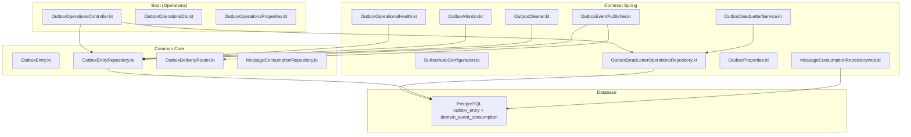

**Diagram sources**
- [OutboxEntry.kt](file://j-store-common-core/src/main/kotlin/com/jstore/common/framework/event/outbox/OutboxEntry.kt)
- [OutboxEntryRepository.kt](file://j-store-common-core/src/main/kotlin/com/jstore/common/framework/event/outbox/OutboxEntryRepository.kt)
- [OutboxDeliveryRouter.kt](file://j-store-common-core/src/main/kotlin/com/jstore/common/framework/event/outbox/OutboxDeliveryRouter.kt)
- [OutboxEventPublisher.kt](file://j-store-common-spring/src/main/kotlin/com/jstore/common/framework/event/outbox/OutboxEventPublisher.kt)
- [OutboxCleaner.kt](file://j-store-common-spring/src/main/kotlin/com/jstore/common/framework/event/outbox/OutboxCleaner.kt)
- [OutboxDeadLetterService.kt](file://j-store-common-spring/src/main/kotlin/com/jstore/common/framework/event/outbox/OutboxDeadLetterService.kt)
- [OutboxDeadLetterOperationsRepository.kt](file://j-store-common-spring/src/main/kotlin/com/jstore/common/framework/event/outbox/OutboxDeadLetterOperationsRepository.kt)
- [OutboxMonitor.kt](file://j-store-common-spring/src/main/kotlin/com/jstore/common/framework/event/outbox/OutboxMonitor.kt)
- [OutboxOperationalHealth.kt](file://j-store-common-spring/src/main/kotlin/com/jstore/common/framework/event/outbox/OutboxOperationalHealth.kt)
- [OutboxProperties.kt](file://j-store-common-spring/src/main/kotlin/com/jstore/common/framework/event/outbox/OutboxProperties.kt)
- [OutboxAutoConfiguration.kt](file://j-store-common-spring/src/main/kotlin/com/jstore/common/framework/event/outbox/OutboxAutoConfiguration.kt)
- [OutboxOperationsController.kt](file://j-store-boot/src/main/kotlin/com/jstore/outbox/operations/OutboxOperationsController.kt)
- [OutboxOperationsDto.kt](file://j-store-boot/src/main/kotlin/com/jstore/outbox/operations/OutboxOperationsDto.kt)
- [OutboxOperationsProperties.kt](file://j-store-boot/src/main/kotlin/com/jstore/outbox/operations/OutboxOperationsProperties.kt)
- [MessageConsumptionRepository.kt](file://j-store-common-core/src/main/kotlin/com/jstore/common/framework/messaging/MessageConsumptionRepository.kt)
- [MessageConsumptionRepositoryImpl.kt](file://j-store-common-spring/src/main/kotlin/com/jstore/common/framework/messaging/persistence/MessageConsumptionRepositoryImpl.kt)

**Section sources**
- [06-outbox-entry.sql](file://docker/postgres/init/06-outbox-entry.sql)

## Core Components
- Outbox entry model and status enumeration define the persistent representation of pending, in-progress, failed, and published messages.
- Repository interface abstracts persistence operations for outbox entries and consumption records.
- Delivery router determines where each event should be sent based on metadata such as delivery target and destination.
- Publisher integrates with transactional boundaries to persist outbox entries alongside business changes.
- Cleaner schedules periodic cleanup of successfully published entries.
- Dead letter service handles unrecoverable failures and persists them for manual intervention.
- Monitor and operational health provide metrics and readiness checks.
- Properties and auto-configuration wire up behavior and defaults.
- Operations controller exposes administrative endpoints for inspection and remediation.

**Section sources**
- [OutboxEntry.kt](file://j-store-common-core/src/main/kotlin/com/jstore/common/framework/event/outbox/OutboxEntry.kt)
- [OutboxEntryRepository.kt](file://j-store-common-core/src/main/kotlin/com/jstore/common/framework/event/outbox/OutboxEntryRepository.kt)
- [OutboxDeliveryRouter.kt](file://j-store-common-core/src/main/kotlin/com/jstore/common/framework/event/outbox/OutboxDeliveryRouter.kt)
- [OutboxEventPublisher.kt](file://j-store-common-spring/src/main/kotlin/com/jstore/common/framework/event/outbox/OutboxEventPublisher.kt)
- [OutboxCleaner.kt](file://j-store-common-spring/src/main/kotlin/com/jstore/common/framework/event/outbox/OutboxCleaner.kt)
- [OutboxDeadLetterService.kt](file://j-store-common-spring/src/main/kotlin/com/jstore/common/framework/event/outbox/OutboxDeadLetterService.kt)
- [OutboxDeadLetterOperationsRepository.kt](file://j-store-common-spring/src/main/kotlin/com/jstore/common/framework/event/outbox/OutboxDeadLetterOperationsRepository.kt)
- [OutboxMonitor.kt](file://j-store-common-spring/src/main/kotlin/com/jstore/common/framework/event/outbox/OutboxMonitor.kt)
- [OutboxOperationalHealth.kt](file://j-store-common-spring/src/main/kotlin/com/jstore/common/framework/event/outbox/OutboxOperationalHealth.kt)
- [OutboxProperties.kt](file://j-store-common-spring/src/main/kotlin/com/jstore/common/framework/event/outbox/OutboxProperties.kt)
- [OutboxAutoConfiguration.kt](file://j-store-common-spring/src/main/kotlin/com/jstore/common/framework/event/outbox/OutboxAutoConfiguration.kt)
- [OutboxOperationsController.kt](file://j-store-boot/src/main/kotlin/com/jstore/outbox/operations/OutboxOperationsController.kt)
- [OutboxOperationsDto.kt](file://j-store-boot/src/main/kotlin/com/jstore/outbox/operations/OutboxOperationsDto.kt)
- [OutboxOperationsProperties.kt](file://j-store-boot/src/main/kotlin/com/jstore/outbox/operations/OutboxOperationsProperties.kt)

## Architecture Overview
The outbox pattern ensures that domain events are first persisted into a dedicated table within the same transaction as business state changes. A background process claims eligible entries, serializes payloads, routes to delivery targets, updates status, and retries on transient failures. Unrecoverable errors are moved to a dead letter store for operator review. Consumption is tracked per listener to guarantee idempotency.

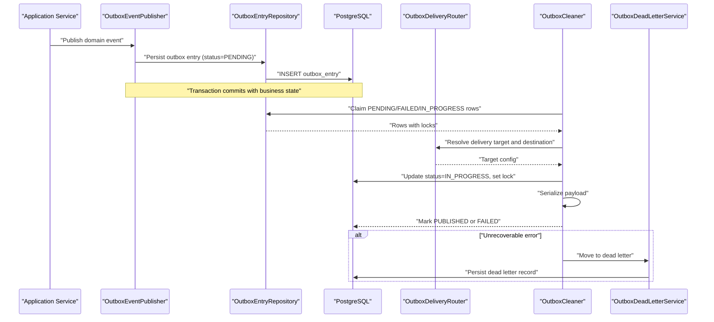

**Diagram sources**
- [OutboxEventPublisher.kt](file://j-store-common-spring/src/main/kotlin/com/jstore/common/framework/event/outbox/OutboxEventPublisher.kt)
- [OutboxEntryRepository.kt](file://j-store-common-core/src/main/kotlin/com/jstore/common/framework/event/outbox/OutboxEntryRepository.kt)
- [OutboxDeliveryRouter.kt](file://j-store-common-core/src/main/kotlin/com/jstore/common/framework/event/outbox/OutboxDeliveryRouter.kt)
- [OutboxCleaner.kt](file://j-store-common-spring/src/main/kotlin/com/jstore/common/framework/event/outbox/OutboxCleaner.kt)
- [OutboxDeadLetterService.kt](file://j-store-common-spring/src/main/kotlin/com/jstore/common/framework/event/outbox/OutboxDeadLetterService.kt)

## Detailed Component Analysis

### Data Model: Outbox Entry and Consumption Records
- The outbox entry table stores all fields required for reliable delivery: identifiers, routing metadata, payload, aggregate context, timestamps, status, retry counters, locking information, and last error details.
- Indexes support efficient polling by status and creation time, claiming with next attempt scheduling, lock expiration recovery, cleanup of published entries, and filtering by delivery target.
- A separate consumption tracking table records per-listener idempotency keys to prevent duplicate processing.

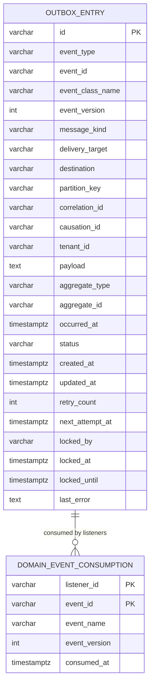

**Diagram sources**
- [06-outbox-entry.sql](file://docker/postgres/init/06-outbox-entry.sql)

**Section sources**
- [06-outbox-entry.sql](file://docker/postgres/init/06-outbox-entry.sql)

### Outbox Entry Entity and Status
- The entity models the row structure and behaviors associated with an outbox entry, including status transitions and validation rules.
- Status values include PENDING, IN_PROGRESS, FAILED, and PUBLISHED, enabling robust lifecycle management.

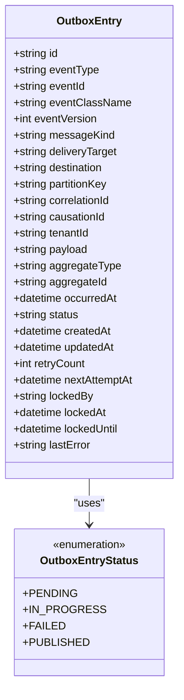

**Diagram sources**
- [OutboxEntry.kt](file://j-store-common-core/src/main/kotlin/com/jstore/common/framework/event/outbox/OutboxEntry.kt)

**Section sources**
- [OutboxEntry.kt](file://j-store-common-core/src/main/kotlin/com/jstore/common/framework/event/outbox/OutboxEntry.kt)

### Repository Abstraction
- The repository defines methods to persist, claim, update, and query outbox entries and consumption records.
- It encapsulates transactional semantics and indexing strategies used by the publisher and cleaner.

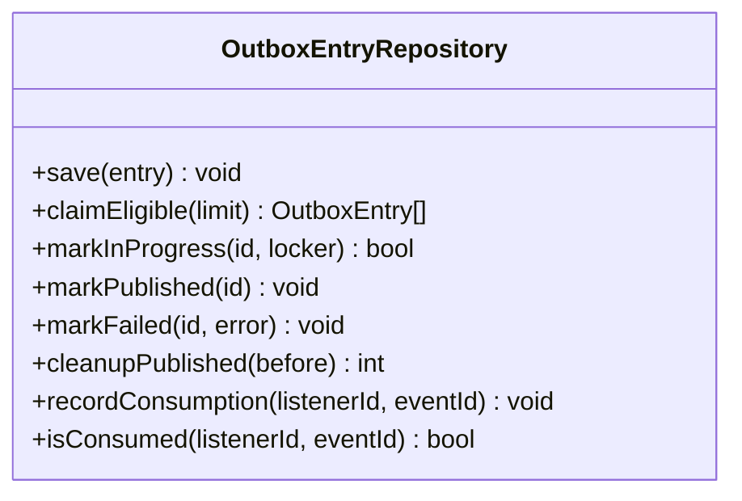

**Diagram sources**
- [OutboxEntryRepository.kt](file://j-store-common-core/src/main/kotlin/com/jstore/common/framework/event/outbox/OutboxEntryRepository.kt)

**Section sources**
- [OutboxEntryRepository.kt](file://j-store-common-core/src/main/kotlin/com/jstore/common/framework/event/outbox/OutboxEntryRepository.kt)

### Delivery Routing
- The router resolves the appropriate delivery target and destination using metadata such as delivery target and destination fields.
- It supports multi-target routing and can be extended for custom routing logic.

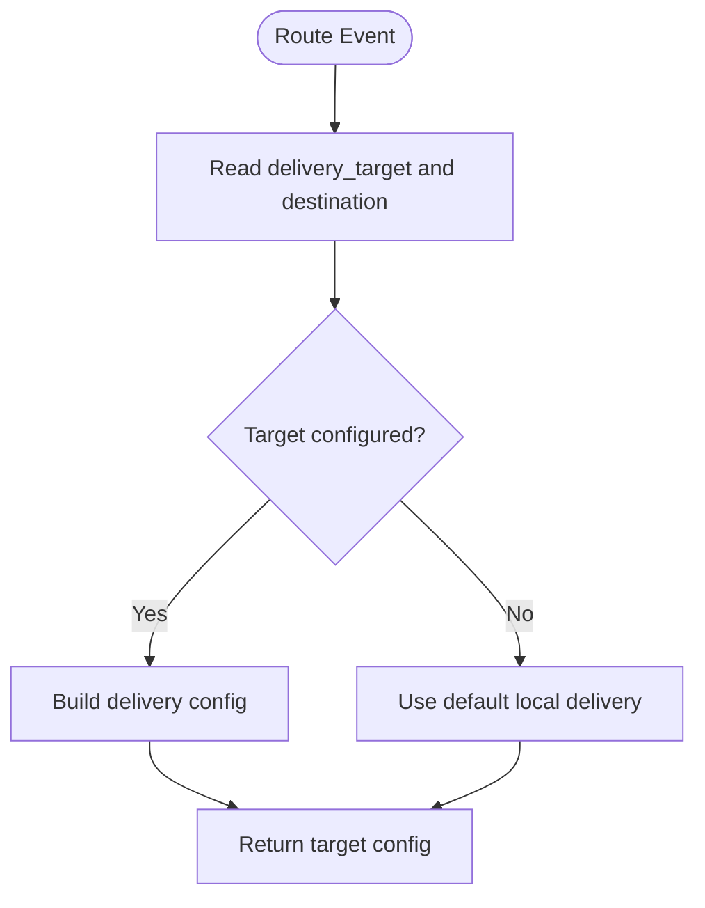

**Diagram sources**
- [OutboxDeliveryRouter.kt](file://j-store-common-core/src/main/kotlin/com/jstore/common/framework/event/outbox/OutboxDeliveryRouter.kt)

**Section sources**
- [OutboxDeliveryRouter.kt](file://j-store-common-core/src/main/kotlin/com/jstore/common/framework/event/outbox/OutboxDeliveryRouter.kt)

### Publisher Integration
- The publisher integrates with application transactions to persist outbox entries atomically with business state changes.
- It sets initial status to PENDING and assigns identifiers and metadata.

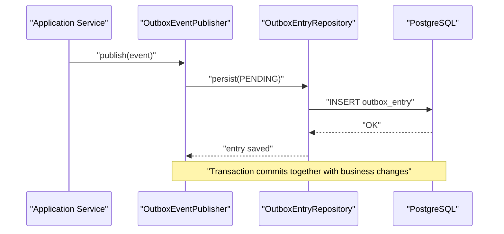

**Diagram sources**
- [OutboxEventPublisher.kt](file://j-store-common-spring/src/main/kotlin/com/jstore/common/framework/event/outbox/OutboxEventPublisher.kt)

**Section sources**
- [OutboxEventPublisher.kt](file://j-store-common-spring/src/main/kotlin/com/jstore/common/framework/event/outbox/OutboxEventPublisher.kt)

### Cleaner and Retry Mechanism
- The cleaner periodically claims eligible entries based on status and next attempt scheduling.
- It applies optimistic locking and sets short-lived locks to avoid stuck processing.
- On success, it marks entries as PUBLISHED; on failure, it increments retry count and schedules next attempt.

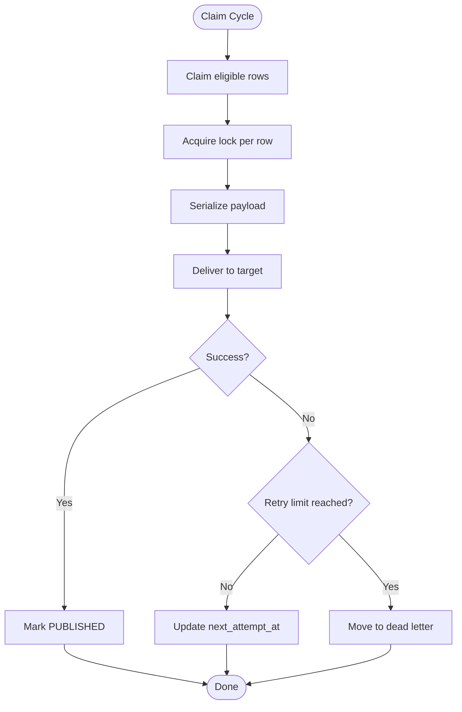

**Diagram sources**
- [OutboxCleaner.kt](file://j-store-common-spring/src/main/kotlin/com/jstore/common/framework/event/outbox/OutboxCleaner.kt)

**Section sources**
- [OutboxCleaner.kt](file://j-store-common-spring/src/main/kotlin/com/jstore/common/framework/event/outbox/OutboxCleaner.kt)

### Dead Letter Handling
- Unrecoverable failures are persisted to a dead letter store for manual inspection and reprocessing.
- The dead letter service provides operations to list, inspect, and replay dead letter entries.

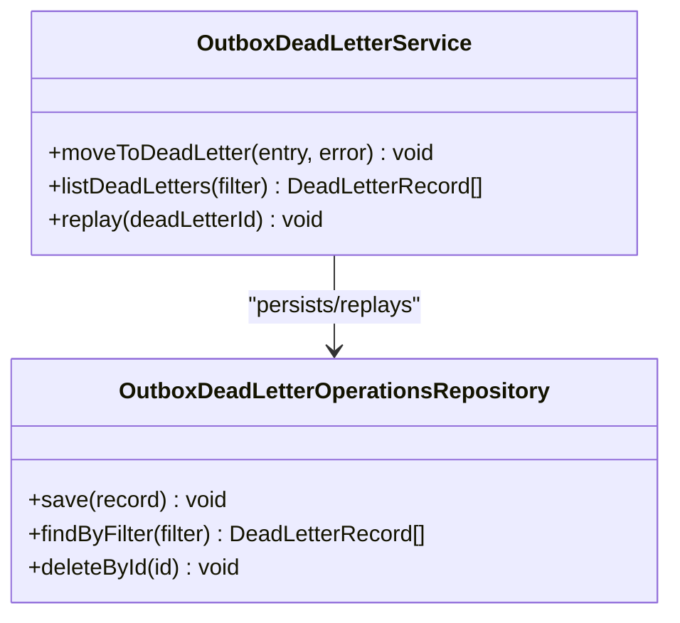

**Diagram sources**
- [OutboxDeadLetterService.kt](file://j-store-common-spring/src/main/kotlin/com/jstore/common/framework/event/outbox/OutboxDeadLetterService.kt)
- [OutboxDeadLetterOperationsRepository.kt](file://j-store-common-spring/src/main/kotlin/com/jstore/common/framework/event/outbox/OutboxDeadLetterOperationsRepository.kt)

**Section sources**
- [OutboxDeadLetterService.kt](file://j-store-common-spring/src/main/kotlin/com/jstore/common/framework/event/outbox/OutboxDeadLetterService.kt)
- [OutboxDeadLetterOperationsRepository.kt](file://j-store-common-spring/src/main/kotlin/com/jstore/common/framework/event/outbox/OutboxDeadLetterOperationsRepository.kt)

### Monitoring and Health
- Monitor exposes metrics such as counts by status, retry rates, and latency indicators.
- Operational health aggregates key signals to determine pipeline health and readiness.

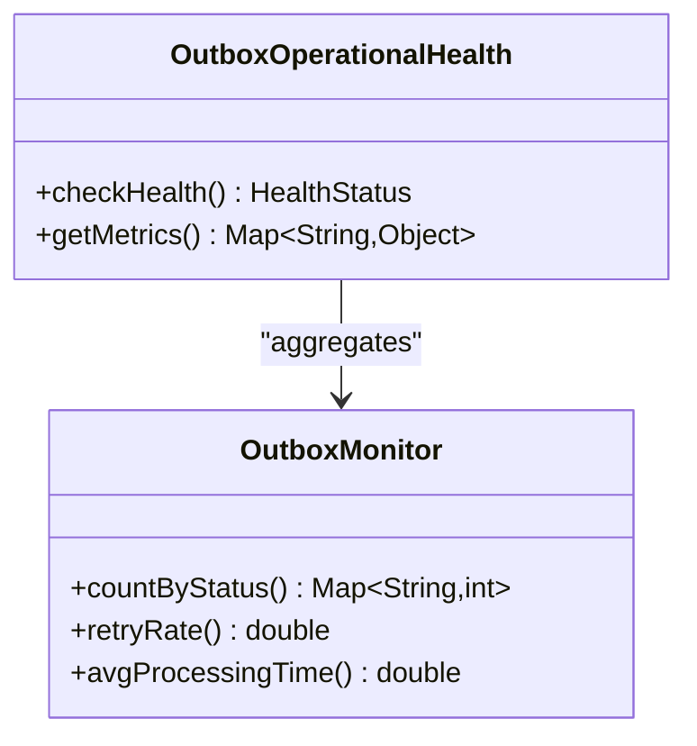

**Diagram sources**
- [OutboxMonitor.kt](file://j-store-common-spring/src/main/kotlin/com/jstore/common/framework/event/outbox/OutboxMonitor.kt)
- [OutboxOperationalHealth.kt](file://j-store-common-spring/src/main/kotlin/com/jstore/common/framework/event/outbox/OutboxOperationalHealth.kt)

**Section sources**
- [OutboxMonitor.kt](file://j-store-common-spring/src/main/kotlin/com/jstore/common/framework/event/outbox/OutboxMonitor.kt)
- [OutboxOperationalHealth.kt](file://j-store-common-spring/src/main/kotlin/com/jstore/common/framework/event/outbox/OutboxOperationalHealth.kt)

### Configuration and Auto-Configuration
- Properties define defaults for batch sizes, intervals, retry limits, and timeouts.
- Auto-configuration wires up the cleaner, monitor, and other components with sensible defaults.

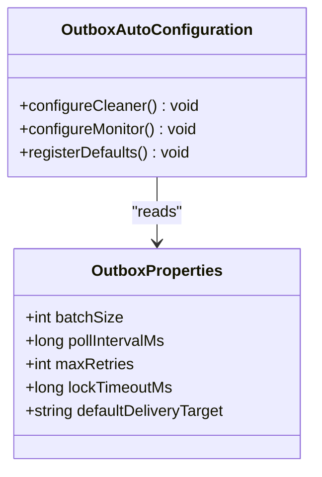

**Diagram sources**
- [OutboxProperties.kt](file://j-store-common-spring/src/main/kotlin/com/jstore/common/framework/event/outbox/OutboxProperties.kt)
- [OutboxAutoConfiguration.kt](file://j-store-common-spring/src/main/kotlin/com/jstore/common/framework/event/outbox/OutboxAutoConfiguration.kt)

**Section sources**
- [OutboxProperties.kt](file://j-store-common-spring/src/main/kotlin/com/jstore/common/framework/event/outbox/OutboxProperties.kt)
- [OutboxAutoConfiguration.kt](file://j-store-common-spring/src/main/kotlin/com/jstore/common/framework/event/outbox/OutboxAutoConfiguration.kt)

### Operational API
- The operations controller exposes endpoints for inspecting outbox entries, viewing dead letters, and triggering maintenance tasks.
- DTOs define request/response shapes for clarity and stability.

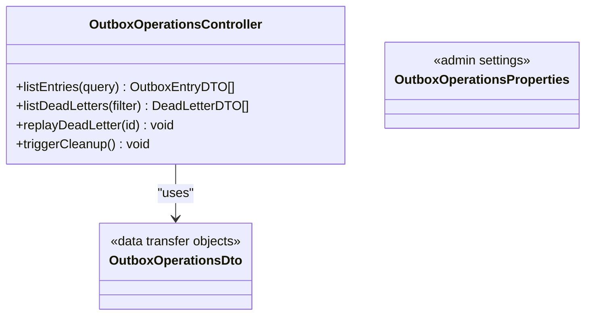

**Diagram sources**
- [OutboxOperationsController.kt](file://j-store-boot/src/main/kotlin/com/jstore/outbox/operations/OutboxOperationsController.kt)
- [OutboxOperationsDto.kt](file://j-store-boot/src/main/kotlin/com/jstore/outbox/operations/OutboxOperationsDto.kt)
- [OutboxOperationsProperties.kt](file://j-store-boot/src/main/kotlin/com/jstore/outbox/operations/OutboxOperationsProperties.kt)

**Section sources**
- [OutboxOperationsController.kt](file://j-store-boot/src/main/kotlin/com/jstore/outbox/operations/OutboxOperationsController.kt)
- [OutboxOperationsDto.kt](file://j-store-boot/src/main/kotlin/com/jstore/outbox/operations/OutboxOperationsDto.kt)
- [OutboxOperationsProperties.kt](file://j-store-boot/src/main/kotlin/com/jstore/outbox/operations/OutboxOperationsProperties.kt)

### Message Consumption Tracking
- Consumption records ensure idempotent processing per listener and event identity.
- The repository abstraction supports recording and checking consumption status.

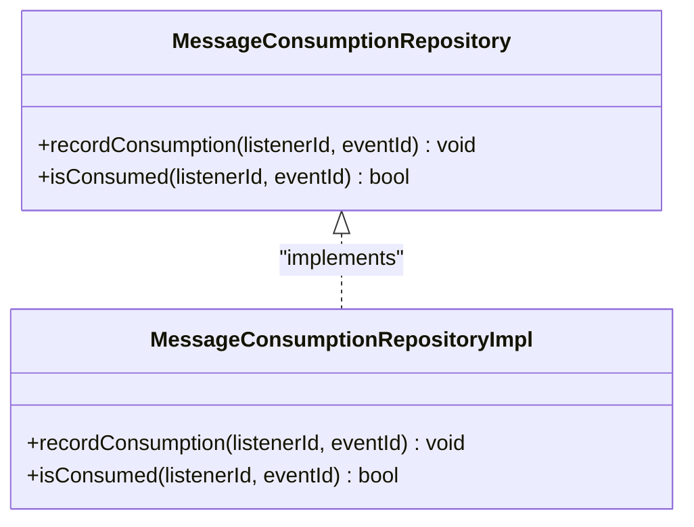

**Diagram sources**
- [MessageConsumptionRepository.kt](file://j-store-common-core/src/main/kotlin/com/jstore/common/framework/messaging/MessageConsumptionRepository.kt)
- [MessageConsumptionRepositoryImpl.kt](file://j-store-common-spring/src/main/kotlin/com/jstore/common/framework/messaging/persistence/MessageConsumptionRepositoryImpl.kt)

**Section sources**
- [MessageConsumptionRepository.kt](file://j-store-common-core/src/main/kotlin/com/jstore/common/framework/messaging/MessageConsumptionRepository.kt)
- [MessageConsumptionRepositoryImpl.kt](file://j-store-common-spring/src/main/kotlin/com/jstore/common/framework/messaging/persistence/MessageConsumptionRepositoryImpl.kt)

### Conceptual Overview
The outbox pattern decouples event publishing from delivery, ensuring durability and eventual consistency. Events are first stored in the outbox table within the same transaction as business state changes. A background process claims and delivers events, updating status and handling retries. Unrecoverable failures are isolated in a dead letter store. Consumption tracking prevents duplicate processing.

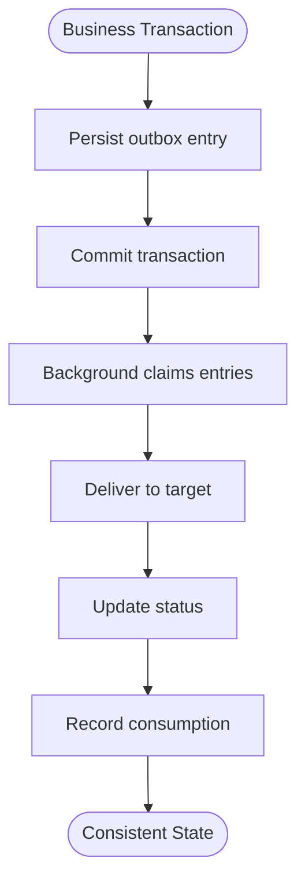

[No sources needed since this diagram shows conceptual workflow, not actual code structure]

## Dependency Analysis
The outbox system composes several modules with clear responsibilities:
- Core abstractions define data models and repository contracts.
- Spring components implement runtime behavior, scheduling, and monitoring.
- Boot module exposes operational endpoints.
- Database schema provides durable storage and indexes for performance.

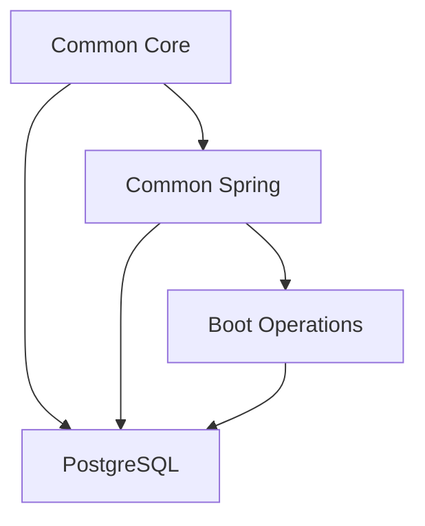

**Diagram sources**
- [OutboxEntry.kt](file://j-store-common-core/src/main/kotlin/com/jstore/common/framework/event/outbox/OutboxEntry.kt)
- [OutboxEventPublisher.kt](file://j-store-common-spring/src/main/kotlin/com/jstore/common/framework/event/outbox/OutboxEventPublisher.kt)
- [OutboxOperationsController.kt](file://j-store-boot/src/main/kotlin/com/jstore/outbox/operations/OutboxOperationsController.kt)
- [06-outbox-entry.sql](file://docker/postgres/init/06-outbox-entry.sql)

**Section sources**
- [OutboxEntry.kt](file://j-store-common-core/src/main/kotlin/com/jstore/common/framework/event/outbox/OutboxEntry.kt)
- [OutboxEventPublisher.kt](file://j-store-common-spring/src/main/kotlin/com/jstore/common/framework/event/outbox/OutboxEventPublisher.kt)
- [OutboxOperationsController.kt](file://j-store-boot/src/main/kotlin/com/jstore/outbox/operations/OutboxOperationsController.kt)
- [06-outbox-entry.sql](file://docker/postgres/init/06-outbox-entry.sql)

## Performance Considerations
- Use targeted indexes for claiming and cleanup queries to minimize full table scans.
- Tune batch size and poll interval to balance throughput and resource usage.
- Set appropriate lock timeouts to recover from crashed workers quickly.
- Partition large tables if necessary and archive old published entries periodically.
- Monitor retry rates and adjust max retries and backoff strategies accordingly.

[No sources needed since this section provides general guidance]

## Troubleshooting Guide
- Inspect outbox entries by status to identify stuck or failing messages.
- Review last error fields for diagnostic clues.
- Use dead letter operations to replay or analyze unrecoverable failures.
- Check consumption records to verify idempotency and detect duplicates.
- Validate configuration properties for correct defaults and runtime overrides.

**Section sources**
- [OutboxOperationsController.kt](file://j-store-boot/src/main/kotlin/com/jstore/outbox/operations/OutboxOperationsController.kt)
- [OutboxDeadLetterService.kt](file://j-store-common-spring/src/main/kotlin/com/jstore/common/framework/event/outbox/OutboxDeadLetterService.kt)
- [OutboxMonitor.kt](file://j-store-common-spring/src/main/kotlin/com/jstore/common/framework/event/outbox/OutboxMonitor.kt)

## Conclusion
The event outbox and messaging infrastructure provides a robust foundation for reliable, scalable, and observable event-driven communication across services. By persisting events atomically, delivering them with retries, isolating failures, and tracking consumption, the system ensures strong consistency guarantees while maintaining high availability and operational clarity.

[No sources needed since this section summarizes without analyzing specific files]

## Appendices

### Message Serialization Formats and Type Registries
- Payloads are serialized as strings within the outbox entry payload field.
- Event type metadata includes event class name and version to support evolution and compatibility.
- Type registries can be implemented around the publisher and router to map event types to serializers and handlers.

**Section sources**
- [06-outbox-entry.sql](file://docker/postgres/init/06-outbox-entry.sql)
- [OutboxEventPublisher.kt](file://j-store-common-spring/src/main/kotlin/com/jstore/common/framework/event/outbox/OutboxEventPublisher.kt)

### Delivery Target Configuration and Routing
- Delivery target and destination fields guide routing decisions.
- Default local delivery is supported when no explicit target is configured.
- Custom routers can extend routing logic for advanced scenarios.

**Section sources**
- [OutboxDeliveryRouter.kt](file://j-store-common-core/src/main/kotlin/com/jstore/common/framework/event/outbox/OutboxDeliveryRouter.kt)
- [OutboxProperties.kt](file://j-store-common-spring/src/main/kotlin/com/jstore/common/framework/event/outbox/OutboxProperties.kt)

### Ordering Guarantees and Idempotency
- Ordering can be enforced using partition keys correlated with aggregate identifiers.
- Idempotency is ensured through event IDs and per-listener consumption records.
- Consumers should validate idempotency keys before processing.

**Section sources**
- [06-outbox-entry.sql](file://docker/postgres/init/06-outbox-entry.sql)
- [MessageConsumptionRepository.kt](file://j-store-common-core/src/main/kotlin/com/jstore/common/framework/messaging/MessageConsumptionRepository.kt)

### Monitoring and Operational Procedures
- Use operational health checks to assess pipeline status.
- Monitor metrics for counts by status, retry rates, and processing times.
- Perform routine cleanup of published entries and review dead letters regularly.

**Section sources**
- [OutboxOperationalHealth.kt](file://j-store-common-spring/src/main/kotlin/com/jstore/common/framework/event/outbox/OutboxOperationalHealth.kt)
- [OutboxMonitor.kt](file://j-store-common-spring/src/main/kotlin/com/jstore/common/framework/event/outbox/OutboxMonitor.kt)
- [OutboxCleaner.kt](file://j-store-common-spring/src/main/kotlin/com/jstore/common/framework/event/outbox/OutboxCleaner.kt)

### Related Dead Queue Patterns
- A separate timer job dead queue exists for scheduled jobs, demonstrating a similar pattern for handling failures outside the outbox flow.

**Section sources**
- [TimerJobDeadQueueJpaPO.java](file://j-store-boot/src/main/java/com/jstore/order/expired/TimerJobDeadQueueJpaPO.java)