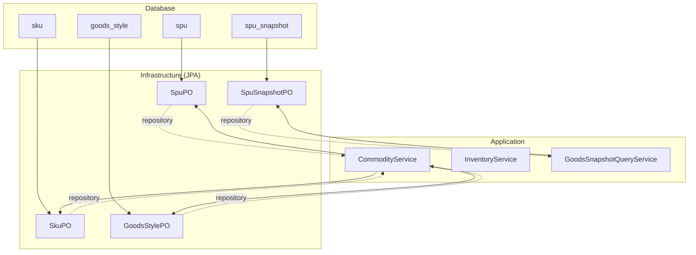
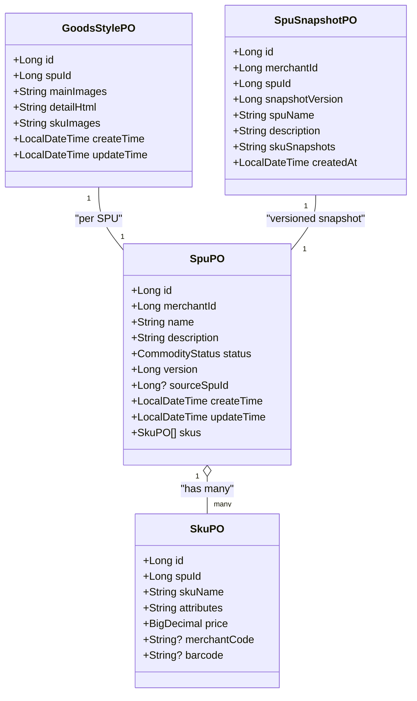
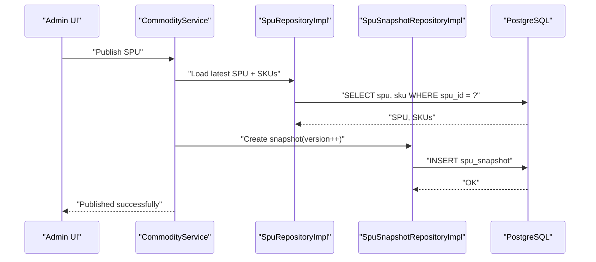
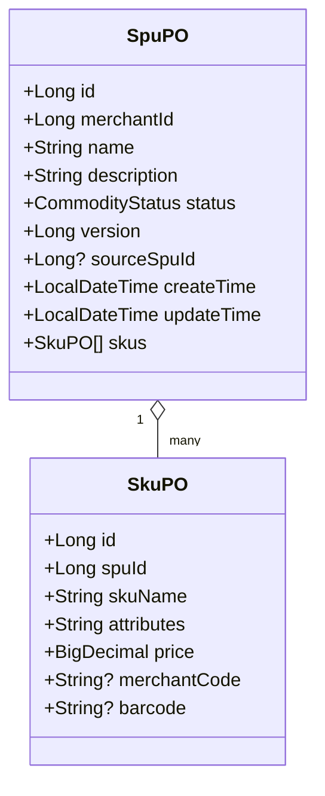
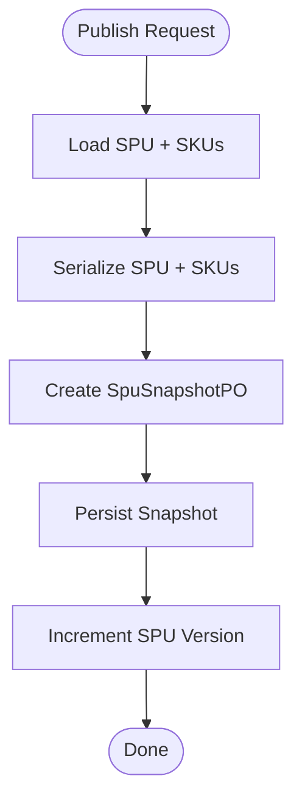
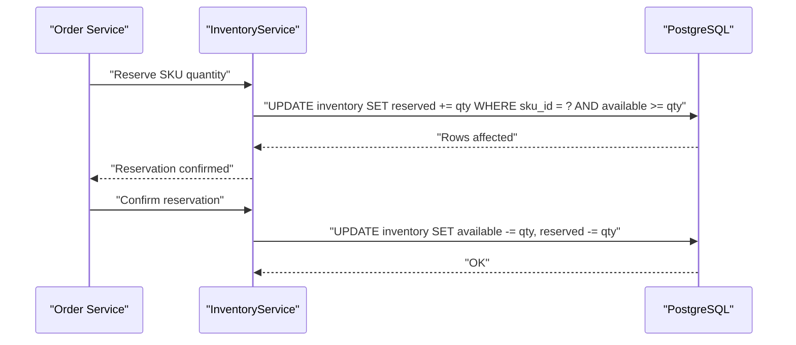
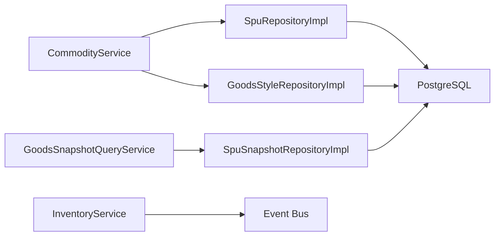

# Goods Catalog Schema

<cite>
**Referenced Files in This Document**
- [04-goods-spu-sku-snapshot.sql](file://docker/postgres/init/04-goods-spu-sku-snapshot.sql)
- [07-goods-style-sku-code.sql](file://docker/postgres/init/07-goods-style-sku-code.sql)
- [09-goods-spu-source-spu-id.sql](file://docker/postgres/init/09-goods-spu-source-spu-id.sql)
- [SpuPO.kt](file://j-store-goods-infrastructure/src/main/kotlin/com/jstore/goods/domain/commodity/persistence/SpuPO.kt)
- [SkuPO.kt](file://j-store-goods-infrastructure/src/main/kotlin/com/jstore/goods/domain/commodity/persistence/SkuPO.kt)
- [GoodsStylePO.kt](file://j-store-goods-infrastructure/src/main/kotlin/com/jstore/goods/domain/commodity/persistence/GoodsStylePO.kt)
- [SpuSnapshotPO.kt](file://j-store-goods-infrastructure/src/main/kotlin/com/jstore/goods/domain/commodity/persistence/SpuSnapshotPO.kt)
- [CommodityService.kt](file://j-store-goods-application/src/main/kotlin/com/jstore/goods/service/CommodityService.kt)
- [InventoryService.kt](file://j-store-goods-application/src/main/kotlin/com/jstore/goods/service/InventoryService.kt)
- [GoodsSnapshotQueryService.kt](file://j-store-goods-api/src/main/kotlin/com/jstore/goods/api/GoodsSnapshotQueryService.kt)
- [SpuRepositoryImpl.kt](file://j-store-goods-infrastructure/src/main/kotlin/com/jstore/goods/domain/commodity/SpuRepositoryImpl.kt)
- [GoodsStyleRepositoryImpl.kt](file://j-store-goods-infrastructure/src/main/kotlin/com/jstore/goods/domain/commodity/GoodsStyleRepositoryImpl.kt)
- [SpuSnapshotRepositoryImpl.kt](file://j-store-goods-infrastructure/src/main/kotlin/com/jstore/goods/domain/commodity/SpuSnapshotRepositoryImpl.kt)
</cite>

## Table of Contents
1. Introduction
2. Project Structure
3. Core Components
4. Architecture Overview
5. Detailed Component Analysis
6. Dependency Analysis
7. Performance Considerations
8. Troubleshooting Guide
9. Conclusion

## Introduction
This document provides comprehensive data model documentation for the goods catalog schema, focusing on the SPU/SKU hierarchy, product attributes, variants, style configurations, snapshot mechanism, draft workflow with versioning and state management, inventory tracking and stock reservation, image storage references, query optimization, and data integrity constraints for pricing and relationships. It synthesizes database migrations, JPA entities, and application services to present a clear, code-mapped view of the system’s catalog domain.

## Project Structure
The goods catalog is implemented across three layers:
- Database migrations define the canonical schema (SPU, SKU, GoodsStyle, SPU Snapshot).
- Infrastructure layer maps these tables to JPA entities and repositories.
- Application layer exposes use cases for commodity operations and inventory handling.

**Diagram sources**
- [04-goods-spu-sku-snapshot.sql:1-55](file://docker/postgres/init/04-goods-spu-sku-snapshot.sql#L1-L55)
- [07-goods-style-sku-code.sql:1-32](file://docker/postgres/init/07-goods-style-sku-code.sql#L1-L32)
- [09-goods-spu-source-spu-id.sql:1-9](file://docker/postgres/init/09-goods-spu-source-spu-id.sql#L1-L9)
- [SpuPO.kt:1-27](file://j-store-goods-infrastructure/src/main/kotlin/com/jstore/goods/domain/commodity/persistence/SpuPO.kt#L1-L27)
- [SkuPO.kt:1-21](file://j-store-goods-infrastructure/src/main/kotlin/com/jstore/goods/domain/commodity/persistence/SkuPO.kt#L1-L21)
- [GoodsStylePO.kt:1-22](file://j-store-goods-infrastructure/src/main/kotlin/com/jstore/goods/domain/commodity/persistence/GoodsStylePO.kt#L1-L22)
- [SpuSnapshotPO.kt:1-25](file://j-store-goods-infrastructure/src/main/kotlin/com/jstore/goods/domain/commodity/persistence/SpuSnapshotPO.kt#L1-L25)

**Section sources**
- [04-goods-spu-sku-snapshot.sql:1-55](file://docker/postgres/init/04-goods-spu-sku-snapshot.sql#L1-L55)
- [07-goods-style-sku-code.sql:1-32](file://docker/postgres/init/07-goods-style-sku-code.sql#L1-L32)
- [09-goods-spu-source-spu-id.sql:1-9](file://docker/postgres/init/09-goods-spu-source-spu-id.sql#L1-L9)
- [SpuPO.kt:1-27](file://j-store-goods-infrastructure/src/main/kotlin/com/jstore/goods/domain/commodity/persistence/SpuPO.kt#L1-L27)
- [SkuPO.kt:1-21](file://j-store-goods-infrastructure/src/main/kotlin/com/jstore/goods/domain/commodity/persistence/SkuPO.kt#L1-L21)
- [GoodsStylePO.kt:1-22](file://j-store-goods-infrastructure/src/main/kotlin/com/jstore/goods/domain/commodity/persistence/GoodsStylePO.kt#L1-L22)
- [SpuSnapshotPO.kt:1-25](file://j-store-goods-infrastructure/src/main/kotlin/com/jstore/goods/domain/commodity/persistence/SpuSnapshotPO.kt#L1-L25)

## Core Components
- SPU (Standard Product Unit): Represents a product concept with metadata, status, and versioning. Supports draft workflows via source_spu_id.
- SKU (Stock Keeping Unit): Represents a concrete variant with attributes, price, merchant code, and barcode.
- GoodsStyle: Presentation assets for SPU including main images, detail HTML, and per-SKU images.
- SPU Snapshot: Immutable record of SPU and SKUs at publish time, enabling historical order accuracy.

Key responsibilities:
- CommodityService orchestrates SPU/SKU lifecycle, draft creation, merging, and publishing.
- InventoryService manages stock levels and reservations triggered by business events.
- GoodsSnapshotQueryService serves read-time snapshots for orders and browsing.

**Section sources**
- [CommodityService.kt](file://j-store-goods-application/src/main/kotlin/com/jstore/goods/service/CommodityService.kt)
- [InventoryService.kt](file://j-store-goods-application/src/main/kotlin/com/jstore/goods/service/InventoryService.kt)
- [GoodsSnapshotQueryService.kt](file://j-store-goods-api/src/main/kotlin/com/jstore/goods/api/GoodsSnapshotQueryService.kt)

## Architecture Overview
The goods catalog follows a layered architecture:
- Domain models are persisted via JPA entities mapped to PostgreSQL tables.
- Repositories abstract persistence details and expose domain-friendly interfaces.
- Application services coordinate transactions, enforce business rules, and emit events.

**Diagram sources**
- [SpuPO.kt:1-27](file://j-store-goods-infrastructure/src/main/kotlin/com/jstore/goods/domain/commodity/persistence/SpuPO.kt#L1-L27)
- [SkuPO.kt:1-21](file://j-store-goods-infrastructure/src/main/kotlin/com/jstore/goods/domain/commodity/persistence/SkuPO.kt#L1-L21)
- [GoodsStylePO.kt:1-22](file://j-store-goods-infrastructure/src/main/kotlin/com/jstore/goods/domain/commodity/persistence/GoodsStylePO.kt#L1-L22)
- [SpuSnapshotPO.kt:1-25](file://j-store-goods-infrastructure/src/main/kotlin/com/jstore/goods/domain/commodity/persistence/SpuSnapshotPO.kt#L1-L25)

## Detailed Component Analysis

### SPU/SKU Hierarchy and Attributes
- SPU stores core product identity, status, and version. Status transitions support DRAFT/OFF_SALE/ON_SALE.
- SKU captures variant-level attributes as JSONB, price in cents, and optional merchant_code/barcode.
- Relationship enforced via foreign key from sku.spu_id to spu.id; index on sku.spu_id optimizes queries.

Data integrity:
- SKU attributes stored as JSONB array of key-value pairs.
- Price precision defined as numeric(19,0) to avoid floating-point issues.
- Indexes support efficient lookups by SPU.

**Section sources**
- [04-goods-spu-sku-snapshot.sql:1-55](file://docker/postgres/init/04-goods-spu-sku-snapshot.sql#L1-L55)
- [SpuPO.kt:1-27](file://j-store-goods-infrastructure/src/main/kotlin/com/jstore/goods/domain/commodity/persistence/SpuPO.kt#L1-L27)
- [SkuPO.kt:1-21](file://j-store-goods-infrastructure/src/main/kotlin/com/jstore/goods/domain/commodity/persistence/SkuPO.kt#L1-L21)

### Style Configuration and Media Assets
- GoodsStyle holds presentation assets: ordered main_images (JSONB), detail_html (TEXT), and sku_images mapping (JSONB object keyed by skuId).
- Unique constraint ensures one GoodsStyle per SPU.
- Image references are keys (not URLs), decoupling storage from catalog data.

Optimization:
- Unique index on goods_style.spu_id prevents duplication.
- JSONB fields allow flexible media structures without schema changes.

**Section sources**
- [07-goods-style-sku-code.sql:1-32](file://docker/postgres/init/07-goods-style-sku-code.sql#L1-L32)
- [GoodsStylePO.kt:1-22](file://j-store-goods-infrastructure/src/main/kotlin/com/jstore/goods/domain/commodity/persistence/GoodsStylePO.kt#L1-L22)

### Snapshot Mechanism
- SPU Snapshot records immutable product data at publish time, including SPU metadata and an array of SKU snapshots.
- Unique constraint on (spu_id, snapshot_version) ensures versioned immutability.
- Used by order systems to preserve accurate product info at purchase time.

Workflow:
- On publish, current SPU and SKUs are serialized into a snapshot row.
- Snapshot version increments with each publish.

**Section sources**
- [04-goods-spu-sku-snapshot.sql:1-55](file://docker/postgres/init/04-goods-spu-sku-snapshot.sql#L1-L55)
- [SpuSnapshotPO.kt:1-25](file://j-store-goods-infrastructure/src/main/kotlin/com/jstore/goods/domain/commodity/persistence/SpuSnapshotPO.kt#L1-L25)

### Draft Workflow and Versioning
- SPU supports draft copies via source_spu_id: null indicates original, non-null indicates draft derived from a source SPU.
- Partial index on spu.source_spu_id accelerates draft discovery.
- CommodityService implements draft creation, editing, and merge back to source, guarding status transitions and data integrity.

State management:
- Status field enforces lifecycle (DRAFT/OFF_SALE/ON_SALE).
- Version field tracks publish iterations aligned with snapshot versions.

**Section sources**
- [09-goods-spu-source-spu-id.sql:1-9](file://docker/postgres/init/09-goods-spu-source-spu-id.sql#L1-L9)
- [SpuPO.kt:1-27](file://j-store-goods-infrastructure/src/main/kotlin/com/jstore/goods/domain/commodity/persistence/SpuPO.kt#L1-L27)
- [CommodityService.kt](file://j-store-goods-application/src/main/kotlin/com/jstore/goods/service/CommodityService.kt)

### Inventory Tracking and Stock Reservation
- InventoryService handles stock level updates and reservation logic driven by domain events (e.g., order placement, after-sale restoration).
- Reservations temporarily hold stock until payment confirmation or expiration.
- Integration points ensure atomicity between order and inventory states.

Operational flow:
- Order events trigger reservation creation.
- Payment success converts reservations to committed stock usage.
- After-sale events restore reserved stock.

**Section sources**
- [InventoryService.kt](file://j-store-goods-application/src/main/kotlin/com/jstore/goods/service/InventoryService.kt)

### Query Optimization for Catalog Browsing
- Indexes:
  - idx_sku_spu_id: Fast retrieval of SKUs per SPU.
  - idx_spu_snapshot_spu_id: Efficient snapshot lookup by SPU.
  - Unique index on goods_style.spu_id: Prevents duplicates and aids joins.
  - Partial index on spu.source_spu_id: Optimizes draft queries.
- JSONB columns enable flexible attribute filtering but should be used judiciously; consider generated columns or materialized views for heavy attribute searches.

Best practices:
- Use pagination for large catalogs.
- Cache frequently accessed SPU/SKU lists.
- Precompute popular attribute combinations for search indexes.

**Section sources**
- [04-goods-spu-sku-snapshot.sql:1-55](file://docker/postgres/init/04-goods-spu-sku-snapshot.sql#L1-L55)
- [07-goods-style-sku-code.sql:1-32](file://docker/postgres/init/07-goods-style-sku-code.sql#L1-L32)
- [09-goods-spu-source-spu-id.sql:1-9](file://docker/postgres/init/09-goods-spu-source-spu-id.sql#L1-L9)

### Data Integrity Constraints and Pricing Calculations
- Foreign key: sku.spu_id references spu.id ensures referential integrity.
- Numeric precision: price uses numeric(19,0) to represent cents accurately.
- Unique constraints:
  - spu_snapshot(spu_id, snapshot_version) prevents duplicate versions.
  - goods_style(spu_id) ensures single style per SPU.
- Check constraints: Enforce valid status values and logical bounds where applicable.

Pricing calculation:
- SKU price is authoritative; snapshots capture price at publish time.
- Avoid floating-point arithmetic; use integer cents throughout.

**Section sources**
- [04-goods-spu-sku-snapshot.sql:1-55](file://docker/postgres/init/04-goods-spu-sku-snapshot.sql#L1-L55)
- [SpuSnapshotPO.kt:1-25](file://j-store-goods-infrastructure/src/main/kotlin/com/jstore/goods/domain/commodity/persistence/SpuSnapshotPO.kt#L1-L25)

## Architecture Overview
The goods catalog integrates with order and inventory domains through well-defined boundaries:
- CommodityService coordinates SPU/SKU operations and publishes events.
- GoodsSnapshotQueryService provides read-optimized access to snapshots.
- InventoryService reacts to events to manage stock reservations.

**Diagram sources**
- [CommodityService.kt](file://j-store-goods-application/src/main/kotlin/com/jstore/goods/service/CommodityService.kt)
- [SpuRepositoryImpl.kt](file://j-store-goods-infrastructure/src/main/kotlin/com/jstore/goods/domain/commodity/SpuRepositoryImpl.kt)
- [SpuSnapshotRepositoryImpl.kt](file://j-store-goods-infrastructure/src/main/kotlin/com/jstore/goods/domain/commodity/SpuSnapshotRepositoryImpl.kt)

## Detailed Component Analysis

### SPU Entity and Relationships
- SpuPO includes merchant_id, name, description, status, version, source_spu_id, timestamps, and a one-to-many relationship with SkuPO.
- Eager fetching of SKUs simplifies common reads but may impact performance for large catalogs; consider lazy loading for specific use cases.

**Diagram sources**
- [SpuPO.kt:1-27](file://j-store-goods-infrastructure/src/main/kotlin/com/jstore/goods/domain/commodity/persistence/SpuPO.kt#L1-L27)
- [SkuPO.kt:1-21](file://j-store-goods-infrastructure/src/main/kotlin/com/jstore/goods/domain/commodity/persistence/SkuPO.kt#L1-L21)

### GoodsStyle and Media Management
- GoodsStylePO stores structured media references:
  - main_images: Ordered list of image keys.
  - detail_html: Rich text content.
  - sku_images: Mapping from skuId to list of image keys.
- Decouples storage backend (e.g., OSS) from catalog schema.

**Section sources**
- [07-goods-style-sku-code.sql:1-32](file://docker/postgres/init/07-goods-style-sku-code.sql#L1-L32)
- [GoodsStylePO.kt:1-22](file://j-store-goods-infrastructure/src/main/kotlin/com/jstore/goods/domain/commodity/persistence/GoodsStylePO.kt#L1-L22)

### Snapshot Factory and Query Service
- SpuSnapshotFactory constructs immutable snapshots from live SPU data.
- GoodsSnapshotQueryService exposes methods to retrieve snapshots for order history and product detail rendering.

**Diagram sources**
- [SpuSnapshotPO.kt:1-25](file://j-store-goods-infrastructure/src/main/kotlin/com/jstore/goods/domain/commodity/persistence/SpuSnapshotPO.kt#L1-L25)
- [GoodsSnapshotQueryService.kt](file://j-store-goods-api/src/main/kotlin/com/jstore/goods/api/GoodsSnapshotQueryService.kt)

### Draft Workflow Implementation
- Draft creation copies source SPU, sets source_spu_id, and initializes new version.
- Merge operation validates state transitions and updates source SPU atomically.
- Status guards prevent invalid transitions (e.g., DRAFT to ON_SALE only after validation).

**Section sources**
- [09-goods-spu-source-spu-id.sql:1-9](file://docker/postgres/init/09-goods-spu-source-spu-id.sql#L1-L9)
- [CommodityService.kt](file://j-store-goods-application/src/main/kotlin/com/jstore/goods/service/CommodityService.kt)

### Inventory Reservation Flow
- Reservation creation occurs on order placement.
- Confirmation converts reservation to committed stock.
- Cancellation or timeout restores reserved stock.

**Diagram sources**
- [InventoryService.kt](file://j-store-goods-application/src/main/kotlin/com/jstore/goods/service/InventoryService.kt)

## Dependency Analysis
The goods catalog depends on:
- PostgreSQL for persistent storage with JSONB support.
- JPA/Hibernate for entity mapping and transaction management.
- Event-driven integration with order and inventory services.

**Diagram sources**
- [CommodityService.kt](file://j-store-goods-application/src/main/kotlin/com/jstore/goods/service/CommodityService.kt)
- [SpuRepositoryImpl.kt](file://j-store-goods-infrastructure/src/main/kotlin/com/jstore/goods/domain/commodity/SpuRepositoryImpl.kt)
- [GoodsStyleRepositoryImpl.kt](file://j-store-goods-infrastructure/src/main/kotlin/com/jstore/goods/domain/commodity/GoodsStyleRepositoryImpl.kt)
- [SpuSnapshotRepositoryImpl.kt](file://j-store-goods-infrastructure/src/main/kotlin/com/jstore/goods/domain/commodity/SpuSnapshotRepositoryImpl.kt)
- [InventoryService.kt](file://j-store-goods-application/src/main/kotlin/com/jstore/goods/service/InventoryService.kt)

**Section sources**
- [SpuRepositoryImpl.kt](file://j-store-goods-infrastructure/src/main/kotlin/com/jstore/goods/domain/commodity/SpuRepositoryImpl.kt)
- [GoodsStyleRepositoryImpl.kt](file://j-store-goods-infrastructure/src/main/kotlin/com/jstore/goods/domain/commodity/GoodsStyleRepositoryImpl.kt)
- [SpuSnapshotRepositoryImpl.kt](file://j-store-goods-infrastructure/src/main/kotlin/com/jstore/goods/domain/commodity/SpuSnapshotRepositoryImpl.kt)

## Performance Considerations
- Use indexed columns for frequent filters (spu_id, snapshot_version).
- Leverage JSONB indexing for attribute queries if needed (GIN indexes).
- Cache hot SPU/SKU data in memory or Redis for high-read scenarios.
- Avoid eager loading SKUs in all cases; use projections for specific queries.
- Partition large tables (e.g., spu_snapshot) by time or merchant if growth demands it.

[No sources needed since this section provides general guidance]

## Troubleshooting Guide
Common issues and resolutions:
- Duplicate GoodsStyle: Ensure unique constraint on spu_id is enforced; check migration execution.
- Snapshot version conflicts: Verify unique constraint on (spu_id, snapshot_version); handle concurrent publishes with optimistic locking.
- Draft merge failures: Validate status transitions and source_spu_id consistency; log detailed error messages.
- Inventory race conditions: Use pessimistic locks or atomic updates; monitor reservation timeouts.

**Section sources**
- [07-goods-style-sku-code.sql:1-32](file://docker/postgres/init/07-goods-style-sku-code.sql#L1-L32)
- [04-goods-spu-sku-snapshot.sql:1-55](file://docker/postgres/init/04-goods-spu-sku-snapshot.sql#L1-L55)

## Conclusion
The goods catalog schema provides a robust foundation for managing products, variants, and presentation assets while ensuring data integrity and historical accuracy through snapshots. The draft workflow enables safe iteration before publication, and inventory reservations maintain stock consistency across order lifecycles. Proper indexing and caching strategies optimize performance for both write-heavy and read-heavy workloads.

[No sources needed since this section summarizes without analyzing specific files]