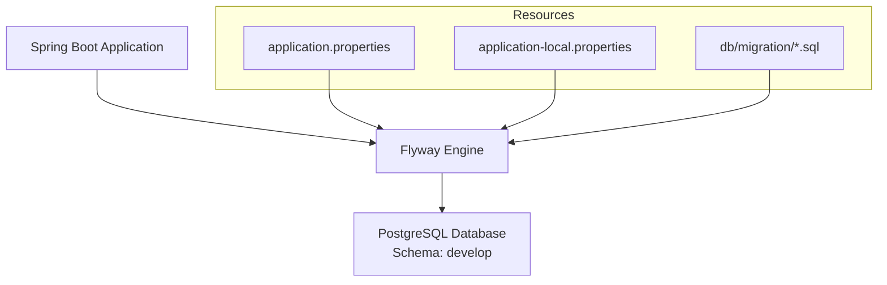
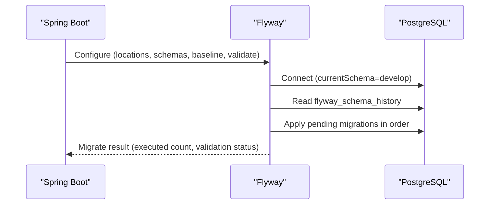
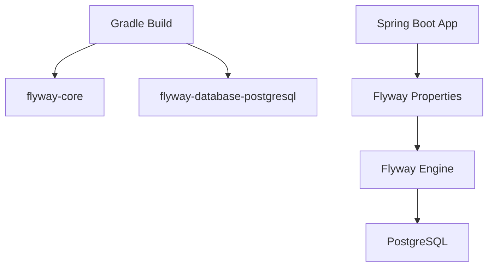
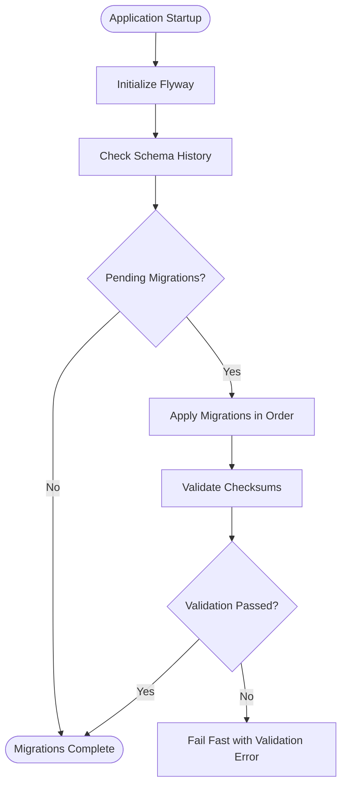

# Migration Strategy & Versioning

<cite>
**Referenced Files in This Document**
- [application.properties](file://j-store-boot/src/main/resources/application.properties)
- [application-local.properties](file://j-store-boot/src/main/resources/application-local.properties)
- [V20260507__baseline_j_store_boot_schema.sql](file://j-store-boot/src/main/resources/db/migration/V20260507__baseline_j_store_boot_schema.sql)
- [V20260731__order_status_dimensions.sql](file://j-store-boot/src/main/resources/db/migration/V20260731__order_status_dimensions.sql)
- [V20260803__order_after_sale_aggregate.sql](file://j-store-boot/src/main/resources/db/migration/V20260803__order_after_sale_aggregate.sql)
- [V20260804__outbox_production_hardening.sql](file://j-store-boot/src/main/resources/db/migration/V20260804__outbox_production_hardening.sql)
- [OutboxFlywayMigrationTest.kt](file://j-store-boot/src/test/kotlin/com/jstore/outbox/OutboxFlywayMigrationTest.kt)
- [build.gradle.kts](file://j-store-boot/build.gradle.kts)
</cite>

## Table of Contents
1. [Introduction](#introduction)
2. [Project Structure](#project-structure)
3. [Core Components](#core-components)
4. [Architecture Overview](#architecture-overview)
5. [Detailed Component Analysis](#detailed-component-analysis)
6. [Dependency Analysis](#dependency-analysis)
7. [Performance Considerations](#performance-considerations)
8. [Troubleshooting Guide](#troubleshooting-guide)
9. [Conclusion](#conclusion)
10. [Appendices](#appendices)

## Introduction
This document describes the database migration strategy and versioning approach for the project, centered on Flyway-based schema management. It explains naming conventions, ordering principles, backward compatibility strategies for schema evolution and data transformations, rollback procedures, disaster recovery plans, testing strategies, zero-downtime deployment techniques, production best practices, conflict resolution, branching strategies, environment-specific configurations, and automation procedures. The guidance is grounded in the actual migration scripts, application configuration, and tests present in the repository.

## Project Structure
The migration system is implemented via Flyway with SQL migrations under a dedicated classpath location. The Spring Boot application enables Flyway at startup and applies migrations against a PostgreSQL database using an isolated schema per environment. A baseline migration establishes the initial schema state, while subsequent versioned migrations evolve the schema incrementally.

**Diagram sources**
- [application.properties:5-10](file://j-store-boot/src/main/resources/application.properties#L5-L10)
- [application-local.properties:10-12](file://j-store-boot/src/main/resources/application-local.properties#L10-L12)
- [V20260507__baseline_j_store_boot_schema.sql:1-10](file://j-store-boot/src/main/resources/db/migration/V20260507__baseline_j_store_boot_schema.sql#L1-L10)

**Section sources**
- [application.properties:5-10](file://j-store-boot/src/main/resources/application.properties#L5-L10)
- [application-local.properties:10-12](file://j-store-boot/src/main/resources/application-local.properties#L10-L12)

## Core Components
- Flyway configuration: Enabled, configured to scan classpath:db/migration, baseline-on-migrate enabled with a baseline version, and validate-on-migrate enabled to ensure checksums match.
- Schema isolation: Default schema set to develop; schemas created if missing; connection URL sets currentSchema=develop.
- Baseline migration: V20260507 defines the initial schema including core tables (user accounts, goods, orders, outbox, timer jobs, accounting).
- Versioned migrations: Subsequent files evolve the schema (e.g., order status dimensions, after-sale aggregate, outbox hardening).
- Testing: An integration test runs Flyway against an embedded PostgreSQL instance to assert schema creation and preservation of existing states across migrations.

**Section sources**
- [application.properties:5-10](file://j-store-boot/src/main/resources/application.properties#L5-L10)
- [application-local.properties:1-4](file://j-store-boot/src/main/resources/application-local.properties#L1-L4)
- [V20260507__baseline_j_store_boot_schema.sql:1-10](file://j-store-boot/src/main/resources/db/migration/V20260507__baseline_j_store_boot_schema.sql#L1-L10)
- [OutboxFlywayMigrationTest.kt:11-24](file://j-store-boot/src/test/kotlin/com/jstore/outbox/OutboxFlywayMigrationTest.kt#L11-L24)

## Architecture Overview
The migration pipeline integrates into the Spring Boot lifecycle. On application startup, Flyway scans the configured locations, compares the target schema state with the recorded history, and executes pending migrations in version order. Validation ensures that each migration file matches its recorded checksum.

**Diagram sources**
- [application.properties:5-10](file://j-store-boot/src/main/resources/application.properties#L5-L10)
- [application-local.properties:10-12](file://j-store-boot/src/main/resources/application-local.properties#L10-L12)
- [OutboxFlywayMigrationTest.kt:15-22](file://j-store-boot/src/test/kotlin/com/jstore/outbox/OutboxFlywayMigrationTest.kt#L15-L22)

## Detailed Component Analysis

### Naming Conventions and Ordering Principles
- File naming follows Flyway’s standard pattern: V<version>__<description>.sql.
- Versions are date-stamped (YYYYMMDD), ensuring deterministic ordering and traceability.
- Descriptions use underscores and concise semantics (e.g., “order_status_dimensions”, “outbox_production_hardening”).
- Ordering is strictly by version number; Flyway enforces this during execution.

Examples:
- V20260507__baseline_j_store_boot_schema.sql
- V20260731__order_status_dimensions.sql
- V20260803__order_after_sale_aggregate.sql
- V20260804__outbox_production_hardening.sql

**Section sources**
- [V20260507__baseline_j_store_boot_schema.sql:1-5](file://j-store-boot/src/main/resources/db/migration/V20260507__baseline_j_store_boot_schema.sql#L1-L5)
- [V20260731__order_status_dimensions.sql:1-5](file://j-store-boot/src/main/resources/db/migration/V20260731__order_status_dimensions.sql#L1-L5)
- [V20260803__order_after_sale_aggregate.sql:1-5](file://j-store-boot/src/main/resources/db/migration/V20260803__order_after_sale_aggregate.sql#L1-L5)
- [V20260804__outbox_production_hardening.sql:1-5](file://j-store-boot/src/main/resources/db/migration/V20260804__outbox_production_hardening.sql#L1-L5)

### Backward Compatibility Strategies
- Additive changes: New columns added with defaults and constraints to avoid breaking existing queries or application code.
- Safe drops: Columns dropped only when safe (e.g., development-only destructive migrations explicitly marked).
- Data integrity: CHECK constraints enforce valid enumerations and relationships.
- Idempotency: Use IF NOT EXISTS and conditional ALTER statements where appropriate to support re-runs safely.

Evidence:
- New columns with defaults and constraints in order-related tables.
- Explicit comments indicating development-only destructive replacements.

**Section sources**
- [V20260731__order_status_dimensions.sql:8-24](file://j-store-boot/src/main/resources/db/migration/V20260731__order_status_dimensions.sql#L8-L24)
- [V20260803__order_after_sale_aggregate.sql:4-9](file://j-store-boot/src/main/resources/db/migration/V20260803__order_after_sale_aggregate.sql#L4-L9)

### Data Transformations and Evolution
- Status dimension split: Replaces a single status column with multiple domain-specific statuses (trade, payment, fulfillment, after-sale) with enumerated constraints.
- After-sale aggregate: Introduces new tables and columns to model after-sale workflows and refund facts, adding versioning and constraints.
- Outbox hardening: Adds lock_token and indexes to improve concurrency and performance; creates audit table for dead-letter handling.

**Section sources**
- [V20260731__order_status_dimensions.sql:8-33](file://j-store-boot/src/main/resources/db/migration/V20260731__order_status_dimensions.sql#L8-L33)
- [V20260803__order_after_sale_aggregate.sql:10-21](file://j-store-boot/src/main/resources/db/migration/V20260803__order_after_sale_aggregate.sql#L10-L21)
- [V20260804__outbox_production_hardening.sql:1-13](file://j-store-boot/src/main/resources/db/migration/V20260804__outbox_production_hardening.sql#L1-L13)

### Rollback Procedures and Disaster Recovery
- No explicit rollback scripts are included; rely on Flyway’s idempotent design and additive changes.
- For destructive development-only migrations, reset the schema by re-running the baseline or recreating the schema.
- Disaster recovery plan:
  - Restore from backups before applying migrations.
  - Re-run baseline migration to reconstruct schema.
  - Apply incremental migrations up to the desired version.
  - Validate schema using validate-on-migrate and integration tests.

Note: Production should avoid destructive migrations; prefer additive changes and backfills.

**Section sources**
- [V20260731__order_status_dimensions.sql:1-5](file://j-store-boot/src/main/resources/db/migration/V20260731__order_status_dimensions.sql#L1-L5)
- [V20260507__baseline_j_store_boot_schema.sql:1-10](file://j-store-boot/src/main/resources/db/migration/V20260507__baseline_j_store_boot_schema.sql#L1-L10)

### Testing Strategies for Migration Scripts
- Integration test uses an embedded PostgreSQL instance to run Flyway migrations and assert schema artifacts.
- Tests verify:
  - Number of migrations executed.
  - Presence of expected columns and default values.
  - Preservation of existing outbox states across hardening migration.
- Targeted migration testing supports partial version application to validate incremental changes.

**Section sources**
- [OutboxFlywayMigrationTest.kt:11-24](file://j-store-boot/src/test/kotlin/com/jstore/outbox/OutboxFlywayMigrationTest.kt#L11-L24)
- [OutboxFlywayMigrationTest.kt:56-114](file://j-store-boot/src/test/kotlin/com/jstore/outbox/OutboxFlywayMigrationTest.kt#L56-L114)

### Zero-Downtime Deployment Techniques
- Additive schema changes minimize downtime risk.
- Use Flyway’s validate-on-migrate to prevent mismatched checksums.
- Ensure application code is compatible with both old and new schemas during transition periods.
- Leverage indexes and constraints to maintain query performance without blocking writes.

[No sources needed since this section provides general guidance]

### Production Migration Best Practices
- Enable validate-on-migrate to catch drift early.
- Use baseline-on-migrate for legacy databases to bootstrap Flyway history.
- Pin baseline-version to the known-good schema state.
- Run integration tests against real or embedded databases before deploying migrations.
- Avoid destructive operations in production; prefer additive changes and backfills.

**Section sources**
- [application.properties:5-10](file://j-store-boot/src/main/resources/application.properties#L5-L10)

### Migration Conflict Resolution and Branching Strategies
- Conflicts arise when migration checksums change; resolve by updating the migration file and ensuring consistent versions across environments.
- Branching strategy:
  - Each feature branch adds a new versioned migration.
  - Merge conflicts resolved by rebasing and verifying Flyway validation.
  - Maintain a linear history of migrations to avoid divergent versions.

[No sources needed since this section provides general guidance]

### Environment-Specific Migration Configurations
- Local environment:
  - Default schema: develop
  - Schemas created automatically
  - Connection URL sets currentSchema=develop
- Base configuration:
  - Flyway enabled
  - Locations set to classpath:db/migration
  - Baseline-on-migrate and baseline-version configured
  - Validate-on-migrate enabled

**Section sources**
- [application-local.properties:10-12](file://j-store-boot/src/main/resources/application-local.properties#L10-L12)
- [application-local.properties:1-4](file://j-store-boot/src/main/resources/application-local.properties#L1-L4)
- [application.properties:5-10](file://j-store-boot/src/main/resources/application.properties#L5-L10)

### Automation Procedures
- Build-time dependencies include Flyway core and PostgreSQL driver.
- CI/CD pipelines should:
  - Execute Flyway migrations against a test database.
  - Run integration tests validating schema artifacts.
  - Fail the build if validation fails.

**Section sources**
- [build.gradle.kts:65-70](file://j-store-boot/build.gradle.kts#L65-L70)

## Dependency Analysis
Flyway is integrated via Gradle dependencies and Spring Boot autoconfiguration. The application configures Flyway through properties, and migrations are applied at startup.

**Diagram sources**
- [build.gradle.kts:65-70](file://j-store-boot/build.gradle.kts#L65-L70)
- [application.properties:5-10](file://j-store-boot/src/main/resources/application.properties#L5-L10)

**Section sources**
- [build.gradle.kts:65-70](file://j-store-boot/build.gradle.kts#L65-L70)
- [application.properties:5-10](file://j-store-boot/src/main/resources/application.properties#L5-L10)

## Performance Considerations
- Indexes added in migrations optimize query patterns (e.g., outbox claim, expired locks, dead-letter updates).
- Additive changes reduce locking and contention during schema evolution.
- Validate-on-migrate prevents runtime failures due to checksum mismatches.

**Section sources**
- [V20260804__outbox_production_hardening.sql:4-13](file://j-store-boot/src/main/resources/db/migration/V20260804__outbox_production_hardening.sql#L4-L13)

## Troubleshooting Guide
Common issues and resolutions:
- Migration checksum mismatch: Update the migration file and ensure all environments have identical content.
- Schema not created: Verify default-schema and create-schemas settings.
- Existing data lost: Review destructive migrations; avoid them in production and use backups.
- Validation failure: Inspect validate-on-migrate logs and fix migration drift.

**Section sources**
- [application.properties:5-10](file://j-store-boot/src/main/resources/application.properties#L5-L10)
- [application-local.properties:10-12](file://j-store-boot/src/main/resources/application-local.properties#L10-L12)

## Conclusion
The project employs a robust Flyway-based migration strategy with clear versioning, additive schema evolution, and comprehensive testing. Configuration ensures schema isolation and validation, while integration tests validate migration outcomes. By following the outlined best practices, teams can manage schema changes safely and efficiently across environments.

## Appendices

### Migration Sequence Diagram

[No sources needed since this diagram shows conceptual workflow, not actual code structure]