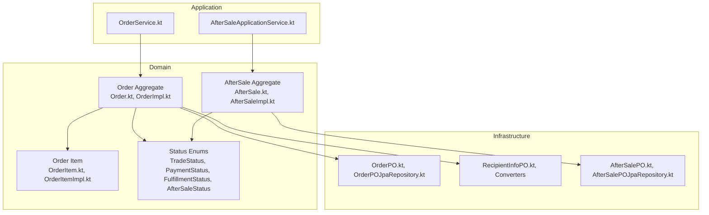
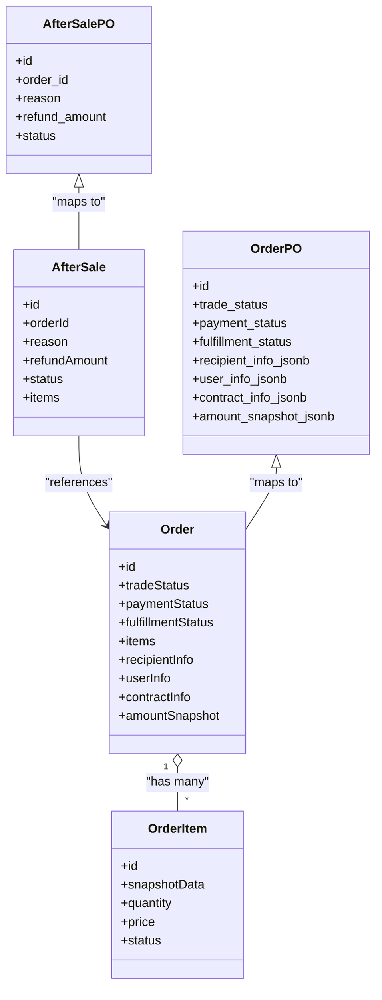
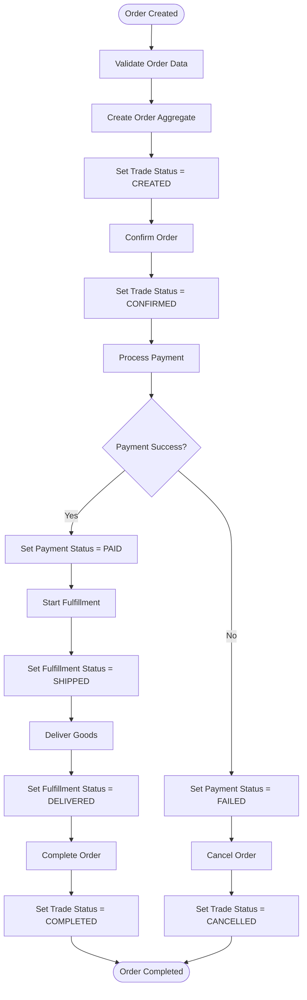
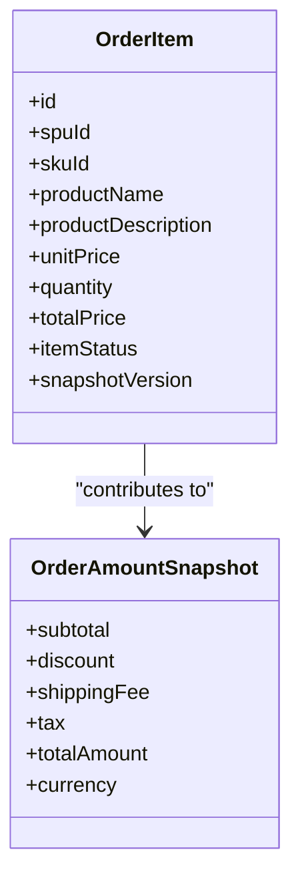
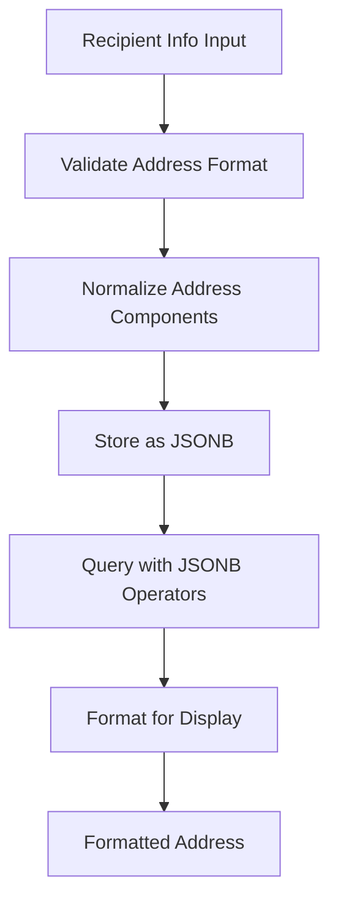
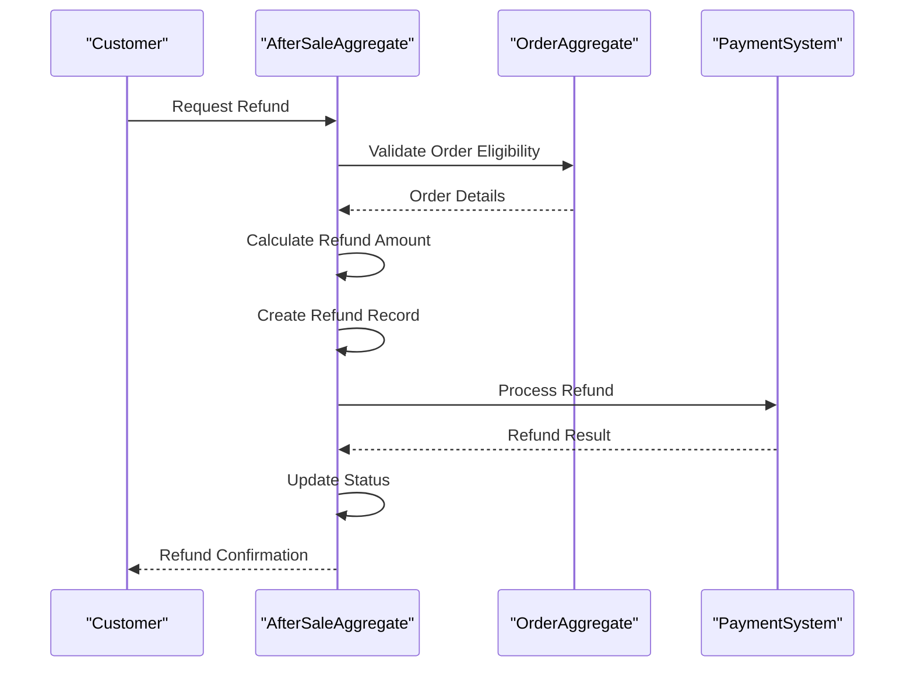
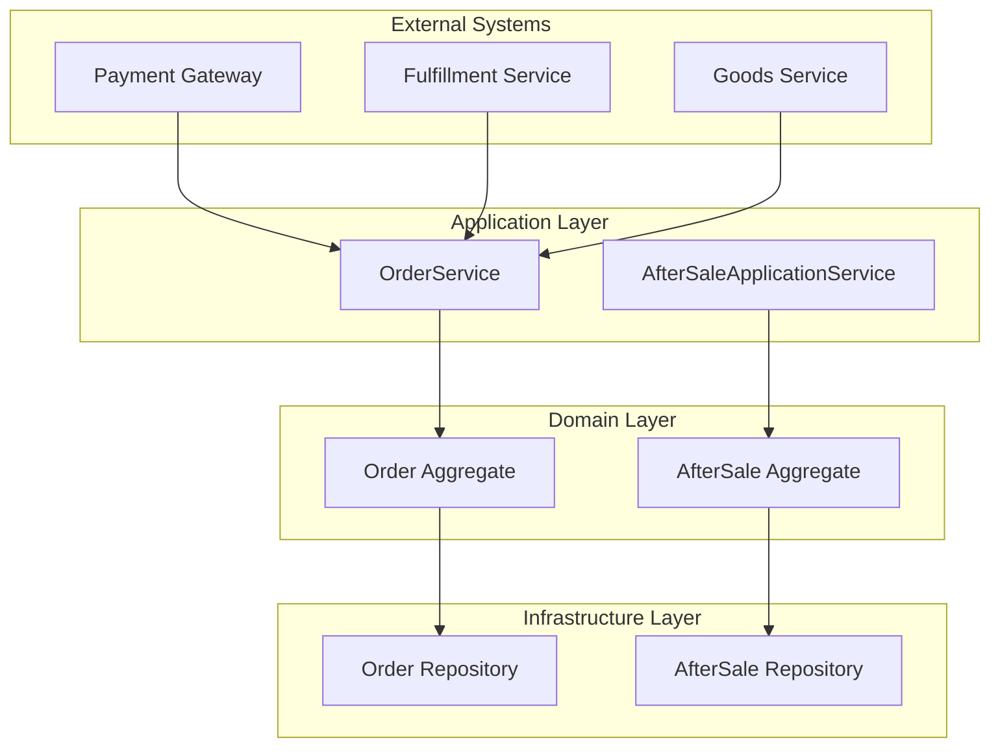

# Order Management Schema

<cite>
**Referenced Files in This Document**
- [Order.kt](file://j-store-order-domain/src/main/kotlin/com/jstore/order/domain/order/Order.kt)
- [OrderImpl.kt](file://j-store-order-domain/src/main/kotlin/com/jstore/order/domain/order/OrderImpl.kt)
- [OrderItem.kt](file://j-store-order-domain/src/main/kotlin/com/jstore/order/domain/order/OrderItem.kt)
- [OrderItemImpl.kt](file://j-store-order-domain/src/main/kotlin/com/jstore/order/domain/order/OrderItemImpl.kt)
- [TradeStatus.kt](file://j-store-order-domain/src/main/kotlin/com/jstore/order/domain/order/TradeStatus.kt)
- [PaymentStatus.kt](file://j-store-order-domain/src/main/kotlin/com/jstore/order/domain/order/PaymentStatus.kt)
- [FulfillmentStatus.kt](file://j-store-order-domain/src/main/kotlin/com/jstore/order/domain/order/FulfillmentStatus.kt)
- [RecipientInfo.kt](file://j-store-order-domain/src/main/kotlin/com/jstore/order/domain/order/RecipientInfo.kt)
- [UserInfo.kt](file://j-store-order-domain/src/main/kotlin/com/jstore/order/domain/order/UserInfo.kt)
- [ContractInfo.kt](file://j-store-order-domain/src/main/kotlin/com/jstore/order/domain/order/ContractInfo.kt)
- [OrderAmountSnapshot.kt](file://j-store-order-domain/src/main/kotlin/com/jstore/order/domain/order/OrderAmountSnapshot.kt)
- [AfterSale.kt](file://j-store-order-domain/src/main/kotlin/com/jstore/order/domain/aftersale/AfterSale.kt)
- [AfterSaleImpl.kt](file://j-store-order-domain/src/main/kotlin/com/jstore/order/domain/aftersale/AfterSaleImpl.kt)
- [AfterSaleItem.kt](file://j-store-order-domain/src/main/kotlin/com/jstore/order/domain/aftersale/AfterSaleItem.kt)
- [AfterSaleStatus.kt](file://j-store-order-domain/src/main/kotlin/com/jstore/order/domain/aftersale/AfterSaleStatus.kt)
- [AfterSaleFactory.kt](file://j-store-order-domain/src/main/kotlin/com/jstore/order/domain/aftersale/AfterSaleFactory.kt)
- [OrderPO.kt](file://j-store-order-infrastructure/src/main/kotlin/com/jstore/order/domain/order/persistence/OrderPO.kt)
- [OrderPOJpaRepository.kt](file://j-store-order-infrastructure/src/main/kotlin/com/jstore/order/domain/order/persistence/OrderPOJpaRepository.kt)
- [RecipientInfoPO.kt](file://j-store-order-infrastructure/src/main/kotlin/com/jstore/order/domain/order/persistence/RecipientInfoPO.kt)
- [RecipientInfoPOConverter.kt](file://j-store-order-infrastructure/src/main/kotlin/com/jstore/order/domain/order/persistence/RecipientInfoPOConverter.kt)
- [I18nGeoAddressConverter.kt](file://j-store-order-infrastructure/src/main/kotlin/com/jstore/order/domain/order/persistence/I18nGeoAddressConverter.kt)
- [AfterSalePO.kt](file://j-store-order-infrastructure/src/main/kotlin/com/jstore/order/domain/aftersale/persistence/AfterSalePO.kt)
- [AfterSalePOJpaRepository.kt](file://j-store-order-infrastructure/src/main/kotlin/com/jstore/order/domain/aftersale/persistence/AfterSalePOJpaRepository.kt)
- [03-order-address-jsonb.sql](file://docker/postgres/init/03-order-address-jsonb.sql)
- [05-order-consignee-info.sql](file://docker/postgres/init/05-order-consignee-info.sql)
- [08-order-item-snapshot-version.sql](file://docker/postgres/init/08-order-item-snapshot-version.sql)
- [TransactionalOrderUseCases.kt](file://j-store-order-boot/src/main/kotlin/com/jstore/order/config/TransactionalOrderUseCases.kt)
- [OrderService.kt](file://j-store-order-application/src/main/kotlin/com/jstore/order/service/OrderService.kt)
- [AfterSaleApplicationService.kt](file://j-store-order-application/src/main/kotlin/com/jstore/order/service/AfterSaleApplicationService.kt)
</cite>

## Table of Contents
1. [Introduction](#introduction)
2. [Project Structure](#project-structure)
3. [Core Components](#core-components)
4. [Architecture Overview](#architecture-overview)
5. [Detailed Component Analysis](#detailed-component-analysis)
6. [Dependency Analysis](#dependency-analysis)
7. [Performance Considerations](#performance-considerations)
8. [Troubleshooting Guide](#troubleshooting-guide)
9. [Conclusion](#conclusion)

## Introduction
This document describes the order management data model with a focus on:
- Multi-dimensional status tracking across trade, payment, fulfillment, and after-sale dimensions
- The order aggregate structure including items, recipient information, and address handling via JSONB fields
- The after-sale aggregate design for refund processing and return workflows
- Index strategies to support order queries and status filtering
- Relationship mappings between orders, items, and related entities
- Data consistency requirements and transaction boundaries for order operations

## Project Structure
The order domain is implemented as a DDD aggregate with clear separation between domain, application, and infrastructure layers. Key files include:
- Domain models for Order and AfterSale aggregates
- Persistence objects (POs) and converters for JSONB fields
- Application services orchestrating use cases
- Database initialization scripts defining schema and indexes

**Diagram sources**
- [Order.kt](file://j-store-order-domain/src/main/kotlin/com/jstore/order/domain/order/Order.kt)
- [OrderImpl.kt](file://j-store-order-domain/src/main/kotlin/com/jstore/order/domain/order/OrderImpl.kt)
- [OrderItem.kt](file://j-store-order-domain/src/main/kotlin/com/jstore/order/domain/order/OrderItem.kt)
- [OrderItemImpl.kt](file://j-store-order-domain/src/main/kotlin/com/jstore/order/domain/order/OrderItemImpl.kt)
- [TradeStatus.kt](file://j-store-order-domain/src/main/kotlin/com/jstore/order/domain/order/TradeStatus.kt)
- [PaymentStatus.kt](file://j-store-order-domain/src/main/kotlin/com/jstore/order/domain/order/PaymentStatus.kt)
- [FulfillmentStatus.kt](file://j-store-order-domain/src/main/kotlin/com/jstore/order/domain/order/FulfillmentStatus.kt)
- [AfterSale.kt](file://j-store-order-domain/src/main/kotlin/com/jstore/order/domain/aftersale/AfterSale.kt)
- [AfterSaleImpl.kt](file://j-store-order-domain/src/main/kotlin/com/jstore/order/domain/aftersale/AfterSaleImpl.kt)
- [OrderPO.kt](file://j-store-order-infrastructure/src/main/kotlin/com/jstore/order/domain/order/persistence/OrderPO.kt)
- [OrderPOJpaRepository.kt](file://j-store-order-infrastructure/src/main/kotlin/com/jstore/order/domain/order/persistence/OrderPOJpaRepository.kt)
- [RecipientInfoPO.kt](file://j-store-order-infrastructure/src/main/kotlin/com/jstore/order/domain/order/persistence/RecipientInfoPO.kt)
- [AfterSalePO.kt](file://j-store-order-infrastructure/src/main/kotlin/com/jstore/order/domain/aftersale/persistence/AfterSalePO.kt)
- [AfterSalePOJpaRepository.kt](file://j-store-order-infrastructure/src/main/kotlin/com/jstore/order/domain/aftersale/persistence/AfterSalePOJpaRepository.kt)

**Section sources**
- [Order.kt](file://j-store-order-domain/src/main/kotlin/com/jstore/order/domain/order/Order.kt)
- [OrderImpl.kt](file://j-store-order-domain/src/main/kotlin/com/jstore/order/domain/order/OrderImpl.kt)
- [OrderItem.kt](file://j-store-order-domain/src/main/kotlin/com/jstore/order/domain/order/OrderItem.kt)
- [OrderItemImpl.kt](file://j-store-order-domain/src/main/kotlin/com/jstore/order/domain/order/OrderItemImpl.kt)
- [TradeStatus.kt](file://j-store-order-domain/src/main/kotlin/com/jstore/order/domain/order/TradeStatus.kt)
- [PaymentStatus.kt](file://j-store-order-domain/src/main/kotlin/com/jstore/order/domain/order/PaymentStatus.kt)
- [FulfillmentStatus.kt](file://j-store-order-domain/src/main/kotlin/com/jstore/order/domain/order/FulfillmentStatus.kt)
- [AfterSale.kt](file://j-store-order-domain/src/main/kotlin/com/jstore/order/domain/aftersale/AfterSale.kt)
- [AfterSaleImpl.kt](file://j-store-order-domain/src/main/kotlin/com/jstore/order/domain/aftersale/AfterSaleImpl.kt)
- [OrderPO.kt](file://j-store-order-infrastructure/src/main/kotlin/com/jstore/order/domain/order/persistence/OrderPO.kt)
- [OrderPOJpaRepository.kt](file://j-store-order-infrastructure/src/main/kotlin/com/jstore/order/domain/order/persistence/OrderPOJpaRepository.kt)
- [RecipientInfoPO.kt](file://j-store-order-infrastructure/src/main/kotlin/com/jstore/order/domain/order/persistence/RecipientInfoPO.kt)
- [AfterSalePO.kt](file://j-store-order-infrastructure/src/main/kotlin/com/jstore/order/domain/aftersale/persistence/AfterSalePO.kt)
- [AfterSalePOJpaRepository.kt](file://j-store-order-infrastructure/src/main/kotlin/com/jstore/order/domain/aftersale/persistence/AfterSalePOJpaRepository.kt)

## Core Components
- Order aggregate encapsulates the full lifecycle state through multiple status dimensions:
  - Trade status tracks order creation, confirmation, and completion
  - Payment status reflects payment initiation, success, failure, and refunds
  - Fulfillment status covers shipping, delivery, and receipt
  - After-sale status manages returns and refunds
- Order items capture product snapshots at purchase time, including price and quantity
- Recipient and user information are persisted using JSONB fields for flexible address structures
- After-sale aggregate manages refund requests, approvals, and completions linked to orders

Key responsibilities:
- Enforce consistent state transitions across dimensions
- Maintain immutable snapshots for auditability
- Provide query-friendly projections while preserving rich domain semantics

**Section sources**
- [Order.kt](file://j-store-order-domain/src/main/kotlin/com/jstore/order/domain/order/Order.kt)
- [OrderImpl.kt](file://j-store-order-domain/src/main/kotlin/com/jstore/order/domain/order/OrderImpl.kt)
- [OrderItem.kt](file://j-store-order-domain/src/main/kotlin/com/jstore/order/domain/order/OrderItem.kt)
- [OrderItemImpl.kt](file://j-store-order-domain/src/main/kotlin/com/jstore/order/domain/order/OrderItemImpl.kt)
- [TradeStatus.kt](file://j-store-order-domain/src/main/kotlin/com/jstore/order/domain/order/TradeStatus.kt)
- [PaymentStatus.kt](file://j-store-order-domain/src/main/kotlin/com/jstore/order/domain/order/PaymentStatus.kt)
- [FulfillmentStatus.kt](file://j-store-order-domain/src/main/kotlin/com/jstore/order/domain/order/FulfillmentStatus.kt)
- [AfterSale.kt](file://j-store-order-domain/src/main/kotlin/com/jstore/order/domain/aftersale/AfterSale.kt)
- [AfterSaleImpl.kt](file://j-store-order-domain/src/main/kotlin/com/jstore/order/domain/aftersale/AfterSaleImpl.kt)

## Architecture Overview
The order system follows a layered architecture with clear boundaries:
- Domain layer defines aggregates, value objects, and repositories
- Application layer coordinates use cases and events
- Infrastructure layer persists data and handles external integrations

**Diagram sources**
- [Order.kt](file://j-store-order-domain/src/main/kotlin/com/jstore/order/domain/order/Order.kt)
- [OrderItem.kt](file://j-store-order-domain/src/main/kotlin/com/jstore/order/domain/order/OrderItem.kt)
- [AfterSale.kt](file://j-store-order-domain/src/main/kotlin/com/jstore/order/domain/aftersale/AfterSale.kt)
- [OrderPO.kt](file://j-store-order-infrastructure/src/main/kotlin/com/jstore/order/domain/order/persistence/OrderPO.kt)
- [AfterSalePO.kt](file://j-store-order-infrastructure/src/main/kotlin/com/jstore/order/domain/aftersale/persistence/AfterSalePO.kt)

## Detailed Component Analysis

### Order Aggregate Design
The Order aggregate maintains multi-dimensional status tracking:
- Trade status progresses from created to confirmed and completed
- Payment status tracks payment lifecycle including refunds
- Fulfillment status manages shipping and delivery workflow
- Items contain snapshots of product data at purchase time
- Recipient and user information stored as JSONB for flexibility
- Contract and amount snapshots ensure auditability

**Diagram sources**
- [OrderImpl.kt](file://j-store-order-domain/src/main/kotlin/com/jstore/order/domain/order/OrderImpl.kt)
- [TradeStatus.kt](file://j-store-order-domain/src/main/kotlin/com/jstore/order/domain/order/TradeStatus.kt)
- [PaymentStatus.kt](file://j-store-order-domain/src/main/kotlin/com/jstore/order/domain/order/PaymentStatus.kt)
- [FulfillmentStatus.kt](file://j-store-order-domain/src/main/kotlin/com/jstore/order/domain/order/FulfillmentStatus.kt)

**Section sources**
- [OrderImpl.kt](file://j-store-order-domain/src/main/kotlin/com/jstore/order/domain/order/OrderImpl.kt)
- [TradeStatus.kt](file://j-store-order-domain/src/main/kotlin/com/jstore/order/domain/order/TradeStatus.kt)
- [PaymentStatus.kt](file://j-store-order-domain/src/main/kotlin/com/jstore/order/domain/order/PaymentStatus.kt)
- [FulfillmentStatus.kt](file://j-store-order-domain/src/main/kotlin/com/jstore/order/domain/order/FulfillmentStatus.kt)

### Order Items and Snapshots
Order items capture product information at purchase time:
- Product snapshots include SPU/SKU details, pricing, and descriptions
- Quantity and unit price are preserved for accurate billing
- Item status tracks individual item lifecycle within order
- Versioning ensures consistency when products change over time

**Diagram sources**
- [OrderItem.kt](file://j-store-order-domain/src/main/kotlin/com/jstore/order/domain/order/OrderItem.kt)
- [OrderItemImpl.kt](file://j-store-order-domain/src/main/kotlin/com/jstore/order/domain/order/OrderItemImpl.kt)
- [OrderAmountSnapshot.kt](file://j-store-order-domain/src/main/kotlin/com/jstore/order/domain/order/OrderAmountSnapshot.kt)

**Section sources**
- [OrderItem.kt](file://j-store-order-domain/src/main/kotlin/com/jstore/order/domain/order/OrderItem.kt)
- [OrderItemImpl.kt](file://j-store-order-domain/src/main/kotlin/com/jstore/order/domain/order/OrderItemImpl.kt)
- [OrderAmountSnapshot.kt](file://j-store-order-domain/src/main/kotlin/com/jstore/order/domain/order/OrderAmountSnapshot.kt)

### Recipient Information and Address Handling
Recipient information uses JSONB fields for flexible address structures:
- Supports international addresses with country codes and regional divisions
- Maintains backward compatibility with legacy address formats
- Provides validation and formatting utilities for different locales
- Stores contact information and delivery preferences

**Diagram sources**
- [RecipientInfo.kt](file://j-store-order-domain/src/main/kotlin/com/jstore/order/domain/order/RecipientInfo.kt)
- [RecipientInfoPO.kt](file://j-store-order-infrastructure/src/main/kotlin/com/jstore/order/domain/order/persistence/RecipientInfoPO.kt)
- [RecipientInfoPOConverter.kt](file://j-store-order-infrastructure/src/main/kotlin/com/jstore/order/domain/order/persistence/RecipientInfoPOConverter.kt)
- [I18nGeoAddressConverter.kt](file://j-store-order-infrastructure/src/main/kotlin/com/jstore/order/domain/order/persistence/I18nGeoAddressConverter.kt)
- [03-order-address-jsonb.sql](file://docker/postgres/init/03-order-address-jsonb.sql)
- [05-order-consignee-info.sql](file://docker/postgres/init/05-order-consignee-info.sql)

**Section sources**
- [RecipientInfo.kt](file://j-store-order-domain/src/main/kotlin/com/jstore/order/domain/order/RecipientInfo.kt)
- [RecipientInfoPO.kt](file://j-store-order-infrastructure/src/main/kotlin/com/jstore/order/domain/order/persistence/RecipientInfoPO.kt)
- [RecipientInfoPOConverter.kt](file://j-store-order-infrastructure/src/main/kotlin/com/jstore/order/domain/order/persistence/RecipientInfoPOConverter.kt)
- [I18nGeoAddressConverter.kt](file://j-store-order-infrastructure/src/main/kotlin/com/jstore/order/domain/order/persistence/I18nGeoAddressConverter.kt)
- [03-order-address-jsonb.sql](file://docker/postgres/init/03-order-address-jsonb.sql)
- [05-order-consignee-info.sql](file://docker/postgres/init/05-order-consignee-info.sql)

### After-Sale Aggregate Design
The after-sale aggregate manages refund and return workflows:
- Links to original order for context and validation
- Tracks refund amounts and reasons for compliance
- Manages approval workflows and status transitions
- Handles partial and full refunds with item-level granularity

**Diagram sources**
- [AfterSale.kt](file://j-store-order-domain/src/main/kotlin/com/jstore/order/domain/aftersale/AfterSale.kt)
- [AfterSaleImpl.kt](file://j-store-order-domain/src/main/kotlin/com/jstore/order/domain/aftersale/AfterSaleImpl.kt)
- [AfterSaleItem.kt](file://j-store-order-domain/src/main/kotlin/com/jstore/order/domain/aftersale/AfterSaleItem.kt)
- [AfterSaleStatus.kt](file://j-store-order-domain/src/main/kotlin/com/jstore/order/domain/aftersale/AfterSaleStatus.kt)

**Section sources**
- [AfterSale.kt](file://j-store-order-domain/src/main/kotlin/com/jstore/order/domain/aftersale/AfterSale.kt)
- [AfterSaleImpl.kt](file://j-store-order-domain/src/main/kotlin/com/jstore/order/domain/aftersale/AfterSaleImpl.kt)
- [AfterSaleItem.kt](file://j-store-order-domain/src/main/kotlin/com/jstore/order/domain/aftersale/AfterSaleItem.kt)
- [AfterSaleStatus.kt](file://j-store-order-domain/src/main/kotlin/com/jstore/order/domain/aftersale/AfterSaleStatus.kt)

## Dependency Analysis
The order system has clear dependency relationships:
- Domain layer depends only on core abstractions
- Application layer coordinates domain services and external systems
- Infrastructure layer implements persistence and external integrations
- Cross-cutting concerns like transactions and events are handled consistently

**Diagram sources**
- [OrderService.kt](file://j-store-order-application/src/main/kotlin/com/jstore/order/service/OrderService.kt)
- [AfterSaleApplicationService.kt](file://j-store-order-application/src/main/kotlin/com/jstore/order/service/AfterSaleApplicationService.kt)
- [OrderRepository.kt](file://j-store-order-domain/src/main/kotlin/com/jstore/order/domain/order/OrderRepository.kt)
- [AfterSaleRepository.kt](file://j-store-order-domain/src/main/kotlin/com/jstore/order/domain/aftersale/AfterSaleRepository.kt)

**Section sources**
- [OrderService.kt](file://j-store-order-application/src/main/kotlin/com/jstore/order/service/OrderService.kt)
- [AfterSaleApplicationService.kt](file://j-store-order-application/src/main/kotlin/com/jstore/order/service/AfterSaleApplicationService.kt)

## Performance Considerations
Index strategies for optimal query performance:
- Composite indexes on frequently queried status combinations
- Partial indexes for active orders to reduce index size
- JSONB indexes for address and recipient information queries
- Partitioning by date ranges for large order volumes
- Materialized views for complex reporting queries

Data consistency requirements:
- Transactional boundaries ensure atomicity of order operations
- Eventual consistency for cross-service communication
- Optimistic locking for concurrent updates
- Audit trails for all state changes

**Section sources**
- [OrderPOJpaRepository.kt](file://j-store-order-infrastructure/src/main/kotlin/com/jstore/order/domain/order/persistence/OrderPOJpaRepository.kt)
- [AfterSalePOJpaRepository.kt](file://j-store-order-infrastructure/src/main/kotlin/com/jstore/order/domain/aftersale/persistence/AfterSalePOJpaRepository.kt)
- [TransactionalOrderUseCases.kt](file://j-store-order-boot/src/main/kotlin/com/jstore/order/config/TransactionalOrderUseCases.kt)

## Troubleshooting Guide
Common issues and solutions:
- Status transition violations indicate business rule breaches
- JSONB serialization errors suggest format mismatches
- Concurrency conflicts require retry logic or optimistic locking
- Performance degradation indicates missing indexes or inefficient queries

Debugging approaches:
- Enable detailed logging for state transitions
- Use database query analysis tools for slow queries
- Implement health checks for external service dependencies
- Monitor error rates and latency metrics

**Section sources**
- [OrderErrors.kt](file://j-store-order-domain/src/main/kotlin/com/jstore/order/domain/order/OrderErrors.kt)
- [AfterSaleErrors.kt](file://j-store-order-domain/src/main/kotlin/com/jstore/order/domain/aftersale/AfterSaleErrors.kt)

## Conclusion
The order management schema provides a robust foundation for e-commerce operations with:
- Comprehensive multi-dimensional status tracking
- Flexible JSONB-based address handling
- Clear separation of concerns across architectural layers
- Strong data consistency guarantees
- Scalable query performance through strategic indexing

The design supports complex business workflows while maintaining simplicity and maintainability for future enhancements.