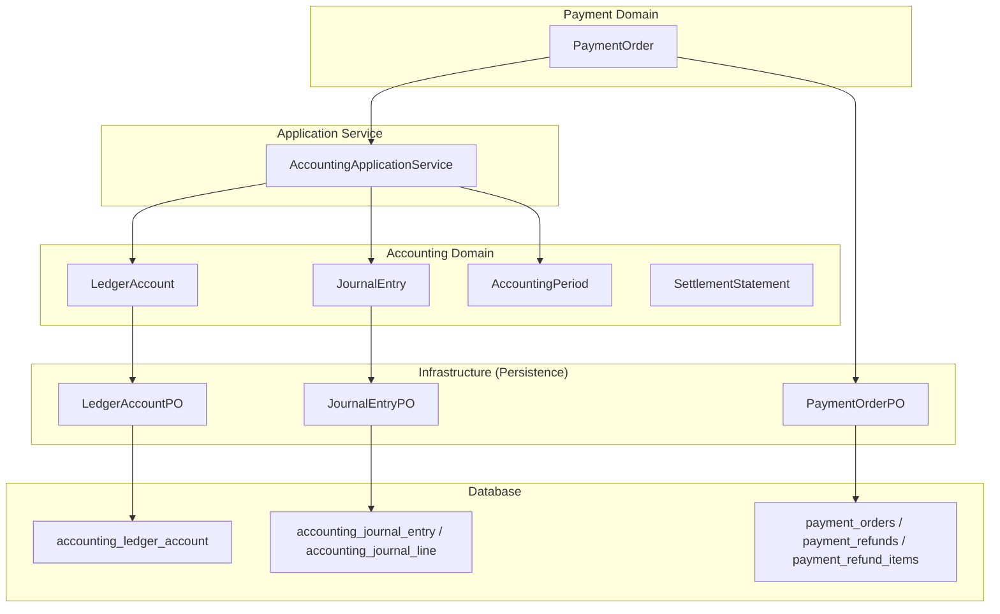
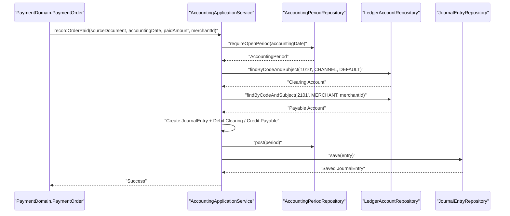
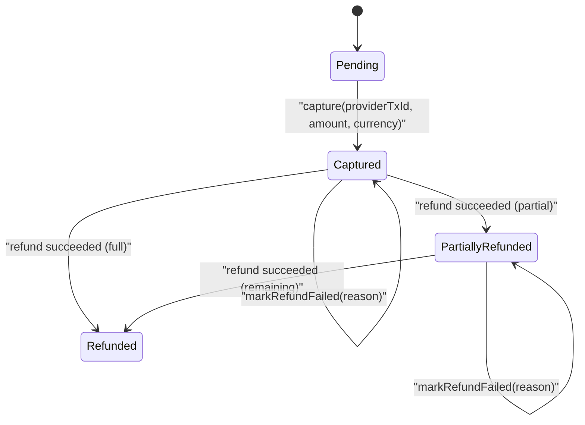
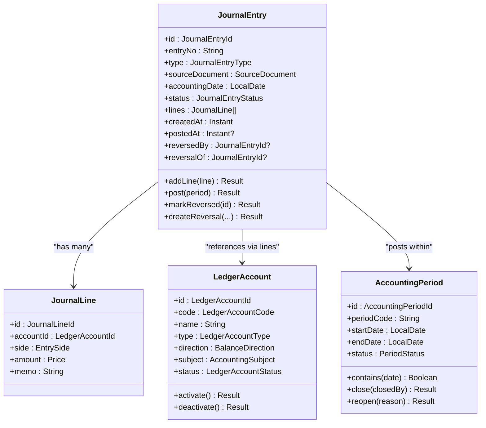
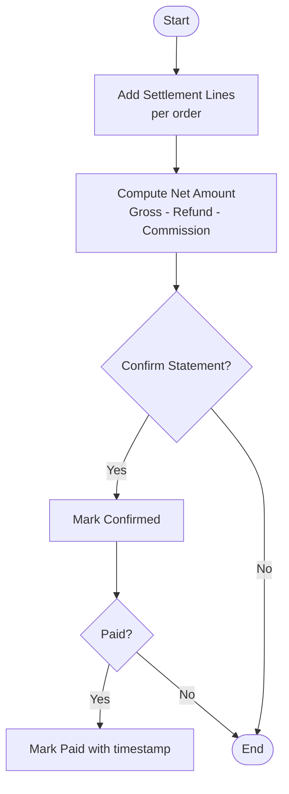
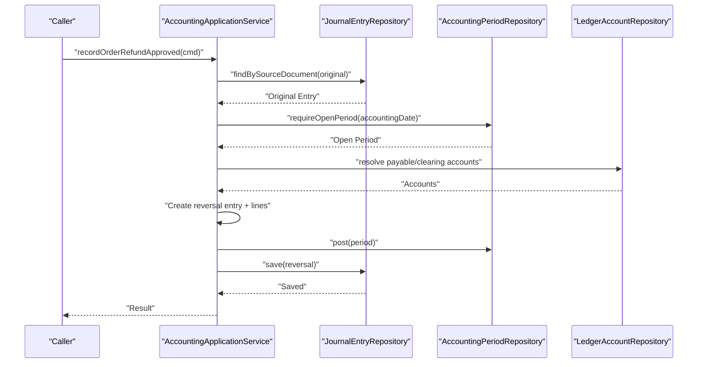
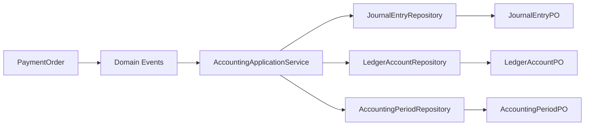
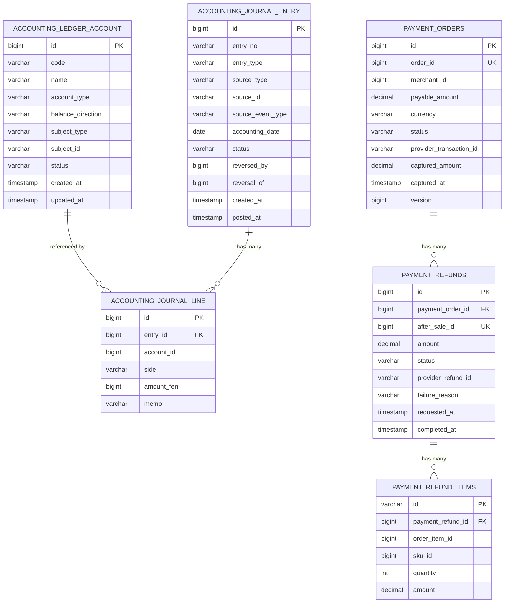

# Payment & Accounting Schema

<cite>
**Referenced Files in This Document**
- [LedgerAccount.kt](file://j-store-accounting-domain/src/main/kotlin/com/jstore/accounting/domain/account/LedgerAccount.kt)
- [JournalEntry.kt](file://j-store-accounting-domain/src/main/kotlin/com/jstore/accounting/domain/journal/JournalEntry.kt)
- [AccountingPeriod.kt](file://j-store-accounting-domain/src/main/kotlin/com/jstore/accounting/domain/journal/AccountingPeriod.kt)
- [SettlementStatement.kt](file://j-store-accounting-domain/src/main/kotlin/com/jstore/accounting/domain/settlement/SettlementStatement.kt)
- [PaymentOrder.kt](file://j-store-payment-domain/src/main/kotlin/com/jstore/payment/domain/payment/PaymentOrder.kt)
- [PaymentOrderImpl.kt](file://j-store-payment-domain/src/main/kotlin/com/jstore/payment/domain/payment/PaymentOrderImpl.kt)
- [AccountingApplicationService.kt](file://j-store-accounting-application/src/main/kotlin/com/jstore/accounting/service/AccountingApplicationService.kt)
- [LedgerAccountPO.kt](file://j-store-accounting-infrastructure/src/main/kotlin/com/jstore/accounting/domain/account/persistence/LedgerAccountPO.kt)
- [JournalEntryPO.kt](file://j-store-accounting-infrastructure/src/main/kotlin/com/jstore/accounting/domain/journal/persistence/JournalEntryPO.kt)
- [PaymentOrderPO.kt](file://j-store-payment-infrastructure/src/main/kotlin/com/jstore/payment/domain/payment/persistence/PaymentOrderPO.kt)
- [V20260731__order_status_dimensions.sql](file://j-store-boot/src/main/resources/db/migration/V20260731__order_status_dimensions.sql)
- [V20260803__order_after_sale_aggregate.sql](file://j-store-boot/src/main/resources/db/migration/V20260803__order_after_sale_aggregate.sql)
</cite>

## Table of Contents
1. Introduction
2. Project Structure
3. Core Components
4. Architecture Overview
5. Detailed Component Analysis
6. Dependency Analysis
7. Performance Considerations
8. Troubleshooting Guide
9. Conclusion
10. Appendices

## Introduction
This document provides a comprehensive data model and process documentation for payment processing and accounting within the system. It covers:
- Payment order lifecycle including capture, refund, and reversal operations
- Double-entry bookkeeping with journal entries, ledger accounts, and settlement statements
- Merchant membership and account structures for unified account management
- Financial transaction auditing and reconciliation mechanisms
- Currency handling, exchange rate storage, and multi-currency support
- Compliance requirements for financial data retention and audit trails

The content is derived from domain models, application services, infrastructure persistence entities, and database migrations present in the repository.

## Project Structure
The relevant code spans three primary modules:
- Accounting Domain: defines ledger accounts, journal entries, accounting periods, and settlement statements
- Payment Domain: defines payment orders, captures, refunds, and their state transitions
- Application Layer: orchestrates accounting events into double-entry journal entries
- Infrastructure: JPA entities mapping to persistent tables for accounting and payments
- Database Migrations: define schema for orders, after-sales, and related projections

**Diagram sources**
- [LedgerAccount.kt:1-64](file://j-store-accounting-domain/src/main/kotlin/com/jstore/accounting/domain/account/LedgerAccount.kt#L1-L64)
- [JournalEntry.kt:1-93](file://j-store-accounting-domain/src/main/kotlin/com/jstore/accounting/domain/journal/JournalEntry.kt#L1-L93)
- [AccountingPeriod.kt:1-33](file://j-store-accounting-domain/src/main/kotlin/com/jstore/accounting/domain/journal/AccountingPeriod.kt#L1-L33)
- [SettlementStatement.kt:1-62](file://j-store-accounting-domain/src/main/kotlin/com/jstore/accounting/domain/settlement/SettlementStatement.kt#L1-L62)
- [PaymentOrder.kt:1-94](file://j-store-payment-domain/src/main/kotlin/com/jstore/payment/domain/payment/PaymentOrder.kt#L1-L94)
- [AccountingApplicationService.kt:1-337](file://j-store-accounting-application/src/main/kotlin/com/jstore/accounting/service/AccountingApplicationService.kt#L1-L337)
- [LedgerAccountPO.kt:1-47](file://j-store-accounting-infrastructure/src/main/kotlin/com/jstore/accounting/domain/account/persistence/LedgerAccountPO.kt#L1-L47)
- [JournalEntryPO.kt:1-69](file://j-store-accounting-infrastructure/src/main/kotlin/com/jstore/accounting/domain/journal/persistence/JournalEntryPO.kt#L1-L69)
- [PaymentOrderPO.kt:1-73](file://j-store-payment-infrastructure/src/main/kotlin/com/jstore/payment/domain/payment/persistence/PaymentOrderPO.kt#L1-L73)

**Section sources**
- [LedgerAccount.kt:1-64](file://j-store-accounting-domain/src/main/kotlin/com/jstore/accounting/domain/account/LedgerAccount.kt#L1-L64)
- [JournalEntry.kt:1-93](file://j-store-accounting-domain/src/main/kotlin/com/jstore/accounting/domain/journal/JournalEntry.kt#L1-L93)
- [AccountingPeriod.kt:1-33](file://j-store-accounting-domain/src/main/kotlin/com/jstore/accounting/domain/journal/AccountingPeriod.kt#L1-L33)
- [SettlementStatement.kt:1-62](file://j-store-accounting-domain/src/main/kotlin/com/jstore/accounting/domain/settlement/SettlementStatement.kt#L1-L62)
- [PaymentOrder.kt:1-94](file://j-store-payment-domain/src/main/kotlin/com/jstore/payment/domain/payment/PaymentOrder.kt#L1-L94)
- [AccountingApplicationService.kt:1-337](file://j-store-accounting-application/src/main/kotlin/com/jstore/accounting/service/AccountingApplicationService.kt#L1-L337)
- [LedgerAccountPO.kt:1-47](file://j-store-accounting-infrastructure/src/main/kotlin/com/jstore/accounting/domain/account/persistence/LedgerAccountPO.kt#L1-L47)
- [JournalEntryPO.kt:1-69](file://j-store-accounting-infrastructure/src/main/kotlin/com/jstore/accounting/domain/journal/persistence/JournalEntryPO.kt#L1-L69)
- [PaymentOrderPO.kt:1-73](file://j-store-payment-infrastructure/src/main/kotlin/com/jstore/payment/domain/payment/persistence/PaymentOrderPO.kt#L1-L73)

## Core Components
- Ledger Account: Represents an accounting subject (platform, merchant, user, channel) with type (asset, liability, equity, revenue, expense), balance direction (debit/credit), and status (active/inactive). Supports activation/deactivation.
- Journal Entry: Double-entry record with lines (debit/credit per account), source document linkage, accounting date, status (draft/posted/reversed), and reversal relationships.
- Accounting Period: Time window for posting entries; supports open/close/reopen controls and containment checks.
- Settlement Statement: Aggregates per-order gross/refund/commission/net amounts over a period; supports confirm and mark paid states.
- Payment Order: Tracks payable amount, currency, capture details, and multiple refunds with statuses; enforces business rules on capture and refund flows.

Key behaviors:
- Capture transitions payment order to captured and records provider transaction details.
- Refund requests are validated against remaining payable; success marks refund succeeded or failed; order status updates accordingly.
- Accounting service translates business events into journal entries ensuring balanced debits and credits, period validation, and idempotency via source documents.

**Section sources**
- [LedgerAccount.kt:1-64](file://j-store-accounting-domain/src/main/kotlin/com/jstore/accounting/domain/account/LedgerAccount.kt#L1-L64)
- [JournalEntry.kt:1-93](file://j-store-accounting-domain/src/main/kotlin/com/jstore/accounting/domain/journal/JournalEntry.kt#L1-L93)
- [AccountingPeriod.kt:1-33](file://j-store-accounting-domain/src/main/kotlin/com/jstore/accounting/domain/journal/AccountingPeriod.kt#L1-L33)
- [SettlementStatement.kt:1-62](file://j-store-accounting-domain/src/main/kotlin/com/jstore/accounting/domain/settlement/SettlementStatement.kt#L1-L62)
- [PaymentOrder.kt:1-94](file://j-store-payment-domain/src/main/kotlin/com/jstore/payment/domain/payment/PaymentOrder.kt#L1-L94)
- [PaymentOrderImpl.kt:1-192](file://j-store-payment-domain/src/main/kotlin/com/jstore/payment/domain/payment/PaymentOrderImpl.kt#L1-L192)
- [AccountingApplicationService.kt:1-337](file://j-store-accounting-application/src/main/kotlin/com/jstore/accounting/service/AccountingApplicationService.kt#L1-L337)

## Architecture Overview
The architecture follows a clear separation between domain, application, and infrastructure layers. Business events from payment operations drive accounting journal creation through the application service, which validates periods, resolves ledger accounts by code and subject, and persists double-entry records. Settlement statements summarize merchant payables and track confirmation and payment.

**Diagram sources**
- [AccountingApplicationService.kt:33-96](file://j-store-accounting-application/src/main/kotlin/com/jstore/accounting/service/AccountingApplicationService.kt#L33-L96)
- [JournalEntry.kt:54-79](file://j-store-accounting-domain/src/main/kotlin/com/jstore/accounting/domain/journal/JournalEntry.kt#L54-L79)
- [AccountingPeriod.kt:18-32](file://j-store-accounting-domain/src/main/kotlin/com/jstore/accounting/domain/journal/AccountingPeriod.kt#L18-L32)
- [LedgerAccount.kt:51-63](file://j-store-accounting-domain/src/main/kotlin/com/jstore/accounting/domain/account/LedgerAccount.kt#L51-L63)

**Section sources**
- [AccountingApplicationService.kt:1-337](file://j-store-accounting-application/src/main/kotlin/com/jstore/accounting/service/AccountingApplicationService.kt#L1-L337)
- [JournalEntry.kt:1-93](file://j-store-accounting-domain/src/main/kotlin/com/jstore/accounting/domain/journal/JournalEntry.kt#L1-L93)
- [AccountingPeriod.kt:1-33](file://j-store-accounting-domain/src/main/kotlin/com/jstore/accounting/domain/journal/AccountingPeriod.kt#L1-L33)
- [LedgerAccount.kt:1-64](file://j-store-accounting-domain/src/main/kotlin/com/jstore/accounting/domain/account/LedgerAccount.kt#L1-L64)

## Detailed Component Analysis

### Payment Order Lifecycle
The payment order aggregate manages capture and refund operations with strict state transitions and validations:
- Capture: Validates pending state, provider transaction ID, currency, and amount; records capture details and emits a captured event.
- Refund Request: Ensures order is captured or partially refunded; validates total requested refund does not exceed payable; publishes refund requested event.
- Refund Retry: Allows retry when previous attempt failed; resets failure metadata and re-publishes request.
- Refund Success/Failure: Updates refund status, provider reference, timestamps; adjusts overall order status to partially refunded or fully refunded; emits appropriate events.

**Diagram sources**
- [PaymentOrder.kt:15-26](file://j-store-payment-domain/src/main/kotlin/com/jstore/payment/domain/payment/PaymentOrder.kt#L15-L26)
- [PaymentOrderImpl.kt:39-176](file://j-store-payment-domain/src/main/kotlin/com/jstore/payment/domain/payment/PaymentOrderImpl.kt#L39-L176)

**Section sources**
- [PaymentOrder.kt:1-94](file://j-store-payment-domain/src/main/kotlin/com/jstore/payment/domain/payment/PaymentOrder.kt#L1-L94)
- [PaymentOrderImpl.kt:1-192](file://j-store-payment-domain/src/main/kotlin/com/jstore/payment/domain/payment/PaymentOrderImpl.kt#L1-L192)

### Double-Entry Bookkeeping: Journal Entries and Ledger Accounts
Journal entries represent balanced debit/credit transactions linked to source documents (orders, refunds, settlements, adjustments). Each line references a ledger account and specifies side and amount. The accounting period must be open for posting. Reversals create new entries referencing original entries.

**Diagram sources**
- [LedgerAccount.kt:1-64](file://j-store-accounting-domain/src/main/kotlin/com/jstore/accounting/domain/account/LedgerAccount.kt#L1-L64)
- [JournalEntry.kt:1-93](file://j-store-accounting-domain/src/main/kotlin/com/jstore/accounting/domain/journal/JournalEntry.kt#L1-L93)
- [AccountingPeriod.kt:1-33](file://j-store-accounting-domain/src/main/kotlin/com/jstore/accounting/domain/journal/AccountingPeriod.kt#L1-L33)

**Section sources**
- [JournalEntry.kt:1-93](file://j-store-accounting-domain/src/main/kotlin/com/jstore/accounting/domain/journal/JournalEntry.kt#L1-L93)
- [LedgerAccount.kt:1-64](file://j-store-accounting-domain/src/main/kotlin/com/jstore/accounting/domain/account/LedgerAccount.kt#L1-L64)
- [AccountingPeriod.kt:1-33](file://j-store-accounting-domain/src/main/kotlin/com/jstore/accounting/domain/journal/AccountingPeriod.kt#L1-L33)

### Settlement Statements
Settlement statements aggregate per-order financials over a defined period, tracking gross, refund, commission, and net amounts. They progress through draft, confirmed, and paid states, enabling reconciliation and payout processes.

**Diagram sources**
- [SettlementStatement.kt:1-62](file://j-store-accounting-domain/src/main/kotlin/com/jstore/accounting/domain/settlement/SettlementStatement.kt#L1-L62)

**Section sources**
- [SettlementStatement.kt:1-62](file://j-store-accounting-domain/src/main/kotlin/com/jstore/accounting/domain/settlement/SettlementStatement.kt#L1-L62)

### Accounting Application Service Flows
The application service implements key accounting workflows:
- Record Order Paid: Creates a journal entry debiting clearing account and crediting merchant payable; ensures open period and idempotency via source document lookup.
- Record Order Completed: Recognizes platform commission by debiting merchant payable and crediting platform revenue.
- Record Order Refund Approved: Generates a reversal entry linking to original posted entry; debits merchant payable and credits clearing.
- Record Settlement Paid: Records bank payment by debiting merchant payable and crediting bank account.

**Diagram sources**
- [AccountingApplicationService.kt:168-247](file://j-store-accounting-application/src/main/kotlin/com/jstore/accounting/service/AccountingApplicationService.kt#L168-L247)
- [JournalEntry.kt:67-79](file://j-store-accounting-domain/src/main/kotlin/com/jstore/accounting/domain/journal/JournalEntry.kt#L67-L79)
- [AccountingPeriod.kt:27-32](file://j-store-accounting-domain/src/main/kotlin/com/jstore/accounting/domain/journal/AccountingPeriod.kt#L27-L32)

**Section sources**
- [AccountingApplicationService.kt:1-337](file://j-store-accounting-application/src/main/kotlin/com/jstore/accounting/service/AccountingApplicationService.kt#L1-L337)

### Persistence Models and Schema
Persistence entities map domain concepts to relational tables:
- LedgerAccountPO: Stores account code, name, type, balance direction, subject type/id, status, timestamps; unique constraint on code+subject.
- JournalEntryPO and JournalLinePO: Store entry metadata, source document linkage, status, reversal links, and lines with account, side, amount, memo; eager loading of lines.
- PaymentOrderPO, PaymentRefundPO, PaymentRefundItemPO: Store payment order details, refunds, and itemized refund components; versioning for concurrency control.

Database migrations include:
- Order status dimensions: Adds trade, payment, fulfillment, after-sale statuses with constraints and indexes.
- After-sale aggregate: Defines after_sales, after_sale_items, after_sale_capacities, order_refund_facts, and related constraints/indexes.

**Section sources**
- [LedgerAccountPO.kt:1-47](file://j-store-accounting-infrastructure/src/main/kotlin/com/jstore/accounting/domain/account/persistence/LedgerAccountPO.kt#L1-L47)
- [JournalEntryPO.kt:1-69](file://j-store-accounting-infrastructure/src/main/kotlin/com/jstore/accounting/domain/journal/persistence/JournalEntryPO.kt#L1-L69)
- [PaymentOrderPO.kt:1-73](file://j-store-payment-infrastructure/src/main/kotlin/com/jstore/payment/domain/payment/persistence/PaymentOrderPO.kt#L1-L73)
- [V20260731__order_status_dimensions.sql:1-33](file://j-store-boot/src/main/resources/db/migration/V20260731__order_status_dimensions.sql#L1-L33)
- [V20260803__order_after_sale_aggregate.sql:1-21](file://j-store-boot/src/main/resources/db/migration/V20260803__order_after_sale_aggregate.sql#L1-L21)

## Dependency Analysis
The accounting subsystem depends on:
- Repositories for ledger accounts, journal entries, and accounting periods
- Application commands for recording order paid, completed, refund approved, and settlement paid
- Domain aggregates enforcing business rules and state transitions
- Infrastructure repositories implementing persistence via JPA

**Diagram sources**
- [AccountingApplicationService.kt:25-29](file://j-store-accounting-application/src/main/kotlin/com/jstore/accounting/service/AccountingApplicationService.kt#L25-L29)
- [JournalEntryPO.kt:1-69](file://j-store-accounting-infrastructure/src/main/kotlin/com/jstore/accounting/domain/journal/persistence/JournalEntryPO.kt#L1-L69)
- [LedgerAccountPO.kt:1-47](file://j-store-accounting-infrastructure/src/main/kotlin/com/jstore/accounting/domain/account/persistence/LedgerAccountPO.kt#L1-L47)

**Section sources**
- [AccountingApplicationService.kt:1-337](file://j-store-accounting-application/src/main/kotlin/com/jstore/accounting/service/AccountingApplicationService.kt#L1-L337)
- [JournalEntryPO.kt:1-69](file://j-store-accounting-infrastructure/src/main/kotlin/com/jstore/accounting/domain/journal/persistence/JournalEntryPO.kt#L1-L69)
- [LedgerAccountPO.kt:1-47](file://j-store-accounting-infrastructure/src/main/kotlin/com/jstore/accounting/domain/account/persistence/LedgerAccountPO.kt#L1-L47)

## Performance Considerations
- Idempotency: Journal entries are deduplicated by source document to prevent duplicate postings.
- Eager Loading: Journal lines are eagerly loaded to avoid N+1 queries during reporting.
- Versioning: Payment orders use optimistic locking to handle concurrent updates safely.
- Indexing: Database migrations add indexes on frequently queried columns (e.g., order statuses, after-sale relationships).
- Period Validation: Open period checks ensure efficient posting without scanning closed periods.

[No sources needed since this section provides general guidance]

## Troubleshooting Guide
Common issues and resolutions:
- Invalid State Errors: Ensure payment order is in correct state before capture/refund operations; verify refund attempts only on captured or partially refunded orders.
- Refund Amount Exceeds Payable: Validate sum of refund items against payable amount; enforce ceiling constraints at application level.
- Journal Entry Not Found: When creating reversals, ensure original entry exists and is posted; check source document mappings.
- Account Resolution Failures: Verify ledger accounts exist for given codes and subjects; fallback to default accounts where applicable.
- Period Closed: Confirm accounting period is open for posting; reopen if necessary with proper authorization.

**Section sources**
- [PaymentOrderImpl.kt:75-176](file://j-store-payment-domain/src/main/kotlin/com/jstore/payment/domain/payment/PaymentOrderImpl.kt#L75-L176)
- [AccountingApplicationService.kt:168-247](file://j-store-accounting-application/src/main/kotlin/com/jstore/accounting/service/AccountingApplicationService.kt#L168-L247)

## Conclusion
The payment and accounting schemas implement a robust, auditable system for financial operations. Payment orders manage capture and refund lifecycles with strict validations, while accounting entries provide double-entry bookkeeping with period controls and reversal capabilities. Settlement statements enable merchant payouts and reconciliation. The design emphasizes idempotency, consistency, and compliance through structured data models, explicit state transitions, and database constraints.

[No sources needed since this section summarizes without analyzing specific files]

## Appendices

### Data Model Diagram

**Diagram sources**
- [LedgerAccountPO.kt:16-46](file://j-store-accounting-infrastructure/src/main/kotlin/com/jstore/accounting/domain/account/persistence/LedgerAccountPO.kt#L16-L46)
- [JournalEntryPO.kt:21-68](file://j-store-accounting-infrastructure/src/main/kotlin/com/jstore/accounting/domain/journal/persistence/JournalEntryPO.kt#L21-L68)
- [PaymentOrderPO.kt:19-72](file://j-store-payment-infrastructure/src/main/kotlin/com/jstore/payment/domain/payment/persistence/PaymentOrderPO.kt#L19-L72)