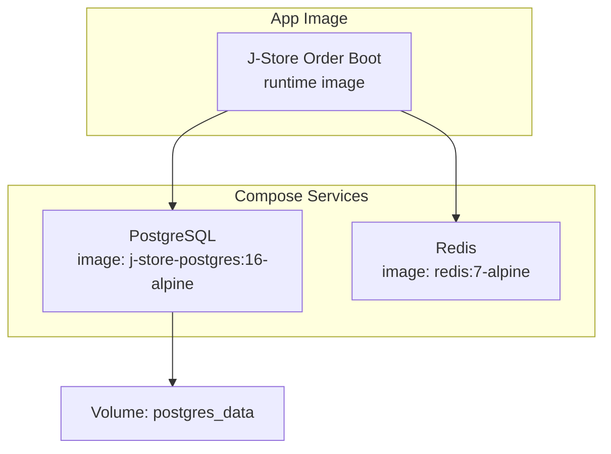
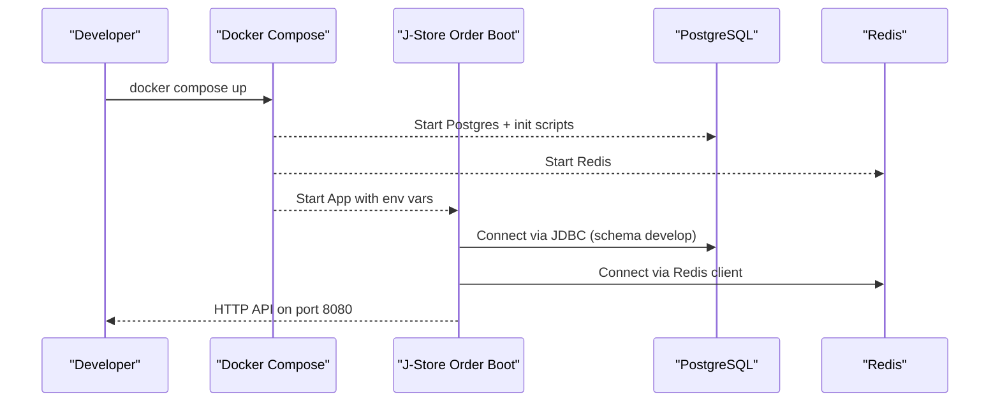
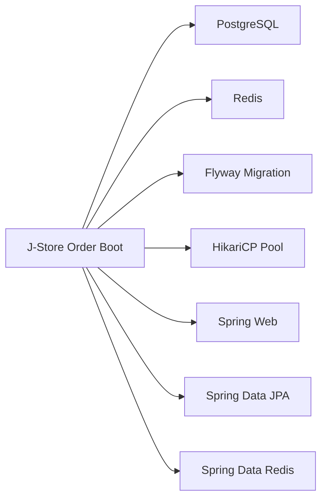

# Containerization & Docker

<cite>
**Referenced Files in This Document**
- [docker-compose.postgres.yml](file://docker-compose.postgres.yml)
- [j-store-boot/Dockerfile](file://j-store-boot/Dockerfile)
- [docker/postgres/Dockerfile](file://docker/postgres/Dockerfile)
- [docker/postgres/init/01-init.sql](file://docker/postgres/init/01-init.sql)
- [j-store-boot/src/main/resources/application.properties](file://j-store-boot/src/main/resources/application.properties)
- [j-store-boot/src/main/resources/application-local.properties](file://j-store-boot/src/main/resources/application-local.properties)
- [j-store-boot/build.gradle.kts](file://j-store-boot/build.gradle.kts)
- [build.gradle.kts](file://build.gradle.kts)
- [j-store-boot/k8s-deployment.yaml](file://j-store-boot/k8s-deployment.yaml)
- [j-store-boot/k8s-service.yaml](file://j-store-boot/k8s-service.yaml)
</cite>

## Table of Contents
1. [Introduction](#introduction)
2. [Project Structure](#project-structure)
3. [Core Components](#core-components)
4. [Architecture Overview](#architecture-overview)
5. [Detailed Component Analysis](#detailed-component-analysis)
6. [Dependency Analysis](#dependency-analysis)
7. [Performance Considerations](#performance-considerations)
8. [Troubleshooting Guide](#troubleshooting-guide)
9. [Conclusion](#conclusion)
10. [Appendices](#appendices)

## Introduction
This document provides comprehensive containerization guidance for the J-Store platform. It explains how to build and run containers for the application and PostgreSQL, how to compose development environments with Redis and Postgres, and how to configure environment variables, volumes, and networking. It also covers image optimization strategies, security best practices, resource limits, health checks, logging, and operational tips for building, tagging, and pushing images to registries.

## Project Structure
The repository includes:
- A minimal Dockerfile for the Spring Boot application runtime image.
- A custom PostgreSQL image that copies initialization scripts into the entrypoint directory.
- A Docker Compose file defining Postgres and Redis services with health checks, ports, and persistent volumes.
- Application configuration files for local profiles and Flyway settings.
- Gradle build configuration for Java toolchain and dependencies.
- Kubernetes manifests demonstrating resource requests/limits and service exposure.

**Diagram sources**
- [docker-compose.postgres.yml:1-40](file://docker-compose.postgres.yml#L1-L40)
- [j-store-boot/Dockerfile:1-6](file://j-store-boot/Dockerfile#L1-L6)

**Section sources**
- [docker-compose.postgres.yml:1-40](file://docker-compose.postgres.yml#L1-L40)
- [j-store-boot/Dockerfile:1-6](file://j-store-boot/Dockerfile#L1-L6)
- [docker/postgres/Dockerfile:1-4](file://docker/postgres/Dockerfile#L1-L4)

## Core Components
- Application runtime image: A small headless JVM image runs the packaged Spring Boot jar. The container exposes a tmp volume and sets a non-root user for improved security.
- Custom Postgres image: Extends the official Alpine-based Postgres image and injects schema initialization scripts into the entrypoint directory so they run on first boot.
- Compose stack: Defines Postgres and Redis with health checks, port mappings, and a named volume for data persistence. Environment variables are sourced from the host or .env.

Key responsibilities:
- Build and package the application via Gradle (Java 25).
- Run the app with minimal overhead using a headless JVM base image.
- Initialize the database schema once per container lifecycle using Postgres init scripts.
- Provide Redis for caching and token storage as configured by the application profile.

**Section sources**
- [j-store-boot/Dockerfile:1-6](file://j-store-boot/Dockerfile#L1-L6)
- [docker/postgres/Dockerfile:1-4](file://docker/postgres/Dockerfile#L1-L4)
- [docker/postgres/init/01-init.sql:1-5](file://docker/postgres/init/01-init.sql#L1-L5)
- [docker-compose.postgres.yml:1-40](file://docker-compose.postgres.yml#L1-L40)
- [j-store-boot/build.gradle.kts:1-96](file://j-store-boot/build.gradle.kts#L1-L96)
- [build.gradle.kts:1-64](file://build.gradle.kts#L1-L64)

## Architecture Overview
The development stack consists of:
- J-Store Order Boot application container connecting to Postgres and Redis over a shared Docker network.
- Postgres container with persistent data volume and initialization scripts.
- Redis container used for caching and token store.

**Diagram sources**
- [docker-compose.postgres.yml:1-40](file://docker-compose.postgres.yml#L1-L40)
- [j-store-boot/src/main/resources/application-local.properties:1-45](file://j-store-boot/src/main/resources/application-local.properties#L1-L45)

## Detailed Component Analysis

### Application Runtime Image
- Base image: Headless Amazon Corretto 25 on Amazon Linux 2023.
- Packaging: Copies the built jar into the image and sets it as the ENTRYPOINT.
- Security: Runs as a non-root user (UID/GID 10001), reducing privilege risk.
- Optimization: Declares /tmp as a volume for temporary files; keep the image minimal by avoiding unnecessary packages.

Recommendations:
- Use multi-stage builds to separate build and runtime stages if you need JDK tools during build but not at runtime.
- Pin exact base image digests for reproducibility.
- Add HEALTHCHECK to enable orchestrator-level liveness/readiness probes.

**Section sources**
- [j-store-boot/Dockerfile:1-6](file://j-store-boot/Dockerfile#L1-L6)
- [build.gradle.kts:13-17](file://build.gradle.kts#L13-L17)
- [j-store-boot/build.gradle.kts:11-19](file://j-store-boot/build.gradle.kts#L11-L19)

### PostgreSQL Image and Initialization
- Base image: Official Postgres 16 Alpine.
- Initialization: Copies SQL scripts into /docker-entrypoint-initdb.d to execute on first container start.
- Schema setup: Creates and grants access to the develop schema and sets search_path.

Operational notes:
- Ensure scripts are idempotent (IF NOT EXISTS, GRANT ALL ON SCHEMA).
- For production, prefer migration tools like Flyway for versioned schema changes.

**Section sources**
- [docker/postgres/Dockerfile:1-4](file://docker/postgres/Dockerfile#L1-L4)
- [docker/postgres/init/01-init.sql:1-5](file://docker/postgres/init/01-init.sql#L1-L5)

### Docker Compose Stack
Services:
- postgres: Builds from docker/postgres, exposes port mapping via environment variable, persists data in a named volume, and defines a healthcheck using pg_isready.
- redis: Uses official redis:7-alpine, exposes default port, and defines a simple ping-based healthcheck.

Networking:
- All services share a default bridge network created by Compose.
- Application connects to Postgres and Redis using hostnames matching service names.

Volumes:
- postgres_data is declared and mounted under /var/lib/postgresql/data.

Healthchecks:
- Postgres uses pg_isready with user and database parameters.
- Redis uses redis-cli ping.

Environment variables:
- Postgres credentials and database name are provided via POSTGRES_* variables.
- Ports can be overridden via POSTGRES_PORT and REDIS_PORT.

**Section sources**
- [docker-compose.postgres.yml:1-40](file://docker-compose.postgres.yml#L1-L40)

### Application Configuration and Dependencies
- Active profile: local by default.
- Database: JDBC URL points to Postgres on localhost:30432 with currentSchema=develop; credentials via environment variables.
- HikariCP: Pool name, auto-commit disabled, maximum pool size set.
- Flyway: Enabled, locations configured, baseline-on-migrate enabled, validation on migrate.
- Redis: Host, port, password, database index, and timeout configured via environment variables.
- JWT secret: Configured via environment variable.
- Messaging: Outbox enabled, mode set to local for single-node deployment.

Dependencies:
- Spring Data Redis, JPA, Web, Validation, WebFlux, Flyway, PostgreSQL driver.
- Kotlin and Lombok processors configured.

**Section sources**
- [j-store-boot/src/main/resources/application.properties:1-11](file://j-store-boot/src/main/resources/application.properties#L1-L11)
- [j-store-boot/src/main/resources/application-local.properties:1-45](file://j-store-boot/src/main/resources/application-local.properties#L1-L45)
- [j-store-boot/build.gradle.kts:25-83](file://j-store-boot/build.gradle.kts#L25-L83)

### Kubernetes Resource Limits and Service Exposure
- Deployment defines CPU and memory requests/limits for the application container.
- Service exposes port 8080 via NodePort for local cluster access.

Note: These manifests demonstrate resource governance patterns suitable for production tuning.

**Section sources**
- [j-store-boot/k8s-deployment.yaml:1-31](file://j-store-boot/k8s-deployment.yaml#L1-L31)
- [j-store-boot/k8s-service.yaml:1-13](file://j-store-boot/k8s-service.yaml#L1-L13)

## Dependency Analysis
The application depends on:
- PostgreSQL for persistence (JDBC + Flyway).
- Redis for caching and token storage.
- Spring Boot starters for web, data JPA, data Redis, validation, and WebFlux.
- Kotlin and Lombok for compilation-time processing.

Build-time vs runtime:
- Build requires Java 25 toolchain and Kotlin compiler plugins.
- Runtime requires only the headless JVM and the packaged jar.

**Diagram sources**
- [j-store-boot/build.gradle.kts:25-83](file://j-store-boot/build.gradle.kts#L25-L83)
- [j-store-boot/src/main/resources/application-local.properties:1-45](file://j-store-boot/src/main/resources/application-local.properties#L1-L45)

**Section sources**
- [j-store-boot/build.gradle.kts:25-83](file://j-store-boot/build.gradle.kts#L25-L83)
- [j-store-boot/src/main/resources/application-local.properties:1-45](file://j-store-boot/src/main/resources/application-local.properties#L1-L45)

## Performance Considerations
- JVM options: Tune heap sizes and GC flags via environment variables when running in containers.
- Connection pooling: Adjust Hikari maximum-pool-size based on CPU cores and workload.
- I/O temp space: Ensure /tmp has sufficient disk space; consider mounting an ephemeral volume with appropriate size.
- Database: Use connection timeouts and retry policies; ensure indexes align with queries.
- Caching: Configure Redis TTLs and eviction policies to balance memory usage and cache hit rates.
- Image layers: Keep layers minimal and avoid copying unnecessary files to reduce startup time and attack surface.

[No sources needed since this section provides general guidance]

## Troubleshooting Guide
Common issues and resolutions:
- Cannot connect to Postgres:
  - Verify service name resolution and port mapping.
  - Confirm healthcheck passes before app starts.
  - Check credentials and schema name (develop).
- Redis connectivity failures:
  - Validate host/port/password/database values.
  - Ensure Redis container is healthy.
- Flyway migration errors:
  - Review baseline version and validate-on-migrate settings.
  - Ensure schema exists and permissions are granted.
- Permission denied in container:
  - Ensure the app runs as non-root and has write access to required directories.
- High memory usage:
  - Inspect JVM heap settings and adjust limits accordingly.
  - Monitor Hikari pool saturation and Redis memory usage.

**Section sources**
- [docker-compose.postgres.yml:18-22](file://docker-compose.postgres.yml#L18-L22)
- [docker-compose.postgres.yml:32-36](file://docker-compose.postgres.yml#L32-L36)
- [j-store-boot/src/main/resources/application-local.properties:1-45](file://j-store-boot/src/main/resources/application-local.properties#L1-L45)

## Conclusion
The J-Store platform’s containerization leverages a minimal runtime image for the application, a customized Postgres image for schema initialization, and a Compose stack that wires together Postgres and Redis with health checks and persistent volumes. By following the recommended practices—multi-stage builds, non-root users, pinned base images, explicit resource limits, and robust health checks—you can achieve secure, efficient, and maintainable deployments across development and production environments.

[No sources needed since this section summarizes without analyzing specific files]

## Appendices

### Building Custom Images
- Application image:
  - Build the jar using Gradle with Java 25.
  - Build the Docker image from the application module directory using the provided Dockerfile.
- PostgreSQL image:
  - Build from docker/postgres to include initialization scripts.

Tagging and pushing:
- Tag images with semantic versions or commit SHAs.
- Push to your preferred registry (e.g., Docker Hub, ECR, GCR, ACR).
- Use immutable tags for reproducibility and promote via labels.

**Section sources**
- [j-store-boot/Dockerfile:1-6](file://j-store-boot/Dockerfile#L1-L6)
- [docker/postgres/Dockerfile:1-4](file://docker/postgres/Dockerfile#L1-L4)
- [build.gradle.kts:13-17](file://build.gradle.kts#L13-L17)

### Environment Variables Reference
- Postgres:
  - POSTGRES_DB, POSTGRES_USER, POSTGRES_PASSWORD, POSTGRES_PORT
- Redis:
  - REDIS_PORT
- Application:
  - JSTORE_DB_URL, JSTORE_DB_USER, JSTORE_DB_PASSWORD
  - JSTORE_REDIS_HOST, JSTORE_REDIS_PORT, JSTORE_REDIS_PASSWORD, JSTORE_REDIS_DATABASE
  - JSTORE_JWT_SECRET

**Section sources**
- [docker-compose.postgres.yml:9-15](file://docker-compose.postgres.yml#L9-L15)
- [j-store-boot/src/main/resources/application-local.properties:1-45](file://j-store-boot/src/main/resources/application-local.properties#L1-L45)

### Volume Mounting and Persistence
- Postgres data persisted via named volume postgres_data mounted at /var/lib/postgresql/data.
- For local development, consider bind mounts for logs or config overrides.

**Section sources**
- [docker-compose.postgres.yml:16-17](file://docker-compose.postgres.yml#L16-L17)

### Network Configuration
- Default Compose network enables service discovery by service name.
- Port mappings allow host access to Postgres and Redis; application listens on 8080 inside the container.

**Section sources**
- [docker-compose.postgres.yml:14-15](file://docker-compose.postgres.yml#L14-L15)
- [docker-compose.postgres.yml:30-31](file://docker-compose.postgres.yml#L30-L31)

### Health Checks and Logging
- Postgres healthcheck uses pg_isready with user and database.
- Redis healthcheck uses redis-cli ping.
- Application shutdown is graceful; configure log levels via properties.

**Section sources**
- [docker-compose.postgres.yml:18-22](file://docker-compose.postgres.yml#L18-L22)
- [docker-compose.postgres.yml:32-36](file://docker-compose.postgres.yml#L32-L36)
- [j-store-boot/src/main/resources/application.properties:1-11](file://j-store-boot/src/main/resources/application.properties#L1-L11)

### Resource Limits and Probes
- Kubernetes deployment demonstrates CPU/memory requests and limits.
- Add Docker HEALTHCHECK to the application image for orchestrator integration.

**Section sources**
- [j-store-boot/k8s-deployment.yaml:23-29](file://j-store-boot/k8s-deployment.yaml#L23-L29)