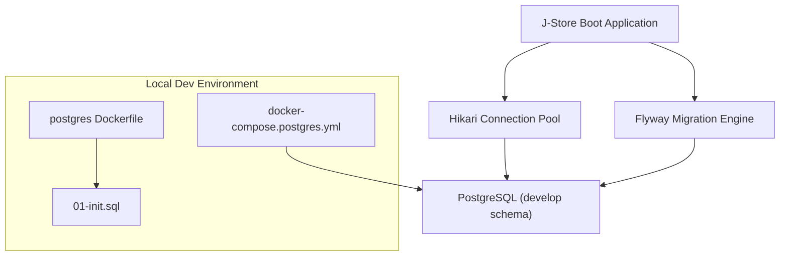
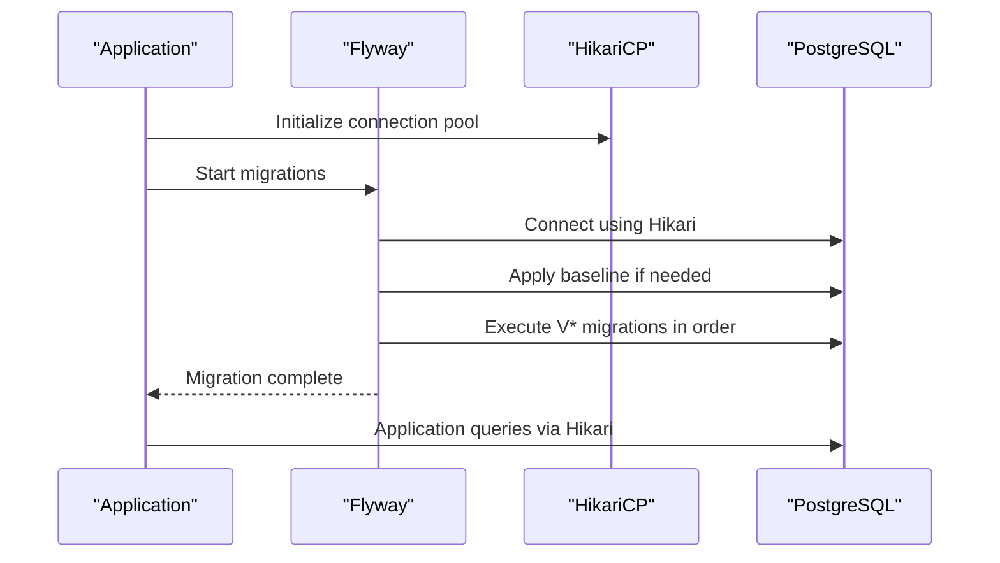
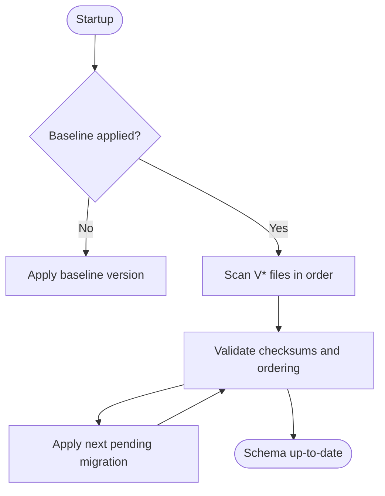
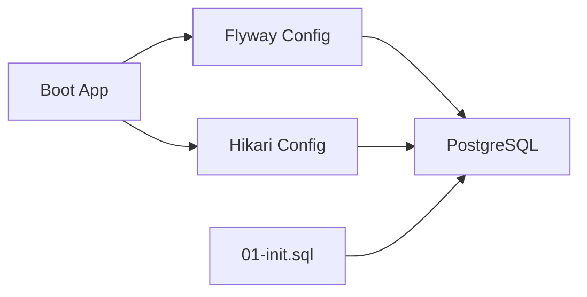

# Database Operations & Maintenance

<cite>
**Referenced Files in This Document**
- [application.properties](file://j-store-boot/src/main/resources/application.properties)
- [application-local.properties](file://j-store-boot/src/main/resources/application-local.properties)
- [docker-compose.postgres.yml](file://docker-compose.postgres.yml)
- [Dockerfile](file://docker/postgres/Dockerfile)
- [01-init.sql](file://docker/postgres/init/01-init.sql)
- [V20260507__baseline_j_store_boot_schema.sql](file://j-store-boot/src/main/resources/db/migration/V20260507__baseline_j_store_boot_schema.sql)
- [V20260731__order_status_dimensions.sql](file://j-store-boot/src/main/resources/db/migration/V20260731__order_status_dimensions.sql)
- [V20260803__order_after_sale_aggregate.sql](file://j-store-boot/src/main/resources/db/migration/V20260803__order_after_sale_aggregate.sql)
- [V20260804__outbox_production_hardening.sql](file://j-store-boot/src/main/resources/db/migration/V20260804__outbox_production_hardening.sql)
- [V20260805__order_payment_fulfillment_boundaries.sql](file://j-store-boot/src/main/resources/db/migration/V20260805__order_payment_fulfillment_boundaries.sql)
- [V20260806__unified_account_merchant_membership.sql](file://j-store-boot/src/main/resources/db/migration/V20260806__unified_account_merchant_membership.sql)
- [V20260807__event_delivery_targets.sql](file://j-store-boot/src/main/resources/db/migration/V20260807__event_delivery_targets.sql)
</cite>

## Table of Contents
1. Introduction
2. Project Structure
3. Core Components
4. Architecture Overview
5. Detailed Component Analysis
6. Dependency Analysis
7. Performance Considerations
8. Troubleshooting Guide
9. Conclusion
10. Appendices

## Introduction
This document provides comprehensive database operations and maintenance guidance for the J-Store platform. It covers Flyway-based schema evolution, versioning and rollback procedures, backup and recovery strategies, connection pooling configuration, query optimization, monitoring, data archiving, disaster recovery, consistency validation, and routine maintenance tasks. The content is grounded in the repository’s configuration and migration artifacts to ensure accuracy and practical applicability.

## Project Structure
The J-Store application uses PostgreSQL with Flyway for schema migrations and HikariCP for connection pooling. Migrations are stored under the boot module’s resources and executed at startup. A Docker Compose setup provisions a local PostgreSQL instance with an initialization script that creates the development schema and grants permissions.

**Diagram sources**
- [application.properties:5-11](file://j-store-boot/src/main/resources/application.properties#L5-L11)
- [application-local.properties:1-12](file://j-store-boot/src/main/resources/application-local.properties#L1-L12)
- [docker-compose.postgres.yml:1-23](file://docker-compose.postgres.yml#L1-L23)
- [Dockerfile:1-4](file://docker/postgres/Dockerfile#L1-L4)
- [01-init.sql:1-5](file://docker/postgres/init/01-init.sql#L1-L5)

**Section sources**
- [application.properties:1-11](file://j-store-boot/src/main/resources/application.properties#L1-L11)
- [application-local.properties:1-12](file://j-store-boot/src/main/resources/application-local.properties#L1-L12)
- [docker-compose.postgres.yml:1-23](file://docker-compose.postgres.yml#L1-L23)
- [Dockerfile:1-4](file://docker/postgres/Dockerfile#L1-L4)
- [01-init.sql:1-5](file://docker/postgres/init/01-init.sql#L1-L5)

## Core Components
- Flyway Configuration: Enabled, baseline-on-migrate set, validate-on-migrate enabled, locations configured to classpath db/migration, default schema and schemas set to develop.
- Connection Pooling: Hikari pool name, auto-commit disabled, maximum-pool-size configured.
- Database Connectivity: JDBC URL, username/password via environment variables, Redis configuration present but not part of DB ops scope.
- Initialization: Schema creation and role search_path configured via init SQL.

Key operational implications:
- Baseline version ensures existing databases can be brought under Flyway control without destructive changes.
- Validate-on-migrate prevents drift between code and schema.
- Hikari settings provide a controlled connection budget and transactional behavior aligned with Spring transactions.

**Section sources**
- [application.properties:5-11](file://j-store-boot/src/main/resources/application.properties#L5-L11)
- [application-local.properties:1-12](file://j-store-boot/src/main/resources/application-local.properties#L1-L12)
- [01-init.sql:1-5](file://docker/postgres/init/01-init.sql#L1-L5)

## Architecture Overview
The runtime architecture integrates the application with Flyway and HikariCP to manage schema evolution and connections against PostgreSQL. The initialization script prepares the target schema before migrations run.

**Diagram sources**
- [application.properties:5-11](file://j-store-boot/src/main/resources/application.properties#L5-L11)
- [application-local.properties:1-12](file://j-store-boot/src/main/resources/application-local.properties#L1-L12)
- [01-init.sql:1-5](file://docker/postgres/init/01-init.sql#L1-L5)

## Detailed Component Analysis

### Flyway Migration Strategy and Version Management
- Locations: classpath:db/migration
- Baseline: enabled with baseline-version set to 20260507
- Validation: validate-on-migrate enabled
- Schemas: default-schema and schemas set to develop; create-schemas enabled

Migration files observed:
- V20260507__baseline_j_store_boot_schema.sql
- V20260731__order_status_dimensions.sql
- V20260803__order_after_sale_aggregate.sql
- V20260804__outbox_production_hardening.sql
- V20260805__order_payment_fulfillment_boundaries.sql
- V20260806__unified_account_merchant_membership.sql
- V20260807__event_delivery_targets.sql

Operational notes:
- Some migrations include destructive statements intended for development only; production upgrades must avoid such scripts or use safe alternatives.
- Baseline allows existing databases to adopt Flyway tracking without reinitialization.
- Validate-on-migrate enforces checksums and ordering to prevent accidental drift.

**Diagram sources**
- [application.properties:5-11](file://j-store-boot/src/main/resources/application.properties#L5-L11)
- [V20260507__baseline_j_store_boot_schema.sql](file://j-store-boot/src/main/resources/db/migration/V20260507__baseline_j_store_boot_schema.sql)
- [V20260731__order_status_dimensions.sql](file://j-store-boot/src/main/resources/db/migration/V20260731__order_status_dimensions.sql)
- [V20260803__order_after_sale_aggregate.sql](file://j-store-boot/src/main/resources/db/migration/V20260803__order_after_sale_aggregate.sql)

**Section sources**
- [application.properties:5-11](file://j-store-boot/src/main/resources/application.properties#L5-L11)
- [application-local.properties:10-12](file://j-store-boot/src/main/resources/application-local.properties#L10-L12)
- [V20260507__baseline_j_store_boot_schema.sql](file://j-store-boot/src/main/resources/db/migration/V20260507__baseline_j_store_boot_schema.sql)
- [V20260731__order_status_dimensions.sql](file://j-store-boot/src/main/resources/db/migration/V20260731__order_status_dimensions.sql)
- [V20260803__order_after_sale_aggregate.sql](file://j-store-boot/src/main/resources/db/migration/V20260803__order_after_sale_aggregate.sql)
- [V20260804__outbox_production_hardening.sql](file://j-store-boot/src/main/resources/db/migration/V20260804__outbox_production_hardening.sql)
- [V20260805__order_payment_fulfillment_boundaries.sql](file://j-store-boot/src/main/resources/db/migration/V20260805__order_payment_fulfillment_boundaries.sql)
- [V20260806__unified_account_merchant_membership.sql](file://j-store-boot/src/main/resources/db/migration/V20260806__unified_account_merchant_membership.sql)
- [V20260807__event_delivery_targets.sql](file://j-store-boot/src/main/resources/db/migration/V20260807__event_delivery_targets.sql)

### Rollback Procedures
- Development-only destructive migrations exist; do not apply these to production.
- Recommended approach:
  - Maintain separate non-destructive migration scripts for production.
  - Use Flyway undo features only in controlled environments where applicable.
  - For critical rollbacks, prefer restoring from verified backups rather than ad-hoc undo.

**Section sources**
- [V20260731__order_status_dimensions.sql](file://j-store-boot/src/main/resources/db/migration/V20260731__order_status_dimensions.sql)
- [V20260803__order_after_sale_aggregate.sql](file://j-store-boot/src/main/resources/db/migration/V20260803__order_after_sale_aggregate.sql)

### Backup and Recovery Procedures
- Full backups:
  - Use pg_dump to capture logical full snapshots of the database.
  - Schedule regular full backups with retention policies aligned to compliance.
- Incremental backups:
  - Enable WAL archiving on PostgreSQL to support incremental backups and point-in-time recovery (PITR).
  - Store WAL segments securely and retain them according to RPO requirements.
- Point-in-time recovery:
  - Restore the latest full backup, then replay WAL segments up to the desired timestamp.
  - Validate data integrity post-recovery with checksums and application-level consistency checks.

Operational recommendations:
- Automate backup jobs and verify restore procedures regularly.
- Encrypt backups in transit and at rest.
- Maintain documented runbooks for recovery scenarios.

[No sources needed since this section provides general guidance]

### Connection Pooling Configuration
- HikariCP settings:
  - Pool name: j-store-order
  - Auto-commit: false (transaction management delegated to Spring)
  - Maximum pool size: 20
- Best practices:
  - Tune maximum-pool-size based on CPU cores and workload characteristics.
  - Monitor connection usage and adjust timeouts accordingly.
  - Ensure connection leak detection is enabled in production.

**Section sources**
- [application-local.properties:6-9](file://j-store-boot/src/main/resources/application-local.properties#L6-L9)

### Query Optimization and Performance Tuning
- Indexing strategy:
  - Migrations define composite indexes on status fields with create_time for efficient filtering and sorting.
  - Review index usage with EXPLAIN ANALYZE and drop unused indexes.
- Transaction design:
  - Keep transactions short and focused to reduce lock contention.
  - Avoid long-running reads within write-heavy transactions.
- PostgreSQL tuning:
  - Configure shared_buffers, work_mem, effective_cache_size, and maintenance_work_mem based on available memory.
  - Tune wal_level and checkpoint settings for WAL-driven PITR and performance balance.

**Section sources**
- [V20260731__order_status_dimensions.sql](file://j-store-boot/src/main/resources/db/migration/V20260731__order_status_dimensions.sql)
- [V20260803__order_after_sale_aggregate.sql](file://j-store-boot/src/main/resources/db/migration/V20260803__order_after_sale_aggregate.sql)

### Monitoring and Observability
- Slow queries:
  - Enable log_min_duration_statement to capture slow queries.
  - Use pg_stat_statements extension for aggregated query metrics.
- Connection usage:
  - Monitor Hikari pool metrics (active, idle, total) via application metrics endpoints.
  - Track PostgreSQL backend connections and wait events.
- Resource utilization:
  - Monitor CPU, memory, disk I/O, and WAL generation.
  - Set alerts for high connection counts, lock waits, and replication lag.

[No sources needed since this section provides general guidance]

### Data Archiving and Retention Policies
- Strategies:
  - Partition large tables by time or domain boundaries where feasible.
  - Archive historical records to cold storage after defined retention periods.
- Compliance:
  - Align retention with legal and regulatory requirements.
  - Implement immutable audit logs for financial and order-related events.
- Implementation:
  - Use scheduled jobs to move eligible rows to archive tables or external storage.
  - Ensure referential integrity and consistent timestamps across archives.

[No sources needed since this section provides general guidance]

### Disaster Recovery and Failover
- Failover scenarios:
  - Primary/replica setup with automatic failover tools (e.g., Patroni).
  - Read replicas for scaling read-heavy workloads.
- Consistency validation:
  - Post-failover, reconcile critical aggregates (orders, payments) using checksums and reconciliation jobs.
  - Verify event delivery targets and outbox consistency.

[No sources needed since this section provides general guidance]

### Maintenance Tasks
- Index rebuilding:
  - Reindex concurrently during low-traffic windows to avoid blocking writes.
- Statistics updates:
  - Run ANALYZE regularly to keep planner statistics current.
- Vacuum operations:
  - Configure autovacuum thresholds and tune for workload patterns.
  - Perform manual VACUUM FULL only when necessary and during maintenance windows.

[No sources needed since this section provides general guidance]

## Dependency Analysis
The boot module orchestrates Flyway and HikariCP to interact with PostgreSQL. The initialization script sets up the schema and roles prior to migration execution.

**Diagram sources**
- [application.properties:5-11](file://j-store-boot/src/main/resources/application.properties#L5-L11)
- [application-local.properties:1-12](file://j-store-boot/src/main/resources/application-local.properties#L1-L12)
- [01-init.sql:1-5](file://docker/postgres/init/01-init.sql#L1-L5)

**Section sources**
- [application.properties:5-11](file://j-store-boot/src/main/resources/application.properties#L5-L11)
- [application-local.properties:1-12](file://j-store-boot/src/main/resources/application-local.properties#L1-L12)
- [01-init.sql:1-5](file://docker/postgres/init/01-init.sql#L1-L5)

## Performance Considerations
- Connection pool sizing:
  - Align Hikari maximum-pool-size with expected concurrency and database capacity.
- Query patterns:
  - Prefer indexed filters and avoid SELECT *; use pagination for large result sets.
- Lock contention:
  - Minimize long transactions and hot-spot updates; consider optimistic locking where appropriate.
- WAL and checkpoints:
  - Balance WAL volume and checkpoint frequency for throughput vs. durability.

[No sources needed since this section provides general guidance]

## Troubleshooting Guide
Common issues and resolutions:
- Migration failures:
  - Validate checksum mismatches; ensure migration files are not modified after baseline.
  - Check schema permissions and search_path alignment.
- Connection exhaustion:
  - Increase Hikari pool size cautiously; investigate long-running queries and leaks.
- Slow queries:
  - Analyze execution plans; add or adjust indexes; rewrite inefficient queries.
- Deadlocks:
  - Identify conflicting transactions; reorder locks consistently; reduce transaction scope.

[No sources needed since this section provides general guidance]

## Conclusion
J-Store’s database operations rely on Flyway for robust schema evolution and HikariCP for reliable connection management. By following the outlined backup, recovery, monitoring, and maintenance practices, teams can maintain high availability, performance, and compliance. Always tailor configurations to workload characteristics and enforce strict change controls for production environments.

[No sources needed since this section summarizes without analyzing specific files]

## Appendices
- Migration inventory:
  - V20260507__baseline_j_store_boot_schema.sql
  - V20260731__order_status_dimensions.sql
  - V20260803__order_after_sale_aggregate.sql
  - V20260804__outbox_production_hardening.sql
  - V20260805__order_payment_fulfillment_boundaries.sql
  - V20260806__unified_account_merchant_membership.sql
  - V20260807__event_delivery_targets.sql

[No sources needed since this section lists references already cited above]