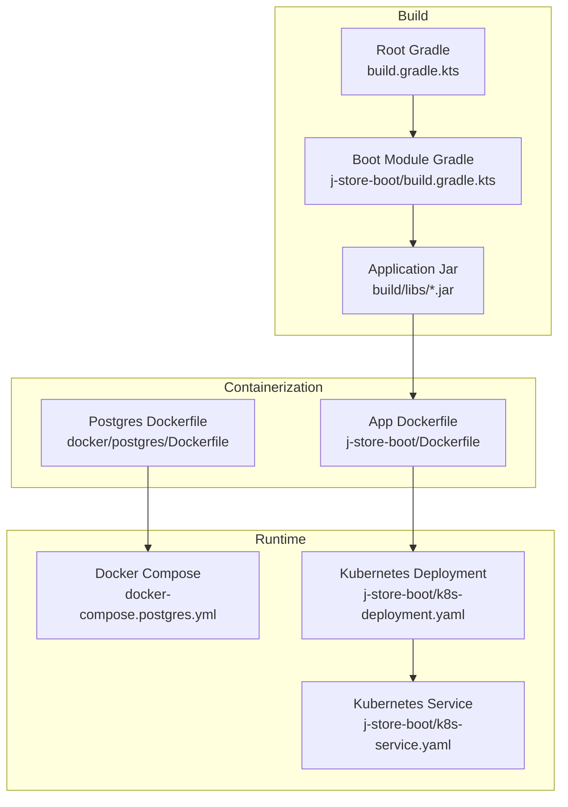
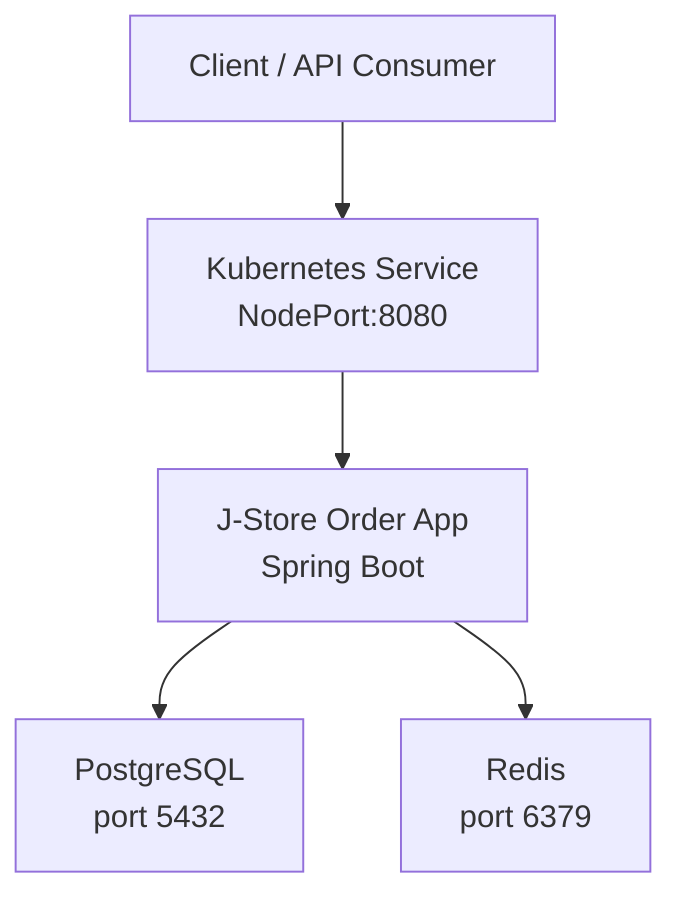
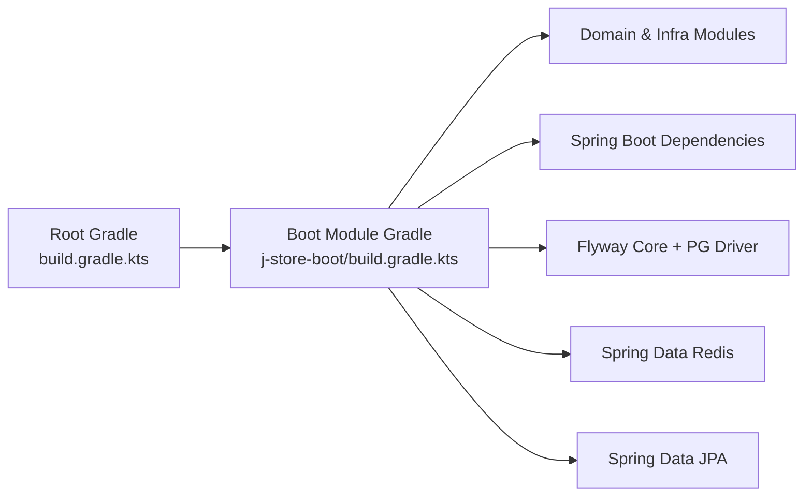

# Deployment & Operations

<cite>
**Referenced Files in This Document**
- [docker-compose.postgres.yml](file://docker-compose.postgres.yml)
- [Dockerfile (PostgreSQL)](file://docker/postgres/Dockerfile)
- [Dockerfile (j-store-boot)](file://j-store-boot/Dockerfile)
- [k8s-deployment.yaml](file://j-store-boot/k8s-deployment.yaml)
- [k8s-service.yaml](file://j-store-boot/k8s-service.yaml)
- [application.properties](file://j-store-boot/src/main/resources/application.properties)
- [application-local.properties](file://j-store-boot/src/main/resources/application-local.properties)
- [build.gradle.kts (root)](file://build.gradle.kts)
- [build.gradle.kts (j-store-boot)](file://j-store-boot/build.gradle.kts)
</cite>

## Table of Contents
1. [Introduction](#introduction)
2. [Project Structure](#project-structure)
3. [Core Components](#core-components)
4. [Architecture Overview](#architecture-overview)
5. [Detailed Component Analysis](#detailed-component-analysis)
6. [Dependency Analysis](#dependency-analysis)
7. [Performance Considerations](#performance-considerations)
8. [Troubleshooting Guide](#troubleshooting-guide)
9. [Conclusion](#conclusion)
10. [Appendices](#appendices)

## Introduction
This document provides comprehensive deployment and operations guidance for the J-Store platform. It covers Docker containerization, Kubernetes deployments, development environment setup with Docker Compose, production strategies, monitoring and logging, health probes, database migrations, backup and disaster recovery, performance tuning, operational procedures, security, and compliance. The content is grounded in the repository’s existing configuration files and build artifacts.

## Project Structure
The project is a multi-module Spring Boot application with separate boot modules per domain. For deployment, the primary artifact is built by the j-store-boot module, which aggregates multiple domain and infrastructure modules. Container images are defined via Dockerfiles, and Kubernetes manifests are provided for basic deployment and service exposure. A Docker Compose file defines local dependencies (PostgreSQL and Redis).

**Diagram sources**
- [build.gradle.kts (root):1-64](file://build.gradle.kts#L1-L64)
- [build.gradle.kts (j-store-boot):1-96](file://j-store-boot/build.gradle.kts#L1-L96)
- [Dockerfile (j-store-boot):1-6](file://j-store-boot/Dockerfile#L1-L6)
- [Dockerfile (PostgreSQL):1-4](file://docker/postgres/Dockerfile#L1-L4)
- [docker-compose.postgres.yml:1-40](file://docker-compose.postgres.yml#L1-L40)
- [k8s-deployment.yaml:1-31](file://j-store-boot/k8s-deployment.yaml#L1-L31)
- [k8s-service.yaml:1-13](file://j-store-boot/k8s-service.yaml#L1-L13)

**Section sources**
- [build.gradle.kts (root):1-64](file://build.gradle.kts#L1-L64)
- [build.gradle.kts (j-store-boot):1-96](file://j-store-boot/build.gradle.kts#L1-L96)
- [docker-compose.postgres.yml:1-40](file://docker-compose.postgres.yml#L1-L40)
- [Dockerfile (PostgreSQL):1-4](file://docker/postgres/Dockerfile#L1-L4)
- [Dockerfile (j-store-boot):1-6](file://j-store-boot/Dockerfile#L1-L6)
- [k8s-deployment.yaml:1-31](file://j-store-boot/k8s-deployment.yaml#L1-L31)
- [k8s-service.yaml:1-13](file://j-store-boot/k8s-service.yaml#L1-L13)

## Core Components
- Application runtime: Spring Boot app packaged as a single jar and run with a minimal Java base image.
- Database: PostgreSQL with initialization scripts and Flyway migrations.
- Cache/Session: Redis configured for local development.
- Orchestration: Docker Compose for local dev; Kubernetes Deployment and Service for cluster deployment.

Key configuration highlights:
- Application name and graceful shutdown are set in the main properties.
- Flyway is enabled with baseline-on-migrate and validation on migrate.
- Local profile configures datasource, Hikari pool size, Redis connection, JWT secret, and messaging mode.

**Section sources**
- [application.properties:1-11](file://j-store-boot/src/main/resources/application.properties#L1-L11)
- [application-local.properties:1-45](file://j-store-boot/src/main/resources/application-local.properties#L1-L45)

## Architecture Overview
The runtime architecture consists of the Spring Boot application connecting to PostgreSQL and Redis. In development, Docker Compose provisions both data stores with health checks. In production, Kubernetes manages the application lifecycle and exposes it via a NodePort service.

**Diagram sources**
- [k8s-service.yaml:1-13](file://j-store-boot/k8s-service.yaml#L1-L13)
- [k8s-deployment.yaml:1-31](file://j-store-boot/k8s-deployment.yaml#L1-L31)
- [application-local.properties:1-45](file://j-store-boot/src/main/resources/application-local.properties#L1-L45)
- [docker-compose.postgres.yml:1-40](file://docker-compose.postgres.yml#L1-L40)

## Detailed Component Analysis

### Docker Containerization
- Application image: Uses a headless Amazon Corretto 25 base image, copies the built jar into /app.jar, sets a non-root user, and runs java -jar.
- PostgreSQL image: Extends postgres:16-alpine and copies init SQL scripts into the entrypoint directory.

Recommendations:
- Implement multi-stage builds to reduce image size: first stage compiles and packages, second stage runs with only the runtime JRE and the final jar.
- Pin base image digests for reproducibility.
- Add .dockerignore to exclude build artifacts and unnecessary files.

Operational notes:
- Ensure the container user has read access to the jar and any mounted volumes.
- Configure JVM options via environment variables or startup scripts for production.

**Section sources**
- [Dockerfile (j-store-boot):1-6](file://j-store-boot/Dockerfile#L1-L6)
- [Dockerfile (PostgreSQL):1-4](file://docker/postgres/Dockerfile#L1-L4)

### Kubernetes Deployment Configuration
- Deployment: Defines a single-replica deployment with resource requests and limits for CPU and memory. Image pull policy is set to Never for local clusters.
- Service: Exposes the app via NodePort on port 8080.

Scaling and resilience:
- Increase replicas based on load testing results.
- Define HorizontalPodAutoscaler using CPU/memory or custom metrics.
- Add PodDisruptionBudget to control voluntary disruptions.
- Use readiness and liveness probes to ensure traffic routing and self-healing.

Secrets and config:
- Store sensitive values (JWT secret, DB credentials, Redis password) in Kubernetes Secrets and reference them in the Deployment env or ConfigMap.

**Section sources**
- [k8s-deployment.yaml:1-31](file://j-store-boot/k8s-deployment.yaml#L1-L31)
- [k8s-service.yaml:1-13](file://j-store-boot/k8s-service.yaml#L1-L13)

### Development Environment with Docker Compose
- Services:
  - PostgreSQL: Initialized with scripts, exposed on a configurable host port, persistent volume, and health check using pg_isready.
  - Redis: Standard Redis image with health check using redis-cli ping.
- Environment variables:
  - POSTGRES_DB, POSTGRES_USER, POSTGRES_PASSWORD, TZ, and ports are configurable via .env.
  - Redis host/port/password/database can be mapped to application properties.

Usage:
- Start services with docker compose up.
- Verify health endpoints for both containers.
- Connect the application using the local profile settings.

**Section sources**
- [docker-compose.postgres.yml:1-40](file://docker-compose.postgres.yml#L1-L40)
- [application-local.properties:1-45](file://j-store-boot/src/main/resources/application-local.properties#L1-L45)

### Health Checks, Readiness Probes, and Liveness Probes
- PostgreSQL health check is defined in Docker Compose using pg_isready.
- Redis health check is defined in Docker Compose using redis-cli ping.
- Application-level health endpoints should be implemented (e.g., Spring Boot Actuator) and wired to Kubernetes readiness/liveness probes.

Recommended probe strategy:
- Liveness: Simple endpoint that verifies the process is alive.
- Readiness: Endpoint that checks connectivity to PostgreSQL and Redis.
- Startup probe: Allow time for application warm-up before liveness/readiness checks begin.

**Section sources**
- [docker-compose.postgres.yml:18-22](file://docker-compose.postgres.yml#L18-L22)
- [docker-compose.postgres.yml:32-36](file://docker-compose.postgres.yml#L32-L36)

### Database Migrations
- Flyway is enabled and configured to run from classpath db/migration with baseline-on-migrate and validate-on-migrate.
- Baseline version is set to a specific timestamp-based version.
- Default schema and create-schemas are configured for local development.

Migration workflow:
- Place new migration scripts under src/main/resources/db/migration.
- Ensure idempotent and backward-compatible changes where possible.
- Validate migrations locally before deploying.

**Section sources**
- [application.properties:5-11](file://j-store-boot/src/main/resources/application.properties#L5-L11)
- [application-local.properties:10-12](file://j-store-boot/src/main/resources/application-local.properties#L10-L12)

### Backup Strategies and Disaster Recovery
- PostgreSQL backups:
  - Use pg_dump/pg_restore for logical backups.
  - Schedule periodic full and incremental backups.
  - Store backups in secure, offsite storage with encryption.
- Restore procedures:
  - Stop writes, restore latest backup, replay WAL if needed, verify integrity.
- RPO/RTO targets:
  - Define acceptable recovery point and time objectives.
  - Test restore procedures regularly.

[No sources needed since this section provides general guidance]

### Monitoring Setup and Log Aggregation
- Metrics:
  - Enable Spring Boot Actuator endpoints for health, info, and metrics.
  - Export Prometheus metrics and scrape with Prometheus.
- Logging:
  - Centralize logs using an agent (e.g., Fluent Bit/Filebeat) to ship to Elasticsearch/OpenSearch or a cloud log service.
  - Correlate logs with request IDs and pod names.
- Alerting:
  - Set alerts for error rates, latency, resource usage, and database connectivity.

[No sources needed since this section provides general guidance]

### Performance Tuning Guidelines, Resource Allocation, and Capacity Planning
- JVM tuning:
  - Set heap sizes appropriate to container limits.
  - Use G1GC and tune GC logs for observability.
- Connection pooling:
  - Tune Hikari maximum-pool-size based on CPU cores and DB capacity.
- Caching:
  - Configure Redis timeouts and connection pools.
- Capacity planning:
  - Perform load tests to determine required replicas and resource requests/limits.
  - Monitor CPU/memory saturation and adjust accordingly.

**Section sources**
- [application-local.properties:6-9](file://j-store-boot/src/main/resources/application-local.properties#L6-L9)
- [application-local.properties:17-21](file://j-store-boot/src/main/resources/application-local.properties#L17-L21)
- [k8s-deployment.yaml:23-29](file://j-store-boot/k8s-deployment.yaml#L23-L29)

### Operational Procedures: Troubleshooting, Incident Response, and Maintenance
- Troubleshooting:
  - Check container logs and Kubernetes events.
  - Validate connectivity to PostgreSQL and Redis.
  - Inspect Flyway migration status and errors.
- Incident response:
  - Isolate affected pods, scale down if necessary.
  - Roll back to previous stable image if needed.
  - Communicate status and resolution steps.
- Maintenance:
  - Plan rolling updates with readiness probes.
  - Rotate secrets and certificates securely.
  - Update base images and dependencies regularly.

[No sources needed since this section provides general guidance]

### Security Considerations, Secrets Management, and Compliance
- Secrets:
  - Store JWT secret, DB credentials, and Redis passwords in Kubernetes Secrets or external secret managers.
- Network security:
  - Restrict ingress to trusted sources.
  - Use network policies to limit inter-service communication.
- Compliance:
  - Enforce least privilege for service accounts.
  - Audit access to secrets and databases.
  - Maintain SBOM and vulnerability scans.

**Section sources**
- [application-local.properties](file://j-store-boot/src/main/resources/application-local.properties#L36)

## Dependency Analysis
The build system uses Gradle with Kotlin DSL. The root build configures toolchains, repositories, and code formatting. The j-store-boot module aggregates domain and infrastructure modules and includes Spring Boot starters for web, JPA, Redis, and Flyway.

**Diagram sources**
- [build.gradle.kts (root):1-64](file://build.gradle.kts#L1-L64)
- [build.gradle.kts (j-store-boot):1-96](file://j-store-boot/build.gradle.kts#L1-L96)

**Section sources**
- [build.gradle.kts (root):1-64](file://build.gradle.kts#L1-L64)
- [build.gradle.kts (j-store-boot):1-96](file://j-store-boot/build.gradle.kts#L1-L96)

## Performance Considerations
- Container resources:
  - Set CPU and memory requests/limits aligned with observed usage.
- Database connections:
  - Align Hikari pool size with available CPU and DB max connections.
- Caching:
  - Tune Redis timeouts and consider connection pooling at the client level.
- Build optimization:
  - Use multi-stage Docker builds to minimize image size and attack surface.

[No sources needed since this section provides general guidance]

## Troubleshooting Guide
Common issues and resolutions:
- Application fails to start:
  - Verify database and Redis connectivity.
  - Check Flyway migration errors and baseline version alignment.
- High memory usage:
  - Review JVM heap settings and GC logs.
  - Inspect connection pool sizing.
- Health checks failing:
  - Ensure actuator endpoints are exposed and probes are correctly configured.
- Kubernetes rollout failures:
  - Inspect readiness probe behavior and pod events.
  - Roll back to previous image if necessary.

[No sources needed since this section provides general guidance]

## Conclusion
J-Store’s deployment model leverages Docker for containerization and Kubernetes for orchestration, with clear separation between development and production concerns. By adopting multi-stage builds, robust health probes, centralized logging, and disciplined migration practices, teams can achieve reliable, scalable, and maintainable operations. Continuous improvement through load testing, monitoring, and security audits will further strengthen the platform’s resilience.

[No sources needed since this section summarizes without analyzing specific files]

## Appendices

### Quick Start Commands
- Build and package:
  - Run Gradle tasks to produce the application jar.
- Local development:
  - Start PostgreSQL and Redis with Docker Compose.
  - Run the application with the local profile.
- Deploy to Kubernetes:
  - Apply Deployment and Service manifests.
  - Scale and monitor as needed.

[No sources needed since this section provides general guidance]