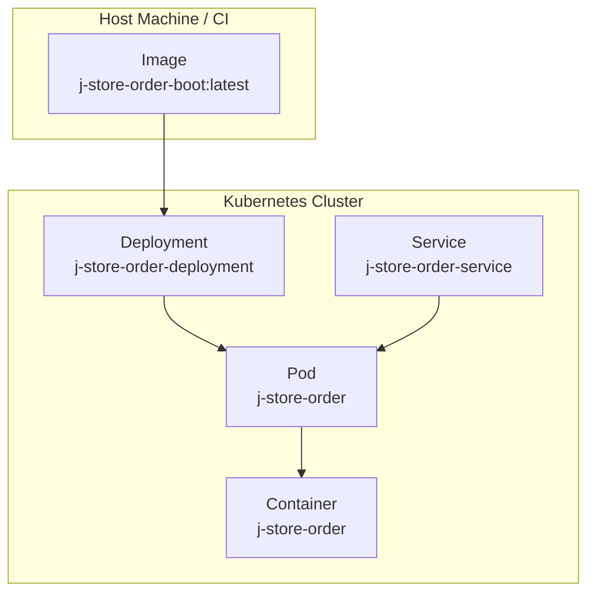
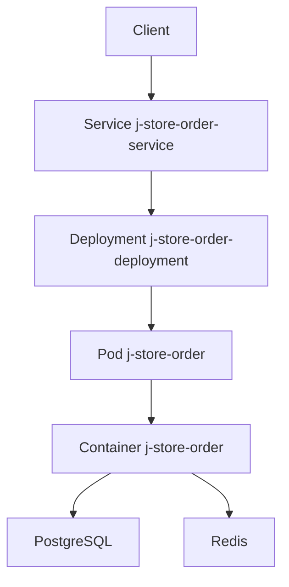
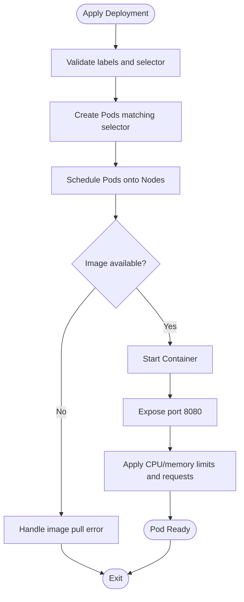
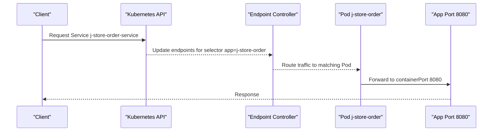
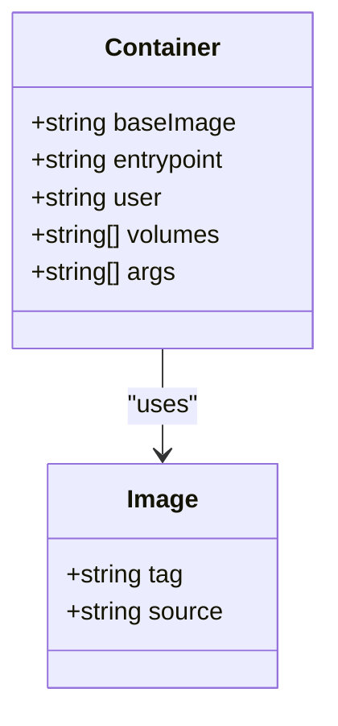
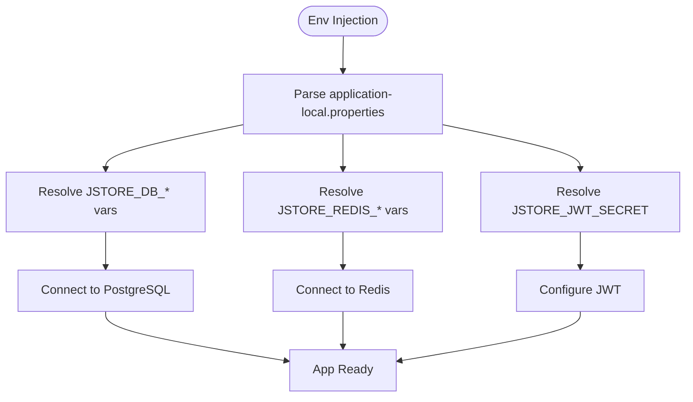
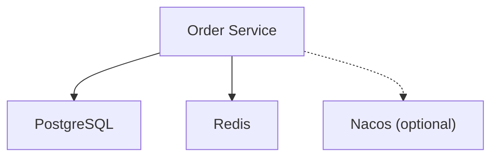

# Deployment Manifests

<cite>
**Referenced Files in This Document**
- [k8s-deployment.yaml](file://j-store-boot/k8s-deployment.yaml)
- [k8s-service.yaml](file://j-store-boot/k8s-service.yaml)
- [Dockerfile](file://j-store-boot/Dockerfile)
- [application.properties](file://j-store-boot/src/main/resources/application.properties)
- [application-local.properties](file://j-store-boot/src/main/resources/application-local.properties)
- [docker-compose.postgres.yml](file://docker-compose.postgres.yml)
</cite>

## Table of Contents
1. [Introduction](#introduction)
2. [Project Structure](#project-structure)
3. [Core Components](#core-components)
4. [Architecture Overview](#architecture-overview)
5. [Detailed Component Analysis](#detailed-component-analysis)
6. [Dependency Analysis](#dependency-analysis)
7. [Performance Considerations](#performance-considerations)
8. [Troubleshooting Guide](#troubleshooting-guide)
9. [Conclusion](#conclusion)
10. [Appendices](#appendices)

## Introduction
This document provides detailed guidance for Kubernetes deployment manifests used by the J-Store platform, focusing on the order service boot module. It explains how the Deployment resource is configured, including container specifications, image management, port configuration, and resource requests/limits. It also documents the pod template structure, label selectors, replica scaling policies, environment variable injection, volume mounts, health checks, container security contexts, service accounts, and network policies. Finally, it offers practical advice for customizing deployments across development, staging, and production environments and outlines best practices for resource allocation.

## Project Structure
The J-Store platform organizes Kubernetes manifests alongside the application code. For the order service boot module, the relevant files are:
- A Deployment manifest defining the workload
- A Service manifest exposing the application within the cluster
- A Dockerfile that defines the container runtime image
- Application properties that configure runtime behavior and external dependencies

**Diagram sources**
- [k8s-deployment.yaml:1-31](file://j-store-boot/k8s-deployment.yaml#L1-L31)
- [k8s-service.yaml:1-13](file://j-store-boot/k8s-service.yaml#L1-L13)
- [Dockerfile:1-6](file://j-store-boot/Dockerfile#L1-L6)

**Section sources**
- [k8s-deployment.yaml:1-31](file://j-store-boot/k8s-deployment.yaml#L1-L31)
- [k8s-service.yaml:1-13](file://j-store-boot/k8s-service.yaml#L1-L13)
- [Dockerfile:1-6](file://j-store-boot/Dockerfile#L1-L6)

## Core Components
- Deployment: Defines the desired state for pods running the order service, including replicas, selector, and container specs.
- Service: Provides stable networking to access the pods via a consistent endpoint.
- Container Image: Built from the Dockerfile; runs the Spring Boot application with Java.
- Application Configuration: Externalized via environment variables for database, Redis, JWT, and messaging settings.

Key aspects covered:
- Container specification: name, image, imagePullPolicy, ports, resources
- Pod template metadata and labels
- Label selectors for Deployment and Service
- Replica scaling policy
- Environment variable injection patterns
- Volume mount usage in the container
- Health checks (liveness/readiness)
- Security context and service account considerations
- Network policies

**Section sources**
- [k8s-deployment.yaml:1-31](file://j-store-boot/k8s-deployment.yaml#L1-L31)
- [k8s-service.yaml:1-13](file://j-store-boot/k8s-service.yaml#L1-L13)
- [Dockerfile:1-6](file://j-store-boot/Dockerfile#L1-L6)
- [application.properties:1-11](file://j-store-boot/src/main/resources/application.properties#L1-L11)
- [application-local.properties:1-45](file://j-store-boot/src/main/resources/application-local.properties#L1-L45)

## Architecture Overview
The order service runs as a single-container pod managed by a Deployment. The Service exposes the container port to other services or clients. The application connects to PostgreSQL and Redis using environment-driven configuration.

[No sources needed since this diagram shows conceptual workflow, not actual code structure]

## Detailed Component Analysis

### Deployment Resource
- Name and labels: The Deployment is named j-store-order-deployment and uses app=j-store-order labels consistently across metadata, selector, and pod template.
- Replicas: Set to 1 by default; can be scaled based on demand.
- Selector: matchLabels ensures only pods with app=j-store-order are managed.
- Pod template:
  - Metadata labels: app=j-store-order
  - Spec containers:
    - Container name: j-store-order
    - Image: j-store-order-boot:latest
    - Image pull policy: Never (suitable for local or pre-pulled images)
    - Ports: containerPort 8080
    - Resources:
      - Limits: memory 512Mi, cpu 500m
      - Requests: memory 256Mi, cpu 250m

**Diagram sources**
- [k8s-deployment.yaml:1-31](file://j-store-boot/k8s-deployment.yaml#L1-L31)

**Section sources**
- [k8s-deployment.yaml:1-31](file://j-store-boot/k8s-deployment.yaml#L1-L31)

### Service Resource
- Name: j-store-order-service
- Selector: app=j-store-order matches the Deployment’s pod labels
- Ports:
  - port: 8080
  - targetPort: 8080
- Type: NodePort, exposing the service on each node’s IP at a dynamically assigned port

**Diagram sources**
- [k8s-service.yaml:1-13](file://j-store-boot/k8s-service.yaml#L1-L13)

**Section sources**
- [k8s-service.yaml:1-13](file://j-store-boot/k8s-service.yaml#L1-L13)

### Container Image and Runtime
- Base image: amazoncorretto:25-al2023-headless
- Working directory: VOLUME /tmp declared
- Application binary: build/libs/*.jar copied as app.jar
- User: Runs as non-root user 10001:10001
- Entrypoint: java -jar /app.jar

**Diagram sources**
- [Dockerfile:1-6](file://j-store-boot/Dockerfile#L1-L6)

**Section sources**
- [Dockerfile:1-6](file://j-store-boot/Dockerfile#L1-L6)

### Environment Variables and Configuration
- Active profile: local
- Database connection:
  - URL: ${JSTORE_DB_URL:...}
  - Username: ${JSTORE_DB_USER:...}
  - Password: ${JSTORE_DB_PASSWORD}
- Hikari pool settings: pool name, auto-commit, maximum pool size
- Flyway schema configuration: default schema, schemas list, create-schemas, baseline version
- Redis configuration:
  - Host: ${JSTORE_REDIS_HOST:...}
  - Port: ${JSTORE_REDIS_PORT:...}
  - Password: ${JSTORE_REDIS_PASSWORD:...}
  - Database index: ${JSTORE_REDIS_DATABASE:...}
  - Timeout: 2000ms
- JWT secret: ${JSTORE_JWT_SECRET}
- Messaging mode: local
- Logging level: info

**Diagram sources**
- [application-local.properties:1-45](file://j-store-boot/src/main/resources/application-local.properties#L1-L45)
- [application.properties:1-11](file://j-store-boot/src/main/resources/application.properties#L1-L11)

**Section sources**
- [application.properties:1-11](file://j-store-boot/src/main/resources/application.properties#L1-L11)
- [application-local.properties:1-45](file://j-store-boot/src/main/resources/application-local.properties#L1-L45)

### Volume Mounts
- The container declares a VOLUME at /tmp in the Dockerfile. In Kubernetes, you can mount persistent storage or ephemeral data into this path using a PersistentVolumeClaim or an emptyDir.
- Example usage patterns:
  - Use an emptyDir for temporary logs or caches
  - Use a PVC for application-specific data requiring persistence

Note: The current Deployment does not define any volumeMounts; add them as needed for your use case.

**Section sources**
- [Dockerfile:1-6](file://j-store-boot/Dockerfile#L1-L6)

### Health Checks (Liveness and Readiness Probes)
- Liveness probe: Not defined in the current Deployment. Add an HTTP or TCP probe to detect unhealthy processes.
- Readiness probe: Not defined in the current Deployment. Add an HTTP probe to ensure traffic is only sent when the app is ready.
- Recommended approach:
  - Liveness: HTTP GET /actuator/health or similar endpoint
  - Readiness: HTTP GET /actuator/ready or a lightweight readiness check

Best practice: Configure appropriate initialDelaySeconds, periodSeconds, timeoutSeconds, failureThreshold, and successThreshold values tailored to your application startup time and health endpoints.

[No sources needed since this section provides general guidance]

### Container Security Contexts and Service Accounts
- Non-root user: The Dockerfile sets USER 10001:10001, which improves security by avoiding root execution.
- SecurityContext recommendations:
  - RunAsNonRoot: true
  - readOnlyRootFilesystem: true where possible
  - AllowPrivilegeEscalation: false
  - Capabilities drop: ["ALL"]
- ServiceAccount: Define a dedicated ServiceAccount with minimal RBAC permissions for the order service.

[No sources needed since this section provides general guidance]

### Network Policies
- No NetworkPolicy is defined in the provided manifests. To restrict ingress and egress:
  - Ingress: Allow traffic only from specific namespaces or load balancers
  - Egress: Restrict outbound connections to required services (e.g., PostgreSQL, Redis)
- Implement least-privilege networking to reduce attack surface.

[No sources needed since this section provides general guidance]

## Dependency Analysis
The order service depends on:
- PostgreSQL for persistent storage
- Redis for caching/session/token storage
- Optional service discovery/config (Nacos) commented out in local config

**Diagram sources**
- [application-local.properties:1-45](file://j-store-boot/src/main/resources/application-local.properties#L1-45)

**Section sources**
- [application-local.properties:1-45](file://j-store-boot/src/main/resources/application-local.properties#L1-45)

## Performance Considerations
- Resource requests and limits:
  - Current limits: memory 512Mi, cpu 500m
  - Current requests: memory 256Mi, cpu 250m
- Recommendations:
  - Profile CPU and memory under realistic loads
  - Tune Hikari pool size according to database capacity and concurrency
  - Adjust Redis timeouts and connection pooling if applicable
  - Consider Horizontal Pod Autoscaler (HPA) based on CPU/memory or custom metrics
  - Use separate namespaces per environment to isolate resources

[No sources needed since this section provides general guidance]

## Troubleshooting Guide
Common issues and resolutions:
- Image pull errors:
  - Ensure image exists and imagePullPolicy is correct (Never for local images)
- Startup failures:
  - Verify environment variables for DB, Redis, and JWT secrets
  - Check connectivity to PostgreSQL and Redis
- Health probes failing:
  - Confirm liveness/readiness endpoints exist and respond correctly
- Resource constraints:
  - Monitor OOMKilled events and adjust memory limits
  - Watch CPU throttling and increase CPU limits if necessary
- Networking:
  - Validate Service selector matches pod labels
  - Check NodePort availability and firewall rules

**Section sources**
- [k8s-deployment.yaml:1-31](file://j-store-boot/k8s-deployment.yaml#L1-L31)
- [k8s-service.yaml:1-13](file://j-store-boot/k8s-service.yaml#L1-L13)
- [application-local.properties:1-45](file://j-store-boot/src/main/resources/application-local.properties#L1-45)

## Conclusion
The J-Store order service Deployment is straightforward and suitable for local development. For production, enhance the manifests with health probes, security contexts, service accounts, network policies, and autoscaling. Externalize all sensitive configuration via environment variables or Kubernetes Secrets. Tailor resource requests/limits based on profiling and monitor performance continuously.

[No sources needed since this section summarizes without analyzing specific files]

## Appendices

### Environment-Specific Customization Guidance
- Development:
  - Use local profiles and minimal replicas
  - Keep imagePullPolicy set to Never for local images
  - Enable verbose logging for debugging
- Staging:
  - Increase replicas and resource limits
  - Introduce readiness/liveness probes
  - Use Secrets for sensitive configuration
- Production:
  - Enforce strict security contexts and read-only filesystems
  - Implement NetworkPolicies
  - Configure HPA and monitoring/alerting
  - Use immutable tags for images and enable image scanning

[No sources needed since this section provides general guidance]

### Reference: Local Dependencies Setup
- docker-compose.postgres.yml defines PostgreSQL and Redis services with health checks for local development.

**Section sources**
- [docker-compose.postgres.yml:1-40](file://docker-compose.postgres.yml#L1-40)