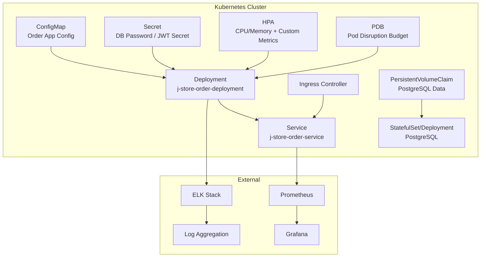
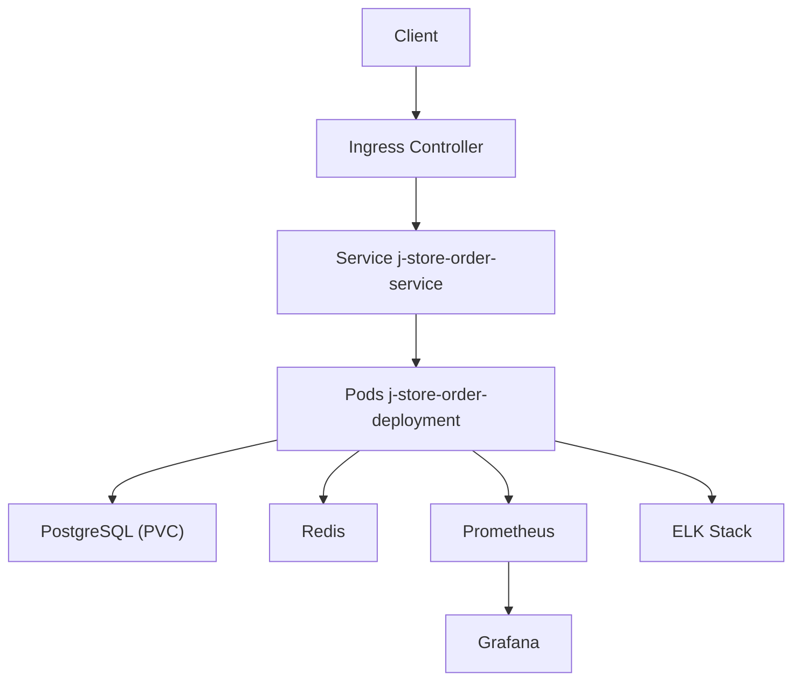
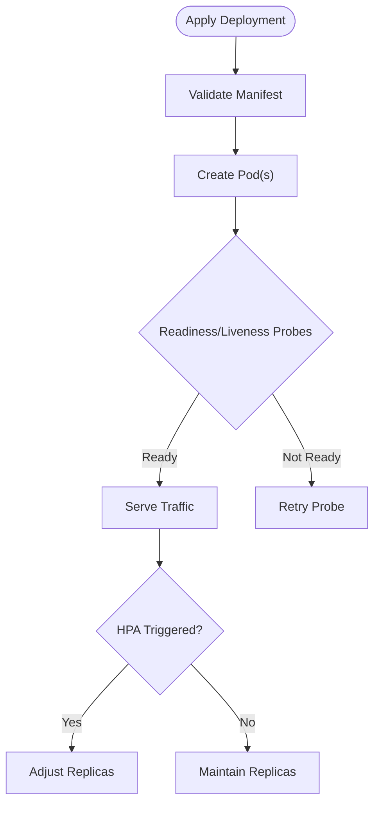
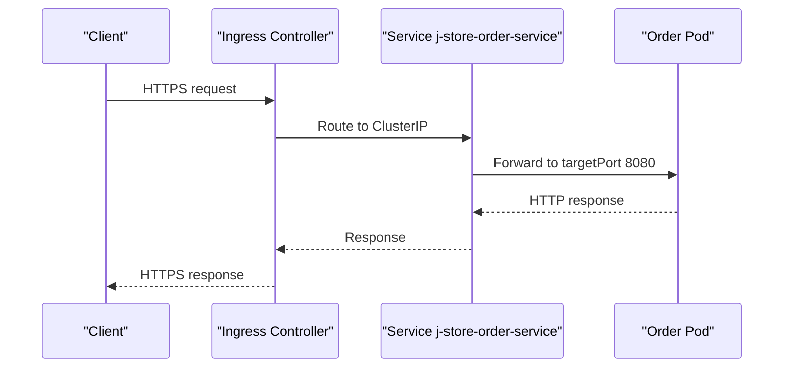
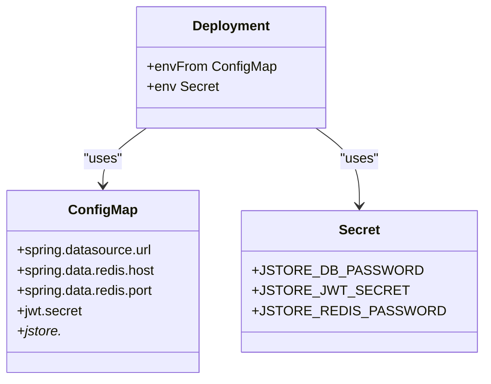
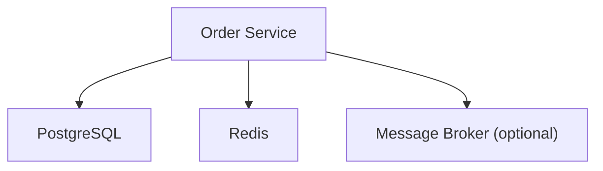

# Kubernetes Deployment

<cite>
**Referenced Files in This Document**
- [k8s-deployment.yaml](file://j-store-boot/k8s-deployment.yaml)
- [k8s-service.yaml](file://j-store-boot/k8s-service.yaml)
- [Dockerfile](file://j-store-boot/Dockerfile)
- [application.properties](file://j-store-boot/src/main/resources/application.properties)
- [application-local.properties](file://j-store-boot/src/main/resources/application-local.properties)
- [docker-compose.postgres.yml](file://docker-compose.postgres.yml)
</cite>

## Table of Contents
1. Introduction
2. Project Structure
3. Core Components
4. Architecture Overview
5. Detailed Component Analysis
6. Dependency Analysis
7. Performance Considerations
8. Troubleshooting Guide
9. Conclusion

## Introduction
This document provides comprehensive Kubernetes deployment guidance for the J-Store platform with a focus on the Order service (j-store-order). It covers resource requests/limits, replica scaling policies, pod disruption budgets, service exposure patterns, configuration and secrets management, ingress setup, TLS termination, autoscaling strategies, persistent storage for PostgreSQL, monitoring and logging integration, alerting, troubleshooting, and performance tuning recommendations. The content is grounded in the existing repository artifacts and extends them to production-grade Kubernetes practices.

## Project Structure
The J-Store platform is a multi-module Spring Boot application. For Kubernetes deployment, the relevant artifacts are:
- Container image definition for the Order service
- Basic Kubernetes Deployment and Service manifests
- Application properties and local profile configuration
- Docker Compose file for local development dependencies (PostgreSQL and Redis)

[No sources needed since this diagram shows conceptual workflow, not actual code structure]

**Section sources**
- [k8s-deployment.yaml:1-31](file://j-store-boot/k8s-deployment.yaml#L1-L31)
- [k8s-service.yaml:1-13](file://j-store-boot/k8s-service.yaml#L1-L13)
- [Dockerfile:1-6](file://j-store-boot/Dockerfile#L1-L6)
- [application.properties:1-11](file://j-store-boot/src/main/resources/application.properties#L1-L11)
- [application-local.properties:1-45](file://j-store-boot/src/main/resources/application-local.properties#L1-L45)
- [docker-compose.postgres.yml:1-40](file://docker-compose.postgres.yml#L1-L40)

## Core Components
- Deployment: Defines the Order service container, image, ports, and resource requests/limits.
- Service: Exposes the Order service internally via ClusterIP and externally via NodePort.
- Dockerfile: Builds a non-root Java container image from an Amazon Corretto base.
- Application Properties: Configure Spring Boot, Flyway migrations, HikariCP pool, Redis connectivity, JWT secret, and messaging mode.
- Docker Compose: Provides local PostgreSQL and Redis services with health checks and environment variables.

Key operational notes:
- Resource requests/limits are set for CPU and memory in the Deployment.
- The Service uses NodePort type; for production, prefer ClusterIP with Ingress.
- Configuration is driven by environment variables mapped to properties.

**Section sources**
- [k8s-deployment.yaml:1-31](file://j-store-boot/k8s-deployment.yaml#L1-L31)
- [k8s-service.yaml:1-13](file://j-store-boot/k8s-service.yaml#L1-L13)
- [Dockerfile:1-6](file://j-store-boot/Dockerfile#L1-L6)
- [application.properties:1-11](file://j-store-boot/src/main/resources/application.properties#L1-L11)
- [application-local.properties:1-45](file://j-store-boot/src/main/resources/application-local.properties#L1-L45)
- [docker-compose.postgres.yml:1-40](file://docker-compose.postgres.yml#L1-L40)

## Architecture Overview
The runtime architecture includes:
- Order service pods managed by a Deployment
- Internal service discovery via a Kubernetes Service
- Optional external access through an Ingress controller with TLS termination
- Autoscaling via Horizontal Pod Autoscaler based on CPU/memory and custom metrics
- Persistent storage for PostgreSQL using PVCs
- Monitoring via Prometheus scraping metrics and Grafana dashboards
- Centralized logging via ELK stack

[No sources needed since this diagram shows conceptual workflow, not actual code structure]

## Detailed Component Analysis

### Deployment
- Purpose: Run the Order service with defined replicas, container image, ports, and resource constraints.
- Current settings:
  - Replicas: 1
  - Image: j-store-order-boot:latest
  - Port: 8080
  - Resources:
    - Requests: CPU 250m, Memory 256Mi
    - Limits: CPU 500m, Memory 512Mi

Recommendations:
- Set appropriate min/max replicas for HPA.
- Add readiness/liveness probes aligned with Spring Boot actuator endpoints.
- Use imagePullPolicy suitable for your registry (e.g., IfNotPresent or Always).
- Mount ConfigMaps and Secrets as environment variables or volumes.

**Diagram sources**
- [k8s-deployment.yaml:1-31](file://j-store-boot/k8s-deployment.yaml#L1-L31)

**Section sources**
- [k8s-deployment.yaml:1-31](file://j-store-boot/k8s-deployment.yaml#L1-L31)

### Service
- Purpose: Provide stable network endpoint for the Order service.
- Current settings:
  - Type: NodePort
  - Selector: app=j-store-order
  - Ports: 8080 -> 8080

Recommendations:
- Switch to ClusterIP for internal traffic and expose via Ingress for external access.
- Define named ports for clarity and tooling support.

**Diagram sources**
- [k8s-service.yaml:1-13](file://j-store-boot/k8s-service.yaml#L1-L13)

**Section sources**
- [k8s-service.yaml:1-13](file://j-store-boot/k8s-service.yaml#L1-L13)

### Docker Image
- Base image: amazoncorretto:25-alpine-headless
- Non-root user: 10001:10001
- Entry point: java -jar /app.jar
- Volume: /tmp exposed for temporary files

Recommendations:
- Pin exact image tags and use digest-based references in production.
- Ensure JVM heap sizing aligns with container limits.
- Enable GC logs and metrics export if required.

**Section sources**
- [Dockerfile:1-6](file://j-store-boot/Dockerfile#L1-L6)

### Configuration Management
- Environment variables used by the application:
  - Database: JSTORE_DB_URL, JSTORE_DB_USER, JSTORE_DB_PASSWORD
  - Redis: JSTORE_REDIS_HOST, JSTORE_REDIS_PORT, JSTORE_REDIS_PASSWORD, JSTORE_REDIS_DATABASE
  - JWT: JSTORE_JWT_SECRET
  - Messaging: jstore.messaging.mode (local/broker/hybrid), jstore.outbox.enabled, jstore.order.merchant-id
- Profiles:
  - Default: application.properties
  - Local: application-local.properties (includes server.port, datasource, flyway, redis, jwt, outbox/messaging)

Recommendations:
- Store sensitive values (JSTORE_DB_PASSWORD, JSTORE_JWT_SECRET, JSTORE_REDIS_PASSWORD) in Kubernetes Secrets.
- Store non-sensitive configuration in ConfigMaps.
- Map environment variables in Deployment env or envFrom.

**Diagram sources**
- [application.properties:1-11](file://j-store-boot/src/main/resources/application.properties#L1-L11)
- [application-local.properties:1-45](file://j-store-boot/src/main/resources/application-local.properties#L1-L45)

**Section sources**
- [application.properties:1-11](file://j-store-boot/src/main/resources/application.properties#L1-L11)
- [application-local.properties:1-45](file://j-store-boot/src/main/resources/application-local.properties#L1-L45)

### Ingress and TLS Termination
Recommended approach:
- Use an Ingress controller (e.g., Nginx, Traefik, AWS ALB/NLB) to terminate TLS.
- Define host-based routing rules for the Order service.
- Annotate Ingress with TLS certificate references and secure redirect policies.

Operational tips:
- Enable HTTP Strict Transport Security (HSTS).
- Configure path-based routing if multiple services share the same domain.
- Use proper annotations for your chosen Ingress controller.

[No sources needed since this section provides general guidance]

### Horizontal Pod Autoscaling (HPA)
Metrics:
- CPU utilization target (e.g., 70%)
- Memory utilization target (e.g., 80%)
- Custom metrics (e.g., requests per second, queue depth) via metrics-server or Prometheus Adapter

Behavior:
- Min replicas: 1
- Max replicas: scale out based on load
- Cooldown periods and stabilization windows to avoid flapping

Best practices:
- Align resource requests/limits with expected workload.
- Monitor HPA status and events for scaling triggers.
- Use custom metrics for more accurate scaling decisions.

[No sources needed since this section provides general guidance]

### Pod Disruption Budget (PDB)
Purpose:
- Protect availability during voluntary disruptions (node drains, rolling updates).

Guidelines:
- Set maxUnavailable or minAvailable to ensure minimum healthy pods.
- Coordinate PDB with rolling update strategy and readiness probes.

[No sources needed since this section provides general guidance]

### Persistent Storage and Backups
Database:
- PostgreSQL data should be stored on a PersistentVolumeClaim.
- Use StatefulSet for PostgreSQL to manage stable storage and networking.

Backup strategy:
- Schedule regular backups using tools like pg_dump or Velero.
- Retain multiple backup generations and test restore procedures.

Considerations:
- Choose storage class with appropriate IOPS and durability.
- Encrypt at rest and in transit.

[No sources needed since this section provides general guidance]

### Monitoring and Logging
Monitoring:
- Export JVM and application metrics (Micrometer, Spring Boot Actuator).
- Scrape metrics with Prometheus and visualize with Grafana.

Logging:
- Ship logs to ELK stack (Elasticsearch, Logstash, Kibana) or Loki.
- Use structured logging and include correlation IDs.

Alerting:
- Define alerts for error rates, latency, saturation, and resource usage.
- Integrate with notification channels (Slack, PagerDuty).

[No sources needed since this section provides general guidance]

## Dependency Analysis
Runtime dependencies:
- PostgreSQL for persistence
- Redis for caching/token store
- Optional message broker for Outbox integration

Local development dependencies:
- docker-compose.postgres.yml defines PostgreSQL and Redis services with health checks and environment variables.

**Diagram sources**
- [docker-compose.postgres.yml:1-40](file://docker-compose.postgres.yml#L1-L40)
- [application-local.properties:1-45](file://j-store-boot/src/main/resources/application-local.properties#L1-L45)

**Section sources**
- [docker-compose.postgres.yml:1-40](file://docker-compose.postgres.yml#L1-L40)
- [application-local.properties:1-45](file://j-store-boot/src/main/resources/application-local.properties#L1-L45)

## Performance Considerations
- JVM tuning:
  - Set -Xms and -Xmx relative to container memory limits.
  - Enable GC logs and tune GC parameters for low-latency workloads.
- Connection pooling:
  - Tune HikariCP maximum-pool-size based on CPU cores and database capacity.
- Readiness/Liveness probes:
  - Use lightweight endpoints to avoid false positives.
- Autoscaling:
  - Use custom metrics when CPU/memory alone are insufficient.
- Database:
  - Indexes and query optimization are critical under load.
  - Avoid connection leaks and long-running transactions.

[No sources needed since this section provides general guidance]

## Troubleshooting Guide
Common issues and resolutions:
- CrashLoopBackOff:
  - Check logs for startup errors, missing environment variables, or misconfigured properties.
- OOMKilled:
  - Increase memory limits or tune JVM heap size.
- High CPU usage:
  - Profile application threads and optimize hot paths.
- Database connectivity failures:
  - Verify credentials, network policies, and service endpoints.
- Redis timeouts:
  - Adjust timeout settings and check Redis availability.
- Migration failures:
  - Review Flyway migration scripts and baseline versions.

Diagnostic steps:
- Inspect pod logs and events.
- Describe deployments, services, and ingresses.
- Test connectivity to dependencies from within pods.
- Validate ConfigMaps and Secrets are mounted correctly.

**Section sources**
- [application.properties:1-11](file://j-store-boot/src/main/resources/application.properties#L1-L11)
- [application-local.properties:1-45](file://j-store-boot/src/main/resources/application-local.properties#L1-L45)

## Conclusion
This guide outlines production-ready Kubernetes deployment practices for the J-Store Order service. By leveraging robust resource management, autoscaling, secure configuration, persistent storage, and comprehensive monitoring/logging, you can achieve high availability and performance. Adopt the recommended configurations and continuously monitor and tune based on real-world workload characteristics.