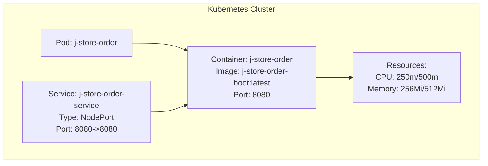
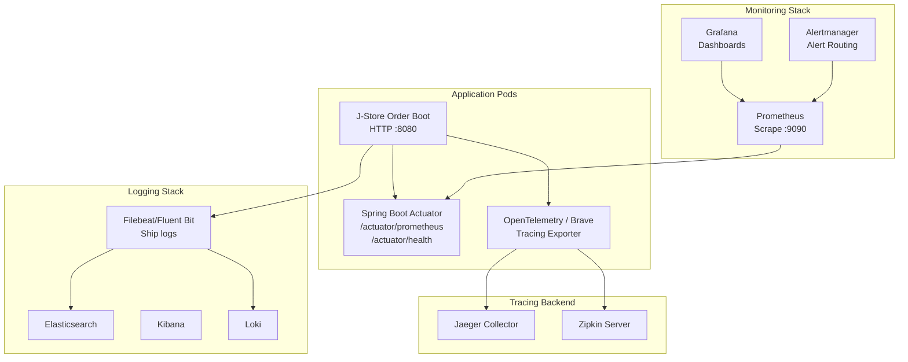
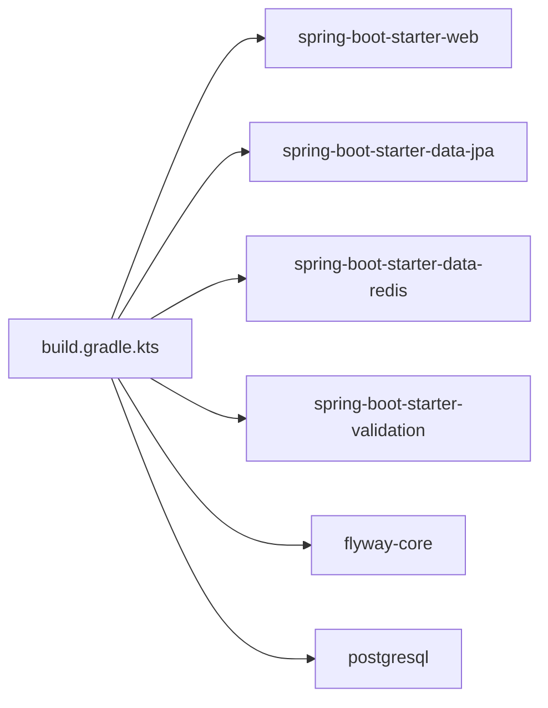
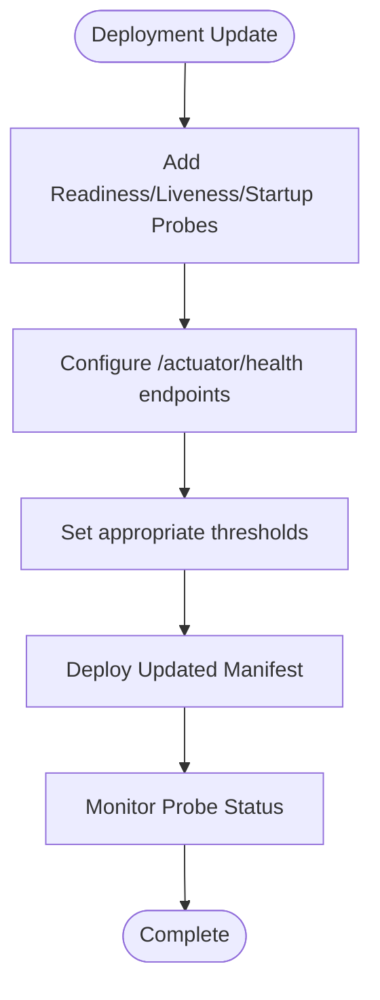

# Monitoring & Logging

<cite>
**Referenced Files in This Document**
- [k8s-deployment.yaml](file://j-store-boot/k8s-deployment.yaml)
- [k8s-service.yaml](file://j-store-boot/k8s-service.yaml)
- [Dockerfile](file://j-store-boot/Dockerfile)
- [application.properties](file://j-store-boot/src/main/resources/application.properties)
- [JStoreOrderBootApplication.kt](file://j-store-boot/src/main/kotlin/JStoreOrderBootApplication.kt)
- [build.gradle.kts](file://j-store-boot/build.gradle.kts)
</cite>

## Table of Contents
1. Introduction
2. Project Structure
3. Core Components
4. Architecture Overview
5. Detailed Component Analysis
6. Dependency Analysis
7. Performance Considerations
8. Troubleshooting Guide
9. Conclusion
10. Appendices

## Introduction
This document provides comprehensive guidance for monitoring and logging the J-Store platform in Kubernetes environments. It covers:
- Prometheus integration for metrics collection
- Grafana dashboards for visualization
- Alerting rules configuration
- Log aggregation using ELK or Loki
- Structured logging formats and retention policies
- Health check endpoints, readiness/liveness probes
- Application-level metrics exposure
- Distributed tracing with Jaeger or Zipkin
- Performance monitoring and capacity planning
- Custom metrics, alerting examples, and troubleshooting workflows

The content is grounded in the existing J-Store Boot application and its Kubernetes manifests, while providing actionable recommendations to implement a production-grade observability stack.

## Project Structure
At runtime, J-Store Order Boot exposes an HTTP service on port 8080 within a container image built from the provided Dockerfile. The Kubernetes Deployment and Service define resource requests/limits and expose the service via NodePort.

**Diagram sources**
- [k8s-deployment.yaml:1-31](file://j-store-boot/k8s-deployment.yaml#L1-L31)
- [k8s-service.yaml:1-13](file://j-store-boot/k8s-service.yaml#L1-L13)
- [Dockerfile:1-6](file://j-store-boot/Dockerfile#L1-L6)

**Section sources**
- [k8s-deployment.yaml:1-31](file://j-store-boot/k8s-deployment.yaml#L1-L31)
- [k8s-service.yaml:1-13](file://j-store-boot/k8s-service.yaml#L1-L13)
- [Dockerfile:1-6](file://j-store-boot/Dockerfile#L1-L6)

## Core Components
- Application entrypoint: Spring Boot application class enabling JPA auditing, scheduling, and configuration properties.
- Runtime configuration: Application name, graceful shutdown, active profile, Flyway migration settings.
- Build dependencies: Web, JPA, Redis, validation, webflux, Flyway, PostgreSQL driver, test utilities.
- Kubernetes deployment: Resource limits/requests, container port, image selection.
- Kubernetes service: Selector-based routing and NodePort exposure.

Key implementation references:
- Application bootstrap and annotations
- Application configuration (name, profiles, graceful shutdown, Flyway)
- Dependencies for web, data, and persistence
- Kubernetes manifest definitions

**Section sources**
- [JStoreOrderBootApplication.kt:1-20](file://j-store-boot/src/main/kotlin/JStoreOrderBootApplication.kt#L1-L20)
- [application.properties:1-11](file://j-store-boot/src/main/resources/application.properties#L1-L11)
- [build.gradle.kts:1-96](file://j-store-boot/build.gradle.kts#L1-L96)
- [k8s-deployment.yaml:1-31](file://j-store-boot/k8s-deployment.yaml#L1-L31)
- [k8s-service.yaml:1-13](file://j-store-boot/k8s-service.yaml#L1-L13)

## Architecture Overview
The recommended observability architecture integrates Prometheus scraping, centralized log aggregation, distributed tracing, and alerting through Grafana and Alertmanager.

[No sources needed since this diagram shows conceptual workflow, not actual code structure]

## Detailed Component Analysis

### Metrics Collection with Prometheus
- Expose metrics endpoint: Enable Spring Boot Actuator and Micrometer Prometheus registry to publish /actuator/prometheus.
- Scrape configuration: Configure Prometheus to scrape the application’s /actuator/prometheus endpoint at a suitable interval.
- JVM and framework metrics: Ensure Micrometer captures JVM, Tomcat, Hibernate, and Spring MVC metrics by including required starters.
- Custom business metrics: Add counters, gauges, timers, and histograms around key operations (e.g., order creation, payment processing).

Implementation notes:
- Add Actuator and Micrometer dependencies in build configuration.
- Expose actuator endpoints and set security appropriately.
- Define custom meters in application services/controllers.

**Section sources**
- [build.gradle.kts:1-96](file://j-store-boot/build.gradle.kts#L1-L96)
- [application.properties:1-11](file://j-store-boot/src/main/resources/application.properties#L1-L11)

### Visualization with Grafana
- Create dashboards for:
  - JVM memory, CPU, GC activity
  - HTTP request rates, latency percentiles, error rates
  - Database connection pool utilization and query latency
  - Business KPIs (orders per minute, payment success rate)
- Use standard Grafana libraries for JVM and Spring Boot dashboards.
- Apply consistent labels (service, environment, instance) for multi-service queries.

[No sources needed since this section provides general guidance]

### Alerting Rules Configuration
- Base alerts:
  - High error rate (>5% over 5 minutes)
  - Latency SLO breaches (p95 > threshold)
  - JVM heap usage >80% sustained
  - Database connection pool saturation
- Business alerts:
  - Order failure spikes
  - Payment gateway timeouts
  - Outbox backlog growth
- Route alerts via Alertmanager to Slack, PagerDuty, or email.

[No sources needed since this section provides general guidance]

### Log Aggregation with ELK or Loki
- Centralized logging:
  - ELK: Ship container stdout/stderr via Filebeat to Elasticsearch; visualize in Kibana.
  - Loki: Ingest structured JSON logs with Fluent Bit; query with LogQL.
- Structured logging format:
  - Include fields: timestamp, level, service, trace_id, span_id, user_id, correlation_id, message, context.
  - Avoid large payloads; redact sensitive data.
- Retention policies:
  - Hot/Warm/Cold tiers for Elasticsearch.
  - Loki retention by label selectors and chunk storage lifecycle.

[No sources needed since this section provides general guidance]

### Health Check Endpoints and Probes
- Readiness probe:
  - Endpoint: /actuator/health/readiness
  - Criteria: DB connectivity, dependent services available
- Liveness probe:
  - Endpoint: /actuator/health/liveness
  - Criteria: Application process responsive
- Startup probe:
  - Allow time for initialization before liveness checks begin
- Kubernetes configuration:
  - Add probes to Deployment spec with appropriate initialDelaySeconds, periodSeconds, timeoutSeconds, failureThreshold

[No sources needed since this section provides general guidance]

### Application-Level Metrics Exposure
- HTTP metrics: Request count, latency, status codes
- Business metrics:
  - Counters: orders_created, payments_processed
  - Gauges: pending_orders, inventory_low_count
  - Timers: order_processing_duration
- Tagging strategy:
  - Labels: service, version, region, tenant
  - Avoid high-cardinality labels like raw user IDs

[No sources needed since this section provides general guidance]

### Distributed Tracing with Jaeger or Zipkin
- Instrumentation:
  - OpenTelemetry SDK or Spring Cloud Sleuth/Brave
  - Propagate trace headers across HTTP and async boundaries
- Exporters:
  - Jaeger Collector or Zipkin Server
- Correlation:
  - Inject trace_id into logs for cross-tool correlation
- Sampling:
  - Adjust sampling rates based on environment and load

[No sources needed since this section provides general guidance]

### Performance Monitoring and Capacity Planning
- Key indicators:
  - CPU/memory utilization trends
  - Garbage collection pauses and frequency
  - Thread pool saturation and queue lengths
  - Database slow queries and lock waits
- Capacity planning:
  - Right-size JVM heap and metaspace
  - Tune thread pools and connection pools
  - Scale horizontally based on request volume and latency SLOs

[No sources needed since this section provides general guidance]

### Custom Metrics Examples
- Counter: orders_total{status="success|failure"}
- Gauge: inventory_available{sku_id}
- Timer: payment_processing_seconds{gateway="stripe|paypal"}
- Histogram: request_latency_bucket{endpoint="/api/orders"}

[No sources needed since this section provides general guidance]

### Alerting Rules for Critical Conditions
- Error rate > 5% over 5m → severity=warning
- p95 latency > 2s over 10m → severity=critical
- JVM heap > 80% for 15m → severity=warning
- DB connection pool exhausted → severity=critical
- Outbox lag > 1000 messages → severity=critical

[No sources needed since this section provides general guidance]

### Troubleshooting Workflows Using Monitoring Tools
- Symptom: High latency
  - Check Grafana latency dashboards
  - Inspect traces in Jaeger/Zipkin for slow spans
  - Review database slow query logs
- Symptom: Frequent errors
  - Analyze error rate dashboards
  - Search logs for exceptions and stack traces
  - Validate downstream service health
- Symptom: Memory leaks
  - Monitor heap usage and GC patterns
  - Take heap dumps during incidents
  - Profile with async-profiler or VisualVM

[No sources needed since this section provides general guidance]

## Dependency Analysis
The J-Store Order Boot module depends on Spring Boot starters for web, data, and validation, along with Redis and Flyway. These dependencies enable HTTP endpoints, database access, and configuration management necessary for observability integrations.

**Diagram sources**
- [build.gradle.kts:1-96](file://j-store-boot/build.gradle.kts#L1-L96)

**Section sources**
- [build.gradle.kts:1-96](file://j-store-boot/build.gradle.kts#L1-L96)

## Performance Considerations
- JVM tuning: Set appropriate heap sizes (-Xms, -Xmx), enable GC logging, monitor GC pauses
- Connection pooling: Tune HikariCP parameters for optimal throughput
- Thread pools: Configure task executors and web server threads based on workload
- Caching: Leverage Redis for hot data to reduce database load
- I/O optimization: Enable async processing where applicable, use connection reuse

[No sources needed since this section provides general guidance]

## Troubleshooting Guide
- Verify application health:
  - Check /actuator/health endpoints
  - Confirm readiness and liveness probes are passing
- Investigate metrics:
  - Query Prometheus for error rates and latency
  - Correlate with application logs using trace_id
- Analyze logs:
  - Search for exceptions and warnings
  - Filter by service and environment labels
- Capacity issues:
  - Review resource utilization in Kubernetes events
  - Scale replicas or adjust resource limits

[No sources needed since this section provides general guidance]

## Conclusion
Implementing comprehensive monitoring and logging for J-Store involves exposing metrics via Actuator/Micrometer, aggregating structured logs centrally, instrumenting distributed traces, and configuring proactive alerting. With proper Kubernetes probes and resource management, operators can maintain high availability and performance while quickly diagnosing issues through unified observability tools.

[No sources needed since this section summarizes without analyzing specific files]

## Appendices

### Kubernetes Deployment Enhancements
Add readiness, liveness, and startup probes to ensure reliable health checking and automatic recovery.

[No sources needed since this diagram shows conceptual workflow, not actual code structure]

### Prometheus Scrape Configuration Example
Define scrape targets for all J-Store services with appropriate labels and intervals.

[No sources needed since this section provides general guidance]

### Grafana Dashboard Templates
Import pre-built dashboards for JVM, Spring Boot, and custom business metrics.

[No sources needed since this section provides general guidance]

### Alerting Rule Examples
Define PromQL rules for critical conditions with appropriate severity levels and notification channels.

[No sources needed since this section provides general guidance]