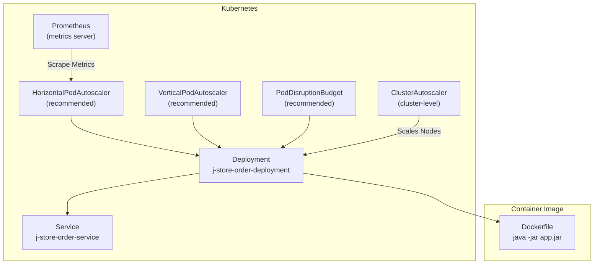
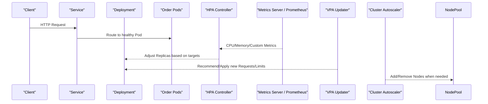
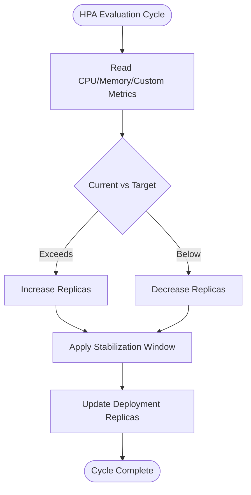
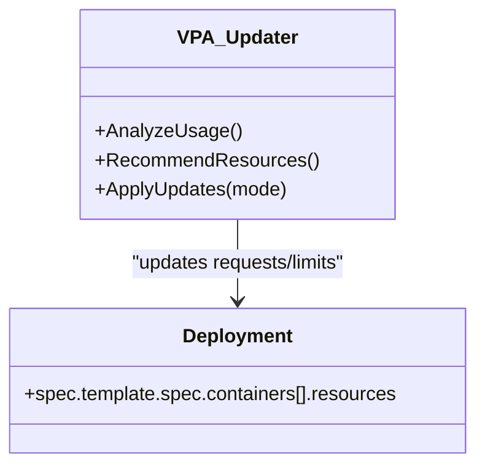
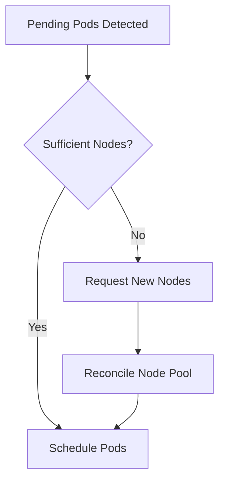
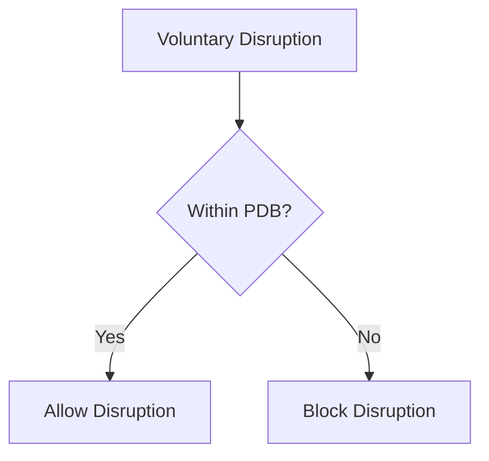
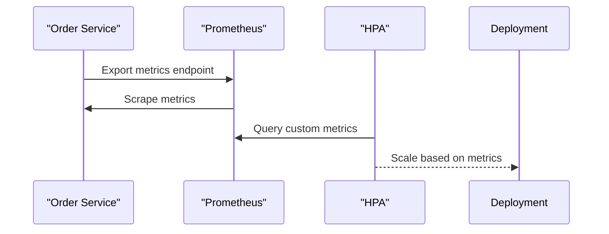
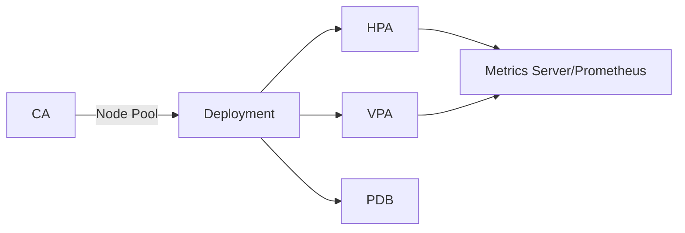

# Scaling & Autoscaling

<cite>
**Referenced Files in This Document**
- [k8s-deployment.yaml](file://j-store-boot/k8s-deployment.yaml)
- [k8s-service.yaml](file://j-store-boot/k8s-service.yaml)
- [Dockerfile](file://j-store-boot/Dockerfile)
- [application.properties](file://j-store-boot/src/main/resources/application.properties)
</cite>

## Table of Contents
1. [Introduction](#introduction)
2. [Project Structure](#project-structure)
3. [Core Components](#core-components)
4. [Architecture Overview](#architecture-overview)
5. [Detailed Component Analysis](#detailed-component-analysis)
6. [Dependency Analysis](#dependency-analysis)
7. [Performance Considerations](#performance-considerations)
8. [Troubleshooting Guide](#troubleshooting-guide)
9. [Conclusion](#conclusion)
10. [Appendices](#appendices)

## Introduction
This document explains how to implement Kubernetes scaling and autoscaling for the J-Store platform, focusing on:
- Horizontal Pod Autoscaler (HPA) using CPU/memory and custom metrics
- Vertical Pod Autoscaler (VPA) for automatic resource adjustment
- Cluster Autoscaler for node pool scaling
- Pod Disruption Budgets (PDB) for high availability
- Scaling policies, cooldown periods, and metric collection with Prometheus
- Monitoring scaling events, troubleshooting issues, and optimizing resource utilization
- Examples of custom metrics for business-specific triggers

The guidance is grounded in the existing J-Store deployment manifests and application configuration.

## Project Structure
J-Store provides a minimal Kubernetes Deployment and Service for the order service, along with a Docker image definition. These are the foundation for enabling HPA, VPA, and related autoscaling features.

**Diagram sources**
- [k8s-deployment.yaml:1-31](file://j-store-boot/k8s-deployment.yaml#L1-L31)
- [k8s-service.yaml:1-13](file://j-store-boot/k8s-service.yaml#L1-L13)
- [Dockerfile:1-6](file://j-store-boot/Dockerfile#L1-L6)

**Section sources**
- [k8s-deployment.yaml:1-31](file://j-store-boot/k8s-deployment.yaml#L1-L31)
- [k8s-service.yaml:1-13](file://j-store-boot/k8s-service.yaml#L1-L13)
- [Dockerfile:1-6](file://j-store-boot/Dockerfile#L1-L6)

## Core Components
- Deployment defines the pod template, container image, ports, and resource requests/limits.
- Service exposes the pods via NodePort for local access.
- Application properties configure Spring Boot behavior and graceful shutdown.

Key observations:
- Resource requests and limits are set on the container, which is required for HPA and VPA to function.
- The service type is NodePort; for production, consider ClusterIP with an Ingress or LoadBalancer.

**Section sources**
- [k8s-deployment.yaml:17-29](file://j-store-boot/k8s-deployment.yaml#L17-L29)
- [k8s-service.yaml:1-13](file://j-store-boot/k8s-service.yaml#L1-L13)
- [application.properties:1-11](file://j-store-boot/src/main/resources/application.properties#L1-L11)

## Architecture Overview
The autoscaling architecture integrates Kubernetes control plane components with Prometheus metrics to drive scaling decisions.

[No sources needed since this diagram shows conceptual workflow, not actual code structure]

## Detailed Component Analysis

### Horizontal Pod Autoscaler (HPA)
- HPA scales the number of replicas based on observed metrics against target thresholds.
- Required inputs:
  - Resource requests/limits defined in the Deployment (already present).
  - Metrics source: Metrics Server for CPU/memory; Prometheus Adapter for custom metrics.

Recommended configuration approach:
- Use CPU utilization target (e.g., 70%) and memory-based targets if applicable.
- For custom metrics (e.g., request rate, queue depth), expose metrics via the application and scrape with Prometheus, then use a custom metrics adapter to feed HPA.

Scaling policy and cooldown:
- Configure stabilization windows to avoid flapping.
- Set min/max replicas to bound scaling.

[No sources needed since this diagram shows conceptual algorithm, not specific code]

### Vertical Pod Autoscaler (VPA)
- VPA adjusts resource requests and limits per pod to optimize scheduling and performance.
- Modes:
  - Off/Initial: Only sets initial values.
  - Recreate: Evicts pods to apply updates.
  - Auto: Applies updates without eviction (requires admission controller).

Best practices:
- Start with recommendations only, monitor usage, then enable update modes cautiously.
- Combine with PDB to ensure availability during evictions.

[No sources needed since this diagram shows conceptual relationships]

### Cluster Autoscaler
- Adds or removes nodes in response to unschedulable pods or underutilized nodes.
- Requires node groups with appropriate labels and taints managed by the cluster provider.

Operational notes:
- Ensure resource headroom for pending pods.
- Tune scale-down delays and balance similar instance types.

[No sources needed since this diagram shows conceptual workflow]

### Pod Disruption Budgets (PDB)
- Protects availability during voluntary disruptions (upgrades, autoscaling).
- Define minimum available pods or maximum unavailable pods.

Guidelines:
- Set PDB aligned with desired availability (e.g., allow at most 1 pod disruption for stateless services).
- Coordinate with rolling updates and VPA evictions.

[No sources needed since this diagram shows conceptual workflow]

### Metric Collection with Prometheus
- Expose application metrics via standard endpoints (e.g., Micrometer/Spring Boot Actuator).
- Scrape with Prometheus; optionally use a custom metrics adapter to expose to HPA.
- For business metrics (e.g., orders per minute), instrument counters and histograms.

[No sources needed since this diagram shows conceptual workflow]

### Application Configuration for Graceful Shutdown
- Graceful shutdown ensures in-flight requests complete before termination, improving reliability during scaling events.

**Section sources**
- [application.properties:2](file://j-store-boot/src/main/resources/application.properties#L2)

## Dependency Analysis
The autoscaling stack depends on:
- Deployment resources (requests/limits) for HPA/VPA.
- Metrics sources (CPU/memory via Metrics Server; custom via Prometheus).
- Cluster Autoscaler integration with cloud/node pools.
- PDB to constrain disruptions.

**Diagram sources**
- [k8s-deployment.yaml:17-29](file://j-store-boot/k8s-deployment.yaml#L17-L29)

**Section sources**
- [k8s-deployment.yaml:17-29](file://j-store-boot/k8s-deployment.yaml#L17-L29)

## Performance Considerations
- Right-size requests/limits to avoid over-provisioning and throttling.
- Use horizontal scaling for stateless workloads; vertical scaling for CPU-bound tasks where feasible.
- Prefer gradual scaling with stabilization windows to reduce oscillation.
- Monitor JVM heap usage and GC pauses; tune container memory limits accordingly.
- Avoid frequent restarts by ensuring readiness/liveness probes are accurate.

[No sources needed since this section provides general guidance]

## Troubleshooting Guide
Common issues and resolutions:
- HPA not scaling:
  - Verify resource requests/limits are set.
  - Confirm Metrics Server is running and scraping.
  - Check HPA status conditions and events.
- VPA not updating:
  - Validate mode settings and admission controller.
  - Review recommendations and update strategy.
- Pods being OOMKilled:
  - Increase memory limits or optimize application memory usage.
- High latency under load:
  - Inspect CPU throttling; adjust requests/limits or scale out.
- Scaling flapping:
  - Increase stabilization windows and tune target thresholds.

Useful commands:
- Describe HPA/VPA/PDB and Deployment to inspect status and events.
- View pod logs and metrics for anomalies.

[No sources needed since this section provides general guidance]

## Conclusion
J-Store’s current Deployment and Service provide the necessary foundation for enabling robust autoscaling. By adding HPA, VPA, Cluster Autoscaler, and PDB, and integrating Prometheus for custom metrics, you can achieve responsive, resilient, and cost-efficient scaling tailored to business needs.

[No sources needed since this section summarizes without analyzing specific files]

## Appendices

### Example Custom Metrics for Business-Specific Scaling
- Orders per minute (counter)
- Payment success rate (histogram)
- Inventory reservation queue length (gauge)
- API error rate (ratio counter)

Instrument these metrics in the application and expose them for Prometheus scraping. Then configure HPA to react to these custom metrics alongside CPU/memory.

[No sources needed since this section provides general guidance]