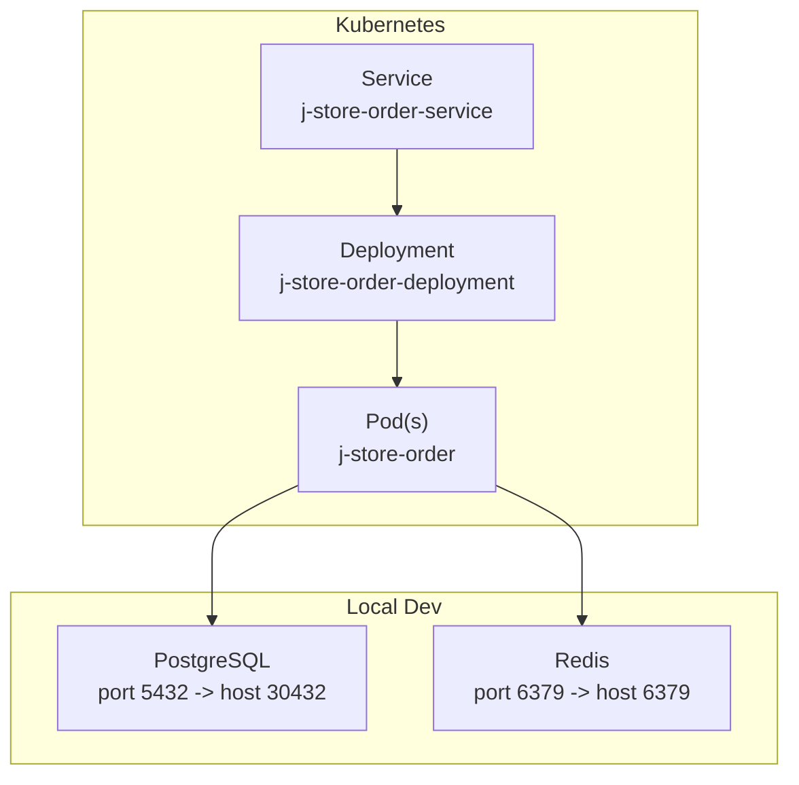
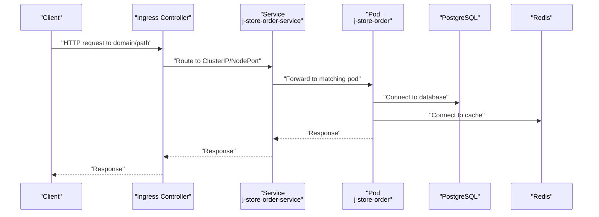
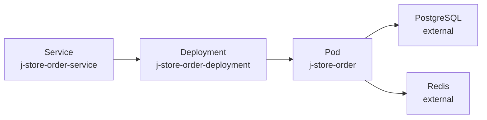

# Service Configuration

<cite>
**Referenced Files in This Document**
- [k8s-deployment.yaml](file://j-store-boot/k8s-deployment.yaml)
- [k8s-service.yaml](file://j-store-boot/k8s-service.yaml)
- [docker-compose.postgres.yml](file://docker-compose.postgres.yml)
</cite>

## Table of Contents
1. [Introduction](#introduction)
2. [Project Structure](#project-structure)
3. [Core Components](#core-components)
4. [Architecture Overview](#architecture-overview)
5. [Detailed Component Analysis](#detailed-component-analysis)
6. [Dependency Analysis](#dependency-analysis)
7. [Performance Considerations](#performance-considerations)
8. [Troubleshooting Guide](#troubleshooting-guide)
9. [Conclusion](#conclusion)
10. [Appendices](#appendices)

## Introduction
This document provides comprehensive guidance for Kubernetes Service configurations in the J-Store platform. It explains how to use different Service types (ClusterIP, NodePort, LoadBalancer), define port mappings and protocols, implement service discovery and DNS resolution, and enable inter-pod communication. It also covers ingress controller setup for external access, TLS termination, routing rules, service mesh integration, traffic splitting, load balancing strategies, headless services for stateful applications, and network policies for security. The content is grounded in the existing J-Store Kubernetes manifests and local development configuration.

## Project Structure
J-Store includes a minimal set of Kubernetes manifests under the boot module for the order service, along with a Docker Compose file for local dependencies (PostgreSQL and Redis). These files demonstrate how to expose an application via a Service and how to run supporting infrastructure locally.

**Diagram sources**
- [k8s-deployment.yaml:1-31](file://j-store-boot/k8s-deployment.yaml#L1-L31)
- [k8s-service.yaml:1-13](file://j-store-boot/k8s-service.yaml#L1-L13)
- [docker-compose.postgres.yml:1-40](file://docker-compose.postgres.yml#L1-L40)

**Section sources**
- [k8s-deployment.yaml:1-31](file://j-store-boot/k8s-deployment.yaml#L1-L31)
- [k8s-service.yaml:1-13](file://j-store-boot/k8s-service.yaml#L1-L13)
- [docker-compose.postgres.yml:1-40](file://docker-compose.postgres.yml#L1-L40)

## Core Components
- Deployment: Defines the application workload (replicas, labels, container image, ports, resource requests/limits).
- Service: Exposes the Deployment’s pods via a stable network endpoint using selectors and port mappings.
- Local Dependencies: PostgreSQL and Redis are exposed via Docker Compose for local development.

Key observations from the current manifests:
- The Service type is NodePort, exposing the app on a node-level port.
- Port mapping uses HTTP (TCP) on port 8080 for both service and target port.
- Labels and selectors align between Deployment and Service to route traffic to the correct pods.

**Section sources**
- [k8s-deployment.yaml:1-31](file://j-store-boot/k8s-deployment.yaml#L1-L31)
- [k8s-service.yaml:1-13](file://j-store-boot/k8s-service.yaml#L1-L13)

## Architecture Overview
The following diagram shows how clients reach the Order service through Kubernetes networking components.

[No sources needed since this diagram shows conceptual workflow, not actual code structure]

## Detailed Component Analysis

### Service Types and Use Cases
- ClusterIP: Default internal-only exposure; ideal for inter-service communication within the cluster.
- NodePort: Exposes the service on each node’s IP at a static port; useful for local development or quick external access.
- LoadBalancer: Provisions an external load balancer (cloud provider dependent); suitable for production external access.

Current J-Store usage:
- The Order service is configured as NodePort for simplicity in development and demo environments.

Recommendations:
- Use ClusterIP for internal services and pair with an Ingress for external access.
- Use LoadBalancer when you need direct external IPs per service.
- Reserve NodePort for local testing or when an Ingress is not available.

**Section sources**
- [k8s-service.yaml:1-13](file://j-store-boot/k8s-service.yaml#L1-L13)

### Port Mappings and Protocols
- Service port: The port exposed by the Service.
- Target port: The port on the pod that receives traffic.
- Protocol: Typically TCP for HTTP; UDP may be used for specific workloads.

Current configuration:
- Service port 8080 maps to target port 8080 over TCP.
- Container exposes port 8080.

Best practices:
- Keep service and target ports aligned unless translation is required.
- Explicitly specify protocol when non-TCP is used.
- Avoid hardcoding ports in client code; rely on DNS names.

**Section sources**
- [k8s-deployment.yaml:18-23](file://j-store-boot/k8s-deployment.yaml#L18-L23)
- [k8s-service.yaml:8-11](file://j-store-boot/k8s-service.yaml#L8-L11)

### Service Discovery and DNS Resolution
- Services provide stable DNS names within the cluster (e.g., <service-name>.<namespace>.svc.cluster.local).
- Pods discover other services via DNS; selectors ensure traffic reaches healthy endpoints.
- For cross-namespace access, fully qualified DNS names should be used.

Operational tips:
- Validate connectivity using kubectl exec into a pod and curling the service DNS name.
- Ensure label selectors match Deployment labels precisely.

**Section sources**
- [k8s-service.yaml:6-7](file://j-store-boot/k8s-service.yaml#L6-L7)
- [k8s-deployment.yaml:14-16](file://j-store-boot/k8s-deployment.yaml#L14-L16)

### Inter-Pod Communication Patterns
- Internal calls should use ClusterIP services and DNS names.
- Avoid relying on pod IPs directly; they are ephemeral.
- Use readiness probes to ensure only ready pods receive traffic.

Example flow:
- A client pod resolves the service DNS name and connects to the service port, which routes to one of the healthy pods.

[No sources needed since this section doesn't analyze specific files]

### Ingress Controller Setup for External Access
- Deploy an Ingress controller (e.g., NGINX, Traefik, AWS ALB).
- Create an Ingress resource to route external HTTP(S) traffic to internal ClusterIP services.
- Configure path-based or host-based routing rules.

TLS termination:
- Terminate TLS at the Ingress controller using Secrets containing certificates.
- Redirect HTTP to HTTPS where appropriate.

Routing rules:
- Define paths and hosts to route to specific services.
- Use annotations for advanced features like rate limiting or custom headers.

[No sources needed since this section doesn't analyze specific files]

### Service Mesh Integration, Traffic Splitting, and Load Balancing
- Integrate a service mesh (e.g., Istio, Linkerd) to manage mTLS, retries, timeouts, and observability.
- Implement traffic splitting via VirtualService/WeightedRoute rules for canary deployments.
- Configure load balancing strategies (round-robin, least connections) at the mesh level.

[No sources needed since this section doesn't analyze specific files]

### Headless Services for Stateful Applications
- Use a headless Service (clusterIP: None) to allow direct pod discovery for stateful workloads.
- Combine with StatefulSet to maintain stable network identities and storage bindings.
- Clients connect directly to individual pod endpoints discovered via DNS.

[No sources needed since this section doesn't analyze specific files]

### Network Policies for Security
- Define NetworkPolicy resources to restrict inbound/outbound traffic to/from pods.
- Allow only necessary ports and source/destination CIDRs or namespaces.
- Enforce zero-trust networking by default-deny policies and explicit allow rules.

[No sources needed since this section doesn't analyze specific files]

## Dependency Analysis
The current manifests show a straightforward dependency chain: Service selects pods via labels, and pods depend on external services (PostgreSQL, Redis) during runtime.

**Diagram sources**
- [k8s-service.yaml:1-13](file://j-store-boot/k8s-service.yaml#L1-L13)
- [k8s-deployment.yaml:1-31](file://j-store-boot/k8s-deployment.yaml#L1-L31)
- [docker-compose.postgres.yml:1-40](file://docker-compose.postgres.yml#L1-L40)

**Section sources**
- [k8s-service.yaml:1-13](file://j-store-boot/k8s-service.yaml#L1-L13)
- [k8s-deployment.yaml:1-31](file://j-store-boot/k8s-deployment.yaml#L1-L31)
- [docker-compose.postgres.yml:1-40](file://docker-compose.postgres.yml#L1-L40)

## Performance Considerations
- Set appropriate resource requests and limits to avoid throttling and ensure fair scheduling.
- Use Horizontal Pod Autoscaler (HPA) to scale based on CPU/memory or custom metrics.
- Enable connection pooling for databases and caches to reduce overhead.
- Prefer ClusterIP services behind an Ingress for efficient load distribution and caching.

[No sources needed since this section provides general guidance]

## Troubleshooting Guide
Common issues and resolutions:
- Service not reachable: Verify selector labels match Deployment labels; check Service type and ports.
- DNS resolution failures: Confirm namespace correctness and service naming; test with nslookup inside a pod.
- TLS errors: Ensure certificate secrets exist and are correctly referenced in Ingress resources.
- Connectivity to dependencies: Validate environment variables and network policies for PostgreSQL and Redis.

Diagnostic commands:
- Inspect endpoints: kubectl get endpoints <service-name>
- Check logs: kubectl logs -l app=<app-label>
- Test connectivity: kubectl exec -it <pod> -- curl http://<service-name>:<port>

**Section sources**
- [k8s-service.yaml:6-11](file://j-store-boot/k8s-service.yaml#L6-L11)
- [k8s-deployment.yaml:14-23](file://j-store-boot/k8s-deployment.yaml#L14-L23)

## Conclusion
J-Store’s current Kubernetes configuration demonstrates a simple NodePort Service for the Order service, suitable for development and demos. For production, adopt ClusterIP services with an Ingress controller, enforce TLS termination, and consider service mesh capabilities for advanced traffic management. Implement headless services for stateful workloads and secure communications with NetworkPolicies. Proper port mapping, DNS-based discovery, and robust troubleshooting practices will ensure reliable inter-pod communication and external access.

[No sources needed since this section summarizes without analyzing specific files]

## Appendices

### Appendix A: Example Scenarios and Recommendations
- Internal API: Use ClusterIP + DNS; no external exposure.
- Public Web App: Use Ingress + TLS; route to ClusterIP services.
- Stateful Apps: Use StatefulSet + headless Service for direct pod endpoints.
- Secure Networking: Apply default-deny NetworkPolicies and explicit allow rules.

[No sources needed since this section doesn't analyze specific files]