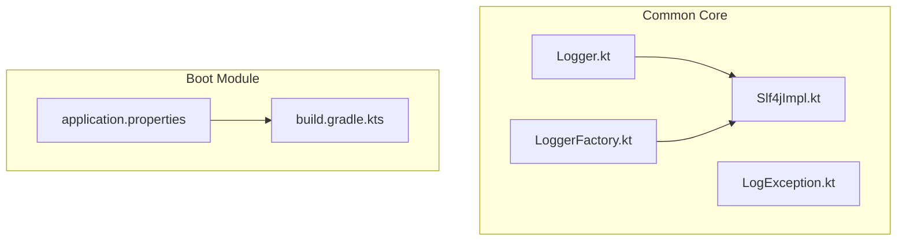
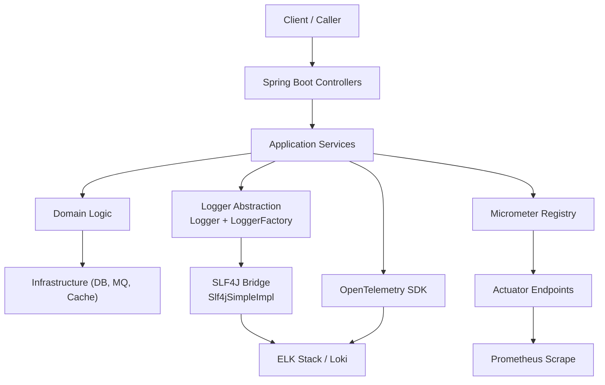
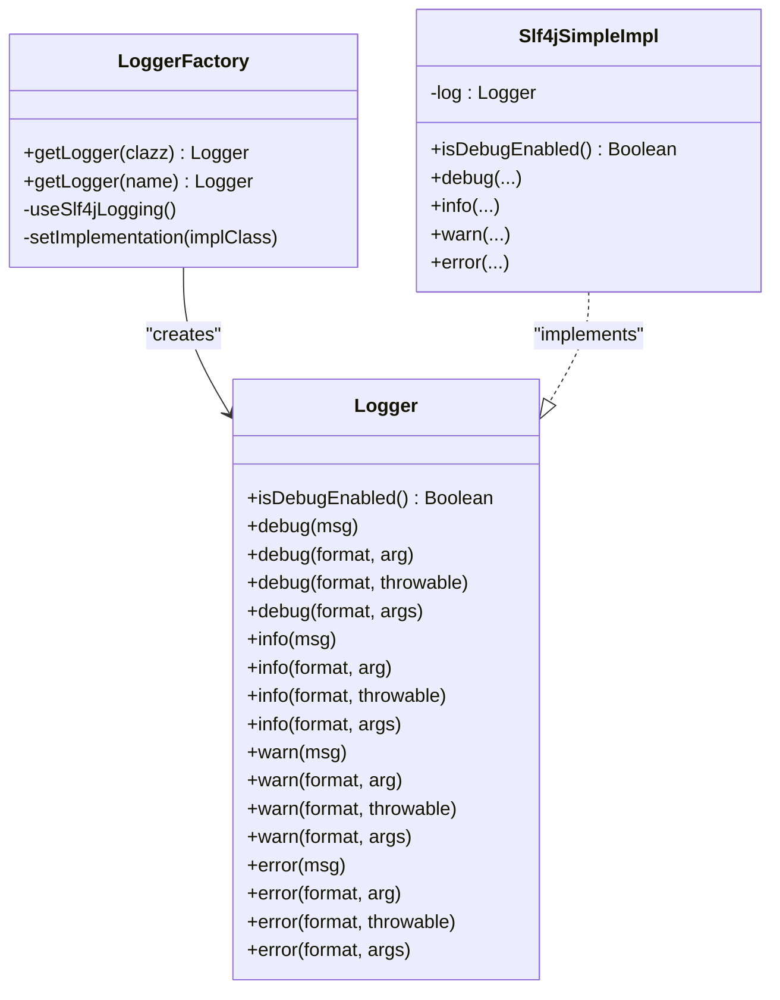
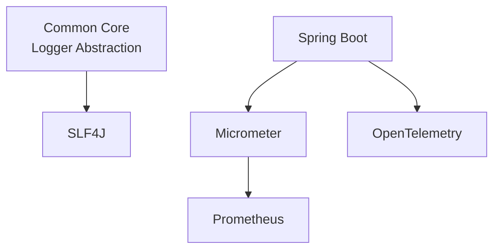

# Monitoring & Observability

<cite>
**Referenced Files in This Document**
- [Logger.kt](file://j-store-common-core/src/main/kotlin/com/jstore/common/logging/Logger.kt)
- [LoggerFactory.kt](file://j-store-common-core/src/main/kotlin/com/jstore/common/logging/LoggerFactory.kt)
- [Slf4jImpl.kt](file://j-store-common-core/src/main/kotlin/com/jstore/common/logging/slf4j/Slf4jImpl.kt)
- [LogException.kt](file://j-store-common-core/src/main/kotlin/com/jstore/common/logging/LogException.kt)
- [application.properties](file://j-store-boot/src/main/resources/application.properties)
- [build.gradle.kts](file://build.gradle.kts)
</cite>

## Table of Contents
1. [Introduction](#introduction)
2. [Project Structure](#project-structure)
3. [Core Components](#core-components)
4. [Architecture Overview](#architecture-overview)
5. [Detailed Component Analysis](#detailed-component-analysis)
6. [Dependency Analysis](#dependency-analysis)
7. [Performance Considerations](#performance-considerations)
8. [Troubleshooting Guide](#troubleshooting-guide)
9. [Conclusion](#conclusion)
10. [Appendices](#appendices)

## Introduction
This document defines the monitoring and observability strategy for the J-Store platform, focusing on:
- Structured logging with correlation IDs and contextual information
- Metrics collection using Micrometer and Prometheus integration
- Distributed tracing with OpenTelemetry across microservices
- Health checks, readiness probes, and liveness probes configuration
- Centralized log aggregation (ELK/Loki)
- Alerting for critical system events and business anomalies
- Dashboard creation guidelines for KPIs and operational metrics
- Troubleshooting workflows and incident response procedures based on observability data

The codebase includes a unified logging abstraction backed by SLF4J, which is the foundation for structured logs and correlation ID propagation. Metrics, tracing, and health endpoints are not yet implemented in the current sources; this document provides implementation guidance aligned with the existing logging architecture and Spring Boot conventions.

## Project Structure
Observability-related components currently reside in the common core module under a dedicated logging package. The boot module exposes application properties and serves as the entry point for runtime configuration.

**Diagram sources**
- [Logger.kt](file://j-store-common-core/src/main/kotlin/com/jstore/common/logging/Logger.kt)
- [LoggerFactory.kt](file://j-store-common-core/src/main/kotlin/com/jstore/common/logging/LoggerFactory.kt)
- [Slf4jImpl.kt](file://j-store-common-core/src/main/kotlin/com/jstore/common/logging/slf4j/Slf4jImpl.kt)
- [LogException.kt](file://j-store-common-core/src/main/kotlin/com/jstore/common/logging/LogException.kt)
- [application.properties](file://j-store-boot/src/main/resources/application.properties)
- [build.gradle.kts](file://build.gradle.kts)

**Section sources**
- [Logger.kt](file://j-store-common-core/src/main/kotlin/com/jstore/common/logging/Logger.kt)
- [LoggerFactory.kt](file://j-store-common-core/src/main/kotlin/com/jstore/common/logging/LoggerFactory.kt)
- [Slf4jImpl.kt](file://j-store-common-core/src/main/kotlin/com/jstore/common/logging/slf4j/Slf4jImpl.kt)
- [LogException.kt](file://j-store-common-core/src/main/kotlin/com/jstore/common/logging/LogException.kt)
- [application.properties](file://j-store-boot/src/main/resources/application.properties)
- [build.gradle.kts](file://build.gradle.kts)

## Core Components
- Logging Abstraction: A minimal Logger interface standardizes log levels and formatting across modules.
- Factory: LoggerFactory initializes the concrete logger implementation via reflection and provides a consistent API to obtain logger instances.
- SLF4J Adapter: Slf4jSimpleImpl bridges the custom Logger to SLF4J, supporting both regular and location-aware logging backends.
- Error Handling: LogException encapsulates logging initialization failures.

These components form the backbone for structured logging and will be extended to support correlation IDs and context enrichment.

**Section sources**
- [Logger.kt](file://j-store-common-core/src/main/kotlin/com/jstore/common/logging/Logger.kt)
- [LoggerFactory.kt](file://j-store-common-core/src/main/kotlin/com/jstore/common/logging/LoggerFactory.kt)
- [Slf4jImpl.kt](file://j-store-common-core/src/main/kotlin/com/jstore/common/logging/slf4j/Slf4jImpl.kt)
- [LogException.kt](file://j-store-common-core/src/main/kotlin/com/jstore/common/logging/LogException.kt)

## Architecture Overview
The observability architecture integrates three pillars:
- Logs: Structured JSON logs emitted through the Logger abstraction, enriched with correlation IDs and contextual fields.
- Metrics: Micrometer counters, gauges, timers, and histograms exposed via Spring Boot Actuator and scraped by Prometheus.
- Traces: OpenTelemetry SDK instrumentation capturing spans across HTTP, database, and messaging layers.

[No sources needed since this diagram shows conceptual workflow, not actual code structure]

## Detailed Component Analysis

### Logging Strategy
- Structured Logging: Use JSON format with consistent fields such as timestamp, level, service name, correlationId, userId, tenantId, requestId, and message.
- Correlation IDs: Propagate correlationId across threads and async boundaries; inject into MDC or use OpenTelemetry context for cross-cutting concerns.
- Contextual Information: Enrich logs with domain-relevant identifiers (order id, payment id, merchant id) and environment metadata (instance id, region).
- Implementation Guidance: Extend Slf4jSimpleImpl to wrap SLF4J calls with structured JSON builders and propagate correlationId from request context.

**Diagram sources**
- [Logger.kt](file://j-store-common-core/src/main/kotlin/com/jstore/common/logging/Logger.kt)
- [LoggerFactory.kt](file://j-store-common-core/src/main/kotlin/com/jstore/common/logging/LoggerFactory.kt)
- [Slf4jImpl.kt](file://j-store-common-core/src/main/kotlin/com/jstore/common/logging/slf4j/Slf4jImpl.kt)

**Section sources**
- [Logger.kt](file://j-store-common-core/src/main/kotlin/com/jstore/common/logging/Logger.kt)
- [LoggerFactory.kt](file://j-store-common-core/src/main/kotlin/com/jstore/common/logging/LoggerFactory.kt)
- [Slf4jImpl.kt](file://j-store-common-core/src/main/kotlin/com/jstore/common/logging/slf4j/Slf4jImpl.kt)

### Metrics Collection (Micrometer + Prometheus)
- Instrumentation Points:
  - HTTP requests: count, latency, error rates per endpoint
  - Business KPIs: order creation rate, payment success rate, fulfillment throughput
  - Resource usage: JVM memory, GC pauses, thread pool utilization
  - Database: query latency, connection pool stats
- Exposure:
  - Enable Spring Boot Actuator /actuator/prometheus
  - Configure Micrometer registry (Prometheus) and expose metrics endpoints
- Best Practices:
  - Use appropriate metric types (counters, gauges, timers, histograms)
  - Tag consistently with service, method, status, and domain entities
  - Avoid high-cardinality tags (e.g., user ids)

[No sources needed since this section provides general guidance]

### Distributed Tracing (OpenTelemetry)
- Span Creation:
  - HTTP inbound/outbound spans with correlationId propagated via headers
  - DB spans with SQL statements sanitized
  - Messaging spans for outbox/event publishing/consuming
- Context Propagation:
  - Ensure correlationId flows across async tasks and message consumers
- Exporters:
  - OTLP exporter to centralized tracing backend (e.g., Jaeger, Tempo)
- Integration:
  - Add OpenTelemetry autoconfiguration for Spring Boot, Web MVC, JDBC, and messaging clients

[No sources needed since this section provides general guidance]

### Health Checks, Readiness, and Liveness Probes
- Health Endpoints:
  - Implement /health for overall service health
  - Implement /ready for dependency readiness (DB, cache, MQ)
  - Implement /live for process liveness
- Kubernetes Probes:
  - Map readinessProbe to /ready
  - Map livenessProbe to /live
- Configuration:
  - Use Spring Boot Actuator health indicators
  - Customize health checks for external dependencies

[No sources needed since this section provides general guidance]

### Log Aggregation (ELK/Loki)
- Output Format:
  - JSON logs with standardized fields
- Ingestion:
  - Filebeat/Fluent Bit shipping logs to Elasticsearch/Loki
  - Index patterns for service names and environments
- Querying:
  - Build queries filtering by correlationId, service, and time range
- Retention:
  - Define retention policies per environment and compliance requirements

[No sources needed since this section provides general guidance]

### Alerting Configuration
- Critical System Events:
  - High error rates, latency spikes, resource exhaustion
  - Database connection pool saturation, deadlocks
- Business Anomalies:
  - Payment failure rate thresholds, order creation drops
  - Inventory stockouts, after-sale approval delays
- Tools:
  - Prometheus alert rules with thresholds and severity
  - PagerDuty/OpsGenie integration for on-call escalation

[No sources needed since this section provides general guidance]

### Dashboard Creation Guidelines
- Operational Dashboards:
  - Request rate, error rate, latency percentiles
  - Dependency health (DB, cache, MQ)
- Business Dashboards:
  - Order lifecycle metrics, payment success rate
  - Fulfillment throughput, after-sale processing times
- KPIs:
  - SLOs for availability, latency, and accuracy
  - Trend analysis for capacity planning

[No sources needed since this section provides general guidance]

## Dependency Analysis
Current observability dependencies are limited to logging via SLF4J. Metrics, tracing, and health endpoints require additional dependencies and configuration.

**Diagram sources**
- [build.gradle.kts](file://build.gradle.kts)
- [application.properties](file://j-store-boot/src/main/resources/application.properties)

**Section sources**
- [build.gradle.kts](file://build.gradle.kts)
- [application.properties](file://j-store-boot/src/main/resources/application.properties)

## Performance Considerations
- Logging Overhead:
  - Use asynchronous loggers and batched writes
  - Avoid excessive debug logging in production
- Metrics Impact:
  - Limit cardinality of tags
  - Use sampling for high-volume metrics
- Tracing Cost:
  - Sample traces selectively (e.g., 1% default, higher for errors)
  - Avoid capturing sensitive data in spans

[No sources needed since this section provides general guidance]

## Troubleshooting Guide
- Logging Issues:
  - Verify Logger initialization via LoggerFactory
  - Check SLF4J binding and log output format
- Metrics Gaps:
  - Confirm Actuator endpoints are enabled and accessible
  - Validate Prometheus scraping configuration
- Trace Breaks:
  - Ensure correlationId propagation across async boundaries
  - Check span naming consistency and tagging
- Health Check Failures:
  - Inspect dependency health indicators
  - Review startup sequence and readiness conditions

**Section sources**
- [LogException.kt](file://j-store-common-core/src/main/kotlin/com/jstore/common/logging/LogException.kt)
- [application.properties](file://j-store-boot/src/main/resources/application.properties)

## Conclusion
The J-Store platform has a solid foundation for structured logging through its Logger abstraction and SLF4J integration. To achieve comprehensive observability, implement Micrometer-based metrics, OpenTelemetry distributed tracing, and robust health check endpoints. Centralize logs with ELK/Loki, configure alerting for critical events, and build dashboards for operational and business KPIs. This approach ensures reliable monitoring, efficient troubleshooting, and proactive incident response.

[No sources needed since this section summarizes without analyzing specific files]

## Appendices
- Configuration Examples:
  - Application properties for Actuator, Micrometer, and OpenTelemetry
- Deployment Notes:
  - Kubernetes probe definitions and resource limits
- Security Considerations:
  - Mask sensitive data in logs and traces
  - Secure metrics and tracing endpoints

[No sources needed since this section provides general guidance]