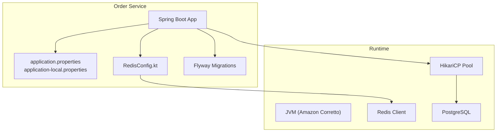
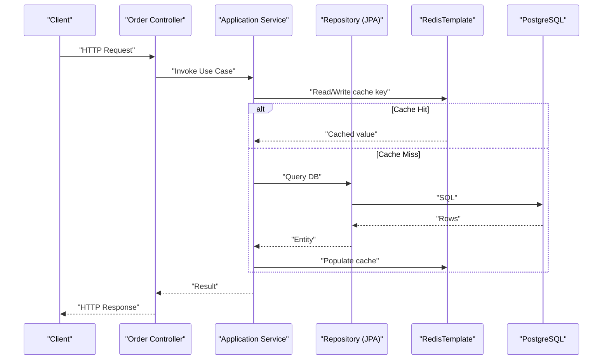
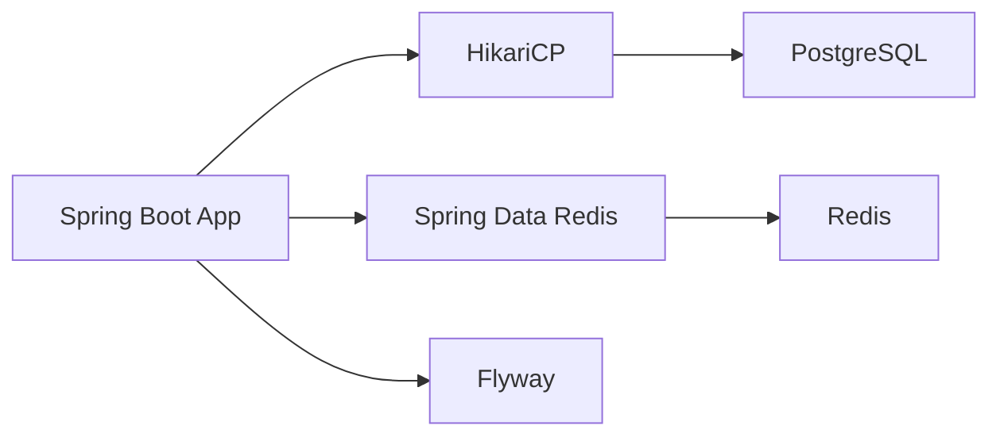

# Performance Tuning & Optimization

<cite>
**Referenced Files in This Document**
- [application.properties](file://j-store-boot/src/main/resources/application.properties)
- [application-local.properties](file://j-store-boot/src/main/resources/application-local.properties)
- [RedisConfig.kt](file://j-store-order-boot/src/main/kotlin/com/jstore/order/config/RedisConfig.kt)
- [Dockerfile](file://j-store-boot/Dockerfile)
- [gradle.properties](file://gradle.properties)
- [V20260731__order_status_dimensions.sql](file://j-store-boot/src/main/resources/db/migration/V20260731__order_status_dimensions.sql)
- [V20260803__order_after_sale_aggregate.sql](file://j-store-boot/src/main/resources/db/migration/V20260803__order_after_sale_aggregate.sql)
</cite>

## Table of Contents
1. [Introduction](#introduction)
2. [Project Structure](#project-structure)
3. [Core Components](#core-components)
4. [Architecture Overview](#architecture-overview)
5. [Detailed Component Analysis](#detailed-component-analysis)
6. [Dependency Analysis](#dependency-analysis)
7. [Performance Considerations](#performance-considerations)
8. [Troubleshooting Guide](#troubleshooting-guide)
9. [Conclusion](#conclusion)
10. [Appendices](#appendices)

## Introduction
This document provides comprehensive performance tuning guidance for the J-Store platform, focusing on JVM configuration, garbage collector selection, memory profiling, application-level caching with Redis, database query optimization and connection pooling, load testing and benchmarking, capacity planning, APM-based profiling, thread dump analysis, memory leak detection, scalability patterns, monitoring dashboards, KPIs, alerting thresholds, and troubleshooting procedures. It is grounded in the current codebase configurations and infrastructure to ensure actionable recommendations.

## Project Structure
J-Store is a modular Spring Boot application with multiple domain services (Order, Goods, Payment, Fulfillment, Accounting, User). The Order service boot module contains runtime configuration for HTTP server, Flyway migrations, HikariCP connection pool, and Redis client setup. Docker packaging uses Amazon Corretto JDK. Gradle properties define JVM args for the build process. Database schema includes status dimensions and after-sale aggregates with indexes supporting common queries.

**Diagram sources**
- [application.properties:1-11](file://j-store-boot/src/main/resources/application.properties#L1-L11)
- [application-local.properties:1-45](file://j-store-boot/src/main/resources/application-local.properties#L1-L45)
- [RedisConfig.kt:1-30](file://j-store-order-boot/src/main/kotlin/com/jstore/order/config/RedisConfig.kt#L1-L30)
- [Dockerfile:1-6](file://j-store-boot/Dockerfile#L1-L6)

**Section sources**
- [application.properties:1-11](file://j-store-boot/src/main/resources/application.properties#L1-L11)
- [application-local.properties:1-45](file://j-store-boot/src/main/resources/application-local.properties#L1-L45)
- [RedisConfig.kt:1-30](file://j-store-order-boot/src/main/kotlin/com/jstore/order/config/RedisConfig.kt#L1-L30)
- [Dockerfile:1-6](file://j-store-boot/Dockerfile#L1-L6)

## Core Components
- Application bootstrap and shutdown behavior are configured via Spring Boot properties.
- Database connectivity uses HikariCP with explicit pool sizing and auto-commit settings.
- Redis integration is configured through a custom RedisTemplate with string keys and JSON values.
- Database schema includes status dimension columns and after-sale aggregates with targeted indexes.

Key configuration touchpoints:
- Server lifecycle and profiles
- Flyway migration baseline and validation
- HikariCP pool name, auto-commit, maximum-pool-size
- Redis host, port, password, database, timeout
- Logging level and messaging mode

**Section sources**
- [application.properties:1-11](file://j-store-boot/src/main/resources/application.properties#L1-L11)
- [application-local.properties:1-45](file://j-store-boot/src/main/resources/application-local.properties#L1-L45)
- [RedisConfig.kt:1-30](file://j-store-order-boot/src/main/kotlin/com/jstore/order/config/RedisConfig.kt#L1-L30)

## Architecture Overview
The Order service exposes REST endpoints backed by application services that interact with persistence via JPA/Hibernate and optional Redis caching. Outbox and local messaging are enabled for event-driven flows. The runtime container runs on Amazon Corretto with a minimal Docker image.

**Diagram sources**
- [RedisConfig.kt:1-30](file://j-store-order-boot/src/main/kotlin/com/jstore/order/config/RedisConfig.kt#L1-L30)
- [application-local.properties:1-45](file://j-store-boot/src/main/resources/application-local.properties#L1-L45)

## Detailed Component Analysis

### JVM Runtime and Containerization
- Base image: Amazon Corretto 25 on Amazon Linux 2023 headless.
- Temporary directory volume mounted at /tmp.
- Entry point executes the packaged jar directly.

Recommendations:
- Set heap sizes via environment variables or startup scripts: -Xms and -Xmx aligned to container limits.
- Enable GC logs and metrics: -XX:+UseGCLogFileRotation, -XX:GCLogFileSize, -Xlog:gc*:file=...
- Select GC: G1GC is default on modern JDK; consider ZGC for low-latency workloads if applicable.
- Tune Metaspace: -XX:MaxMetaspaceSize based on class loading footprint.
- Enable heap dumps on OOM: -XX:+HeapDumpOnOutOfMemoryError, -XX:HeapDumpPath=/tmp.

**Section sources**
- [Dockerfile:1-6](file://j-store-boot/Dockerfile#L1-L6)

### Build-time JVM Settings
Gradle uses its own JVM arguments for compilation and test execution. Current settings allocate up to 3 GB heap and 768 MB metaspace for the build process.

Recommendations:
- Keep build JVM separate from runtime JVM to avoid confusion.
- For CI, cap workers and memory to match runner capacity.

**Section sources**
- [gradle.properties:1-6](file://gradle.properties#L1-L6)

### Application Properties and Profiles
- Application name and graceful shutdown are set.
- Active profile defaults to local.
- Flyway is enabled with baseline and validation.

Recommendations:
- Create production-specific profiles with tuned datasource, redis, logging, and feature flags.
- Disable Open-in-View in production to prevent long-lived transactions.

**Section sources**
- [application.properties:1-11](file://j-store-boot/src/main/resources/application.properties#L1-L11)

### Connection Pooling (HikariCP)
- Pool name: j-store-order
- Auto-commit disabled
- Maximum pool size: 20

Recommendations:
- Size pool based on CPU cores and DB capacity: start with 2x CPU cores and tune under load.
- Monitor active connections, idle connections, and wait times.
- Adjust minimum-idle and max-lifetime to avoid stale connections.
- Ensure transaction boundaries are tight to reduce connection hold time.

**Section sources**
- [application-local.properties:1-45](file://j-store-boot/src/main/resources/application-local.properties#L1-L45)

### Redis Caching Configuration
- Custom RedisTemplate configured with String serializers for keys and GenericJackson2JsonRedisSerializer for values.
- Redis host, port, password, database, and timeout are configurable via environment variables.

Recommendations:
- Use consistent TTLs per cache region and implement cache stampede protection.
- Monitor Redis latency, memory usage, and eviction policies.
- Consider LRU/LFU policies and maxmemory limits appropriate for workload.
- Validate serialization overhead and consider compact formats if needed.

**Section sources**
- [RedisConfig.kt:1-30](file://j-store-order-boot/src/main/kotlin/com/jstore/order/config/RedisConfig.kt#L1-L30)
- [application-local.properties:1-45](file://j-store-boot/src/main/resources/application-local.properties#L1-L45)

### Database Schema and Indexing
- Status dimensions added to orders table with dedicated indexes per status and creation time.
- After-sale aggregate introduces tables for after_sales, after_sale_items, after_sale_capacities, after_sale_command_receipts, and order_refund_facts with constraints and indexes.

Recommendations:
- Verify index selectivity and coverage for hot queries.
- Use EXPLAIN ANALYZE to validate plan efficiency.
- Partition large tables (e.g., order_refund_facts) by time if growth warrants it.
- Enforce constraints to maintain data integrity and reduce application-side checks.

**Section sources**
- [V20260731__order_status_dimensions.sql:1-33](file://j-store-boot/src/main/resources/db/migration/V20260731__order_status_dimensions.sql#L1-L33)
- [V20260803__order_after_sale_aggregate.sql:1-21](file://j-store-boot/src/main/resources/db/migration/V20260803__order_after_sale_aggregate.sql#L1-L21)

## Dependency Analysis
The Order service depends on:
- Spring Boot web stack
- HikariCP for PostgreSQL connections
- Spring Data Redis for caching
- Flyway for schema management
- Optional Nacos discovery/config (commented out)

**Diagram sources**
- [application-local.properties:1-45](file://j-store-boot/src/main/resources/application-local.properties#L1-L45)
- [RedisConfig.kt:1-30](file://j-store-order-boot/src/main/kotlin/com/jstore/order/config/RedisConfig.kt#L1-L30)

**Section sources**
- [application-local.properties:1-45](file://j-store-boot/src/main/resources/application-local.properties#L1-L45)
- [RedisConfig.kt:1-30](file://j-store-order-boot/src/main/kotlin/com/jstore/order/config/RedisConfig.kt#L1-L30)

## Performance Considerations

### JVM Tuning Parameters
- Heap sizing: Align -Xms/-Xmx to container memory limits minus OS and non-heap overhead.
- GC selection: G1GC by default; evaluate ZGC for ultra-low latency if supported by workload.
- Metaspace: Set MaxMetaspaceSize to prevent frequent resizing.
- GC logging: Enable structured logging for post-mortem analysis.
- Heap dumps: Configure OOM dumps for leak investigation.

### Garbage Collector Selection
- G1GC: Balanced throughput and latency; good default.
- ZGC: Sub-millisecond pauses for large heaps; requires JDK support and may increase CPU usage.
- Shenandoah: Alternative low-GC pause option depending on JDK availability.

### Memory Profiling Techniques
- Use jcmd, jmap, and VisualVM for heap inspection.
- Enable GC logs and analyze with tools like GCViewer or GCEasy.
- Profile allocations with async-profiler or JFR for hotspot identification.

### Application-Level Optimizations
- Caching strategies:
  - Identify read-heavy paths (e.g., product details, user sessions).
  - Implement cache-aside pattern with TTL and invalidation on writes.
  - Guard against thundering herds using distributed locks or request coalescing.
- Database query optimization:
  - Prefer indexed lookups and avoid SELECT *.
  - Batch operations where possible.
  - Use pagination and limit result sets.
- Connection pooling:
  - Right-size HikariCP pool; monitor active/idle/wait metrics.
  - Shorten transaction scopes to release connections promptly.

### Load Testing Methodologies
- Define SLOs: latency percentiles (p50/p95/p99), error rates, throughput.
- Tools: k6, Gatling, or JMeter for realistic traffic simulation.
- Scenarios: peak load, spike tests, endurance tests, chaos injection.
- Baseline and regression: capture metrics before changes and compare.

### Capacity Planning Guidelines
- Estimate CPU, memory, and I/O needs per instance based on benchmarks.
- Plan horizontal scaling triggers (CPU utilization, queue depth, latency).
- Size Redis and PostgreSQL clusters according to data growth and access patterns.
- Account for replication lag and failover overhead.

### APM Profiling and Metrics
- Instrument with Micrometer and expose Prometheus metrics.
- Use APM tools (e.g., New Relic, Dynatrace, Elastic APM) for tracing and profiling.
- Track key metrics: request latency, error rate, DB pool saturation, Redis latency.

### Thread Dump Analysis
- Capture thread dumps during high CPU or latency spikes.
- Look for blocked threads, deadlocks, and excessive contention.
- Correlate with GC pauses and DB lock waits.

### Memory Leak Detection
- Analyze heap dumps for dominant object graphs.
- Check for unclosed resources (connections, streams).
- Validate static collections and caches without eviction.

### Scalability Patterns
- Horizontal scaling: stateless services behind load balancers.
- Data partitioning: sharding by tenant or region; use consistent hashing.
- Event-driven decoupling: outbox pattern and message brokers for resilience.

### Monitoring Dashboards and KPIs
- Dashboard components: JVM heap/GC, thread counts, HTTP latency/error, DB pool stats, Redis latency/memory.
- KPIs: p95/p99 latency, throughput, error budget, saturation.
- Alerting thresholds: GC pause > threshold, DB pool exhaustion, Redis latency spikes, error rate > SLO.

### Troubleshooting Procedures
- Symptom: High latency
  - Check GC logs for long pauses.
  - Inspect DB slow queries and lock waits.
  - Review Redis latency and network errors.
- Symptom: OOM
  - Analyze heap dumps for leaks.
  - Tune heap sizes and metaspace.
  - Reduce in-memory caches or enable eviction.
- Symptom: Connection timeouts
  - Increase Hikari pool size cautiously.
  - Optimize queries and reduce transaction duration.
  - Validate network and firewall rules.

## Troubleshooting Guide
- Use jstack to capture thread dumps and identify bottlenecks.
- Enable detailed logging for critical paths and correlate timestamps.
- Validate Flyway migrations and schema consistency across environments.
- Test Redis connectivity and timeout behavior under load.
- Monitor HikariCP metrics for pool saturation and connection churn.

**Section sources**
- [application-local.properties:1-45](file://j-store-boot/src/main/resources/application-local.properties#L1-L45)
- [RedisConfig.kt:1-30](file://j-store-order-boot/src/main/kotlin/com/jstore/order/config/RedisConfig.kt#L1-L30)

## Conclusion
Performance tuning for J-Store involves aligning JVM settings with container limits, selecting an appropriate GC, enabling robust profiling, optimizing caching and database interactions, and implementing scalable architecture patterns. Continuous monitoring, load testing, and capacity planning ensure sustained performance under growth. The provided configuration anchors offer a solid foundation for iterative tuning and operational excellence.

## Appendices

### Key Configuration Reference
- Server and profiles: application name, graceful shutdown, active profile
- Flyway: enablement, locations, baseline version, validation
- HikariCP: pool name, auto-commit, maximum-pool-size
- Redis: host, port, password, database, timeout
- Messaging: outbox enabled, local mode, merchant ID

**Section sources**
- [application.properties:1-11](file://j-store-boot/src/main/resources/application.properties#L1-L11)
- [application-local.properties:1-45](file://j-store-boot/src/main/resources/application-local.properties#L1-L45)