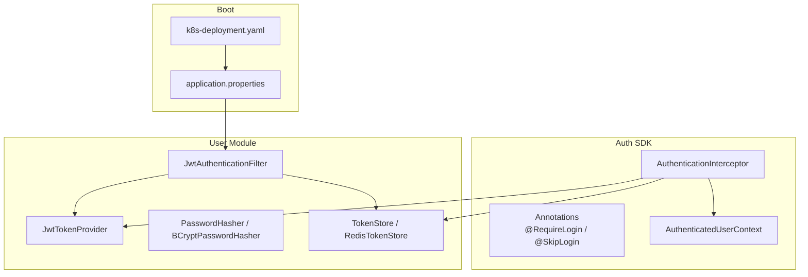
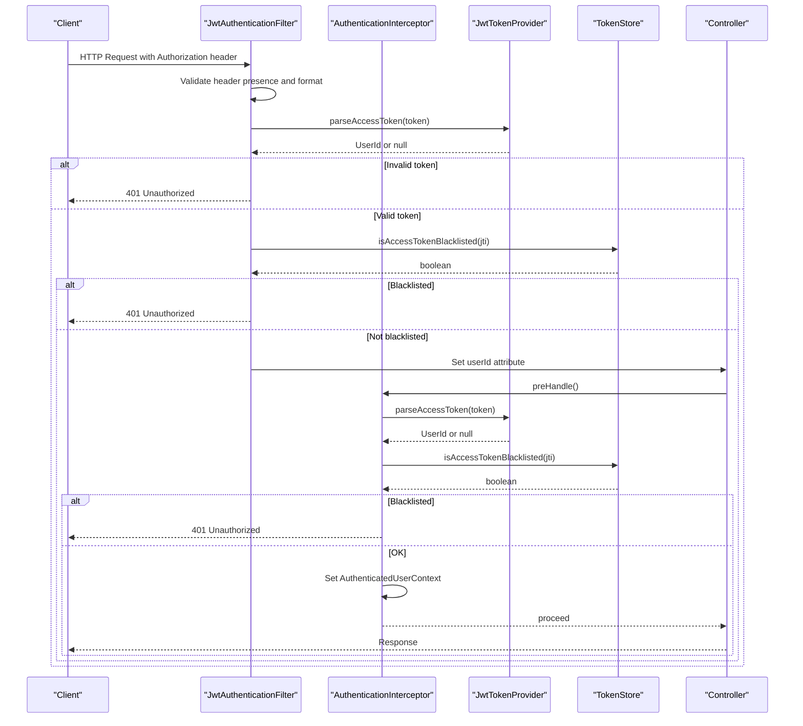
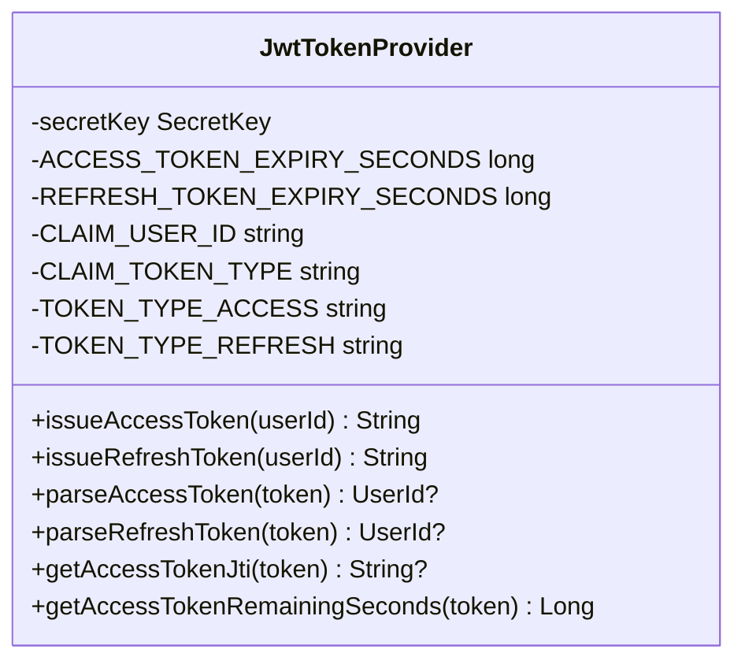
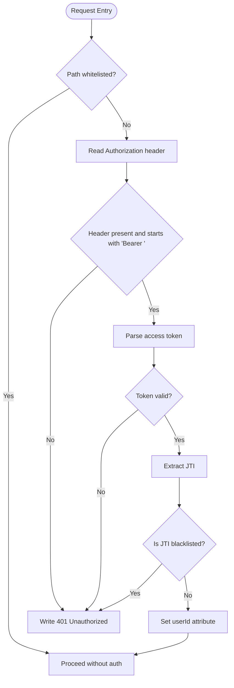
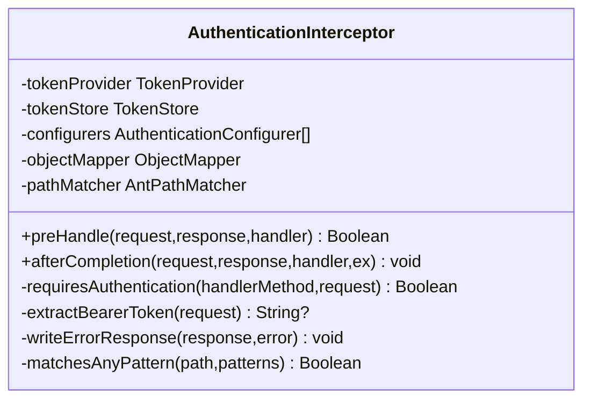
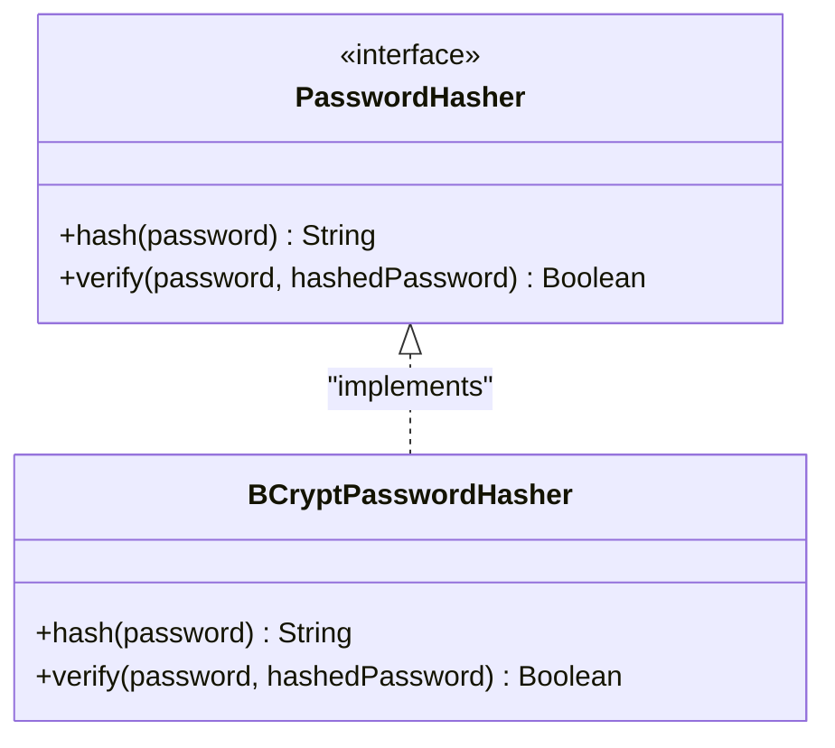
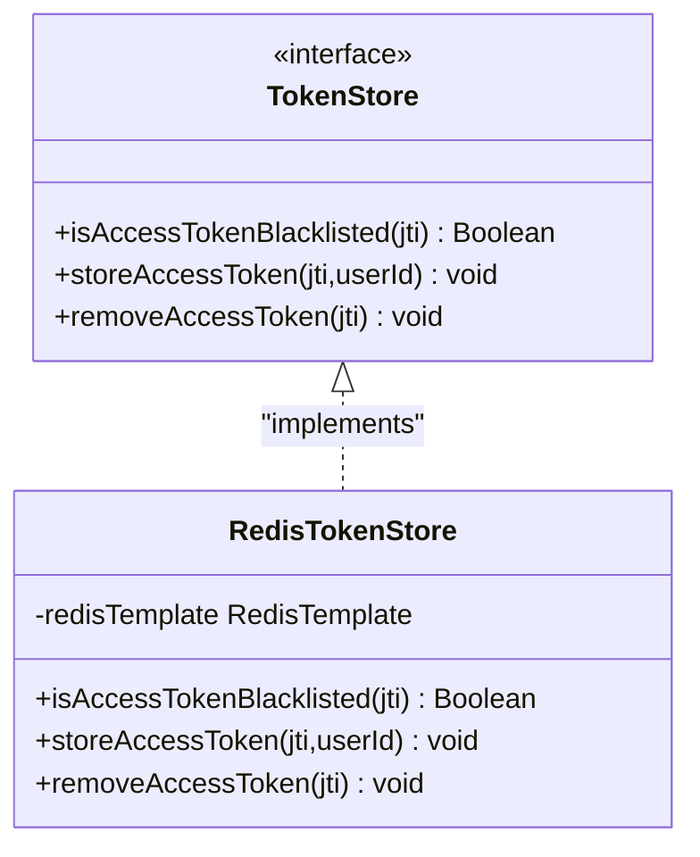
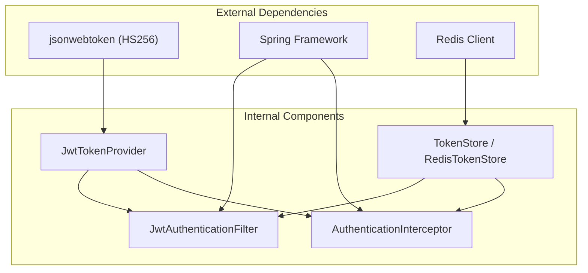

# Security & Compliance

<cite>
**Referenced Files in This Document**
- [SECURITY.md](file://SECURITY.md)
- [JwtTokenProvider.kt](file://j-store-user-infrastructure/src/main/kotlin/com/jstore/user/domain/useraccount/JwtTokenProvider.kt)
- [JwtAuthenticationFilter.kt](file://j-store-user-boot/src/main/kotlin/com/jstore/user/filter/JwtAuthenticationFilter.kt)
- [AuthenticationInterceptor.kt](file://j-store-authentication-spring-sdk/src/main/kotlin/com/jstore/authentication/spring/AuthenticationInterceptor.kt)
- [application.properties](file://j-store-boot/src/main/resources/application.properties)
- [k8s-deployment.yaml](file://j-store-boot/k8s-deployment.yaml)
- [.gitleaksignore](file://.gitleaksignore)
- [dependabot.yml](file://.github/dependabot.yml)
- [qodana.yaml](file://qodana.yaml)
- [requirements-security.txt](file://requirements-security.txt)
- [PasswordHasher.kt](file://j-store-user-domain/src/main/kotlin/com/jstore/user/domain/useraccount/PasswordHasher.kt)
- [BCryptPasswordHasher.kt](file://j-store-user-infrastructure/src/main/kotlin/com/jstore/user/domain/useraccount/BCryptPasswordHasher.kt)
- [TokenStore.kt](file://j-store-user-domain/src/main/kotlin/com/jstore/user/domain/useraccount/TokenStore.kt)
- [RedisTokenStore.kt](file://j-store-user-infrastructure/src/main/kotlin/com/jstore/user/domain/useraccount/RedisTokenStore.kt)
- [AuthenticatedUserContextPropertyTest.kt](file://j-store-authentication-spring-sdk/src/test/kotlin/com/jstore/authentication/context/AuthenticatedUserContextPropertyTest.kt)
- [BearerTokenExtractionPropertyTest.kt](file://j-store-authentication-spring-sdk/src/test/kotlin/com/jstore/authentication/spring/BearerTokenExtractionPropertyTest.kt)
- [AuthenticationDecisionPropertyTest.kt](file://j-store-authentication-spring-sdk/src/test/kotlin/com/jstore/authentication/spring/AuthenticationDecisionPropertyTest.kt)
</cite>

## Table of Contents
1. [Introduction](#introduction)
2. [Project Structure](#project-structure)
3. [Core Components](#core-components)
4. [Architecture Overview](#architecture-overview)
5. [Detailed Component Analysis](#detailed-component-analysis)
6. [Dependency Analysis](#dependency-analysis)
7. [Performance Considerations](#performance-considerations)
8. [Troubleshooting Guide](#troubleshooting-guide)
9. [Conclusion](#conclusion)
10. [Appendices](#appendices)

## Introduction
This document provides comprehensive security and compliance guidance for the J-Store platform. It covers authentication and authorization mechanisms (JWT, session management via token store, and role-based access control), security headers and CORS policies, input validation strategies, secrets management with environment variables and Kubernetes secrets, vulnerability scanning and dependency management, encryption at rest and in transit, secure communication protocols, certificate management, compliance considerations (GDPR, PCI-DSS), audit logging, security testing, penetration testing guidelines, incident response procedures, secure coding practices, code review processes, and security awareness training.

## Project Structure
J-Store is a modular Spring Boot application with clear separation between domain, application, infrastructure, and boot modules. Security-related components are primarily located in:
- Authentication SDK: shared interceptors, annotations, and context utilities
- User module: JWT provider, filter, password hashing, and token storage
- Boot configuration: application properties and Kubernetes deployment descriptors

**Diagram sources**
- [AuthenticationInterceptor.kt](file://j-store-authentication-spring-sdk/src/main/kotlin/com/jstore/authentication/spring/AuthenticationInterceptor.kt)
- [JwtAuthenticationFilter.kt](file://j-store-user-boot/src/main/kotlin/com/jstore/user/filter/JwtAuthenticationFilter.kt)
- [JwtTokenProvider.kt](file://j-store-user-infrastructure/src/main/kotlin/com/jstore/user/domain/useraccount/JwtTokenProvider.kt)
- [application.properties](file://j-store-boot/src/main/resources/application.properties)
- [k8s-deployment.yaml](file://j-store-boot/k8s-deployment.yaml)

**Section sources**
- [application.properties](file://j-store-boot/src/main/resources/application.properties)
- [k8s-deployment.yaml](file://j-store-boot/k8s-deployment.yaml)

## Core Components
- JWT Token Provider: issues short-lived access tokens and longer refresh tokens using HMAC-SHA256; supports token type claims and JTI extraction for revocation checks.
- JWT Authentication Filter: validates Authorization header, parses access tokens, checks blacklist via TokenStore, and injects userId into request attributes.
- Authentication Interceptor: enforces login requirements via annotations and path patterns, extracts bearer tokens, validates tokens, checks blacklist, and sets authenticated user context.
- Password Hashing: abstract interface with BCrypt implementation to securely hash passwords.
- Token Store: abstraction for token persistence and revocation checks; Redis-backed implementation used for blacklisting and session state.

Key responsibilities:
- Secure token issuance and parsing
- Centralized authentication enforcement across controllers
- Blacklist-based token revocation
- Context propagation of authenticated identity

**Section sources**
- [JwtTokenProvider.kt](file://j-store-user-infrastructure/src/main/kotlin/com/jstore/user/domain/useraccount/JwtTokenProvider.kt)
- [JwtAuthenticationFilter.kt](file://j-store-user-boot/src/main/kotlin/com/jstore/user/filter/JwtAuthenticationFilter.kt)
- [AuthenticationInterceptor.kt](file://j-store-authentication-spring-sdk/src/main/kotlin/com/jstore/authentication/spring/AuthenticationInterceptor.kt)
- [PasswordHasher.kt](file://j-store-user-domain/src/main/kotlin/com/jstore/user/domain/useraccount/PasswordHasher.kt)
- [BCryptPasswordHasher.kt](file://j-store-user-infrastructure/src/main/kotlin/com/jstore/user/domain/useraccount/BCryptPasswordHasher.kt)
- [TokenStore.kt](file://j-store-user-domain/src/main/kotlin/com/jstore/user/domain/useraccount/TokenStore.kt)
- [RedisTokenStore.kt](file://j-store-user-infrastructure/src/main/kotlin/com/jstore/user/domain/useraccount/RedisTokenStore.kt)

## Architecture Overview
The authentication flow combines a servlet filter and an MVC interceptor to enforce consistent security policies across endpoints. The JWT provider handles cryptographic operations, while the token store manages revocation and session state.

**Diagram sources**
- [JwtAuthenticationFilter.kt](file://j-store-user-boot/src/main/kotlin/com/jstore/user/filter/JwtAuthenticationFilter.kt)
- [AuthenticationInterceptor.kt](file://j-store-authentication-spring-sdk/src/main/kotlin/com/jstore/authentication/spring/AuthenticationInterceptor.kt)
- [JwtTokenProvider.kt](file://j-store-user-infrastructure/src/main/kotlin/com/jstore/user/domain/useraccount/JwtTokenProvider.kt)
- [TokenStore.kt](file://j-store-user-domain/src/main/kotlin/com/jstore/user/domain/useraccount/TokenStore.kt)

## Detailed Component Analysis

### JWT Token Provider
Implements secure token issuance and parsing with HS256 signing, explicit token type claims, and JTI support for revocation. Access tokens have short lifetimes; refresh tokens have extended validity.

**Diagram sources**
- [JwtTokenProvider.kt](file://j-store-user-infrastructure/src/main/kotlin/com/jstore/user/domain/useraccount/JwtTokenProvider.kt)

**Section sources**
- [JwtTokenProvider.kt](file://j-store-user-infrastructure/src/main/kotlin/com/jstore/user/domain/useraccount/JwtTokenProvider.kt)

### JWT Authentication Filter
Validates incoming requests by checking Authorization headers, parsing tokens, and verifying blacklist status before allowing requests to proceed.

**Diagram sources**
- [JwtAuthenticationFilter.kt](file://j-store-user-boot/src/main/kotlin/com/jstore/user/filter/JwtAuthenticationFilter.kt)

**Section sources**
- [JwtAuthenticationFilter.kt](file://j-store-user-boot/src/main/kotlin/com/jstore/user/filter/JwtAuthenticationFilter.kt)

### Authentication Interceptor
Enforces login requirements through annotations and path patterns, extracting bearer tokens, validating them, and setting the authenticated user context.

**Diagram sources**
- [AuthenticationInterceptor.kt](file://j-store-authentication-spring-sdk/src/main/kotlin/com/jstore/authentication/spring/AuthenticationInterceptor.kt)

**Section sources**
- [AuthenticationInterceptor.kt](file://j-store-authentication-spring-sdk/src/main/kotlin/com/jstore/authentication/spring/AuthenticationInterceptor.kt)

### Password Hashing
Abstracts password hashing with BCrypt implementation to ensure secure storage of credentials.

**Diagram sources**
- [PasswordHasher.kt](file://j-store-user-domain/src/main/kotlin/com/jstore/user/domain/useraccount/PasswordHasher.kt)
- [BCryptPasswordHasher.kt](file://j-store-user-infrastructure/src/main/kotlin/com/jstore/user/domain/useraccount/BCryptPasswordHasher.kt)

**Section sources**
- [PasswordHasher.kt](file://j-store-user-domain/src/main/kotlin/com/jstore/user/domain/useraccount/PasswordHasher.kt)
- [BCryptPasswordHasher.kt](file://j-store-user-infrastructure/src/main/kotlin/com/jstore/user/domain/useraccount/BCryptPasswordHasher.kt)

### Token Store and Revocation
Defines interfaces for token persistence and revocation checks, with Redis-backed implementation supporting blacklisting and session state management.

**Diagram sources**
- [TokenStore.kt](file://j-store-user-domain/src/main/kotlin/com/jstore/user/domain/useraccount/TokenStore.kt)
- [RedisTokenStore.kt](file://j-store-user-infrastructure/src/main/kotlin/com/jstore/user/domain/useraccount/RedisTokenStore.kt)

**Section sources**
- [TokenStore.kt](file://j-store-user-domain/src/main/kotlin/com/jstore/user/domain/useraccount/TokenStore.kt)
- [RedisTokenStore.kt](file://j-store-user-infrastructure/src/main/kotlin/com/jstore/user/domain/useraccount/RedisTokenStore.kt)

## Dependency Analysis
Security components depend on external libraries for JWT handling and Spring framework components for web filtering and interception.

**Diagram sources**
- [JwtTokenProvider.kt](file://j-store-user-infrastructure/src/main/kotlin/com/jstore/user/domain/useraccount/JwtTokenProvider.kt)
- [JwtAuthenticationFilter.kt](file://j-store-user-boot/src/main/kotlin/com/jstore/user/filter/JwtAuthenticationFilter.kt)
- [AuthenticationInterceptor.kt](file://j-store-authentication-spring-sdk/src/main/kotlin/com/jstore/authentication/spring/AuthenticationInterceptor.kt)
- [TokenStore.kt](file://j-store-user-domain/src/main/kotlin/com/jstore/user/domain/useraccount/TokenStore.kt)
- [RedisTokenStore.kt](file://j-store-user-infrastructure/src/main/kotlin/com/jstore/user/domain/useraccount/RedisTokenStore.kt)

**Section sources**
- [JwtTokenProvider.kt](file://j-store-user-infrastructure/src/main/kotlin/com/jstore/user/domain/useraccount/JwtTokenProvider.kt)
- [JwtAuthenticationFilter.kt](file://j-store-user-boot/src/main/kotlin/com/jstore/user/filter/JwtAuthenticationFilter.kt)
- [AuthenticationInterceptor.kt](file://j-store-authentication-spring-sdk/src/main/kotlin/com/jstore/authentication/spring/AuthenticationInterceptor.kt)
- [TokenStore.kt](file://j-store-user-domain/src/main/kotlin/com/jstore/user/domain/useraccount/TokenStore.kt)
- [RedisTokenStore.kt](file://j-store-user-infrastructure/src/main/kotlin/com/jstore/user/domain/useraccount/RedisTokenStore.kt)

## Performance Considerations
- JWT token parsing is CPU-intensive due to cryptographic operations; consider caching validated tokens where appropriate
- Redis operations for token blacklist checks should be optimized with proper indexing and connection pooling
- Short-lived access tokens reduce the window of exposure but increase validation frequency
- Password hashing with BCrypt is intentionally slow for security; tune cost factors based on performance requirements

## Troubleshooting Guide
Common authentication issues and their resolutions:
- Invalid token errors: verify token signature, expiration, and type claims
- Blacklisted tokens: check Redis connectivity and token revocation logic
- Missing Authorization headers: ensure clients send proper Bearer tokens
- Path pattern mismatches: verify authentication interceptor configuration

**Section sources**
- [JwtAuthenticationFilter.kt](file://j-store-user-boot/src/main/kotlin/com/jstore/user/filter/JwtAuthenticationFilter.kt)
- [AuthenticationInterceptor.kt](file://j-store-authentication-spring-sdk/src/main/kotlin/com/jstore/authentication/spring/AuthenticationInterceptor.kt)

## Conclusion
J-Store implements a robust authentication and authorization system using JWT tokens with centralized validation through both servlet filters and Spring interceptors. The system supports token revocation, secure password hashing, and configurable access control patterns. Security policies are enforced consistently across the application with clear separation of concerns and extensible architecture.

## Appendices

### Security Policy and Incident Response
The project maintains a security policy that outlines reporting procedures, response boundaries, and agent governance for security-related activities.

**Section sources**
- [SECURITY.md](file://SECURITY.md)

### Secrets Management
Secrets should be managed through environment variables and Kubernetes secrets rather than hardcoded values. The current deployment configuration shows resource limits but does not include secret references.

**Section sources**
- [k8s-deployment.yaml](file://j-store-boot/k8s-deployment.yaml)

### Vulnerability Scanning and Dependency Management
The project includes tools for secret scanning and dependency management to maintain security posture.

**Section sources**
- [.gitleaksignore](file://.gitleaksignore)
- [dependabot.yml](file://.github/dependabot.yml)
- [qodana.yaml](file://qodana.yaml)
- [requirements-security.txt](file://requirements-security.txt)

### Security Testing
Authentication components include property tests for token extraction, context management, and authentication decisions.

**Section sources**
- [AuthenticatedUserContextPropertyTest.kt](file://j-store-authentication-spring-sdk/src/test/kotlin/com/jstore/authentication/context/AuthenticatedUserContextPropertyTest.kt)
- [BearerTokenExtractionPropertyTest.kt](file://j-store-authentication-spring-sdk/src/test/kotlin/com/jstore/authentication/spring/BearerTokenExtractionPropertyTest.kt)
- [AuthenticationDecisionPropertyTest.kt](file://j-store-authentication-spring-sdk/src/test/kotlin/com/jstore/authentication/spring/AuthenticationDecisionPropertyTest.kt)