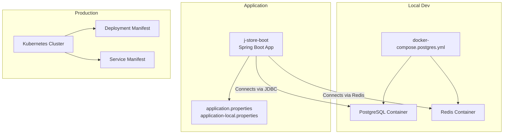
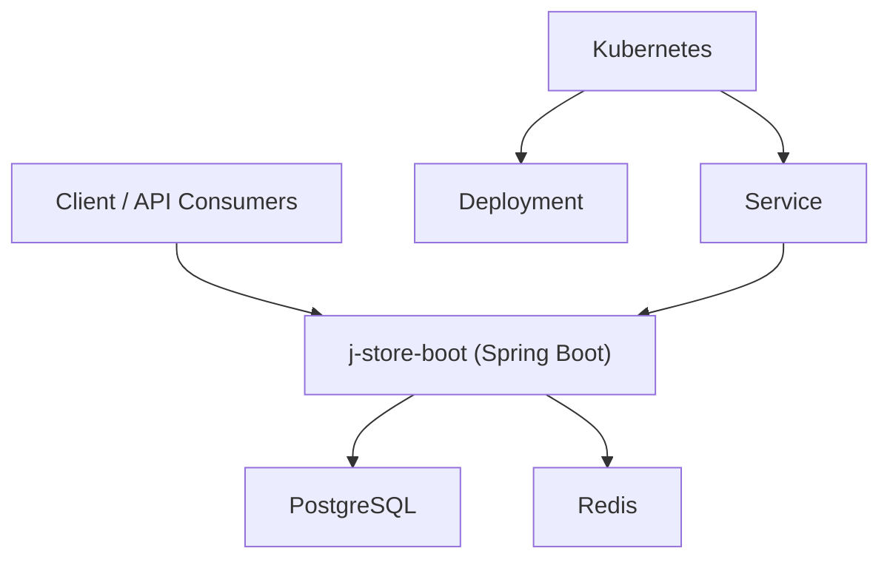
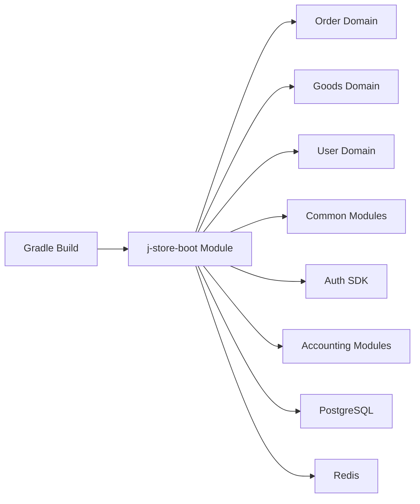

# Deployment and Operations

<cite>
**Referenced Files in This Document**
- [README.md](file://README.md)
- [docker-compose.postgres.yml](file://docker-compose.postgres.yml)
- [Dockerfile](file://j-store-boot/Dockerfile)
- [k8s-deployment.yaml](file://j-store-boot/k8s-deployment.yaml)
- [k8s-service.yaml](file://j-store-boot/k8s-service.yaml)
- [application.properties](file://j-store-boot/src/main/resources/application.properties)
- [application-local.properties](file://j-store-boot/src/main/resources/application-local.properties)
- [build.gradle.kts](file://j-store-boot/build.gradle.kts)
- [gradle.properties](file://gradle.properties)
- [01-init.sql](file://docker/postgres/init/01-init.sql)
- [V20260507__baseline_j_store_boot_schema.sql](file://j-store-boot/src/main/resources/db/migration/V20260507__baseline_j_store_boot_schema.sql)
- [V20260731__order_status_dimensions.sql](file://j-store-boot/src/main/resources/db/migration/V20260731__order_status_dimensions.sql)
- [V20260803__order_after_sale_aggregate.sql](file://j-store-boot/src/main/resources/db/migration/V20260803__order_after_sale_aggregate.sql)
</cite>

## Table of Contents
1. [Introduction](#introduction)
2. [Project Structure](#project-structure)
3. [Core Components](#core-components)
4. [Architecture Overview](#architecture-overview)
5. [Detailed Component Analysis](#detailed-component-analysis)
6. [Dependency Analysis](#dependency-analysis)
7. [Performance Considerations](#performance-considerations)
8. [Troubleshooting Guide](#troubleshooting-guide)
9. [Conclusion](#conclusion)
10. [Appendices](#appendices)

## Introduction
This document provides comprehensive deployment and operations guidance for J-Store, focusing on containerization with Docker and docker-compose for local development, Kubernetes manifests for production, environment-specific configuration, database setup and migrations, monitoring/logging considerations, health checks, operational metrics, scaling, resource allocation, performance tuning, troubleshooting, and maintenance procedures.

## Project Structure
J-Store is a multi-module Spring Boot application. The boot module packages the runtime image and includes Kubernetes manifests. Local infrastructure (PostgreSQL and Redis) is defined via docker-compose. Application properties are split across profiles to support different environments.

**Diagram sources**
- [docker-compose.postgres.yml:1-40](file://docker-compose.postgres.yml#L1-L40)
- [application.properties:1-11](file://j-store-boot/src/main/resources/application.properties#L1-L11)
- [application-local.properties:1-43](file://j-store-boot/src/main/resources/application-local.properties#L1-L43)
- [k8s-deployment.yaml:1-31](file://j-store-boot/k8s-deployment.yaml#L1-L31)
- [k8s-service.yaml:1-13](file://j-store-boot/k8s-service.yaml#L1-L13)

**Section sources**
- [README.md:1-53](file://README.md#L1-L53)
- [docker-compose.postgres.yml:1-40](file://docker-compose.postgres.yml#L1-L40)
- [application.properties:1-11](file://j-store-boot/src/main/resources/application.properties#L1-L11)
- [application-local.properties:1-43](file://j-store-boot/src/main/resources/application-local.properties#L1-L43)
- [k8s-deployment.yaml:1-31](file://j-store-boot/k8s-deployment.yaml#L1-L31)
- [k8s-service.yaml:1-13](file://j-store-boot/k8s-service.yaml#L1-L13)

## Core Components
- Docker Image: Built from an Amazon Corretto 21 base, copies the Spring Boot jar and runs it as the entrypoint.
- Local Infrastructure: PostgreSQL and Redis containers managed by docker-compose with health checks and persistent volumes.
- Configuration: Spring profiles control environment-specific settings; Flyway manages schema migrations.
- Kubernetes: A Deployment and Service manifest define how the app runs and is exposed in a cluster.

Key responsibilities:
- j-store-boot: Aggregates domain modules and exposes the application runtime.
- docker-compose: Orchestrates local data stores.
- Kubernetes manifests: Define desired state for production workloads.

**Section sources**
- [Dockerfile:1-5](file://j-store-boot/Dockerfile#L1-L5)
- [docker-compose.postgres.yml:1-40](file://docker-compose.postgres.yml#L1-L40)
- [application.properties:1-11](file://j-store-boot/src/main/resources/application.properties#L1-L11)
- [application-local.properties:1-43](file://j-store-boot/src/main/resources/application-local.properties#L1-L43)
- [k8s-deployment.yaml:1-31](file://j-store-boot/k8s-deployment.yaml#L1-L31)
- [k8s-service.yaml:1-13](file://j-store-boot/k8s-service.yaml#L1-L13)

## Architecture Overview
The system consists of a Spring Boot application that connects to PostgreSQL and Redis. Locally, these are provided via docker-compose. In production, the application runs inside Kubernetes with a Deployment and Service.

[No sources needed since this diagram shows conceptual workflow, not actual code structure]

## Detailed Component Analysis

### Docker Containerization
- Base image: Amazon Corretto 21 Alpine headless.
- Artifact: Copies the built jar into the image and sets the Java entrypoint.
- Volume: Exposes /tmp for temporary files.

Operational notes:
- Ensure the build produces a single executable jar at build/libs/*.jar before building the image.
- Use appropriate JVM flags via environment variables or command overrides when running in containers.

**Section sources**
- [Dockerfile:1-5](file://j-store-boot/Dockerfile#L1-L5)

### Local Development with docker-compose
- Services:
  - PostgreSQL: Custom image based on postgres:16-alpine with init scripts applied at startup.
  - Redis: Official redis:7-alpine image.
- Health checks: Both services include health checks for readiness.
- Persistence: PostgreSQL data persisted via a named volume.
- Ports: PostgreSQL mapped to host port 30432; Redis mapped to 6379.

Usage:
- Start services using the provided compose file.
- Stop services and remove volumes as needed.

**Section sources**
- [docker-compose.postgres.yml:1-40](file://docker-compose.postgres.yml#L1-L40)
- [README.md:1-53](file://README.md#L1-L53)

### Kubernetes Deployment
- Deployment:
  - Defines a single replica by default.
  - Uses a container image tag suitable for your registry.
  - Sets CPU/memory requests and limits.
  - Exposes container port 8080.
- Service:
  - Exposes the app via NodePort on port 8080.

Operational notes:
- Adjust replicas and resources according to workload.
- Replace imagePullPolicy and image name for your registry.
- For production, consider ClusterIP service with an Ingress controller instead of NodePort.

**Section sources**
- [k8s-deployment.yaml:1-31](file://j-store-boot/k8s-deployment.yaml#L1-L31)
- [k8s-service.yaml:1-13](file://j-store-boot/k8s-service.yaml#L1-L13)

### Environment-Specific Configuration
- Profiles:
  - Default profile activates local via application.properties.
  - Local profile defines server port, datasource, Hikari pool, Redis, JWT secret, logging level, outbox flag, and merchant id.
- Flyway:
  - Enabled and configured to run migrations from classpath db/migration.
  - Baseline version set to align with existing schema.
  - Validation enabled to ensure migration integrity.

Environment management recommendations:
- Create separate property files per environment (e.g., application-dev.properties, application-prod.properties).
- Externalize secrets (JWT secret, DB credentials) via Kubernetes Secrets or environment variables.
- Keep sensitive values out of repository.

**Section sources**
- [application.properties:1-11](file://j-store-boot/src/main/resources/application.properties#L1-L11)
- [application-local.properties:1-43](file://j-store-boot/src/main/resources/application-local.properties#L1-L43)

### Database Setup and Migrations
- Initial schema:
  - PostgreSQL initialization scripts are included under docker/postgres/init.
  - These scripts are copied into the Postgres image’s entrypoint directory to initialize the database on first run.
- Migration strategy:
  - Flyway is enabled and configured to run migrations from classpath:db/migration.
  - Baseline is set to a specific version to avoid conflicts with pre-existing schema.
  - Validation is enforced to prevent drift.

Migration execution flow:
- On application startup, Flyway scans the configured locations.
- If baseline is required, it applies baseline against the target version.
- Pending migrations are executed in order with validation.

Backup strategies:
- Use native PostgreSQL backups (pg_dump/pg_basebackup) for logical and physical backups.
- Schedule periodic backups and retain versions aligned with compliance requirements.
- Test restore procedures regularly.

**Section sources**
- [01-init.sql:1-200](file://docker/postgres/init/01-init.sql#L1-L200)
- [application.properties:5-11](file://j-store-boot/src/main/resources/application.properties#L5-L11)
- [V20260507__baseline_j_store_boot_schema.sql:1-200](file://j-store-boot/src/main/resources/db/migration/V20260507__baseline_j_store_boot_schema.sql#L1-L200)
- [V20260731__order_status_dimensions.sql:1-200](file://j-store-boot/src/main/resources/db/migration/V20260731__order_status_dimensions.sql#L1-L200)
- [V20260803__order_after_sale_aggregate.sql:1-200](file://j-store-boot/src/main/resources/db/migration/V20260803__order_after_sale_aggregate.sql#L1-L200)

### Monitoring and Logging
- Logging:
  - Root logging level is set to info in local profile.
  - Use structured logging and centralized log aggregation in production.
- Health checks:
  - Liveness/readiness probes should be implemented in the application (e.g., Spring Boot Actuator endpoints).
  - Configure Kubernetes probes to use these endpoints for automatic restarts and traffic routing.
- Metrics:
  - Integrate metrics collection (e.g., Micrometer) and expose metrics endpoints for Prometheus scraping.
  - Export application and JVM metrics to your observability stack.

[No sources needed since this section provides general guidance]

### Scaling and Resource Allocation
- Horizontal scaling:
  - Increase replicas in the Kubernetes Deployment based on CPU/memory utilization and request latency.
- Vertical scaling:
  - Adjust requests and limits in the Deployment to match observed usage patterns.
- Connection pooling:
  - Tune Hikari connection pool size according to concurrency and database capacity.
- Caching:
  - Leverage Redis for caching hot data to reduce database load.

**Section sources**
- [k8s-deployment.yaml:23-29](file://j-store-boot/k8s-deployment.yaml#L23-L29)
- [application-local.properties:6-9](file://j-store-boot/src/main/resources/application-local.properties#L6-L9)

### Performance Tuning
- JVM tuning:
  - Set heap sizes and GC parameters via environment variables or JVM options in the container runtime.
- Database:
  - Ensure adequate indexes and query optimization.
  - Monitor slow queries and adjust configurations like shared_buffers and work_mem as needed.
- Redis:
  - Configure memory policies and eviction strategies appropriate for your cache usage.

[No sources needed since this section provides general guidance]

## Dependency Analysis
Build-time dependencies and toolchain:
- Kotlin and Spring plugins are applied in the boot module.
- Java toolchain is set to a modern JDK version.
- Dependencies include Spring Data JPA, Web, WebFlux, Redis, Flyway, and PostgreSQL driver.

Runtime dependencies:
- PostgreSQL and Redis are external services consumed via JDBC and Redis client respectively.

**Diagram sources**
- [build.gradle.kts:1-84](file://j-store-boot/build.gradle.kts#L1-L84)
- [gradle.properties:1-3](file://gradle.properties#L1-L3)

**Section sources**
- [build.gradle.kts:1-84](file://j-store-boot/build.gradle.kts#L1-L84)
- [gradle.properties:1-3](file://gradle.properties#L1-L3)

## Performance Considerations
- Profile your application under realistic load to identify bottlenecks.
- Use profiling tools (e.g., async-profiler) and correlate with metrics and logs.
- Optimize database queries and leverage caching where appropriate.
- Monitor thread pools, connection pools, and garbage collection behavior.

[No sources needed since this section provides general guidance]

## Troubleshooting Guide
Common issues and resolutions:
- Cannot connect to PostgreSQL:
  - Verify host, port, credentials, and schema settings in application-local.properties.
  - Ensure PostgreSQL container is healthy and reachable.
- Redis connectivity failures:
  - Check Redis host, port, password, and database index.
  - Validate network policies and firewall rules.
- Migration errors:
  - Review Flyway logs for validation failures or missing migrations.
  - Ensure baseline version matches existing schema state.
- High memory usage:
  - Adjust JVM heap settings and monitor GC activity.
  - Inspect Hikari pool sizing and connection leaks.
- Health check failures:
  - Confirm Actuator endpoints are enabled and accessible.
  - Investigate dependency readiness (DB, Redis).

Operational procedures:
- Restart services gracefully using graceful shutdown configuration.
- Perform rolling updates in Kubernetes to minimize downtime.
- Back up databases before applying schema changes.

**Section sources**
- [application-local.properties:1-43](file://j-store-boot/src/main/resources/application-local.properties#L1-L43)
- [application.properties:1-11](file://j-store-boot/src/main/resources/application.properties#L1-L11)

## Conclusion
J-Store’s deployment model leverages Docker for local development and Kubernetes for production. Configuration is profile-driven, and database evolution is managed via Flyway. Proper monitoring, logging, and scaling practices ensure reliable operation. Follow the guidelines in this document to deploy, operate, and maintain J-Store effectively.

## Appendices

### Quick Start Commands
- Start local services:
  - Use the docker-compose file to bring up PostgreSQL and Redis.
- Stop and clean up:
  - Stop services and optionally remove volumes to reset local state.

**Section sources**
- [README.md:12-28](file://README.md#L12-L28)

### Database Initialization Scripts
- PostgreSQL init scripts are included under docker/postgres/init and are applied during container initialization.

**Section sources**
- [01-init.sql:1-200](file://docker/postgres/init/01-init.sql#L1-L200)

### Migration Files
- Baseline and subsequent migrations are located under j-store-boot/src/main/resources/db/migration.

**Section sources**
- [V20260507__baseline_j_store_boot_schema.sql:1-200](file://j-store-boot/src/main/resources/db/migration/V20260507__baseline_j_store_boot_schema.sql#L1-L200)
- [V20260731__order_status_dimensions.sql:1-200](file://j-store-boot/src/main/resources/db/migration/V20260731__order_status_dimensions.sql#L1-L200)
- [V20260803__order_after_sale_aggregate.sql:1-200](file://j-store-boot/src/main/resources/db/migration/V20260803__order_after_sale_aggregate.sql#L1-L200)