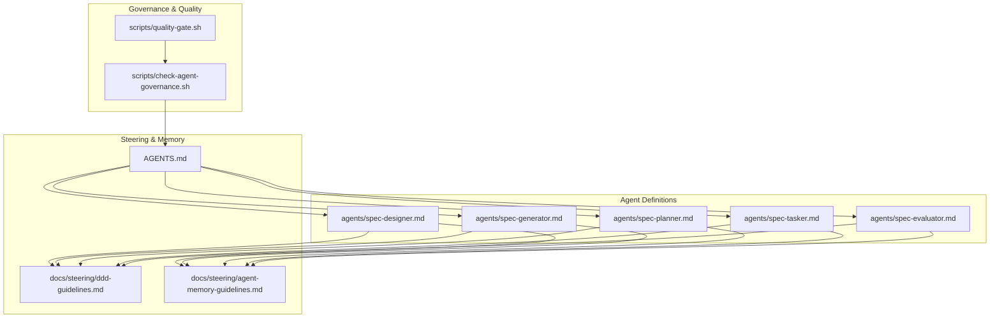
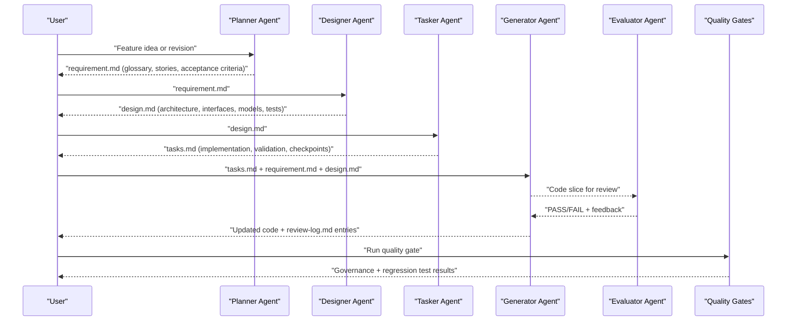
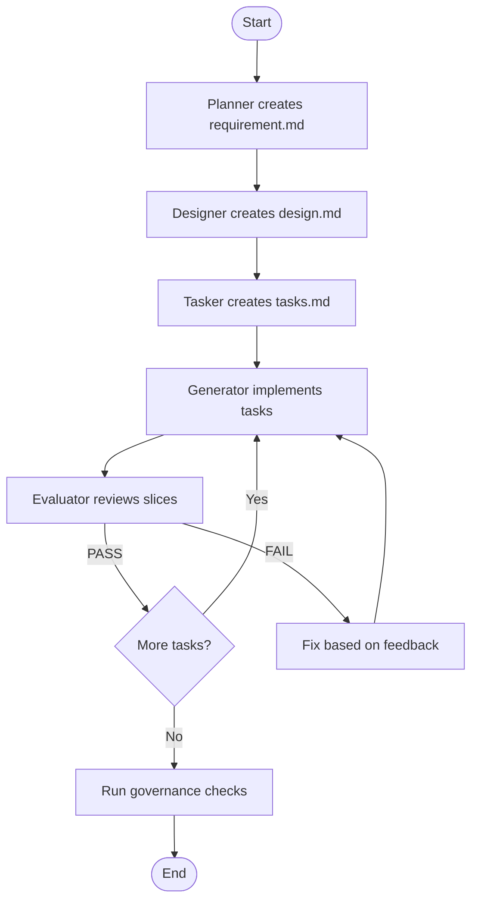
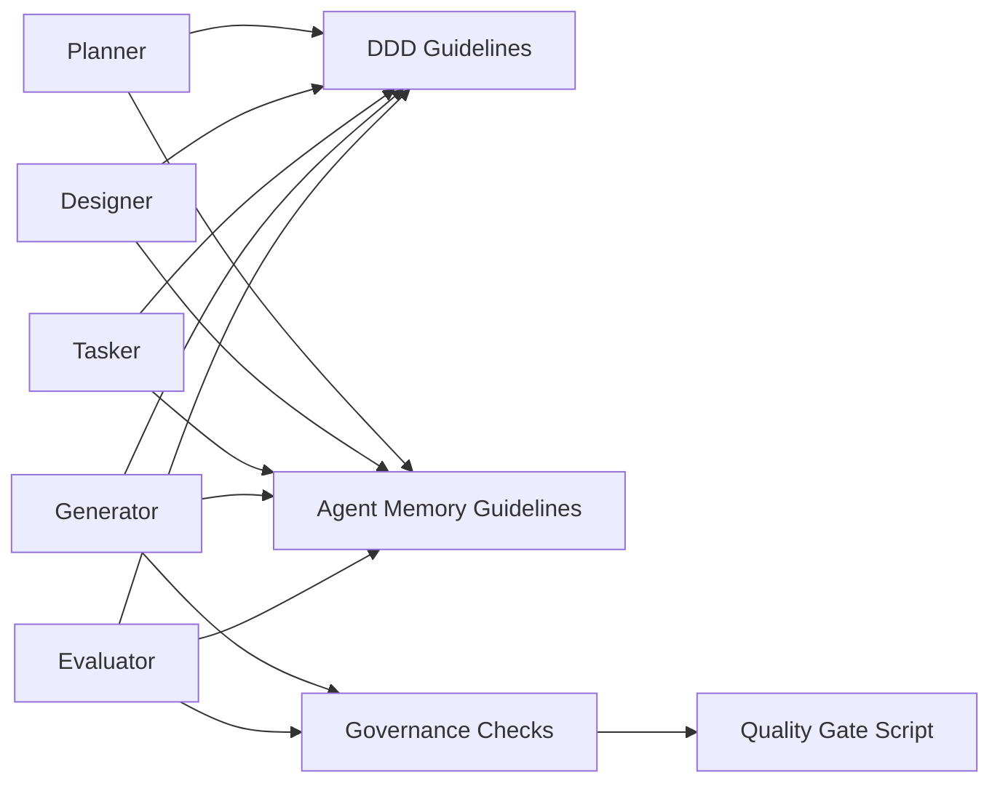

# AI Agents & Development Tools

<cite>
**Referenced Files in This Document**
- [AGENTS.md](file://AGENTS.md)
- [spec-designer.md](file://agents/spec-designer.md)
- [spec-generator.md](file://agents/spec-generator.md)
- [spec-planner.md](file://agents/spec-planner.md)
- [spec-tasker.md](file://agents/spec-tasker.md)
- [spec-evaluator.md](file://agents/spec-evaluator.md)
- [agent-memory-guidelines.md](file://docs/steering/agent-memory-guidelines.md)
- [ddd-guidelines.md](file://docs/steering/ddd-guidelines.md)
- [check-agent-governance.sh](file://scripts/check-agent-governance.sh)
- [quality-gate.sh](file://scripts/quality-gate.sh)
</cite>

## Table of Contents
1. [Introduction](#introduction)
2. [Project Structure](#project-structure)
3. [Core Components](#core-components)
4. [Architecture Overview](#architecture-overview)
5. [Detailed Component Analysis](#detailed-component-analysis)
6. [Dependency Analysis](#dependency-analysis)
7. [Performance Considerations](#performance-considerations)
8. [Troubleshooting Guide](#troubleshooting-guide)
9. [Conclusion](#conclusion)

## Introduction
This document explains how to use AI agents in the J-Store development workflow. It covers agent roles, configuration via prompts and steering documents, governance enforcement, memory management, and practical examples for common tasks such as creating new bounded contexts, implementing features, and refactoring code. The goal is to help both technical and non-technical users understand how agents collaborate to produce high-quality, architecturally consistent code while maintaining traceability from requirements to implementation.

## Project Structure
The agent system is defined by markdown specifications under agents/ and governed by steering documents under docs/steering/. Quality gates and governance checks are enforced through shell scripts. The key files include:
- Agent definitions: spec-designer, spec-generator, spec-planner, spec-tasker, spec-evaluator
- Steering guidelines: DDD architecture, TDD workflow, agent memory organization
- Governance scripts: check-agent-governance.sh and quality-gate.sh
- Unified entrypoint: AGENTS.md

**Diagram sources**
- [spec-designer.md:1-24](file://agents/spec-designer.md#L1-L24)
- [spec-generator.md:1-24](file://agents/spec-generator.md#L1-L24)
- [spec-planner.md:1-24](file://agents/spec-planner.md#L1-L24)
- [spec-tasker.md:1-24](file://agents/spec-tasker.md#L1-L24)
- [spec-evaluator.md:1-24](file://agents/spec-evaluator.md#L1-L24)
- [ddd-guidelines.md:1-178](file://docs/steering/ddd-guidelines.md#L1-L178)
- [agent-memory-guidelines.md:1-35](file://docs/steering/agent-memory-guidelines.md#L1-L35)
- [AGENTS.md:1-66](file://AGENTS.md#L1-L66)
- [check-agent-governance.sh:1-109](file://scripts/check-agent-governance.sh#L1-L109)
- [quality-gate.sh:1-30](file://scripts/quality-gate.sh#L1-L30)

**Section sources**
- [AGENTS.md:1-66](file://AGENTS.md#L1-L66)
- [agent-memory-guidelines.md:1-35](file://docs/steering/agent-memory-guidelines.md#L1-L35)
- [ddd-guidelines.md:1-178](file://docs/steering/ddd-guidelines.md#L1-L178)
- [check-agent-governance.sh:1-109](file://scripts/check-agent-governance.sh#L1-L109)
- [quality-gate.sh:1-30](file://scripts/quality-gate.sh#L1-L30)

## Core Components
The five core agents form a pipeline that transforms ideas into verified code artifacts:
- Planner: Converts feature ideas into structured requirement documents with glossary, user stories, and acceptance criteria.
- Designer: Translates requirements into detailed design documents covering architecture, interfaces, data models, correctness properties, error handling, tests, and clarification questions.
- Tasker: Breaks design into executable tasks including implementation, validation, checkpoints, and ordering dependencies.
- Generator: Implements tasks one at a time using requirement and design as source-of-truth, surfacing blockers before editing and invoking evaluator reviews per slice.
- Evaluator: Reviews generated code/tests against requirements/design/tasks with PASS/FAIL verdicts and actionable feedback; review-only mode.

These agents follow steering guidelines (DDD/TDD), maintain long-term memory via indexed documentation, and enforce governance through automated checks.

**Section sources**
- [spec-planner.md:1-24](file://agents/spec-planner.md#L1-L24)
- [spec-designer.md:1-24](file://agents/spec-designer.md#L1-L24)
- [spec-tasker.md:1-24](file://agents/spec-tasker.md#L1-L24)
- [spec-generator.md:1-24](file://agents/spec-generator.md#L1-L24)
- [spec-evaluator.md:1-24](file://agents/spec-evaluator.md#L1-L24)
- [ddd-guidelines.md:1-178](file://docs/steering/ddd-guidelines.md#L1-L178)
- [agent-memory-guidelines.md:1-35](file://docs/steering/agent-memory-guidelines.md#L1-L35)

## Architecture Overview
The agent architecture orchestrates a requirements-first workflow with strict governance and quality gates. Agents read binding references and steering documents to ensure consistency across outputs.

**Diagram sources**
- [spec-planner.md:1-24](file://agents/spec-planner.md#L1-L24)
- [spec-designer.md:1-24](file://agents/spec-designer.md#L1-L24)
- [spec-tasker.md:1-24](file://agents/spec-tasker.md#L1-L24)
- [spec-generator.md:1-24](file://agents/spec-generator.md#L1-L24)
- [spec-evaluator.md:1-24](file://agents/spec-evaluator.md#L1-L24)
- [quality-gate.sh:1-30](file://scripts/quality-gate.sh#L1-L30)

## Detailed Component Analysis

### Planner Agent
Purpose: Convert feature ideas into structured, testable requirement documents. Outputs include glossary terms, user stories, and formal acceptance criteria following standardized forms.

Key behaviors:
- Iterative loop with user confirmation until approval.
- Codebase-aware drafting aligned with existing domain models and naming conventions.
- Enforces specific acceptance criterion forms (unconditional, event-triggered, state-dependent, conditional, universally quantified).

Configuration and customization:
- Prompt-driven behavior via planner.md reference files.
- Steering alignment with DDD guidelines and project overview.

Practical example: Creating a new bounded context
- Input: Feature idea for a new module.
- Output: docs/spec/<feature>/requirement.md with glossary, stories, and acceptance criteria.
- Validation: Cross-check terms with existing codebase patterns.

**Section sources**
- [spec-planner.md:1-24](file://agents/spec-planner.md#L1-L24)
- [ddd-guidelines.md:1-178](file://docs/steering/ddd-guidelines.md#L1-L178)

### Designer Agent
Purpose: Transform requirement.md into a comprehensive design.md suitable for implementation without guessing.

Key behaviors:
- Covers architecture, interfaces, data models, correctness properties, error handling, tests, and clarification questions.
- Follows designer.md artifact format and quality checks.
- Stops if required reference files are missing or unreadable.

Configuration and customization:
- Uses common.md, clarification.md, designer.md references for discovery and output standards.
- Aligns with DDD constraints and repository steering.

Practical example: Implementing a feature
- Input: Approved requirement.md.
- Output: design.md detailing aggregates, repositories, application services, ACLs, and Outbox integration.
- Validation: Ensures separation of concerns and framework-free application layer.

**Section sources**
- [spec-designer.md:1-24](file://agents/spec-designer.md#L1-L24)
- [ddd-guidelines.md:1-178](file://docs/steering/ddd-guidelines.md#L1-L178)

### Tasker Agent
Purpose: Convert design.md into an executable tasks.md with implementation, validation, checkpoint tasks, and dependency ordering.

Key behaviors:
- Structures tasks to be actionable and verifiable.
- Includes validation steps and checkpoints to ensure incremental progress.
- Clarifies ambiguous planning decisions before generating tasks.

Configuration and customization:
- Uses tasker.md for structure, granularity, and quality checks.
- Aligns with DDD module layout and repository boundaries.

Practical example: Refactoring code
- Input: design.md describing refactoring goals.
- Output: tasks.md with step-by-step refactoring tasks, validation checks, and rollback points.
- Validation: Ensures no cross-aggregate violations and preserves invariants.

**Section sources**
- [spec-tasker.md:1-24](file://agents/spec-tasker.md#L1-L24)
- [ddd-guidelines.md:1-178](file://docs/steering/ddd-guidelines.md#L1-L178)

### Generator Agent
Purpose: Implement pending tasks.md items one at a time using requirement.md and design.md as source-of-truth.

Key behaviors:
- Surfaces implementation-blocking ambiguity before editing.
- Reviews each slice before marking complete and invokes evaluator.
- Maintains review-log.md and updates checkboxes.

Configuration and customization:
- Uses generator.md for readiness checks, evaluation rules, and completion reporting.
- Adheres to DDD coding rules and repository structure.

Practical example: Implementing a feature
- Input: tasks.md + requirement.md + design.md.
- Output: Incremental code changes with tests and updated review-log.md.
- Validation: Each slice reviewed by evaluator before proceeding.

**Section sources**
- [spec-generator.md:1-24](file://agents/spec-generator.md#L1-L24)
- [ddd-guidelines.md:1-178](file://docs/steering/ddd-guidelines.md#L1-L178)

### Evaluator Agent
Purpose: Review generated code or tests against requirement.md, design.md, and tasks.md with PASS/FAIL verdicts and actionable feedback.

Key behaviors:
- Review-only mode; does not modify code.
- Evaluates dimensions such as correctness, adherence to design, test coverage, and governance compliance.
- Routes upstream issues when necessary.

Configuration and customization:
- Uses evaluator.md for review dimensions, verdict rules, and output format.
- Integrates with governance checks and steering guidelines.

Practical example: Code review
- Input: Generated code slices + specification documents.
- Output: Verdicts, feedback, and routed issues for further action.
- Validation: Ensures no drift from approved requirements or design.

**Section sources**
- [spec-evaluator.md:1-24](file://agents/spec-evaluator.md#L1-L24)
- [ddd-guidelines.md:1-178](file://docs/steering/ddd-guidelines.md#L1-L178)

### Conceptual Overview
The agent workflow follows a linear progression from requirements to implementation with continuous evaluation and governance enforcement. Agents rely on shared steering documents and memory guidelines to maintain consistency across sessions.

[No sources needed since this diagram shows conceptual workflow, not actual code structure]

## Dependency Analysis
Agents depend on steering documents and governance scripts to ensure architectural consistency and quality. The dependency chain ensures that outputs remain aligned with DDD principles, testing practices, and security requirements.

**Diagram sources**
- [ddd-guidelines.md:1-178](file://docs/steering/ddd-guidelines.md#L1-L178)
- [agent-memory-guidelines.md:1-35](file://docs/steering/agent-memory-guidelines.md#L1-L35)
- [check-agent-governance.sh:1-109](file://scripts/check-agent-governance.sh#L1-L109)
- [quality-gate.sh:1-30](file://scripts/quality-gate.sh#L1-L30)

**Section sources**
- [ddd-guidelines.md:1-178](file://docs/steering/ddd-guidelines.md#L1-L178)
- [agent-memory-guidelines.md:1-35](file://docs/steering/agent-memory-guidelines.md#L1-L35)
- [check-agent-governance.sh:1-109](file://scripts/check-agent-governance.sh#L1-L109)
- [quality-gate.sh:1-30](file://scripts/quality-gate.sh#L1-L30)

## Performance Considerations
To optimize agent performance and productivity:
- Use minimal relevant tests first, then expand based on impact scope.
- Run governance checks early to catch structural and security issues.
- Maintain clear requirement/design/task artifacts to reduce ambiguity and rework.
- Leverage memory guidelines to avoid redundant context loading across sessions.
- Ensure steering documents are up-to-date to prevent misalignment.

[No sources needed since this section provides general guidance]

## Troubleshooting Guide
Common issues and resolutions:
- Missing reference files: Agents stop and report missing paths instead of proceeding from memory.
- Governance failures: Check-agent-governance.sh validates required files, secrets, and version consistency.
- Quality gate failures: quality-gate.sh runs governance, spec-dev contract tests, and Gradle regression tests.
- Drift detection: Conflicts between code, migrations, tests, and approved requirements must be reported and routed to owners.

Resolution steps:
- Verify AGENTS.md indexing and steering document availability.
- Run ./scripts/quality-gate.sh to identify failing checks.
- Address secret leaks, version mismatches, or missing workflows.
- Update memory guidelines and spec artifacts to reflect current state.

**Section sources**
- [AGENTS.md:1-66](file://AGENTS.md#L1-L66)
- [check-agent-governance.sh:1-109](file://scripts/check-agent-governance.sh#L1-L109)
- [quality-gate.sh:1-30](file://scripts/quality-gate.sh#L1-L30)

## Conclusion
The J-Store AI agent system provides a structured, governance-enforced workflow for transforming ideas into high-quality code. By leveraging specialized agents, steering guidelines, and automated checks, teams can maintain architectural consistency, ensure code quality, and improve development productivity. The memory system and troubleshooting mechanisms support sustainable collaboration across sessions and contributors.

[No sources needed since this section summarizes without analyzing specific files]