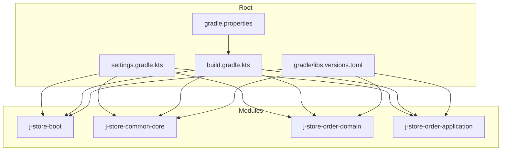
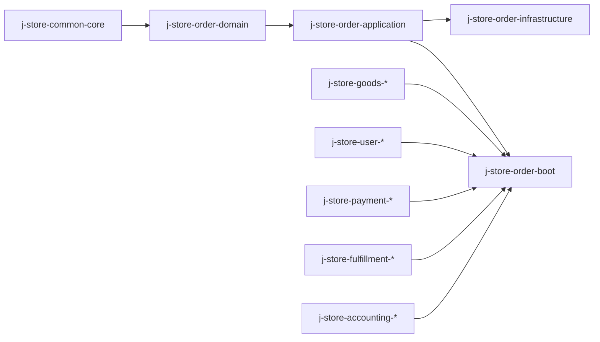
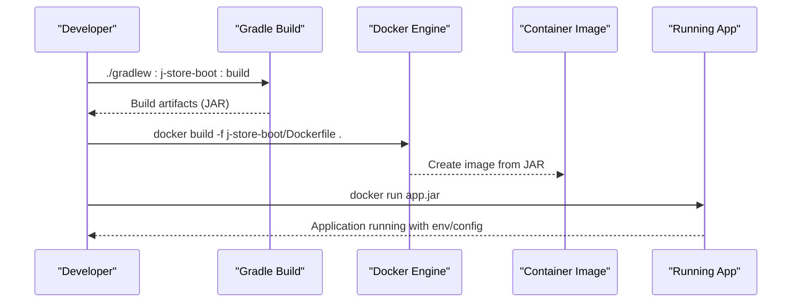
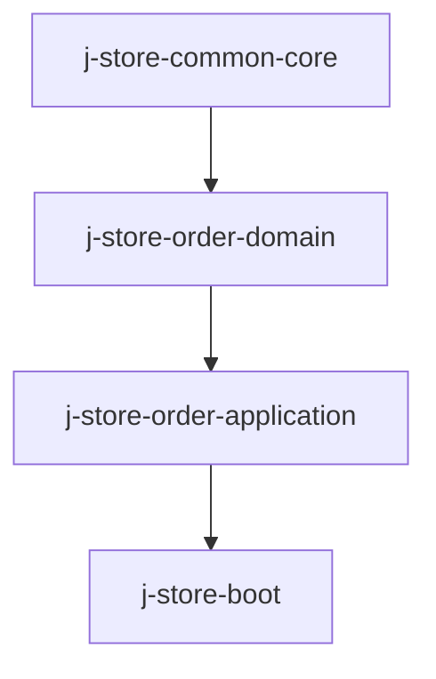

# Build System & Dependency Management

<cite>
**Referenced Files in This Document**
- [settings.gradle.kts](file://settings.gradle.kts)
- [build.gradle.kts](file://build.gradle.kts)
- [gradle.properties](file://gradle.properties)
- [gradle/libs.versions.toml](file://gradle/libs.versions.toml)
- [j-store-boot/build.gradle.kts](file://j-store-boot/build.gradle.kts)
- [j-store-common-core/build.gradle.kts](file://j-store-common-core/build.gradle.kts)
- [j-store-order-domain/build.gradle.kts](file://j-store-order-domain/build.gradle.kts)
- [j-store-order-application/build.gradle.kts](file://j-store-order-application/build.gradle.kts)
- [j-store-boot/Dockerfile](file://j-store-boot/Dockerfile)
- [docker-compose.postgres.yml](file://docker-compose.postgres.yml)
- [j-store-boot/src/main/resources/application.properties](file://j-store-boot/src/main/resources/application.properties)
- [j-store-boot/src/main/resources/application-local.properties](file://j-store-boot/src/main/resources/application-local.properties)
- [gradle/wrapper/gradle-wrapper.properties](file://gradle/wrapper/gradle-wrapper.properties)
</cite>

## Table of Contents
1. [Introduction](#introduction)
2. [Project Structure](#project-structure)
3. [Core Components](#core-components)
4. [Architecture Overview](#architecture-overview)
5. [Detailed Component Analysis](#detailed-component-analysis)
6. [Dependency Analysis](#dependency-analysis)
7. [Performance Considerations](#performance-considerations)
8. [Troubleshooting Guide](#troubleshooting-guide)
9. [Conclusion](#conclusion)
10. [Appendices](#appendices)

## Introduction
This document explains the Gradle-based build system and dependency management for J-Store. It covers the multi-module project structure, centralized version management via libs.versions.toml, environment-specific build configurations, adding new modules, configuring tasks, optimizing performance, managing external dependencies and security updates, Docker containerization, and troubleshooting strategies.

## Project Structure
J-Store is a multi-module Gradle project organized by domain layers (domain, application, infrastructure, boot) and shared libraries. The root settings file declares all included modules, while the root build script centralizes common configuration such as Java toolchain, repositories, code formatting, and BOM generation. Each module has its own build.gradle.kts declaring plugins, dependencies, and task customizations.

**Diagram sources**
- [settings.gradle.kts:14-83](file://settings.gradle.kts#L14-L83)
- [build.gradle.kts:1-64](file://build.gradle.kts#L1-L64)
- [gradle.properties:1-6](file://gradle.properties#L1-L6)
- [gradle/libs.versions.toml:1-111](file://gradle/libs.versions.toml#L1-L111)

**Section sources**
- [settings.gradle.kts:14-83](file://settings.gradle.kts#L14-L83)
- [build.gradle.kts:1-64](file://build.gradle.kts#L1-L64)

## Core Components
- Centralized Version Catalog: All library versions and aliases are defined in libs.versions.toml and referenced across modules using alias(libs.*). This ensures consistent versions and simplifies upgrades.
- Root Build Configuration: Defines Java toolchain (Java 25), repositories (Maven Central, Aliyun mirror, local), Spotless formatting, and CycloneDX BOM generation.
- Module Builds: Each module applies Kotlin JVM plugin and declares dependencies with either api or implementation to control transitive exposure.
- Environment Configurations: Spring Boot profiles manage runtime behavior; local profile configures database, Redis, JWT, messaging mode, and Flyway schema handling.

Key responsibilities:
- settings.gradle.kts: Declares modules and plugin management.
- build.gradle.kts: Global conventions and quality tools.
- gradle/libs.versions.toml: Single source of truth for dependency versions and aliases.
- gradle.properties: JVM args, worker limits, Kotlin execution strategy.
- Application properties: Profile-driven configuration for development and testing.

**Section sources**
- [gradle/libs.versions.toml:1-111](file://gradle/libs.versions.toml#L1-L111)
- [build.gradle.kts:1-64](file://build.gradle.kts#L1-L64)
- [gradle.properties:1-6](file://gradle.properties#L1-L6)
- [j-store-boot/src/main/resources/application.properties:1-11](file://j-store-boot/src/main/resources/application.properties#L1-L11)
- [j-store-boot/src/main/resources/application-local.properties:1-45](file://j-store-boot/src/main/resources/application-local.properties#L1-L45)

## Architecture Overview
The build architecture follows a layered modular design:
- Domain modules encapsulate business logic and expose APIs via api dependencies.
- Application modules orchestrate use cases and depend on domain and contracts.
- Infrastructure modules provide persistence and external integrations.
- Boot modules assemble services and expose endpoints.

[No sources needed since this diagram shows conceptual workflow, not actual code structure]

## Detailed Component Analysis

### Centralized Dependency Management with libs.versions.toml
- Versions section defines canonical versions for frameworks and libraries.
- Libraries section maps aliases to module coordinates and versions.
- Plugins section centralizes plugin IDs and versions.
- Modules reference dependencies via alias(libs.*) ensuring consistency and reducing duplication.

Best practices:
- Always update versions in [versions]; avoid hardcoding versions in module builds.
- Use platform/BOM dependencies where available to align transitive versions.
- Group related libraries under logical sections for readability.

**Section sources**
- [gradle/libs.versions.toml:1-111](file://gradle/libs.versions.toml#L1-L111)

### Root Build Conventions
- Java toolchain set to Java 25 across the project.
- Repositories include Maven Central, Aliyun mirror, and local repository.
- Spotless enforces consistent code style for Java, Kotlin, and Gradle scripts.
- CycloneDX BOM generation configured for runtime classpath to support SBOM workflows.

**Section sources**
- [build.gradle.kts:1-64](file://build.gradle.kts#L1-L64)

### Module-Level Build Patterns
- j-store-common-core exposes core utilities and JSON libraries via api to downstream modules.
- j-store-order-domain uses java-test-fixtures to share test data without leaking implementation details.
- j-store-order-application depends on domain and integration contracts, keeping boundaries clear.
- j-store-boot aggregates multiple domain and boot modules and wires runtime dependencies like JPA, Redis, Flyway, and validation.

**Section sources**
- [j-store-common-core/build.gradle.kts:1-38](file://j-store-common-core/build.gradle.kts#L1-L38)
- [j-store-order-domain/build.gradle.kts:1-28](file://j-store-order-domain/build.gradle.kts#L1-L28)
- [j-store-order-application/build.gradle.kts:1-31](file://j-store-order-application/build.gradle.kts#L1-L31)
- [j-store-boot/build.gradle.kts:1-96](file://j-store-boot/build.gradle.kts#L1-L96)

### Environment-Specific Build and Runtime Configuration
- Default profile activates local configuration.
- Local profile sets server port, datasource pool, Flyway schemas, Redis connection, JWT secret, logging level, outbox enablement, messaging mode, and merchant ID.
- Profiles allow separation of concerns between dev/test/prod environments.

**Section sources**
- [j-store-boot/src/main/resources/application.properties:1-11](file://j-store-boot/src/main/resources/application.properties#L1-L11)
- [j-store-boot/src/main/resources/application-local.properties:1-45](file://j-store-boot/src/main/resources/application-local.properties#L1-L45)

### Docker Build Process and Containerization
- Dockerfile uses Amazon Corretto 25 headless base image, copies built JAR, runs as non-root user, and sets entrypoint to execute the JAR.
- docker-compose defines PostgreSQL and Redis services with health checks, volumes, and environment variables for local development.

**Diagram sources**
- [j-store-boot/Dockerfile:1-6](file://j-store-boot/Dockerfile#L1-L6)
- [docker-compose.postgres.yml:1-40](file://docker-compose.postgres.yml#L1-L40)

**Section sources**
- [j-store-boot/Dockerfile:1-6](file://j-store-boot/Dockerfile#L1-L6)
- [docker-compose.postgres.yml:1-40](file://docker-compose.postgres.yml#L1-L40)

### Adding New Modules
Steps:
1. Add include("module-name") in settings.gradle.kts.
2. Create module directory with src/main/kotlin and src/test/kotlin.
3. Write build.gradle.kts applying kotlin.jvm and necessary plugins.
4. Declare dependencies using alias(libs.*) and project(":other-module") references.
5. If exposing public APIs, use api() for consumers; otherwise use implementation().
6. Configure tests and toolchains consistently with other modules.

**Section sources**
- [settings.gradle.kts:14-83](file://settings.gradle.kts#L14-L83)
- [j-store-order-domain/build.gradle.kts:1-28](file://j-store-order-domain/build.gradle.kts#L1-L28)

### Configuring Build Tasks
- Test execution uses JUnit Platform across modules.
- Tar tasks exclude duplicates to produce clean archives.
- KAPT keeps Java annotation processors enabled for compatibility.
- Spotless integrates formatting checks into the build pipeline.

**Section sources**
- [j-store-boot/build.gradle.kts:85-96](file://j-store-boot/build.gradle.kts#L85-L96)
- [build.gradle.kts:31-57](file://build.gradle.kts#L31-L57)

### Optimizing Build Performance
- Increase JVM heap and metaspace via org.gradle.jvmargs in gradle.properties.
- Limit parallel workers with org.gradle.workers.max to balance CPU usage.
- Enable Kotlin in-process compilation for faster iteration.
- Use Gradle wrapper pinned to a specific distribution for reproducibility.
- Leverage incremental builds by minimizing unnecessary changes and avoiding heavy annotation processing.

**Section sources**
- [gradle.properties:1-6](file://gradle.properties#L1-L6)
- [gradle/wrapper/gradle-wrapper.properties:1-8](file://gradle/wrapper/gradle-wrapper.properties#L1-8)

### Managing External Dependencies and Security Updates
- Centralize versions in libs.versions.toml to simplify audits and upgrades.
- Prefer BOM/platform dependencies to align transitive versions.
- Integrate vulnerability scanning via CycloneDX BOM generation for SBOM analysis.
- Use Dependabot or similar tools to monitor updates and propose PRs.
- Regularly review and update critical libraries (e.g., Spring Boot, Netty, Jackson).

**Section sources**
- [gradle/libs.versions.toml:1-111](file://gradle/libs.versions.toml#L1-L111)
- [build.gradle.kts:59-64](file://build.gradle.kts#L59-L64)

## Dependency Analysis
The following diagram illustrates key module dependencies and their relationships:

**Diagram sources**
- [j-store-common-core/build.gradle.kts:19-28](file://j-store-common-core/build.gradle.kts#L19-L28)
- [j-store-order-domain/build.gradle.kts:11-19](file://j-store-order-domain/build.gradle.kts#L11-L19)
- [j-store-order-application/build.gradle.kts:10-22](file://j-store-order-application/build.gradle.kts#L10-L22)
- [j-store-boot/build.gradle.kts:28-44](file://j-store-boot/build.gradle.kts#L28-L44)

**Section sources**
- [j-store-common-core/build.gradle.kts:19-28](file://j-store-common-core/build.gradle.kts#L19-L28)
- [j-store-order-domain/build.gradle.kts:11-19](file://j-store-order-domain/build.gradle.kts#L11-L19)
- [j-store-order-application/build.gradle.kts:10-22](file://j-store-order-application/build.gradle.kts#L10-L22)
- [j-store-boot/build.gradle.kts:28-44](file://j-store-boot/build.gradle.kts#L28-L44)

## Performance Considerations
- Use api vs implementation judiciously to reduce compile-time dependencies and improve incremental builds.
- Avoid pulling heavy libraries into core modules unless necessary.
- Keep test fixtures isolated to prevent unintended coupling.
- Pin Gradle wrapper version to ensure consistent build times across environments.
- Monitor build logs for slow tasks and consider splitting large modules if needed.

[No sources needed since this section provides general guidance]

## Troubleshooting Guide
Common issues and resolutions:
- Java toolchain mismatch: Ensure Java 25 is installed and configured; verify toolchain settings in build files.
- Dependency resolution failures: Check repository mirrors and network access; validate versions in libs.versions.toml.
- Test discovery failures: Confirm JUnit Platform configuration and test annotations.
- Docker build errors: Verify JAR path and base image availability; ensure non-root user permissions.
- Profile misconfiguration: Validate active profiles and environment variable defaults.

**Section sources**
- [build.gradle.kts:13-17](file://build.gradle.kts#L13-L17)
- [j-store-boot/build.gradle.kts:11-19](file://j-store-boot/build.gradle.kts#L11-L19)
- [j-store-boot/src/main/resources/application.properties:1-11](file://j-store-boot/src/main/resources/application.properties#L1-L11)
- [j-store-boot/Dockerfile:1-6](file://j-store-boot/Dockerfile#L1-L6)

## Conclusion
J-Store’s Gradle build system leverages a centralized version catalog, consistent root conventions, and modular architecture to maintain clarity, scalability, and performance. By adhering to best practices for dependency management, environment configuration, and containerization, teams can streamline development, enhance security posture, and optimize build times even as the codebase grows.

[No sources needed since this section summarizes without analyzing specific files]

## Appendices
- Gradle Wrapper: Pinned to a specific distribution for reproducible builds.
- Docker Compose: Provides PostgreSQL and Redis services with health checks for local development.
- SBOM Generation: CycloneDX configured to generate BOMs for runtime dependencies.

**Section sources**
- [gradle/wrapper/gradle-wrapper.properties:1-8](file://gradle/wrapper/gradle-wrapper.properties#L1-8)
- [docker-compose.postgres.yml:1-40](file://docker-compose.postgres.yml#L1-40)
- [build.gradle.kts:59-64](file://build.gradle.kts#L59-L64)