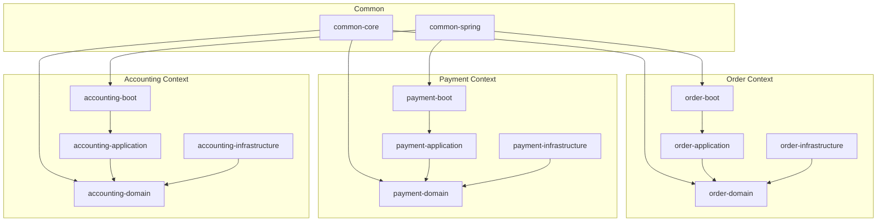
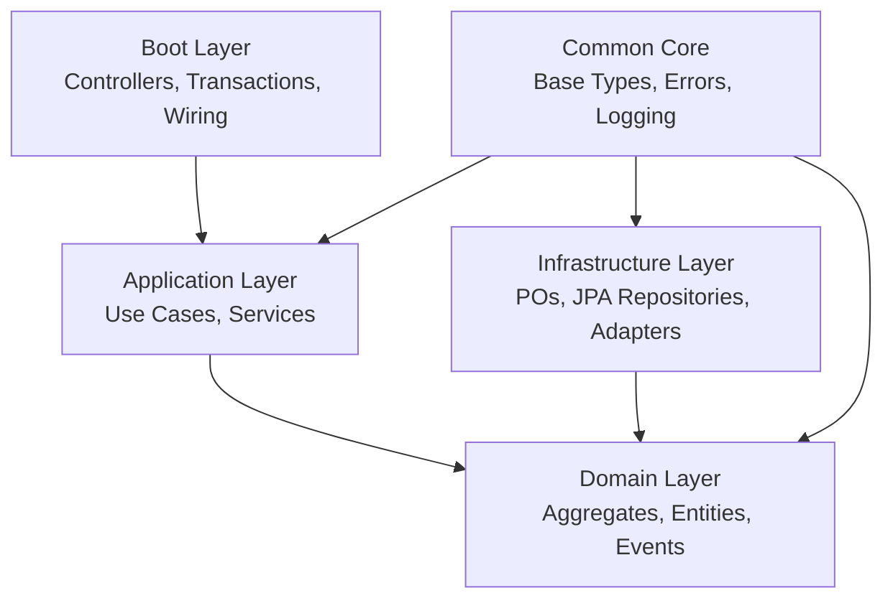
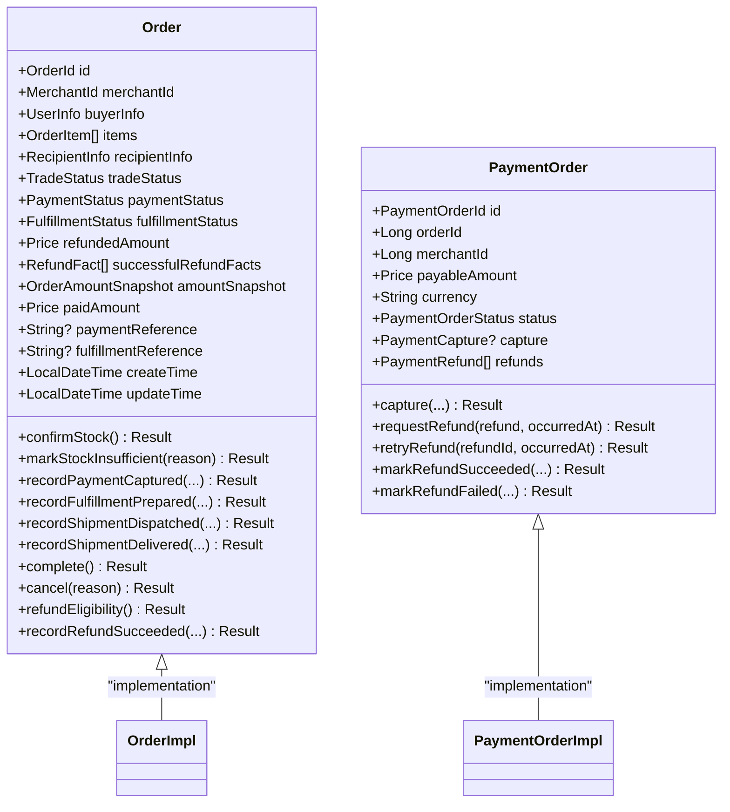
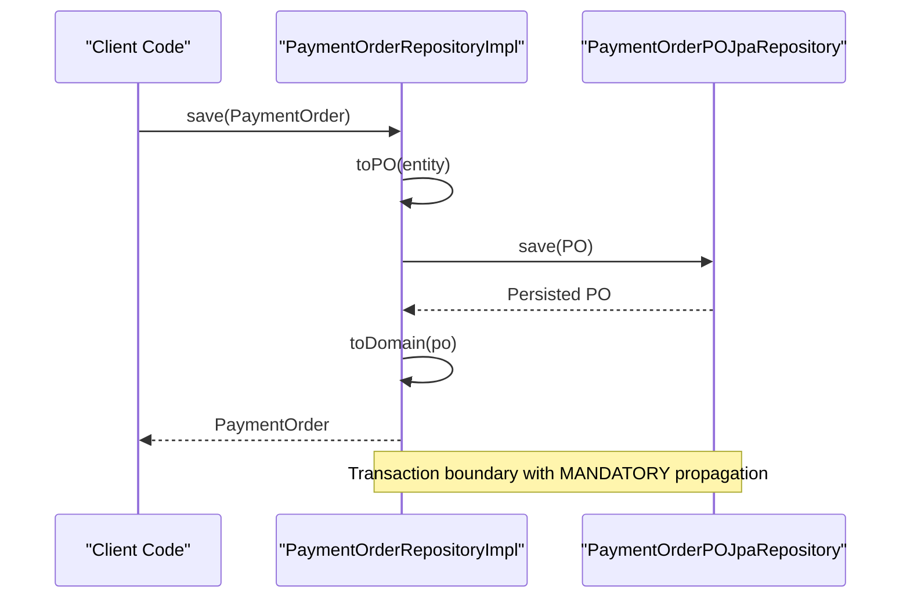
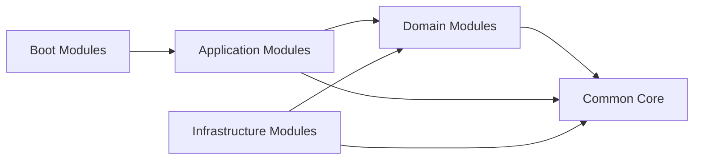

# Coding Standards & Conventions

<cite>
**Referenced Files in This Document**
- [.editorconfig](file://.editorconfig)
- [ddd-guidelines.md](file://docs/steering/ddd-guidelines.md)
- [tdd-guidelines.md](file://docs/steering/tdd-guidelines.md)
- [BusinessError.kt](file://j-store-common-core/src/main/kotlin/com/jstore/common/errors/BusinessError.kt)
- [Logger.kt](file://j-store-common-core/src/main/kotlin/com/jstore/common/logging/Logger.kt)
- [Entity.kt](file://j-store-common-core/src/main/kotlin/com/jstore/common/framework/Entity.kt)
- [AggregateRoot.kt](file://j-store-common-core/src/main/kotlin/com/jstore/common/framework/AggregateRoot.kt)
- [Order.kt](file://j-store-order-domain/src/main/kotlin/com/jstore/order/domain/order/Order.kt)
- [PaymentOrder.kt](file://j-store-payment-domain/src/main/kotlin/com/jstore/payment/domain/payment/PaymentOrder.kt)
- [PaymentOrderRepositoryImpl.kt](file://j-store-payment-infrastructure/src/main/kotlin/com/jstore/payment/domain/payment/PaymentOrderRepositoryImpl.kt)
</cite>

## Table of Contents
1. [Introduction](#introduction)
2. [Project Structure](#project-structure)
3. [Core Components](#core-components)
4. [Architecture Overview](#architecture-overview)
5. [Detailed Component Analysis](#detailed-component-analysis)
6. [Dependency Analysis](#dependency-analysis)
7. [Performance Considerations](#performance-considerations)
8. [Troubleshooting Guide](#troubleshooting-guide)
9. [Conclusion](#conclusion)
10. [Appendices](#appendices)

## Introduction
This document defines the coding standards and conventions for the J-Store platform, focusing on Kotlin code style, DDD implementation patterns, error handling, logging, modular architecture, repository pattern usage, use case design, and testing practices. It synthesizes established guidelines from the project’s steering documents and concrete examples from domain, application, and infrastructure modules to provide a consistent, maintainable, and testable codebase.

## Project Structure
J-Store follows a modular Domain-Driven Design with clear separation between domain, application, infrastructure, and boot layers per bounded context. Each context is split into four Gradle modules:
- j-store-{context}-domain: Pure domain logic (entities, aggregates, value objects, events, repository interfaces).
- j-store-{context}-application: Framework-free orchestration (use cases, application services, integration message handlers).
- j-store-{context}-infrastructure: Persistence and external integrations (POs, JPA repositories, adapters).
- j-store-{context}-boot: Composition, controllers, transactions, and wiring.

Shared frameworks are provided by:
- j-store-common-core: Base types (Entity, AggregateRoot, Identifier, Result, BusinessError, Logger, eventing, messaging).
- j-store-common-spring: Spring-specific utilities and integrations.

**Diagram sources**
- [ddd-guidelines.md:16-47](file://docs/steering/ddd-guidelines.md#L16-L47)

**Section sources**
- [ddd-guidelines.md:16-47](file://docs/steering/ddd-guidelines.md#L16-L47)

## Core Components
The common framework provides foundational building blocks used across all contexts:
- Entity and AggregateRoot base types define identity and consistency boundaries.
- RecordsDomainEvents and EventRecordingAggregateRoot manage pending domain events safely.
- Result<T, E> and BusinessError standardize error propagation without exceptions for expected business failures.
- Logger interface abstracts logging implementations for structured logs.

Key responsibilities:
- Entities expose typed IDs via Identifier.
- Aggregates encapsulate behavior and state transitions; they raise domain events through protected methods.
- Application services orchestrate use cases without framework dependencies.
- Infrastructure adapters implement persistence using POs and JPA repositories.

**Section sources**
- [Entity.kt:1-6](file://j-store-common-core/src/main/kotlin/com/jstore/common/framework/Entity.kt#L1-L6)
- [AggregateRoot.kt:1-40](file://j-store-common-core/src/main/kotlin/com/jstore/common/framework/AggregateRoot.kt#L1-L40)
- [BusinessError.kt:1-22](file://j-store-common-core/src/main/kotlin/com/jstore/common/errors/BusinessError.kt#L1-L22)
- [Logger.kt:1-38](file://j-store-common-core/src/main/kotlin/com/jstore/common/logging/Logger.kt#L1-L38)

## Architecture Overview
The platform enforces strict dependency direction:
- Boot depends on application and infrastructure.
- Application depends only on domain.
- Infrastructure depends on domain (implementing repository interfaces).
- Domain depends only on common-core.

This ensures domain purity and testability, while infrastructure encapsulates technology concerns.

**Diagram sources**
- [ddd-guidelines.md:16-47](file://docs/steering/ddd-guidelines.md#L16-L47)

**Section sources**
- [ddd-guidelines.md:16-47](file://docs/steering/ddd-guidelines.md#L16-L47)

## Detailed Component Analysis

### Kotlin Code Style Guidelines
Formatting and style rules are enforced via EditorConfig:
- UTF-8 encoding, LF line endings, trailing whitespace trimming.
- 4-space indentation, 4 continuation indent size.
- Maximum line length of 100 characters for Java/Kotlin files.

These settings ensure consistent formatting across IDEs and CI pipelines.

**Section sources**
- [.editorconfig:1-14](file://.editorconfig#L1-L14)

### DDD Implementation Patterns
Aggregates and entities follow strict patterns:
- Aggregates implement AggregateRoot and optionally RecordsDomainEvents.
- Value objects are immutable data classes with validation in init blocks.
- Commands use verb phrases with CMD suffix and reside under command packages.
- Domain events use past-tense naming and are raised within aggregates.
- Repository interfaces live in domain; implementations in infrastructure.

Examples:
- Order aggregate exposes business operations like confirmStock, recordPaymentCaptured, complete, cancel, and refund eligibility checks.
- PaymentOrder aggregate manages capture and refund lifecycle with status transitions.

**Diagram sources**
- [Order.kt:1-90](file://j-store-order-domain/src/main/kotlin/com/jstore/order/domain/order/Order.kt#L1-L90)
- [PaymentOrder.kt:1-94](file://j-store-payment-domain/src/main/kotlin/com/jstore/payment/domain/payment/PaymentOrder.kt#L1-L94)

**Section sources**
- [Order.kt:1-90](file://j-store-order-domain/src/main/kotlin/com/jstore/order/domain/order/Order.kt#L1-L90)
- [PaymentOrder.kt:1-94](file://j-store-payment-domain/src/main/kotlin/com/jstore/payment/domain/payment/PaymentOrder.kt#L1-L94)
- [ddd-guidelines.md:75-178](file://docs/steering/ddd-guidelines.md#L75-L178)

### Error Handling Strategies
Business errors are modeled using BusinessError with standardized fields:
- message: Human-readable description
- errorCode: Machine-readable error code
- httpCode: HTTP status code mapping

Common error constants include INVALID_PARAM, ILLEGAL_STATE, INTERNAL_ERROR, CONCURRENT_CONFLICT_EXCEPTION, and OBJECT_NOT_FOUND. Expected failures should return Result<T, BusinessError> rather than throwing exceptions.

Usage patterns:
- Use Result.onFailure for early-return error propagation.
- Define context-specific error objects following CommonBusinessError pattern.
- Avoid exceptions for business logic; reserve them for unexpected system errors.

**Section sources**
- [BusinessError.kt:1-22](file://j-store-common-core/src/main/kotlin/com/jstore/common/errors/BusinessError.kt#L1-L22)
- [ddd-guidelines.md:145-149](file://docs/steering/ddd-guidelines.md#L145-L149)

### Logging Conventions
Logging uses the Logger interface which provides structured logging methods:
- debug/info/warn/error with multiple overloads for messages, formatted strings, and throwables.
- Implementations can be swapped via dependency injection.
- Structured logging should include contextual information like request IDs, user IDs, and operation names.

Best practices:
- Use appropriate log levels for different severity.
- Include correlation IDs for distributed tracing.
- Avoid logging sensitive data like passwords or tokens.

**Section sources**
- [Logger.kt:1-38](file://j-store-common-core/src/main/kotlin/com/jstore/common/logging/Logger.kt#L1-L38)

### Repository Pattern Implementation
Repositories follow a clean separation between interface and implementation:
- Interface defined in domain module with domain-only types.
- Implementation in infrastructure module with PO conversion and JPA integration.
- Transactional semantics enforced via Spring annotations.

Example implementation shows:
- save method with MANDATORY transaction propagation.
- Conversion between domain entities and POs using converter functions.
- Query methods returning domain objects directly.

**Diagram sources**
- [PaymentOrderRepositoryImpl.kt:1-112](file://j-store-payment-infrastructure/src/main/kotlin/com/jstore/payment/domain/payment/PaymentOrderRepositoryImpl.kt#L1-L112)

**Section sources**
- [PaymentOrderRepositoryImpl.kt:1-112](file://j-store-payment-infrastructure/src/main/kotlin/com/jstore/payment/domain/payment/PaymentOrderRepositoryImpl.kt#L1-L112)
- [ddd-guidelines.md:104-108](file://docs/steering/ddd-guidelines.md#L104-L108)

### Use Case Design
Application services orchestrate use cases without containing business logic:
- Load aggregate → execute domain logic → save results.
- Return Result<T, BusinessError> for operations that can fail.
- Keep services framework-free; no Spring stereotypes or transaction annotations.

Transaction management belongs in boot layer with explicit decorators around use-case interfaces.

**Section sources**
- [ddd-guidelines.md:116-123](file://docs/steering/ddd-guidelines.md#L116-L123)
- [ddd-guidelines.md:138-144](file://docs/steering/ddd-guidelines.md#L138-L144)

## Dependency Analysis
The platform maintains strict dependency direction to ensure modularity and testability:

**Diagram sources**
- [ddd-guidelines.md:16-29](file://docs/steering/ddd-guidelines.md#L16-L29)

**Section sources**
- [ddd-guidelines.md:16-29](file://docs/steering/ddd-guidelines.md#L16-L29)

## Performance Considerations
- Prefer value objects over primitives for better type safety and reduced validation overhead.
- Use Result types instead of exceptions for expected failures to avoid exception overhead.
- Implement efficient repository queries with proper indexing strategies.
- Cache frequently accessed read-only data where appropriate.
- Use connection pooling and optimize database transactions for write-heavy operations.

[No sources needed since this section provides general guidance]

## Troubleshooting Guide
Common issues and solutions:
- Business errors: Ensure proper Result handling and error code mapping.
- Transaction boundaries: Verify MANDATORY propagation for repository operations.
- Event publishing: Check Outbox implementation for reliable event delivery.
- Logging: Validate structured logging includes necessary context.

**Section sources**
- [ddd-guidelines.md:145-149](file://docs/steering/ddd-guidelines.md#L145-L149)

## Conclusion
J-Store's coding standards emphasize clean architecture, domain-driven design, and robust error handling. By following these conventions, teams can maintain high-quality, testable, and scalable code across the platform. The modular structure ensures clear separation of concerns while the common framework provides consistent building blocks.

[No sources needed since this section summarizes without analyzing specific files]

## Appendices

### Testing Conventions
Testing follows TDD principles with property-based testing for complex scenarios:
- Unit tests for domain objects covering invariants and state transitions.
- Property tests for value object validation and serialization.
- Integration tests for infrastructure components with real databases.
- Contract tests for API boundaries.

Property-based testing is preferred for:
- Large input spaces with clear invariants.
- Value object validation and formatting.
- State machine illegal transitions.
- Boundary conditions and edge cases.

**Section sources**
- [tdd-guidelines.md:1-64](file://docs/steering/tdd-guidelines.md#L1-L64)