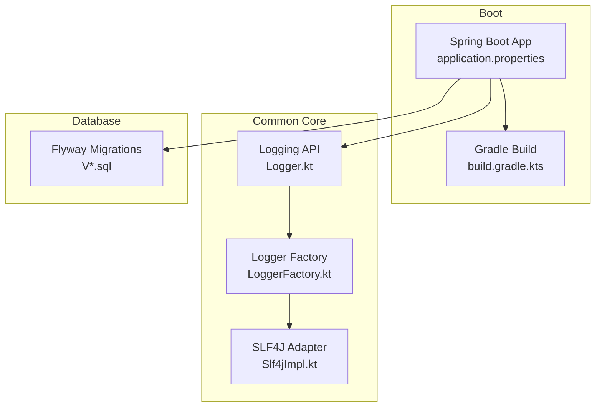
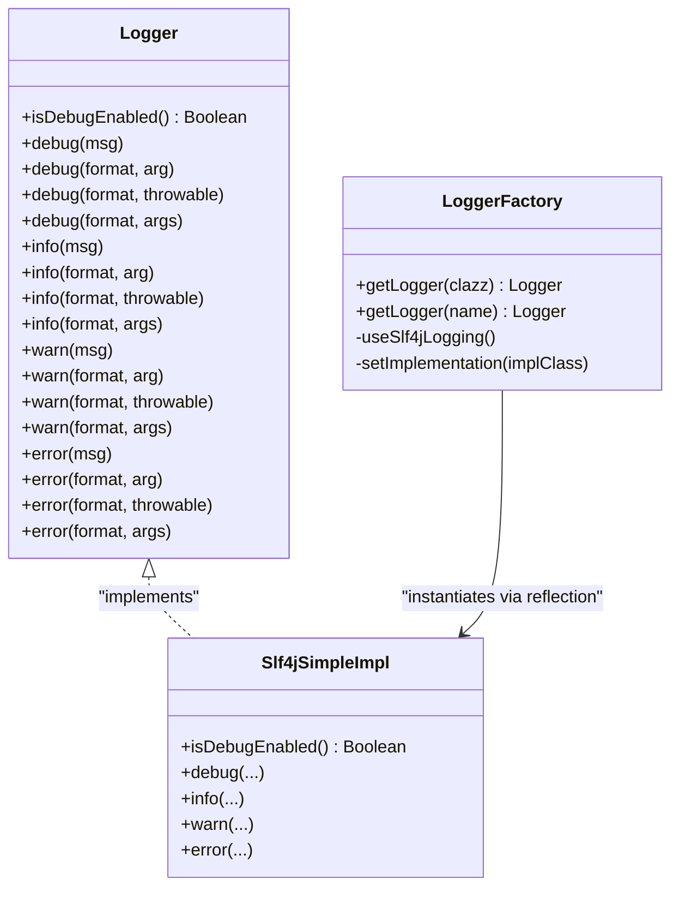
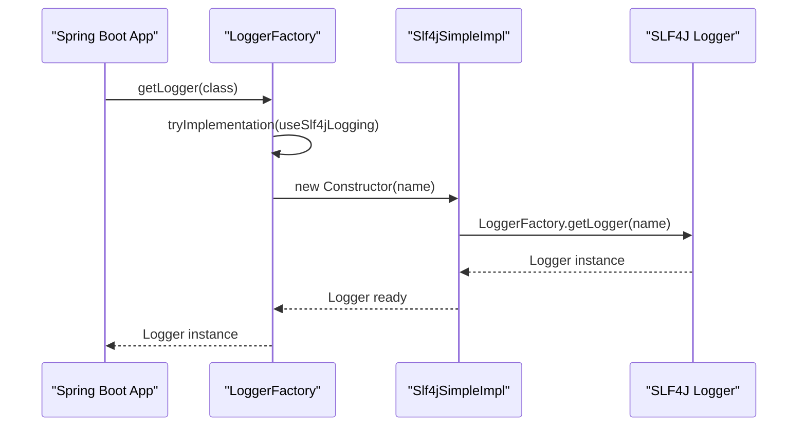
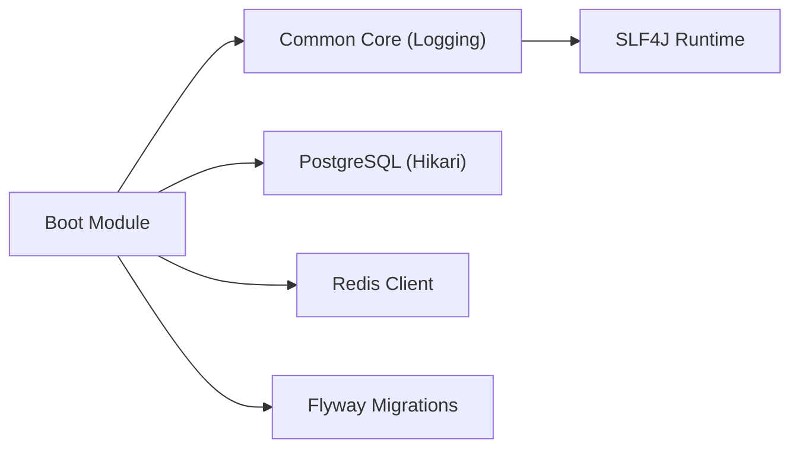

# Debugging & Performance Profiling

<cite>
**Referenced Files in This Document**
- [Logger.kt](file://j-store-common-core/src/main/kotlin/com/jstore/common/logging/Logger.kt)
- [LoggerFactory.kt](file://j-store-common-core/src/main/kotlin/com/jstore/common/logging/LoggerFactory.kt)
- [Slf4jImpl.kt](file://j-store-common-core/src/main/kotlin/com/jstore/common/logging/slf4j/Slf4jImpl.kt)
- [application.properties](file://j-store-boot/src/main/resources/application.properties)
- [application-local.properties](file://j-store-boot/src/main/resources/application-local.properties)
- [build.gradle.kts](file://j-store-boot/build.gradle.kts)
- [V20260731__order_status_dimensions.sql](file://j-store-boot/src/main/resources/db/migration/V20260731__order_status_dimensions.sql)
- [V20260803__order_after_sale_aggregate.sql](file://j-store-boot/src/main/resources/db/migration/V20260803__order_after_sale_aggregate.sql)
</cite>

## Table of Contents
1. Introduction
2. Project Structure
3. Core Components
4. Architecture Overview
5. Detailed Component Analysis
6. Dependency Analysis
7. Performance Considerations
8. Troubleshooting Guide
9. Conclusion

## Introduction
This document provides comprehensive debugging and performance profiling guidelines for J-Store development. It covers:
- Layered debugging strategies for domain logic, application services, and infrastructure components
- Effective use of IDE debugging features with Kotlin and Spring Boot
- Logging best practices using the project’s Logger interface and structured logging patterns
- JVM profiling, database query optimization, and memory analysis techniques
- Common bottlenecks such as N+1 queries, memory leaks, and thread contention
- Monitoring setup, log aggregation, and alerting strategies
- Examples of performance regression detection and optimization techniques

## Project Structure
J-Store is a multi-module Spring Boot application with clear separation between domain, application, boot, and infrastructure layers. The boot module aggregates feature modules and wires configuration, dependencies, and runtime settings.

**Diagram sources**
- [application.properties:1-11](file://j-store-boot/src/main/resources/application.properties#L1-L11)
- [build.gradle.kts:1-96](file://j-store-boot/build.gradle.kts#L1-L96)
- [Logger.kt:1-38](file://j-store-common-core/src/main/kotlin/com/jstore/common/logging/Logger.kt#L1-L38)
- [LoggerFactory.kt:1-65](file://j-store-common-core/src/main/kotlin/com/jstore/common/logging/LoggerFactory.kt#L1-L65)
- [Slf4jImpl.kt:1-191](file://j-store-common-core/src/main/kotlin/com/jstore/common/logging/slf4j/Slf4jImpl.kt#L1-L191)
- [V20260731__order_status_dimensions.sql:1-33](file://j-store-boot/src/main/resources/db/migration/V20260731__order_status_dimensions.sql#L1-L33)
- [V20260803__order_after_sale_aggregate.sql:1-21](file://j-store-boot/src/main/resources/db/migration/V20260803__order_after_sale_aggregate.sql#L1-L21)

**Section sources**
- [application.properties:1-11](file://j-store-boot/src/main/resources/application.properties#L1-L11)
- [build.gradle.kts:1-96](file://j-store-boot/build.gradle.kts#L1-L96)

## Core Components
The logging subsystem is central to observability and debugging across all layers.

- Logger interface defines level-based methods (debug, info, warn, error) with formatting and throwable overloads.
- LoggerFactory selects an implementation at startup and caches a constructor for efficient instantiation.
- Slf4jSimpleImpl adapts SLF4J to the Logger interface and supports both standard and location-aware loggers.

**Diagram sources**
- [Logger.kt:1-38](file://j-store-common-core/src/main/kotlin/com/jstore/common/logging/Logger.kt#L1-L38)
- [LoggerFactory.kt:1-65](file://j-store-common-core/src/main/kotlin/com/jstore/common/logging/LoggerFactory.kt#L1-L65)
- [Slf4jImpl.kt:1-191](file://j-store-common-core/src/main/kotlin/com/jstore/common/logging/slf4j/Slf4jImpl.kt#L1-L191)

**Section sources**
- [Logger.kt:1-38](file://j-store-common-core/src/main/kotlin/com/jstore/common/logging/Logger.kt#L1-L38)
- [LoggerFactory.kt:1-65](file://j-store-common-core/src/main/kotlin/com/jstore/common/logging/LoggerFactory.kt#L1-L65)
- [Slf4jImpl.kt:1-191](file://j-store-common-core/src/main/kotlin/com/jstore/common/logging/slf4j/Slf4jImpl.kt#L1-L191)

## Architecture Overview
At runtime, the Spring Boot application initializes logging through the custom LoggerFactory, which discovers and configures the SLF4J adapter. Configuration files control server behavior, data source pooling, Flyway migrations, Redis connectivity, and logging levels.

**Diagram sources**
- [LoggerFactory.kt:1-65](file://j-store-common-core/src/main/kotlin/com/jstore/common/logging/LoggerFactory.kt#L1-L65)
- [Slf4jImpl.kt:1-191](file://j-store-common-core/src/main/kotlin/com/jstore/common/logging/slf4j/Slf4jImpl.kt#L1-L191)

**Section sources**
- [application.properties:1-11](file://j-store-boot/src/main/resources/application.properties#L1-L11)
- [application-local.properties:1-45](file://j-store-boot/src/main/resources/application-local.properties#L1-L45)

## Detailed Component Analysis

### Logging Best Practices
- Use the Logger interface consistently across domain, application, and infrastructure layers to keep logging decoupled from implementations.
- Prefer parameterized logging to avoid unnecessary string concatenation when debug is disabled.
- Include contextual fields (e.g., correlationId, merchantId, orderId) in logs for distributed tracing.
- Avoid logging sensitive data; mask tokens, passwords, and PII.
- For structured logs, adopt JSON format in production and include key-value pairs for machine parsing.

Key implementation references:
- Logger interface methods and overloads
- LoggerFactory initialization and selection of SLF4J adapter
- SLF4J adapter handling of arrays and throwables

**Section sources**
- [Logger.kt:1-38](file://j-store-common-core/src/main/kotlin/com/jstore/common/logging/Logger.kt#L1-L38)
- [LoggerFactory.kt:1-65](file://j-store-common-core/src/main/kotlin/com/jstore/common/logging/LoggerFactory.kt#L1-L65)
- [Slf4jImpl.kt:1-191](file://j-store-common-core/src/main/kotlin/com/jstore/common/logging/slf4j/Slf4jImpl.kt#L1-L191)

### Application Configuration and Runtime Controls
- Server shutdown is graceful to allow in-flight requests to complete.
- Database connection pooling uses HikariCP with explicit pool size and auto-commit settings.
- Flyway is enabled with baseline-on-migrate and validation on migrate for safe schema evolution.
- Redis client settings include host, port, password, database index, and timeout.
- Root logging level is set to info by default; adjust per environment.

Operational tips:
- Tune Hikari maximum-pool-size based on CPU cores and DB capacity.
- Enable SQL logging selectively during debugging to inspect generated queries.
- Use profiles to separate local, staging, and production configurations.

**Section sources**
- [application.properties:1-11](file://j-store-boot/src/main/resources/application.properties#L1-L11)
- [application-local.properties:1-45](file://j-store-boot/src/main/resources/application-local.properties#L1-L45)

### Database Schema and Query Optimization
- Indexes are defined on frequently filtered columns (e.g., status dimensions and timestamps).
- Migration scripts enforce constraints and maintain historical compatibility where applicable.
- Use EXPLAIN ANALYZE to validate query plans and ensure indexes are used effectively.

Optimization checklist:
- Verify composite indexes match common WHERE clauses and ORDER BY patterns.
- Avoid SELECT *; fetch only required columns.
- Batch updates and reads to reduce round-trips.

**Section sources**
- [V20260731__order_status_dimensions.sql:1-33](file://j-store-boot/src/main/resources/db/migration/V20260731__order_status_dimensions.sql#L1-L33)
- [V20260803__order_after_sale_aggregate.sql:1-21](file://j-store-boot/src/main/resources/db/migration/V20260803__order_after_sale_aggregate.sql#L1-L21)

### Gradle and Build-Time Considerations
- Java toolchain version is explicitly configured for consistent builds.
- Dependencies include Spring Data JPA, Web, Redis, Flyway, and test utilities.
- Test tasks use JUnit Platform; embedded Postgres is available for integration tests.

Build-time tips:
- Pin dependency versions via BOMs to avoid unexpected upgrades.
- Use incremental compilation and caching to speed up iterations.

**Section sources**
- [build.gradle.kts:1-96](file://j-store-boot/build.gradle.kts#L1-L96)

## Dependency Analysis
The logging layer depends on SLF4J at runtime. The boot module orchestrates feature modules and external integrations.

**Diagram sources**
- [build.gradle.kts:1-96](file://j-store-boot/build.gradle.kts#L1-L96)
- [application-local.properties:1-45](file://j-store-boot/src/main/resources/application-local.properties#L1-L45)

**Section sources**
- [build.gradle.kts:1-96](file://j-store-boot/build.gradle.kts#L1-L96)
- [application-local.properties:1-45](file://j-store-boot/src/main/resources/application-local.properties#L1-L45)

## Performance Considerations

### JVM Profiling
- Enable GC logging to identify frequent full GCs and long pauses.
- Use heap dumps and thread dumps during incidents to analyze memory usage and deadlocks.
- Profile CPU hotspots with sampling profilers to locate inefficient code paths.

Recommended flags (example categories):
- GC logging: enable detailed GC output
- Heap dump on OOM: capture diagnostics automatically
- Thread dump support: trigger via signals or management tools

[No sources needed since this section provides general guidance]

### Database Query Optimization
- Identify N+1 queries by enabling SQL logging and reviewing repeated select statements within loops.
- Use JOIN FETCH or batch fetching to reduce round-trips.
- Add or refine indexes to match query predicates and sort orders.

Diagnostic steps:
- Enable Hibernate SQL logging temporarily.
- Analyze slow query logs and execution plans.
- Refactor repository methods to minimize data transfer.

[No sources needed since this section provides general guidance]

### Memory Analysis
- Monitor heap usage trends; watch for steady growth indicating leaks.
- Inspect object retention graphs to find unexpected references.
- Validate that caches do not grow unbounded; implement eviction policies.

[No sources needed since this section provides general guidance]

### Thread Contention
- Track thread states and lock waits to detect contention points.
- Reduce synchronized blocks; prefer concurrent collections and fine-grained locks.
- Review transaction boundaries to avoid holding locks too long.

[No sources needed since this section provides general guidance]

### Monitoring Setup, Log Aggregation, and Alerting
- Centralize logs with a collector and indexer; structure logs for easy querying.
- Define metrics for request latency, error rates, and resource utilization.
- Set alerts for anomalies such as increased error rates, latency spikes, and memory pressure.

[No sources needed since this section provides general guidance]

### Performance Regression Detection
- Establish baselines for key endpoints and critical paths.
- Integrate performance tests into CI to catch regressions early.
- Compare metrics before and after changes; investigate deviations promptly.

[No sources needed since this section provides general guidance]

## Troubleshooting Guide

### Logging Issues
- If no logs appear, verify root logging level and profile-specific overrides.
- Ensure the Logger implementation is initialized; check for exceptions during factory setup.
- Confirm SLF4J bindings are present on the classpath.

Relevant configuration:
- Root logging level
- Profile activation
- Application name and server settings

**Section sources**
- [application.properties:1-11](file://j-store-boot/src/main/resources/application.properties#L1-L11)
- [application-local.properties:1-45](file://j-store-boot/src/main/resources/application-local.properties#L1-L45)
- [LoggerFactory.kt:1-65](file://j-store-common-core/src/main/kotlin/com/jstore/common/logging/LoggerFactory.kt#L1-L65)

### Database Connectivity and Pooling
- Check Hikari pool saturation and connection timeouts under load.
- Validate datasource URL, credentials, and schema settings.
- Review migration logs for failures during startup.

**Section sources**
- [application-local.properties:1-45](file://j-store-boot/src/main/resources/application-local.properties#L1-L45)

### Redis Configuration
- Verify host, port, password, and database index.
- Adjust timeout values if experiencing transient network issues.

**Section sources**
- [application-local.properties:1-45](file://j-store-boot/src/main/resources/application-local.properties#L1-L45)

### Query Performance
- Enable SQL logging to inspect generated queries.
- Use EXPLAIN ANALYZE to validate index usage and plan efficiency.
- Refactor repositories to avoid N+1 patterns.

**Section sources**
- [V20260731__order_status_dimensions.sql:1-33](file://j-store-boot/src/main/resources/db/migration/V20260731__order_status_dimensions.sql#L1-L33)
- [V20260803__order_after_sale_aggregate.sql:1-21](file://j-store-boot/src/main/resources/db/migration/V20260803__order_after_sale_aggregate.sql#L1-L21)

### Build and Environment
- Ensure Java toolchain matches configured version.
- Clean build cache if encountering inconsistent behavior.
- Run tests with embedded Postgres to validate integration scenarios.

**Section sources**
- [build.gradle.kts:1-96](file://j-store-boot/build.gradle.kts#L1-L96)

## Conclusion
Effective debugging and performance profiling in J-Store rely on consistent logging, careful configuration, and disciplined optimization practices. By leveraging the Logger interface, tuning JVM and database settings, and establishing robust monitoring and alerting, teams can quickly diagnose issues and prevent regressions. Adopt structured logging, index-driven query design, and continuous performance testing to maintain high reliability and responsiveness across the system.