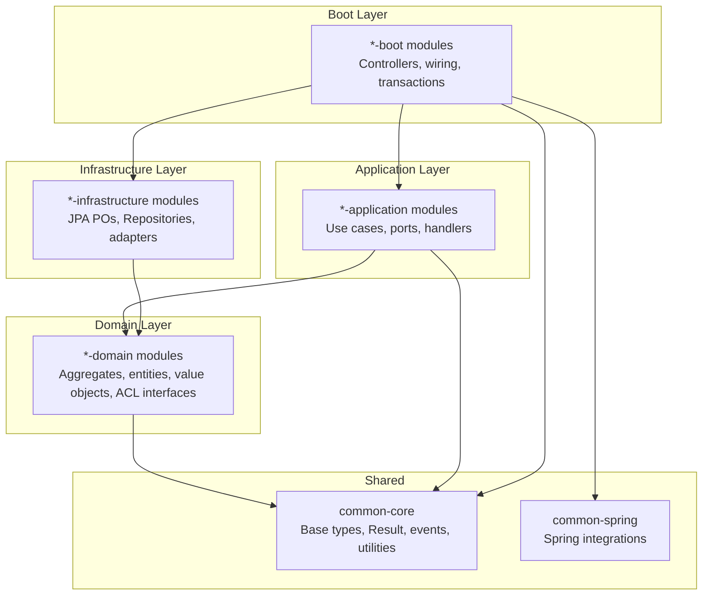
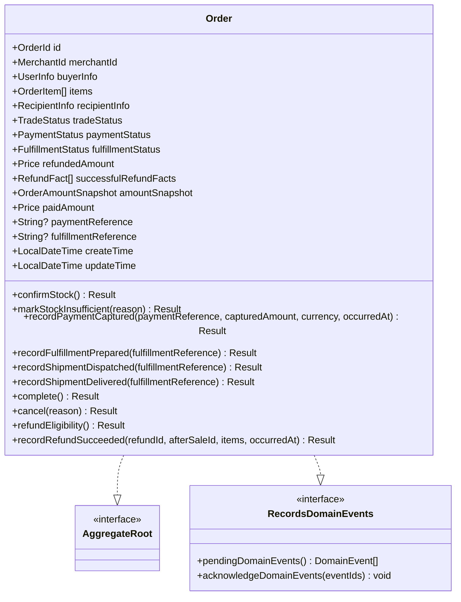
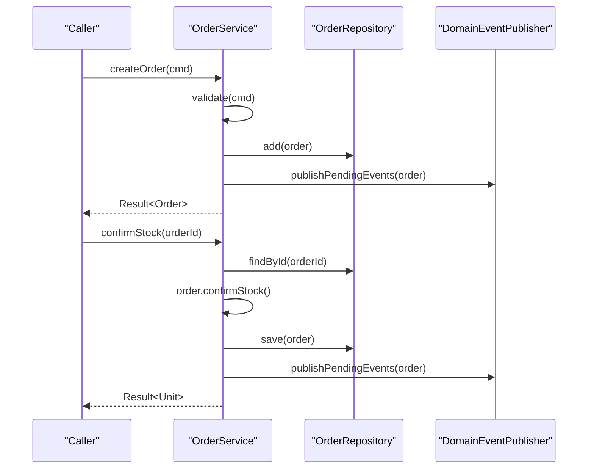
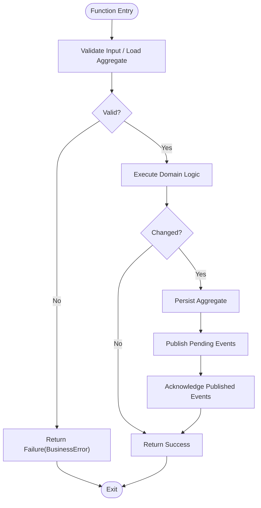
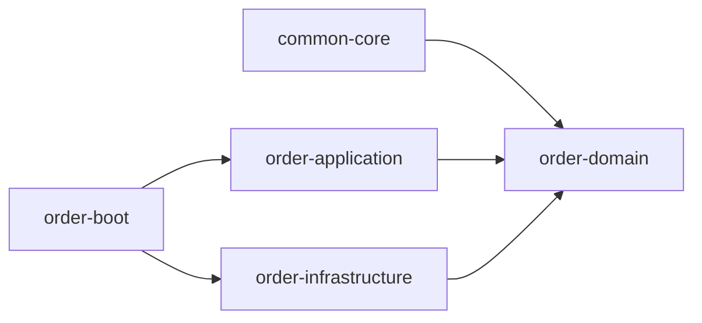

# Development Guide

<cite>
**Referenced Files in This Document**
- [README.md](file://README.md)
- [AGENTS.md](file://AGENTS.md)
- [build.gradle.kts](file://build.gradle.kts)
- [settings.gradle.kts](file://settings.gradle.kts)
- [gradle.properties](file://gradle.properties)
- [gradle/libs.versions.toml](file://gradle/libs.versions.toml)
- [docs/project-overview.md](file://docs/project-overview.md)
- [docs/steering/ddd-guidelines.md](file://docs/steering/ddd-guidelines.md)
- [docs/steering/tdd-guidelines.md](file://docs/steering/tdd-guidelines.md)
- [scripts/quality-gate.sh](file://scripts/quality-gate.sh)
- [.github/pull_request_template.md](file://.github/pull_request_template.md)
- [j-store-common-core/src/main/kotlin/com/jstore/common/framework/AggregateRoot.kt](file://j-store-common-core/src/main/kotlin/com/jstore/common/framework/AggregateRoot.kt)
- [j-store-common-core/src/main/kotlin/com/jstore/common/utils/Result.kt](file://j-store-common-core/src/main/kotlin/com/jstore/common/utils/Result.kt)
- [j-store-order-domain/src/main/kotlin/com/jstore/order/domain/order/Order.kt](file://j-store-order-domain/src/main/kotlin/com/jstore/order/domain/order/Order.kt)
- [j-store-order-application/src/main/kotlin/com/jstore/order/service/OrderService.kt](file://j-store-order-application/src/main/kotlin/com/jstore/order/service/OrderService.kt)
</cite>

## Table of Contents
1. Introduction
2. Project Structure
3. Core Components
4. Architecture Overview
5. Detailed Component Analysis
6. Dependency Analysis
7. Performance Considerations
8. Troubleshooting Guide
9. Conclusion
10. Appendices

## Introduction
This guide provides comprehensive development guidelines for contributing to the J-Store platform. It covers code style conventions, naming standards, and architectural patterns following Domain-Driven Design (DDD). It also documents the development workflow, including feature branching, pull request process, and code review guidelines. The guide explains how AI agents assist with development and governance enforcement, and it includes best practices for writing clean, maintainable code with proper error handling and logging. Testing requirements, coverage expectations, quality gates, performance considerations, debugging strategies, profiling tools, build system, dependency management, module organization, and extension guidelines are all covered.

## Project Structure
J-Store is a Kotlin/Spring Boot multi-module e-commerce backend organized by bounded contexts and DDD layers. Each context typically has four modules: domain, application, infrastructure, and boot. Shared capabilities live in common modules.

Key structural elements:
- Root Gradle configuration centralizes plugins, formatting, repositories, and BOM generation.
- settings.gradle.kts declares all modules and their relationships.
- gradle.properties configures JVM args and compiler behavior.
- docs/project-overview.md describes module layout, dependencies, and runtime setup.
- README.md provides local environment setup, formatting, and verification commands.

```mermaid
graph TB
subgraph "Root Build"
ROOT["Root build.gradle.kts"]
SETTINGS["settings.gradle.kts"]
PROPS["gradle.properties"]
LIBS["gradle/libs.versions.toml"]
end
subgraph "Common"
CORE["j-store-common-core"]
SPRING["j-store-common-spring"]
end
subgraph "Contexts"
ORDER_D["j-store-order-domain"]
ORDER_A["j-store-order-application"]
ORDER_I["j-store-order-infrastructure"]
ORDER_B["j-store-order-boot"]
GOODS_D["j-store-goods-domain"]
GOODS_A["j-store-goods-application"]
GOODS_I["j-store-goods-infrastructure"]
GOODS_B["j-store-goods-boot"]
USER_D["j-store-user-domain"]
USER_A["j-store-user-application"]
USER_I["j-store-user-infrastructure"]
USER_B["j-store-user-boot"]
PAY_D["j-store-payment-domain"]
PAY_A["j-store-payment-application"]
PAY_I["j-store-payment-infrastructure"]
PAY_B["j-store-payment-boot"]
FULF_D["j-store-fulfillment-domain"]
FULF_A["j-store-fulfillment-application"]
FULF_I["j-store-fulfillment-infrastructure"]
FULF_B["j-store-fulfillment-boot"]
ACC_D["j-store-accounting-domain"]
ACC_A["j-store-accounting-application"]
ACC_I["j-store-accounting-infrastructure"]
ACC_B["j-store-accounting-boot"]
end
ROOT --> SETTINGS
ROOT --> PROPS
ROOT --> LIBS
CORE --> ORDER_D
CORE --> GOODS_D
CORE --> USER_D
CORE --> PAY_D
CORE --> FULF_D
CORE --> ACC_D
ORDER_A --> ORDER_D
ORDER_I --> ORDER_D
ORDER_B --> ORDER_A
ORDER_B --> ORDER_I
GOODS_A --> GOODS_D
GOODS_I --> GOODS_D
GOODS_B --> GOODS_A
GOODS_B --> GOODS_I
USER_A --> USER_D
USER_I --> USER_D
USER_B --> USER_A
USER_B --> USER_I
PAY_A --> PAY_D
PAY_I --> PAY_D
PAY_B --> PAY_A
PAY_B --> PAY_I
FULF_A --> FULF_D
FULF_I --> FULF_D
FULF_B --> FULF_A
FULF_B --> FULF_I
ACC_A --> ACC_D
ACC_I --> ACC_D
ACC_B --> ACC_A
ACC_B --> ACC_I
```

**Diagram sources**
- [settings.gradle.kts](file://settings.gradle.kts)
- [build.gradle.kts](file://build.gradle.kts)
- [gradle/libs.versions.toml](file://gradle/libs.versions.toml)
- [docs/project-overview.md](file://docs/project-overview.md)

**Section sources**
- [README.md](file://README.md)
- [docs/project-overview.md](file://docs/project-overview.md)
- [settings.gradle.kts](file://settings.gradle.kts)
- [build.gradle.kts](file://build.gradle.kts)
- [gradle.properties](file://gradle.properties)
- [gradle/libs.versions.toml](file://gradle/libs.versions.toml)

## Core Components
The platform’s core abstractions and patterns are defined in shared modules and enforced across contexts.

- Aggregate roots and event recording:
  - AggregateRoot marks consistency boundaries; EventRecordingAggregateRoot manages pending domain events with protected raise() and stable ID acknowledgment.
- Result-based error handling:
  - A sealed Result type with Success/Failure and functional combinators replaces exceptions for expected business failures.
- Domain layer purity:
  - Domain modules depend only on common-core; no Spring or infrastructure imports.
- Application services:
  - Framework-free orchestration that loads aggregates, executes domain logic, persists changes, and publishes pending events via Outbox.
- Infrastructure:
  - JPA POs and repository implementations reside here; converters map between POs and domain objects.

Examples of these patterns can be found in:
- Aggregate root base types and event recording
- Result utility functions and combinators
- Order aggregate interface demonstrating domain methods and state projections
- Order application service orchestrating use cases and publishing events

**Section sources**
- [j-store-common-core/src/main/kotlin/com/jstore/common/framework/AggregateRoot.kt](file://j-store-common-core/src/main/kotlin/com/jstore/common/framework/AggregateRoot.kt)
- [j-store-common-core/src/main/kotlin/com/jstore/common/utils/Result.kt](file://j-store-common-core/src/main/kotlin/com/jstore/common/utils/Result.kt)
- [j-store-order-domain/src/main/kotlin/com/jstore/order/domain/order/Order.kt](file://j-store-order-domain/src/main/kotlin/com/jstore/order/domain/order/Order.kt)
- [j-store-order-application/src/main/kotlin/com/jstore/order/service/OrderService.kt](file://j-store-order-application/src/main/kotlin/com/jstore/order/service/OrderService.kt)
- [docs/steering/ddd-guidelines.md](file://docs/steering/ddd-guidelines.md)

## Architecture Overview
J-Store follows DDD with strict dependency direction: boot → application → domain → common-core; boot → infrastructure → domain. Each bounded context is isolated into its own set of modules. Cross-context collaboration uses integration contracts and Outbox messaging.

**Diagram sources**
- [docs/project-overview.md](file://docs/project-overview.md)
- [docs/steering/ddd-guidelines.md](file://docs/steering/ddd-guidelines.md)

**Section sources**
- [docs/project-overview.md](file://docs/project-overview.md)
- [docs/steering/ddd-guidelines.md](file://docs/steering/ddd-guidelines.md)

## Detailed Component Analysis

### Order Domain Model
The Order aggregate encapsulates trade, payment, fulfillment, and after-sale states as parallel business facts. It exposes domain methods for lifecycle transitions and records domain events through the common framework.

**Diagram sources**
- [j-store-order-domain/src/main/kotlin/com/jstore/order/domain/order/Order.kt](file://j-store-order-domain/src/main/kotlin/com/jstore/order/domain/order/Order.kt)
- [j-store-common-core/src/main/kotlin/com/jstore/common/framework/AggregateRoot.kt](file://j-store-common-core/src/main/kotlin/com/jstore/common/framework/AggregateRoot.kt)

**Section sources**
- [j-store-order-domain/src/main/kotlin/com/jstore/order/domain/order/Order.kt](file://j-store-order-domain/src/main/kotlin/com/jstore/order/domain/order/Order.kt)

### Order Application Service
The OrderService orchestrates use cases: load aggregate, execute domain behavior, persist changes, and publish pending events. It returns Result types for expected business failures and avoids framework-specific logic.

**Diagram sources**
- [j-store-order-application/src/main/kotlin/com/jstore/order/service/OrderService.kt](file://j-store-order-application/src/main/kotlin/com/jstore/order/service/OrderService.kt)

**Section sources**
- [j-store-order-application/src/main/kotlin/com/jstore/order/service/OrderService.kt](file://j-store-order-application/src/main/kotlin/com/jstore/order/service/OrderService.kt)

### Error Handling Flow
Business failures are modeled using Result<T, BusinessError>. This flow ensures consistent error propagation without exceptions for expected cases.

**Diagram sources**
- [j-store-common-core/src/main/kotlin/com/jstore/common/utils/Result.kt](file://j-store-common-core/src/main/kotlin/com/jstore/common/utils/Result.kt)
- [j-store-order-application/src/main/kotlin/com/jstore/order/service/OrderService.kt](file://j-store-order-application/src/main/kotlin/com/jstore/order/service/OrderService.kt)

**Section sources**
- [j-store-common-core/src/main/kotlin/com/jstore/common/utils/Result.kt](file://j-store-common-core/src/main/kotlin/com/jstore/common/utils/Result.kt)
- [j-store-order-application/src/main/kotlin/com/jstore/order/service/OrderService.kt](file://j-store-order-application/src/main/kotlin/com/jstore/order/service/OrderService.kt)

### Code Style and Naming Standards
- Use Spotless for Java (Google Java Format AOSP), Kotlin (ktfmt), and Gradle Kotlin DSL.
- Follow DDD naming conventions:
  - Aggregates/entities: business nouns (e.g., Order, Spu)
  - Implementations: Noun + Impl
  - Value objects: business nouns (e.g., Price, PhoneNumber)
  - Commands: verb phrase + CMD/Command
  - Events: past-tense + Event
  - Repositories: Root + Repository / RepositoryImpl
  - Application services: Context + Service
  - Factories: Root + Factory
  - ACL interfaces: External context + Service
  - Persistence objects: Entity + PO
  - JPA repositories: Entity + POJpaRepository
  - Errors: Context + Errors

Formatting and pre-push hooks are configured in the root build script and documented in README.

**Section sources**
- [build.gradle.kts](file://build.gradle.kts)
- [README.md](file://README.md)
- [docs/steering/ddd-guidelines.md](file://docs/steering/ddd-guidelines.md)

### Development Workflow and Pull Requests
- Feature branching: Create feature branches per bounded context or cross-cutting change. Keep changes scoped and test-driven.
- Pull request template: Use the provided PR template to document intent, evidence, independent review notes, and residual risk.
- Quality gate: Run the full quality gate script before submitting PRs. It includes governance checks, spec-dev contract tests, and Gradle regression tests.
- Code review guidelines:
  - Ensure DDD compliance and module boundaries.
  - Verify TDD adherence and test coverage.
  - Confirm no credentials or production data in commits.
  - Review migration scripts and rollback strategies where applicable.

**Section sources**
- [.github/pull_request_template.md](file://.github/pull_request_template.md)
- [scripts/quality-gate.sh](file://scripts/quality-gate.sh)
- [docs/steering/tdd-guidelines.md](file://docs/steering/tdd-guidelines.md)

### AI Agents for Development Assistance and Governance
AI agents operate under unified instructions and long-term memory governed by steering documents. They must:
- Read project overview and steering guidelines before working.
- Respect authority sources: code/migrations/tests describe current reality; approved requirement/delta describe intended behavior; design/steering define constraints.
- Enforce security and permissions: no secrets committed, no direct branch modifications, no automated merges/releases, no production writes without explicit authorization.
- Report drift findings when conflicts arise and escalate on continuous failures or unclear requirements.

Agents coordinate tasks, evaluations, planning, and generation while adhering to governance rules.

**Section sources**
- [AGENTS.md](file://AGENTS.md)
- [docs/steering/agent-memory-guidelines.md](file://docs/steering/agent-memory-guidelines.md)
- [docs/steering/agent-governance.md](file://docs/steering/agent-governance.md)

### Testing Requirements and Quality Gates
- Test strategy:
  - Domain: fast unit tests and property tests covering invariants, state transitions, and events.
  - Application: fake repositories or mocked ACLs to verify orchestration and error propagation.
  - Infrastructure: narrow integration tests for PO conversions, JPA queries, transaction boundaries, and Outbox persistence.
  - Boot/Controller: contract tests for authentication, parameter validation, and key wiring.
- Execution:
  - Run minimal relevant tests first, then expand scope.
  - Use the quality gate script for full coverage including governance and spec-dev contract tests.
- Coverage expectations:
  - All new or changed business behaviors must have tests written first.
  - Normal paths, critical failure paths, boundary conditions, and regressions must be covered.
  - Tests should express business intent in names and structure.

**Section sources**
- [docs/steering/tdd-guidelines.md](file://docs/steering/tdd-guidelines.md)
- [scripts/quality-gate.sh](file://scripts/quality-gate.sh)
- [docs/project-overview.md](file://docs/project-overview.md)

### Performance Considerations, Memory Management, and Optimization
- JVM tuning:
  - Configure heap and metaspace via gradle.properties (e.g., -Xmx, -XX:MaxMetaspaceSize).
  - Limit Gradle workers to control resource usage during builds.
- Database and caching:
  - Use PostgreSQL with Flyway migrations; ensure indexes align with query patterns.
  - Leverage Redis for token storage and distributed locks where appropriate.
- Concurrency:
  - Prefer optimistic concurrency control via version fields in aggregates and POs.
  - Avoid long-running transactions; keep write transactions focused on aggregate persistence and Outbox writes.
- I/O and external calls:
  - Use async/non-blocking clients for external services where possible.
  - Apply timeouts and retries with backoff for resilient integrations.
- Profiling and analysis:
  - Use JVM profilers (e.g., VisualVM, Async Profiler) to identify hotspots and memory leaks.
  - Monitor GC logs and tune collectors based on workload characteristics.
  - Profile database queries and adjust indexing or pagination strategies.

[No sources needed since this section provides general guidance]

### Debugging Strategies and Tools
- Logging:
  - Use structured logging with SLF4J; include correlation IDs and contextual metadata.
  - Log at appropriate levels (DEBUG for detailed traces, WARN/ERROR for anomalies).
- Tracing:
  - Integrate distributed tracing (e.g., OpenTelemetry) for cross-service requests.
- Local debugging:
  - Use IDE debuggers with remote attach for containerized services.
  - Enable SQL logging for JPA repositories during development.
- Error diagnosis:
  - Inspect Outbox entries and consumer logs for event delivery issues.
  - Check Redis keys and TTLs for token store and lock contention.

[No sources needed since this section provides general guidance]

### Build System, Dependency Management, and Module Organization
- Build system:
  - Gradle Kotlin DSL with centralized version catalog (libs.versions.toml).
  - Plugins: Kotlin JVM, Spring plugin, Spotless, CycloneDX BOM.
- Dependencies:
  - Centralize versions in libs.versions.toml; avoid ad-hoc version declarations.
  - Use Spring Boot BOM for consistent dependency alignment.
- Module organization:
  - Each bounded context split into domain/application/infrastructure/boot modules.
  - Common modules provide shared types and integrations.
- Packaging:
  - Boot modules produce executable artifacts; root module composes runtimes.
  - Generate BOM for SBOM tracking and vulnerability scanning.

**Section sources**
- [build.gradle.kts](file://build.gradle.kts)
- [gradle/libs.versions.toml](file://gradle/libs.versions.toml)
- [settings.gradle.kts](file://settings.gradle.kts)
- [docs/project-overview.md](file://docs/project-overview.md)

### Extending the Framework and Adding New Bounded Contexts
To add a new bounded context:
- Create modules:
  - j-store-{context}-domain: pure domain model, repositories interfaces, ACL interfaces.
  - j-store-{context}-application: use-case ports, orchestration services, message handlers.
  - j-store-{context}-infrastructure: JPA POs, repository implementations, adapters.
  - j-store-{context}-boot: controllers, transaction decorators, Spring wiring.
- Register modules in settings.gradle.kts.
- Define domain abstractions using common-core base types (AggregateRoot, Result, DomainEvent).
- Implement Outbox integration for event publishing; ensure transactional boundaries in boot.
- Add Flyway migrations under the appropriate module’s resources/db/migration.
- Write tests following TDD guidelines; include property tests for value objects and invariants.
- Update documentation and steering docs if architectural decisions change.

**Section sources**
- [docs/steering/ddd-guidelines.md](file://docs/steering/ddd-guidelines.md)
- [docs/project-overview.md](file://docs/project-overview.md)
- [settings.gradle.kts](file://settings.gradle.kts)

## Dependency Analysis
Module dependencies follow strict DDD boundaries. Domain modules depend only on common-core; application and infrastructure modules depend on domain; boot modules compose application and infrastructure.

**Diagram sources**
- [settings.gradle.kts](file://settings.gradle.kts)
- [docs/project-overview.md](file://docs/project-overview.md)

**Section sources**
- [settings.gradle.kts](file://settings.gradle.kts)
- [docs/project-overview.md](file://docs/project-overview.md)

## Performance Considerations
- JVM and Gradle tuning:
  - Adjust heap size and metaspace in gradle.properties.
  - Limit worker threads to prevent resource contention during builds.
- Database optimization:
  - Index frequently queried columns; use pagination and projection queries.
  - Monitor slow queries and optimize with EXPLAIN plans.
- Caching strategies:
  - Cache read-heavy data with Redis; implement cache invalidation policies.
- Concurrency:
  - Use optimistic locking to avoid deadlocks; batch updates where possible.
- Profiling:
  - Use JVM profilers and APM tools to identify bottlenecks.
  - Analyze GC behavior and tune collectors accordingly.

[No sources needed since this section provides general guidance]

## Troubleshooting Guide
- Common issues:
  - Outbox not publishing: check event acknowledgment and publisher configuration.
  - Transaction rollbacks losing events: ensure pending events are persisted within the same transaction.
  - Redis connectivity failures: verify connection strings and firewall rules.
  - Migration conflicts: review Flyway history and schema versions.
- Debugging steps:
  - Enable SQL logging for JPA repositories.
  - Inspect Outbox tables and consumer logs.
  - Use thread dumps and heap dumps for performance issues.
- Security checks:
  - Scan for secrets using .gitleaksignore and CI pipelines.
  - Rotate any exposed credentials immediately.

**Section sources**
- [docs/project-overview.md](file://docs/project-overview.md)
- [README.md](file://README.md)

## Conclusion
This guide outlines the development practices, architecture, and workflows essential for contributing effectively to the J-Store platform. By adhering to DDD principles, TDD practices, and governance rules, teams can maintain high-quality, scalable, and secure codebases. The modular structure and shared abstractions enable consistent extensions and integrations across bounded contexts.

[No sources needed since this section summarizes without analyzing specific files]

## Appendices
- Local environment setup: Refer to README.md for Docker Compose and .env configuration.
- Formatting commands: Use Spotless tasks as documented in README.md.
- Quality gate execution: Run scripts/quality-gate.sh for comprehensive checks.

**Section sources**
- [README.md](file://README.md)
- [scripts/quality-gate.sh](file://scripts/quality-gate.sh)